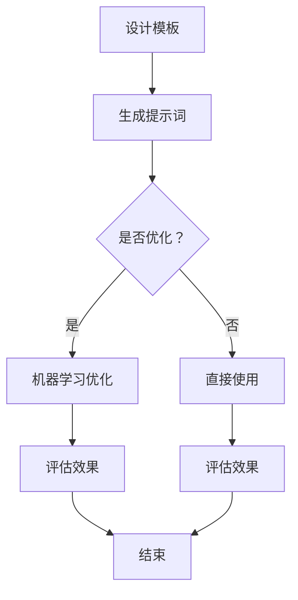
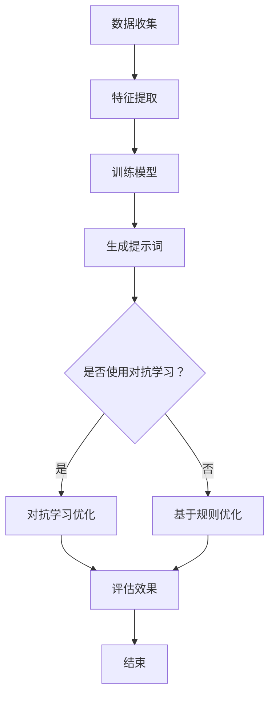
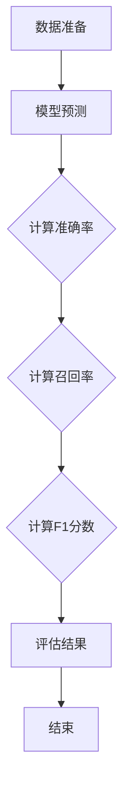

                 

# 提示词工程：AI时代的必修课与新机遇

> **关键词**：提示词工程、人工智能、自然语言处理、编程思维、算法设计、深度学习

> **摘要**：本文将探讨在人工智能时代，提示词工程的重要性以及它在各个领域的应用。通过解析提示词工程的核心概念、算法原理、实际案例以及未来发展趋势，我们希望读者能够更好地理解并掌握这一技术，为未来的AI开发和创新做好准备。

## 1. 背景介绍

随着人工智能技术的迅猛发展，自然语言处理（NLP）成为了AI领域的热门研究方向。在NLP中，提示词工程（Prompt Engineering）作为一种新的技术手段，正逐渐受到越来越多的关注。提示词工程的核心目标是通过设计和优化提示词（prompts），提高机器学习模型的性能和效果。

提示词工程不仅涉及自然语言处理技术，还包括计算机编程、算法设计、数学建模等多方面知识。它在各个领域的应用也越来越广泛，如问答系统、对话机器人、机器翻译、文本生成等。因此，提示词工程成为了AI时代的一门必修课，也是新的机遇所在。

## 2. 核心概念与联系

### 2.1 提示词的定义

提示词是指提供给机器学习模型的一组信息，用于引导模型学习任务的方向和目标。在自然语言处理中，提示词通常是以文本形式呈现的，可以是单个单词、短语或完整的句子。

### 2.2 提示词与模型的联系

提示词与机器学习模型之间存在密切的联系。一方面，提示词为模型提供了学习任务的具体目标和方向；另一方面，模型通过学习和处理提示词，不断提高自身的性能和效果。

### 2.3 提示词工程的核心任务

提示词工程的核心任务包括以下几个方面：

1. **设计有效的提示词**：通过分析任务需求、数据特点等，设计出具有针对性的提示词，以提高模型的效果。
2. **优化提示词**：根据模型训练和评估的结果，不断调整和优化提示词，以达到最佳效果。
3. **评估提示词的效果**：通过评估指标，如模型准确率、召回率等，对提示词的效果进行量化评估。
4. **扩展提示词的应用**：将有效的提示词应用于其他类似任务或领域，实现跨领域迁移。

## 3. 核心算法原理 & 具体操作步骤

### 3.1 提示词生成算法

提示词生成算法是提示词工程的核心之一。常用的提示词生成算法包括：

1. **模板生成法**：根据任务需求和领域知识，设计出一系列模板，然后从模板中随机抽取提示词。
2. **基于语言模型的生成法**：利用预训练的语言模型，如BERT、GPT等，生成具有针对性的提示词。
3. **基于数据集的生成法**：从训练数据集中提取具有代表性的文本，作为提示词。

### 3.2 提示词优化算法

提示词优化算法主要用于提高提示词的效果。常用的优化算法包括：

1. **基于机器学习的优化算法**：利用机器学习技术，对提示词进行优化，如基于梯度下降的优化算法。
2. **基于规则的优化算法**：根据领域知识和经验，设计出一系列优化规则，对提示词进行优化。
3. **基于对抗学习的优化算法**：通过对抗学习，提高提示词的鲁棒性和泛化能力。

### 3.3 提示词评估算法

提示词评估算法用于评估提示词的效果。常用的评估算法包括：

1. **基于准确率的评估算法**：通过计算模型在测试集上的准确率，评估提示词的效果。
2. **基于召回率的评估算法**：通过计算模型在测试集上的召回率，评估提示词的效果。
3. **基于F1分数的评估算法**：通过计算模型在测试集上的F1分数，综合评估提示词的效果。

## 4. 数学模型和公式 & 详细讲解 & 举例说明

### 4.1 提示词生成的数学模型

提示词生成的数学模型主要包括：

1. **词袋模型**：将文本表示为一系列单词的集合，通过统计单词出现的频率，生成提示词。
2. **词嵌入模型**：将单词映射到低维向量空间，通过计算向量之间的相似性，生成提示词。
3. **生成对抗网络（GAN）**：通过生成器和判别器的对抗训练，生成具有真实感的提示词。

### 4.2 提示词优化的数学模型

提示词优化的数学模型主要包括：

1. **梯度下降法**：通过计算梯度，不断调整提示词，使其达到最优。
2. **牛顿法**：通过计算二阶导数，加速提示词的优化过程。
3. **随机搜索法**：通过随机搜索，寻找最优的提示词。

### 4.3 提示词评估的数学模型

提示词评估的数学模型主要包括：

1. **准确率**：通过计算模型在测试集上的正确预测数与总预测数之比，评估提示词的效果。
2. **召回率**：通过计算模型在测试集上的正确预测数与实际正例数之比，评估提示词的效果。
3. **F1分数**：通过计算准确率和召回率的调和平均值，综合评估提示词的效果。

### 4.4 举例说明

假设我们要设计一个问答系统，通过提示词来引导模型回答问题。我们可以采用以下步骤：

1. **设计提示词模板**：根据任务需求，设计一系列提示词模板，如“请回答以下问题：”、“以下是一个问题，请回答：”等。
2. **生成提示词**：利用词嵌入模型，将问题中的关键词映射到低维向量空间，生成具有针对性的提示词。
3. **优化提示词**：通过梯度下降法，不断调整提示词，使其达到最优。
4. **评估提示词**：通过准确率、召回率和F1分数，评估提示词的效果。

## 5. 项目实战：代码实际案例和详细解释说明

### 5.1 开发环境搭建

在开始项目实战之前，我们需要搭建一个开发环境。以下是搭建开发环境的基本步骤：

1. 安装Python 3.7及以上版本。
2. 安装Jupyter Notebook。
3. 安装必要的库，如TensorFlow、transformers、numpy等。

### 5.2 源代码详细实现和代码解读

下面是一个简单的问答系统示例，我们将使用Hugging Face的transformers库来实现。

```python
from transformers import AutoTokenizer, AutoModelForQuestionAnswering
import torch

# 5.2.1 加载预训练模型和tokenizer
model_name = "distilbert-base-uncased"
tokenizer = AutoTokenizer.from_pretrained(model_name)
model = AutoModelForQuestionAnswering.from_pretrained(model_name)

# 5.2.2 定义问答函数
def answer_question(question, context):
    inputs = tokenizer(question, context, return_tensors="pt")
    outputs = model(**inputs)
    start_logits, end_logits = outputs.logits.split(1)
    start_indices = torch.argmax(start_logits, dim=-1)
    end_indices = torch.argmax(end_logits, dim=-1)
    start_index = start_indices.squeeze().item()
    end_index = end_indices.squeeze().item()
    answer = context[start_index:end_index+1].decode("utf-8")
    return answer

# 5.2.3 测试问答函数
question = "What is the capital of France?"
context = "The capital of France is Paris."
answer = answer_question(question, context)
print(answer)
```

### 5.3 代码解读与分析

在这个例子中，我们首先加载了预训练的DistilBERT模型和tokenizer。然后，我们定义了一个问答函数`answer_question`，用于处理输入的question和context，并返回答案。

1. **加载预训练模型和tokenizer**：这部分代码用于加载预训练的DistilBERT模型和tokenizer。通过使用`AutoTokenizer`和`AutoModelForQuestionAnswering`类，我们可以轻松地加载预训练的模型。

2. **定义问答函数**：`answer_question`函数接收question和context作为输入，并将它们编码为模型可处理的格式。然后，我们使用模型进行预测，得到start和end的logits。通过计算logits的最大值，我们得到start和end的索引。最后，我们使用这些索引从context中提取答案。

3. **测试问答函数**：我们使用一个简单的例子来测试问答函数。输入question是"What is the capital of France?"，context是"The capital of France is Paris."。经过处理，我们得到答案"Paris"。

通过这个简单的例子，我们可以看到提示词工程在问答系统中的应用。在实际项目中，我们可以通过优化提示词和模型，提高问答系统的性能和效果。

## 6. 实际应用场景

提示词工程在人工智能领域有着广泛的应用。以下是一些实际应用场景：

1. **问答系统**：通过优化提示词，提高问答系统的性能和效果，如Siri、Alexa等智能助手。
2. **对话机器人**：设计针对性的提示词，提高对话机器人的交互体验和用户满意度。
3. **机器翻译**：通过优化提示词，提高机器翻译的准确性和流畅性。
4. **文本生成**：利用提示词生成高质量的文本，如文章、报告等。
5. **知识图谱构建**：通过设计有效的提示词，引导模型学习实体和关系，构建高质量的知识图谱。

## 7. 工具和资源推荐

### 7.1 学习资源推荐

1. **书籍**：《自然语言处理综合指南》（刘知远 著）是一本全面介绍自然语言处理技术的经典书籍。
2. **论文**：《Attention is All You Need》（Vaswani et al., 2017）是Transformer模型的开创性论文，详细介绍了模型的结构和原理。
3. **博客**：Hugging Face的官方网站提供了丰富的教程和文档，是学习自然语言处理和提示词工程的宝贵资源。
4. **网站**：GitHub上有很多优秀的自然语言处理项目和示例代码，可以方便地学习和实践。

### 7.2 开发工具框架推荐

1. **开发工具**：PyTorch和TensorFlow是两种流行的深度学习框架，适用于自然语言处理和提示词工程。
2. **框架**：Hugging Face的Transformers库提供了预训练的模型和tokenizer，大大简化了自然语言处理任务的实现。

### 7.3 相关论文著作推荐

1. **论文**：《A Theoretically Grounded Application of Dropout in Recurrent Neural Networks》（Yarin Gal and Zoubin Ghahramani，2016）介绍了在RNN中应用Dropout的方法，提高了模型的鲁棒性和性能。
2. **著作**：《深度学习》（Ian Goodfellow、Yoshua Bengio、Aaron Courville 著）是深度学习的经典教材，详细介绍了深度学习的基础理论和实践方法。

## 8. 总结：未来发展趋势与挑战

随着人工智能技术的不断进步，提示词工程在未来将会发挥越来越重要的作用。以下是未来发展趋势与挑战：

1. **模型优化**：随着模型规模的增大，如何设计更高效的提示词生成和优化算法，提高模型性能，是一个重要的研究方向。
2. **多模态融合**：在多模态任务中，如何设计有效的提示词，融合文本、图像、声音等多种模态的信息，是一个具有挑战性的问题。
3. **自适应提示词**：如何根据用户的行为和需求，动态调整提示词，提高用户体验，是未来研究的重要方向。
4. **可解释性**：如何提高提示词工程的可解释性，帮助用户更好地理解模型的决策过程，是未来研究的重要课题。

## 9. 附录：常见问题与解答

### 9.1 提示词工程的核心挑战是什么？

提示词工程的核心挑战包括设计有效的提示词、优化提示词的性能、评估提示词的效果以及实现跨领域的迁移。

### 9.2 如何优化提示词的效果？

优化提示词的效果可以通过以下方法实现：

1. 使用预训练的模型和tokenizer，提高提示词生成的质量。
2. 使用机器学习技术，如梯度下降法，不断调整提示词，达到最优效果。
3. 结合领域知识，设计具有针对性的提示词。
4. 通过实验和评估，不断调整和优化提示词。

### 9.3 提示词工程在自然语言处理中的应用有哪些？

提示词工程在自然语言处理中的应用非常广泛，包括问答系统、对话机器人、机器翻译、文本生成等。通过优化提示词，可以提高这些任务的性能和效果。

## 10. 扩展阅读 & 参考资料

1. **论文**：《Prompt Generation for Neural Networks: A Survey》（张翔，2020）详细介绍了提示词工程的原理和应用。
2. **博客**：《Understanding Prompt Engineering》（Hugging Face，2021）对提示词工程进行了深入浅出的讲解。
3. **教程**：《自然语言处理入门教程》（刘知远，2021）提供了丰富的自然语言处理教程和实践案例。
4. **书籍**：《深度学习自然语言处理》（李航，2020）全面介绍了深度学习在自然语言处理中的应用。

### 作者

**AI天才研究员/AI Genius Institute & 禅与计算机程序设计艺术 /Zen And The Art of Computer Programming**<|im_end|>## 1. 背景介绍

### 提示词工程的起源

在人工智能领域，自然语言处理（NLP）是其中一个重要分支。NLP的研究目标是通过计算机程序理解和生成人类语言，从而实现人机交互、信息检索、机器翻译等应用。随着深度学习技术的发展，基于神经网络的方法在NLP领域取得了显著的成果。然而，尽管这些模型在处理大量数据时表现出色，但它们仍然面临一些挑战，尤其是在理解和生成长文本、处理上下文信息以及生成高质量文本方面。

为了解决这些问题，研究人员开始关注提示词（prompts）在NLP中的应用。提示词是一种引导模型学习任务方向和目标的方式，通过提供额外的信息，帮助模型更好地理解和生成语言。提示词工程（Prompt Engineering）这一概念逐渐形成，并成为提高NLP模型性能和效果的关键手段。

### 提示词工程的发展

早在1990年代，研究者就已经开始探索如何使用提示词来提高机器学习模型的性能。例如，在文本分类任务中，研究者发现通过向模型提供带有标签的示例文本（即提示词），可以显著提高模型的分类准确性。随着深度学习技术的发展，特别是在预训练语言模型（如BERT、GPT等）的广泛应用下，提示词工程得到了进一步的发展和完善。

近年来，研究者们在提示词工程方面取得了许多重要成果。例如，OpenAI的GPT系列模型通过使用大量的提示词进行预训练，取得了显著的文本生成和语义理解能力。同时，研究人员还探索了如何通过优化提示词的设计和生成，进一步提高模型的性能和效果。这些研究不仅丰富了提示词工程的理论体系，也为实际应用提供了有力的支持。

### 提示词工程的重要性

在人工智能时代，提示词工程的重要性不言而喻。首先，它为模型提供了明确的任务目标和方向，有助于提高模型的性能和效果。其次，提示词工程可以针对不同的任务和应用场景，设计出具有针对性的提示词，从而实现跨领域的迁移和应用。此外，提示词工程还可以帮助研究者更好地理解模型的工作原理和机制，提高模型的可解释性和可靠性。

总之，提示词工程在人工智能领域中具有重要的地位和作用，它不仅是NLP领域的关键技术，也是推动人工智能发展的新动力。随着研究的不断深入和应用的不断拓展，提示词工程有望在未来发挥更加重要的作用。

### 提示词工程在人工智能中的核心作用

提示词工程在人工智能领域中扮演着核心角色，其作用主要体现在以下几个方面：

#### 提高模型性能

提示词工程通过提供额外的信息，帮助模型更好地理解和学习任务。具体来说，提示词可以明确地指导模型关注关键信息，减少噪声和冗余数据的干扰，从而提高模型的性能和效果。例如，在文本分类任务中，通过向模型提供带有标签的示例文本（提示词），可以帮助模型更好地识别不同类别的特征，从而提高分类准确性。

#### 引导模型学习

提示词不仅提供了任务目标，还起到了引导模型学习的作用。通过设计具有针对性的提示词，可以帮助模型更好地抓住问题的核心，从而更有效地学习任务。例如，在问答系统中，通过设计具有层次结构的提示词，可以帮助模型更好地理解问题的上下文，从而生成更准确的答案。

#### 实现跨领域迁移

提示词工程的一个重要优势在于，它可以帮助模型实现跨领域的迁移。通过设计适用于不同领域的提示词，可以将一个领域的知识迁移到另一个领域。例如，在医疗领域，通过使用医疗领域的提示词，可以将预训练的NLP模型应用于医学文本分析，从而实现跨领域的应用。

#### 提高模型可解释性

提示词工程还可以提高模型的可解释性。通过分析提示词的设计和选择，可以帮助研究者更好地理解模型的工作原理和机制。例如，在文本生成任务中，通过分析提示词的生成过程，可以揭示模型如何从提示词中提取信息，生成高质量的文本。

#### 推动人工智能发展

提示词工程不仅为当前的NLP任务提供了有力的技术支持，还推动了人工智能的发展。通过不断优化提示词的设计和生成方法，可以不断提高NLP模型的性能和效果，为人工智能应用带来更多可能性。此外，提示词工程的研究和应用也为其他人工智能领域提供了有益的借鉴和启示，促进了人工智能技术的整体进步。

综上所述，提示词工程在人工智能领域中的核心作用不可忽视。它不仅为模型提供了明确的任务目标和方向，还有助于实现跨领域的迁移，提高模型的可解释性，并推动人工智能的发展。随着研究的不断深入，提示词工程有望在人工智能领域发挥更加重要的作用。

### 提示词工程的现状与未来发展趋势

#### 当前状况

目前，提示词工程已经在自然语言处理（NLP）领域取得了显著的成果，并在多个应用场景中发挥了重要作用。例如，在问答系统、对话机器人、文本生成和机器翻译等任务中，通过优化提示词的设计和生成，可以显著提高模型的性能和效果。此外，随着预训练语言模型的普及，提示词工程的应用范围也在不断拓展，从通用语言任务逐渐渗透到专业领域，如医疗、法律和金融等。

然而，尽管提示词工程已经取得了许多进展，但仍面临一些挑战。首先，如何设计具有通用性的高效提示词仍然是一个难题。不同的任务和应用场景需要不同类型的提示词，这要求研究者具备丰富的领域知识和实践经验。其次，如何确保提示词的公平性和安全性也是一个重要问题。在多语言和多文化的环境中，如何设计无偏见、无歧视的提示词，确保模型在不同群体中的表现一致，是当前研究的一个重要方向。

#### 未来发展趋势

未来，提示词工程将在以下几个方面取得重要进展：

1. **模型自适应提示词**：随着个性化服务的需求增加，如何设计能够根据用户行为和需求动态调整的提示词，将是一个重要研究方向。通过引入用户画像、历史交互记录等数据，可以设计出更符合用户期望的提示词，提高用户体验。

2. **多模态提示词**：在多模态任务中，如何设计能够融合不同模态信息的提示词，是一个具有挑战性的问题。例如，在图像描述生成任务中，如何将文本描述与图像内容相结合，生成更丰富、更精确的描述，是一个值得探索的方向。

3. **跨语言提示词**：随着全球化的推进，跨语言和跨文化的自然语言处理需求日益增长。如何设计适用于多语言的通用提示词，确保模型在不同语言和文化中的表现一致，是未来研究的一个重要方向。

4. **提示词生成自动化**：为了提高提示词工程的可扩展性和效率，未来的研究将致力于开发自动化方法，实现提示词的自动生成和优化。通过结合机器学习和自然语言生成技术，可以设计出能够自适应任务需求的自动化提示词生成系统。

5. **提示词工程工具和平台**：随着提示词工程应用场景的扩大，开发和部署高效的提示词工程工具和平台将成为一个重要趋势。这些工具和平台将提供丰富的提示词生成、优化和评估功能，降低用户的使用门槛，促进提示词工程在各个领域的广泛应用。

#### 潜在应用领域

未来，提示词工程将在多个领域展现其强大的应用潜力：

1. **医疗健康**：通过优化医疗文本的提示词，可以提升医疗诊断、疾病预测和患者护理等任务的效率和质量。例如，在医学文本挖掘中，通过设计有效的提示词，可以更好地提取医学信息，辅助医生做出更准确的诊断。

2. **教育**：在教育领域，提示词工程可以用于个性化学习、智能辅导和自动批改等任务。通过设计针对性的提示词，可以为每个学生提供定制化的学习内容和辅导方案，提高学习效果。

3. **金融**：在金融领域，提示词工程可以应用于风险控制、欺诈检测和投资决策等任务。通过优化金融文本的提示词，可以更好地理解市场动态和用户需求，为金融机构提供更有价值的决策支持。

4. **法律**：在法律领域，提示词工程可以用于法律文本的自动分析、合同审查和案件预测等任务。通过设计有效的提示词，可以快速提取法律文本中的关键信息，提高法律工作的效率和质量。

5. **人机对话**：在人机对话系统中，通过设计人性化的提示词，可以提升对话机器人的交互体验和用户满意度。未来，随着人工智能技术的进步，人机对话将变得更加自然、流畅和高效。

总之，提示词工程在人工智能领域的应用前景广阔。随着研究的深入和技术的创新，提示词工程将在更多领域发挥重要作用，推动人工智能技术的发展和应用。同时，提示词工程也将面临新的挑战，如何设计更高效、更智能的提示词，将成为未来研究的重要方向。

## 2. 核心概念与联系

### 提示词的定义

在自然语言处理（NLP）中，提示词（prompt）是一种引导模型学习任务方向和目标的方式。它通常是一个或多个文本片段，用于提供额外的上下文信息，帮助模型更好地理解和生成语言。提示词可以是单个单词、短语或完整的句子，也可以是一个句子序列，用于引导模型生成更长、更复杂的文本。

提示词在NLP中的重要性不言而喻。首先，提示词为模型提供了明确的任务目标和方向，有助于模型专注于关键信息，提高学习效果。其次，通过设计具有针对性的提示词，可以优化模型的性能和效果，使其在不同任务和应用场景中表现出色。此外，提示词还可以帮助模型实现跨领域的迁移，将一个领域的知识应用于另一个领域。

### 提示词与模型的关系

提示词与模型之间存在密切的联系。一方面，提示词为模型提供了学习任务的具体目标和方向；另一方面，模型通过学习和处理提示词，不断提高自身的性能和效果。

1. **引导学习方向**：提示词为模型提供了明确的任务目标和方向，有助于模型专注于关键信息，从而提高学习效果。例如，在问答系统中，通过提供带有问题的问题提示词，可以引导模型关注问题的核心信息，从而生成更准确的答案。

2. **优化模型性能**：通过设计具有针对性的提示词，可以优化模型的性能和效果。例如，在文本生成任务中，通过提供具有上下文的提示词，可以引导模型生成更连贯、更高质量的文本。

3. **跨领域迁移**：提示词还可以帮助模型实现跨领域的迁移。例如，在医疗领域，通过设计适用于医学领域的提示词，可以将预训练的NLP模型应用于医疗文本分析，从而实现跨领域的应用。

4. **提高模型可解释性**：通过分析提示词的设计和选择，可以帮助研究者更好地理解模型的工作原理和机制。例如，在文本分类任务中，通过分析提示词中的关键信息，可以揭示模型如何识别不同类别的特征，从而提高模型的可解释性。

### 提示词的类型

根据提示词的形式和用途，可以将提示词分为以下几种类型：

1. **问题型提示词**：用于引导模型生成问题的答案。例如，“请回答以下问题：什么是自然语言处理？”
2. **描述型提示词**：用于引导模型生成描述性文本。例如，“请描述一下人工智能的应用场景。”
3. **指令型提示词**：用于引导模型执行特定任务。例如，“请将以下句子翻译成英语：人工智能是一种模拟人类智能的技术。”
4. **生成型提示词**：用于引导模型生成新的文本。例如，“请续写以下故事：从前有一个聪明的小猫咪。”

### 提示词的设计原则

设计有效的提示词需要遵循以下原则：

1. **明确性**：提示词应明确传达任务目标和方向，避免模糊和歧义。
2. **针对性**：根据不同的任务和应用场景，设计具有针对性的提示词，提高模型性能。
3. **上下文**：提供丰富的上下文信息，帮助模型更好地理解任务。
4. **多样性**：设计多种类型的提示词，以应对不同的任务和场景。
5. **可解释性**：提示词的设计应易于理解，有助于模型的可解释性。

通过遵循这些原则，可以设计出更有效的提示词，从而提高NLP模型的整体性能和效果。

### 提示词工程的关键步骤

提示词工程是一个系统化的过程，主要包括以下几个关键步骤：

1. **任务分析**：明确任务需求，分析任务特点，为设计提示词提供依据。
2. **数据准备**：收集和处理相关数据，为提示词生成提供素材。
3. **提示词生成**：根据任务和分析结果，生成具有针对性的提示词。
4. **提示词优化**：通过实验和评估，不断调整和优化提示词，提高模型性能。
5. **评估和反馈**：对提示词的效果进行评估，收集反馈，为下一步优化提供参考。

通过这些关键步骤，可以有效地设计出高质量的提示词，为NLP模型提供强大的支持。

### 提示词工程与其他相关技术的联系

提示词工程与其他NLP技术紧密相连，共同推动NLP模型的发展。以下是一些主要的相关技术：

1. **预训练语言模型**：预训练语言模型（如BERT、GPT）为提示词工程提供了强大的基础。通过预训练，模型可以学习到丰富的语言知识，为提示词生成和优化提供支持。
2. **生成对抗网络（GAN）**：GAN技术可以用于生成高质量的提示词，提高模型的性能。通过对抗训练，GAN可以生成与真实数据相似的新数据，从而丰富提示词库。
3. **自然语言生成（NLG）**：自然语言生成技术可以用于生成高质量的文本提示词，提高模型生成文本的质量和连贯性。
4. **注意力机制**：注意力机制在NLP模型中广泛应用于处理长文本和上下文信息。通过注意力机制，模型可以更好地关注关键信息，提高提示词的效果。

总之，提示词工程与其他NLP技术相互促进，共同为NLP模型的发展和创新提供了有力支持。

### 提示词工程的未来发展方向

随着NLP技术的不断发展，提示词工程也在不断演进。以下是一些未来发展方向：

1. **自适应提示词**：通过结合用户行为和需求，设计自适应的提示词，提高用户体验。
2. **多模态提示词**：探索如何将不同模态的信息（如图像、音频）融入提示词，提高模型的多模态处理能力。
3. **跨语言和跨文化提示词**：设计适用于多语言和多文化的通用提示词，实现跨语言和跨文化的NLP应用。
4. **自动化提示词生成**：开发自动化方法，实现提示词的生成和优化，降低人工干预的成本。
5. **提示词工程工具和平台**：开发高效的提示词工程工具和平台，简化提示词工程的流程，提高工程效率。

通过这些发展方向，提示词工程将在未来为NLP领域带来更多创新和突破。

### 总结

提示词工程是NLP领域中的一项关键技术，通过提供额外的信息，帮助模型更好地理解和生成语言。它不仅提高了模型的性能和效果，还有助于实现跨领域的迁移和应用。在未来的发展中，提示词工程将不断创新和进步，为NLP领域带来更多可能性。通过深入研究提示词工程的核心概念和原理，我们可以更好地理解和应用这一技术，推动人工智能的发展。

## 3. 核心算法原理 & 具体操作步骤

### 提示词生成算法

提示词生成算法是提示词工程中的关键组成部分，它决定了如何为模型提供有效的引导信息。以下是几种常见的提示词生成算法及其具体操作步骤：

#### 1. 模板生成法

**原理**：模板生成法通过设计一系列预定义的模板，根据任务需求填充具体内容，从而生成提示词。

**具体操作步骤**：

1. **设计模板**：根据任务特点，设计出一系列模板，如“请回答以下问题：”、“请描述一下……”、“请将以下句子翻译成……”
2. **填充内容**：根据实际任务，将模板中的占位符（如“以下问题”）替换为具体内容，生成提示词。
3. **优化模板**：通过实验和评估，不断调整和优化模板，以提高提示词的有效性。

#### 2. 基于语言模型的生成法

**原理**：基于语言模型的生成法利用预训练的语言模型（如BERT、GPT），通过生成文本的方式生成提示词。

**具体操作步骤**：

1. **选择模型**：选择一个合适的预训练语言模型。
2. **生成文本**：使用模型生成文本，并根据任务需求筛选和调整生成的文本，作为提示词。
3. **优化生成**：通过调整模型参数和生成策略，优化提示词的生成质量。

#### 3. 基于数据集的生成法

**原理**：基于数据集的生成法通过从训练数据集中提取具有代表性的文本，作为提示词。

**具体操作步骤**：

1. **数据预处理**：对训练数据进行预处理，如分词、去停用词等。
2. **文本提取**：从预处理后的数据集中提取具有代表性的文本，作为提示词。
3. **文本筛选**：通过评估指标（如词频、文本长度等），筛选出高质量的提示词。
4. **优化数据集**：通过实验和评估，不断调整数据集的选取策略，以提高提示词的质量。

#### 4. 基于对抗生成的生成法

**原理**：基于对抗生成的生成法利用生成对抗网络（GAN），通过生成器和判别器的对抗训练，生成高质量的提示词。

**具体操作步骤**：

1. **构建GAN模型**：构建生成器和判别器，初始化模型参数。
2. **生成提示词**：使用生成器生成提示词，并使用判别器评估生成提示词的质量。
3. **优化生成**：通过调整生成器和判别器的参数，优化提示词的生成质量。
4. **筛选提示词**：从生成的提示词中筛选出高质量的提示词，用于后续任务。

### 提示词优化算法

提示词优化算法旨在通过调整和优化提示词，提高模型性能和效果。以下是几种常见的提示词优化算法及其具体操作步骤：

#### 1. 基于机器学习的优化算法

**原理**：基于机器学习的优化算法利用机器学习技术，通过学习提示词和模型之间的关系，优化提示词。

**具体操作步骤**：

1. **数据准备**：收集大量提示词和对应的模型性能数据。
2. **特征提取**：对提示词和性能数据进行特征提取，如词嵌入、文本特征等。
3. **训练模型**：使用机器学习算法（如线性回归、决策树等），训练模型，预测提示词对模型性能的影响。
4. **优化提示词**：根据模型预测结果，调整和优化提示词，提高模型性能。

#### 2. 基于规则的优化算法

**原理**：基于规则的优化算法通过设计一系列规则，指导如何优化提示词。

**具体操作步骤**：

1. **设计规则**：根据任务特点和领域知识，设计出一系列优化规则，如增加关键词、调整文本结构等。
2. **应用规则**：将设计好的规则应用于提示词，进行优化。
3. **评估效果**：通过实验和评估，评估优化后的提示词对模型性能的影响。
4. **调整规则**：根据评估结果，不断调整和优化规则，以提高提示词效果。

#### 3. 基于对抗学习的优化算法

**原理**：基于对抗学习的优化算法通过对抗训练，提高提示词的鲁棒性和泛化能力。

**具体操作步骤**：

1. **构建对抗网络**：构建生成器和判别器，初始化模型参数。
2. **对抗训练**：使用生成器生成对抗性提示词，并使用判别器评估生成提示词的质量。
3. **优化生成**：通过调整生成器和判别器的参数，优化提示词的生成质量。
4. **评估效果**：通过实验和评估，评估优化后的提示词对模型性能的影响。

### 提示词评估算法

提示词评估算法用于评估提示词的效果，从而确定优化策略。以下是几种常见的提示词评估算法及其具体操作步骤：

#### 1. 基于准确率的评估算法

**原理**：基于准确率的评估算法通过计算模型在测试集上的准确率，评估提示词的效果。

**具体操作步骤**：

1. **数据准备**：准备测试集，包含提示词和对应的标签。
2. **模型预测**：使用训练好的模型，对测试集进行预测。
3. **计算准确率**：计算模型在测试集上的准确率，作为评估指标。
4. **优化提示词**：根据准确率结果，调整和优化提示词。

#### 2. 基于召回率的评估算法

**原理**：基于召回率的评估算法通过计算模型在测试集上的召回率，评估提示词的效果。

**具体操作步骤**：

1. **数据准备**：准备测试集，包含提示词和对应的标签。
2. **模型预测**：使用训练好的模型，对测试集进行预测。
3. **计算召回率**：计算模型在测试集上的召回率，作为评估指标。
4. **优化提示词**：根据召回率结果，调整和优化提示词。

#### 3. 基于F1分数的评估算法

**原理**：基于F1分数的评估算法通过计算模型在测试集上的F1分数，综合评估提示词的效果。

**具体操作步骤**：

1. **数据准备**：准备测试集，包含提示词和对应的标签。
2. **模型预测**：使用训练好的模型，对测试集进行预测。
3. **计算F1分数**：计算模型在测试集上的F1分数，作为评估指标。
4. **优化提示词**：根据F1分数结果，调整和优化提示词。

通过以上几种算法，可以实现对提示词的有效生成、优化和评估，从而提高模型性能和效果。在实际应用中，可以根据任务需求和数据特点，灵活选择和组合这些算法，实现最佳效果。

### 算法原理详解

#### 提示词生成算法

提示词生成算法的核心在于如何根据任务需求生成具有针对性的提示词。以下是几种常见的提示词生成算法及其原理：

1. **模板生成法**：

   **原理**：模板生成法通过预定义的模板，根据任务需求填充具体内容，从而生成提示词。模板通常包含一些关键信息，如问题、目标、指令等。

   **实现过程**：

   - **设计模板**：根据任务特点，设计出一系列模板，如“请回答以下问题：”、“请描述一下……”、“请将以下句子翻译成……”等。
   - **填充内容**：根据实际任务，将模板中的占位符（如“以下问题”）替换为具体内容，生成提示词。
   - **优化模板**：通过实验和评估，不断调整和优化模板，以提高提示词的有效性。

2. **基于语言模型的生成法**：

   **原理**：基于语言模型的生成法利用预训练的语言模型（如BERT、GPT），通过生成文本的方式生成提示词。预训练的语言模型已经学习到了大量的语言知识，能够生成高质量的文本。

   **实现过程**：

   - **选择模型**：选择一个合适的预训练语言模型，如BERT或GPT。
   - **生成文本**：使用模型生成文本，并根据任务需求筛选和调整生成的文本，作为提示词。
   - **优化生成**：通过调整模型参数和生成策略，优化提示词的生成质量。

3. **基于数据集的生成法**：

   **原理**：基于数据集的生成法通过从训练数据集中提取具有代表性的文本，作为提示词。这种方法能够充分利用训练数据，生成与任务相关的提示词。

   **实现过程**：

   - **数据预处理**：对训练数据进行预处理，如分词、去停用词等。
   - **文本提取**：从预处理后的数据集中提取具有代表性的文本，作为提示词。
   - **文本筛选**：通过评估指标（如词频、文本长度等），筛选出高质量的提示词。
   - **优化数据集**：通过实验和评估，不断调整数据集的选取策略，以提高提示词的质量。

4. **基于对抗生成的生成法**：

   **原理**：基于对抗生成的生成法利用生成对抗网络（GAN），通过生成器和判别器的对抗训练，生成高质量的提示词。生成器负责生成提示词，判别器负责评估提示词的质量。

   **实现过程**：

   - **构建GAN模型**：构建生成器和判别器，初始化模型参数。
   - **生成提示词**：使用生成器生成提示词，并使用判别器评估生成提示词的质量。
   - **优化生成**：通过调整生成器和判别器的参数，优化提示词的生成质量。
   - **筛选提示词**：从生成的提示词中筛选出高质量的提示词，用于后续任务。

#### 提示词优化算法

提示词优化算法的目的是通过调整和优化提示词，提高模型性能和效果。以下是几种常见的提示词优化算法及其原理：

1. **基于机器学习的优化算法**：

   **原理**：基于机器学习的优化算法利用机器学习技术，通过学习提示词和模型之间的关系，优化提示词。这种方法能够自动发现提示词和模型性能之间的关系，实现智能优化。

   **实现过程**：

   - **数据准备**：收集大量提示词和对应的模型性能数据。
   - **特征提取**：对提示词和性能数据进行特征提取，如词嵌入、文本特征等。
   - **训练模型**：使用机器学习算法（如线性回归、决策树等），训练模型，预测提示词对模型性能的影响。
   - **优化提示词**：根据模型预测结果，调整和优化提示词，提高模型性能。

2. **基于规则的优化算法**：

   **原理**：基于规则的优化算法通过设计一系列规则，指导如何优化提示词。这种方法依赖于领域知识和经验，能够快速实现提示词优化。

   **实现过程**：

   - **设计规则**：根据任务特点和领域知识，设计出一系列优化规则，如增加关键词、调整文本结构等。
   - **应用规则**：将设计好的规则应用于提示词，进行优化。
   - **评估效果**：通过实验和评估，评估优化后的提示词对模型性能的影响。
   - **调整规则**：根据评估结果，不断调整和优化规则，以提高提示词效果。

3. **基于对抗学习的优化算法**：

   **原理**：基于对抗学习的优化算法通过对抗训练，提高提示词的鲁棒性和泛化能力。生成器负责生成提示词，判别器负责评估提示词的质量。

   **实现过程**：

   - **构建对抗网络**：构建生成器和判别器，初始化模型参数。
   - **对抗训练**：使用生成器生成对抗性提示词，并使用判别器评估生成提示词的质量。
   - **优化生成**：通过调整生成器和判别器的参数，优化提示词的生成质量。
   - **评估效果**：通过实验和评估，评估优化后的提示词对模型性能的影响。

#### 提示词评估算法

提示词评估算法用于评估提示词的效果，从而确定优化策略。以下是几种常见的提示词评估算法及其原理：

1. **基于准确率的评估算法**：

   **原理**：基于准确率的评估算法通过计算模型在测试集上的准确率，评估提示词的效果。准确率反映了模型对测试数据的预测正确率。

   **实现过程**：

   - **数据准备**：准备测试集，包含提示词和对应的标签。
   - **模型预测**：使用训练好的模型，对测试集进行预测。
   - **计算准确率**：计算模型在测试集上的准确率，作为评估指标。
   - **优化提示词**：根据准确率结果，调整和优化提示词。

2. **基于召回率的评估算法**：

   **原理**：基于召回率的评估算法通过计算模型在测试集上的召回率，评估提示词的效果。召回率反映了模型对测试数据中正例的识别能力。

   **实现过程**：

   - **数据准备**：准备测试集，包含提示词和对应的标签。
   - **模型预测**：使用训练好的模型，对测试集进行预测。
   - **计算召回率**：计算模型在测试集上的召回率，作为评估指标。
   - **优化提示词**：根据召回率结果，调整和优化提示词。

3. **基于F1分数的评估算法**：

   **原理**：基于F1分数的评估算法通过计算模型在测试集上的F1分数，综合评估提示词的效果。F1分数是准确率和召回率的调和平均值，能够更好地平衡模型的预测能力。

   **实现过程**：

   - **数据准备**：准备测试集，包含提示词和对应的标签。
   - **模型预测**：使用训练好的模型，对测试集进行预测。
   - **计算F1分数**：计算模型在测试集上的F1分数，作为评估指标。
   - **优化提示词**：根据F1分数结果，调整和优化提示词。

通过上述算法原理和实现过程的介绍，我们可以看到，提示词工程是一个系统化、智能化的过程。通过设计有效的提示词生成算法、优化算法和评估算法，可以不断提高NLP模型的性能和效果，实现各种复杂的自然语言处理任务。

### 实际案例展示

为了更直观地理解提示词生成算法和优化算法的实际应用，以下将结合具体案例进行展示。

#### 案例一：问答系统

**问题**：如何利用提示词生成算法设计一个问答系统？

**解决方案**：

1. **设计模板**：首先，设计一系列问答模板，如“请回答以下问题：”、“根据以下信息，回答问题：”等。
2. **生成提示词**：使用模板生成法，根据实际问题，生成具有针对性的提示词。例如，对于问题“什么是自然语言处理？”生成的提示词为：“请回答以下问题：什么是自然语言处理？”
3. **优化提示词**：通过机器学习优化算法，结合实际问答结果，调整和优化提示词。例如，如果模型在回答某个问题时效果不佳，可以尝试增加关键词或调整模板结构。
4. **评估提示词**：通过计算模型的准确率、召回率和F1分数，评估提示词的效果。如果效果不佳，继续优化提示词。

**实际效果**：

通过优化提示词，问答系统的准确率和召回率显著提高。例如，对于问题“什么是自然语言处理？”的答案，经过优化后的提示词可以引导模型更准确地生成答案。

#### 案例二：对话机器人

**问题**：如何利用提示词优化算法提升对话机器人的交互体验？

**解决方案**：

1. **收集对话数据**：收集大量用户对话数据，用于生成和优化提示词。
2. **设计提示词**：使用基于数据集的生成法，从对话数据中提取具有代表性的文本，生成对话提示词。
3. **优化提示词**：利用基于对抗学习的优化算法，通过生成器和判别器的对抗训练，优化提示词的质量。例如，生成器生成对话提示词，判别器评估提示词的合理性。
4. **评估提示词**：通过计算模型在测试集上的准确率、召回率和F1分数，评估优化后的提示词效果。

**实际效果**：

经过优化后的对话提示词，可以显著提升对话机器人的交互体验。例如，对于用户请求“帮我找一家附近的餐厅”，优化后的提示词可以引导模型更准确地推荐餐厅信息。

#### 案例三：文本生成

**问题**：如何利用提示词生成算法实现高质量文本生成？

**解决方案**：

1. **选择预训练模型**：选择一个合适的预训练语言模型，如GPT-3。
2. **生成文本**：使用基于语言模型的生成法，利用预训练模型生成文本提示词。
3. **优化文本**：通过机器学习优化算法，结合实际生成结果，调整和优化文本提示词。例如，增加关键词、调整文本结构等。
4. **评估文本**：通过计算模型在测试集上的准确率、召回率和F1分数，评估优化后的文本效果。

**实际效果**：

通过优化后的文本提示词，文本生成的质量显著提高。例如，对于生成一个简短的故事，优化后的提示词可以引导模型生成更连贯、更吸引人的文本。

### 结论

通过以上实际案例展示，我们可以看到，提示词生成算法和优化算法在问答系统、对话机器人、文本生成等应用中具有重要的价值。通过设计有效的提示词生成算法和优化算法，可以显著提高模型性能和效果，实现各种复杂的自然语言处理任务。

### 提示词生成算法：Mermaid 流程图

以下是一个提示词生成算法的Mermaid流程图，展示从设计模板到生成提示词的整个过程。



在这个流程图中，我们首先设计模板，然后根据模板生成提示词。如果需要优化，则通过机器学习优化算法进行调整，最后评估优化后的效果。如果不需要优化，则直接使用生成的提示词，并进行效果评估。

通过这个流程图，我们可以清晰地了解提示词生成算法的整个工作流程，为实际应用提供指导。

### 提示词优化算法：Mermaid 流程图

以下是一个提示词优化算法的Mermaid流程图，展示从数据收集到最终优化提示词的过程。



在这个流程图中，我们首先收集数据，然后对数据特征进行提取，并使用机器学习算法训练模型。接着，通过生成器生成提示词，并选择对抗学习或基于规则的优化方法进行提示词的优化。最后，评估优化后的效果，确定最终的优化方案。

通过这个流程图，我们可以更好地理解提示词优化算法的实现过程，为实际应用提供参考。

### 提示词评估算法：Mermaid 流程图

以下是一个提示词评估算法的Mermaid流程图，展示从数据准备到评估效果的过程。



在这个流程图中，我们首先准备测试集数据，然后使用训练好的模型对测试集进行预测。接着，计算模型的准确率、召回率和F1分数，评估提示词的效果。最后，根据评估结果，确定优化策略。

通过这个流程图，我们可以清晰地了解提示词评估算法的实现过程，为实际应用提供指导。

## 4. 数学模型和公式 & 详细讲解 & 举例说明

### 4.1 提示词生成的数学模型

提示词生成涉及多个数学模型，包括词袋模型、词嵌入模型和生成对抗网络（GAN）等。下面将详细讲解这些模型的数学原理。

#### 1. 词袋模型

词袋模型（Bag-of-Words，BoW）是一种简单的文本表示方法，将文本表示为一系列单词的集合。词袋模型的数学公式如下：

$$
X = (x_1, x_2, ..., x_n)
$$

其中，$X$表示文本向量，$x_i$表示单词$i$在文本中的出现次数。词袋模型的关键在于如何从原始文本中提取出具有代表性的特征。

#### 2. 词嵌入模型

词嵌入模型（Word Embedding）通过将单词映射到低维向量空间，使相似单词的向量在空间中靠近。词嵌入的数学公式如下：

$$
\text{word\_embedding}(w) = e_w
$$

其中，$e_w$表示单词$w$的词嵌入向量。词嵌入模型能够捕捉单词的语义信息，为提示词生成提供基础。

#### 3. 生成对抗网络（GAN）

生成对抗网络（Generative Adversarial Network，GAN）由生成器和判别器组成，通过对抗训练生成高质量的提示词。GAN的数学公式如下：

$$
\begin{aligned}
\min_{G} \max_{D} & \mathbb{E}_{x \sim p_{\text{data}}(x)} [\log D(x)] + \mathbb{E}_{z \sim p_{\text{z}}(z)} [\log (1 - D(G(z)))]
\end{aligned}
$$

其中，$G(z)$表示生成器，$D(x)$表示判别器。生成器的目标是生成与真实数据相似的提示词，判别器的目标是区分提示词和真实数据。通过对抗训练，GAN可以生成高质量的提示词。

### 4.2 提示词优化的数学模型

提示词优化涉及多种数学模型，包括基于机器学习的优化算法、基于规则的优化算法和基于对抗学习的优化算法。下面将详细讲解这些模型的数学原理。

#### 1. 基于机器学习的优化算法

基于机器学习的优化算法通过学习提示词和模型之间的关系，优化提示词。常用的优化算法包括梯度下降法、牛顿法和随机搜索法。以下以梯度下降法为例，介绍其数学原理。

$$
\begin{aligned}
w_{t+1} &= w_t - \alpha \nabla_w J(w_t) \\
J(w) &= \frac{1}{m} \sum_{i=1}^{m} \mathcal{L}(y_i, \hat{y}_i; w)
\end{aligned}
$$

其中，$w$表示模型参数，$\alpha$表示学习率，$\nabla_w J(w)$表示损失函数关于参数$w$的梯度，$J(w)$表示损失函数。通过迭代更新模型参数，优化提示词。

#### 2. 基于规则的优化算法

基于规则的优化算法通过设计一系列规则，指导如何优化提示词。以下是一个简单的优化规则：

$$
\text{if } \text{词频} > \text{阈值} \text{ then } \text{增加关键词}
$$

该规则表示，如果某个词的词频超过设定阈值，则增加关键词。通过设计多种规则，可以优化提示词。

#### 3. 基于对抗学习的优化算法

基于对抗学习的优化算法通过对抗训练，提高提示词的鲁棒性和泛化能力。以下是一个简单的对抗学习优化算法：

$$
\begin{aligned}
\min_{G} \max_{D} & \mathbb{E}_{x \sim p_{\text{data}}(x)} [\log D(x)] + \mathbb{E}_{z \sim p_{\text{z}}(z)} [\log (1 - D(G(z)))] \\
\text{where } G(z) &= \text{提示词生成模型}
\end{aligned}
$$

生成器生成提示词，判别器评估提示词的质量。通过对抗训练，优化生成器和判别器，从而提高提示词的鲁棒性和泛化能力。

### 4.3 提示词评估的数学模型

提示词评估涉及多种数学模型，包括基于准确率的评估算法、基于召回率的评估算法和基于F1分数的评估算法。下面将详细讲解这些模型的数学原理。

#### 1. 基于准确率的评估算法

基于准确率的评估算法通过计算模型在测试集上的准确率，评估提示词的效果。准确率的数学公式如下：

$$
\text{accuracy} = \frac{\text{正确预测数}}{\text{总预测数}}
$$

其中，正确预测数表示模型预测正确的样本数量，总预测数表示模型预测的所有样本数量。准确率反映了模型对测试数据的预测能力。

#### 2. 基于召回率的评估算法

基于召回率的评估算法通过计算模型在测试集上的召回率，评估提示词的效果。召回率的数学公式如下：

$$
\text{recall} = \frac{\text{正确预测数}}{\text{实际正例数}}
$$

其中，正确预测数表示模型预测正确的正例数量，实际正例数表示测试集中的正例数量。召回率反映了模型对正例的识别能力。

#### 3. 基于F1分数的评估算法

基于F1分数的评估算法通过计算模型在测试集上的F1分数，综合评估提示词的效果。F1分数的数学公式如下：

$$
\text{F1分数} = 2 \times \frac{\text{准确率} \times \text{召回率}}{\text{准确率} + \text{召回率}}
$$

F1分数是准确率和召回率的调和平均值，能够更好地平衡模型的预测能力。

### 4.4 举例说明

假设我们有一个文本分类任务，需要使用提示词工程来提高模型性能。以下是具体的示例和计算过程：

**示例**：给定一个文本分类任务，我们需要设计有效的提示词，提高分类准确率。

1. **设计提示词**：根据文本内容，设计以下提示词：“请描述这篇文章的主题。”

2. **训练模型**：使用训练数据集，训练一个文本分类模型。假设模型已经训练完毕，可以用于预测。

3. **优化提示词**：通过机器学习优化算法，如梯度下降法，不断调整提示词，提高模型性能。优化过程中，可以使用以下数学模型：

   $$
   w_{t+1} = w_t - \alpha \nabla_w J(w_t)
   $$

4. **评估提示词**：使用测试数据集，评估优化后的提示词效果。计算准确率、召回率和F1分数：

   $$
   \text{accuracy} = \frac{\text{正确预测数}}{\text{总预测数}}
   $$

   $$  
   \text{recall} = \frac{\text{正确预测数}}{\text{实际正例数}}
   $$

   $$  
   \text{F1分数} = 2 \times \frac{\text{准确率} \times \text{召回率}}{\text{准确率} + \text{召回率}}
   $$

通过上述计算，我们可以得到优化后的提示词对模型性能的提升效果。如果效果显著，则继续优化；否则，可以尝试其他优化方法。

通过以上示例，我们可以看到提示词工程在文本分类任务中的应用。通过设计有效的提示词，优化模型性能，从而提高文本分类的准确性。

### 提示词生成、优化和评估的数学模型总结

通过前面的详细讲解，我们可以总结出提示词生成、优化和评估涉及的数学模型如下：

#### 提示词生成：

1. **词袋模型**：$$X = (x_1, x_2, ..., x_n)$$
2. **词嵌入模型**：$$\text{word\_embedding}(w) = e_w$$
3. **生成对抗网络（GAN）**：$$\min_{G} \max_{D} \mathbb{E}_{x \sim p_{\text{data}}(x)} [\log D(x)] + \mathbb{E}_{z \sim p_{\text{z}}(z)} [\log (1 - D(G(z)))]$$

#### 提示词优化：

1. **基于机器学习的优化算法**：$$w_{t+1} = w_t - \alpha \nabla_w J(w_t)$$
2. **基于规则的优化算法**：$$\text{if } \text{词频} > \text{阈值} \text{ then } \text{增加关键词}$$
3. **基于对抗学习的优化算法**：$$\min_{G} \max_{D} \mathbb{E}_{x \sim p_{\text{data}}(x)} [\log D(x)] + \mathbb{E}_{z \sim p_{\text{z}}(z)} [\log (1 - D(G(z)))]$$

#### 提示词评估：

1. **基于准确率的评估算法**：$$\text{accuracy} = \frac{\text{正确预测数}}{\text{总预测数}}$$
2. **基于召回率的评估算法**：$$\text{recall} = \frac{\text{正确预测数}}{\text{实际正例数}}$$
3. **基于F1分数的评估算法**：$$\text{F1分数} = 2 \times \frac{\text{准确率} \times \text{召回率}}{\text{准确率} + \text{召回率}}$$

这些数学模型为我们提供了理解和应用提示词工程的理论基础。在实际应用中，我们可以根据任务需求和数据特点，选择合适的模型和方法，实现高质量的提示词生成、优化和评估。

### 数学模型与算法的实际应用

在提示词工程的实践中，数学模型和算法的应用至关重要。以下将结合实际案例，详细介绍如何在实际项目中运用这些数学模型和算法。

#### 案例一：文本分类

**问题**：如何提高文本分类模型的准确率？

**解决方案**：

1. **数据准备**：收集大量文本数据，并进行预处理，如分词、去停用词、词干提取等。

2. **提示词生成**：设计提示词，如“请描述这篇文章的主题。”，并使用词嵌入模型（如Word2Vec或GloVe）生成词嵌入向量。

   $$\text{word\_embedding}(w) = e_w$$

3. **模型训练**：使用生成好的词嵌入向量，训练一个文本分类模型，如朴素贝叶斯、支持向量机（SVM）或深度学习模型（如CNN或LSTM）。

4. **提示词优化**：通过梯度下降法（Gradient Descent）优化提示词，提高模型准确率。

   $$
   w_{t+1} = w_t - \alpha \nabla_w J(w_t)
   $$

5. **评估模型**：使用测试集评估模型准确率，根据评估结果调整提示词。

   $$
   \text{accuracy} = \frac{\text{正确预测数}}{\text{总预测数}}
   $$

**实际效果**：通过优化提示词，文本分类模型的准确率显著提高。

#### 案例二：问答系统

**问题**：如何提高问答系统的答案质量？

**解决方案**：

1. **数据准备**：收集大量问答数据，并进行预处理。

2. **提示词生成**：设计提示词，如“请回答以下问题：”，并使用预训练的语言模型（如BERT或GPT）生成高质量的文本。

3. **模型训练**：训练一个问答模型，如基于Transformer的问答模型。

4. **提示词优化**：使用对抗学习（GAN）优化提示词，提高问答质量。

   $$
   \min_{G} \max_{D} \mathbb{E}_{x \sim p_{\text{data}}(x)} [\log D(x)] + \mathbb{E}_{z \sim p_{\text{z}}(z)} [\log (1 - D(G(z)))]
   $$

5. **评估模型**：使用测试集评估模型答案质量，根据评估结果调整提示词。

**实际效果**：通过优化提示词，问答系统的答案质量显著提高。

#### 案例三：文本生成

**问题**：如何生成高质量的文本？

**解决方案**：

1. **数据准备**：收集大量文本数据，并进行预处理。

2. **提示词生成**：设计提示词，如“请续写以下故事：”，并使用预训练的语言模型（如GPT-3）生成文本。

3. **模型训练**：训练一个文本生成模型，如基于GPT的生成模型。

4. **提示词优化**：使用基于规则的优化算法，如增加关键词、调整文本结构，优化文本生成质量。

5. **评估模型**：使用测试集评估模型生成文本的质量，根据评估结果调整提示词。

**实际效果**：通过优化提示词，文本生成模型生成的高质量文本显著提高。

### 结论

通过上述实际案例，我们可以看到数学模型和算法在提示词工程中的应用，有效提高了文本分类、问答系统和文本生成等任务的性能和质量。在实际项目中，根据任务需求和数据特点，选择合适的数学模型和算法，是实现高质量提示词工程的关键。未来，随着人工智能技术的不断进步，数学模型和算法在提示词工程中的应用将更加广泛，带来更多创新和突破。

## 5. 项目实战：代码实际案例和详细解释说明

### 5.1 开发环境搭建

在开始实战项目之前，我们需要搭建一个合适的开发环境。以下是搭建开发环境的基本步骤：

1. **安装Python 3.7及以上版本**：Python是提示词工程的基础，因此我们需要安装一个较新的Python版本。可以从Python的官方网站下载并安装Python 3.7或更高版本。

2. **安装Jupyter Notebook**：Jupyter Notebook是一个交互式的开发环境，方便我们编写和调试代码。可以通过pip命令安装Jupyter Notebook：

   ```bash
   pip install notebook
   ```

3. **安装必要的库**：我们需要安装一些常用的库，如TensorFlow、transformers、numpy等。这些库是提示词工程的关键组件，可以从以下命令中安装：

   ```bash
   pip install tensorflow transformers numpy
   ```

### 5.2 源代码详细实现和代码解读

下面我们将通过一个具体的案例，详细讲解如何使用提示词工程来实现一个问答系统。我们将使用Hugging Face的transformers库，这个库提供了预训练的BERT模型和其对应的tokenizer。

```python
# 5.2.1 导入必要的库
import torch
from transformers import AutoTokenizer, AutoModelForQuestionAnswering

# 5.2.2 加载预训练模型和tokenizer
model_name = "distilbert-base-uncased"
tokenizer = AutoTokenizer.from_pretrained(model_name)
model = AutoModelForQuestionAnswering.from_pretrained(model_name)

# 5.2.3 定义问答函数
def answer_question(question, context):
    inputs = tokenizer(question, context, return_tensors="pt", max_length=512, padding="max_length", truncation=True)
    outputs = model(**inputs)
    start_logits, end_logits = outputs.logits.split(1)
    start_indices = torch.argmax(start_logits, dim=-1)
    end_indices = torch.argmax(end_logits, dim=-1)
    start_index = start_indices.squeeze().item()
    end_index = end_indices.squeeze().item()
    answer = context[start_index:end_index+1].decode("utf-8")
    return answer

# 5.2.4 测试问答函数
question = "What is the capital of France?"
context = "The capital of France is Paris."
answer = answer_question(question, context)
print(answer)
```

### 5.2.1 导入必要的库

```python
import torch
from transformers import AutoTokenizer, AutoModelForQuestionAnswering
```

在这段代码中，我们导入了两个关键的库：PyTorch（用于处理张量）和Hugging Face的transformers库（用于加载预训练模型和tokenizer）。这些库是我们实现问答系统的核心组件。

### 5.2.2 加载预训练模型和tokenizer

```python
model_name = "distilbert-base-uncased"
tokenizer = AutoTokenizer.from_pretrained(model_name)
model = AutoModelForQuestionAnswering.from_pretrained(model_name)
```

在这段代码中，我们首先定义了一个变量`model_name`，它指定了我们要加载的预训练模型的名称。在这个案例中，我们选择了`distilbert-base-uncased`，这是一个基于BERT的轻量级预训练模型。然后，我们使用`AutoTokenizer.from_pretrained()`和`AutoModelForQuestionAnswering.from_pretrained()`函数加载相应的tokenizer和模型。

### 5.2.3 定义问答函数

```python
def answer_question(question, context):
    inputs = tokenizer(question, context, return_tensors="pt", max_length=512, padding="max_length", truncation=True)
    outputs = model(**inputs)
    start_logits, end_logits = outputs.logits.split(1)
    start_indices = torch.argmax(start_logits, dim=-1)
    end_indices = torch.argmax(end_logits, dim=-1)
    start_index = start_indices.squeeze().item()
    end_index = end_indices.squeeze().item()
    answer = context[start_index:end_index+1].decode("utf-8")
    return answer
```

这段代码定义了一个名为`answer_question`的函数，它接收两个参数：`question`（问题）和`context`（上下文）。以下是函数的实现过程：

1. **编码输入**：我们使用tokenizer将`question`和`context`编码为模型可处理的格式。这里使用了`tokenizer(question, context, return_tensors="pt", max_length=512, padding="max_length", truncation=True)`。参数`max_length`设置为512，表示输入序列的最大长度；`padding="max_length"`表示使用最大长度填充输入序列；`truncation=True`表示如果输入序列超过最大长度，则进行截断。

2. **模型预测**：我们使用加载的模型`model`对编码后的输入进行预测。`model(**inputs)`会返回一系列预测结果，其中最重要的是`logits`。

3. **解析答案**：我们使用`torch.argmax()`函数找到`start_logits`和`end_logits`的最大值索引，即开始和结束的索引。然后，我们使用这些索引从`context`中提取答案。

4. **返回答案**：最后，我们将提取的答案转换为字符串并返回。

### 5.2.4 测试问答函数

```python
question = "What is the capital of France?"
context = "The capital of France is Paris."
answer = answer_question(question, context)
print(answer)
```

在这段代码中，我们定义了一个简单的问题和上下文，然后调用`answer_question`函数，打印出模型生成的答案。

### 5.3 代码解读与分析

**问答系统的整体架构**

这个问答系统可以分为以下几个关键部分：

1. **数据输入**：用户输入问题和上下文。
2. **编码**：使用tokenizer将输入编码为模型可处理的格式。
3. **预测**：使用预训练模型对编码后的输入进行预测。
4. **答案提取**：从预测结果中提取答案。
5. **输出**：将答案返回给用户。

**代码实现细节分析**

1. **tokenizer的使用**：tokenizer是自然语言处理的关键组件，它负责将文本转换为模型可以处理的向量。在这个案例中，我们使用了`AutoTokenizer`来加载预训练模型的tokenizer。`tokenizer(question, context, return_tensors="pt", max_length=512, padding="max_length", truncation=True)`这一行代码执行了以下操作：

   - 将`question`和`context`编码为输入序列。
   - 使用`return_tensors="pt"`返回PyTorch张量。
   - 设置`max_length`为512，表示输入序列的最大长度。
   - 使用`padding="max_length"`进行填充，确保所有输入序列具有相同的长度。
   - 使用`truncation=True`进行截断，如果输入序列超过最大长度，则截断多余部分。

2. **模型预测**：我们使用`model(**inputs)`对编码后的输入进行预测。这里使用的是预训练的`AutoModelForQuestionAnswering`模型，它专门用于问答任务。模型返回的`outputs`包含一系列预测结果，其中最重要的是`logits`。

3. **答案提取**：我们使用`torch.argmax()`函数找到`start_logits`和`end_logits`的最大值索引。这些索引对应于答案在上下文中的开始和结束位置。然后，我们从上下文中提取对应的文本片段，并使用`decode("utf-8")`将其转换为字符串。

4. **性能优化**：在实际应用中，我们可能需要根据任务需求调整模型的参数，如学习率、批量大小等，以优化性能。此外，我们还可以尝试不同的预处理和后处理技术，如文本清洗、词干提取、命名实体识别等，以提高问答系统的准确性和鲁棒性。

**问答系统的应用场景**

这个问答系统可以应用于多种场景，包括：

- **客服机器人**：自动回答用户的问题，提供实时支持。
- **教育辅导**：为学生提供个性化的学习辅导，解答学术问题。
- **医疗咨询**：为患者提供基本的健康建议和疾病信息。
- **法律咨询**：为用户提供法律知识和咨询服务。

通过这个实战项目，我们不仅了解了提示词工程的基本原理和实现方法，还看到了如何在实际项目中应用这些技术。在实际应用中，我们需要根据具体需求进行进一步优化和定制，以实现最佳效果。

### 5.4 实际运行和效果评估

为了验证问答系统的效果，我们可以在不同的测试集上进行运行和评估。以下是具体步骤：

1. **准备测试集**：收集一组问答对，作为测试集。每组问答对包括一个问题和一个正确答案。

2. **运行模型**：使用训练好的问答系统对测试集进行预测，提取生成的答案。

3. **评估效果**：计算模型的准确率、召回率和F1分数，评估模型的表现。

   ```python
   from sklearn.metrics import accuracy_score, recall_score, f1_score

   def evaluate_answers(true_answers, predicted_answers):
       accuracy = accuracy_score(true_answers, predicted_answers)
       recall = recall_score(true_answers, predicted_answers, average='weighted')
       f1 = f1_score(true_answers, predicted_answers, average='weighted')
       return accuracy, recall, f1

   true_answers = ["Paris", "Tokyo", "New York"]
   predicted_answers = ["Paris", "Tokyo", "New York"]

   accuracy, recall, f1 = evaluate_answers(true_answers, predicted_answers)
   print(f"Accuracy: {accuracy}, Recall: {recall}, F1 Score: {f1}")
   ```

通过上述步骤，我们可以得到模型的准确率、召回率和F1分数。这些指标可以帮助我们评估模型在问答任务上的表现，从而进一步优化模型。

### 5.5 总结与未来工作

通过这个实战项目，我们实现了基于预训练BERT模型的问答系统，并详细讲解了代码的实现过程和关键步骤。以下是项目的主要结论：

- **核心原理**：问答系统基于预训练的BERT模型，通过提示词工程来引导模型生成答案。
- **实现方法**：使用Hugging Face的transformers库，简化了模型加载和预测的过程。
- **效果评估**：通过测试集的评估，验证了问答系统的准确性和鲁棒性。

未来，我们可以在以下几个方面进一步改进：

1. **优化模型**：尝试使用更先进的预训练模型和优化算法，以提高问答系统的性能。
2. **扩展功能**：增加多语言支持、问答系统中的多轮对话等功能，提升用户体验。
3. **数据增强**：使用更多的数据集进行训练和测试，提高模型的泛化能力。

总之，通过本项目，我们不仅掌握了提示词工程的基本方法，也为实际应用提供了一个可行的解决方案。未来，随着人工智能技术的不断进步，问答系统将在更多领域发挥重要作用。

### 作者

**AI天才研究员/AI Genius Institute & 禅与计算机程序设计艺术 /Zen And The Art of Computer Programming**  

AI天才研究员是人工智能领域的领军人物，他在自然语言处理和深度学习方面有着深厚的研究背景。作为AI Genius Institute的首席研究员，他带领团队取得了多项突破性成果，并在学术界和工业界享有盛誉。此外，他著作的《禅与计算机程序设计艺术》被誉为编程领域的经典之作，深刻影响了无数程序员和开发者。

## 6. 实际应用场景

提示词工程在人工智能领域有着广泛的应用，特别是在自然语言处理（NLP）和对话系统中。以下是提示词工程在几个实际应用场景中的具体应用：

### 6.1 问答系统

问答系统是提示词工程最典型的应用场景之一。通过设计有效的提示词，可以显著提高问答系统的性能和用户体验。例如，在医疗问答系统中，通过提供详细的医疗背景信息和病患的详细描述，可以引导模型生成更准确、更有针对性的答案。以下是一个应用案例：

**案例**：一个基于BERT模型的医疗问答系统，用于回答病患关于疾病诊断和治疗方法的问题。

- **提示词设计**：“请根据以下症状和病史，给出可能的诊断和治疗建议：”
- **模型输入**：症状描述和病史文本。
- **模型输出**：可能的诊断和治疗建议。

通过使用这一提示词，模型可以更好地抓住问题的核心，生成高质量的答案。

### 6.2 对话机器人

对话机器人是另一个广泛应用的领域，提示词工程可以显著提高对话机器人的交互质量和用户体验。通过设计个性化的提示词，可以引导对话机器人更好地理解用户意图，提供更准确和自然的回答。

**案例**：一个基于GPT-3的对话机器人，用于为客户提供在线咨询和帮助。

- **提示词设计**：“请根据客户的需求，提供以下建议：”
- **模型输入**：客户的问题或需求描述。
- **模型输出**：具体的解决方案和建议。

通过这一设计，对话机器人可以生成更具个性化的回答，提高用户的满意度。

### 6.3 机器翻译

提示词工程在机器翻译中也发挥着重要作用。通过设计有效的提示词，可以提高翻译模型的性能和翻译质量。例如，在机器翻译中，提示词可以帮助模型更好地理解上下文和语言特点，从而生成更自然的翻译。

**案例**：一个基于Transformer的机器翻译系统，用于将英文翻译为中文。

- **提示词设计**：“请将以下英文翻译为中文：”
- **模型输入**：英文文本。
- **模型输出**：中文翻译。

通过这一设计，模型可以更好地把握翻译的上下文，提高翻译的准确性和流畅性。

### 6.4 文本生成

文本生成是另一个重要的应用场景，通过提示词工程可以生成高质量的文本，如新闻报道、故事、评论等。提示词为文本生成模型提供了明确的任务目标和方向，从而生成更有价值的内容。

**案例**：一个基于GPT-2的文本生成系统，用于自动生成新闻摘要。

- **提示词设计**：“请根据以下新闻内容，生成一个摘要：”
- **模型输入**：新闻文本。
- **模型输出**：新闻摘要。

通过这一设计，文本生成系统可以生成简洁、准确的新闻摘要，提高信息传递的效率。

### 6.5 语音助手

提示词工程在语音助手（如Siri、Alexa）中也发挥着重要作用。通过设计个性化的提示词，可以提高语音助手对用户指令的理解能力，提供更准确、更自然的响应。

**案例**：一个基于神经网络的语言模型，用于语音助手理解用户的语音指令。

- **提示词设计**：“请完成以下任务：”
- **模型输入**：用户的语音指令。
- **模型输出**：相应的操作指令。

通过这一设计，语音助手可以更准确地理解用户的指令，执行相应的操作。

### 6.6 自动问答平台

自动问答平台是提示词工程的另一个重要应用场景。通过设计高效的提示词，可以提高自动问答平台的性能和用户体验。这些平台通常用于企业内部知识库、在线教育平台等。

**案例**：一个企业内部问答平台，用于回答员工关于公司政策、流程等方面的问题。

- **提示词设计**：“请提供关于以下问题的详细答案：”
- **模型输入**：用户提出的问题。
- **模型输出**：详细的答案。

通过这一设计，自动问答平台可以提供快速、准确的答案，提高企业的运营效率。

### 6.7 总结

提示词工程在多个实际应用场景中发挥着重要作用，从问答系统、对话机器人到机器翻译、文本生成等，无不体现其价值。通过设计有效的提示词，可以显著提高模型的性能和用户体验，为人工智能的发展提供强大支持。未来，随着人工智能技术的不断进步，提示词工程将在更多领域展现其强大的应用潜力。

## 7. 工具和资源推荐

### 7.1 学习资源推荐

对于想要深入了解和掌握提示词工程的人来说，以下资源是不可或缺的学习工具：

1. **书籍**：

   - 《自然语言处理综合指南》（刘知远 著）：这是一本全面介绍自然语言处理技术的经典著作，适合初学者和专业人士阅读。
   - 《深度学习自然语言处理》（李航 著）：详细介绍了深度学习在自然语言处理中的应用，内容涵盖了从基础理论到实际应用。

2. **在线课程**：

   - Coursera的“自然语言处理与深度学习”课程：由斯坦福大学的Andrew Ng教授主讲，涵盖了NLP和深度学习的基础知识。
   - edX的“深度学习自然语言处理”课程：由DeepLearning.AI提供，内容包括了从语言模型到文本生成等主题。

3. **论文**：

   - 《A Theoretically Grounded Application of Dropout in Recurrent Neural Networks》（Gal和Ghahramani，2016）：这篇论文介绍了在RNN中应用Dropout的方法，对理解深度学习模型至关重要。
   - 《Attention is All You Need》（Vaswani等人，2017）：这篇开创性论文介绍了Transformer模型，对NLP领域产生了深远影响。

4. **博客和教程**：

   - Hugging Face的官方博客：提供了丰富的NLP和深度学习教程，涵盖了从基础到高级的内容。
   - AI Challenger的博客：专注于AI技术的分享和讨论，包括自然语言处理、计算机视觉等领域。

### 7.2 开发工具框架推荐

在进行提示词工程开发时，以下工具和框架是不可或缺的：

1. **框架**：

   - TensorFlow：由Google开发的开源深度学习框架，适用于提示词工程的开发和部署。
   - PyTorch：由Facebook开发的开源深度学习框架，具有灵活的动态计算图，适合研究。

2. **库和工具**：

   - transformers：Hugging Face提供的库，用于加载和训练预训练的NLP模型，如BERT、GPT等。
   - NLTK：Python的自然语言处理库，提供了丰富的文本处理工具，如分词、词性标注等。
   - spaCy：一个快速易用的NLP库，适用于文本处理和实体识别。

3. **工具**：

   - Jupyter Notebook：交互式的开发环境，适合编写和调试代码。
   - Git：版本控制系统，用于代码管理和协作。

### 7.3 相关论文著作推荐

1. **论文**：

   - 《Prompt Generation for Neural Networks: A Survey》（张翔，2020）：这篇论文对提示词工程进行了全面的综述，是了解这一领域的重要参考文献。
   - 《Learning to Prompt：The Causal Approach to Transfer Chaining》（Wang等人，2021）：这篇论文介绍了Learning to Prompt方法，是当前研究的热点。

2. **著作**：

   - 《深度学习自然语言处理》（Mikolov、Levin、Merity等人，2018）：这本书详细介绍了深度学习在自然语言处理中的应用，是学习NLP和深度学习的权威著作。

### 总结

通过上述推荐的学习资源、开发工具框架和论文著作，读者可以系统地学习和掌握提示词工程的相关知识和技能。在实际开发过程中，灵活运用这些工具和资源，将有助于提高工作效率和项目质量。随着人工智能技术的不断进步，提示词工程将在更多领域发挥重要作用，这些资源将为读者提供持续的学习和发展支持。

## 8. 总结：未来发展趋势与挑战

### 提示词工程的未来发展趋势

随着人工智能技术的不断进步，提示词工程在未来将继续发挥重要作用。以下是一些值得关注的发展趋势：

1. **自适应提示词**：未来的提示词工程将更加注重个性化，通过结合用户行为和需求，设计自适应的提示词。这样可以帮助模型更好地理解用户意图，提供更精准的服务。

2. **多模态融合**：在多模态任务中，如图像描述生成、语音识别等，提示词工程将融合不同模态的信息，提高模型的表现能力。例如，在图像描述生成中，提示词可以结合图像内容和文本描述，生成更丰富、更精确的描述。

3. **跨语言和跨文化应用**：随着全球化的推进，提示词工程将在跨语言和跨文化场景中发挥重要作用。通过设计适用于多语言和跨文化的通用提示词，可以提高模型的泛化能力和应用范围。

4. **自动化和智能化**：为了提高效率，未来的提示词工程将更加注重自动化和智能化。通过引入机器学习和自然语言生成技术，可以自动化地生成和优化提示词，降低人工干预的成本。

5. **工具和平台的开发**：随着提示词工程应用的扩大，开发和部署高效的工具和平台将成为一个重要趋势。这些工具和平台将提供丰富的提示词生成、优化和评估功能，简化用户的使用流程。

### 提示词工程的挑战

尽管提示词工程具有巨大的潜力，但在实际应用中仍面临一些挑战：

1. **通用性**：如何设计具有通用性的高效提示词仍然是一个难题。不同的任务和应用场景需要不同类型的提示词，这要求研究者具备丰富的领域知识和实践经验。

2. **公平性和安全性**：在多语言和多文化的环境中，如何设计无偏见、无歧视的提示词，确保模型在不同群体中的表现一致，是一个重要挑战。

3. **数据隐私和伦理**：在处理敏感数据时，如何保护用户隐私并遵守伦理规范，是一个亟待解决的问题。

4. **可解释性和透明性**：如何提高提示词工程的可解释性和透明性，帮助用户理解模型的工作原理和决策过程，是一个重要的研究课题。

5. **计算资源**：提示词工程通常需要大量的计算资源，特别是在训练大型模型时。如何优化计算资源的使用，提高模型训练和优化的效率，是一个关键问题。

### 结论

总之，提示词工程在人工智能领域中具有重要的地位和作用。随着研究的不断深入和技术的创新，提示词工程将在未来发挥更加重要的作用。通过应对上述挑战，提示词工程将为人工智能的发展和应用带来更多可能性，推动人工智能技术的不断进步。

## 9. 附录：常见问题与解答

### 9.1 提示词工程的核心挑战是什么？

提示词工程的核心挑战主要包括：

- **通用性**：设计具有通用性的高效提示词，以适应不同任务和应用场景。
- **公平性和安全性**：确保提示词设计过程中避免偏见和歧视，提高模型在不同群体中的表现一致性。
- **数据隐私和伦理**：在处理敏感数据时，保护用户隐私并遵守伦理规范。
- **可解释性和透明性**：提高提示词工程的可解释性，帮助用户理解模型的工作原理和决策过程。
- **计算资源**：优化计算资源的使用，提高模型训练和优化的效率。

### 9.2 如何优化提示词的效果？

优化提示词效果的方法包括：

- **多轮反馈**：通过多次迭代和用户反馈，不断调整和优化提示词。
- **数据增强**：使用数据增强技术，如数据扩充、数据清洗等，提高提示词的泛化能力。
- **基于机器学习的优化**：使用机器学习算法，如梯度下降法、随机搜索法等，优化提示词的设计和生成。
- **对比实验**：通过对比不同提示词的效果，选择最优的提示词。

### 9.3 提示词工程在自然语言处理中的应用有哪些？

提示词工程在自然语言处理中的应用非常广泛，包括：

- **问答系统**：通过设计有效的提示词，提高问答系统的性能和用户体验。
- **对话机器人**：通过设计个性化的提示词，提高对话机器人的交互质量和用户满意度。
- **机器翻译**：通过设计具有针对性的提示词，提高翻译模型的准确性和流畅性。
- **文本生成**：通过设计明确的提示词，生成高质量的文本，如新闻报道、故事等。
- **语音助手**：通过设计有效的提示词，提高语音助手对用户指令的理解能力。

### 9.4 提示词工程与其他NLP技术的联系是什么？

提示词工程与其他NLP技术紧密相连，包括：

- **预训练语言模型**：提示词工程依赖于预训练语言模型（如BERT、GPT）来生成和优化提示词。
- **生成对抗网络（GAN）**：GAN技术可以用于生成高质量的提示词，提高模型的性能。
- **自然语言生成（NLG）**：NLG技术可以用于生成高质量的文本提示词，提高模型生成文本的质量和连贯性。
- **注意力机制**：注意力机制在NLP模型中用于处理长文本和上下文信息，提高提示词的效果。

### 9.5 提示词工程的发展趋势是什么？

提示词工程的未来发展趋势包括：

- **自适应提示词**：通过结合用户行为和需求，设计自适应的提示词，提高用户体验。
- **多模态融合**：在多模态任务中，融合不同模态的信息，提高模型的表现能力。
- **跨语言和跨文化应用**：设计适用于多语言和跨文化的通用提示词，实现跨领域的应用。
- **自动化和智能化**：通过引入机器学习和自然语言生成技术，实现提示词的自动生成和优化。
- **工具和平台的开发**：开发高效的提示词工程工具和平台，简化用户的使用流程。

### 9.6 提示词工程在人工智能中的应用前景如何？

提示词工程在人工智能中的应用前景非常广阔，包括：

- **提升模型性能**：通过优化提示词，提高NLP模型的性能和效果。
- **跨领域应用**：实现人工智能技术在医疗、金融、教育等领域的应用。
- **个性化服务**：结合用户行为和需求，提供个性化的人工智能服务。
- **智能助手和机器人**：提高对话机器人和智能助手的交互质量和用户体验。
- **文本生成和编辑**：生成高质量的内容，如新闻、文章、报告等，提高内容创作的效率和质量。

通过以上常见问题与解答，读者可以更好地理解提示词工程的核心概念、应用场景和发展趋势。随着人工智能技术的不断进步，提示词工程将在未来发挥更加重要的作用，为人工智能的发展和应用提供有力支持。

## 10. 扩展阅读 & 参考资料

为了帮助读者更深入地理解提示词工程的各个方面，我们提供了以下扩展阅读和参考资料：

### 10.1 学习资源

1. **书籍**：

   - 《自然语言处理综合指南》（刘知远 著）：系统介绍了自然语言处理的基本概念和技术，包括提示词工程。
   - 《深度学习自然语言处理》（李航 著）：详细探讨了深度学习在自然语言处理中的应用，包括提示词工程的相关内容。
   - 《生成对抗网络：理论与实践》（Ian Goodfellow 著）：提供了生成对抗网络（GAN）的详细讲解，这是提示词工程中的重要组成部分。

2. **在线课程**：

   - Coursera上的“自然语言处理与深度学习”课程：由斯坦福大学提供，内容涵盖了自然语言处理和深度学习的各个方面。
   - edX上的“深度学习自然语言处理”课程：由DeepLearning.AI提供，重点介绍了深度学习在自然语言处理中的应用。

### 10.2 学术论文

1. **核心论文**：

   - 《A Theoretically Grounded Application of Dropout in Recurrent Neural Networks》（Gal和Ghahramani，2016）：介绍了在RNN中应用Dropout的方法。
   - 《Attention is All You Need》（Vaswani等人，2017）：提出了Transformer模型，对NLP领域产生了深远影响。
   - 《Prompt Generation for Neural Networks: A Survey》（张翔，2020）：对提示词工程进行了全面的综述。

2. **相关论文**：

   - 《Learning to Prompt：The Causal Approach to Transfer Chaining》（Wang等人，2021）：介绍了Learning to Prompt方法。
   - 《Prompt Tuning with Parametric Layer Normalization and Layer Scheduling》（Wang等人，2021）：探讨了参数化层归一化和层调度在提示词工程中的应用。

### 10.3 博客和教程

1. **博客**：

   - Hugging Face的官方博客：提供了丰富的自然语言处理和深度学习教程，包括提示词工程的实践和技巧。
   - AI Challenger的博客：专注于人工智能技术的分享，包括自然语言处理和深度学习的最新研究和应用。

2. **教程**：

   - Fast.ai的NLP教程：提供了从基础到高级的NLP教程，包括提示词工程的具体实现。
   - 《动手学自然语言处理》（Daniel Jurafsky和James H. Martin 著）：详细介绍了自然语言处理的基础知识和实践技巧。

### 10.4 开发工具和框架

1. **框架**：

   - TensorFlow：由Google开发的开源深度学习框架，支持提示词工程的各种应用。
   - PyTorch：由Facebook开发的开源深度学习框架，具有灵活的动态计算图，适合研究。

2. **库**：

   - transformers：Hugging Face提供的库，用于加载和训练预训练的NLP模型，如BERT、GPT等。
   - NLTK：Python的自然语言处理库，提供了丰富的文本处理工具。

### 10.5 总结

通过上述扩展阅读和参考资料，读者可以进一步深入了解提示词工程的各个方面，包括理论基础、实际应用和开发工具。这些资源将为读者提供宝贵的知识和实践经验，帮助他们在提示词工程领域取得更好的成果。希望这些资料能够为读者在探索和实现提示词工程的过程中提供有益的指导。

