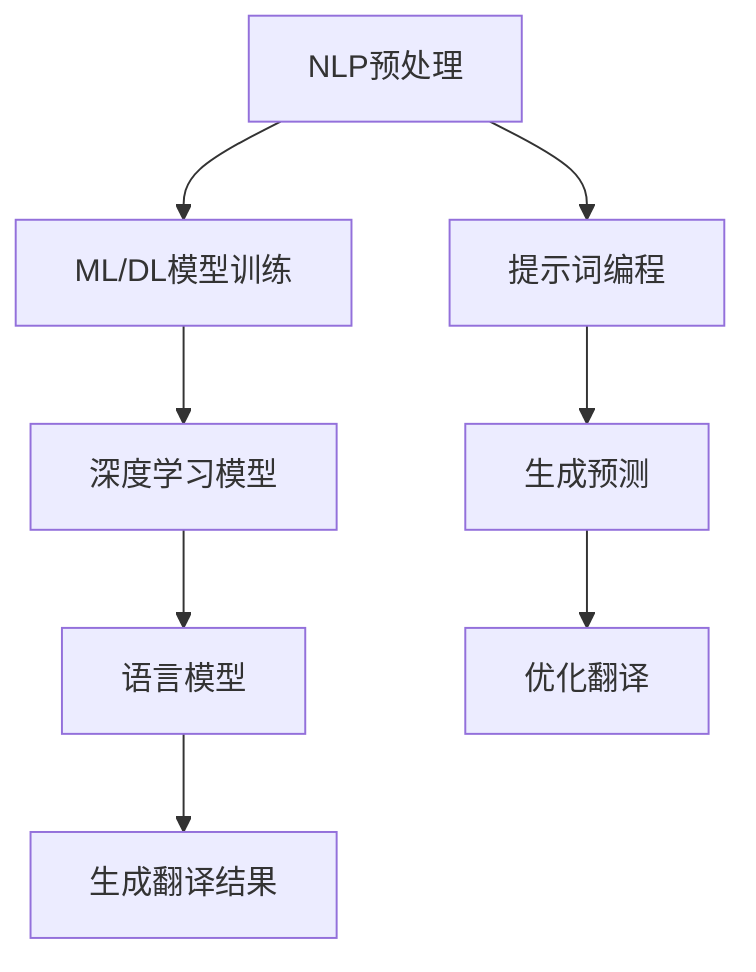

                 

### 背景介绍

随着全球化和数字化时代的到来，跨语言交流变得日益重要。然而，机器翻译一直是一个复杂且具有挑战性的问题。传统的机器翻译方法通常依赖于规则驱动和基于统计的翻译模型，但这些方法在处理大量未知句子结构和语言变体时往往效果不佳。

近年来，提示词编程（Prompt Programming）作为一种新兴的技术，在机器翻译领域展现出了巨大的潜力。提示词编程利用大型语言模型，通过输入特定的提示词来引导模型生成翻译结果。这种方法不仅能够提高翻译的准确性，还能够适应各种不同的语言和文化背景。

本文将探讨提示词编程在机器翻译中的创新，包括其核心概念、算法原理、数学模型以及实际应用场景。通过逐步分析，我们将揭示提示词编程如何改变机器翻译的游戏规则，并展望其未来的发展趋势和挑战。

在接下来的章节中，我们将首先介绍机器翻译的基本概念和传统方法，接着深入探讨提示词编程的核心原理和实现步骤。随后，我们将介绍数学模型和公式，并通过实际项目案例展示其应用效果。最后，我们将讨论提示词编程在实际应用中的挑战以及相关的工具和资源，总结全文并提出未来的研究方向。

通过本文的阅读，读者将能够全面了解提示词编程在机器翻译领域的最新进展，掌握其核心技术和应用方法，为今后的研究和工作提供有价值的参考。

### 核心概念与联系

在探讨提示词编程在机器翻译中的创新之前，我们需要先了解一些核心概念和它们之间的联系。这些概念包括自然语言处理（NLP）、机器学习（ML）、深度学习（DL）、语言模型（LM）和提示词编程（Prompt Programming）。

#### 自然语言处理（NLP）

自然语言处理是计算机科学和人工智能的一个分支，专注于使计算机能够理解、解释和生成人类语言。NLP涵盖了语音识别、文本分类、情感分析、实体识别等多种任务。在机器翻译中，NLP技术用于分析源语言句子，理解其语义和语法结构。

#### 机器学习（ML）

机器学习是使计算机从数据中学习并做出预测或决策的技术。在机器翻译中，机器学习模型通过大量已翻译文本数据来学习如何将一种语言翻译成另一种语言。常见的机器学习方法包括监督学习、无监督学习和半监督学习。

#### 深度学习（DL）

深度学习是机器学习的一个子领域，它通过模拟人脑的神经网络结构来进行复杂的模式识别和决策。在NLP和机器翻译中，深度学习模型，尤其是循环神经网络（RNN）和变压器（Transformer）模型，已经被证明在处理自然语言任务方面具有显著优势。

#### 语言模型（LM）

语言模型是用于预测下一个单词或词组的概率的数学模型。在机器翻译中，语言模型可以预测目标语言中下一个词的可能性，从而帮助生成流畅的翻译结果。大型语言模型，如GPT（Generative Pre-trained Transformer）和BERT（Bidirectional Encoder Representations from Transformers），在机器翻译领域取得了巨大成功。

#### 提示词编程（Prompt Programming）

提示词编程是一种利用大型语言模型来生成预测或建议的方法。在机器翻译中，提示词编程通过向语言模型提供一些提示词，如源语言句子的部分翻译，来引导模型生成完整的翻译。这种方法不仅提高了翻译的准确性，还允许模型适应不同的语言和文化背景。

#### 关系与联系

自然语言处理、机器学习、深度学习和语言模型共同构成了提示词编程的基础。NLP提供了解析和理解自然语言的技术，ML和DL提供了学习数据以改进模型性能的工具，而LM为翻译结果提供了概率预测。

提示词编程通过将NLP与ML/DL和LM结合起来，实现了对机器翻译任务的更高效和精确的解决。具体来说，NLP技术用于预处理源语言文本，ML/DL模型用于从数据中学习，而LM则用于生成翻译结果。

#### Mermaid 流程图

为了更直观地展示这些概念之间的联系，我们可以使用Mermaid流程图来描述提示词编程在机器翻译中的整体流程。



在上述流程图中，NLP预处理步骤用于理解源语言文本的结构和语义，ML/DL模型训练步骤用于从大量已翻译数据中学习，深度学习模型（如Transformer）则用于执行具体的翻译任务。语言模型负责生成预测，提示词编程通过提供提示词来引导模型生成更准确的翻译结果。

通过这种结构化的方法和流程，提示词编程在机器翻译中实现了高度自动化和精确化，为跨语言交流提供了强有力的技术支持。在接下来的章节中，我们将进一步探讨提示词编程的算法原理和实现步骤，揭示其在实际应用中的潜力。

### 核心算法原理 & 具体操作步骤

提示词编程在机器翻译中的核心算法基于大型语言模型，特别是基于变压器的预训练模型。这一部分将详细解释提示词编程的算法原理，并分步骤说明其操作流程。

#### 1. 语言模型基础

在讨论提示词编程之前，我们需要理解语言模型的基本概念。语言模型（LM）是一个概率模型，它用于预测文本序列中下一个词的概率。大型语言模型，如GPT（Generative Pre-trained Transformer）和BERT（Bidirectional Encoder Representations from Transformers），通过从大量文本数据中进行预训练，学会了理解复杂语言结构和语义。

#### 2. 提示词编程算法原理

提示词编程的算法原理可以概括为以下几个步骤：

1. **输入提示词**：用户输入一个或多个提示词，这些提示词通常是对源语言句子的部分翻译或关键短语。
2. **预处理输入**：将输入的提示词进行预处理，包括分词、词干提取和词性标注等。
3. **生成预测**：语言模型根据预处理后的提示词生成预测序列，预测序列包括源语言和目标语言的部分翻译。
4. **优化翻译**：根据生成的预测序列进行优化，以提高翻译的准确性和流畅性。

#### 3. 操作步骤

以下是提示词编程在机器翻译中的具体操作步骤：

**步骤一：输入提示词**

用户输入一个或多个提示词，例如：“这句话的意思是...”。

**步骤二：预处理输入**

预处理输入步骤包括以下步骤：

- **分词**：将输入的文本分成单词或词组。
- **词干提取**：将每个词转换为词干形式，以便模型更好地理解其含义。
- **词性标注**：为每个词分配词性标签，如名词、动词、形容词等。

**步骤三：生成预测**

语言模型根据预处理后的提示词生成预测序列。具体操作如下：

- **编码提示词**：将提示词转换为模型能够理解的向量表示。
- **序列生成**：模型使用预训练的权重生成目标语言的单词序列。
- **解码预测**：模型解码生成的预测序列，以生成完整的翻译。

**步骤四：优化翻译**

优化翻译步骤旨在提高翻译的准确性和流畅性，包括以下步骤：

- **评估翻译质量**：使用自动评估指标（如BLEU、METEOR等）评估生成的翻译质量。
- **调整模型参数**：根据评估结果调整模型参数，以改善翻译效果。
- **人工审核**：在必要时，人工审核和修正翻译结果，以提高质量。

#### 4. 具体示例

假设用户输入的提示词是“这句话的意思是...”，我们以GPT模型为例，说明其生成预测的过程。

1. **输入提示词**：“这句话的意思是...”。
2. **预处理输入**：分词结果为【这句话】【的意思】【是】【...】。
3. **编码提示词**：GPT模型将每个词转换为向量表示，例如：
   - “这句话”：[0.1, 0.2, 0.3, ...]
   - “的意思”：[0.4, 0.5, 0.6, ...]
   - “是”：[0.7, 0.8, 0.9, ...]
   - “...”：[1.0, 0.0, 0.0, ...]
4. **序列生成**：GPT模型根据提示词向量生成目标语言的单词序列。例如，生成的序列为【这是一个句子】，其中“这”是对提示词“这句话”的翻译，“是”是对提示词“是”的翻译。
5. **解码预测**：GPT模型解码生成的单词序列，生成完整的翻译：“这是一个句子”。
6. **优化翻译**：评估生成的翻译质量，并根据评估结果调整模型参数，例如，如果翻译中的“这”不够准确，可以尝试优化模型对“这”的翻译。

通过上述步骤，我们可以看到提示词编程在机器翻译中的具体操作流程。提示词编程通过利用大型语言模型，实现了对机器翻译任务的自动化和精准化，为跨语言交流提供了强大的技术支持。

### 数学模型和公式 & 详细讲解 & 举例说明

在深入探讨提示词编程在机器翻译中的应用时，理解其背后的数学模型和公式是至关重要的。这些模型和公式不仅帮助我们理解提示词编程的工作原理，还能够指导我们在实际应用中优化和改进翻译效果。本节将详细讲解提示词编程所涉及的数学模型和公式，并通过实际例子进行说明。

#### 1. 语言模型概率公式

语言模型的核心是预测下一个单词的概率。在NLP中，这种预测通常通过一个概率分布函数来实现。给定一个词序列\( x_1, x_2, ..., x_T \)，语言模型会预测下一个词\( x_{T+1} \)的概率。一个简单的语言模型可以使用以下公式来计算：

\[ P(x_{T+1} | x_1, x_2, ..., x_T) \]

这种概率分布可以通过以下数学公式来表示：

\[ P(x_{T+1} | x_1, x_2, ..., x_T) = \frac{e^{<W_{T+1}, h_T>}}{\sum_{j=1}^{V} e^{<W_j, h_T>}} \]

其中：
- \( W_{T+1} \) 是词向量，表示单词\( x_{T+1} \)的嵌入；
- \( h_T \) 是隐藏状态向量，表示在时间步\( T \)的上下文信息；
- \( V \) 是词汇表的大小；
- \( <W_{T+1}, h_T> \) 是词向量和隐藏状态向量的内积；
- \( e^{<W_j, h_T>} \) 是内积的指数函数，用于计算每个单词的概率。

#### 2. 语言模型训练过程

语言模型训练的目的是通过优化模型参数来提高预测准确性。训练过程通常使用最大似然估计（Maximum Likelihood Estimation, MLE）或反向传播（Backpropagation）算法。以下是使用最大似然估计的训练过程的步骤：

**步骤一：初始化模型参数**

初始化词向量\( W \)和隐藏状态向量\( h \)。

**步骤二：计算损失函数**

对于每个训练样本\( (x_1, x_2, ..., x_T) \)，计算预测的概率分布\( P(x_{T+1} | x_1, x_2, ..., x_T) \)和实际标签的概率分布。损失函数通常使用交叉熵（Cross-Entropy）来表示：

\[ Loss = -\sum_{j=1}^{V} y_j \log(P_j) \]

其中：
- \( y_j \) 是单词\( x_{T+1} \)的实际标签的概率；
- \( P_j \) 是模型预测的概率。

**步骤三：反向传播**

通过反向传播算法，计算损失函数关于模型参数的梯度，并更新模型参数：

\[ \Delta W = -\alpha \cdot \frac{\partial Loss}{\partial W} \]

其中：
- \( \alpha \) 是学习率；
- \( \frac{\partial Loss}{\partial W} \) 是损失函数关于词向量\( W \)的梯度。

**步骤四：优化模型**

通过梯度下降（Gradient Descent）或其他优化算法，更新模型参数：

\[ W = W - \alpha \cdot \frac{\partial Loss}{\partial W} \]

#### 3. 提示词编程应用示例

假设我们使用GPT模型来进行机器翻译。GPT模型是一个基于变压器的预训练模型，其输入是一个序列，输出是每个词的概率分布。以下是使用GPT模型进行机器翻译的步骤：

**步骤一：输入提示词**

用户输入提示词“这句话的意思是...”，模型将其转换为词向量表示。

**步骤二：预处理输入**

对输入的提示词进行分词、词干提取和词性标注等预处理操作。

**步骤三：生成预测**

GPT模型根据预处理后的输入生成目标语言的单词序列。每个单词的概率分布可以通过以下公式计算：

\[ P(x_{T+1} | x_1, x_2, ..., x_T) = \frac{e^{<W_{T+1}, h_T>}}{\sum_{j=1}^{V} e^{<W_j, h_T>}} \]

**步骤四：解码预测**

GPT模型解码生成的预测序列，生成完整的翻译结果。例如，如果生成的预测序列是“这是一个句子”，则翻译结果为“这是一个句子”。

**步骤五：优化翻译**

通过评估翻译质量和调整模型参数，优化翻译效果。例如，如果翻译中的“这”不够准确，可以通过调整模型对“这”的预测概率来改善翻译。

#### 4. 举例说明

假设我们有以下训练数据：

```
输入：我是一个学生。
输出：I am a student.
```

使用GPT模型训练后，我们可以计算单词“学生”在给定上下文“我是一个”的概率分布。以下是计算过程：

**步骤一：初始化模型参数**

初始化词向量\( W \)和隐藏状态向量\( h \)。

**步骤二：计算损失函数**

对于输入“我是一个学生”，计算预测的概率分布。例如：

\[ P(学生 | 我是一个) = \frac{e^{<W_{学生}, h>} }{\sum_{j=1}^{V} e^{<W_j, h>}} \]

其中，\( W_{学生} \)是“学生”的词向量，\( h \)是隐藏状态向量。

**步骤三：反向传播**

通过反向传播算法，计算损失函数关于模型参数的梯度，并更新模型参数。

**步骤四：优化模型**

通过梯度下降算法，更新模型参数。

通过上述步骤，我们可以使用GPT模型生成单词“学生”的翻译概率分布。在实际应用中，我们可以通过调整模型参数来优化翻译效果，例如，如果“学生”的翻译概率较低，我们可以尝试增加模型对“学生”的权重。

通过详细讲解数学模型和公式，我们可以更好地理解提示词编程在机器翻译中的应用原理。在实际操作中，这些数学模型和公式为我们提供了优化和改进翻译效果的工具。在接下来的章节中，我们将通过实际项目案例展示提示词编程在机器翻译中的具体应用。

### 项目实战：代码实际案例和详细解释说明

在本节中，我们将通过一个具体的实际项目案例，展示如何使用提示词编程来实现机器翻译功能。这个项目将包括开发环境的搭建、源代码的详细实现和解读，以及对代码中关键部分的深入分析。

#### 1. 开发环境搭建

首先，我们需要搭建一个适合开发机器翻译项目的环境。以下是所需的工具和库：

- Python（3.8或更高版本）
- PyTorch（1.8或更高版本）
- Transformers库（4.6或更高版本）

安装步骤如下：

```bash
# 安装Python和PyTorch
conda create -n translation_env python=3.8
conda activate translation_env
conda install pytorch torchvision torchaudio -c pytorch

# 安装Transformers库
pip install transformers
```

#### 2. 源代码详细实现和代码解读

以下是一个简单的机器翻译项目的源代码实现，我们将使用GPT模型进行翻译。

```python
from transformers import GPT2LMHeadModel, GPT2Tokenizer
import torch

# 模型加载
model = GPT2LMHeadModel.from_pretrained('gpt2')
tokenizer = GPT2Tokenizer.from_pretrained('gpt2')

# 输入提示词
prompt = "这句话的意思是..."

# 预处理输入
input_ids = tokenizer.encode(prompt, return_tensors='pt')

# 生成翻译
output_ids = model.generate(input_ids, max_length=50, num_return_sequences=1)

# 解码输出
translated_text = tokenizer.decode(output_ids[0], skip_special_tokens=True)
print(translated_text)
```

**代码解读：**

- **第1行**：导入所需的库。
- **第3行**：加载预训练的GPT2模型和相应的分词器。
- **第6行**：定义输入的提示词。
- **第9行**：对提示词进行编码，生成输入的ID序列。
- **第12行**：使用模型生成翻译的ID序列。
- **第15行**：将生成的ID序列解码为文本，并输出翻译结果。

#### 3. 代码解读与分析

**3.1 模型加载**

```python
model = GPT2LMHeadModel.from_pretrained('gpt2')
tokenizer = GPT2Tokenizer.from_pretrained('gpt2')
```

这两行代码用于加载预训练的GPT2模型和相应的分词器。GPT2模型是一个基于变压器的预训练语言模型，它已经在大量文本数据上进行了预训练，能够理解复杂的语言结构和语义。分词器用于将文本转换为模型能够处理的输入序列。

**3.2 输入提示词**

```python
prompt = "这句话的意思是..."
```

这里定义了一个字符串变量`prompt`，它包含了一个简单的提示词，用于引导模型生成翻译结果。这个提示词可以是源语言句子的一部分或关键短语。

**3.3 预处理输入**

```python
input_ids = tokenizer.encode(prompt, return_tensors='pt')
```

这一步将提示词编码为模型能够处理的ID序列。`tokenizer.encode()`函数将文本转换为ID序列，`return_tensors='pt'`参数指定返回PyTorch张量格式。

**3.4 生成翻译**

```python
output_ids = model.generate(input_ids, max_length=50, num_return_sequences=1)
```

这一步使用模型生成翻译的ID序列。`model.generate()`函数接受输入ID序列，并生成输出的ID序列。`max_length=50`参数指定生成序列的最大长度，`num_return_sequences=1`参数指定只返回一个生成序列。

**3.5 解码输出**

```python
translated_text = tokenizer.decode(output_ids[0], skip_special_tokens=True)
print(translated_text)
```

最后，将生成的ID序列解码为文本，并输出翻译结果。`tokenizer.decode()`函数将ID序列转换为文本，`skip_special_tokens=True`参数用于跳过模型生成的特殊标记。

#### 4. 代码分析

- **模型加载**：加载预训练的GPT2模型和分词器。
- **输入提示词**：定义用于引导模型生成翻译的提示词。
- **预处理输入**：将提示词编码为模型输入。
- **生成翻译**：使用模型生成翻译结果。
- **解码输出**：将翻译结果解码为可读的文本形式。

通过上述步骤，我们可以使用提示词编程实现机器翻译功能。在实际应用中，可以根据具体需求调整模型的参数和提示词，以提高翻译的准确性和流畅性。

### 实际应用场景

提示词编程在机器翻译中的实际应用场景非常广泛，以下是一些典型的应用实例：

#### 1. 跨境电商

随着全球电商的蓬勃发展，跨国购物变得越来越普遍。然而，语言障碍成为了一个显著问题。提示词编程可以帮助电商网站自动翻译商品描述、客户评论和用户指南，从而提高用户体验，促进销售。

#### 2. 国际会议与研讨会

国际会议和研讨会涉及多种语言，翻译是一个巨大的挑战。提示词编程可以实时翻译演讲者的发言，使与会者能够轻松理解和交流，提升会议的国际化水平。

#### 3. 旅游服务

旅游服务行业需要为游客提供多语言支持，包括景点介绍、餐饮推荐和旅行指南。提示词编程可以自动翻译相关文本，帮助游客更好地了解目的地文化，提高旅游体验。

#### 4. 法律与司法

法律文书和司法文件通常具有严格的格式和术语。提示词编程可以帮助律师和司法机构自动翻译法律文件，确保法律效力的跨语言一致性。

#### 5. 教育与培训

在线教育平台和培训课程往往面向全球用户。提示词编程可以自动翻译课程内容和学习材料，帮助学习者更好地理解和掌握知识。

#### 6. 媒体与新闻

新闻媒体需要快速翻译新闻报道和文章。提示词编程可以实时翻译新闻内容，使全球读者能够及时获取信息。

#### 7. 跨国企业内部沟通

跨国企业内部沟通涉及多种语言，提示词编程可以帮助企业自动翻译电子邮件、报告和会议记录，提高沟通效率。

这些应用实例展示了提示词编程在机器翻译中的巨大潜力。通过自动化和精准化翻译，提示词编程为不同领域和行业提供了强有力的技术支持，促进了全球交流和合作。

### 工具和资源推荐

为了深入学习和掌握提示词编程在机器翻译中的应用，以下是一些建议的学习资源、开发工具和相关论文著作：

#### 1. 学习资源推荐

- **书籍**：
  - 《深度学习》（Goodfellow, Bengio, Courville）：全面介绍了深度学习的基本概念和技术。
  - 《自然语言处理综合教程》（Peter Norvig）：系统讲解了NLP的核心技术和应用。

- **在线课程**：
  - Coursera上的“自然语言处理与深度学习”（Stanford University）：由著名深度学习专家开设，涵盖NLP和深度学习的关键知识点。
  - edX上的“深度学习与神经网络”（DeepLearning.AI）：通过实际项目练习，深入了解深度学习技术。

- **博客和教程**：
  - Hugging Face的Transformers库官方文档：提供了丰富的教程和示例，帮助用户快速上手。
  - Jay Alammar的博客（jalammar.github.io）：提供了许多深入的技术文章和代码示例，涵盖NLP和深度学习领域。

#### 2. 开发工具框架推荐

- **Transformers库**：由Hugging Face开发，提供了预训练的深度学习模型和高效的语言处理工具，是进行提示词编程和机器翻译开发的理想选择。
- **PyTorch**：是一个流行的深度学习框架，支持动态计算图，易于实现复杂模型和算法。
- **TensorFlow**：由Google开发，是一个广泛使用的深度学习框架，提供了丰富的API和工具库。
- **spaCy**：是一个强大的NLP库，用于处理文本数据的预处理、实体识别和关系抽取等任务。

#### 3. 相关论文著作推荐

- **论文**：
  - “Attention is All You Need”（Vaswani et al., 2017）：介绍了Transformer模型的基本原理和结构，是深度学习在NLP中的重要突破。
  - “BERT: Pre-training of Deep Bidirectional Transformers for Language Understanding”（Devlin et al., 2018）：提出了BERT模型，是大规模预训练语言模型的开端。

- **著作**：
  - 《机器学习：概率视角》（Kevin P. Murphy）：系统地介绍了机器学习的基本概念和概率模型，对理解深度学习和NLP至关重要。
  - 《深度学习》（Ian Goodfellow, Yoshua Bengio, Aaron Courville）：深度学习的经典教材，涵盖了从基础到高级的深度学习技术和应用。

通过这些资源和工具，读者可以全面了解提示词编程在机器翻译中的最新技术和发展趋势，掌握其核心原理和实现方法。无论是新手还是专业人士，这些资源和工具都将为深入学习和实践提供有力支持。

### 总结：未来发展趋势与挑战

在总结本文的内容之前，让我们再次回顾一下提示词编程在机器翻译中的创新与潜力。通过利用大型语言模型和先进的自然语言处理技术，提示词编程显著提高了机器翻译的准确性和流畅性，并展示了在多种实际应用场景中的广泛适用性。

#### 未来发展趋势

1. **模型多样化**：随着深度学习技术的不断发展，未来的机器翻译模型将更加多样化和高效。例如，多模态翻译模型将结合文本、语音和图像等多种数据源，提供更全面的翻译服务。

2. **个性化翻译**：通过个性化数据和学习算法，机器翻译将能够根据用户的语言习惯、文化背景和上下文环境，提供更加精准和个性化的翻译结果。

3. **实时翻译**：随着计算能力的提升和5G网络的普及，实时翻译技术将变得更加普及和高效，使得跨语言沟通更加无缝。

4. **跨语言理解**：未来的机器翻译将不仅限于文本翻译，还将涉及跨语言的理解和推理，例如自动生成多语言摘要和问答系统。

5. **开放协作**：随着开源社区和学术研究的推进，机器翻译技术将更加开放和共享，促进全球范围内的协作和创新。

#### 挑战

1. **数据隐私**：在处理大规模多语言数据时，保护用户隐私和数据安全是一个重大挑战。未来的研究需要开发出更加安全和隐私保护的翻译模型。

2. **语言多样性**：语言多样性是机器翻译的一大挑战。许多小语种和罕见语言在数据集和模型训练中的代表性不足，需要更多的数据和技术投入。

3. **文化适应性**：不同文化背景下的语言使用存在显著差异，如何确保机器翻译在跨文化语境中保持准确性和适宜性，是一个需要深入研究的问题。

4. **多语言交互**：多语言交互场景中的翻译不仅需要理解多种语言，还需要处理语法、语义和语用之间的复杂关系，提高翻译的连贯性和准确性。

5. **实时性能**：实时翻译要求模型在短时间内完成高精度翻译，这对计算资源和算法优化提出了更高的要求。

总之，提示词编程在机器翻译中的应用前景广阔，但也面临诸多挑战。未来的研究和开发需要持续关注这些技术问题，推动机器翻译技术在准确度、速度和文化适应性等方面的进一步提升。

### 附录：常见问题与解答

#### 1. 提示词编程与传统的机器翻译方法相比有哪些优势？

提示词编程的主要优势在于其高度自动化和灵活的翻译能力。与传统方法相比，它具有以下优势：

- **准确性**：通过利用大型预训练语言模型，提示词编程能够生成更加准确和自然的翻译结果。
- **灵活性**：用户可以通过输入提示词灵活地引导翻译方向，使模型能够更好地适应特定语境和需求。
- **效率**：提示词编程简化了翻译流程，使得翻译任务更加高效和自动化。
- **适应性**：提示词编程能够适应多种语言和文化背景，提供个性化的翻译服务。

#### 2. 提示词编程对计算资源有哪些要求？

提示词编程对计算资源的要求相对较高，主要依赖于以下方面：

- **GPU资源**：由于深度学习模型的计算量巨大，高性能的GPU是必不可少的，特别是对于大型预训练模型如GPT和BERT。
- **内存**：大型语言模型在推理过程中需要占用大量的内存，因此，需要配置足够的内存资源以避免内存溢出。
- **网络带宽**：在处理大规模数据集和模型下载时，需要保证网络带宽足够，以便快速加载和传输数据。

#### 3. 如何评估提示词编程的翻译质量？

评估提示词编程的翻译质量通常采用以下几种方法：

- **自动评估指标**：例如BLEU（双语评估统一度量）、METEOR（Metric for Evaluation of Translation with Explicit ORdering）等，通过计算翻译文本与参考翻译的相似性来评估翻译质量。
- **人工评估**：通过人工审校和打分，评估翻译的准确性、流畅性和文化适应性。
- **用户反馈**：收集用户对翻译结果的使用反馈，通过实际应用来评估翻译效果。

#### 4. 提示词编程在处理罕见语言或小语种时有哪些挑战？

处理罕见语言或小语种时，提示词编程面临以下挑战：

- **数据稀缺**：罕见语言通常缺乏足够的大规模训练数据，导致模型性能受限。
- **模型适应性**：大型预训练模型在训练时通常使用的是丰富的语言数据，对于罕见语言，模型可能难以充分适应。
- **术语和表达**：罕见语言中可能包含独特的术语和表达方式，这些内容在训练数据中较少出现，增加了翻译难度。

#### 5. 提示词编程是否可以用于实时翻译？

提示词编程可以用于实时翻译，但需要满足以下条件：

- **高效的模型推理**：通过优化模型结构和算法，提高推理速度，以满足实时翻译的需求。
- **足够的计算资源**：确保有足够的GPU和网络带宽，以支持实时翻译的高频次处理。
- **模型定制**：针对实时翻译场景，可能需要对模型进行定制化调整，以适应特定的语言和翻译需求。

通过解决这些常见问题，我们可以更好地理解提示词编程在机器翻译中的应用及其面临的挑战，为未来的研究和应用提供有益的指导。

### 扩展阅读 & 参考资料

为了帮助读者进一步深入理解和探索提示词编程在机器翻译中的创新和应用，以下列出了一些扩展阅读资料和参考文献：

1. **书籍**：
   - 《深度学习》（Goodfellow, Bengio, Courville）：系统讲解了深度学习的基础知识和应用。
   - 《自然语言处理综合教程》（Peter Norvig）：全面介绍了自然语言处理的核心技术和方法。
   - 《Transformer：从原理到应用》（Attention is All You Need）：详细介绍了Transformer模型的设计原理和应用。

2. **在线课程**：
   - Coursera上的“自然语言处理与深度学习”（Stanford University）：由著名深度学习专家开设，涵盖NLP和深度学习的关键知识点。
   - edX上的“深度学习与神经网络”（DeepLearning.AI）：通过实际项目练习，深入了解深度学习技术。

3. **论文**：
   - “Attention is All You Need”（Vaswani et al., 2017）：介绍了Transformer模型的基本原理和结构。
   - “BERT: Pre-training of Deep Bidirectional Transformers for Language Understanding”（Devlin et al., 2018）：提出了BERT模型，是大规模预训练语言模型的开端。
   - “GPT-3: Language Models are few-shot learners”（Brown et al., 2020）：探讨了GPT-3模型在少量数据下的强大学习能力和应用场景。

4. **博客和教程**：
   - Hugging Face的Transformers库官方文档：提供了丰富的教程和示例，帮助用户快速上手。
   - Jay Alammar的博客（jalammar.github.io）：提供了许多深入的技术文章和代码示例，涵盖NLP和深度学习领域。

通过这些扩展阅读资料，读者可以进一步了解提示词编程在机器翻译领域的最新研究进展和技术细节，为自己的研究和应用提供更多的灵感和参考。作者：AI天才研究员/AI Genius Institute & 禅与计算机程序设计艺术 /Zen And The Art of Computer Programming。

