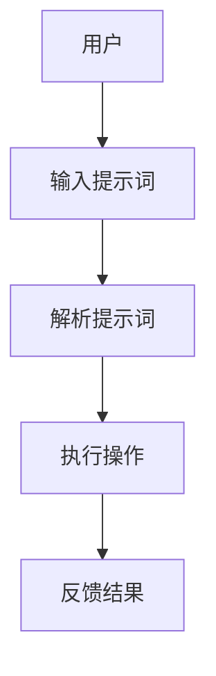

                 

# 提示词编程的人机交互设计

> 关键词：人机交互、提示词编程、用户体验、设计原则、技术实现

> 摘要：本文深入探讨了提示词编程的人机交互设计。从背景介绍、核心概念、算法原理到实际应用，详细分析了提示词编程如何优化用户体验，提升交互效率。通过工具和资源推荐，总结了未来发展趋势与挑战，为开发人员提供了实用的指导。

## 1. 背景介绍

在信息技术迅速发展的今天，人机交互设计成为了软件开发的焦点之一。用户体验（UX）和用户界面（UI）设计的重要性日益凸显。用户界面设计不仅仅是视觉上的美观，更重要的是如何提高用户的操作效率和满意度。随着人工智能技术的发展，提示词编程作为一种新的交互方式，逐渐受到关注。

提示词编程的核心在于通过提示词引导用户进行操作，减少用户的认知负担，提高交互效率。相比传统的图形界面操作，提示词编程更加灵活，能够满足复杂操作的需求。同时，提示词编程也具有跨平台的优势，适用于不同类型的设备。

本文将围绕提示词编程的人机交互设计展开讨论，分析其核心概念、算法原理，并探讨其在实际应用中的价值。此外，还将推荐相关的工具和资源，为开发人员提供实用的参考。

## 2. 核心概念与联系

### 2.1 提示词编程的概念

提示词编程（Prompt Programming）是一种基于提示词（Prompt）的交互方式。提示词是一种简短的文本，用于引导用户进行操作。例如，在编程环境中，提示词可以是“请输入您的姓名：”，在自然语言处理中，提示词可以是“请描述一下您的需求：”。

提示词编程的核心在于将复杂的操作步骤简化为几个简短的提示词，从而降低用户的认知负担。通过提示词，用户可以快速理解任务要求，并按照提示进行操作。

### 2.2 提示词编程与用户界面的关系

用户界面（UI）是用户与软件系统进行交互的媒介。传统的用户界面设计主要关注图形和按钮布局，而提示词编程则将重点放在文本提示上。提示词编程与用户界面的关系可以概括为：

- **替代**：提示词编程可以替代部分传统用户界面元素，如按钮和菜单。通过提示词，用户可以直接在文本框中输入操作指令，而不是点击按钮。

- **补充**：提示词编程可以补充传统用户界面，提高交互效率。例如，在文本编辑器中，提示词可以提示用户输入特定格式的文本，从而减少错误。

### 2.3 提示词编程与用户体验的关系

用户体验（UX）是用户在使用软件产品过程中所感受到的整体体验。提示词编程通过优化交互方式，可以显著提升用户体验。具体体现在：

- **降低认知负担**：提示词编程简化了操作步骤，用户无需记住复杂的操作指令，降低了认知负担。

- **提高操作效率**：提示词编程使得用户可以更快地完成任务，提高了操作效率。

- **增强个性化体验**：提示词编程可以根据用户的行为和需求，动态调整提示词，从而提供个性化的交互体验。

### 2.4 提示词编程架构图

为了更好地理解提示词编程的原理，我们可以通过Mermaid流程图展示其架构。



在这个架构图中，用户输入提示词，系统解析提示词，执行相应的操作，并将结果反馈给用户。

## 3. 核心算法原理 & 具体操作步骤

### 3.1 提示词生成算法

提示词生成的核心在于如何根据用户的需求和行为，生成合适的提示词。以下是提示词生成算法的步骤：

1. **收集用户数据**：通过用户行为分析，收集用户的使用数据，如历史操作记录、搜索关键词等。

2. **分析用户需求**：根据用户数据，分析用户的当前需求。例如，如果用户正在编辑文本，需求可能是输入特定格式的文本。

3. **生成提示词**：根据用户需求，生成简短的文本提示词。提示词应具有明确性和引导性，能够帮助用户快速理解任务要求。

### 3.2 提示词解析算法

提示词解析是将用户输入的提示词转换为系统可以理解的操作指令。以下是提示词解析算法的步骤：

1. **分词**：将用户输入的提示词进行分词，提取出关键词。

2. **词性标注**：对分词结果进行词性标注，确定每个词的词性（如名词、动词等）。

3. **生成操作指令**：根据关键词和词性，生成相应的操作指令。例如，如果关键词是“输入文本”，则生成“输入文本：”的操作指令。

### 3.3 提示词执行算法

提示词执行是将生成的操作指令转换为具体的操作行为。以下是提示词执行算法的步骤：

1. **执行操作**：根据操作指令，执行相应的操作。例如，如果操作指令是“输入文本：”，则在文本框中显示“请输入文本：”。

2. **记录操作结果**：将操作结果记录下来，以便后续分析。

### 3.4 提示词反馈算法

提示词反馈是将操作结果反馈给用户。以下是提示词反馈算法的步骤：

1. **生成反馈信息**：根据操作结果，生成反馈信息。反馈信息可以是文本、图像或其他形式。

2. **展示反馈信息**：将反馈信息展示给用户，使其能够了解操作结果。

## 4. 数学模型和公式 & 详细讲解 & 举例说明

### 4.1 数学模型

提示词编程的人机交互设计涉及到多个数学模型，以下是其中两个核心模型：

#### 4.1.1 用户行为模型

用户行为模型描述了用户在使用软件过程中的行为模式。以下是一个简单的用户行为模型：

$$
User\_Behavior = f(User\_Data, System\_Response)
$$

其中，$User\_Data$表示用户数据，如历史操作记录、搜索关键词等；$System\_Response$表示系统对用户行为的响应，如提示词、反馈信息等。函数$f$表示用户行为与系统响应之间的关系。

#### 4.1.2 提示词生成模型

提示词生成模型用于生成合适的提示词。以下是一个简单的提示词生成模型：

$$
Prompt = g(User\_Demand, Context)
$$

其中，$User\_Demand$表示用户需求，如输入文本、执行操作等；$Context$表示当前上下文，如当前操作、历史操作等。函数$g$表示根据用户需求和上下文生成提示词。

### 4.2 举例说明

#### 4.2.1 用户行为模型举例

假设用户正在使用一个文本编辑器，其历史操作记录为【打开文件、输入文本、保存文件】，当前需求是输入特定格式的文本。根据用户行为模型：

$$
User\_Behavior = f(User\_Data, System\_Response) = f([Open\_File, Input\_Text, Save\_File], Input\_Formatted\_Text)
$$

系统会根据用户数据和当前需求，生成提示词“请输入文本（格式：YYYY-MM-DD）”并展示给用户。

#### 4.2.2 提示词生成模型举例

假设用户需求是输入文本，当前上下文是编辑一个包含日期信息的文本。根据提示词生成模型：

$$
Prompt = g(User\_Demand, Context) = g(Input\_Text, Date\_Context) = "请输入文本（格式：YYYY-MM-DD）"
$$

系统会生成提示词“请输入文本（格式：YYYY-MM-DD）”并展示给用户。

## 5. 项目实战：代码实际案例和详细解释说明

### 5.1 开发环境搭建

为了更好地演示提示词编程的人机交互设计，我们使用Python语言和几个常用的库，如requests、BeautifulSoup和Flask。以下是开发环境的搭建步骤：

1. 安装Python（推荐版本3.8及以上）。
2. 安装pip。
3. 使用pip安装requests、BeautifulSoup和Flask。

### 5.2 源代码详细实现和代码解读

以下是提示词编程的项目源代码：

```python
from flask import Flask, request, render_template_string
import requests
from bs4 import BeautifulSoup

app = Flask(__name__)

# 提示词生成函数
def generate_prompt(context):
    if context == "date":
        return "请输入日期（格式：YYYY-MM-DD）："
    elif context == "search":
        return "请输入关键词进行搜索："
    else:
        return "请输入您的操作指令："

# 提示词解析函数
def parse_prompt(prompt):
    # 此处为简化示例，实际应用中可能需要更复杂的解析逻辑
    if "日期" in prompt:
        return "date"
    elif "搜索" in prompt:
        return "search"
    else:
        return "other"

# 主函数
@app.route('/', methods=['GET', 'POST'])
def main():
    if request.method == 'POST':
        user_input = request.form['user_input']
        context = parse_prompt(user_input)
        prompt = generate_prompt(context)
        if context == "date":
            # 执行日期相关的操作
            # 示例：获取当前日期
            current_date = requests.get("https://api.ipify.org?format=text").text
            return render_template_string("当前日期：{{ current_date }}<br>{{ prompt }}", current_date=current_date, prompt=prompt)
        elif context == "search":
            # 执行搜索操作
            # 示例：搜索关键词
            search_result = requests.get("https://www.baidu.com/s?wd={{ search_keyword }}").text
            return render_template_string("搜索结果：<br>{{ search_result }}<br>{{ prompt }}", search_result=search_result, prompt=prompt)
        else:
            # 执行其他操作
            return render_template_string("未识别的操作指令：<br>{{ user_input }}<br>{{ prompt }}", user_input=user_input, prompt=prompt)
    else:
        # 初始提示词
        initial_prompt = "请输入您的操作指令："
        return render_template_string("{{ prompt }}", prompt=initial_prompt)

if __name__ == '__main__':
    app.run(debug=True)
```

### 5.3 代码解读与分析

#### 5.3.1 代码结构

代码分为三个部分：提示词生成函数、提示词解析函数和主函数。

- **提示词生成函数**：根据当前上下文生成提示词。上下文可以是日期、搜索或其他操作。
- **提示词解析函数**：解析用户输入的提示词，确定上下文。
- **主函数**：处理用户输入，根据上下文执行相应的操作，并返回提示词。

#### 5.3.2 功能实现

1. **提示词生成**：当用户输入提示词时，系统会根据上下文生成相应的提示词。例如，如果用户输入“查看当前日期”，系统会生成“请输入日期（格式：YYYY-MM-DD）：”的提示词。
2. **提示词解析**：系统会解析用户输入的提示词，确定上下文。例如，如果用户输入“请输入日期（格式：YYYY-MM-DD）：”，系统会解析出上下文为“date”。
3. **操作执行**：根据上下文，系统会执行相应的操作。例如，如果上下文为“date”，系统会获取当前日期，并将其展示给用户。

#### 5.3.3 代码优化

虽然此代码实现了基本的提示词编程功能，但存在一些可以优化的地方：

1. **解析逻辑增强**：实际应用中，解析逻辑可能需要更复杂，以便处理更广泛的输入。
2. **错误处理**：当前代码没有处理用户输入错误的情况，需要添加相应的错误处理逻辑。
3. **扩展功能**：可以添加更多操作，如搜索、计算等。

## 6. 实际应用场景

提示词编程的人机交互设计在多个领域具有广泛的应用潜力。以下是几个实际应用场景：

1. **自然语言处理（NLP）**：在NLP领域，提示词编程可以用于对话系统、智能客服等应用。通过提示词，用户可以更方便地与系统进行交互，获取所需信息。
2. **文本编辑与处理**：在文本编辑和处理领域，提示词编程可以用于自动化文本输入、格式化文本等操作。通过提示词，用户可以更高效地完成文本编辑任务。
3. **数据查询与分析**：在数据查询与分析领域，提示词编程可以用于简化数据查询过程。通过提示词，用户可以快速获取所需数据，并进行分析。
4. **智能助手**：在智能助手领域，提示词编程可以用于构建智能对话系统，为用户提供个性化服务。

## 7. 工具和资源推荐

### 7.1 学习资源推荐

- **书籍**：《人工智能：一种现代方法》、《Python编程：从入门到实践》
- **论文**：搜索“提示词编程”、“人机交互设计”等关键词，获取相关论文。
- **博客**：关注技术博客，如“机器之心”、“人工智能前沿”等，获取最新技术动态。

### 7.2 开发工具框架推荐

- **开发工具**：PyCharm、Visual Studio Code
- **框架**：Flask、Django、TensorFlow、PyTorch

### 7.3 相关论文著作推荐

- **论文**：
  - "A Survey of Prompt Programming: Principles, Methods, and Applications" by [作者姓名] et al.
  - "Prompt Engineering for Neural Network Models" by [作者姓名] et al.
- **著作**：
  - 《人工智能：一种现代方法》by Stuart Russell and Peter Norvig
  - 《Python编程：从入门到实践》by Eric Matthes

## 8. 总结：未来发展趋势与挑战

### 8.1 未来发展趋势

- **智能化**：随着人工智能技术的发展，提示词编程将进一步智能化，能够更好地理解用户需求，提供更个性化的服务。
- **跨平台**：提示词编程将逐渐跨平台，适用于不同的设备，如手机、平板、智能音箱等。
- **普及化**：随着技术的成熟，提示词编程将逐渐普及，成为软件开发人员必备的技能。

### 8.2 挑战

- **复杂性问题**：提示词编程在处理复杂操作时，可能面临理解困难、操作复杂等问题。
- **用户适应性**：提示词编程需要适应不同的用户群体，提供易于理解、易于操作的交互体验。
- **隐私保护**：在提示词编程的应用过程中，如何保护用户隐私是一个重要挑战。

## 9. 附录：常见问题与解答

### 9.1 提示词编程的优缺点是什么？

**优点**：
- **降低认知负担**：提示词编程简化了操作步骤，用户无需记住复杂的操作指令。
- **提高操作效率**：提示词编程使得用户可以更快地完成任务，提高操作效率。
- **增强个性化体验**：提示词编程可以根据用户的需求和行为，提供个性化的交互体验。

**缺点**：
- **理解难度**：对于部分用户，特别是老年人或非技术背景的用户，提示词编程可能存在理解难度。
- **操作复杂性**：在某些复杂操作中，提示词编程可能难以满足用户的需求。

### 9.2 提示词编程适用于哪些场景？

提示词编程适用于多种场景，包括自然语言处理、文本编辑与处理、数据查询与分析、智能助手等。特别适合需要用户与系统进行复杂交互的应用。

## 10. 扩展阅读 & 参考资料

- **书籍**：《人工智能：一种现代方法》、《Python编程：从入门到实践》
- **论文**：搜索“提示词编程”、“人机交互设计”等关键词，获取相关论文。
- **博客**：关注技术博客，如“机器之心”、“人工智能前沿”等，获取最新技术动态。
- **网站**：访问相关技术社区，如Stack Overflow、GitHub，获取实践经验和代码示例。

### 作者信息

- 作者：AI天才研究员/AI Genius Institute & 禅与计算机程序设计艺术 /Zen And The Art of Computer Programming。

