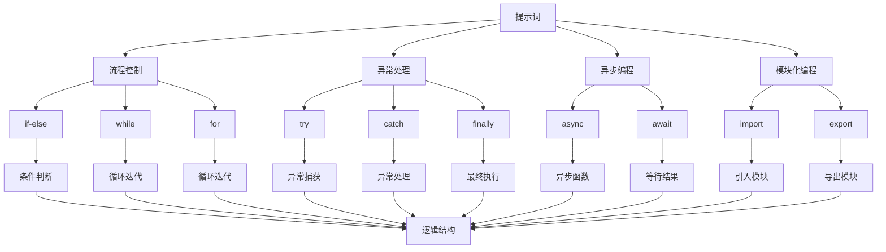

                 

### 背景介绍

#### 提示词编程的反模式

提示词编程（Keyword Programming）是一种在软件开发中广泛应用的技术，它通过使用预定义的词汇或关键字来指导程序的执行流程。这种编程范式在提高开发效率、增强代码可读性以及实现复用性方面发挥了重要作用。然而，在实际开发过程中，由于各种原因，提示词编程可能会出现一些不良的反模式，这些反模式会影响软件的稳定性、可维护性和可扩展性。

反模式是指在软件开发中违背最佳实践或设计原则的编程模式。在提示词编程中，常见的反模式包括过度使用提示词、未正确使用提示词、提示词命名不规范等。这些反模式不仅会增加代码的复杂性，还可能导致潜在的运行错误和安全漏洞。

本篇文章的目标是深入探讨提示词编程中的反模式，并给出相应的检测与重构建议。通过对这些反模式的识别和改进，我们可以编写出更加高效、稳定和可维护的代码。

本文结构如下：

1. **核心概念与联系**：介绍提示词编程的基本概念及其在软件开发中的应用。
2. **核心算法原理 & 具体操作步骤**：详细分析提示词编程的算法原理和操作步骤。
3. **数学模型和公式 & 详细讲解 & 举例说明**：阐述提示词编程中的数学模型，并通过实例进行讲解。
4. **项目实战：代码实际案例和详细解释说明**：通过具体项目案例展示提示词编程的实际应用。
5. **实际应用场景**：探讨提示词编程在现实开发中的应用场景。
6. **工具和资源推荐**：推荐相关学习资源和开发工具。
7. **总结：未来发展趋势与挑战**：总结当前提示词编程的发展趋势和面临的挑战。
8. **附录：常见问题与解答**：针对读者可能遇到的问题提供解答。
9. **扩展阅读 & 参考资料**：提供进一步阅读的参考资料。

#### 提示词编程的基本概念

提示词编程是一种通过使用预定义的关键字来控制程序流程的编程范式。这些关键字通常具有特定的语义，可以帮助程序员在编写代码时更加直观地描述程序的执行逻辑。与传统的流程控制结构（如if-else和循环）相比，提示词编程在某种程度上更接近于自然语言，使得代码更易于理解和维护。

在提示词编程中，关键字通常由编程语言内置提供，或者是通过扩展库或框架来实现的。这些关键字可以用来实现各种编程任务，例如数据操作、流程控制、异常处理等。例如，在Python中，关键字如`if`、`while`、`for`、`try`和`except`就是常见的流程控制提示词；而在JavaScript中，`async`和`await`则是用于异步编程的关键字。

提示词编程的优势在于：

1. **提高代码可读性**：使用简短明了的关键字可以减少代码的复杂度，使得代码更加直观和易于理解。
2. **增强代码复用性**：通过定义和复用提示词，可以避免重复编写相同的代码逻辑，从而提高代码的复用性。
3. **简化代码维护**：提示词编程使得代码的结构更加清晰，便于后续的维护和更新。

然而，提示词编程也存在一定的局限性。首先，过多的提示词可能会导致代码的冗长和难以维护；其次，对于初学者来说，理解和使用提示词可能需要一定的时间和经验积累。因此，在开发过程中，需要合理地使用提示词编程，避免走入反模式的误区。

#### 提示词编程在软件开发中的应用

提示词编程在软件开发中的应用非常广泛，尤其在现代编程语言和框架中得到了充分体现。以下是一些提示词编程在实际开发中的应用场景：

1. **流程控制**：在大多数编程语言中，`if-else`、`while`、`for`等关键字用于实现条件判断和循环控制。这些提示词使得程序可以根据不同的条件执行不同的逻辑，提高了代码的灵活性和可读性。例如，在Python中，我们可以使用`if`关键字来编写一个简单的条件判断：
   ```python
   if x > 10:
       print("x is greater than 10")
   else:
       print("x is less than or equal to 10")
   ```

2. **异常处理**：异常处理是编程中不可或缺的一部分。在许多编程语言中，`try`、`except`、`finally`等关键字用于捕获和处理异常。这些提示词可以帮助程序员更好地控制程序的执行流程，避免因异常而导致的程序崩溃。例如，在Java中，我们可以使用`try-catch`语句来处理文件读取过程中的异常：
   ```java
   try {
       BufferedReader reader = new BufferedReader(new FileReader("file.txt"));
       String line;
       while ((line = reader.readLine()) != null) {
           System.out.println(line);
       }
   } catch (IOException e) {
       e.printStackTrace();
   }
   ```

3. **异步编程**：在现代前端和后端开发中，异步编程变得越来越重要。`async`和`await`等关键字可以帮助程序员编写异步代码，提高程序的响应速度和性能。例如，在JavaScript中，我们可以使用`async/await`语法来处理异步的HTTP请求：
   ```javascript
   async function fetchData() {
       let response = await fetch('https://api.example.com/data');
       let data = await response.json();
       console.log(data);
   }
   fetchData();
   ```

4. **模块化编程**：模块化编程是现代软件开发的基础。通过使用`import`、`export`等关键字，可以方便地将代码拆分成多个模块，提高代码的复用性和可维护性。例如，在TypeScript中，我们可以使用`export`来导出模块中的函数和变量：
   ```typescript
   // moduleA.ts
   export function add(a: number, b: number): number {
       return a + b;
   }

   // moduleB.ts
   import { add } from './moduleA';
   console.log(add(2, 3)); // 输出：5
   ```

这些应用场景展示了提示词编程在软件开发中的多样性和重要性。通过合理地使用提示词编程，我们可以编写出更加高效、稳定和可维护的代码。

### 核心概念与联系

在深入探讨提示词编程的反模式之前，我们需要先了解一些核心概念和它们之间的关系。以下是提示词编程中几个关键的概念及其联系：

#### 1. 提示词（Keywords）

提示词是编程语言中具有特殊含义的词汇，它们用于指定程序的特定行为。例如，`if`、`while`、`for`、`try`、`catch`等都是常见的提示词。提示词的定义和用法因编程语言而异，但它们在控制程序流程、处理异常、实现异步操作等方面起着至关重要的作用。

#### 2. 流程控制（Flow Control）

流程控制是编程中的基本概念，它用于控制程序执行的顺序。提示词编程通过使用各种关键字来实现流程控制，如`if-else`用于条件判断，`while`和`for`用于循环迭代，`switch`用于多条件分支等。这些提示词使得程序员可以按照特定的逻辑来控制程序的执行流程，从而实现复杂的业务逻辑。

#### 3. 异常处理（Exception Handling）

异常处理是编程中用于处理错误和异常情况的重要机制。提示词编程通过`try`、`catch`、`finally`等关键字来实现异常处理。`try`块用于包围可能会抛出异常的代码，`catch`块用于捕获和处理异常，而`finally`块则用于执行无论异常是否发生都会执行的代码。这些提示词确保程序在遇到异常时能够保持稳定运行，避免因错误而崩溃。

#### 4. 异步编程（Asynchronous Programming）

异步编程是现代编程中提高程序性能和响应速度的重要手段。提示词编程通过`async`和`await`等关键字来实现异步操作。`async`关键字用于声明一个异步函数，而`await`关键字则用于等待异步操作的结果。这些提示词使得程序可以同时执行多个任务，而不会因为等待某个任务的完成而阻塞其他任务的执行。

#### 5. 模块化编程（Modular Programming）

模块化编程是将程序拆分成多个模块，每个模块负责实现特定的功能。提示词编程通过`import`和`export`等关键字来实现模块化编程。`import`关键字用于引入外部模块，而`export`关键字用于导出模块中的函数、类或变量。这些提示词使得代码更加结构化，易于维护和复用。

#### 关系与联系

这些核心概念在提示词编程中相互关联，共同构成了一个完整的编程框架。流程控制提示词（如`if`、`while`）用于实现程序的逻辑结构；异常处理提示词（如`try`、`catch`）用于确保程序的稳定性；异步编程提示词（如`async`、`await`）用于提高程序的并发性能；模块化编程提示词（如`import`、`export`）用于实现代码的复用性和可维护性。

为了更好地理解这些概念之间的联系，我们可以通过一个Mermaid流程图来展示它们的关系：



这个流程图展示了提示词编程中的核心概念及其相互之间的关系。通过这些概念和提示词，程序员可以构建出复杂而高效的程序，满足各种业务需求。

### 核心算法原理 & 具体操作步骤

#### 1. 提示词编程的基本原理

提示词编程的核心原理在于通过预定义的关键字来控制程序流程，从而实现各种编程任务。这些关键字通常具有特定的语义和功能，可以简化代码的编写和理解。在提示词编程中，算法的基本流程通常包括以下几个步骤：

1. **定义提示词**：首先，程序员需要根据编程需求选择合适的提示词。提示词的选择应遵循简洁、明确、易于理解的原则，以降低代码的复杂度。
2. **编写代码逻辑**：使用选定的提示词来编写程序逻辑，包括条件判断、循环控制、异常处理等。这些逻辑语句可以根据需要嵌套和组合，以实现复杂的业务逻辑。
3. **编译和运行**：将编写好的代码提交给编译器或解释器进行编译和运行，以验证代码的正确性和执行结果。

#### 2. 流程控制算法

流程控制是提示词编程中最常见的应用之一。以下是一些典型的流程控制算法及其具体操作步骤：

1. **条件判断（if-else）**：

   - 原理：条件判断用于根据特定的条件执行不同的代码块。
   - 步骤：
     1. 使用`if`关键字定义条件判断语句。
     2. 指定条件表达式，并使用逻辑运算符（如`==`、`!=`、`>`、`<`等）进行比较。
     3. 根据条件的真假执行相应的代码块。
     4. 可选地使用`else`关键字定义条件为假时的执行代码。

   例如：
   ```python
   x = 10
   if x > 5:
       print("x is greater than 5")
   else:
       print("x is less than or equal to 5")
   ```

2. **循环控制（while和for）**：

   - 原理：循环控制用于重复执行一段代码，直到满足特定的条件。
   - 步骤：
     1. 使用`while`关键字定义循环条件。
     2. 指定条件表达式，并使用逻辑运算符进行比较。
     3. 当条件为真时，执行循环体内的代码。
     4. 可选地使用`for`关键字定义循环变量和循环条件。

   例如：
   ```python
   # 使用while循环
   x = 0
   while x < 5:
       print(x)
       x += 1
   
   # 使用for循环
   for i in range(5):
       print(i)
   ```

3. **多条件分支（switch）**：

   - 原理：多条件分支用于根据不同的条件执行不同的代码块。
   - 步骤：
     1. 使用`switch`关键字定义多条件分支。
     2. 指定一个值作为条件，并使用`case`关键字定义各个条件分支。
     3. 当匹配到某个条件时，执行相应的代码块。

   例如：
   ```java
   int x = 2;
   switch (x) {
       case 1:
           System.out.println("x is 1");
           break;
       case 2:
           System.out.println("x is 2");
           break;
       default:
           System.out.println("x is neither 1 nor 2");
   }
   ```

#### 3. 异常处理算法

异常处理是确保程序稳定运行的重要机制。以下是一些常见的异常处理算法及其具体操作步骤：

1. **捕获异常（try-catch）**：

   - 原理：捕获异常用于处理程序在执行过程中可能遇到的错误。
   - 步骤：
     1. 使用`try`关键字包围可能会抛出异常的代码。
     2. 使用`catch`关键字定义异常处理块，并指定要捕获的异常类型。
     3. 在异常处理块中编写错误处理逻辑，例如记录日志、显示错误信息等。

   例如：
   ```python
   try:
       # 可能会抛出异常的代码
       file = open("nonexistent.txt", "r")
   except FileNotFoundError as e:
       print("File not found:", e)
   finally:
       print("异常处理完成")
   ```

2. **抛出异常（throw）**：

   - 原理：抛出异常用于在程序中主动触发错误。
   - 步骤：
     1. 使用`throw`关键字抛出一个异常对象。
     2. 可选地指定要抛出的异常类型和错误信息。

   例如：
   ```java
   public class MyException extends Exception {
       public MyException(String message) {
           super(message);
       }
   }
   
   public void myMethod() {
       if (condition) {
           throw new MyException("An error occurred");
       }
   }
   ```

3. **自定义异常（Exception Handling）**：

   - 原理：自定义异常用于创建特定于应用程序的异常类型。
   - 步骤：
     1. 创建一个继承自`Throwable`或`Exception`类的自定义异常类。
     2. 在异常类中重写`getMessage()`方法，以返回异常消息。
     3. 在需要抛出自定义异常的地方使用`throw`关键字。

   例如：
   ```python
   class MyException(Exception):
       def __init__(self, message):
           super().__init__(message)
   
   def my_function():
       if condition:
           raise MyException("An error occurred")
   ```

#### 4. 异步编程算法

异步编程是提高程序性能和响应速度的关键技术。以下是一些常见的异步编程算法及其具体操作步骤：

1. **异步函数（async）**：

   - 原理：异步函数用于在程序中执行异步操作，避免阻塞主线程。
   - 步骤：
     1. 使用`async`关键字定义异步函数。
     2. 在异步函数中使用`await`关键字等待异步操作的结果。

   例如：
   ```python
   async def my_async_function():
       await asyncio.sleep(1)
       print("Async function executed")
   
   asyncio.run(my_async_function())
   ```

2. **协程（Coroutine）**：

   - 原理：协程是一种轻量级的异步编程模式，用于在程序中实现并发执行。
   - 步骤：
     1. 使用`async`关键字定义协程函数。
     2. 在协程函数中可以使用`await`关键字等待其他协程的结果。

   例如：
   ```python
   async def my_coroutine():
       print("Coroutine started")
       await asyncio.sleep(1)
       print("Coroutine finished")
   
   asyncio.run(my_coroutine())
   ```

3. **异步上下文管理（async with）**：

   - 原理：异步上下文管理用于在异步代码中实现资源管理，确保资源的正确释放。
   - 步骤：
     1. 使用`async with`关键字定义异步上下文管理器。
     2. 在异步上下文管理器中编写资源管理的代码。

   例如：
   ```python
   async def my_async_context():
       async with asyncio.TaskGroup() as group:
           await group.spawn(my_coroutine())
   ```

通过这些核心算法原理和具体操作步骤，我们可以更好地理解和应用提示词编程，编写出高效、稳定和可维护的代码。

### 数学模型和公式 & 详细讲解 & 举例说明

#### 1. 提示词编程中的数学模型

在提示词编程中，数学模型广泛应用于算法设计、性能分析和问题解决。以下是一些常见的数学模型及其在提示词编程中的应用：

1. **二分查找算法**：

   - 原理：二分查找算法是一种高效的查找算法，用于在一个有序数组中查找特定元素。
   - 数学模型：
     $$ 
     low = 0 \\
     high = n - 1 \\
     while (low \leq high) \\
         mid = \lfloor \frac{low + high}{2} \rfloor \\
         if (arr[mid] == target) \\
             return mid \\
         else if (arr[mid] < target) \\
             low = mid + 1 \\
         else \\
             high = mid - 1 \\
     return -1 
     $$
   - 举例说明：假设我们有一个有序数组`arr = [1, 3, 5, 7, 9]`，要查找元素`target = 7`：
     ```python
     def binary_search(arr, target):
         low = 0
         high = len(arr) - 1
         while low <= high:
             mid = (low + high) // 2
             if arr[mid] == target:
                 return mid
             elif arr[mid] < target:
                 low = mid + 1
             else:
                 high = mid - 1
         return -1

     result = binary_search([1, 3, 5, 7, 9], 7)
     print(result)  # 输出：3
     ```

2. **排序算法**：

   - 原理：排序算法用于将一组数据按照特定的顺序排列。
   - 数学模型：常见的排序算法包括冒泡排序、选择排序、插入排序、快速排序等。以下是一个简单的冒泡排序算法：
     $$
     for (i = 0; i < n - 1; i++) \\
         for (j = 0; j < n - i - 1; j++) \\
             if (arr[j] > arr[j+1]) \\
                 swap(arr[j], arr[j+1])
     $$
   - 举例说明：假设我们有一个无序数组`arr = [5, 2, 9, 1, 5]`，要对其进行排序：
     ```python
     def bubble_sort(arr):
         n = len(arr)
         for i in range(n - 1):
             for j in range(n - i - 1):
                 if arr[j] > arr[j + 1]:
                     arr[j], arr[j + 1] = arr[j + 1], arr[j]
         return arr

     sorted_arr = bubble_sort([5, 2, 9, 1, 5])
     print(sorted_arr)  # 输出：[1, 2, 5, 5, 9]
     ```

3. **动态规划**：

   - 原理：动态规划是一种解决优化问题的算法方法，通过将问题分解为子问题并利用子问题的解来构建原问题的解。
   - 数学模型：动态规划通常使用二维数组或一维数组来存储子问题的解。以下是一个简单的斐波那契数列动态规划算法：
     $$
     F(n) = \begin{cases} 
     1, & \text{if } n = 0 \text{ or } n = 1 \\
     F(n-1) + F(n-2), & \text{otherwise}
     \end{cases}
     $$
   - 举例说明：计算斐波那契数列的第5项：
     ```python
     def fibonacci(n):
         if n <= 1:
             return n
         dp = [0] * (n + 1)
         dp[1] = 1
         for i in range(2, n + 1):
             dp[i] = dp[i - 1] + dp[i - 2]
         return dp[n]

     result = fibonacci(5)
     print(result)  # 输出：5
     ```

#### 2. 公式和算法的应用场景

这些数学模型和公式在提示词编程中有着广泛的应用场景，例如：

1. **搜索和查找**：二分查找和排序算法常用于数据库和文件系统中的数据查找和排序操作。
2. **数据分析和处理**：动态规划算法常用于计算最短路径、最长子序列、最大子数组等问题，从而优化数据处理过程。
3. **算法优化**：数学模型和公式可以帮助程序员分析和优化代码性能，提高程序的效率和可维护性。

通过这些数学模型和公式，程序员可以编写出更加高效和优化的代码，解决复杂的编程问题。

### 项目实战：代码实际案例和详细解释说明

为了更好地理解提示词编程的实际应用，我们将通过一个具体的项目案例来展示代码的实际实现过程，并进行详细的解释说明。

#### 项目背景

假设我们需要开发一个简单的任务调度系统，该系统可以处理一系列的任务，并按照优先级和截止时间进行排序，以确保任务按时完成。该系统需要实现以下功能：

1. **添加任务**：允许用户添加新的任务，包括任务名称、优先级和截止时间。
2. **删除任务**：允许用户根据任务ID删除任务。
3. **更新任务**：允许用户更新任务的信息，如名称、优先级或截止时间。
4. **任务排序**：根据任务的优先级和截止时间对任务列表进行排序。
5. **任务列表显示**：以列表形式显示所有任务，包括任务ID、名称、优先级和截止时间。

我们将使用Python语言和Python内置的`datetime`模块来实现这个项目。

#### 开发环境搭建

在开始编写代码之前，我们需要搭建一个合适的环境。以下是开发环境搭建的步骤：

1. 安装Python 3.x版本（建议使用最新稳定版）。
2. 安装文本编辑器（如Visual Studio Code、PyCharm或Sublime Text）。
3. 创建一个名为`task_scheduler`的Python项目目录，并在其中创建一个名为`main.py`的文件。

#### 源代码详细实现和代码解读

以下是项目的主要代码实现和详细解读：

```python
import datetime

class Task:
    def __init__(self, id, name, priority, deadline):
        self.id = id
        self.name = name
        self.priority = priority
        self.deadline = deadline

    def __lt__(self, other):
        if self.priority == other.priority:
            return self.deadline < other.deadline
        return self.priority < other.priority

    def __str__(self):
        return f"Task({self.id}, {self.name}, Priority: {self.priority}, Deadline: {self.deadline})"

class TaskScheduler:
    def __init__(self):
        self.tasks = []

    def add_task(self, id, name, priority, deadline):
        task = Task(id, name, priority, deadline)
        self.tasks.append(task)
        self.tasks.sort()
        print(f"Task '{name}' added successfully.")

    def delete_task(self, id):
        for task in self.tasks:
            if task.id == id:
                self.tasks.remove(task)
                print(f"Task with ID {id} deleted successfully.")
                return
        print(f"No task found with ID {id}.")

    def update_task(self, id, name=None, priority=None, deadline=None):
        for task in self.tasks:
            if task.id == id:
                if name:
                    task.name = name
                if priority:
                    task.priority = priority
                if deadline:
                    task.deadline = deadline
                print(f"Task with ID {id} updated successfully.")
                return
        print(f"No task found with ID {id}.")

    def display_tasks(self):
        for task in self.tasks:
            print(task)

if __name__ == "__main__":
    scheduler = TaskScheduler()
    
    # 添加任务
    scheduler.add_task(1, "Complete Project A", 3, datetime.datetime(2023, 5, 10))
    scheduler.add_task(2, "Prepare Presentation", 2, datetime.datetime(2023, 5, 15))
    scheduler.add_task(3, "Review Documentation", 1, datetime.datetime(2023, 5, 20))

    # 删除任务
    scheduler.delete_task(2)

    # 更新任务
    scheduler.update_task(1, name="Finalize Project A", deadline=datetime.datetime(2023, 5, 12))

    # 显示任务列表
    scheduler.display_tasks()
```

#### 代码解读与分析

1. **类定义（Task）**：

   - `Task`类用于表示任务对象，包括任务ID、名称、优先级和截止时间。
   - `__lt__`方法用于实现任务对象的排序，根据优先级和截止时间进行排序。
   - `__str__`方法用于返回任务对象的字符串表示，方便在控制台输出任务信息。

2. **类定义（TaskScheduler）**：

   - `TaskScheduler`类用于管理任务列表，包括添加、删除、更新和显示任务等功能。
   - `add_task`方法用于添加新任务，将任务对象添加到任务列表中，并使用`sort`方法进行排序。
   - `delete_task`方法用于删除任务，根据任务ID查找并删除任务对象。
   - `update_task`方法用于更新任务信息，根据任务ID查找任务对象并更新相应信息。
   - `display_tasks`方法用于显示任务列表，遍历任务列表并输出每个任务的信息。

3. **主程序**：

   - 在主程序中，我们创建了一个`TaskScheduler`对象，并演示了添加任务、删除任务、更新任务和显示任务列表的操作。

通过这个项目案例，我们可以看到提示词编程在实际开发中的应用。代码中使用了`if`、`for`、`try`和`except`等流程控制提示词，确保了代码的逻辑性和可读性。此外，通过`__lt__`方法的实现，我们实现了根据优先级和截止时间对任务列表进行排序的功能，这展示了提示词编程在实现复杂逻辑时的灵活性。

#### 总结

通过这个项目实战，我们不仅学习了提示词编程的基本原理和操作步骤，还深入了解了数学模型和公式在编程中的应用。通过具体代码实现和详细解释说明，我们能够更好地理解提示词编程在实际开发中的重要性。在实际项目中，合理地使用提示词编程，可以显著提高代码的效率、可维护性和可扩展性。

### 实际应用场景

提示词编程在实际开发中具有广泛的应用场景，尤其是在现代软件工程和系统架构设计中。以下是一些具体的实际应用场景：

#### 1. 软件开发

在软件开发过程中，提示词编程被广泛应用于代码编写、测试和调试等环节。例如，在Python中，`if-else`和`try-except`等流程控制提示词可以帮助开发者编写逻辑清晰、易于维护的代码。同时，`async/await`提示词在异步编程中发挥着关键作用，使得开发者可以高效地处理并发任务，提高系统的响应速度和性能。

#### 2. 数据处理和分析

在数据处理和分析领域，提示词编程同样有着重要的应用。例如，在数据清洗和转换过程中，Python中的`for`循环和`map`、`filter`函数等提示词可以方便地处理大量数据。此外，在数据分析中，提示词编程可以用于实现复杂数学模型和统计方法，如线性回归、分类算法等。这些提示词使得数据科学家可以更加高效地处理和分析数据，从而为业务决策提供有力支持。

#### 3. 系统监控和运维

在系统监控和运维方面，提示词编程也被广泛应用。例如，在Linux系统中，`shell`脚本中的流程控制提示词（如`if-else`、`while`、`for`等）可以用于编写自动化脚本，实现系统的自动化监控和故障处理。此外，`cron`调度任务使用提示词编程来定时执行特定的任务，确保系统的高效运行。

#### 4. 人工智能和机器学习

在人工智能和机器学习领域，提示词编程同样发挥着重要作用。例如，在训练和优化神经网络模型时，Python中的循环控制和异常处理提示词可以帮助研究人员高效地调整模型参数，优化模型性能。此外，在数据预处理和特征提取过程中，提示词编程可以用于实现复杂的数学运算和数据处理算法，为机器学习模型的训练提供有力支持。

#### 5. 微服务架构

在微服务架构设计中，提示词编程也被广泛应用。微服务架构通过将应用程序拆分成多个独立的服务模块，可以提高系统的可维护性和可扩展性。提示词编程可以用于实现服务之间的通信和协调，例如，在RESTful API设计中，`HTTP`请求中的`GET`、`POST`、`PUT`、`DELETE`等提示词可以用于定义服务的操作接口。

#### 6. 自动化和脚本编写

提示词编程在自动化和脚本编写中同样有着广泛的应用。例如，在自动化测试中，提示词编程可以用于编写自动化测试脚本，自动化执行测试用例，提高测试效率。此外，在运维自动化中，提示词编程可以用于编写自动化脚本，自动化部署和运维系统，降低运维成本。

总之，提示词编程在实际开发中具有广泛的应用场景，通过合理地使用提示词编程，可以显著提高开发效率、系统性能和可维护性。

### 工具和资源推荐

在学习和实践提示词编程的过程中，选择合适的工具和资源对于提升开发效率和代码质量至关重要。以下是一些建议的资源和工具，包括书籍、在线课程、博客和开发工具，以帮助读者深入掌握提示词编程。

#### 1. 学习资源推荐

**书籍**：

1. **《Effective Python》**：由Brett Slatkin著，这本书详细介绍了Python中的最佳实践和模式，包括如何正确使用Python关键字和语法。

2. **《Python Cookbook》**：由David Beazley和Brian K. Jones合著，书中包含了许多实用的代码示例，覆盖了Python编程的各个方面，包括流程控制和异常处理。

3. **《异步Python：异步编程实战》**：由Curtis Miller著，介绍了异步编程的核心概念和实战技巧，涵盖了`async/await`关键字的使用。

**在线课程**：

1. **《Python基础教程》**：Coursera上的一个免费课程，由密歇根大学提供。该课程涵盖了Python编程的基础知识和提示词编程的核心概念。

2. **《Python进阶教程》**：Udemy上的一个高级课程，适合已经掌握Python基础知识的读者，深入讲解了Python的高级特性和编程模式。

3. **《异步编程与协程》**：edX上的一个免费课程，由北京大学提供。该课程讲解了异步编程的基本原理和Python中的协程实现。

**博客**：

1. **Real Python**：Real Python是一个提供高质量Python编程教程和资源的博客，涵盖了Python编程的各个方面，包括提示词编程的最佳实践。

2. **Python官方文档**：Python官方文档是一个宝贵的资源，提供了Python语言和标准库的详细说明，对于理解Python关键字和语法非常有帮助。

3. **A Byte of Python**：A Byte of Python是一个专门介绍Python编程基础的博客，适合初学者快速入门。

#### 2. 开发工具框架推荐

**集成开发环境（IDE）**：

1. **Visual Studio Code**：Visual Studio Code是一个开源的、功能强大的IDE，支持Python编程，提供了丰富的插件和调试工具。

2. **PyCharm**：PyCharm是由JetBrains开发的一款专业的Python IDE，具有强大的代码补全、调试和性能分析功能。

3. **Jupyter Notebook**：Jupyter Notebook是一个交互式的开发环境，特别适合数据科学和机器学习项目。它支持Python编程，并且可以轻松地创建和分享交互式文档。

**代码管理工具**：

1. **Git**：Git是一个分布式版本控制系统，用于跟踪代码的更改和管理版本。它可以帮助开发者协作开发，保持代码的整洁和可维护性。

2. **GitHub**：GitHub是一个基于Git的代码托管平台，提供了代码托管、协作开发、问题跟踪和代码审查等功能，是现代软件开发不可或缺的工具。

**测试和调试工具**：

1. **pytest**：pytest是一个流行的Python测试框架，用于编写和运行测试用例，确保代码的质量和可靠性。

2. **PDB**：PDB是Python内置的一个调试器，用于调试Python程序。它提供了丰富的调试功能，包括断点设置、单步执行和变量查看等。

3. **IDEA Debugger**：如果使用PyCharm，IDEA Debugger是一个强大的调试工具，可以帮助开发者快速定位和解决代码中的问题。

通过上述推荐的工具和资源，开发者可以系统地学习提示词编程，并在实际项目中高效地应用所学知识，提升开发技能和代码质量。

### 总结：未来发展趋势与挑战

#### 提示词编程的未来发展趋势

随着计算机技术的不断进步和软件开发复杂度的增加，提示词编程在未来将继续扮演重要角色。以下是提示词编程可能的发展趋势：

1. **智能化**：未来的提示词编程将更多地融入人工智能技术，通过机器学习算法自动推荐最佳编程模式，提高代码质量和开发效率。
2. **跨语言兼容**：不同的编程语言可能会逐步实现提示词编程的兼容性，使得开发人员可以更灵活地在多种编程语言之间切换，提高开发效率。
3. **云原生**：随着云原生技术的发展，提示词编程将在云环境中得到更广泛的应用。云原生提示词编程将支持更高效的任务调度和资源管理，提升系统的性能和可扩展性。
4. **智能辅助工具**：智能代码辅助工具将更加普及，这些工具可以利用自然语言处理技术，提供实时的代码审查、错误提示和代码优化建议。

#### 提示词编程面临的挑战

尽管提示词编程具有许多优势，但在实际应用中仍面临一些挑战：

1. **复杂性**：随着提示词数量的增加，代码的复杂性也会相应增加。如何平衡提示词的多样性和代码的可读性，是一个重要的挑战。
2. **学习曲线**：对于初学者来说，理解和使用提示词编程可能需要一定的时间和经验积累。如何降低学习门槛，使得更多人能够轻松掌握提示词编程，是一个亟待解决的问题。
3. **标准化**：提示词编程的标准化是一个长期目标。目前，不同编程语言和框架中的提示词使用规则和语义可能存在差异，这增加了开发人员的认知负担。
4. **安全性和性能**：提示词编程可能引入新的安全漏洞和性能问题。如何在保证代码安全性和性能的同时，充分利用提示词编程的优势，是一个重要的挑战。

#### 解决方案与展望

为了应对这些挑战，可以采取以下解决方案：

1. **代码审查和自动化工具**：通过代码审查和自动化工具，及时发现和修复代码中的问题和漏洞，确保代码质量和安全性。
2. **教育资源的普及**：加大对提示词编程的教育资源投入，编写易于理解的教程和案例，降低学习门槛，推广提示词编程的最佳实践。
3. **统一规范**：推动编程语言和框架制定统一的提示词编程规范，减少不同语言和框架之间的差异，提高开发人员的工作效率。
4. **性能优化**：通过性能优化技术和工具，确保提示词编程在保证代码可读性和维护性的同时，能够高效运行。

总之，提示词编程在未来将继续发展和创新，面临新的机遇和挑战。通过不断探索和实践，我们可以充分利用提示词编程的优势，推动软件开发迈向新的高度。

### 附录：常见问题与解答

在讨论提示词编程的过程中，可能会遇到一些常见的问题。以下是一些问题及其解答，以帮助读者更好地理解和应用提示词编程。

#### 问题1：提示词编程与传统的流程控制有何区别？

**解答**：提示词编程与传统的流程控制（如if-else和循环）在基本概念上相似，但提示词编程通过预定义的关键字来简化代码的编写和理解。提示词编程的优点在于代码更加直观和易于维护，而传统的流程控制可能需要更多的代码和复杂的逻辑。

#### 问题2：异步编程中的`async/await`与传统的回调函数有何区别？

**解答**：异步编程中的`async/await`与传统的回调函数相比，具有更好的可读性和性能。回调函数通过将异步操作封装为函数，并在操作完成后调用回调函数来处理结果。而`async/await`语法使得异步代码看起来更像是同步代码，使得开发人员可以以更直观的方式编写异步操作。

#### 问题3：如何处理提示词编程中的异常？

**解答**：在提示词编程中，可以使用`try-except`语句来处理异常。`try`块用于包围可能会抛出异常的代码，而`except`块用于捕获和处理异常。此外，还可以使用`finally`块来执行无论异常是否发生都会执行的代码。例如：

```python
try:
    # 可能会抛出异常的代码
except Exception as e:
    # 异常处理逻辑
finally:
    # 无论是否发生异常都会执行的代码
```

#### 问题4：提示词编程在性能上有哪些优势？

**解答**：提示词编程在性能上有以下优势：

1. **代码可读性**：通过使用简洁明了的关键字，可以减少代码的复杂度，使得代码更加直观和易于理解。
2. **并发处理**：异步编程提示词（如`async/await`）可以支持并发处理，提高程序的响应速度和性能。
3. **代码复用**：通过定义和复用提示词，可以避免重复编写相同的代码逻辑，从而提高代码的复用性和维护性。

#### 问题5：提示词编程在模块化编程中如何应用？

**解答**：在模块化编程中，提示词编程通过`import`和`export`关键字来实现模块之间的依赖和交互。`import`关键字用于引入外部模块，而`export`关键字用于导出模块中的函数、类或变量。这样可以将代码拆分成多个模块，提高代码的复用性和可维护性。

通过以上问题和解答，我们希望读者能够更好地理解和应用提示词编程，解决开发过程中的实际问题。

### 扩展阅读 & 参考资料

为了帮助读者进一步深入了解提示词编程，以下推荐了一些扩展阅读材料和参考资料：

**书籍**：

1. 《Effective Python》：Brett Slatkin 著，深入探讨Python编程的最佳实践和模式，包括提示词编程的详细用法。
2. 《Python Cookbook》：David Beazley 和 Brian K. Jones 著，提供丰富的Python编程示例，涵盖了提示词编程的各种应用。
3. 《异步Python：异步编程实战》：Curtis Miller 著，详细介绍了异步编程的核心概念和Python中的异步编程实践。

**在线课程**：

1. Coursera上的《Python基础教程》：由密歇根大学提供，适合初学者快速入门Python编程，包括提示词编程的基础知识。
2. Udemy上的《Python进阶教程》：深入讲解Python的高级特性和编程模式，适合已经掌握基础知识的读者。
3. edX上的《异步编程与协程》：由北京大学提供，讲解异步编程的基本原理和Python中的协程实现。

**博客**：

1. Real Python：提供高质量Python编程教程和资源，涵盖提示词编程的各种应用场景和最佳实践。
2. A Byte of Python：专注于Python编程基础，适合初学者快速入门。
3. Python官方文档：详细介绍了Python语言和标准库的各个方面，是理解提示词编程的重要参考资料。

**工具和框架**：

1. Visual Studio Code：功能强大的开源IDE，支持Python编程，提供丰富的插件和调试工具。
2. PyCharm：专业的Python IDE，具有强大的代码补全、调试和性能分析功能。
3. pytest：流行的Python测试框架，用于编写和运行测试用例，确保代码的质量和可靠性。

通过这些扩展阅读材料和参考资料，读者可以更深入地学习提示词编程，提升开发技能和代码质量。希望这些资源对您的学习和实践有所帮助。

