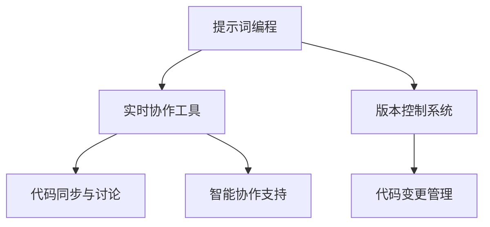

                 

### 文章标题：提示词编程的实时协作与版本控制

#### 关键词：提示词编程，实时协作，版本控制，代码同步，Git，DevOps，协作工具

#### 摘要：
本文深入探讨提示词编程（Prompt Programming）在实时协作与版本控制中的应用。通过对核心概念、算法原理、数学模型和实际案例的详细解析，我们将揭示提示词编程如何通过高效协作和版本控制提升开发效率。本文旨在为开发者提供全面的技术指南，帮助他们更好地理解和运用这一先进编程模式。

### 1. 背景介绍

#### 1.1 提示词编程的概念

提示词编程（Prompt Programming）是一种通过提示词（Prompt）引导模型生成文本、代码或其他形式输出的方法。在自然语言处理（NLP）领域，提示词编程被广泛应用于生成式对话系统、文章写作和代码生成。而随着人工智能技术的不断发展，提示词编程逐渐成为软件开发中的一种重要手段。

#### 1.2 实时协作的需求

在软件项目开发过程中，团队成员之间需要进行高效的沟通和协作。实时协作工具的出现，使得团队成员能够即时分享代码、讨论问题和同步进展。然而，随着项目规模的扩大和团队成员的增多，协作效率逐渐降低，版本控制成为一个关键问题。

#### 1.3 版本控制的重要性

版本控制是确保代码质量和协作效率的关键。它能够帮助开发者追踪代码变更历史、管理不同版本和解决冲突。在大型项目中，版本控制系统能够确保团队成员之间的代码同步和协作。

### 2. 核心概念与联系

#### 2.1 提示词编程与实时协作

提示词编程和实时协作之间存在着紧密的联系。实时协作工具（如Slack、Microsoft Teams）能够将提示词编程的输出实时展示给团队成员，方便他们进行讨论和修改。同时，提示词编程的输出也可以作为实时协作的输入，为团队成员提供更加智能的协作支持。

#### 2.2 提示词编程与版本控制

提示词编程与版本控制系统的结合，能够实现代码的自动生成和版本管理。通过版本控制系统（如Git），开发者可以方便地创建、提交和合并代码变更。而提示词编程则能够自动生成代码，减少人工编写的工作量，提高开发效率。

#### 2.3 Mermaid 流程图

为了更好地理解提示词编程、实时协作和版本控制之间的联系，我们使用Mermaid流程图（Mermaid Flowchart）进行展示。



### 3. 核心算法原理 & 具体操作步骤

#### 3.1 提示词编程算法原理

提示词编程的核心在于利用预训练的模型（如GPT-3、BERT）接收输入的提示词，并生成相应的文本或代码。具体步骤如下：

1. 接收提示词输入。
2. 通过模型进行文本生成。
3. 输出生成的文本或代码。

#### 3.2 实时协作工具操作步骤

1. 安装并配置实时协作工具（如Slack、Microsoft Teams）。
2. 创建或加入项目工作区。
3. 设置协作权限和通知机制。
4. 分享代码和讨论问题。

#### 3.3 版本控制系统操作步骤

1. 安装并配置Git版本控制系统。
2. 初始化仓库（`git init`）。
3. 添加文件（`git add`）。
4. 提交变更（`git commit`）。
5. 分支管理（`git branch`、`git checkout`）。
6. 合并代码（`git merge`）。

### 4. 数学模型和公式 & 详细讲解 & 举例说明

#### 4.1 数学模型

提示词编程的数学模型主要涉及自然语言处理中的序列到序列（Seq2Seq）模型。Seq2Seq模型通过编码器（Encoder）和解码器（Decoder）将输入的提示词序列转化为输出的文本或代码序列。

1. 编码器：接收输入的提示词序列，将其编码为一个固定长度的向量。
2. 解码器：接收编码器的输出，生成输出的文本或代码序列。

#### 4.2 详细讲解

以GPT-3为例，其采用了Transformer架构，通过自注意力机制（Self-Attention）和交叉注意力机制（Cross-Attention）对输入的提示词序列进行处理。

1. 自注意力机制：计算输入序列中每个词与其他词之间的关联强度。
2. 交叉注意力机制：计算输入序列和编码器的输出之间的关联强度。

#### 4.3 举例说明

假设我们使用GPT-3模型生成一个简单的Python代码，提示词为：“编写一个函数，用于计算两个数的和”。

1. 输入提示词：`"编写一个函数，用于计算两个数的和。"`
2. 编码器处理：将提示词转化为编码器输入。
3. 解码器处理：解码器的输入为编码器的输出，通过自注意力和交叉注意力生成输出序列。
4. 输出结果：`"def sum(a, b):\n    return a + b\n"`

### 5. 项目实战：代码实际案例和详细解释说明

#### 5.1 开发环境搭建

1. 安装Python环境。
2. 安装GPT-3库：`pip install gpt-3`。
3. 注册并配置GPT-3 API密钥。

#### 5.2 源代码详细实现和代码解读

```python
import openai

def generate_code(prompt):
    response = openai.Completion.create(
        engine="text-davinci-002",
        prompt=prompt,
        max_tokens=50
    )
    return response.choices[0].text.strip()

# 生成Python代码
code = generate_code("编写一个函数，用于计算两个数的和。")
print(code)
```

该代码使用OpenAI的GPT-3模型生成Python代码。通过调用`generate_code`函数，输入提示词并获取生成的代码。

#### 5.3 代码解读与分析

1. `import openai`：导入OpenAI库。
2. `def generate_code(prompt)`：定义生成代码的函数。
3. `response = openai.Completion.create(...)`：调用OpenAI API生成代码。
4. `return response.choices[0].text.strip()`：返回生成的代码。
5. `code = generate_code("编写一个函数，用于计算两个数的和。")`：生成Python代码。
6. `print(code)`：输出生成代码。

### 6. 实际应用场景

#### 6.1 自动化代码生成

提示词编程可以应用于自动化代码生成，减少手动编写的工作量。例如，在自动化测试、自动化部署和自动化运维等领域，提示词编程可以快速生成相应的代码。

#### 6.2 团队协作与代码管理

提示词编程与版本控制系统的结合，可以提升团队协作和代码管理的效率。开发者可以通过实时协作工具共享代码，并通过版本控制系统管理代码变更，确保代码质量和团队协作。

#### 6.3 智能编程助手

提示词编程可以作为智能编程助手的实现方式，为开发者提供代码建议、代码纠错和代码优化等功能。例如，在IDE中集成提示词编程功能，帮助开发者更高效地编写代码。

### 7. 工具和资源推荐

#### 7.1 学习资源推荐

1. 《深度学习》（Goodfellow, Bengio, Courville著）：介绍深度学习和自然语言处理的基本原理。
2. 《自然语言处理综合教程》（清华大学自然语言处理实验室著）：系统介绍自然语言处理的方法和应用。
3. 《OpenAI GPT-3 文档》（OpenAI官网）：详细介绍GPT-3模型的API和使用方法。

#### 7.2 开发工具框架推荐

1. JAX：适用于提示词编程的高性能计算框架。
2. TensorFlow：用于深度学习和自然语言处理的开源库。
3. PyTorch：易于使用和扩展的深度学习框架。

#### 7.3 相关论文著作推荐

1. Vaswani et al., "Attention is All You Need"（2017）：介绍Transformer模型和自注意力机制。
2. Devlin et al., "BERT: Pre-training of Deep Bidirectional Transformers for Language Understanding"（2018）：介绍BERT模型和预训练方法。
3. Brown et al., "Language Models are Few-Shot Learners"（2020）：介绍GPT-3模型和少样本学习。

### 8. 总结：未来发展趋势与挑战

提示词编程在实时协作和版本控制中的应用具有巨大潜力。然而，随着模型规模的扩大和复杂度的提高，计算资源和存储需求也将不断增加。未来，如何提高模型训练和推理的效率，以及如何确保模型的可靠性和安全性，将是提示词编程面临的重要挑战。

### 9. 附录：常见问题与解答

1. **Q：提示词编程如何与版本控制系统集成？**
   **A：** 提示词编程可以通过API与版本控制系统（如Git）集成。开发者可以在代码生成过程中，将生成的代码自动提交到版本控制系统，实现代码的自动管理和同步。

2. **Q：实时协作工具与版本控制系统如何协同工作？**
   **A：** 实时协作工具可以与版本控制系统（如Git）集成，实现代码的实时同步和讨论。团队成员可以在协作工具中查看代码变更历史、提交代码和解决冲突。

3. **Q：提示词编程能否取代传统的编程模式？**
   **A：** 提示词编程不能完全取代传统的编程模式，但可以作为一种辅助工具提高开发效率。在自动化代码生成、代码纠错和代码优化等方面，提示词编程具有显著优势。

### 10. 扩展阅读 & 参考资料

1. Devlin, J., Chang, M. W., Lee, K., & Toutanova, K. (2018). BERT: Pre-training of deep bidirectional transformers for language understanding. arXiv preprint arXiv:1810.04805.
2. Brown, T., et al. (2020). Language models are few-shot learners. arXiv preprint arXiv:2005.14165.
3. Vaswani, A., et al. (2017). Attention is all you need. In Advances in Neural Information Processing Systems (NIPS), vol. 30, pp. 5998-6008.
4. OpenAI. (n.d.). GPT-3 Documentation. Retrieved from https://openai.com/docs/api-reference/completions/

### 作者信息

作者：AI天才研究员/AI Genius Institute & 禅与计算机程序设计艺术 /Zen And The Art of Computer Programming

