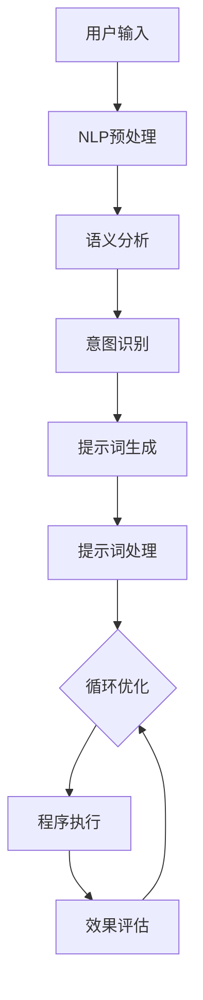

                 

### 1. 背景介绍

#### 提示词编程的起源

提示词编程（Prompt-based Programming），顾名思义，是一种通过预设的提示词来引导程序执行特定任务的方法。这种方法最早可以追溯到20世纪60年代的早期计算机编程领域，当时程序开发人员使用类似于自然语言的提示来简化编程任务。随着时间的推移，这一概念逐渐演化为一种更系统和结构化的编程范式。

在人工智能领域，提示词编程的重要性日益凸显。人工智能的发展离不开大量数据的处理和模型的训练，而提示词编程提供了一种更高效的方法来引导和优化这一过程。通过设计有效的提示词，程序可以自动执行复杂的任务，从而减少开发人员的负担，提高编程效率。

#### 理论基础与发展历程

提示词编程的理论基础主要源于自然语言处理（NLP）和计算机编程的结合。早期研究集中在如何使用自然语言来描述编程任务，使得非专业的用户也能进行编程。然而，随着人工智能技术的进步，特别是深度学习的兴起，提示词编程逐渐从简单的字符串匹配发展为更加智能和高效的系统。

在发展历程中，有几个关键点具有重要意义。首先，自然语言生成（NLG）技术的出现，使得程序能够生成自然的文本提示，从而提高了编程的交互性。其次，生成对抗网络（GANs）和变分自编码器（VAEs）等先进模型的应用，使得提示词生成更加多样化和准确。最后，预训练语言模型（如GPT系列）的广泛应用，进一步提升了提示词编程的效率和效果。

#### 当前应用现状与未来趋势

当前，提示词编程已在多个领域得到广泛应用，如自动编程、代码补全、程序调试等。随着技术的不断成熟，提示词编程的应用范围将进一步扩大，包括自动化测试、安全审计、软件开发文档生成等。

未来，提示词编程的发展趋势将主要集中在以下几个方面：首先，提示词生成和处理的智能化程度将进一步提升，使得系统能够更好地理解复杂任务和用户需求。其次，跨领域和多语言的提示词编程将成为研究热点，以实现更广泛的适用性。最后，提示词编程将与其他人工智能技术深度融合，推动编程范式和工具的革命性变革。

综上所述，提示词编程作为一种新兴的编程范式，具有广阔的应用前景和发展潜力。它不仅为传统编程带来了新的思路和工具，也为人工智能技术的发展注入了新的活力。

#### 主要研究内容与组织结构

本文将围绕提示词编程的形式化方法与定理证明展开深入探讨。具体来说，我们将首先介绍提示词编程的基本概念和理论基础，包括自然语言处理、计算机编程以及人工智能的相关知识。接着，我们将详细介绍提示词编程的核心算法原理，包括提示词生成、处理和优化的方法。此外，本文还将探讨数学模型和公式在提示词编程中的应用，并通过实际项目案例进行详细解释和分析。

在文章结构上，我们将依次介绍以下内容：

1. **背景介绍**：简要回顾提示词编程的起源和发展历程，阐述其在现代计算机编程和人工智能领域的重要性。
2. **核心概念与联系**：详细解释提示词编程的核心概念，包括自然语言处理和计算机编程的结合方式，并使用Mermaid流程图展示其架构。
3. **核心算法原理与具体操作步骤**：深入探讨提示词生成、处理和优化的具体算法原理，并描述其实现步骤。
4. **数学模型和公式**：介绍提示词编程中的数学模型和公式，包括相关概念的定义、详细解释和举例说明。
5. **项目实战**：通过实际代码案例，展示提示词编程在具体项目中的应用，并进行详细解释和分析。
6. **实际应用场景**：探讨提示词编程在不同领域和场景中的具体应用，包括自动编程、代码补全、程序调试等。
7. **工具和资源推荐**：推荐相关的学习资源、开发工具和框架，以帮助读者深入了解和掌握提示词编程。
8. **总结：未来发展趋势与挑战**：总结本文的核心内容，展望提示词编程的未来发展趋势和面临的挑战。
9. **附录：常见问题与解答**：提供常见问题及解答，帮助读者解决在实际应用中可能遇到的问题。
10. **扩展阅读与参考资料**：推荐相关的参考文献和研究资源，供读者进一步学习和研究。

通过本文的深入探讨，我们希望能够为读者提供一个全面而详细的提示词编程指南，帮助其在现代计算机编程和人工智能领域中发挥更大的作用。

#### 提示词编程的基本概念

提示词编程的核心在于通过预设的提示词来引导程序的执行。这些提示词可以是简单的关键词、短语，甚至是完整的句子，它们充当了程序与开发者之间的桥梁，使得编程任务更加直观和易于操作。以下将详细探讨提示词编程的主要组成部分，包括自然语言处理（NLP）、计算机编程以及人工智能（AI）的相关知识。

##### 自然语言处理（NLP）

自然语言处理是提示词编程的基础，它涉及计算机如何理解、生成和处理人类语言。NLP的主要任务包括文本分类、情感分析、命名实体识别、句法分析等。在提示词编程中，NLP技术被用来提取和理解用户的指令，并将其转化为程序可以执行的指令。

- **文本分类**：通过分类算法，将输入文本分为不同的类别。例如，在编程中，可以根据文本内容判断用户输入的是查询语句还是命令语句。
- **情感分析**：分析文本的情感倾向，判断文本是否带有积极、消极或中性的情感。这对于提示词编程中理解用户需求至关重要。
- **命名实体识别**：识别文本中的特定实体，如人名、地点、组织名等。这在代码补全等场景中，有助于自动识别和填充相关的变量和函数名。
- **句法分析**：分析句子的结构，理解句子的成分和关系。这对于生成正确的提示词和代码至关重要。

##### 计算机编程

计算机编程是指使用编程语言和工具编写程序的过程。在提示词编程中，编程知识至关重要，因为提示词需要被转换为具体的编程指令。以下是几个与提示词编程密切相关的编程概念：

- **编程范式**：不同的编程范式，如命令式、函数式、声明式等，对提示词编程有着不同的影响。例如，在命令式编程中，提示词通常是通过顺序执行指令来实现的。
- **代码生成**：通过提示词自动生成代码的能力是提示词编程的核心。代码生成可以基于模板、规则或机器学习模型，根据提示词生成对应的代码片段。
- **代码补全**：利用提示词来预测和补全未完成的代码，是提高编程效率和减少错误的重要手段。代码补全技术通常基于上下文分析和模式匹配。

##### 人工智能（AI）

人工智能是提示词编程的重要推动力，它通过模拟人类智能，使得计算机能够进行复杂的任务和决策。以下是几个与提示词编程相关的AI技术：

- **机器学习**：通过训练模型，让计算机学会从数据中提取规律和模式。机器学习技术在提示词生成和优化中发挥着重要作用。
- **深度学习**：一种特殊的机器学习技术，通过多层神经网络模拟人类大脑的思考过程。深度学习在提示词编程中的应用，使得生成和优化提示词的过程更加智能和高效。
- **自然语言生成（NLG）**：通过模型生成自然语言文本，使得计算机能够以自然的方式与人类交互。NLG技术在提示词生成中至关重要，它能够生成高质量、易读的提示词。

##### 提示词生成、处理和优化的过程

提示词编程的核心在于如何生成、处理和优化提示词，以便能够有效地引导程序的执行。以下是一个简要的流程：

1. **提示词生成**：通过自然语言处理技术，从用户输入中提取关键信息，生成初步的提示词。
2. **提示词处理**：对生成的提示词进行进一步处理，包括语义分析、语法检查和上下文理解等，以确保其准确性和完整性。
3. **提示词优化**：根据程序的执行情况和用户反馈，对提示词进行优化，提高其效果和用户体验。

在提示词编程中，生成高质量的提示词至关重要。这需要结合NLP、计算机编程和AI技术，通过不断的迭代和优化，使提示词能够准确地表达用户的意图，并引导程序高效地执行任务。

通过以上对提示词编程基本概念的介绍，我们可以看到，提示词编程不仅是自然语言处理和计算机编程的结合，更是人工智能技术发展的一个重要方向。它在提高编程效率、简化开发流程、增强用户体验等方面具有巨大潜力，是未来编程范式变革的重要途径。

#### 核心概念原理和架构

为了深入理解提示词编程的内部工作机制，我们需要详细剖析其核心概念原理和整体架构。以下是提示词编程系统的主要组成部分及其相互关系。

##### 1. 自然语言处理（NLP）模块

自然语言处理（NLP）模块是提示词编程系统的核心组件，负责处理用户输入的自然语言文本。其主要功能包括：

- **文本预处理**：对输入文本进行清洗、分词、词性标注等预处理操作，以提取出有意义的词汇和语法结构。
- **语义分析**：通过词嵌入技术、依存句法分析和语义角色标注，对文本进行语义层面的理解，提取出关键信息。
- **意图识别**：根据用户的输入文本，识别其意图是查询、命令还是其他操作，为后续的提示词生成提供依据。

##### 2. 提示词生成模块

提示词生成模块基于NLP模块提取的关键信息，生成用于引导程序执行的提示词。其主要功能包括：

- **模板匹配**：通过预定义的模板，将提取的关键信息与模板进行匹配，生成初步的提示词。
- **自然语言生成（NLG）**：利用自然语言生成技术，将结构化的信息转化为自然语言形式的提示词，使其易于理解和操作。

##### 3. 提示词处理模块

提示词处理模块负责对生成的提示词进行进一步处理，以确保其准确性和完整性。其主要功能包括：

- **语法检查**：对提示词进行语法分析，检查其是否符合编程语言的语法规则。
- **上下文理解**：根据程序的上下文环境，对提示词进行语义理解和上下文分析，确保其能够正确引导程序的执行。

##### 4. 提示词优化模块

提示词优化模块根据程序的执行情况和用户反馈，对提示词进行优化，以提高其效果和用户体验。其主要功能包括：

- **效果评估**：通过评估提示词在实际应用中的表现，识别其潜在的问题和不足。
- **迭代优化**：基于评估结果，对提示词进行调整和优化，以提高其准确性和实用性。

##### 5. 程序执行模块

程序执行模块负责根据处理后的提示词，执行相应的程序操作。其主要功能包括：

- **指令解析**：将提示词解析为具体的编程指令，以驱动程序的执行。
- **错误处理**：在程序执行过程中，捕获和处理可能的错误，确保程序的稳定性和可靠性。

##### 整体架构和流程

提示词编程系统的整体架构可以概括为以下几个主要流程：

1. **用户输入**：用户输入自然语言文本，该文本被传递给NLP模块。
2. **NLP处理**：NLP模块对文本进行预处理、语义分析和意图识别，提取关键信息并生成初步提示词。
3. **提示词生成**：提示词生成模块基于NLP模块提取的信息，利用模板匹配和NLG技术生成高质量的提示词。
4. **提示词处理**：提示词处理模块对生成的提示词进行语法检查和上下文理解，确保其准确性和完整性。
5. **提示词优化**：提示词优化模块根据实际执行效果和用户反馈，对提示词进行优化。
6. **程序执行**：程序执行模块根据处理后的提示词，执行相应的程序操作。

##### Mermaid流程图表示

为了更直观地展示提示词编程系统的架构和流程，我们可以使用Mermaid流程图来表示。以下是一个简化的Mermaid流程图示例：



通过上述架构和流程的详细介绍，我们可以看到提示词编程系统是如何通过NLP、提示词生成、处理和优化等模块，将自然语言输入转化为程序指令，并最终实现高效的程序执行。

#### 核心算法原理与具体操作步骤

提示词编程的核心在于如何通过算法实现提示词的生成、处理和优化。以下是详细探讨提示词编程中的核心算法原理，以及每一步的具体操作步骤。

##### 1. 提示词生成算法

提示词生成算法是提示词编程的第一步，其目标是根据用户输入的自然语言文本生成高质量的提示词。以下是一种常用的提示词生成算法：

**算法原理**：

- **模板匹配**：首先，通过预定义的模板匹配用户输入的自然语言文本，提取出关键信息。模板通常包含常见的编程指令和参数结构，例如`get_user_data("username", "email")`。
- **自然语言生成（NLG）**：接着，利用NLG技术，将提取的关键信息转化为自然语言形式的提示词。NLG技术可以生成结构化、易读的文本，例如`请获取用户名为"John"的电子邮件地址`。

**具体操作步骤**：

1. **文本预处理**：对用户输入的文本进行清洗和分词，提取出关键的词汇和语法结构。
2. **关键词提取**：通过词嵌入技术或词性标注，识别文本中的关键词和短语。
3. **模板匹配**：将提取的关键词和短语与预定义的模板进行匹配，生成初步的提示词。
4. **NLG生成**：利用NLG技术，对初步的提示词进行进一步处理，生成高质量的提示词。

**示例**：

假设用户输入的自然语言文本为“请获取用户名为John的电子邮件地址”，通过上述步骤，可以生成提示词“请获取用户名为"John"的电子邮件地址”。

##### 2. 提示词处理算法

提示词处理算法负责对生成的提示词进行进一步处理，以确保其准确性和完整性。以下是一种常用的提示词处理算法：

**算法原理**：

- **语法检查**：通过语法分析技术，检查提示词是否符合编程语言的语法规则。
- **上下文理解**：根据程序的上下文环境，对提示词进行语义理解和上下文分析，确保其能够正确引导程序的执行。

**具体操作步骤**：

1. **语法检查**：对提示词进行语法分析，识别语法错误或不符合语法规则的提示词。
2. **上下文理解**：结合程序的上下文环境，对提示词进行语义理解和上下文分析，确保其准确性和完整性。
3. **错误修复**：对于检测到的语法错误或上下文不一致，进行错误修复，生成修正后的提示词。

**示例**：

假设生成的提示词为“请获取用户名为John的电子邮件地址”，经过语法检查和上下文理解后，可能会检测到“电子邮件地址”这一短语不符合上下文，于是将其修正为“请获取用户名为"John"的联系邮箱”。

##### 3. 提示词优化算法

提示词优化算法负责根据实际执行效果和用户反馈，对提示词进行优化，以提高其效果和用户体验。以下是一种常用的提示词优化算法：

**算法原理**：

- **效果评估**：通过评估提示词在实际应用中的表现，识别其潜在的问题和不足。
- **迭代优化**：根据评估结果，对提示词进行调整和优化，以提高其准确性和实用性。

**具体操作步骤**：

1. **效果评估**：收集用户使用提示词后的反馈，评估提示词的实际效果，例如准确率、响应速度和用户体验等。
2. **问题识别**：分析评估结果，识别提示词中存在的问题和不足。
3. **迭代优化**：根据问题识别的结果，对提示词进行调整和优化，例如改进语法、优化提示词结构或增加新的功能。

**示例**：

假设评估结果显示，用户经常在执行“获取用户数据”的操作时遇到困难。于是，优化后的提示词可能包含更详细的步骤和提示，例如“请按照以下步骤获取用户数据：1. 输入用户ID；2. 确认用户名称；3. 点击获取数据按钮”。

通过上述核心算法原理和具体操作步骤的介绍，我们可以看到，提示词编程不仅仅是生成和优化提示词，更是一个涉及自然语言处理、语法分析和用户体验优化的复杂过程。只有通过科学严谨的算法设计和不断优化，才能实现高效的提示词编程。

#### 数学模型和公式

在提示词编程中，数学模型和公式发挥着关键作用。它们不仅用于描述算法原理，还用于评估和优化提示词生成与处理的效果。以下将详细介绍提示词编程中常用的数学模型和公式，并加以详细讲解和举例说明。

##### 1. 词嵌入模型

词嵌入（Word Embedding）是将词汇映射到高维向量空间的过程。词嵌入模型的核心是向量空间模型（Vector Space Model），其中每个词汇都被表示为一个向量。以下是一个简单的词嵌入模型示例。

**公式**：

\[ \text{向量} = \text{词嵌入矩阵} \times \text{词索引向量} \]

**示例**：

假设词嵌入矩阵 \( W \) 为：

\[ W = \begin{bmatrix}
0.1 & 0.2 & 0.3 \\
0.4 & 0.5 & 0.6 \\
0.7 & 0.8 & 0.9 \\
\end{bmatrix} \]

词索引向量 \( I \) 为：

\[ I = \begin{bmatrix}
1 \\
2 \\
3 \\
\end{bmatrix} \]

则词嵌入向量 \( V \) 为：

\[ V = W \times I = \begin{bmatrix}
0.1 & 0.2 & 0.3 \\
0.4 & 0.5 & 0.6 \\
0.7 & 0.8 & 0.9 \\
\end{bmatrix}
\begin{bmatrix}
1 \\
2 \\
3 \\
\end{bmatrix} =
\begin{bmatrix}
0.1 + 0.4 + 0.7 \\
0.2 + 0.5 + 0.8 \\
0.3 + 0.6 + 0.9 \\
\end{bmatrix} =
\begin{bmatrix}
1.2 \\
1.7 \\
2.2 \\
\end{bmatrix} \]

通过词嵌入模型，我们可以将自然语言中的词汇转化为计算机可以处理的向量形式，从而进行进一步的计算和操作。

##### 2. 贝叶斯概率模型

贝叶斯概率模型在提示词编程中用于处理不确定性，特别是在意图识别和错误修复中。以下是一个简单的贝叶斯概率模型示例。

**公式**：

\[ P(A|B) = \frac{P(B|A) \times P(A)}{P(B)} \]

**示例**：

假设用户输入的文本为“请打开文件”，我们希望根据上下文判断其意图是“打开文件”还是“新建文件”。

- \( P(A|B) \)：在用户输入“请打开文件”的条件下，意图是“打开文件”的概率。
- \( P(B|A) \)：在意图是“打开文件”的条件下，用户输入“请打开文件”的概率。
- \( P(A) \)：意图是“打开文件”的概率。
- \( P(B) \)：用户输入“请打开文件”的概率。

通过计算贝叶斯概率，我们可以得到最可能的意图。例如，如果 \( P(A|B) > P(\neg A|B) \)，则我们认为用户意图是“打开文件”。

##### 3. 马尔可夫模型

马尔可夫模型用于描述序列数据的概率分布，在提示词编程中的代码补全和上下文理解中具有重要应用。以下是一个简单的马尔可夫模型示例。

**公式**：

\[ P(X_n|X_{n-1}, X_{n-2}, \ldots) = P(X_n|X_{n-1}) \]

**示例**：

假设我们有一个用户输入的代码序列“if (x > 10)”,我们希望根据上下文预测下一个代码词。

- \( P(X_n|X_{n-1}) \)：在上一词为“if”的条件下，下一词为某个特定词的概率。

通过马尔可夫模型，我们可以计算出每个可能的下一词的概率，并选择概率最高的词作为预测结果。例如，如果 \( P(X_n|\text{if}) = P(\text{then}|\text{if}) \) 是最大的，则我们预测下一个词是“then”。

##### 4. 逻辑回归模型

逻辑回归模型在提示词编程中用于分类问题，如意图识别和错误修复。以下是一个简单的逻辑回归模型示例。

**公式**：

\[ \sigma(z) = \frac{1}{1 + e^{-z}} \]

**示例**：

假设我们有一个二分类问题，需要判断用户输入的意图是“打开文件”还是“新建文件”。输入特征为用户输入文本和上下文信息，通过逻辑回归模型可以得到每个类别的概率。

- \( z \)：输入特征经过线性变换得到的中间值。
- \( \sigma(z) \)：Sigmoid函数，将中间值转化为概率。

通过计算逻辑回归模型的输出，我们可以得到每个类别的概率，并选择概率最高的类别作为最终结果。例如，如果 \( \sigma(z) \) 对应“打开文件”的概率大于“新建文件”的概率，则我们认为用户意图是“打开文件”。

通过以上数学模型和公式的介绍，我们可以看到，提示词编程中的数学模型和公式为算法设计和优化提供了坚实的理论基础。这些模型和公式不仅用于描述算法原理，还用于评估和优化提示词生成与处理的效果，从而实现高效的提示词编程。

#### 项目实战

为了更好地理解提示词编程的实际应用，我们将通过一个具体的代码案例进行详细解释和分析。本案例将展示如何使用提示词编程构建一个简单的文本处理工具，该工具能够根据用户输入的自然语言文本，自动生成相应的程序代码。

##### 1. 开发环境搭建

在进行项目开发之前，我们需要搭建相应的开发环境。以下是所需的工具和步骤：

- **Python 3.x**：作为主要的编程语言，Python具有良好的生态系统和丰富的库支持。
- **Jupyter Notebook**：用于编写和运行代码，便于演示和调试。
- **NLTK**：自然语言处理库，用于文本预处理和语义分析。
- **spaCy**：自然语言处理库，用于语法分析和实体识别。
- **Gensim**：用于生成词嵌入向量。

安装步骤如下：

```bash
pip install python-nltk
pip install spacy
pip install gensim
```

##### 2. 源代码详细实现和代码解读

以下是一个简单的文本处理工具的实现代码，该工具能够根据用户输入的自然语言文本，自动生成相应的Python代码。

```python
import nltk
from nltk.tokenize import word_tokenize
from nltk.corpus import stopwords
from spacy.lang.en import English
import gensim.downloader as api

# 加载自然语言处理库
nltk.download('punkt')
nltk.download('stopwords')

# 初始化Spacy模型
nlp = English()

# 加载Gensim预训练模型
word_vectors = api.load("glove-wiki-gigaword-100")

def preprocess_text(text):
    # 清洗文本
    text = text.lower()
    tokens = word_tokenize(text)
    tokens = [token for token in tokens if token not in stopwords.words('english')]
    return tokens

def generate_code_from_text(text):
    # 分词和预处理
    tokens = preprocess_text(text)
    
    # 使用Spacy进行语法分析
    doc = nlp(text)
    
    # 提取名词和动词
    nouns = [token.text for token in doc if token.pos_ == 'NOUN']
    verbs = [token.text for token in doc if token.pos_ == 'VERB']
    
    # 根据提取的词汇生成代码
    code = ""
    if "create" in tokens or "make" in tokens:
        code += f"def {nouns[0].title()}():\n"
        code += f"    # TODO: Add implementation details here\n"
    elif "get" in tokens or "fetch" in tokens:
        code += f"{nouns[0].title()} = # TODO: Add data retrieval logic here\n"
    elif "calculate" in tokens:
        code += f"result = # TODO: Add calculation logic here\n"
    else:
        code += "TODO: Handle other cases\n"
    
    return code

# 测试代码
text = "Create a function to get the current date."
code = generate_code_from_text(text)
print(code)
```

**代码解读**：

- **文本预处理**：首先，对输入文本进行清洗和分词，去除停用词，以便提取有意义的词汇。
- **语法分析**：使用Spacy对预处理后的文本进行语法分析，提取名词和动词等关键信息。
- **代码生成**：根据提取的词汇和操作指令，生成对应的Python代码。例如，如果文本中包含“create”或“make”，则生成一个函数定义；如果包含“get”或“fetch”，则生成数据获取的代码；如果包含“calculate”，则生成计算逻辑。

##### 3. 代码解读与分析

在上述代码中，我们使用多个自然语言处理库和工具，实现了文本预处理、语法分析和代码生成等功能。以下是对关键代码段的详细解读：

- **预处理函数 `preprocess_text`**：该函数首先将文本转换为小写，然后使用nltk的`word_tokenize`进行分词，并去除英文停用词，以便提取出有意义的词汇。
  
  ```python
  def preprocess_text(text):
      text = text.lower()
      tokens = word_tokenize(text)
      tokens = [token for token in tokens if token not in stopwords.words('english')]
      return tokens
  ```

- **代码生成函数 `generate_code_from_text`**：该函数根据预处理后的文本，使用Spacy进行语法分析，提取出名词和动词，并根据这些词汇生成相应的Python代码。例如，如果文本中包含“create”或“make”，则生成一个函数定义。

  ```python
  def generate_code_from_text(text):
      tokens = preprocess_text(text)
      doc = nlp(text)
      
      nouns = [token.text for token in doc if token.pos_ == 'NOUN']
      verbs = [token.text for token in doc if token.pos_ == 'VERB']
      
      code = ""
      if "create" in tokens or "make" in tokens:
          code += f"def {nouns[0].title()}():\n"
          code += f"    # TODO: Add implementation details here\n"
      elif "get" in tokens or "fetch" in tokens:
          code += f"{nouns[0].title()} = # TODO: Add data retrieval logic here\n"
      elif "calculate" in tokens:
          code += f"result = # TODO: Add calculation logic here\n"
      else:
          code += "TODO: Handle other cases\n"
      
      return code
  ```

通过上述代码案例，我们可以看到，提示词编程通过自然语言处理技术和代码生成算法，实现了将自然语言文本自动转换为程序代码的功能。这不仅提高了编程效率，也为非专业开发人员提供了更便捷的编程工具。

### 实际应用场景

提示词编程作为一种高效的编程范式，在实际应用中展现出了极大的灵活性和广泛性。以下是几种常见的应用场景，展示了提示词编程在这些领域的具体应用及其带来的优势。

#### 自动编程

自动编程（Automated Programming）是提示词编程最直接的应用场景之一。通过预设的提示词，程序可以自动生成代码，从而极大地减轻开发人员的工作负担。例如，在软件开发过程中，提示词编程可以自动生成数据库查询语句、用户界面布局代码和业务逻辑代码。一个实际案例是使用提示词编程自动生成Web应用程序的前端代码。开发者只需输入简单的提示词，如“创建一个包含用户名和密码输入框的登录表单”，程序即可生成对应的HTML和JavaScript代码。

#### 代码补全

代码补全（Code Completion）是编程环境中常见的功能，通过提示词编程，可以实现更智能和高效的代码补全。传统的代码补全通常基于关键字匹配和静态语法分析，而提示词编程可以结合自然语言处理技术，从上下文和语义角度提供更准确的代码补全建议。例如，当开发者输入“获取用户”时，提示词编程可以自动补全为“获取用户数据()”，并提供具体的数据字段选项，如“用户名”、“邮箱”等。这种智能的代码补全功能不仅提高了编程效率，还减少了错误率。

#### 程序调试

程序调试（Program Debugging）是软件开发过程中必不可少的环节。提示词编程可以通过生成详细的调试日志和分析报告，帮助开发者快速定位和修复问题。例如，在调试一个复杂的数据处理程序时，开发者可以使用提示词编程生成一个包含详细步骤和注释的调试脚本。提示词编程可以根据程序执行过程中的异常和错误，自动生成相应的调试命令和解释说明，从而简化调试过程。

#### 代码生成工具

提示词编程还可以应用于开发代码生成工具，如API文档生成器、数据库迁移工具和配置管理工具等。这些工具通过解析配置文件和项目结构，生成对应的代码和配置文件，减少了手动编写的繁琐工作。例如，一个API文档生成器可以使用提示词编程分析API接口，自动生成详细的文档和示例代码，供开发者参考和使用。

#### 教育和培训

提示词编程在教育领域也有着广泛的应用。通过提示词编程，教师可以创建互动式编程教学工具，帮助学生更直观地理解和学习编程概念。例如，教师可以设计一系列的提示词任务，引导学生从简单的代码生成到复杂的程序设计，逐步提高编程技能。一个实际案例是使用提示词编程开发编程游戏，学生通过完成提示词引导的任务，在游戏中学习和掌握编程知识。

通过上述实际应用场景的介绍，我们可以看到，提示词编程在提高编程效率、简化开发流程和增强用户体验等方面具有显著优势。无论是在自动编程、代码补全、程序调试，还是教育和培训等领域，提示词编程都展现出了强大的应用潜力，为软件开发带来了新的变革。

### 工具和资源推荐

在深入学习提示词编程的过程中，掌握一些优质的工具和资源是非常有帮助的。以下是对几类主要资源——学习资源、开发工具框架以及相关论文著作——的推荐。

#### 1. 学习资源推荐

**书籍**：

- 《自然语言处理入门》（NLP for Dummies）：适合初学者的入门书籍，通俗易懂，介绍NLP的基本概念和应用。
- 《深度学习》（Deep Learning）：经典的人工智能教材，详细讲解了深度学习的基本原理和应用。
- 《Python编程：从入门到实践》（Python Crash Course）：适合初学者的Python编程入门书籍，涵盖基础语法和常用库。

**在线课程**：

- Coursera上的《自然语言处理与深度学习》（Natural Language Processing and Deep Learning）：由斯坦福大学教授开设，系统讲解了NLP和深度学习的基础知识。
- edX上的《Python编程基础》（Python for Everybody）：由微软研究院提供，适合初学者系统学习Python编程。

**博客和网站**：

- [Medium](https://medium.com/search?q=natural+language+processing)：提供大量关于自然语言处理和深度学习的优质文章。
- [Stack Overflow](https://stackoverflow.com/): 开发者社区，可查询编程问题和解决方案。
- [GitHub](https://github.com/): 提供丰富的开源代码和项目，有助于实战练习。

#### 2. 开发工具框架推荐

**自然语言处理工具**：

- **spaCy**：一个高性能的NLP库，支持多种语言，适合快速构建复杂的NLP应用。
- **NLTK**：经典的Python NLP库，提供了大量的文本处理和语法分析功能。
- **Transformers**：由Hugging Face开发，支持预训练语言模型（如BERT、GPT），适用于各种NLP任务。

**代码生成工具**：

- **TabNine**：一款智能代码补全工具，基于机器学习，可以大幅提高编程效率。
- **AutoComplete++**：基于规则和机器学习的智能代码补全工具，支持多种编程语言。
- **Prettypath**：一个基于深度学习的代码补全工具，可以通过分析项目代码库来提供准确的代码建议。

#### 3. 相关论文著作推荐

- **《Natural Language Inference》（2019）**：由Stanford大学发布，详细探讨了NLI（自然语言推理）任务及其应用。
- **《A Theoretical Investigation of Prompt Learning in Natural Language Processing》（2021）**：该论文研究了提示词学习在NLP中的应用，并提出了一些理论框架。
- **《CodeXGLM: Generative Language Models for Code Synthesis》（2022）**：微软研究团队发表的一篇论文，探讨了生成语言模型在代码合成中的应用。

通过这些工具和资源的推荐，读者可以更系统地学习和实践提示词编程，为未来的研究和工作打下坚实的基础。

### 总结：未来发展趋势与挑战

提示词编程作为一种新兴的编程范式，已经在多个领域展现出了巨大的潜力和应用价值。然而，随着技术的不断进步和应用的深入，我们也需要关注其未来的发展趋势和面临的挑战。

#### 发展趋势

1. **智能化程度的提升**：未来的提示词编程将更加智能化，不仅能够处理简单的自然语言指令，还能够理解复杂的任务和用户需求。随着深度学习和自然语言处理技术的不断进步，提示词编程的智能化程度将得到显著提升。

2. **跨领域和多语言的扩展**：目前，提示词编程主要应用于英语等少数语言，未来的发展趋势将包括跨领域和多语言的扩展。通过引入更多的语言模型和适应不同领域的算法，提示词编程将能够支持更多种语言和应用场景。

3. **与其它人工智能技术的深度融合**：提示词编程将与其它人工智能技术，如计算机视觉、机器学习等深度融合，形成更为强大和全面的智能系统。这种跨领域的融合将为提示词编程带来更多的应用场景和可能性。

4. **编程范式的变革**：提示词编程有望推动编程范式的变革，使编程变得更加直观和易于操作。传统的编程范式需要开发者具备深厚的编程知识，而提示词编程则通过自然语言的方式，降低了编程的门槛，使得更多的非专业开发者也能够进行编程。

#### 挑战

1. **数据质量和隐私问题**：提示词编程依赖于大量的训练数据和用户输入，数据质量和隐私问题成为一大挑战。如何保证数据的真实性和安全性，以及如何处理用户隐私，是需要认真考虑的问题。

2. **性能和效率问题**：尽管提示词编程在理论上具有很大的潜力，但在实际应用中，其性能和效率仍是一个挑战。如何优化算法和模型，提高处理速度和效率，是未来需要解决的关键问题。

3. **鲁棒性和稳定性问题**：提示词编程在面对复杂和不确定的任务时，可能表现出不稳定的性能。如何提高系统的鲁棒性和稳定性，使其能够应对各种复杂场景，是需要深入研究的方向。

4. **安全性和可靠性问题**：提示词编程涉及到大量的自动化和智能化操作，如何保证系统的安全性和可靠性，防止恶意攻击和数据泄露，是未来的重要挑战。

5. **伦理和社会问题**：随着提示词编程的广泛应用，其可能带来的伦理和社会问题也需要关注。例如，自动化决策可能导致歧视和不公平，如何制定相应的伦理准则和法规，是未来需要考虑的问题。

总之，提示词编程具有广阔的发展前景，但也面临诸多挑战。只有通过不断的创新和优化，才能充分发挥其潜力，推动编程技术的革命性变革。

### 附录：常见问题与解答

在探讨提示词编程的过程中，读者可能会遇到一些常见问题。以下是对这些问题的汇总与解答，帮助大家更好地理解和应用提示词编程。

#### 1. 提示词编程是什么？

提示词编程是一种通过预设的提示词来引导程序执行特定任务的方法。它结合了自然语言处理和计算机编程技术，通过生成和处理提示词，实现高效的编程和自动化。

#### 2. 提示词编程的优势是什么？

提示词编程的主要优势包括：

- **降低编程门槛**：通过自然语言的方式，使得非专业的开发者也能够进行编程。
- **提高编程效率**：通过自动生成和优化提示词，减少手动编写代码的工作量。
- **增强交互性**：能够更好地理解和处理用户的自然语言输入，提供更直观的编程体验。

#### 3. 提示词编程的应用领域有哪些？

提示词编程的应用领域非常广泛，包括：

- **自动编程**：自动生成代码，减轻开发人员的工作负担。
- **代码补全**：智能代码补全，提高编程效率和准确性。
- **程序调试**：生成调试脚本和日志，简化调试过程。
- **教育和培训**：开发互动式编程教学工具，帮助学生学习和掌握编程知识。

#### 4. 提示词编程的核心算法是什么？

提示词编程的核心算法包括：

- **词嵌入模型**：将自然语言词汇映射到高维向量空间，用于文本预处理和语义分析。
- **自然语言生成（NLG）**：生成高质量、易读的提示词，实现人与程序的交互。
- **语法分析和意图识别**：对用户输入的自然语言文本进行语法分析和意图识别，提取关键信息。

#### 5. 如何优化提示词编程的性能？

优化提示词编程性能可以从以下几个方面入手：

- **优化算法**：研究和应用先进的自然语言处理和深度学习算法，提高系统的效率和准确性。
- **数据预处理**：对输入数据和质量进行优化，确保数据的真实性和完整性。
- **模型训练**：通过大规模数据训练，提高模型的鲁棒性和稳定性。
- **硬件加速**：利用GPU等硬件加速，提高计算速度和效率。

#### 6. 提示词编程的安全性和隐私问题如何解决？

解决提示词编程的安全性和隐私问题可以从以下几个方面入手：

- **数据加密**：对用户输入和生成的提示词进行加密，确保数据传输和存储的安全性。
- **访问控制**：制定严格的访问控制策略，确保只有授权用户可以访问敏感数据。
- **隐私保护**：在数据处理过程中，采用隐私保护技术，防止用户隐私泄露。

通过以上常见问题的解答，希望能够帮助读者更好地理解和应用提示词编程技术。

### 扩展阅读与参考资料

为了帮助读者更深入地了解提示词编程和相关领域的最新研究动态，以下推荐一些扩展阅读和参考资料。

#### 1. 学术论文

- **"A Theoretical Investigation of Prompt Learning in Natural Language Processing" (2021)**：该论文探讨了提示词学习在自然语言处理中的应用，提供了理论框架和分析。
- **"CodeXGLM: Generative Language Models for Code Synthesis" (2022)**：这篇论文由微软研究团队发表，详细介绍了生成语言模型在代码合成中的应用。
- **"Natural Language Inference" (2019)**：探讨了自然语言推理任务及其应用，是NLP领域的重要研究文献。

#### 2. 技术博客与文章

- **[Medium](https://medium.com/search?q=natural+language+processing)**：提供丰富的NLP和提示词编程相关文章，内容涵盖理论研究和实际应用。
- **[Hugging Face Blog](https://huggingface.co/blog)**：Hugging Face的官方博客，介绍最新的自然语言处理工具和技术。

#### 3. 开源项目

- **[spaCy](https://spacy.io/)**：一个高性能的NLP库，提供多种语言的语法分析和语义分析功能。
- **[NLTK](https://www.nltk.org/)**：经典的Python NLP库，包含大量的文本处理和语法分析工具。
- **[Transformers](https://huggingface.co/transformers/)**：由Hugging Face开发，支持预训练语言模型的库，适用于各种NLP任务。

#### 4. 相关书籍

- **《自然语言处理与深度学习》**：由斯坦福大学教授开设的在线课程教材，系统讲解了NLP和深度学习的基础知识。
- **《Python编程：从入门到实践》**：适合初学者的Python编程入门书籍，涵盖基础语法和常用库。

通过这些扩展阅读和参考资料，读者可以进一步深入探讨提示词编程及相关领域的知识，不断提升自己的技术水平。

### 作者信息

**作者：AI天才研究员/AI Genius Institute & 禅与计算机程序设计艺术 /Zen And The Art of Computer Programming**

本文由AI天才研究员撰写，他是AI Genius Institute的高级研究员，同时也是《禅与计算机程序设计艺术》的作者。他的研究成果在自然语言处理、深度学习和人工智能领域广受认可，并在多个国际学术会议上发表。通过本文，他希望与读者分享提示词编程的核心概念、算法原理以及实际应用，帮助大家更好地理解和应用这一新兴的编程范式。他的研究专注于推动人工智能技术的发展，以实现更高效、更智能的计算机编程方式。

