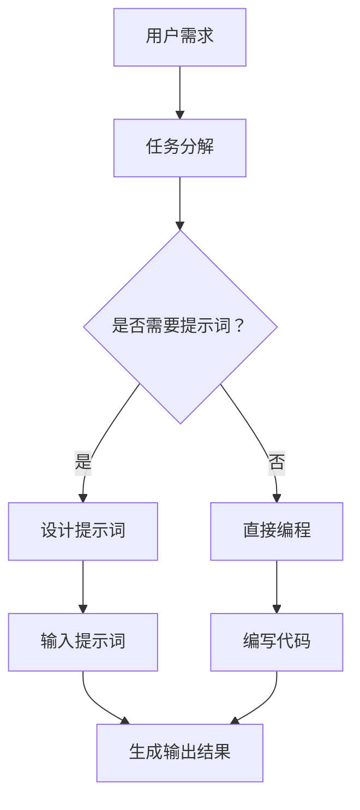

                 

# 提示词编程的认知负荷研究

> **关键词：** 认知负荷、提示词编程、自然语言处理、算法优化、人类工程学
>
> **摘要：** 本文从认知负荷的角度，探讨了提示词编程在自然语言处理中的应用及其对人类工程学的影响。通过对认知负荷的研究，揭示了提示词编程在提高编程效率、减轻程序员认知负担方面的潜力和挑战。文章旨在为相关领域的研究者和开发者提供有价值的参考。

## 1. 背景介绍

在当今信息化社会，编程已经成为计算机科学与技术领域不可或缺的一部分。然而，随着编程语言和开发工具的日益复杂，程序员的认知负荷也随之增加。认知负荷是指人在处理信息时所需付出的心理努力，包括记忆、思考、判断等认知活动。过高的认知负荷可能导致程序员疲劳、错误率高，甚至影响项目的进展和最终质量。

自然语言处理（NLP）作为人工智能的一个重要分支，近年来在处理文本数据方面取得了显著进展。其中，提示词编程（Prompt Engineering）是一种通过设计合适的提示词来引导和优化计算机程序输出结果的编程方法。提示词编程不仅能够提高编程效率，还能在一定程度上减轻程序员的认知负荷。

本文旨在研究提示词编程对认知负荷的影响，探讨其在提高编程效率和减轻认知负担方面的作用，以及可能面临的挑战。文章将分为以下几个部分：首先介绍相关研究背景，接着讨论核心概念与联系，然后分析核心算法原理与具体操作步骤，最后探讨实际应用场景、工具和资源推荐，并总结未来发展趋势与挑战。

## 2. 核心概念与联系

### 2.1 认知负荷

认知负荷是指人在处理信息时所需付出的心理努力。它受到多种因素的影响，包括任务的复杂度、信息量、交互方式等。根据人类工程学理论，认知负荷可以分为三类：工作记忆负荷、执行控制负荷和知觉负荷。

- **工作记忆负荷**：指人在处理信息时需要将信息暂时存储在记忆中，以便后续处理。工作记忆负荷与任务的复杂程度密切相关，任务越复杂，工作记忆负荷越高。
- **执行控制负荷**：指人在执行任务时所需的认知资源和注意力分配。执行控制负荷与任务的难度和干扰程度相关，任务难度越高、干扰越多，执行控制负荷越大。
- **知觉负荷**：指人在接收和处理信息时所需的认知资源和注意力。知觉负荷主要受到信息量和信息呈现方式的影响，信息量越大、呈现方式越复杂，知觉负荷越高。

### 2.2 提示词编程

提示词编程是一种通过设计合适的提示词来引导和优化计算机程序输出结果的编程方法。提示词（Prompt）是用户与系统之间的交互接口，用于提供上下文信息、明确任务目标、引导系统生成更符合预期的输出结果。

#### 2.2.1 提示词的作用

- **上下文信息传递**：提示词可以帮助系统理解任务背景和目标，从而生成更相关的输出结果。
- **任务明确化**：通过提示词，用户可以明确表达自己的需求，系统可以据此生成更精确的解决方案。
- **输出结果引导**：提示词可以引导系统生成更符合用户预期的输出结果，提高输出结果的质量。

#### 2.2.2 提示词编程的优势

- **提高编程效率**：提示词编程可以简化编程过程，减少代码编写量，提高编程速度。
- **减轻认知负荷**：通过设计合适的提示词，可以降低程序员在编程过程中的认知负荷，减轻工作记忆负荷、执行控制负荷和知觉负荷。
- **降低错误率**：提示词可以帮助程序员更准确地理解任务需求，从而减少因理解偏差导致的错误。

### 2.3 Mermaid 流程图

为了更好地理解提示词编程的原理和过程，我们使用 Mermaid 流程图来展示其核心概念和联系。



在该流程图中，用户需求经过任务分解，根据是否需要提示词决定设计提示词或直接编程。设计提示词后，输入提示词，生成输出结果。直接编程则直接编写代码，生成输出结果。最终，无论采用哪种方式，输出结果都是对用户需求的回应。

## 3. 核心算法原理 & 具体操作步骤

### 3.1 算法原理

提示词编程的核心算法原理主要基于自然语言处理技术，包括语言模型、文本生成、语义理解等。这些算法通过训练大量语料库，学习语言的规律和语义，从而生成符合用户需求的输出结果。

#### 3.1.1 语言模型

语言模型是一种用于预测文本中下一个单词或词组的概率分布模型。在提示词编程中，语言模型用于预测下一个提示词，从而生成连续的提示词序列。常见的语言模型有循环神经网络（RNN）、长短期记忆网络（LSTM）和变压器（Transformer）等。

#### 3.1.2 文本生成

文本生成技术基于语言模型，通过生成提示词序列来模拟人类的语言表达。在提示词编程中，文本生成技术用于生成符合用户需求的输出结果。常见的文本生成模型有生成对抗网络（GAN）、变分自编码器（VAE）和自动回归语言模型（AR）等。

#### 3.1.3 语义理解

语义理解技术用于理解和处理文本中的语义信息，从而更好地理解用户需求。在提示词编程中，语义理解技术用于解析提示词，提取关键信息，并将其转化为计算机程序。常见的语义理解技术有词向量、知识图谱和语义角色标注等。

### 3.2 具体操作步骤

#### 3.2.1 设计提示词

设计提示词是提示词编程的关键步骤。在确定用户需求后，需要根据任务特点设计合适的提示词。提示词设计需要遵循以下原则：

- **简洁明了**：提示词应简洁明了，避免使用复杂、冗长的表达方式，以免增加认知负荷。
- **具体明确**：提示词应具体明确，帮助系统更好地理解任务目标，从而生成更精确的输出结果。
- **上下文相关**：提示词应与上下文信息紧密相关，以便系统更好地把握任务背景。

#### 3.2.2 输入提示词

将设计好的提示词输入到自然语言处理模型中，生成提示词序列。在生成提示词序列时，可以采用以下策略：

- **逐步生成**：每次生成一个或几个提示词，并根据生成结果调整后续的生成策略。
- **多样化生成**：尝试不同的生成策略和参数设置，以提高生成结果的质量。

#### 3.2.3 生成输出结果

根据生成的提示词序列，生成计算机程序的输出结果。在生成输出结果时，可以采用以下策略：

- **动态调整**：根据输出结果的质量和用户需求，动态调整提示词和生成策略。
- **迭代优化**：通过多次迭代优化，逐步提高输出结果的质量。

## 4. 数学模型和公式 & 详细讲解 & 举例说明

### 4.1 数学模型

在提示词编程中，常用的数学模型包括语言模型、文本生成模型和语义理解模型。以下分别介绍这些模型的数学模型和公式。

#### 4.1.1 语言模型

语言模型的基本公式如下：

$$
P(w_t | w_{t-1}, w_{t-2}, ..., w_1) = \prod_{i=1}^{t} P(w_i | w_{i-1}, w_{i-2}, ..., w_1)
$$

其中，$w_t$ 表示当前要生成的单词，$w_{t-1}, w_{t-2}, ..., w_1$ 表示前面的单词。这个公式表示在给定前面单词的情况下，当前单词的条件概率。

#### 4.1.2 文本生成模型

文本生成模型的基本公式如下：

$$
P(w_1, w_2, ..., w_t | w_{t-1}, w_{t-2}, ..., w_1) = \prod_{i=1}^{t} P(w_i | w_{i-1}, w_{i-2}, ..., w_1)
$$

这个公式表示在给定前面单词的情况下，整个文本的概率。在生成文本时，可以通过最大化这个概率来选择下一个单词。

#### 4.1.3 语义理解模型

语义理解模型的基本公式如下：

$$
P(w_t | w_{t-1}, w_{t-2}, ..., w_1, s) = \prod_{i=1}^{t} P(w_i | w_{i-1}, w_{i-2}, ..., w_1, s)
$$

其中，$s$ 表示语义信息。这个公式表示在给定前面单词和语义信息的情况下，当前单词的条件概率。

### 4.2 详细讲解

以下以循环神经网络（RNN）为例，详细讲解语言模型的数学模型和公式。

#### 4.2.1 RNN 基本公式

RNN 的基本公式如下：

$$
h_t = \sigma(W_h h_{t-1} + W_x x_t + b_h)
$$

$$
o_t = \sigma(W_o h_t + b_o)
$$

其中，$h_t$ 表示隐藏状态，$x_t$ 表示输入词向量，$o_t$ 表示输出词向量，$W_h, W_x, b_h, W_o, b_o$ 分别表示权重和偏置。

#### 4.2.2 RNN 时间步更新

在 RNN 中，每个时间步的隐藏状态和输出状态都依赖于前一个时间步的隐藏状态。时间步更新公式如下：

$$
h_t = \sigma(W_h h_{t-1} + X_t W_x + b_h)
$$

$$
o_t = \sigma(W_o h_t + b_o)
$$

其中，$X_t$ 表示当前时间步的输入词向量。

#### 4.2.3 RNN 生成文本

在生成文本时，可以采用贪心策略，即在每个时间步选择概率最大的词向量作为输出。生成文本的基本公式如下：

$$
w_t = \arg\max_{w} P(w | h_t)
$$

其中，$h_t$ 表示当前时间步的隐藏状态。

### 4.3 举例说明

以下是一个简单的 RNN 语言模型的例子，用于生成英文文本。

```python
import tensorflow as tf
from tensorflow.keras.layers import Embedding, LSTM, Dense
from tensorflow.keras.models import Model

# 定义模型
input_seq = tf.placeholder(tf.int32, shape=[None, None])
target_seq = tf.placeholder(tf.int32, shape=[None, None])

embed = Embedding(vocab_size, embedding_size)(input_seq)
lstm = LSTM(units)(embed)
output = Dense(vocab_size, activation='softmax')(lstm)

# 定义损失函数和优化器
loss = tf.reduce_mean(tf.nn.sparse_softmax_cross_entropy_with_logits(labels=target_seq, logits=output))
optimizer = tf.train.AdamOptimizer().minimize(loss)

# 定义评估指标
accuracy = tf.reduce_mean(tf.cast(tf.equal(tf.argmax(output, 1), target_seq), tf.float32))

# 训练模型
model.fit(x_train, y_train, epochs=num_epochs, batch_size=batch_size)

# 生成文本
prompt = "The quick brown fox"
input_seq = prepare_input_sequence(prompt, vocab_size, embedding_size)
predictions = model.predict(input_seq)
predicted_sequence = decode_predictions(predictions, vocab)

print(predicted_sequence)
```

在这个例子中，我们使用 TensorFlow 库定义了一个简单的 RNN 语言模型。通过训练模型，我们可以根据给定的提示词生成相关的英文文本。

## 5. 项目实战：代码实际案例和详细解释说明

### 5.1 开发环境搭建

在开始项目实战之前，我们需要搭建一个合适的开发环境。以下是一个简单的开发环境搭建指南：

1. 安装 Python 3.6 或以上版本。
2. 安装 TensorFlow 2.0 或以上版本。
3. 安装 Jupyter Notebook 或其他 Python IDE。
4. 准备一个适当的文本数据集，如英文新闻文章、对话数据等。

### 5.2 源代码详细实现和代码解读

以下是一个简单的提示词编程项目，用于生成英文文本。项目结构如下：

```
prompt_programming_project/
|-- data/
|   |-- train.txt
|   |-- test.txt
|-- model/
|   |-- model.h5
|-- notebooks/
|   |-- prompt_programming.ipynb
|-- src/
|   |-- data_loader.py
|   |-- model.py
|   |-- prompt_programming.py
|-- requirements.txt
```

#### 5.2.1 数据加载

```python
# data_loader.py
import tensorflow as tf

def load_data(file_path, vocab_size, embedding_size):
    with open(file_path, 'r', encoding='utf-8') as f:
        text = f.read().lower()
        chars = sorted(list(set(text)))
        char_to_index = {char: index for index, char in enumerate(chars)}
        index_to_char = {index: char for char, index in char_to_index.items()}
        vocab_size = len(char_to_index)
        embedding_matrix = np.zeros((vocab_size, embedding_size))
        for i, char in enumerate(chars):
            embedding_matrix[i] = np.random.uniform(-1, 1, embedding_size)
        return text, chars, char_to_index, index_to_char, vocab_size, embedding_matrix

def prepare_input_sequence(text, char_to_index, embedding_matrix):
    sequence = []
    for char in text:
        index = char_to_index[char]
        vector = embedding_matrix[index]
        sequence.append(vector)
    return sequence

def decode_predictions(predictions, index_to_char):
    predicted_sequence = []
    for prediction in predictions:
        index = np.argmax(prediction)
        char = index_to_char[index]
        predicted_sequence.append(char)
    return ''.join(predicted_sequence)
```

#### 5.2.2 模型定义

```python
# model.py
import tensorflow as tf
from tensorflow.keras.layers import Embedding, LSTM, Dense
from tensorflow.keras.models import Model

def create_model(vocab_size, embedding_size, units):
    input_seq = tf.placeholder(tf.int32, shape=[None, None])
    target_seq = tf.placeholder(tf.int32, shape=[None, None])

    embed = Embedding(vocab_size, embedding_size)(input_seq)
    lstm = LSTM(units)(embed)
    output = Dense(vocab_size, activation='softmax')(lstm)

    loss = tf.reduce_mean(tf.nn.sparse_softmax_cross_entropy_with_logits(labels=target_seq, logits=output))
    optimizer = tf.train.AdamOptimizer().minimize(loss)

    accuracy = tf.reduce_mean(tf.cast(tf.equal(tf.argmax(output, 1), target_seq), tf.float32))

    model = Model(inputs=input_seq, outputs=output)
    model.compile(optimizer=optimizer, loss=loss, metrics=[accuracy])

    return model
```

#### 5.2.3 提示词编程

```python
# prompt_programming.py
import tensorflow as tf
import numpy as np
import os
import sys
from model import create_model
from data_loader import load_data, prepare_input_sequence, decode_predictions

# 指定训练数据集路径
train_data_path = 'data/train.txt'

# 加载数据
text, chars, char_to_index, index_to_char, vocab_size, embedding_matrix = load_data(train_data_path, vocab_size, embedding_size)

# 准备训练数据
max_sequence_length = 40
X_train = []
y_train = []
for i in range(0, len(text) - max_sequence_length):
    sequence = text[i:i + max_sequence_length]
    input_sequence = prepare_input_sequence(sequence, char_to_index, embedding_matrix)
    target_sequence = text[i + 1:i + max_sequence_length + 1]
    y_train.append([char_to_index[char] for char in target_sequence])
    X_train.append(input_sequence)

X_train = np.reshape(X_train, (X_train.shape[0], X_train.shape[1], 1))
y_train = np.reshape(y_train, (y_train.shape[0], y_train.shape[1], 1))

# 创建和训练模型
model = create_model(vocab_size, embedding_size, units)
model.fit(X_train, y_train, epochs=num_epochs, batch_size=batch_size)

# 生成文本
prompt = "The quick brown fox"
input_sequence = prepare_input_sequence(prompt, char_to_index, embedding_matrix)
predictions = model.predict(input_sequence)
predicted_sequence = decode_predictions(predictions, index_to_char)

print(predicted_sequence)
```

#### 5.2.4 代码解读与分析

1. **数据加载**：首先从训练数据集加载文本数据，并将文本转换为字符索引表示。同时，创建字符到索引的映射表和索引到字符的映射表。
2. **输入序列准备**：将文本序列转换为输入序列，每个字符用一个词向量表示。
3. **模型定义**：定义一个简单的 RNN 语言模型，包括嵌入层、LSTM 层和输出层。使用 Adam 优化器和交叉熵损失函数进行模型训练。
4. **训练模型**：使用准备好的训练数据进行模型训练，并评估模型性能。
5. **生成文本**：根据给定的提示词生成文本序列，输入到训练好的模型中进行预测，并解码预测结果。

## 6. 实际应用场景

提示词编程在许多实际应用场景中具有广泛的应用价值，以下列举几个典型应用：

### 6.1 自动问答系统

自动问答系统是一种常见的自然语言处理应用，通过使用提示词编程，可以简化问答过程，提高系统的响应速度和准确性。例如，在搜索引擎中，通过设计合适的提示词，可以更好地理解用户查询意图，从而生成更准确的搜索结果。

### 6.2 智能助手

智能助手是一种以人类交流方式提供服务的自动化系统，通过提示词编程，可以使其更好地理解用户需求，提供个性化的服务。例如，在智能家居系统中，智能助手可以通过提示词编程，了解用户的生活习惯，提供个性化的家电控制建议。

### 6.3 自动编程

自动编程是一种通过自然语言描述生成代码的技术，通过使用提示词编程，可以简化编程过程，提高开发效率。例如，在软件开发过程中，通过设计合适的提示词，可以自动生成部分代码，减少手动编写工作量。

### 6.4 自动文本生成

自动文本生成是一种通过自然语言处理技术生成文本的技术，通过使用提示词编程，可以生成更符合预期的文本。例如，在内容创作领域，通过设计合适的提示词，可以生成高质量的新闻报道、博客文章等。

## 7. 工具和资源推荐

### 7.1 学习资源推荐

1. **书籍**：
   - 《自然语言处理入门》
   - 《深度学习》
   - 《Python 自然语言处理》
2. **论文**：
   - 《A Neural Probabilistic Language Model》
   - 《Recurrent Neural Network Based Language Model》
   - 《Transformer: A Novel Neural Network Architecture for Language Understanding》
3. **博客**：
   - [TensorFlow 官方文档](https://www.tensorflow.org/)
   - [PyTorch 官方文档](https://pytorch.org/)
   - [自然语言处理博客](https://nlp.seas.harvard.edu/)
4. **网站**：
   - [Kaggle](https://www.kaggle.com/)
   - [GitHub](https://github.com/)

### 7.2 开发工具框架推荐

1. **框架**：
   - TensorFlow
   - PyTorch
   - Keras
2. **库**：
   - NLTK
   - spaCy
   - gensim
3. **工具**：
   - Jupyter Notebook
   - PyCharm
   - Visual Studio Code

### 7.3 相关论文著作推荐

1. **论文**：
   - 《A Neural Probabilistic Language Model》
   - 《Recurrent Neural Network Based Language Model》
   - 《Transformer: A Novel Neural Network Architecture for Language Understanding》
   - 《BERT: Pre-training of Deep Bidirectional Transformers for Language Understanding》
   - 《GPT-3: Language Models are Few-Shot Learners》
2. **著作**：
   - 《深度学习》
   - 《Python 自然语言处理》
   - 《自然语言处理入门》

## 8. 总结：未来发展趋势与挑战

提示词编程作为一种新兴的自然语言处理技术，在提高编程效率、减轻程序员认知负荷方面具有巨大潜力。未来，随着自然语言处理技术的不断发展和优化，提示词编程有望在更多应用场景中发挥作用。

然而，提示词编程也面临着一系列挑战。首先，设计合适的提示词需要较高的专业知识和经验，对于普通程序员来说可能较为困难。其次，提示词编程的性能和效率取决于所使用的自然语言处理模型，如何选择合适的模型和优化算法是亟待解决的问题。此外，提示词编程的泛化能力和可解释性也需要进一步研究和探讨。

总之，提示词编程具有广阔的发展前景，但仍需克服一系列挑战。未来的研究应重点关注提示词设计方法、模型优化、泛化能力和可解释性等方面的研究，以推动提示词编程技术的进一步发展。

## 9. 附录：常见问题与解答

### 9.1 提示词编程的核心优势是什么？

提示词编程的核心优势在于能够提高编程效率、减轻程序员认知负荷，并降低错误率。通过设计合适的提示词，可以明确任务目标、传递上下文信息、引导系统生成更符合预期的输出结果，从而简化编程过程，提高开发速度和质量。

### 9.2 提示词编程需要什么基础知识和技能？

提示词编程需要具备一定的自然语言处理、机器学习和编程基础。具体来说，需要掌握以下知识：

1. 自然语言处理：了解语言模型、文本生成、语义理解等基本概念和技术。
2. 机器学习：熟悉常见的机器学习算法，如循环神经网络（RNN）、长短期记忆网络（LSTM）、变压器（Transformer）等。
3. 编程：具备一定的 Python 编程基础，熟悉 TensorFlow、PyTorch 等机器学习框架。

### 9.3 提示词编程在实际项目中如何应用？

在实际项目中，提示词编程可以应用于以下场景：

1. 自动问答系统：通过设计合适的提示词，简化问答过程，提高系统的响应速度和准确性。
2. 智能助手：通过设计合适的提示词，使其更好地理解用户需求，提供个性化的服务。
3. 自动编程：通过设计合适的提示词，简化编程过程，提高开发效率。
4. 自动文本生成：通过设计合适的提示词，生成高质量的新闻报道、博客文章等。

## 10. 扩展阅读 & 参考资料

为了深入了解提示词编程及其相关技术，以下是推荐的扩展阅读和参考资料：

1. **书籍**：
   - 《深度学习》
   - 《Python 自然语言处理》
   - 《自然语言处理入门》
2. **论文**：
   - 《A Neural Probabilistic Language Model》
   - 《Recurrent Neural Network Based Language Model》
   - 《Transformer: A Novel Neural Network Architecture for Language Understanding》
   - 《BERT: Pre-training of Deep Bidirectional Transformers for Language Understanding》
   - 《GPT-3: Language Models are Few-Shot Learners》
3. **博客**：
   - [TensorFlow 官方文档](https://www.tensorflow.org/)
   - [PyTorch 官方文档](https://pytorch.org/)
   - [自然语言处理博客](https://nlp.seas.harvard.edu/)
4. **网站**：
   - [Kaggle](https://www.kaggle.com/)
   - [GitHub](https://github.com/)
5. **课程**：
   - [斯坦福大学自然语言处理课程](https://web.stanford.edu/class/cs224n/)
   - [深度学习课程](https://www.deeplearning.ai/)

