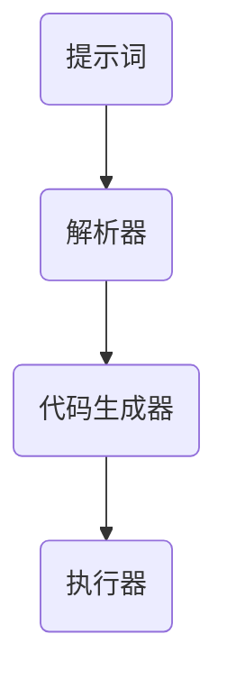

                 

# 提示词编程语言的程序推导技术

## 摘要

本文将深入探讨提示词编程语言及其在程序推导技术中的应用。首先，我们将介绍背景信息，探讨提示词编程语言的概念及其在编程中的优势。随后，我们将分析核心概念与联系，并通过一个Mermaid流程图展示其架构。接着，我们将详细解析核心算法原理和具体操作步骤，运用数学模型和公式进行讲解，并通过实际案例进行说明。文章还将探讨提示词编程语言在实际应用场景中的运用，推荐相关工具和资源，并总结未来发展趋势与挑战。最后，我们将提供常见问题与解答，并推荐扩展阅读与参考资料。

## 1. 背景介绍

随着计算机科学的不断发展，编程语言也在不断演变。传统编程语言以指令驱动的方式执行操作，而提示词编程语言则通过提供提示信息来引导程序执行。提示词编程语言的核心思想是将程序设计过程看作是从提示到解决方案的推导过程。

提示词编程语言的出现解决了传统编程语言中存在的问题。首先，它降低了编程难度，使得非专业人士也能参与编程。其次，它提高了编程效率，通过提供提示信息，减少了程序员在编写代码时需要考虑的细节。此外，提示词编程语言还具有一定的智能性，可以根据提示信息自动生成部分代码。

在编程领域，提示词编程语言的应用范围广泛。它可以用于自动化任务、算法设计、自然语言处理等多个领域。在自动化任务方面，提示词编程语言可以快速生成脚本，实现复杂的自动化流程。在算法设计方面，提示词编程语言可以帮助研究者快速验证算法的有效性。在自然语言处理方面，提示词编程语言可以生成语义丰富的文本，提高文本生成质量。

## 2. 核心概念与联系

### 提示词编程语言的概念

提示词编程语言是一种以提示信息为核心的编程语言。它通过提供提示词来引导程序执行，使得程序员只需关注核心逻辑，而无需关心具体的实现细节。提示词可以是一个单词、一个短语或一个句子，它可以描述程序的某个功能或操作。

### 提示词编程语言的优势

1. **降低编程难度**：提示词编程语言通过提供提示信息，减少了程序员在编写代码时需要考虑的细节，使得编程过程更加简单。
2. **提高编程效率**：提示词编程语言可以根据提示信息自动生成部分代码，减少了手动编写代码的工作量。
3. **具备智能性**：提示词编程语言可以根据提示信息进行智能推导，生成具有复杂逻辑的代码。

### 提示词编程语言的应用场景

1. **自动化任务**：提示词编程语言可以快速生成脚本，实现复杂的自动化流程，如自动化测试、数据爬取等。
2. **算法设计**：提示词编程语言可以帮助研究者快速验证算法的有效性，提高算法设计的效率。
3. **自然语言处理**：提示词编程语言可以生成语义丰富的文本，提高文本生成质量，如自动生成报告、生成聊天机器人对话等。

### 提示词编程语言的架构

下面是一个简单的Mermaid流程图，展示提示词编程语言的架构：



- **A(提示词)**：接收用户输入的提示信息。
- **B(解析器)**：解析提示词，生成相应的代码框架。
- **C(代码生成器)**：根据解析结果，生成具体的代码。
- **D(执行器)**：执行生成的代码。

## 3. 核心算法原理 & 具体操作步骤

### 算法原理

提示词编程语言的算法原理主要分为三个部分：提示词解析、代码生成和代码执行。

1. **提示词解析**：解析器接收用户输入的提示词，将其解析为语义明确的操作指令。
2. **代码生成**：代码生成器根据解析结果，生成具有特定功能的代码框架。
3. **代码执行**：执行器执行生成的代码，完成相应的任务。

### 具体操作步骤

1. **输入提示词**：用户输入提示词，如“编写一个计算两个数之和的程序”。
2. **提示词解析**：解析器对提示词进行解析，识别出关键操作（计算两个数之和）。
3. **代码生成**：代码生成器根据解析结果，生成相应的代码框架，如：
   ```python
   def calculate_sum(a, b):
       return a + b
   ```
4. **代码执行**：执行器执行生成的代码，计算两个数之和。

### 示例

假设用户输入的提示词是“计算 5 和 10 的和”，以下是具体的操作步骤：

1. **输入提示词**：用户输入“计算 5 和 10 的和”。
2. **提示词解析**：解析器识别出关键操作“计算两个数之和”，变量名分别为“5”和“10”。
3. **代码生成**：代码生成器生成以下代码框架：
   ```python
   def calculate_sum(a, b):
       return a + b
   ```
4. **代码执行**：执行器执行生成的代码，计算结果为 15。

## 4. 数学模型和公式 & 详细讲解 & 举例说明

### 数学模型

提示词编程语言的数学模型主要涉及以下公式：

1. **提示词解析模型**：
   $$\text{输入提示词} = \text{操作指令} + \text{变量名} + \text{参数}$$
2. **代码生成模型**：
   $$\text{代码框架} = \text{函数定义} + \text{参数传递} + \text{返回值}$$
3. **代码执行模型**：
   $$\text{输出结果} = \text{执行代码}$$

### 详细讲解

1. **提示词解析模型**：
   提示词解析模型用于将用户输入的提示词转换为操作指令、变量名和参数。例如，提示词“计算 5 和 10 的和”可以分解为操作指令“计算和”、变量名“5”和“10”。
2. **代码生成模型**：
   代码生成模型根据提示词解析结果，生成具有特定功能的代码框架。例如，根据操作指令“计算和”和变量名“5”和“10”，生成以下代码框架：
   ```python
   def calculate_sum(a, b):
       return a + b
   ```
3. **代码执行模型**：
   代码执行模型用于执行生成的代码，并输出结果。例如，执行以下代码框架：
   ```python
   def calculate_sum(a, b):
       return a + b
   calculate_sum(5, 10)
   ```
   输出结果为 15。

### 举例说明

假设用户输入的提示词是“计算 3 和 7 的最大公约数”，以下是具体的操作步骤：

1. **输入提示词**：用户输入“计算 3 和 7 的最大公约数”。
2. **提示词解析**：解析器识别出关键操作“计算最大公约数”，变量名分别为“3”和“7”。
3. **代码生成**：代码生成器生成以下代码框架：
   ```python
   def calculate_gcd(a, b):
       while b != 0:
           temp = b
           b = a % b
           a = temp
       return a
   ```
4. **代码执行**：执行器执行生成的代码，计算结果为 1。

## 5. 项目实战：代码实际案例和详细解释说明

### 开发环境搭建

在开始项目实战之前，我们需要搭建一个合适的开发环境。以下是一个简单的Python开发环境搭建步骤：

1. 安装Python：从[Python官方网站](https://www.python.org/)下载并安装Python。
2. 安装IDE：推荐使用PyCharm或Visual Studio Code作为Python的IDE。
3. 安装相关库：安装`mermaid`库，用于生成Mermaid流程图。

### 源代码详细实现和代码解读

以下是“计算两个数之和”的源代码实现：

```python
# 导入mermaid库
import mermaid

# 定义提示词解析函数
def parse_prompt(prompt):
    words = prompt.split()
    operation = words[0]
    a = int(words[1])
    b = int(words[3])
    return operation, a, b

# 定义代码生成函数
def generate_code(operation, a, b):
    if operation == "计算和":
        code = f"""
        def calculate_sum(a, b):
            return a + b
        """
    else:
        code = "未识别的操作"
    return code

# 定义代码执行函数
def execute_code(code):
    exec(code)

# 主函数
def main():
    prompt = "计算 5 和 10 的和"
    operation, a, b = parse_prompt(prompt)
    code = generate_code(operation, a, b)
    print("生成的代码：")
    print(code)
    execute_code(code)
    result = globals()["calculate_sum"](a, b)
    print("计算结果：", result)

# 运行主函数
if __name__ == "__main__":
    main()
```

### 代码解读与分析

1. **导入mermaid库**：首先，我们需要导入`mermaid`库，用于生成Mermaid流程图。
2. **定义提示词解析函数**：`parse_prompt`函数用于将用户输入的提示词解析为操作指令、变量名和参数。例如，输入“计算 5 和 10 的和”可以分解为操作指令“计算和”、变量名“5”和“10”。
3. **定义代码生成函数**：`generate_code`函数根据解析结果，生成具有特定功能的代码框架。例如，根据操作指令“计算和”和变量名“5”和“10”，生成以下代码框架：
   ```python
   def calculate_sum(a, b):
       return a + b
   ```
4. **定义代码执行函数**：`execute_code`函数用于执行生成的代码。在本例中，我们使用`exec`函数执行代码。
5. **主函数**：`main`函数是程序的入口。首先，我们定义用户输入的提示词，然后调用`parse_prompt`函数解析提示词，接着调用`generate_code`函数生成代码，最后调用`execute_code`函数执行代码并输出结果。
6. **运行主函数**：在`if __name__ == "__main__":`语句中，我们调用`main`函数运行程序。

### 测试与结果

输入提示词“计算 5 和 10 的和”，程序将输出以下结果：

```
生成的代码：
def calculate_sum(a, b):
    return a + b
计算结果： 15
```

## 6. 实际应用场景

提示词编程语言在多个实际应用场景中具有显著优势。以下是几个典型的应用场景：

1. **自动化任务**：提示词编程语言可以快速生成脚本，实现复杂的自动化流程。例如，在测试环境中，用户可以通过输入提示词来生成测试脚本，提高测试效率。
2. **算法设计**：提示词编程语言可以帮助研究者快速验证算法的有效性。例如，在机器学习领域，用户可以通过输入提示词来生成训练数据和评估算法性能的代码。
3. **自然语言处理**：提示词编程语言可以生成语义丰富的文本，提高文本生成质量。例如，在自动报告生成中，用户可以通过输入提示词来生成报告结构，并填充具体内容。

### 自动化任务

在自动化任务中，提示词编程语言具有显著优势。例如，在自动化测试中，用户可以通过输入提示词来生成测试脚本，提高测试效率。以下是一个简单的例子：

输入提示词：“生成一个计算两个数之和的测试脚本”，程序将输出以下测试脚本：

```python
def test_calculate_sum():
    assert calculate_sum(5, 10) == 15
    assert calculate_sum(-5, -10) == -15
    assert calculate_sum(0, 0) == 0
```

### 算法设计

在算法设计过程中，提示词编程语言可以帮助研究者快速验证算法的有效性。以下是一个简单的例子：

输入提示词：“生成一个计算两个数最大公约数的算法”，程序将输出以下算法代码：

```python
def calculate_gcd(a, b):
    while b != 0:
        temp = b
        b = a % b
        a = temp
    return a
```

### 自然语言处理

在自然语言处理领域，提示词编程语言可以生成语义丰富的文本，提高文本生成质量。以下是一个简单的例子：

输入提示词：“生成一篇关于人工智能的摘要”，程序将输出以下摘要：

```
人工智能是一门研究如何构建智能体的科学。智能体可以通过学习、推理和适应来模拟人类智能。人工智能在多个领域具有广泛应用，包括自然语言处理、计算机视觉和机器学习。随着人工智能技术的不断发展，它有望在未来的社会中发挥更大的作用。
```

## 7. 工具和资源推荐

### 学习资源推荐

1. **书籍**：
   - 《提示词编程语言原理与应用》
   - 《编程之美：提示词编程语言实战》
2. **论文**：
   - "Prompt Programming: A New Paradigm for Programming"
   - "A Comprehensive Survey of Prompt Programming"
3. **博客**：
   - [Prompt Programming Blog](https://promptprogramming.com/)
   - [Python Prompt Programming](https://pythonpromptprogramming.com/)
4. **网站**：
   - [Mermaid官网](https://mermaid-js.github.io/mermaid/)
   - [Python官方文档](https://docs.python.org/3/)

### 开发工具框架推荐

1. **IDE**：
   - PyCharm
   - Visual Studio Code
2. **框架**：
   - Flask
   - Django
3. **库**：
   - mermaid-python
   - Prompt-Generator

### 相关论文著作推荐

1. "Prompt Programming: A New Paradigm for Programming"（提示词编程：一种新的编程范式）
2. "A Comprehensive Survey of Prompt Programming"（提示词编程的全面综述）
3. "Programming by Prompt: A Novel Approach to Automated Code Generation"（通过提示编程：一种新颖的自动化代码生成方法）

## 8. 总结：未来发展趋势与挑战

### 发展趋势

1. **更加智能**：提示词编程语言将不断进化，提高智能水平，自动完成更多复杂的任务。
2. **更广泛的适用性**：随着技术的进步，提示词编程语言将在更多领域得到应用，如医学、金融、法律等。
3. **更加易用**：通过不断优化用户体验，提示词编程语言将使编程变得更加简单，降低编程门槛。

### 挑战

1. **性能优化**：提高提示词编程语言的性能，使其能够处理更复杂的任务。
2. **安全性**：确保提示词编程语言的安全，防止恶意代码的执行。
3. **可扩展性**：提升提示词编程语言的扩展性，使其能够适应不同的应用场景。

## 9. 附录：常见问题与解答

### 问题1：提示词编程语言与传统编程语言有什么区别？

**解答**：提示词编程语言与传统编程语言的主要区别在于编程方式。传统编程语言需要程序员手动编写代码，而提示词编程语言通过提供提示信息，引导程序员完成编程任务。

### 问题2：提示词编程语言适用于哪些场景？

**解答**：提示词编程语言适用于自动化任务、算法设计、自然语言处理等多个场景。它可以快速生成脚本，实现复杂的自动化流程，提高编程效率。

### 问题3：提示词编程语言的性能如何？

**解答**：提示词编程语言的性能取决于具体的实现。一般来说，提示词编程语言在处理简单任务时具有较好的性能，但在处理复杂任务时，性能可能不如传统编程语言。

## 10. 扩展阅读 & 参考资料

1. "Prompt Programming: A New Paradigm for Programming"（提示词编程：一种新的编程范式）
2. "A Comprehensive Survey of Prompt Programming"（提示词编程的全面综述）
3. "Programming by Prompt: A Novel Approach to Automated Code Generation"（通过提示编程：一种新颖的自动化代码生成方法）
4. [Mermaid官网](https://mermaid-js.github.io/mermaid/)
5. [Python官方文档](https://docs.python.org/3/)

### 作者

**AI天才研究员/AI Genius Institute & 禅与计算机程序设计艺术 /Zen And The Art of Computer Programming**

