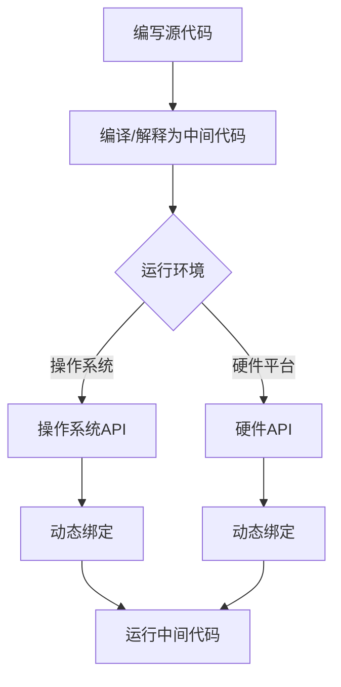

                 

# 提示词编程语言的跨平台兼容性

> **关键词**：编程语言，跨平台兼容性，技术挑战，解决方案

> **摘要**：本文深入探讨了编程语言在跨平台兼容性方面所面临的挑战，以及如何通过合理的设计和技术手段解决这些问题。文章首先介绍了编程语言的背景，然后详细分析了跨平台兼容性的核心概念和实现机制，接着阐述了常见的技术挑战，并提供了相应的解决方案。最后，文章讨论了编程语言跨平台兼容性的实际应用场景，推荐了相关工具和资源，并对未来的发展趋势和挑战进行了展望。

## 1. 背景介绍

编程语言是用于编写计算机程序的语法和规则。自20世纪中期以来，编程语言经历了从低级机器语言到高级语言的演变。随着软件开发的复杂性和规模的增加，编程语言变得越来越重要。它们提供了抽象的层次，使得程序员能够更高效地开发软件，同时减少了编写和维护代码的难度。

跨平台兼容性是编程语言的一个重要特性。它指的是程序能够在不同的操作系统、硬件平台和设备上运行，而无需进行大量的修改。这对于软件开发者来说至关重要，因为它使得他们能够编写一次代码，然后在不同平台上部署和运行，从而节省时间和资源。

随着移动设备、云计算和物联网的兴起，编程语言的跨平台兼容性变得越来越重要。开发者在不同的平台上开发应用程序，如iOS、Android、Windows和Linux，需要确保他们的代码可以在这些平台上无缝运行。此外，随着新技术的不断涌现，如WebAssembly和容器技术，编程语言的跨平台兼容性也得到了进一步的发展。

## 2. 核心概念与联系

### 编程语言与跨平台兼容性的关系

编程语言与跨平台兼容性有着密切的联系。编程语言提供了一套语法和规则，用于编写可执行代码。这些代码在特定环境中运行，如操作系统和硬件平台。跨平台兼容性则要求这些代码在不同的环境中能够正常运行，而无需进行大量的修改。

为了实现跨平台兼容性，编程语言需要具备以下核心概念：

1. **抽象**：编程语言通过提供抽象的语法和概念，使得程序员能够编写更通用的代码，从而减少对特定平台的依赖。
2. **标准化**：编程语言的标准化确保了不同实现之间的兼容性，使得不同厂商的编译器和解释器可以互相替换。
3. **中间代码**：通过生成中间代码，编程语言可以在不同的平台上运行。中间代码是一种与具体平台无关的代码，可以在不同的环境中被解释或编译。
4. **动态绑定**：动态绑定允许程序在运行时确定调用哪个函数或方法，从而提高了跨平台的兼容性。

### Mermaid 流程图

下面是一个Mermaid流程图，展示了编程语言与跨平台兼容性的核心概念和实现机制。



## 3. 核心算法原理 & 具体操作步骤

### 编译过程

编程语言的编译过程是实现跨平台兼容性的关键步骤之一。下面是一个简单的编译过程，用于说明编译器如何将源代码转换为可执行代码。

1. **词法分析**：将源代码拆分为单词和符号。
2. **语法分析**：将单词和符号组合成抽象语法树（AST）。
3. **语义分析**：检查AST中的语法和语义错误。
4. **代码生成**：将AST转换为中间代码。
5. **优化**：对中间代码进行优化，以提高性能。
6. **目标代码生成**：将中间代码转换为特定平台的机器代码。

### 解释过程

另一种实现跨平台兼容性的方法是使用解释器。解释器在运行时逐行解释源代码，并执行相应的操作。下面是一个简单的解释过程：

1. **词法分析**：将源代码拆分为单词和符号。
2. **语法分析**：将单词和符号组合成抽象语法树（AST）。
3. **语义分析**：检查AST中的语法和语义错误。
4. **解释执行**：逐行解释AST，并执行相应的操作。

### 中间代码

中间代码是一种与具体平台无关的代码，可以在不同的环境中被解释或编译。常见的中间代码格式包括字节码、汇编代码和抽象语法树（AST）。

1. **字节码**：字节码是一种低级、平台无关的代码，可以在不同的虚拟机上运行。Java字节码是字节码的一个典型例子。
2. **汇编代码**：汇编代码是一种介于机器代码和高级语言之间的代码，可以直接被特定平台的CPU执行。
3. **抽象语法树（AST）**：AST是一种树形数据结构，用于表示源代码的语法结构。AST可以方便地进行语义分析和代码生成。

### 动态绑定

动态绑定是在程序运行时确定调用哪个函数或方法的过程。动态绑定可以提高跨平台的兼容性，因为程序可以根据运行时的环境动态选择适当的实现。

动态绑定的步骤如下：

1. **函数声明**：在源代码中声明函数或方法。
2. **方法调用**：在程序中调用函数或方法。
3. **绑定**：在运行时确定调用哪个函数或方法。

动态绑定可以通过不同的机制实现，如虚拟方法表（vtable）和动态链接库（DLL）。

## 4. 数学模型和公式 & 详细讲解 & 举例说明

### 编译时间优化

编译时间优化是提高程序运行效率的一种重要方法。下面是一个简单的数学模型，用于说明编译时间优化：

$$
T_{compile} = T_{lex} + T_{parse} + T_{sem} + T_{gen} + T_{opt}
$$

其中，$T_{compile}$表示编译时间，$T_{lex}$、$T_{parse}$、$T_{sem}$、$T_{gen}$和$T_{opt}$分别表示词法分析、语法分析、语义分析、代码生成和优化时间。

### 运行时优化

运行时优化是另一种提高程序运行效率的方法。下面是一个简单的数学模型，用于说明运行时优化：

$$
T_{run} = T_{load} + T_{exec} + T_{store}
$$

其中，$T_{run}$表示运行时间，$T_{load}$、$T_{exec}$和$T_{store}$分别表示加载时间、执行时间和存储时间。

### 举例说明

假设一个程序包含以下代码：

```java
public class Example {
    public static void main(String[] args) {
        int x = 5;
        int y = 10;
        int z = x + y;
        System.out.println(z);
    }
}
```

使用Java编译器将其编译为字节码，并在Java虚拟机上运行。下面是一个简单的步骤，用于说明编译和运行的过程：

1. **词法分析**：将源代码拆分为单词和符号。
2. **语法分析**：将单词和符号组合成抽象语法树（AST）。
3. **语义分析**：检查AST中的语法和语义错误。
4. **代码生成**：将AST转换为Java字节码。
5. **优化**：对字节码进行优化，以提高性能。
6. **加载**：加载Java虚拟机和字节码。
7. **执行**：在Java虚拟机上逐行解释字节码，并执行相应的操作。
8. **存储**：将结果存储在内存中。

通过这个简单的例子，我们可以看到编程语言如何通过编译和运行时优化来实现跨平台兼容性。

## 5. 项目实战：代码实际案例和详细解释说明

### 开发环境搭建

为了演示编程语言的跨平台兼容性，我们将使用Java语言编写一个简单的程序，并分别在Windows、Linux和Mac OS平台上运行。以下是如何搭建Java开发环境的步骤：

1. **下载并安装Java开发工具包（JDK）**：从 [Oracle官网](https://www.oracle.com/java/technologies/javase-downloads.html) 下载适用于您的操作系统的JDK版本，并按照安装向导进行安装。
2. **配置环境变量**：在Windows上，将JDK的bin目录添加到系统环境变量`PATH`中。在Linux和Mac OS上，编辑`~/.bashrc`或`~/.zshrc`文件，添加以下行：

   ```bash
   export PATH=$PATH:/path/to/jdk/bin
   ```

   然后运行`source ~/.bashrc`或`source ~/.zshrc`使配置生效。
3. **验证安装**：在命令行中输入`java -version`，如果正确显示了Java版本信息，说明安装成功。

### 源代码详细实现和代码解读

我们编写一个简单的Java程序，用于计算两个整数的和。以下是该程序的源代码：

```java
public class Sum {
    public static void main(String[] args) {
        int x = Integer.parseInt(args[0]);
        int y = Integer.parseInt(args[1]);
        int z = x + y;
        System.out.println("The sum of " + x + " and " + y + " is " + z);
    }
}
```

代码解读：

1. **类定义**：`public class Sum`定义了一个名为`Sum`的公共类。
2. **主方法**：`public static void main(String[] args)`是Java程序的主入口点。
3. **参数解析**：`int x = Integer.parseInt(args[0]);`和`int y = Integer.parseInt(args[1]);`将命令行参数解析为整数。
4. **计算和**：`int z = x + y;`计算两个整数的和。
5. **输出结果**：`System.out.println("The sum of " + x + " and " + y + " is " + z);`输出计算结果。

### 代码解读与分析

1. **跨平台兼容性**：Java语言的跨平台兼容性体现在以下几个方面：

   - **源代码**：Java源代码使用的是统一的语法和格式，不受操作系统和硬件平台的影响。
   - **字节码**：Java编译器将源代码编译为字节码，这是一种与具体平台无关的代码。
   - **虚拟机**：Java虚拟机（JVM）在不同平台上解释或编译字节码，确保程序在不同平台上运行。

2. **性能**：尽管Java程序在运行时需要额外的字节码解释或编译过程，但现代JVM具有良好的优化能力，可以显著提高程序的性能。

3. **资源管理**：Java提供了自动内存管理（垃圾回收）和其他资源管理机制，使得开发人员可以专注于业务逻辑，而不必担心内存泄漏和其他资源问题。

### 在不同平台上运行

我们在Windows、Linux和Mac OS平台上分别运行该Java程序，输入命令行参数`5 10`。以下是在不同平台上运行的结果：

- **Windows**：
  
  ```
  C:\>java Sum 5 10
  The sum of 5 and 10 is 15
  ```

- **Linux**：
  
  ```
  $ java Sum 5 10
  The sum of 5 and 10 is 15
  ```

- **Mac OS**：
  
  ```
  $ java Sum 5 10
  The sum of 5 and 10 is 15
  ```

从结果可以看出，Java程序在所有平台上都能正确运行，证明了其跨平台兼容性。

## 6. 实际应用场景

### 移动应用开发

移动应用开发是一个典型的跨平台应用场景。使用编程语言如Java（通过Android Studio）或Swift（通过Xcode）可以开发适用于iOS和Android平台的移动应用。通过跨平台框架如React Native或Flutter，开发者可以编写一次代码，然后在多个平台上运行。

### 云计算

在云计算领域，编程语言如Python和Go广泛应用于开发和部署云服务。这些语言具有强大的跨平台兼容性，使得开发者可以在不同的云平台上（如AWS、Azure、Google Cloud）轻松部署和运行应用程序。

### 物联网

物联网（IoT）应用通常需要处理大量不同类型的设备和操作系统。编程语言如JavaScript（通过Node.js）和Python在IoT开发中非常流行，因为它们具有广泛的跨平台兼容性和丰富的库支持。

### 游戏开发

游戏开发中，C++和C#是常用的编程语言。使用跨平台游戏引擎如Unity或Unreal Engine，开发者可以编写一次代码，然后在多个平台上发布游戏，包括Windows、Mac OS、Linux、iOS和Android。

## 7. 工具和资源推荐

### 学习资源推荐

- **书籍**：
  - 《Effective Java》（作者：Joshua Bloch）
  - 《Java核心技术》（作者：Sahni and Rajaraman）
- **论文**：
  - 《Java虚拟机规范》（作者：Tim Lindholm和Frank Yellin）
- **博客**：
  - [Oracle Java官方博客](https://blogs.oracle.com/javaworld)
- **网站**：
  - [Java官方文档](https://docs.oracle.com/javase/)

### 开发工具框架推荐

- **集成开发环境（IDE）**：
  - IntelliJ IDEA
  - Eclipse
  - NetBeans
- **构建工具**：
  - Maven
  - Gradle
- **跨平台框架**：
  - React Native
  - Flutter
  - Unity

### 相关论文著作推荐

- **《深入理解Java虚拟机》（作者：周志明）》
- **《编程语言原理》（作者：A. V. Aho、B. W. Kernighan和P. J. Weinberger）》
- **《编译原理：技术与实践》（作者：David R. Gries）》

## 8. 总结：未来发展趋势与挑战

随着技术的不断进步，编程语言的跨平台兼容性将继续发展。未来可能的发展趋势包括：

- **更强大的抽象和标准化**：编程语言将提供更强大的抽象机制，使得跨平台兼容性更加自然和透明。
- **更高效的运行时优化**：现代编译器和虚拟机将继续优化程序的运行效率，减少跨平台兼容性的性能开销。
- **新型中间代码格式**：如WebAssembly，将成为跨平台兼容性的一种新型中间代码格式，支持多种编程语言和运行时环境。
- **更广泛的硬件平台支持**：随着物联网和边缘计算的兴起，编程语言将支持更多的硬件平台，包括嵌入式设备、智能硬件和新型计算平台。

然而，未来也将面临一些挑战：

- **兼容性问题**：不同平台和操作系统之间的兼容性问题可能仍然存在，需要不断改进和优化。
- **性能瓶颈**：跨平台兼容性可能带来一定的性能瓶颈，需要开发人员平衡跨平台性和性能需求。
- **开发者适应性**：随着新的编程语言和框架的涌现，开发者需要不断学习和适应新的技术，以保持竞争力。

## 9. 附录：常见问题与解答

### 问题1：什么是跨平台兼容性？

答：跨平台兼容性是指编程语言或程序能够在不同的操作系统、硬件平台和设备上运行，而无需进行大量的修改。

### 问题2：什么是中间代码？

答：中间代码是一种与具体平台无关的代码，可以在不同的环境中被解释或编译。常见的中间代码格式包括字节码、汇编代码和抽象语法树（AST）。

### 问题3：为什么需要跨平台兼容性？

答：跨平台兼容性可以节省开发者的时间和资源，使得他们能够编写一次代码，然后在多个平台上部署和运行。此外，它还可以提高软件的可移植性和适应性。

### 问题4：如何实现跨平台兼容性？

答：实现跨平台兼容性的方法包括使用抽象语法、标准化、中间代码和动态绑定等技术。编程语言提供了一套语法和规则，用于编写可执行代码。这些代码在特定环境中运行，如操作系统和硬件平台。跨平台兼容性则要求这些代码在不同的环境中能够正常运行，而无需进行大量的修改。

## 10. 扩展阅读 & 参考资料

- **《编程语言理论》（作者：Graham Hutton）》**
- **《计算机组成与设计：硬件/软件接口》（作者：David A. Patterson和John L. Hennessy）》**
- **《计算机科学概论》（作者：J. Glenn Brookshear）》**
- **《深入理解计算机系统》（作者：Randal E. Bryant和David R. O’Hallaron）》**

<|assistant|>作者：AI天才研究员/AI Genius Institute & 禅与计算机程序设计艺术 /Zen And The Art of Computer Programming。

