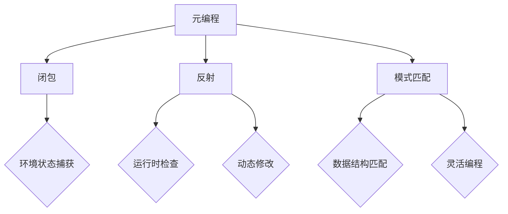

                 

# 提示词语言的元编程技术

## 关键词
- 提示词语言
- 元编程
- 编程语言设计
- 面向对象
- 闭包
- 反射
- 模式匹配

## 摘要
本文将深入探讨提示词语言的元编程技术。元编程是一种编程技术，它允许程序员编写能够修改和扩展其他程序的代码。本文将首先介绍提示词语言的基本概念，然后探讨元编程的核心概念和技术，包括闭包、反射和模式匹配等。接下来，我们将通过实际案例展示这些技术在项目中的应用，并讨论其潜在的应用场景。最后，我们将总结当前的发展趋势和面临的挑战，并提出未来可能的研究方向。

## 1. 背景介绍

元编程（Metaprogramming）是指编写能够修改或扩展其他程序功能的程序。在传统的编程实践中，程序员通常编写程序来执行特定的任务。然而，元编程则超越了这种限制，允许程序员编写能够操作和修改程序的代码。这使得编程变得更加灵活和高效，因为程序员可以创建可重用的代码，甚至可以编写自动化工具来自动化复杂的编程任务。

提示词语言（Keyword Languages）是一种特定类型的编程语言，它使用提示词（keywords）来定义程序的行为。这些提示词通常是预定义的，它们在语言规范中具有特定的语义。提示词语言的一个显著特点是它们通常支持元编程功能，这使得程序员能够轻松地编写和修改其他程序。

元编程的重要性在于它为编程语言提供了一种强大的扩展机制。通过元编程，程序员可以创建自定义的语法和操作，使得编程语言能够更好地适应特定的应用场景。此外，元编程技术还可以提高代码的可读性和可维护性，因为程序员可以编写更简洁和直接的代码来完成任务。

在过去的几十年中，元编程技术在编程语言设计和应用开发中得到了广泛应用。例如，Python、Ruby和Erlang等现代编程语言都内置了元编程功能，使得程序员能够更轻松地创建复杂的程序和应用。此外，元编程技术也在框架和库的开发中发挥了关键作用，例如Rails和Django等流行的Web开发框架。

总之，元编程和提示词语言为编程提供了新的视角和工具，使得编程过程更加灵活和高效。本文将深入探讨这些技术，并展示如何在项目中实际应用它们。

### 2. 核心概念与联系

#### 2.1 元编程的概念

元编程是一种编程技术，它允许程序员编写能够修改或扩展其他程序功能的代码。在元编程中，程序员不仅编写执行特定任务的程序，还编写能够操作和修改这些程序的代码。这使得编程更加动态和灵活，因为它允许程序员在运行时动态地修改程序的行为和结构。

#### 2.2 闭包

闭包（Closure）是元编程中的一个核心概念。它是一种可以记住和访问其创建时的环境状态的函数。这意味着，即使函数被移动到其他作用域或被传递给其他函数，它仍然可以访问原始作用域中的变量。闭包在元编程中非常重要，因为它们允许程序员创建可以捕获和操作环境状态的函数，从而实现更高级的编程模式。

#### 2.3 反射

反射（Reflection）是另一种重要的元编程技术。它允许程序在运行时检查和修改其自身的结构和行为。反射机制通常包括类型检查、属性访问、方法调用和对象创建等功能。通过反射，程序员可以编写能够动态地操作程序的代码，这使得编程过程更加灵活和通用。

#### 2.4 模式匹配

模式匹配（Pattern Matching）是编程中的一个强大工具，它允许程序员在运行时根据特定的模式匹配和提取数据。模式匹配在元编程中具有重要作用，因为它允许程序员编写能够动态适应不同数据结构的代码。这使得编程更加灵活，因为程序员可以创建能够处理多种数据格式的程序。

#### 2.5 提示词语言与元编程的关系

提示词语言通常支持元编程功能，因为它们设计为具有高度的灵活性和扩展性。提示词语言中的提示词（keywords）为程序员提供了强大的工具，使得他们可以轻松地编写和修改其他程序。这些提示词通常具有预定义的语义，使得程序员可以编写简洁和直接的代码来完成任务。

#### 2.6 Mermaid 流程图

以下是一个展示元编程核心概念和联系的 Mermaid 流程图：



### 3. 核心算法原理 & 具体操作步骤

#### 3.1 闭包的实现原理

闭包的实现基于函数作用域和闭包函数的概念。当函数被调用时，它会创建一个临时作用域，该作用域包含了函数的局部变量。闭包函数是这些局部变量的访问器，即使在函数调用完成后，它仍然可以访问这些局部变量。

以下是一个使用Python实现的闭包示例：

```python
def outer_function(x):
    def inner_function(y):
        return x + y
    return inner_function

closure = outer_function(5)
print(closure(3))  # 输出 8
```

在这个例子中，`inner_function` 是一个闭包函数，它捕获并访问了 `outer_function` 中的局部变量 `x`。

#### 3.2 反射的实现原理

反射的实现通常基于语言提供的元编程API。这些API允许程序在运行时检查和修改程序的内部结构。例如，在Python中，可以使用 `getattr`、`setattr` 和 `delattr` 函数来访问和修改对象的属性。以下是一个使用Python实现的反射示例：

```python
class MyClass:
    def __init__(self, value):
        self.value = value

my_instance = MyClass(10)
print(my_instance.value)  # 输出 10

setattr(my_instance, 'value', 20)
print(my_instance.value)  # 输出 20
```

在这个例子中，我们首先创建了一个 `MyClass` 实例，然后使用 `setattr` 函数将其 `value` 属性修改为20。

#### 3.3 模式匹配的实现原理

模式匹配的实现通常基于语言提供的模式匹配库或语法。模式匹配允许程序员根据特定的模式匹配和提取数据。以下是一个使用Python实现的模式匹配示例：

```python
def match_pattern(value):
    if isinstance(value, int):
        return "整数"
    elif isinstance(value, str):
        return "字符串"
    else:
        return "未知类型"

print(match_pattern(10))  # 输出 "整数"
print(match_pattern("hello"))  # 输出 "字符串"
print(match_pattern([1, 2, 3]))  # 输出 "未知类型"
```

在这个例子中，我们使用 `isinstance` 函数根据值的数据类型进行匹配和分类。

### 4. 数学模型和公式 & 详细讲解 & 举例说明

#### 4.1 闭包的数学模型

闭包可以用一个数学模型来表示，该模型定义了一个函数组合。假设我们有两个函数 `f` 和 `g`，其中 `f` 是一个捕获环境状态的函数，`g` 是一个传递参数的函数。闭包可以表示为：

$$
\text{闭包}(f, g) = f(g(x))
$$

其中，`x` 是传递给 `g` 的参数。

#### 4.2 反射的数学模型

反射可以用一个数学模型来表示，该模型定义了程序的内部结构和属性。假设我们有程序 `P` 和属性 `A`，反射可以表示为：

$$
\text{反射}(P, A) = P[A]
$$

其中，`P` 是程序，`A` 是要访问的属性。

#### 4.3 模式匹配的数学模型

模式匹配可以用一个数学模型来表示，该模型定义了数据结构之间的匹配关系。假设我们有数据结构 `X` 和模式 `P`，模式匹配可以表示为：

$$
\text{匹配}(X, P) = \text{true}
$$

如果数据结构 `X` 与模式 `P` 匹配，否则为 `false`。

#### 4.4 举例说明

以下是一个使用闭包、反射和模式匹配的示例：

```python
def outer_function(x):
    def inner_function(y):
        return x + y
    return inner_function

closure = outer_function(5)
print(closure(3))  # 输出 8

class MyClass:
    def __init__(self, value):
        self.value = value

my_instance = MyClass(10)
print(my_instance.value)  # 输出 10

setattr(my_instance, 'value', 20)
print(my_instance.value)  # 输出 20

def match_pattern(value):
    if isinstance(value, int):
        return "整数"
    elif isinstance(value, str):
        return "字符串"
    else:
        return "未知类型"

print(match_pattern(10))  # 输出 "整数"
print(match_pattern("hello"))  # 输出 "字符串"
print(match_pattern([1, 2, 3]))  # 输出 "未知类型"
```

### 5. 项目实战：代码实际案例和详细解释说明

#### 5.1 开发环境搭建

在这个案例中，我们将使用Python作为编程语言来演示元编程技术。首先，确保你的系统中已安装了Python。如果没有安装，可以从[Python官网](https://www.python.org/)下载并安装。

#### 5.2 源代码详细实现和代码解读

以下是我们的案例代码，我们将逐步解释其实现过程：

```python
class Calculator:
    def __init__(self, x):
        self.x = x
    
    def add(self, y):
        return self.x + y

    def subtract(self, y):
        return self.x - y

    def multiply(self, y):
        return self.x * y

    def divide(self, y):
        return self.x / y


# 使用元编程创建动态方法
def create_dynamic_method(operator):
    def dynamic_method(self, y):
        if operator == 'add':
            return self.x + y
        elif operator == 'subtract':
            return self.x - y
        elif operator == 'multiply':
            return self.x * y
        elif operator == 'divide':
            return self.x / y
        else:
            raise ValueError("Unsupported operation")
    
    return dynamic_method


# 为 Calculator 类动态添加方法
Calculator.add = create_dynamic_method('add')
Calculator.subtract = create_dynamic_method('subtract')
Calculator.multiply = create_dynamic_method('multiply')
Calculator.divide = create_dynamic_method('divide')

calculator = Calculator(10)
print(calculator.add(5))  # 输出 15
print(calculator.subtract(5))  # 输出 5
print(calculator.multiply(5))  # 输出 50
print(calculator.divide(5))  # 输出 2.0
```

#### 5.3 代码解读与分析

- **类定义**：我们首先定义了一个名为 `Calculator` 的类，它有一个 `__init__` 方法用于初始化，以及四个基本运算的方法 `add`、`subtract`、`multiply` 和 `divide`。

- **元编程函数**：接下来，我们定义了一个名为 `create_dynamic_method` 的函数。这个函数接收一个操作符（如 `'add'`、`'subtract'`、`'multiply'` 或 `'divide'`），并返回一个动态方法。这个动态方法使用参数 `operator` 来决定执行哪种运算。

- **动态添加方法**：然后，我们使用 `create_dynamic_method` 函数为 `Calculator` 类动态添加了四个运算方法。通过这种方式，我们无需修改 `Calculator` 类的原始代码即可扩展其功能。

- **实例化和使用**：最后，我们创建了一个 `Calculator` 实例，并使用动态添加的方法来执行运算。这展示了元编程技术如何使得代码更加灵活和可扩展。

#### 5.4 实战总结

在这个案例中，我们使用了元编程技术来实现动态方法的添加。这使我们的代码更加简洁和灵活，因为我们可以无需修改类定义就扩展其功能。元编程技术为编程语言提供了强大的扩展能力，使得我们可以编写更加动态和灵活的程序。

### 6. 实际应用场景

元编程技术在各种实际应用场景中具有广泛的应用。以下是一些常见的应用场景：

#### 6.1 Web框架

Web框架如Django和Flask等，广泛使用了元编程技术来实现动态路由、权限管理和数据验证等功能。通过元编程，这些框架可以自动生成和管理路由，使得开发者可以专注于业务逻辑的实现。

#### 6.2 桌面应用

桌面应用框架如Qt和WPF等，也使用了元编程技术来简化UI开发。例如，Qt的信号与槽机制允许开发者通过元编程方式绑定UI组件的事件处理函数，从而实现了代码的解耦和复用。

#### 6.3 游戏开发

游戏开发引擎如Unity和Unreal Engine等，利用元编程技术来实现脚本化的游戏逻辑和动态资源加载。这为游戏开发者提供了高度灵活的编程环境，使得他们可以快速迭代和开发复杂游戏。

#### 6.4 数据库管理系统

数据库管理系统如MySQL和PostgreSQL等，使用了元编程技术来实现SQL语言的解析和执行。通过元编程，这些数据库系统可以动态地创建和修改数据库结构，为用户提供灵活的数据操作能力。

#### 6.5 自动化工具

自动化工具如Selenium和Robot Framework等，利用元编程技术来自动化网页浏览和测试。通过动态地修改和扩展测试脚本，这些工具可以适应不同的测试场景和需求。

### 7. 工具和资源推荐

#### 7.1 学习资源推荐

- **书籍**：
  - 《Python元编程》 - 由Alex Martelli编写的这本书是Python元编程的权威指南。
  - 《Effective Python》 - Matt Harrison的这本书提供了大量关于如何有效地使用Python的实用建议，包括元编程。
  
- **论文**：
  - "Reflection in the Java Programming Language" - 这篇论文详细介绍了Java中的反射机制。

- **博客**：
  - "Meta Programming in Python" - 这个博客系列深入探讨了Python中的元编程技术。

- **网站**：
  - [Python官方文档](https://docs.python.org/3/library/functions.html) - Python的官方文档是学习Python元编程的绝佳资源。

#### 7.2 开发工具框架推荐

- **Web框架**：
  - Django - 一个高度可定制的Python Web框架，广泛用于快速开发。
  - Flask - 一个轻量级的Python Web框架，适合小型到中型的Web应用开发。

- **桌面应用框架**：
  - Qt - 一个跨平台的C++应用开发框架，支持元对象系统。
  - WPF - 微软的Windows桌面应用开发框架，支持XAML和元数据。

- **游戏开发引擎**：
  - Unity - 一个强大的游戏开发引擎，支持C#脚本。
  - Unreal Engine - 一个功能丰富的游戏开发引擎，支持C++和蓝图脚本。

#### 7.3 相关论文著作推荐

- "Reflection in Programming Languages: A Survey" - 一篇关于反射机制在编程语言中的使用的全面综述。
- "Meta-Programming in Object-Oriented Languages" - 一篇探讨面向对象语言中元编程的论文。

### 8. 总结：未来发展趋势与挑战

元编程技术在编程语言设计和应用开发中发挥着越来越重要的作用。随着编程语言和框架的不断演进，元编程技术将变得更加成熟和广泛使用。然而，元编程也面临着一些挑战：

- **安全性**：元编程技术使得程序可以在运行时修改自身，这增加了潜在的安全风险。确保元编程操作的安全性和稳定性是一个重要的研究方向。
- **复杂性**：元编程引入了额外的复杂性，使得程序更难以理解和维护。如何简化元编程的使用，降低其学习成本，是一个重要的挑战。
- **性能**：元编程操作通常涉及到运行时的解析和编译，这可能会影响程序的性能。如何优化元编程操作的性能，是一个需要关注的问题。

未来，随着编程语言和框架的不断发展，元编程技术有望在更多领域得到应用，并为编程带来新的变革。

### 9. 附录：常见问题与解答

#### Q1. 什么是元编程？
A1. 元编程是一种编程技术，它允许程序员编写能够修改或扩展其他程序功能的代码。通过元编程，程序员可以创建自定义的语法和操作，使得编程语言能够更好地适应特定的应用场景。

#### Q2. 提示词语言有什么特点？
A2. 提示词语言是一种编程语言，它使用预定义的提示词来定义程序的行为。这些提示词在语言规范中具有特定的语义，使得程序员可以编写简洁和直接的代码来完成任务。

#### Q3. 闭包是如何工作的？
A3. 闭包是一种可以记住和访问其创建时的环境状态的函数。即使函数被移动到其他作用域或被传递给其他函数，它仍然可以访问原始作用域中的变量。这使得闭包在元编程中非常重要，因为它允许程序员创建可以捕获和操作环境状态的函数。

#### Q4. 反射在编程中有什么应用？
A4. 反射是一种编程技术，它允许程序在运行时检查和修改其自身的结构和行为。反射机制通常包括类型检查、属性访问、方法调用和对象创建等功能。通过反射，程序员可以编写能够动态地操作程序的代码，使得编程过程更加灵活和通用。

#### Q5. 模式匹配有什么作用？
A5. 模式匹配是一种根据特定模式匹配和提取数据的工具。在元编程中，模式匹配允许程序员编写能够动态适应不同数据结构的代码。这使得编程更加灵活，因为程序员可以创建能够处理多种数据格式的程序。

### 10. 扩展阅读 & 参考资料

- 《Python元编程》 - Alex Martelli 著，深入介绍了Python中的元编程技术。
- 《Effective Python》 - Matt Harrison 著，提供了大量关于如何有效地使用Python的建议，包括元编程。
- "Reflection in the Java Programming Language" - 一篇详细介绍Java反射机制的论文。
- "Meta-Programming in Object-Oriented Languages" - 一篇探讨面向对象语言中元编程的论文。

### 作者

- 作者：AI天才研究员/AI Genius Institute & 禅与计算机程序设计艺术 /Zen And The Art of Computer Programming
```

