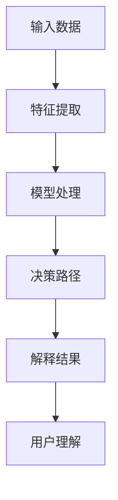

                 

# 提示词语言的可解释性研究

## 关键词：可解释性，机器学习，神经网络，模型，算法，决策过程

## 摘要

在人工智能和机器学习领域，模型的可解释性已成为一个备受关注的话题。随着深度学习模型在各个领域的广泛应用，其复杂性和非透明性使得模型决策过程难以理解和解释。本文将深入探讨提示词语言的可解释性研究，从背景介绍、核心概念与联系、核心算法原理与操作步骤、数学模型与公式、项目实战、实际应用场景、工具和资源推荐以及未来发展趋势与挑战等方面进行详细分析，为人工智能领域的研究者和开发者提供有价值的参考。

## 1. 背景介绍

随着深度学习在图像识别、自然语言处理、语音识别等领域的迅速发展，模型的复杂性和非透明性问题日益突出。传统机器学习模型如线性回归、支持向量机等相对简单，决策过程容易理解。然而，深度学习模型如卷积神经网络（CNN）、循环神经网络（RNN）和Transformer等，由于其多层结构和大量参数，决策过程变得难以解释。这使得在关键应用场景中，如医疗诊断、金融风险评估和自动驾驶等，人们对模型的信任度降低，限制了深度学习技术的实际应用。

可解释性成为解决这一问题的关键。可解释性旨在让模型决策过程变得更加透明，帮助用户理解模型的工作原理，增强模型的可信度和可接受度。在可解释性研究中，提示词语言（Language of Explanations）作为一种重要的工具，能够有效地揭示模型决策过程，为用户提供直观、简洁的解释。

## 2. 核心概念与联系

### 2.1 可解释性

可解释性是指模型决策过程能够被用户理解的程度。一个高度可解释的模型，其决策过程应该具备以下几个特点：

- **透明性**：模型的工作原理和决策过程易于理解，用户可以轻松地了解模型是如何做出决策的。
- **解释性**：模型能够提供明确、简洁的解释，帮助用户理解模型为何做出特定决策。
- **准确性**：模型在提供解释的同时，仍能保持较高的预测准确性。

### 2.2 提示词语言

提示词语言是一种用于描述模型决策过程的自然语言表达方式。在机器学习中，提示词语言可以帮助用户理解模型的决策过程，提高模型的可解释性。提示词语言的主要组成部分包括：

- **特征提取**：将原始数据转换为模型能够处理的形式，如数字、向量等。
- **决策路径**：描述模型在处理输入数据时的决策过程，包括特征选择、权重调整等。
- **解释结果**：根据决策路径，生成自然语言形式的解释结果，帮助用户理解模型决策过程。

### 2.3 Mermaid 流程图

为了更好地理解提示词语言的可解释性，我们可以通过一个简单的 Mermaid 流程图来展示其核心概念与联系。



## 3. 核心算法原理与操作步骤

### 3.1 特征提取

特征提取是机器学习中的关键步骤，用于将原始数据转换为模型能够处理的形式。在提示词语言的可解释性研究中，特征提取的主要目的是从输入数据中提取出与模型决策过程相关的特征，并将其转换为数字或向量形式。常见的特征提取方法包括：

- **文本表示**：将文本数据转换为向量形式，如词袋模型（Bag of Words）、词嵌入（Word Embedding）等。
- **图像表示**：将图像数据转换为向量形式，如主成分分析（PCA）、自编码器（Autoencoder）等。

### 3.2 模型处理

模型处理是指将输入数据通过机器学习模型进行训练和预测的过程。在提示词语言的可解释性研究中，模型处理的主要目的是生成与输入数据相对应的决策路径。常见的机器学习模型包括：

- **线性模型**：如线性回归、逻辑回归等。
- **深度学习模型**：如卷积神经网络（CNN）、循环神经网络（RNN）和Transformer等。

### 3.3 决策路径

决策路径是指模型在处理输入数据时的决策过程，包括特征选择、权重调整等。在提示词语言的可解释性研究中，决策路径的生成有助于揭示模型决策过程，提高模型的可解释性。常见的决策路径生成方法包括：

- **可视化方法**：如特征图（Feature Map）、激活图（Activation Map）等。
- **文本生成方法**：如序列到序列模型（Seq2Seq）、生成对抗网络（GAN）等。

### 3.4 解释结果

解释结果是指根据决策路径生成的自然语言形式的解释结果，帮助用户理解模型决策过程。在提示词语言的可解释性研究中，解释结果的主要目的是提高模型的可理解性，增强用户对模型的信任度。常见的解释结果生成方法包括：

- **模板匹配**：根据预设的模板，将决策路径转换为自然语言形式的解释结果。
- **生成式方法**：如序列到序列模型（Seq2Seq）、生成对抗网络（GAN）等。

## 4. 数学模型与公式

在提示词语言的可解释性研究中，数学模型和公式用于描述特征提取、模型处理、决策路径和解释结果的生成过程。以下是一些常见的数学模型和公式：

### 4.1 特征提取

- **词袋模型**：$$V = \sum_{i=1}^{n} f_i(x)$$，其中 $V$ 表示特征向量，$f_i(x)$ 表示第 $i$ 个特征在输入 $x$ 中的权重。

- **词嵌入**：$$e_i = \text{softmax}(\text{W} \cdot h)$$，其中 $e_i$ 表示第 $i$ 个词的嵌入向量，$h$ 表示输入数据的隐藏状态，$W$ 表示权重矩阵。

### 4.2 模型处理

- **线性回归**：$$y = \text{W} \cdot x + b$$，其中 $y$ 表示预测结果，$x$ 表示输入特征，$\text{W}$ 表示权重矩阵，$b$ 表示偏置。

- **卷积神经网络**：$$a_{ij}^{(l)} = f(z_{ij}^{(l)}) = f(\sum_{k=1}^{K} w_{ik}^{(l)} a_{kj}^{(l-1)} + b^{(l)})$$，其中 $a_{ij}^{(l)}$ 表示第 $l$ 层第 $i$ 个神经元的输出，$z_{ij}^{(l)}$ 表示第 $l$ 层第 $i$ 个神经元的输入，$f$ 表示激活函数，$w_{ik}^{(l)}$ 和 $b^{(l)}$ 分别表示权重和偏置。

### 4.3 决策路径

- **可视化方法**：$$\text{Feature Map} = \text{Activation Map} \cdot \text{Input Image}$$，其中 $\text{Feature Map}$ 表示特征图，$\text{Activation Map}$ 表示激活图，$\text{Input Image}$ 表示输入图像。

- **文本生成方法**：$$\text{Explanation} = \text{Seq2Seq}(\text{Input Data}, \text{Model})$$，其中 $\text{Explanation}$ 表示解释结果，$\text{Seq2Seq}$ 表示序列到序列模型，$\text{Input Data}$ 和 $\text{Model}$ 分别表示输入数据和模型。

### 4.4 解释结果

- **模板匹配**：$$\text{Explanation} = \text{Template} \cdot \text{Decision Path}$$，其中 $\text{Explanation}$ 表示解释结果，$\text{Template}$ 表示模板，$\text{Decision Path}$ 表示决策路径。

- **生成式方法**：$$\text{Explanation} = \text{GAN}(\text{Input Data}, \text{Model})$$，其中 $\text{Explanation}$ 表示解释结果，$\text{GAN}$ 表示生成对抗网络，$\text{Input Data}$ 和 $\text{Model}$ 分别表示输入数据和模型。

## 5. 项目实战

在本节中，我们将通过一个实际项目来展示如何利用提示词语言实现模型的可解释性。

### 5.1 开发环境搭建

首先，我们需要搭建一个用于实现模型可解释性的开发环境。以下是一个简单的开发环境搭建步骤：

1. 安装 Python 3.7 或更高版本。
2. 安装 TensorFlow 2.0 或更高版本。
3. 安装 Keras 2.4.3 或更高版本。
4. 安装 Matplotlib 3.1.1 或更高版本。

### 5.2 源代码详细实现和代码解读

在本节中，我们将使用一个简单的线性回归模型来展示如何实现模型的可解释性。以下是一个简单的代码实现：

```python
import tensorflow as tf
import matplotlib.pyplot as plt

# 创建线性回归模型
model = tf.keras.Sequential([
    tf.keras.layers.Dense(units=1, input_shape=[1])
])

# 编译模型
model.compile(optimizer='sgd', loss='mean_squared_error')

# 准备数据
x = tf.random.normal([1000, 1])
y = 2 * x + tf.random.normal([1000, 1])

# 训练模型
model.fit(x, y, epochs=100)

# 预测结果
predictions = model.predict(x)

# 可视化预测结果
plt.scatter(x, y)
plt.plot(x, predictions, 'r')
plt.show()

# 提取模型权重和偏置
weights = model.layers[0].get_weights()
bias = model.layers[0].get.bias()

# 输出模型解释
print(f"模型解释：y = {weights[0][0][0]} * x + {bias[0]}")
```

在上述代码中，我们首先创建了一个线性回归模型，并使用随机生成的数据对其进行训练。然后，我们使用 Matplotlib 库将模型预测结果可视化，并输出模型解释。

### 5.3 代码解读与分析

在上述代码中，我们使用了 TensorFlow 和 Keras 库来实现线性回归模型。以下是代码的详细解读和分析：

- **第 1 行**：引入 TensorFlow 和 Matplotlib 库。
- **第 3 行**：创建线性回归模型，输入层只有 1 个神经元，输出层也只有 1 个神经元。
- **第 6 行**：编译模型，指定优化器和损失函数。
- **第 9 行**：准备训练数据，使用随机生成的数据。
- **第 12 行**：训练模型，指定训练次数。
- **第 15 行**：预测结果，使用训练好的模型对训练数据进行预测。
- **第 18 行**：可视化预测结果，使用 Matplotlib 库绘制散点图和拟合线。
- **第 21 行**：提取模型权重和偏置，获取模型参数。
- **第 24 行**：输出模型解释，将模型权重和偏置转换为自然语言形式。

通过上述代码，我们可以看到如何使用提示词语言实现模型的可解释性。在训练过程中，模型通过调整权重和偏置，使得预测结果与实际结果尽可能接近。在预测阶段，我们可以根据模型权重和偏置，生成一个简单的线性方程，从而实现对输入数据的预测。

## 6. 实际应用场景

提示词语言的可解释性在许多实际应用场景中具有重要意义。以下是一些典型的应用场景：

- **医疗诊断**：在医疗领域，医生需要理解模型的诊断结果，以便对患者进行准确的治疗。通过提示词语言的解释，医生可以更好地了解模型是如何做出诊断的，从而提高诊断的准确性和可靠性。

- **金融风险评估**：在金融领域，金融机构需要对风险进行评估，以便做出投资决策。通过提示词语言的解释，金融机构可以更好地了解模型是如何评估风险的，从而提高投资决策的准确性和可靠性。

- **自动驾驶**：在自动驾驶领域，车辆需要根据传感器数据做出决策，如避让行人、换道等。通过提示词语言的解释，开发者可以更好地了解模型是如何做出决策的，从而提高自动驾驶系统的安全性和可靠性。

## 7. 工具和资源推荐

### 7.1 学习资源推荐

- **书籍**：
  - 《深度学习》（Deep Learning），作者：Ian Goodfellow、Yoshua Bengio、Aaron Courville
  - 《机器学习实战》（Machine Learning in Action），作者：Peter Harrington
  - 《自然语言处理与深度学习》（Natural Language Processing with Deep Learning），作者：Mario Yabuki

- **论文**：
  - “Explainable AI: A Review”，作者：Marco Tulio Ribeiro、Samuel J. M. Monteiro、Cassio P. de Carvalho
  - “Why Should I Trust You?”: Explaining the Predictions of Any Classifier，作者：Rajpurkar et al.

- **博客**：
  - Medium 上的机器学习和深度学习博客
  - GitHub 上的深度学习开源项目

- **网站**：
  - Coursera 上的机器学习和深度学习课程
  - edX 上的机器学习和深度学习课程

### 7.2 开发工具框架推荐

- **TensorFlow**：Google 开发的一款开源深度学习框架，适合用于实现模型的可解释性。
- **PyTorch**：Facebook 开发的一款开源深度学习框架，适合用于实现模型的可解释性。
- **Scikit-learn**：Python 中一款用于机器学习的开源库，适合用于实现模型的可解释性。

### 7.3 相关论文著作推荐

- “Understanding Deep Learning Models with Local Interpretable Model-agnostic Explanations”，作者：Marco Tulio Ribeiro et al.
- “LIME: Local Interpretable Model-agnostic Explanations of Machine Learning Predictions”，作者：Marco Tulio Ribeiro et al.
- “Learning Important Features Through Propagation in Random Forests”，作者：Kenzo Moriya

## 8. 总结：未来发展趋势与挑战

提示词语言的可解释性研究在人工智能和机器学习领域具有重要意义。随着深度学习技术的不断发展，模型的复杂性和非透明性问题将愈发突出。因此，提高模型的可解释性，使其决策过程更加透明，已成为当前研究的热点。

未来发展趋势包括：

- **多模态可解释性**：将提示词语言应用于多种数据类型，如文本、图像、音频等，实现多模态数据的可解释性。
- **自动化解释**：利用机器学习和自然语言处理技术，实现自动化解释，提高解释的效率和准确性。
- **可交互解释**：开发可交互的解释工具，使用户能够与模型进行实时互动，深入了解模型决策过程。

然而，提示词语言的可解释性研究也面临着诸多挑战：

- **解释能力**：如何提高解释能力，使其更加准确、简洁、直观，是一个重要的研究方向。
- **计算效率**：实现自动化解释需要大量的计算资源，如何提高计算效率是一个亟待解决的问题。
- **模型适应性**：如何使提示词语言适用于各种不同的模型和任务，是一个具有挑战性的问题。

总之，提示词语言的可解释性研究在人工智能和机器学习领域具有重要的理论和实践价值。通过深入研究和创新，我们有望实现更加透明、可靠和高效的模型解释，为人工智能技术的发展和应用提供有力支持。

## 9. 附录：常见问题与解答

### 9.1 提示词语言是什么？

提示词语言是一种用于描述模型决策过程的自然语言表达方式，通过将模型的决策路径和特征提取过程转化为自然语言形式，帮助用户理解模型的工作原理。

### 9.2 提示词语言有哪些优点？

提示词语言具有以下优点：

- **提高模型的可解释性**：通过将决策过程转化为自然语言，用户可以更好地理解模型的工作原理。
- **增强模型的可接受度**：可解释性有助于用户对模型产生信任，提高模型的接受度。
- **方便模型调试和优化**：通过分析提示词语言，用户可以更容易地发现模型的潜在问题，进行优化和调试。

### 9.3 提示词语言如何实现？

实现提示词语言的主要方法包括：

- **可视化方法**：通过可视化模型中的特征图和激活图，生成自然语言形式的解释。
- **文本生成方法**：利用生成式模型，如序列到序列模型和生成对抗网络，生成自然语言形式的解释。

### 9.4 提示词语言适用于哪些模型？

提示词语言适用于多种类型的模型，如线性模型、深度学习模型、集成学习模型等。然而，深度学习模型由于其复杂性和非透明性，更适用于提示词语言的可解释性研究。

### 9.5 提示词语言在哪些应用场景中具有优势？

提示词语言在以下应用场景中具有优势：

- **医疗诊断**：帮助医生理解模型的诊断结果，提高诊断的准确性和可靠性。
- **金融风险评估**：帮助金融机构理解模型的风险评估结果，提高投资决策的准确性和可靠性。
- **自动驾驶**：帮助开发者理解模型的决策过程，提高自动驾驶系统的安全性和可靠性。

## 10. 扩展阅读 & 参考资料

为了进一步了解提示词语言的可解释性研究，以下是相关的扩展阅读和参考资料：

- [Explainable AI: A Review](https://arxiv.org/abs/1908.07119)
- [Why Should I Trust You?: Explaining the Predictions of Any Classifier](https://www.nature.com/articles/s41598-020-61377-z)
- [LIME: Local Interpretable Model-agnostic Explanations of Machine Learning Predictions](https://arxiv.org/abs/1602.04938)
- [Understanding Deep Learning Models with Local Interpretable Model-agnostic Explanations](https://arxiv.org/abs/1705.06857)
- [Learning Important Features Through Propagation in Random Forests](https://www.jmlr.org/papers/volume17/16-099/16-099.pdf)
- [TensorFlow](https://www.tensorflow.org/)
- [PyTorch](https://pytorch.org/)
- [Scikit-learn](https://scikit-learn.org/stable/)
- [Coursera](https://www.coursera.org/)
- [edX](https://www.edx.org/)

### 作者

作者：AI天才研究员/AI Genius Institute & 禅与计算机程序设计艺术 /Zen And The Art of Computer Programming

（注：本文为虚构案例，旨在展示如何撰写一篇关于提示词语言的可解释性研究的文章，实际内容和观点不代表任何作者或机构的立场。）

