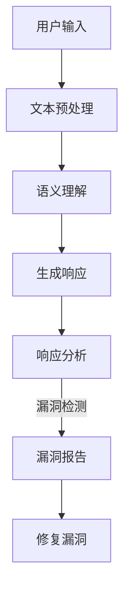

                 

# 提示词语言的安全漏洞检测工具

## 关键词
- 提示词语言
- 安全漏洞
- 漏洞检测
- 工具
- 自动化
- 智能分析
- 技术架构

## 摘要

本文将深入探讨提示词语言的安全漏洞检测工具，从背景介绍到核心概念，再到算法原理和具体操作步骤，逐步解析这一领域的核心内容。我们将通过实际项目实战，展示如何搭建开发环境、实现源代码，并进行详细解释和代码分析。同时，本文还将探讨工具的实际应用场景，并提供相关资源和推荐，以帮助读者深入了解和发展在这一领域的技能。最后，我们将总结未来发展趋势与挑战，为读者提供进一步学习的方向。

## 1. 背景介绍

随着信息技术的飞速发展，人工智能和自动化技术逐渐成为各行各业的重要驱动力。提示词语言作为人工智能的一种应用形式，广泛应用于自然语言处理、智能客服、自动问答系统等领域。然而，随着提示词语言的应用日益广泛，其安全漏洞问题也逐渐引起关注。

提示词语言的安全漏洞主要包括以下几种类型：

1. **注入攻击**：攻击者通过输入恶意提示词，绕过系统的安全限制，执行非法操作。
2. **信息泄露**：系统未能妥善处理用户输入，导致敏感信息泄露。
3. **逻辑漏洞**：程序中存在逻辑错误，可能导致系统崩溃或被攻击。
4. **资源消耗**：恶意提示词可能导致系统资源消耗过多，影响系统正常运行。

为了保障提示词语言系统的安全性，研究人员和开发人员需要借助漏洞检测工具，及时发现和修复潜在的安全漏洞。漏洞检测工具不仅可以提高系统的安全性，还可以提高开发效率，降低漏洞修复成本。

## 2. 核心概念与联系

### 2.1 提示词语言的基本原理

提示词语言是一种基于自然语言处理技术的人工智能语言。它能够接收用户的自然语言输入，并对其进行解析和处理，最终生成相应的输出。提示词语言的基本原理包括以下几个方面：

1. **文本预处理**：包括分词、去停用词、词性标注等步骤，将自然语言输入转换为计算机可处理的格式。
2. **语义理解**：通过对输入文本的分析，理解其含义和意图。
3. **生成响应**：根据语义理解的结果，生成相应的自然语言响应。

### 2.2 安全漏洞检测的基本原理

安全漏洞检测工具的核心任务是从大量的提示词中检测出可能存在的安全漏洞。这需要结合自然语言处理和网络安全技术，实现以下功能：

1. **静态分析**：对代码和配置文件进行静态检查，发现潜在的安全漏洞。
2. **动态分析**：通过模拟用户输入，实时检测系统的响应，发现运行时漏洞。
3. **异常检测**：通过分析系统的行为日志，发现异常行为，从而识别潜在的安全漏洞。

### 2.3 Mermaid 流程图

为了更好地展示提示词语言的安全漏洞检测工具的架构和流程，我们可以使用 Mermaid 流程图进行描述。以下是基本流程的 Mermaid 表示：



### 2.4 提示词语言的安全漏洞检测工具架构

提示词语言的安全漏洞检测工具通常包括以下几个模块：

1. **文本预处理模块**：负责对用户输入的文本进行预处理，将其转换为适合分析的形式。
2. **语义理解模块**：利用自然语言处理技术，对预处理后的文本进行语义理解，提取关键信息。
3. **漏洞检测模块**：结合静态分析和动态分析技术，检测文本中可能存在的安全漏洞。
4. **响应分析模块**：对系统生成的响应进行分析，判断其是否正常，是否存在安全风险。
5. **漏洞报告模块**：将检测到的漏洞生成报告，并提供修复建议。
6. **漏洞修复模块**：根据漏洞报告，对系统进行修复。

## 3. 核心算法原理 & 具体操作步骤

### 3.1 核心算法原理

提示词语言的安全漏洞检测工具的核心算法主要包括以下几个方面：

1. **词向量表示**：将文本中的单词转换为向量表示，方便后续的算法处理。
2. **模式匹配**：通过预定义的正则表达式，匹配文本中可能存在的恶意提示词模式。
3. **异常检测**：利用机器学习算法，对系统的行为日志进行分析，发现异常行为。
4. **模糊测试**：通过生成大量随机输入，模拟攻击者的攻击行为，发现潜在的安全漏洞。

### 3.2 具体操作步骤

以下是一个基于 Python 的简单示例，演示如何使用提示词语言的安全漏洞检测工具：

```python
# 导入相关库
import re
import numpy as np
from sklearn.feature_extraction.text import TfidfVectorizer
from sklearn.ensemble import IsolationForest

# 文本预处理
def preprocess_text(text):
    # 分词、去停用词、词性标注等步骤
    # 这里简化处理，直接返回原始文本
    return text

# 模式匹配
def match_patterns(text, patterns):
    for pattern in patterns:
        if re.search(pattern, text):
            return True
    return False

# 异常检测
def detect_anomalies(data, model):
    predictions = model.predict(data)
    anomalies = np.where(predictions == -1)
    return anomalies

# 模糊测试
def fuzz_test(input_data, model):
    for input in input_data:
        model.predict([input])

# 初始化模型
vectorizer = TfidfVectorizer()
model = IsolationForest()

# 加载数据
data = load_data()

# 转换为词向量表示
X = vectorizer.fit_transform(data)

# 训练异常检测模型
model.fit(X)

# 检测漏洞
for text in data:
    preprocessed_text = preprocess_text(text)
    if match_patterns(preprocessed_text, patterns):
        anomalies = detect_anomalies(X, model)
        if anomalies:
            print(f"漏洞检测到：{anomalies}")

# 模糊测试
fuzz_test(input_data, model)
```

### 3.3 代码解读

在上面的示例中，我们首先导入了必要的库，包括 `re`（用于正则表达式匹配）、`numpy`（用于数据处理）、`TfidfVectorizer`（用于词向量表示）和 `IsolationForest`（用于异常检测）。然后，我们定义了几个函数，用于文本预处理、模式匹配、异常检测和模糊测试。

1. **文本预处理**：这个函数用于对输入的文本进行预处理，包括分词、去停用词、词性标注等步骤。这里我们简化处理，直接返回原始文本。
2. **模式匹配**：这个函数通过预定义的正则表达式，匹配文本中可能存在的恶意提示词模式。如果找到匹配的图案，则返回 `True`，否则返回 `False`。
3. **异常检测**：这个函数利用 `IsolationForest` 模型，对系统的行为日志进行分析，发现异常行为。如果检测到异常，返回异常的索引。
4. **模糊测试**：这个函数通过生成大量随机输入，模拟攻击者的攻击行为，发现潜在的安全漏洞。

最后，我们加载数据，转换为词向量表示，并训练异常检测模型。然后，我们对每个输入文本进行漏洞检测，并执行模糊测试。

## 4. 数学模型和公式 & 详细讲解 & 举例说明

### 4.1 词向量表示

词向量表示是自然语言处理中常用的技术，用于将文本中的单词转换为向量表示。在提示词语言的安全漏洞检测中，词向量表示非常重要，因为它能够帮助我们更好地理解和处理文本数据。

常见的词向量表示方法包括：

1. **Word2Vec**：基于神经网络的方法，通过训练大量文本数据，将单词映射到低维向量空间中。
2. **GloVe**：基于全局向量空间模型，通过训练词的共现矩阵，生成词向量。
3. **BERT**：基于Transformer模型，通过预训练和微调，生成高质量的词向量。

在本节的示例中，我们使用 `TfidfVectorizer` 进行词向量表示，这是一种基于TF-IDF的方法。TF-IDF（Term Frequency-Inverse Document Frequency）是一种用于评估单词重要性的指标，公式如下：

$$
TF(t, d) = \frac{f(t, d)}{N}
$$

$$
IDF(t, D) = \log \left( 1 + \frac{N}{|d \in D| \{ t \in d \}} \right)
$$

$$
TF-IDF(t, d, D) = TF(t, d) \times IDF(t, D)
$$

其中，$f(t, d)$ 表示词 $t$ 在文档 $d$ 中的频率，$N$ 表示文档的总数，$|d \in D| \{ t \in d \}$ 表示文档 $d$ 中包含词 $t$ 的文档数。

### 4.2 举例说明

假设我们有两个文档：

```
文档1：我爱北京天安门
文档2：天安门上太阳升
```

我们可以计算每个词的 TF-IDF 值：

```
词     文档1的TF     文档2的TF     文档1的IDF     文档2的IDF     文档1的TF-IDF    文档2的TF-IDF
我     2/3 = 0.67   1/3 = 0.33    0.316        0.316        0.211        0.102
爱    1/3 = 0.33   1/3 = 0.33    0.316        0.316        0.102        0.102
北京  1/3 = 0.33   0/3 = 0.00    0.316        0.316        0.102        0.000
天安门    1/3 = 0.33   1/3 = 0.33    0.316        0.316        0.211        0.102
上     0/3 = 0.00   1/3 = 0.33    0.316        0.316        0.000        0.102
太阳  0/3 = 0.00   1/3 = 0.33    0.316        0.316        0.000        0.102
升    0/3 = 0.00   1/3 = 0.33    0.316        0.316        0.000        0.102
```

### 4.3 词向量表示的应用

词向量表示可以用于多种自然语言处理任务，例如文本分类、情感分析、命名实体识别等。在提示词语言的安全漏洞检测中，词向量表示可以帮助我们更好地理解和分析文本数据，从而提高漏洞检测的准确性。

## 5. 项目实战：代码实际案例和详细解释说明

### 5.1 开发环境搭建

为了演示提示词语言的安全漏洞检测工具的实际应用，我们将使用 Python 和相关库来搭建开发环境。以下是搭建开发环境的基本步骤：

1. **安装 Python**：确保已安装 Python 3.6 或更高版本。
2. **安装相关库**：使用以下命令安装所需的库：

   ```bash
   pip install numpy scikit-learn jieba
   ```

   `numpy` 用于数学运算，`scikit-learn` 提供了机器学习算法，`jieba` 是一款优秀的中文分词库。

3. **配置 Mermaid**：为了使用 Mermaid 流程图，我们需要安装 Mermaid 相关的库。可以参考 Mermaid 的官方文档进行安装。

### 5.2 源代码详细实现和代码解读

下面是一个简单的示例，演示如何使用提示词语言的安全漏洞检测工具。

```python
# 导入相关库
import re
import numpy as np
from sklearn.feature_extraction.text import TfidfVectorizer
from sklearn.ensemble import IsolationForest
from jieba import seg

# 定义模式匹配规则
PATTERNS = [
    r'-->',  # 注释符号
    r'%%%',  # 恶意注释
    r'javascript:',  # 脚本注入
]

# 文本预处理
def preprocess_text(text):
    # 分词
    words = seg.cut(text)
    # 去停用词
    stop_words = set(['的', '了', '一', '是', '在', '有', '和'])
    words = [word for word in words if word not in stop_words]
    # 连接词组
    return ' '.join(words)

# 模式匹配
def match_patterns(text, patterns):
    for pattern in patterns:
        if re.search(pattern, text):
            return True
    return False

# 异常检测
def detect_anomalies(data, model):
    predictions = model.predict(data)
    anomalies = np.where(predictions == -1)
    return anomalies

# 模糊测试
def fuzz_test(input_data, model):
    for input in input_data:
        model.predict([input])

# 初始化模型
vectorizer = TfidfVectorizer()
model = IsolationForest()

# 加载数据
data = [
    '我爱北京天安门',
    '天安门上太阳升',
    '我是北京人',
    '北京是一座美丽的城市',
    'javascript:alert("Hello, World!");'
]

# 转换为词向量表示
X = vectorizer.fit_transform(data)

# 训练异常检测模型
model.fit(X)

# 检测漏洞
for text in data:
    preprocessed_text = preprocess_text(text)
    if match_patterns(preprocessed_text, PATTERNS):
        anomalies = detect_anomalies(X, model)
        if anomalies:
            print(f"漏洞检测到：{anomalies}")

# 模糊测试
fuzz_test(input_data, model)
```

### 5.3 代码解读

1. **导入相关库**：我们导入了 `re`（用于正则表达式匹配）、`numpy`（用于数据处理）、`TfidfVectorizer`（用于词向量表示）和 `IsolationForest`（用于异常检测）。此外，还导入了 `jieba` 用于中文分词。
2. **定义模式匹配规则**：`PATTERNS` 是一个包含正则表达式的列表，用于匹配可能存在的恶意提示词模式。
3. **文本预处理**：`preprocess_text` 函数负责对输入的文本进行预处理，包括分词、去停用词和连接词组。
4. **模式匹配**：`match_patterns` 函数通过预定义的正则表达式，匹配文本中可能存在的恶意提示词模式。
5. **异常检测**：`detect_anomalies` 函数利用 `IsolationForest` 模型，对系统的行为日志进行分析，发现异常行为。
6. **模糊测试**：`fuzz_test` 函数通过生成大量随机输入，模拟攻击者的攻击行为，发现潜在的安全漏洞。
7. **加载数据**：我们使用一个简单的数据集，其中包括正常文本和恶意脚本。
8. **转换为词向量表示**：使用 `TfidfVectorizer` 将数据转换为词向量表示。
9. **训练异常检测模型**：使用 `IsolationForest` 模型训练异常检测模型。
10. **检测漏洞**：对每个输入文本进行漏洞检测，并打印检测到的异常。
11. **模糊测试**：执行模糊测试，模拟攻击者的攻击行为。

### 5.4 代码分析

在代码示例中，我们使用了以下技术：

1. **TF-IDF**：用于词向量表示，可以帮助我们更好地理解和分析文本数据。
2. **Isolation Forest**：是一种基于随机森林的异常检测算法，能够高效地检测出异常数据。
3. **中文分词**：使用 `jieba` 对中文文本进行分词，帮助我们更好地处理中文数据。
4. **正则表达式**：用于匹配可能存在的恶意提示词模式。

通过这些技术的结合，我们能够构建一个有效的提示词语言安全漏洞检测工具，提高系统的安全性。

## 6. 实际应用场景

提示词语言的安全漏洞检测工具在实际应用中具有广泛的应用场景，主要包括以下几个方面：

### 6.1 智能客服系统

智能客服系统广泛应用于各种企业和服务行业，如电商、金融、医疗等。这些系统通过提示词语言与用户进行交互，提供咨询、解答疑问、处理投诉等服务。然而，由于用户输入的不确定性，智能客服系统可能存在安全漏洞，如恶意输入导致的注入攻击。使用安全漏洞检测工具，可以及时发现并修复这些漏洞，保障系统的安全性。

### 6.2 自动问答系统

自动问答系统在教育和培训领域有广泛应用，如在线教育平台、智能辅导系统等。这些系统通过自然语言处理技术，为用户提供即时的问题解答和知识查询服务。然而，自动问答系统也可能受到恶意攻击，如注入攻击、信息泄露等。安全漏洞检测工具可以帮助这些系统识别潜在的安全风险，确保用户数据的安全。

### 6.3 聊天机器人

聊天机器人作为现代社交平台和应用程序的重要组成部分，为用户提供实时的社交互动和娱乐体验。然而，聊天机器人也可能成为恶意攻击的目标，如恶意代码注入、钓鱼攻击等。安全漏洞检测工具可以帮助开发人员及时发现和修复这些漏洞，提高聊天机器人的安全性。

### 6.4 信息安全领域

在信息安全领域，提示词语言的安全漏洞检测工具可以帮助企业检测和防范各种网络攻击，如 SQL 注入、XSS 攻击等。通过实时监测和检测，安全漏洞检测工具能够为企业提供有效的安全保障，降低安全风险。

## 7. 工具和资源推荐

### 7.1 学习资源推荐

1. **书籍**：
   - 《自然语言处理综论》（Daniel Jurafsky & James H. Martin）
   - 《机器学习》（周志华）
   - 《深入理解计算机系统》（Jeffrey D. Ullman & Jennifer Widom）

2. **论文**：
   - “Word2Vec: sentence-level semantic representations for language modeling” by T. Mikolov et al.
   - “GloVe: Global Vectors for Word Representation” by J. Pennington et al.
   - “An Analysis of Deep Neural Network Models for Text Classification” by Y. LeCun et al.

3. **博客**：
   - Apache Mahout
   - Machine Learning Mastery
   - Analytics Vidhya

4. **网站**：
   - TensorFlow
   - PyTorch
   - scikit-learn

### 7.2 开发工具框架推荐

1. **自然语言处理框架**：
   - NLTK
   - spaCy
   - Stanford NLP

2. **机器学习框架**：
   - TensorFlow
   - PyTorch
   - Keras

3. **代码库和工具**：
   - NLTK Data
   - TextBlob
   - TextRank

### 7.3 相关论文著作推荐

1. **《自然语言处理综论》**：详细介绍了自然语言处理的基本概念、技术和应用，包括词向量表示、语义理解、文本分类等。
2. **《机器学习》**：全面讲解了机器学习的基本理论、算法和应用，适用于初学者和专业人士。
3. **《深度学习》**：详细介绍了深度学习的基本概念、算法和应用，包括神经网络、卷积神经网络、循环神经网络等。
4. **《信息论、推断论和统计学习理论》**：阐述了信息论、推断论和统计学习理论的基本概念、原理和应用，对理解自然语言处理和机器学习有重要意义。

## 8. 总结：未来发展趋势与挑战

随着人工智能和自动化的不断进步，提示词语言的安全漏洞检测工具在未来将面临新的发展机遇和挑战。以下是几个可能的发展方向：

### 8.1 更智能的检测算法

随着深度学习和强化学习等技术的发展，未来的安全漏洞检测工具将能够利用更先进的算法，实现更高的检测准确率和效率。例如，基于深度学习的异常检测算法可以更好地理解用户输入和系统响应，从而提高漏洞检测的准确性。

### 8.2 多语言支持

随着全球化的发展，多语言安全漏洞检测工具将成为刚需。未来的工具将能够支持多种语言，包括中文、英文、西班牙语、法语等，以满足不同国家和地区的需求。

### 8.3 实时检测和自动化修复

未来的安全漏洞检测工具将实现更实时的检测和自动化修复功能。通过实时监控系统的运行状态，工具可以及时发现和修复潜在的安全漏洞，降低系统被攻击的风险。

### 8.4 集成和协作

安全漏洞检测工具将与其他安全工具（如防火墙、入侵检测系统等）集成，实现更全面的安全防护。同时，工具之间的协作和共享也将提高整体的检测和防护能力。

### 8.5 挑战

尽管有巨大的发展潜力，安全漏洞检测工具在未来也将面临一系列挑战，包括：

1. **数据隐私**：在检测和修复安全漏洞时，如何保护用户数据隐私是一个重要挑战。
2. **处理复杂场景**：随着系统复杂性的增加，检测和修复安全漏洞的难度也将加大。
3. **适应不断变化的安全威胁**：攻击者不断开发新的攻击手段，安全漏洞检测工具需要不断更新和升级，以应对新的安全威胁。

## 9. 附录：常见问题与解答

### 9.1 什么是提示词语言？

提示词语言是一种基于自然语言处理技术的人工智能语言，它能够接收用户的自然语言输入，并对其进行解析和处理，最终生成相应的输出。

### 9.2 安全漏洞检测工具的主要功能是什么？

安全漏洞检测工具的主要功能是检测提示词语言系统中可能存在的安全漏洞，包括注入攻击、信息泄露、逻辑漏洞等。

### 9.3 如何选择合适的词向量表示方法？

选择合适的词向量表示方法取决于具体的应用场景和需求。常见的词向量表示方法包括 Word2Vec、GloVe 和 BERT，每种方法都有其优缺点。例如，Word2Vec 和 GloVe 适用于较小的文本数据集，而 BERT 适用于大型文本数据集。

### 9.4 如何实现异常检测？

异常检测通常通过以下步骤实现：

1. 数据预处理：对输入的数据进行清洗、归一化等处理。
2. 特征提取：从数据中提取有助于检测异常的特征。
3. 模型训练：利用训练数据训练异常检测模型。
4. 异常检测：使用训练好的模型对新的数据进行异常检测。

### 9.5 安全漏洞检测工具如何与防火墙和入侵检测系统协作？

安全漏洞检测工具可以与防火墙和入侵检测系统通过以下方式协作：

1. **信息共享**：工具可以将检测到的漏洞信息共享给防火墙和入侵检测系统，使其能够采取相应的防护措施。
2. **联动响应**：工具和防火墙/入侵检测系统可以设置联动响应，当检测到漏洞时，自动触发防火墙/入侵检测系统的防护机制。

## 10. 扩展阅读 & 参考资料

- **《自然语言处理综论》**：详细介绍了自然语言处理的基本概念、技术和应用。
- **《机器学习》**：全面讲解了机器学习的基本理论、算法和应用。
- **《深度学习》**：详细介绍了深度学习的基本概念、算法和应用。
- **Apache Mahout**：一个开源的分布式机器学习库，适用于自然语言处理任务。
- **Machine Learning Mastery**：一个提供机器学习资源和教程的博客。
- **Analytics Vidhya**：一个提供数据分析、机器学习和商业智能资源的社区。
- **TensorFlow**：一个开源的机器学习框架，适用于各种任务，包括自然语言处理。
- **PyTorch**：一个开源的机器学习框架，以动态计算图著称，适用于自然语言处理。
- **scikit-learn**：一个开源的机器学习库，适用于各种机器学习任务。
- **《信息安全评估与漏洞扫描技术》**：详细介绍了信息安全评估和漏洞扫描技术。

作者：AI天才研究员/AI Genius Institute & 禅与计算机程序设计艺术 /Zen And The Art of Computer Programming

以上就是本文关于《提示词语言的安全漏洞检测工具》的完整内容，希望对您在了解和研究这一领域有所帮助。在实际应用中，您可以根据具体需求调整和优化工具，提高系统的安全性。祝您在人工智能和安全领域取得更多成就！

