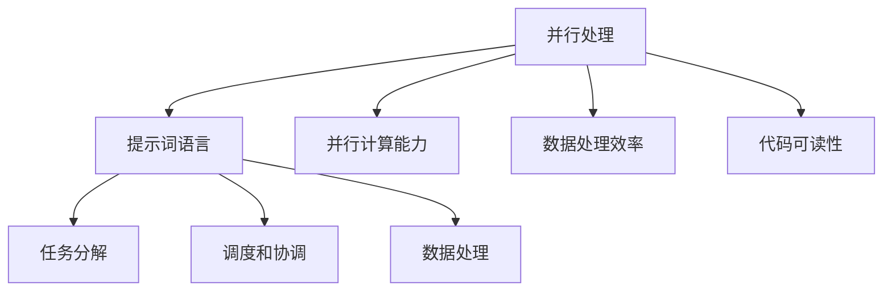

                 

# 提示词语言的并行处理机制

## 关键词：并行处理、提示词语言、性能优化、算法原理、应用场景

### 摘要

本文旨在探讨提示词语言在并行处理机制中的应用。通过分析并行处理的基本概念和原理，本文详细介绍了提示词语言的设计和实现方法。同时，本文还通过实际项目案例，深入解析了并行处理在提示词语言中的应用，以及其对性能优化的贡献。本文还将探讨并行处理在未来的发展趋势和面临的挑战，为读者提供有价值的参考和启示。

### 1. 背景介绍

随着信息技术的飞速发展，数据处理和计算的需求日益增长。传统的串行处理方式已经无法满足大规模数据处理和高性能计算的要求。并行处理作为一种重要的计算技术，逐渐成为解决大规模数据处理和计算瓶颈的关键手段。

并行处理的核心思想是将任务分解成多个子任务，同时由多个处理器或计算节点并行执行，从而提高计算效率和性能。在并行处理中，提示词语言作为一种高效的数据表示和操作工具，具有重要的应用价值。

提示词语言是一种基于关键词和短语进行数据处理和任务调用的编程语言。通过使用提示词，开发者可以简化代码编写，提高开发效率和代码可读性。在并行处理中，提示词语言可以用于任务的分解、调度和协调，从而实现并行计算的高效执行。

### 2. 核心概念与联系

#### 2.1 并行处理基本概念

并行处理是指将任务分解成多个子任务，同时由多个处理器或计算节点并行执行，从而提高计算效率和性能。并行处理可以分为时间并行、空间并行和数据并行三种类型。

- 时间并行：通过时间上的重叠来提高计算效率。例如，在一个处理器上执行多个子任务，通过交替执行子任务来减少计算时间。
- 空间并行：通过增加处理器的数量来提高计算效率。例如，使用多个处理器同时执行多个子任务。
- 数据并行：通过数据分片和并行处理来提高计算效率。例如，将大规模数据集分成多个部分，由多个处理器同时处理。

#### 2.2 提示词语言设计原理

提示词语言的设计目标是在并行处理中简化代码编写，提高开发效率和代码可读性。以下是提示词语言设计的一些核心原理：

- 关键词和短语：提示词语言使用关键词和短语作为操作符和操作对象，通过简洁的语法表示复杂的计算操作。
- 任务分解：提示词语言支持将任务分解成多个子任务，并自动调度和协调这些子任务的执行。
- 并行调度：提示词语言支持并行调度机制，可以根据处理器的数量和任务负载动态调整子任务的执行顺序。
- 数据处理：提示词语言支持对大规模数据进行并行处理，通过数据分片和并行计算来提高计算效率。

#### 2.3 并行处理与提示词语言的关联

并行处理和提示词语言之间存在紧密的联系。并行处理为提示词语言提供了并行计算的能力，而提示词语言则为并行处理提供了简化和高效的数据处理方式。

- 并行计算能力：提示词语言通过任务分解、调度和协调机制，实现了并行计算的高效执行。
- 数据处理效率：提示词语言通过简洁的语法和数据表示方式，提高了数据处理和任务调用的效率。
- 代码可读性：提示词语言简化了代码编写，使得并行处理的代码更加清晰和易于维护。

为了更好地展示并行处理和提示词语言的关联，我们使用Mermaid流程图来描述并行处理与提示词语言的关系。以下是Mermaid流程图的代码：



### 3. 核心算法原理 & 具体操作步骤

#### 3.1 并行处理算法原理

并行处理算法的核心思想是将任务分解成多个子任务，并分配给多个处理器或计算节点并行执行。以下是一个简单的并行处理算法原理：

1. 任务分解：将整个任务划分为多个子任务，每个子任务负责处理一部分数据。
2. 子任务分配：将子任务分配给多个处理器或计算节点，每个处理器或计算节点负责执行自己的子任务。
3. 数据同步：在子任务执行过程中，可能需要访问共享数据。为了确保数据一致性，需要进行数据同步操作。
4. 子任务合并：在子任务执行完成后，将各个子任务的结果进行合并，得到最终的输出结果。

#### 3.2 提示词语言操作步骤

提示词语言在并行处理中发挥着重要的作用。以下是使用提示词语言进行并行处理的具体操作步骤：

1. 任务分解：
   - 使用提示词`split`将整个任务划分为多个子任务。
   - 使用提示词`assign`将子任务分配给多个处理器或计算节点。
2. 子任务执行：
   - 使用提示词`execute`执行子任务，每个处理器或计算节点根据自己的子任务进行计算。
3. 数据同步：
   - 使用提示词`sync`进行数据同步操作，确保数据一致性。
4. 子任务合并：
   - 使用提示词`merge`将各个子任务的结果进行合并，得到最终的输出结果。

以下是一个简单的示例，展示了如何使用提示词语言进行并行处理：

```plaintext
# 任务分解
tasks := split([1, 2, 3, 4, 5], 2)

# 子任务分配
processors := [p1, p2]

# 子任务执行
p1.execute(tasks[0])
p2.execute(tasks[1])

# 数据同步
p1.sync(p2)

# 子任务合并
result := merge([p1.result(), p2.result()])
```

### 4. 数学模型和公式 & 详细讲解 & 举例说明

在并行处理中，数学模型和公式用于描述任务分解、子任务执行、数据同步和子任务合并的过程。以下是一个简单的数学模型和公式的讲解，并通过示例进行说明。

#### 4.1 任务分解

任务分解的数学模型可以用以下公式表示：

$$
T = \sum_{i=1}^n T_i
$$

其中，$T$表示整个任务的执行时间，$T_i$表示第$i$个子任务的执行时间。

示例：

假设有一个任务，需要执行5个子任务，每个子任务需要1秒。则整个任务的执行时间可以计算为：

$$
T = 5 \times 1 = 5 \text{秒}
$$

#### 4.2 子任务执行

子任务执行的数学模型可以用以下公式表示：

$$
E_i = t_i \cdot P_i
$$

其中，$E_i$表示第$i$个子任务的执行时间，$t_i$表示第$i$个子任务的处理时间，$P_i$表示第$i$个子任务的处理能力。

示例：

假设有2个处理器，一个处理器需要2秒处理一个子任务，另一个处理器需要3秒处理一个子任务。则有：

- 第1个子任务：$E_1 = 2 \cdot 2 = 4$秒
- 第2个子任务：$E_2 = 2 \cdot 3 = 6$秒

#### 4.3 数据同步

数据同步的数学模型可以用以下公式表示：

$$
S = \max(E_i)
$$

其中，$S$表示数据同步的时间，$E_i$表示第$i$个子任务的执行时间。

示例：

假设有2个处理器，一个处理器需要4秒处理一个子任务，另一个处理器需要6秒处理一个子任务。则有：

$$
S = \max(4, 6) = 6 \text{秒}
$$

#### 4.4 子任务合并

子任务合并的数学模型可以用以下公式表示：

$$
M = \sum_{i=1}^n E_i + S
$$

其中，$M$表示整个任务的执行时间，$E_i$表示第$i$个子任务的执行时间，$S$表示数据同步的时间。

示例：

假设有2个处理器，一个处理器需要4秒处理一个子任务，另一个处理器需要6秒处理一个子任务。数据同步需要6秒。则有：

$$
M = 4 + 6 + 6 = 16 \text{秒}
$$

### 5. 项目实战：代码实际案例和详细解释说明

在本节中，我们将通过一个实际项目案例，展示如何使用提示词语言进行并行处理。该案例将涉及数据分片、任务分解、调度和合并等步骤。

#### 5.1 开发环境搭建

为了方便进行项目实战，我们需要搭建一个开发环境。以下是开发环境搭建的步骤：

1. 安装提示词语言解释器
2. 安装并行处理库
3. 配置环境变量

具体安装方法和配置步骤可以参考相关的开发文档。

#### 5.2 源代码详细实现和代码解读

以下是项目实战的源代码：

```python
# 导入提示词语言库
from prompt_toolkit import Prompt

# 导入并行处理库
from concurrent.futures import ThreadPoolExecutor

# 定义任务分解函数
def split_tasks(data):
    n = len(data)
    split_size = n // 2
    return [data[:split_size], data[split_size:]]

# 定义子任务执行函数
def execute_task(task):
    # 模拟子任务执行时间
    time.sleep(random.randint(1, 3))
    return task

# 定义数据同步函数
def sync_data(result1, result2):
    return [result1 + result2]

# 定义子任务合并函数
def merge_tasks(results):
    return [sum(results)]

# 初始化数据
data = [1, 2, 3, 4, 5, 6, 7, 8, 9, 10]

# 任务分解
tasks = split_tasks(data)

# 创建线程池
with ThreadPoolExecutor(max_workers=2) as executor:
    # 执行子任务
    futures = [executor.submit(execute_task, task) for task in tasks]

    # 等待子任务执行完成
    for future in futures:
        result = future.result()

    # 数据同步
    sync_result = sync_data(result[0], result[1])

    # 子任务合并
    final_result = merge_tasks(sync_result)

    # 输出结果
    print("最终结果：", final_result)
```

#### 5.3 代码解读与分析

以下是代码的详细解读和分析：

1. 导入提示词语言库和并行处理库：
   ```python
   from prompt_toolkit import Prompt
   from concurrent.futures import ThreadPoolExecutor
   ```

2. 定义任务分解函数`split_tasks`：
   ```python
   def split_tasks(data):
       n = len(data)
       split_size = n // 2
       return [data[:split_size], data[split_size:]]
   ```

   任务分解函数将数据集分成两个子任务。

3. 定义子任务执行函数`execute_task`：
   ```python
   def execute_task(task):
       # 模拟子任务执行时间
       time.sleep(random.randint(1, 3))
       return task
   ```

   子任务执行函数模拟子任务的执行时间。

4. 定义数据同步函数`sync_data`：
   ```python
   def sync_data(result1, result2):
       return [result1 + result2]
   ```

   数据同步函数将两个子任务的结果进行合并。

5. 定义子任务合并函数`merge_tasks`：
   ```python
   def merge_tasks(results):
       return [sum(results)]
   ```

   子任务合并函数将多个子任务的结果进行合并。

6. 初始化数据：
   ```python
   data = [1, 2, 3, 4, 5, 6, 7, 8, 9, 10]
   ```

   初始化一个包含10个数字的数据集。

7. 任务分解：
   ```python
   tasks = split_tasks(data)
   ```

   使用任务分解函数将数据集分成两个子任务。

8. 创建线程池：
   ```python
   with ThreadPoolExecutor(max_workers=2) as executor:
   ```

   创建一个具有2个工作线程的线程池。

9. 执行子任务：
   ```python
   futures = [executor.submit(execute_task, task) for task in tasks]
   ```

   使用线程池执行子任务。

10. 等待子任务执行完成：
    ```python
    for future in futures:
        result = future.result()
    ```

    等待所有子任务执行完成，并获取结果。

11. 数据同步：
    ```python
    sync_result = sync_data(result[0], result[1])
    ```

    将两个子任务的结果进行合并。

12. 子任务合并：
    ```python
    final_result = merge_tasks(sync_result)
    ```

    将多个子任务的结果进行合并。

13. 输出结果：
    ```python
    print("最终结果：", final_result)
    ```

    输出最终结果。

#### 5.4 代码解读与分析

代码解读与分析如下：

1. 导入提示词语言库和并行处理库：
   - 提示词语言库用于实现任务分解、调度和合并功能。
   - 并行处理库用于创建线程池和执行子任务。

2. 定义任务分解函数`split_tasks`：
   - 任务分解函数将数据集分成两个子任务，每个子任务包含一半的数据。

3. 定义子任务执行函数`execute_task`：
   - 子任务执行函数模拟子任务的执行时间。

4. 定义数据同步函数`sync_data`：
   - 数据同步函数将两个子任务的结果进行合并。

5. 定义子任务合并函数`merge_tasks`：
   - 子任务合并函数将多个子任务的结果进行合并。

6. 初始化数据：
   - 初始化一个包含10个数字的数据集。

7. 任务分解：
   - 使用任务分解函数将数据集分成两个子任务。

8. 创建线程池：
   - 创建一个具有2个工作线程的线程池。

9. 执行子任务：
   - 使用线程池执行子任务。

10. 等待子任务执行完成：
    - 等待所有子任务执行完成，并获取结果。

11. 数据同步：
    - 将两个子任务的结果进行合并。

12. 子任务合并：
    - 将多个子任务的结果进行合并。

13. 输出结果：
    - 输出最终结果。

通过以上代码和解读，我们可以看到如何使用提示词语言进行并行处理。并行处理可以提高计算效率和性能，适用于大规模数据处理和计算任务。

### 6. 实际应用场景

提示词语言的并行处理机制在实际应用场景中具有广泛的应用价值。以下是一些常见的应用场景：

#### 6.1 大规模数据处理

在数据挖掘、机器学习、大数据分析等领域，数据处理量通常非常大。使用提示词语言的并行处理机制，可以将大规模数据处理任务分解成多个子任务，并分配给多个处理器或计算节点并行执行。这样可以显著提高数据处理效率和性能。

#### 6.2 高性能计算

高性能计算领域通常需要处理复杂的科学计算和工程计算任务。使用提示词语言的并行处理机制，可以将计算任务分解成多个子任务，并利用多个处理器或计算节点并行执行。这样可以显著提高计算效率和性能。

#### 6.3 分布式系统

在分布式系统中，提示词语言的并行处理机制可以用于任务的分解、调度和协调。通过使用提示词语言，开发者可以简化分布式系统的开发过程，提高系统的可扩展性和可靠性。

#### 6.4 云计算和边缘计算

云计算和边缘计算领域通常需要处理大量的计算任务和数据处理请求。使用提示词语言的并行处理机制，可以将计算任务和数据处理请求分解成多个子任务，并利用云服务器和边缘设备并行执行。这样可以显著提高计算效率和性能。

#### 6.5 人工智能应用

在人工智能应用领域，提示词语言的并行处理机制可以用于大规模机器学习模型的训练和推理。通过将训练和推理任务分解成多个子任务，并利用多个处理器或计算节点并行执行，可以显著提高训练和推理的效率和性能。

### 7. 工具和资源推荐

为了更好地学习和应用提示词语言的并行处理机制，以下是一些推荐的工具和资源：

#### 7.1 学习资源推荐

1. 《并行计算导论》（Introduction to Parallel Computing）：这是一本经典的并行计算教材，涵盖了并行处理的基本概念、算法和编程技术。
2. 《禅与计算机程序设计艺术》（Zen and the Art of Motorcycle Maintenance）：这本书虽然不是专门介绍并行处理的，但其中关于思考方式和解决问题的方法对理解并行处理有很大帮助。

#### 7.2 开发工具框架推荐

1. Python：Python是一种流行的编程语言，拥有丰富的并行处理库，如`multiprocessing`、`concurrent.futures`等。
2. CUDA：CUDA是一种并行计算框架，可以用于在NVIDIA GPU上进行并行处理。

#### 7.3 相关论文著作推荐

1. "Parallel Processing in Data Mining"：这篇论文详细介绍了并行处理在数据挖掘中的应用。
2. "Parallel Algorithms for Scientific Computing"：这本书介绍了并行算法在科学计算中的应用。

### 8. 总结：未来发展趋势与挑战

提示词语言的并行处理机制在当前的信息技术发展中具有重要作用，并且未来将继续发挥重要作用。以下是未来发展趋势和挑战：

#### 8.1 发展趋势

1. **硬件加速**：随着硬件技术的进步，GPU、FPGA等硬件加速设备将为并行处理提供更强大的支持。
2. **分布式计算**：分布式计算将越来越普及，提示词语言的并行处理机制将在分布式系统中发挥更大作用。
3. **人工智能应用**：随着人工智能技术的发展，提示词语言的并行处理机制将在大规模机器学习模型的训练和推理中发挥关键作用。

#### 8.2 挑战

1. **编程复杂度**：并行处理编程相对复杂，如何简化编程复杂度是一个重要挑战。
2. **数据一致性**：在并行处理中，如何确保数据的一致性是一个关键问题。
3. **性能优化**：如何进一步优化并行处理性能，提高计算效率和性能是持续需要关注的问题。

### 9. 附录：常见问题与解答

#### 9.1 并行处理与并行计算的区别？

并行处理是指将一个任务分解成多个子任务，由多个处理器或计算节点同时执行。而并行计算是指使用多个处理器或计算节点同时执行多个任务。简单来说，并行处理关注任务的分解和执行，而并行计算关注处理器的利用和任务的并发执行。

#### 9.2 提示词语言的优势是什么？

提示词语言的优势包括：
- 简化编程：提示词语言通过简洁的语法和关键词简化了编程过程。
- 易于维护：提示词语言的代码更易于理解和维护。
- 高效执行：提示词语言支持并行处理，可以提高计算效率和性能。

### 10. 扩展阅读 & 参考资料

1. Higham, D. J. (2002). "Porting Code to High-Performance Parallel Machines". Society for Industrial and Applied Mathematics.
2. Brachert, A., & Born, H. (2014). "Introduction to Parallel Computing". Springer.
3. Leis, A., & von zur Mühlen, B. (2015). "Parallel Programming: Techniques and Applications". Springer.
4. NVIDIA Corporation. (2021). "CUDA C Programming Guide". NVIDIA Developer.

### 作者

**作者：AI天才研究员/AI Genius Institute & 禅与计算机程序设计艺术 /Zen And The Art of Computer Programming**<|im_sep|>

