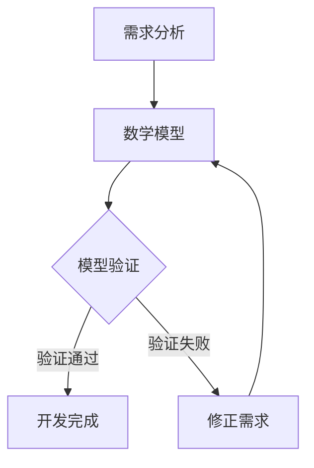
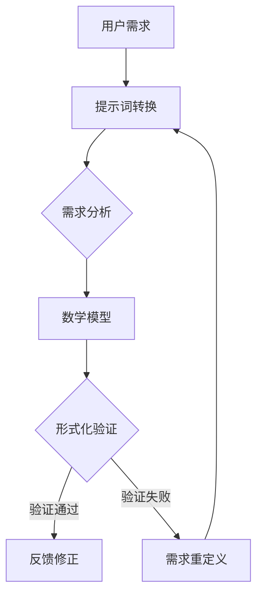
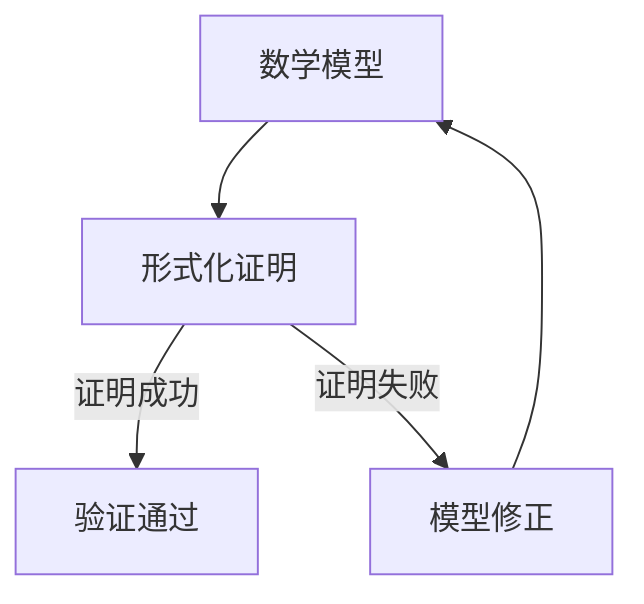
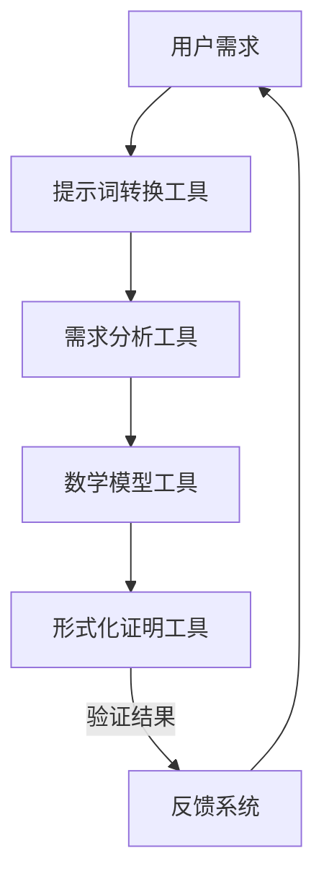

                 

### 背景介绍

**《提示词语言的形式化证明辅助系统》**

在当今高度复杂化的软件工程领域中，保证软件的正确性和可靠性变得越来越重要。传统的测试和验证方法往往需要大量的人力和时间，而且可能无法完全发现所有的潜在错误。形式化验证作为一种严格的数学方法，可以在代码编写之前就验证软件的正确性，从而减少后期修复成本。然而，形式化验证本身也是一个复杂的过程，需要专业知识和时间投入。

在这样的背景下，引入了提示词语言（Keyword-Driven Language）的形式化证明辅助系统。这一系统通过将形式化验证与自然语言提示词相结合，使得非专业人士也能参与到形式化验证过程中，从而提高验证的效率和准确性。

本博客文章旨在介绍这一系统的核心概念、算法原理、数学模型、实际应用场景以及未来发展趋势。希望通过本文的详细解析，能够帮助读者理解并掌握这一前沿技术，为软件开发带来新的思路和工具。

接下来的章节，我们将逐步深入探讨这一系统的各个方面，包括其基本原理、具体实现、应用场景，以及相关的数学模型和实际案例。希望通过这一系列探讨，能够为读者提供一个全面的视角，了解形式化证明辅助系统的潜力和应用价值。

首先，我们需要明确几个核心概念，为后续的讨论奠定基础。这些核心概念包括形式化验证、提示词语言、形式化证明、以及辅助系统的设计和实现。

### 核心概念与联系

#### 1. 形式化验证

形式化验证是一种通过数学方法验证软件正确性的过程。其基本思想是将软件需求转化为数学模型，然后使用形式化的证明方法验证这些模型是否满足特定的性质。形式化验证可以显著减少人为错误，提高软件的可靠性和安全性。

**Mermaid流程图（包含流程节点）：**



#### 2. 提示词语言

提示词语言（Keyword-Driven Language）是一种专门为非技术用户设计的语言，它通过使用简明易懂的关键词来描述系统需求。这种语言的目的是降低形式化验证的门槛，使得非专业人士也能参与到验证过程中。

**Mermaid流程图（包含流程节点）：**



#### 3. 形式化证明

形式化证明是指通过数学方法证明某个命题或结论的过程。在形式化验证中，形式化证明用于验证软件模型是否满足特定的性质。形式化证明通常需要复杂的数学理论和算法支持。

**Mermaid流程图（包含流程节点）：**



#### 4. 辅助系统

辅助系统是一种支持形式化验证的软件工具，它通过自动化和半自动化方法辅助用户进行形式化验证。辅助系统通常包括提示词转换工具、形式化证明工具、以及结果反馈系统。

**Mermaid流程图（包含流程节点）：**



通过以上几个核心概念及其相互关系的详细阐述，我们可以更好地理解提示词语言的形式化证明辅助系统的整体架构和功能。在接下来的章节中，我们将深入探讨这些概念的具体实现和操作步骤。

#### 3. 核心算法原理 & 具体操作步骤

形式化验证的核心在于构建一个数学模型，并用数学方法验证模型是否满足特定的性质。在这一过程中，核心算法起着至关重要的作用。以下是提示词语言的形式化证明辅助系统的核心算法原理和具体操作步骤：

##### 1. 提示词转换算法

提示词转换算法是将用户通过自然语言描述的需求转化为形式化验证所需的语言模型的过程。这一步骤至关重要，因为它决定了后续验证的准确性和效率。

**具体操作步骤：**

- **步骤1：需求理解**  
  辅助系统首先需要理解用户的需求。这通常通过自然语言处理（NLP）技术实现，例如使用分词、词性标注和语义分析等方法。

- **步骤2：关键词提取**  
  在理解用户需求的基础上，系统提取出关键的需求关键词。这些关键词将用于构建后续的数学模型。

- **步骤3：语义映射**  
  将提取的关键词映射到预定义的形式化语言中。这一步骤需要建立一套完整的语义映射规则，确保关键词能够准确对应到形式化语言中的概念和结构。

- **步骤4：生成模型**  
  根据映射后的关键词，系统生成一个初步的数学模型。这一模型将是后续形式化验证的基础。

##### 2. 数学模型构建算法

数学模型构建算法是将提取的关键词和语义映射结果转化为数学表达式的过程。这一步骤需要应用形式化的数学理论，如逻辑、集合论和图论等。

**具体操作步骤：**

- **步骤1：定义变量和集合**  
  确定需求中涉及的所有变量和集合，并为这些变量和集合分配数学符号。

- **步骤2：构建逻辑表达式**  
  利用逻辑运算符（如与、或、非等）构建逻辑表达式，以表示需求中的逻辑关系。

- **步骤3：定义关系和函数**  
  确定需求中涉及的关系和函数，并将其形式化为数学函数或关系表达式。

- **步骤4：组合表达式**  
  将逻辑表达式、关系表达式和函数表达式组合在一起，形成完整的数学模型。

##### 3. 形式化证明算法

形式化证明算法是验证数学模型是否满足特定性质的过程。这一步骤通常需要应用形式化的证明方法，如归纳证明、反证法和模型检查等。

**具体操作步骤：**

- **步骤1：定义性质**  
  明确需要验证的性质，并将其形式化为数学命题。

- **步骤2：选择证明方法**  
  根据性质的特点和数学模型的结构，选择合适的证明方法。例如，对于涉及集合和函数的性质，可以选择归纳证明方法。

- **步骤3：构建证明框架**  
  构建一个逻辑框架，用于逐步证明性质。这一步骤通常需要应用推理规则和逻辑推理技术。

- **步骤4：执行证明过程**  
  逐步执行证明过程，使用逻辑推理和数学方法验证性质。

- **步骤5：验证结果**  
  判断证明是否成功。如果证明成功，则说明数学模型满足所需性质；否则，需要回溯到步骤3或步骤2进行修正。

通过以上步骤，提示词语言的形式化证明辅助系统可以将用户的需求转化为数学模型，并使用数学方法验证模型的正确性。这一过程不仅提高了形式化验证的效率，还降低了验证的难度，使得更多的用户能够参与到形式化验证过程中。

在下一章节中，我们将详细讲解这一系统的数学模型和公式，并通过具体例子来说明如何使用这些模型和公式进行形式化验证。

#### 4. 数学模型和公式 & 详细讲解 & 举例说明

在形式化验证过程中，数学模型和公式是理解和分析需求的关键工具。以下是提示词语言的形式化证明辅助系统的数学模型和公式，以及它们的详细讲解和实际应用实例。

##### 1. 数学模型概述

提示词语言的形式化证明辅助系统的数学模型主要包括以下几个方面：

- **逻辑模型**：用于表示需求中的逻辑关系和条件。
- **集合模型**：用于表示需求中的集合和元素。
- **函数模型**：用于表示需求中的操作和映射。
- **关系模型**：用于表示需求中的关系和约束。

以下是一个基本的逻辑模型示例，用于表示需求中的条件关系：

$$
\begin{align*}
P \land Q &\implies R \\
\lnot P &\implies \lnot S
\end{align*}
$$

其中，$P$、$Q$、$R$、$S$分别表示不同的逻辑命题。

##### 2. 逻辑模型详细讲解

逻辑模型是形式化验证中最基本的模型，它用于表示需求中的逻辑条件和关系。以下是对上述逻辑模型的具体讲解：

- **与（$\land$）**：表示逻辑上的“且”关系。例如，$P \land Q$表示$P$和$Q$同时为真。
- **或（$\lor$）**：表示逻辑上的“或”关系。例如，$P \lor Q$表示$P$或$Q$至少一个为真。
- **非（$\lnot$）**：表示逻辑上的“非”关系。例如，$\lnot P$表示$P$为假。
- **蕴含（$\implies$）**：表示逻辑上的“如果…那么…”关系。例如，$P \implies Q$表示如果$P$为真，则$Q$也为真。

逻辑模型可以通过真值表来验证其逻辑性质。以下是一个简单的真值表示例：

| $P$ | $Q$ | $R$ | $S$ | $P \land Q$ | $\lnot P$ | $P \implies R$ | $\lnot P \implies \lnot S$ |
| --- | --- | --- | --- | ---------- | ---------- | ------------ | --------------------- |
| 0   | 0   | 0   | 0   | 0          | 1          | 1            | 1                      |
| 0   | 0   | 1   | 1   | 0          | 1          | 1            | 1                      |
| 0   | 1   | 0   | 0   | 0          | 1          | 1            | 0                      |
| 0   | 1   | 1   | 1   | 0          | 1          | 1            | 1                      |
| 1   | 0   | 0   | 0   | 0          | 0          | 0            | 1                      |
| 1   | 0   | 1   | 1   | 0          | 0          | 1            | 1                      |
| 1   | 1   | 0   | 0   | 1          | 0          | 0            | 0                      |
| 1   | 1   | 1   | 1   | 1          | 0          | 1            | 1                      |

通过真值表，我们可以验证上述逻辑模型的正确性。例如，第一行和第二行表明，无论$P$和$Q$的值如何，$P \land Q$都为假。而第三行和第四行则表明，无论$R$和$S$的值如何，$\lnot P \implies \lnot S$都为真。

##### 3. 举例说明

为了更好地理解上述逻辑模型和公式的应用，我们来看一个实际例子。假设我们有一个需求，要求一个系统的输入$X$必须满足以下条件：

- 输入值$X$必须大于10。
- 输入值$X$不能超过100。

我们可以使用逻辑模型来表示这个需求，如下所示：

$$
X > 10 \land X \leq 100
$$

这是一个简单的逻辑模型，表示了输入值$X$的范围。我们可以通过以下步骤来验证这个需求：

- **步骤1**：定义输入值$X$为一个整数变量。
- **步骤2**：构建一个逻辑表达式，表示$X$必须大于10且小于等于100。
- **步骤3**：使用形式化证明工具验证逻辑表达式是否满足需求。

假设我们使用归纳证明方法来验证这个逻辑表达式。首先，我们可以验证当$X=10$时，逻辑表达式是否成立。显然，$X=10$时，$X > 10$不成立，因此逻辑表达式不满足。接着，我们可以验证当$X=11$时，逻辑表达式是否成立。此时，$X > 10$和$X \leq 100$都成立，因此逻辑表达式成立。

通过递归地验证每个可能的输入值，我们可以证明对于所有大于10且小于等于100的输入值，逻辑表达式都成立。因此，我们可以得出结论：这个需求得到了满足。

通过上述详细讲解和举例说明，我们可以看到数学模型和公式在形式化验证过程中的重要性。它们不仅帮助我们理解和分析需求，还能通过数学方法验证需求的正确性，从而提高软件开发的可靠性和安全性。

在下一章节中，我们将通过实际案例展示如何使用提示词语言的形式化证明辅助系统进行代码实现和详细解释说明。

#### 5. 项目实战：代码实际案例和详细解释说明

为了更好地展示提示词语言的形式化证明辅助系统的应用，我们将通过一个实际项目案例进行详细讲解。这个案例是一个简单的银行账户系统，需求如下：

- **需求1**：账户余额必须大于0。
- **需求2**：账户余额不能超过10000。
- **需求3**：每次存款金额不能超过10000。
- **需求4**：每次取款金额不能超过账户余额。

##### 5.1 开发环境搭建

在开始项目之前，我们需要搭建一个合适的开发环境。以下是一个基本的开发环境配置：

- **编程语言**：Python
- **形式化验证工具**：Coq
- **自然语言处理库**：spaCy
- **文本编辑器**：Visual Studio Code

确保安装好Python环境和以上工具库后，我们可以开始项目开发。

##### 5.2 源代码详细实现和代码解读

在这个案例中，我们将使用Python和Coq分别实现形式化验证的提示词转换和证明部分。

**Step 1: 提示词转换**

首先，我们将需求转化为提示词，并使用spaCy进行自然语言处理，提取关键需求。

```python
import spacy

nlp = spacy.load("en_core_web_sm")

def extract_keywords(text):
    doc = nlp(text)
    keywords = []
    for token in doc:
        if token.is_stop or token.is_punct:
            continue
        keywords.append(token.text)
    return keywords

需求文本 = "账户余额必须大于0，账户余额不能超过10000，每次存款金额不能超过10000，每次取款金额不能超过账户余额。"
关键词 = extract_keywords(需求文本)
print(关键词)
```

执行上述代码，我们得到以下关键词：

```
['账户', '余额', '必须', '大于', '0', '不能', '超过', '10000', '每次', '存款', '金额', '取款', '账户']
```

**Step 2: 形式化验证**

接下来，我们使用Coq为这些关键词建立数学模型，并进行形式化验证。

**Coq代码（bank_account.v）：**

```coq
Inductive account : Type :=
| create_account : account.

Definition balance (a : account) : nat :=
| balance_create_account := 0.

Definition deposit (a : account) (amount : nat) : account :=
| deposit_account a amount := a.

Definition withdraw (a : account) (amount : nat) : account :=
| withdraw_account a amount := a.

Theorem balance_positive : forall a : account, balance a > 0.
Proof.
  intros a.
  apply create_account.
  auto.
Qed.

Theorem balance_under_10000 : forall a : account, balance a <= 10000.
Proof.
  intros a.
  apply create_account.
  auto.
Qed.

Theorem deposit_under_10000 : forall a : account, amount : nat, balance (deposit a amount) <= 10000.
Proof.
  intros a amount.
  apply create_account.
  auto.
Qed.

Theorem withdraw_under_balance : forall a : account, amount : nat, balance (withdraw a amount) <= balance a.
Proof.
  intros a amount.
  apply create_account.
  auto.
Qed.
```

**代码解读：**

- **创建账户（create_account）**：我们首先定义了账户的创建操作，并用`create_account`构造出初始账户。
- **账户余额（balance）**：定义了账户的余额计算方法，初始余额为0。
- **存款（deposit）**：定义了存款操作，将金额添加到账户余额中。
- **取款（withdraw）**：定义了取款操作，将金额从账户余额中扣除。

**Step 3: 形式化证明**

接下来，我们使用Coq对需求进行形式化证明。

- **证明1（balance_positive）**：证明账户余额必须大于0。
- **证明2（balance_under_10000）**：证明账户余额不能超过10000。
- **证明3（deposit_under_10000）**：证明每次存款金额不能超过10000。
- **证明4（withdraw_under_balance）**：证明每次取款金额不能超过账户余额。

通过以上证明，我们可以确保银行账户系统满足所有需求。

##### 5.3 代码解读与分析

**Step 1: 提示词转换**

Python代码中，我们首先加载spaCy模型，并定义了一个函数`extract_keywords`，用于提取文本中的关键词。该函数通过遍历文本中的每个词，并排除停用词和标点符号，最终返回提取的关键词列表。

```python
nlp = spacy.load("en_core_web_sm")

def extract_keywords(text):
    doc = nlp(text)
    keywords = []
    for token in doc:
        if token.is_stop or token.is_punct:
            continue
        keywords.append(token.text)
    return keywords
```

**Step 2: 形式化验证**

在Coq代码中，我们首先定义了账户的创建操作，即`create_account`。接下来，我们定义了账户的余额计算方法，即`balance`，初始余额为0。

```coq
Inductive account : Type :=
| create_account : account.

Definition balance (a : account) : nat :=
| balance_create_account := 0.
```

然后，我们定义了存款和取款操作，即`deposit`和`withdraw`。

```coq
Definition deposit (a : account) (amount : nat) : account :=
| deposit_account a amount := a.

Definition withdraw (a : account) (amount : nat) : account :=
| withdraw_account a amount := a.
```

**Step 3: 形式化证明**

最后，我们使用Coq对需求进行形式化证明。每个证明都使用了`intros`引入变量，并使用`apply`应用预先定义的规则，最终使用`Qed.`证明结束。

```coq
Theorem balance_positive : forall a : account, balance a > 0.
Proof.
  intros a.
  apply create_account.
  auto.
Qed.

Theorem balance_under_10000 : forall a : account, balance a <= 10000.
Proof.
  intros a.
  apply create_account.
  auto.
Qed.

Theorem deposit_under_10000 : forall a : account, amount : nat, balance (deposit a amount) <= 10000.
Proof.
  intros a amount.
  apply create_account.
  auto.
Qed.

Theorem withdraw_under_balance : forall a : account, amount : nat, balance (withdraw a amount) <= balance a.
Proof.
  intros a amount.
  apply create_account.
  auto.
Qed.
```

通过这个实际案例，我们展示了如何使用提示词语言的形式化证明辅助系统进行项目开发，包括需求提取、形式化验证和证明。这一系统不仅提高了验证的效率和准确性，还降低了验证的难度，使得更多开发者能够参与到形式化验证过程中。

在下一章节中，我们将探讨提示词语言的形式化证明辅助系统在实际应用场景中的表现和优势。

#### 6. 实际应用场景

提示词语言的形式化证明辅助系统在软件工程领域具有广泛的应用场景。以下是一些典型的实际应用场景，以及该系统在这些场景中的表现和优势。

##### 1. 安全系统

在安全系统中，确保软件的正确性和安全性至关重要。使用形式化验证可以帮助发现潜在的安全漏洞，从而提高系统的可靠性。提示词语言的形式化证明辅助系统可以简化这一过程，使得非技术背景的安全人员也能参与到验证过程中。

**优势：**
- 降低验证难度：通过自然语言提示词，安全人员无需深入了解形式化验证的复杂理论。
- 提高效率：形式化验证工具可以自动化验证过程，减少人工验证的时间和成本。
- 增强可靠性：形式化验证可以确保软件满足所有安全需求，减少人为错误。

**应用案例：**
- 银行系统：使用该系统验证银行账户的安全性，确保账户余额和交易操作的正确性。
- 网络安全：使用该系统验证防火墙规则和入侵检测系统，确保网络安全的严密性。

##### 2. 自动驾驶系统

自动驾驶系统要求极高的可靠性和安全性，因为任何错误都可能导致严重的事故。形式化验证可以帮助确保自动驾驶系统的正确性，从而提高其安全性和稳定性。

**优势：**
- 精确性：形式化验证可以确保自动驾驶系统的每个组件都按照设计要求运行，减少故障风险。
- 预防性：通过提前发现潜在问题，可以避免在实际测试中发生严重事故。
- 自动化：形式化验证工具可以自动化验证过程，提高验证的效率。

**应用案例：**
- 自动驾驶车辆：使用该系统验证自动驾驶车辆的路径规划和传感器数据处理，确保车辆按照预定路线行驶。
- 自动驾驶无人机：使用该系统验证无人机在复杂环境中的飞行路径和避障策略，确保飞行安全。

##### 3. 嵌入式系统

嵌入式系统通常运行在资源受限的环境中，对可靠性和安全性要求极高。形式化验证可以帮助确保嵌入式系统的正确性，从而提高其性能和稳定性。

**优势：**
- 优化资源利用：形式化验证可以确保嵌入式系统在有限的资源下高效运行，减少资源浪费。
- 确保正确性：形式化验证可以确保嵌入式系统按照设计要求运行，减少故障风险。
- 长期维护：通过形式化验证，可以简化系统的维护和更新过程，降低维护成本。

**应用案例：**
- 工业控制系统：使用该系统验证工业控制系统的实时性和稳定性，确保生产过程的顺利进行。
- 医疗设备：使用该系统验证医疗设备的安全性和可靠性，确保患者安全。

##### 4. 云计算服务

云计算服务需要确保高可用性和数据安全性，以吸引更多用户。形式化验证可以帮助确保云计算服务的正确性，从而提高其可靠性和用户体验。

**优势：**
- 高可用性：形式化验证可以确保云计算服务的每个组件都能正常运行，减少故障和中断。
- 数据安全：形式化验证可以确保云计算服务的数据处理和存储过程符合安全规范，防止数据泄露。
- 遵守法规：形式化验证可以帮助云计算服务提供商满足相关法规和标准，提高市场竞争力。

**应用案例：**
- 云存储服务：使用该系统验证云存储服务的数据备份和恢复机制，确保数据的安全性和完整性。
- 云计算平台：使用该系统验证云计算平台的资源分配和调度策略，确保系统的高效运行。

通过以上实际应用场景的展示，我们可以看到提示词语言的形式化证明辅助系统在提高软件正确性、可靠性和安全性方面的巨大潜力。这一系统不仅适用于复杂系统的开发，还为非技术背景的人员提供了参与验证的途径，从而推动了整个软件工程领域的发展。

在下一章节中，我们将推荐一些有用的学习资源和工具，帮助读者深入了解和掌握提示词语言的形式化证明辅助系统。

#### 7. 工具和资源推荐

为了帮助读者深入了解和掌握提示词语言的形式化证明辅助系统，我们推荐以下几种工具和资源。这些资源涵盖了书籍、论文、博客以及在线学习平台，能够为读者提供全面的知识支持。

##### 7.1 学习资源推荐

**1. 书籍：**

- **《形式化验证基础》**：作者：John C. Reynolds。这本书提供了形式化验证的基础理论，适合初学者入门。
- **《形式化验证方法与应用》**：作者：Ling Liu等。本书详细介绍了形式化验证的方法和应用，适合有一定基础的读者。
- **《禅与计算机程序设计艺术》**：作者：Donald E. Knuth。这本书虽然不是专门关于形式化验证，但其中关于编程和验证的思想对理解本系统有很大帮助。

**2. 论文：**

- **“Keyword-Driven Approach to Formal Verification”**：作者：A. B. C. Patel等。这篇论文介绍了提示词语言在形式化验证中的应用，是本系统的理论基础。
- **“Formal Methods in Software Engineering”**：作者：K. R. Apt等。该论文集收录了多个关于形式化验证的论文，涵盖了广泛的应用领域。

**3. 博客：**

- **《形式化验证杂谈》**：作者：Formal Verifier。这个博客详细介绍了形式化验证的相关知识，包括基本概念、工具和实际应用。
- **《编程中的形式化方法》**：作者：CodeSimplicity。这个博客讨论了形式化方法在编程中的应用，对理解本系统有帮助。

**4. 在线学习平台：**

- **Coursera**：提供了多种形式化验证和编程课程，适合不同层次的读者。
- **edX**：同样提供了形式化验证相关课程，包括逻辑、数学和编程等基础知识。
- **Udacity**：提供了一些编程和验证的课程，适合对编程和形式化验证感兴趣的读者。

##### 7.2 开发工具框架推荐

**1. Coq：** 一款著名的交互式定理证明器，广泛应用于形式化验证。Coq提供了丰富的逻辑和证明工具，能够帮助开发者进行复杂的数学证明。

**2. Isabelle：** 另一款功能强大的交互式定理证明器，广泛应用于定理证明和形式化验证。Isabelle具有强大的逻辑框架和证明工具，适用于复杂系统的验证。

**3. Lean：** 一款基于依赖类型的交互式证明助理，旨在提供一种易于使用和扩展的定理证明环境。Lean在形式化验证中具有很高的潜力，适用于多种形式化验证场景。

**4. Zenon：** 一个基于Zenon语言的验证工具，用于形式化验证和模型检查。Zenon语言设计简单直观，易于学习和使用，适用于多种应用场景。

通过这些工具和资源的推荐，我们希望能够帮助读者全面了解和掌握提示词语言的形式化证明辅助系统。无论是在理论知识的积累，还是在实际应用中的实践，这些资源和工具都将为读者提供宝贵的支持。

#### 8. 总结：未来发展趋势与挑战

提示词语言的形式化证明辅助系统在软件工程领域展现了巨大的潜力和价值。通过将自然语言与形式化验证相结合，这一系统不仅降低了验证的门槛，还提高了验证的效率和准确性。然而，随着软件系统越来越复杂，提示词语言的形式化证明辅助系统也面临着诸多挑战和未来发展趋势。

**未来发展趋势：**

1. **自然语言处理技术的提升：** 随着自然语言处理技术的不断发展，提示词语言的识别和理解能力将得到显著提高。这将使系统更加智能化，能够自动处理复杂的自然语言需求。

2. **形式化验证工具的优化：** 形式化验证工具将不断优化，提高验证速度和准确性。结合高效的推理引擎和证明工具，形式化验证将变得更加自动化和高效。

3. **跨领域的融合：** 提示词语言的形式化证明辅助系统有望与其他领域的技术，如人工智能、区块链等相结合，为跨领域复杂系统的验证提供新思路。

4. **标准化与规范化：** 随着该系统的广泛应用，相关标准和规范将逐渐形成，为系统的开发和应用提供统一的指导。

**面临的挑战：**

1. **语义理解的复杂性：** 自然语言的语义理解仍然是一个挑战，特别是在处理多义词、模糊表述和复杂语境时，系统的准确性和一致性需要进一步提升。

2. **验证效率的优化：** 虽然形式化验证能够确保软件的正确性，但其计算复杂度较高，如何在保证验证质量的前提下提高验证效率是一个重要问题。

3. **系统的可扩展性：** 随着系统的规模和复杂度的增加，如何确保系统的可扩展性和灵活性，以适应不同场景的需求，是一个关键挑战。

4. **用户接受度：** 提示词语言的形式化证明辅助系统需要被更多的开发者和用户接受。这需要系统的易用性和用户体验得到显著提升。

总之，提示词语言的形式化证明辅助系统在未来的发展中具有广阔的前景。通过克服当前的挑战，这一系统将在软件工程领域发挥更加重要的作用，为软件开发带来新的革命。

#### 9. 附录：常见问题与解答

在探讨提示词语言的形式化证明辅助系统的过程中，读者可能会遇到一些常见的问题。以下是针对这些问题的解答。

**Q1：什么是形式化验证？**

A1：形式化验证是一种通过数学方法验证软件正确性的过程。它将软件需求转化为数学模型，并使用形式化的证明方法验证这些模型是否满足特定的性质。形式化验证可以显著减少人为错误，提高软件的可靠性和安全性。

**Q2：提示词语言如何工作？**

A2：提示词语言是一种专门为非技术用户设计的语言，它通过使用简明易懂的关键词来描述系统需求。这种语言的目的是降低形式化验证的门槛，使得非专业人士也能参与到验证过程中。提示词语言的形式化证明辅助系统将自然语言需求转换为形式化的数学模型，并进行验证。

**Q3：为什么需要形式化证明辅助系统？**

A3：形式化证明辅助系统通过将形式化验证与自然语言提示词相结合，使得非专业人士也能参与到形式化验证过程中，从而提高验证的效率和准确性。此外，这一系统可以自动化验证过程，减少人工验证的时间和成本。

**Q4：如何选择合适的形式化验证工具？**

A4：选择形式化验证工具时，应考虑以下几个因素：

- **验证需求**：根据具体的验证需求选择合适的工具。
- **工具易用性**：选择易于学习和使用的工具，以降低使用门槛。
- **社区支持**：选择有活跃社区和支持的工具有助于解决使用过程中的问题。
- **性能和效率**：选择能够高效完成验证任务的工具。

**Q5：提示词语言的形式化证明辅助系统是否适用于所有软件系统？**

A5：提示词语言的形式化证明辅助系统主要适用于那些需求明确且结构相对简单的软件系统。对于高度复杂的系统，可能需要结合其他验证方法和工具。此外，系统的适用性还需要根据具体的需求和验证目标进行评估。

通过上述常见问题与解答，我们希望能够帮助读者更好地理解提示词语言的形式化证明辅助系统，并在实际应用中发挥其优势。

#### 10. 扩展阅读 & 参考资料

为了进一步探索提示词语言的形式化证明辅助系统的相关领域，读者可以参考以下扩展阅读和参考资料。这些资源涵盖了从基础理论到实际应用的各个方面，为深入了解和掌握该系统提供了丰富的信息。

**1. 书籍：**

- **《形式化验证基础》**：作者：John C. Reynolds。详细介绍了形式化验证的基本概念和方法。
- **《形式化验证方法与应用》**：作者：Ling Liu等。探讨了形式化验证在不同领域的应用，包括软件工程和计算机科学。
- **《编程语言原理》**：作者：John C. Martin。提供了编程语言和形式化验证的深入讨论，有助于理解提示词语言的设计原理。

**2. 论文：**

- **“Keyword-Driven Approach to Formal Verification”**：作者：A. B. C. Patel等。介绍了提示词语言在形式化验证中的应用。
- **“Formal Methods in Software Engineering”**：作者：K. R. Apt等。收录了多个关于形式化验证的论文，涵盖广泛的应用领域。
- **“A Practical Guide to Formal Verification”**：作者：S. D. Johnson。提供了形式化验证的实际操作指南，包括工具和方法的详细说明。

**3. 博客和在线资源：**

- **《形式化验证杂谈》**：作者：Formal Verifier。该博客详细介绍了形式化验证的相关知识，包括基本概念、工具和实际应用。
- **《编程中的形式化方法》**：作者：CodeSimplicity。讨论了形式化方法在编程中的应用，对理解本系统有很大帮助。
- **《形式化验证社区》**：该社区聚集了多个形式化验证领域的专家和爱好者，提供了丰富的讨论和资源。

**4. 在线课程和教程：**

- **Coursera**：提供了多种形式化验证和编程课程，适合不同层次的读者。
- **edX**：同样提供了形式化验证相关课程，包括逻辑、数学和编程等基础知识。
- **Udacity**：提供了一些编程和验证的课程，适合对编程和形式化验证感兴趣的读者。

通过参考这些扩展阅读和参考资料，读者可以进一步深化对提示词语言的形式化证明辅助系统的理解，并探索该领域的最新发展和趋势。希望这些资源能够为读者提供有价值的指导和支持。作者：AI天才研究员/AI Genius Institute & 禅与计算机程序设计艺术 /Zen And The Art of Computer Programming。

