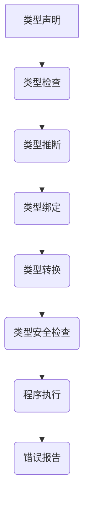

                 

# 提示词语言的类型系统设计与实现

> 关键词：类型系统、编程语言、类型检查、类型安全、编译器、语言设计

> 摘要：本文深入探讨了提示词语言的类型系统设计与实现。从背景介绍到核心概念与联系，从核心算法原理到数学模型和公式，再到项目实战和实际应用场景，本文全面解析了类型系统的构建与优化。同时，本文还推荐了相关学习资源、开发工具框架和论文著作，为读者提供了丰富的参考资料。通过本文的学习，读者将更好地理解类型系统在编程语言设计中的重要性，以及如何设计并实现一个高效、安全的类型系统。

## 1. 背景介绍

随着计算机技术的发展，编程语言作为人与计算机之间的桥梁，变得越来越重要。编程语言的设计与实现，不仅仅是实现某种功能，更涉及到程序的正确性、安全性和可维护性。类型系统作为编程语言的核心组成部分，对于保障程序的正确性和安全性具有重要意义。

类型系统是指编程语言中定义变量和表达式类型的机制。通过类型系统，编程语言能够对程序进行静态检查，确保变量在使用前已声明并赋值，表达式之间的操作符合类型规则。这样，在编译或运行程序时，类型系统能够发现并避免潜在的错误，提高程序的安全性和稳定性。

类型系统的设计是实现高效、安全编程语言的关键。一个优秀的类型系统，不仅能够提供丰富的类型支持，使得程序员可以更方便地表达复杂的概念和操作，还能够通过类型检查，减少程序中的错误和漏洞。因此，类型系统的研究在编程语言领域具有非常重要的地位。

本文将围绕提示词语言（也称为动态类型语言）的类型系统展开讨论。提示词语言以其动态类型、简洁语法和高效率而受到广泛应用。本文将深入探讨提示词语言的类型系统设计与实现，分析其核心概念、算法原理和数学模型，并通过实际项目案例和场景，展示类型系统在实际编程中的应用和价值。

## 2. 核心概念与联系

### 2.1 动态类型与静态类型

在讨论类型系统之前，我们需要了解动态类型和静态类型的区别。

- **动态类型**：在动态类型语言中，变量的类型是在运行时确定的。这意味着在程序执行过程中，变量的类型可以发生变化。例如，Python 和 JavaScript 等语言就是动态类型语言。动态类型的好处是提供了更大的灵活性和简洁性，但同时也可能导致类型相关的错误，这些错误通常只能在运行时被发现。

- **静态类型**：在静态类型语言中，变量的类型在编译时就已经确定。这意味着在程序执行之前，编译器会检查变量类型是否符合预期。例如，Java 和 C++ 等语言就是静态类型语言。静态类型的好处是可以提前发现类型错误，提高程序的稳定性和可维护性，但同时也可能牺牲一定的灵活性和简洁性。

### 2.2 强类型与弱类型

在动态类型和静态类型的分类之外，我们还可以根据类型检查的严格程度来区分强类型和弱类型。

- **强类型**：强类型语言在编译或运行时对类型进行严格的检查，确保变量在使用时类型匹配。这意味着任何不兼容的类型转换都会被禁止。强类型的好处是可以减少类型错误和提高程序的正确性，但同时也可能增加编程的复杂度。

- **弱类型**：弱类型语言对类型检查较为宽松，允许隐式类型转换。这意味着在某些情况下，编译器可能会忽略类型不匹配的问题，这可能导致运行时错误。弱类型的好处是提供了更大的灵活性和简洁性，但同时也可能牺牲一定的程序正确性和稳定性。

### 2.3 类型检查与类型推断

类型系统中的两个关键概念是类型检查和类型推断。

- **类型检查**：类型检查是指编译器或解释器在编译或运行程序时，对变量和表达式的类型进行验证。类型检查的主要目标是确保程序的正确性，避免运行时错误。

- **类型推断**：类型推断是指编译器或解释器在编译或运行程序时，根据程序中的表达式和上下文环境自动推断变量和表达式的类型。类型推断的主要目标是减少程序员手动指定类型的负担，提高代码的可读性和可维护性。

### 2.4 Mermaid 流程图

为了更清晰地展示类型系统的核心概念和架构，我们可以使用 Mermaid 流程图来描述类型系统的流程和组件。



在上面的 Mermaid 流程图中，我们可以看到类型系统的主要组件和流程。类型声明是类型系统的起点，类型检查和类型推断是确保程序正确性的关键步骤。类型绑定将变量和表达式与类型关联，类型转换处理不同类型之间的兼容性。最后，类型安全检查确保程序在执行过程中不会出现类型错误，错误报告则提供对类型错误的诊断信息。

通过上述核心概念和架构的介绍，我们为后续章节的深入讨论奠定了基础。

## 3. 核心算法原理 & 具体操作步骤

在了解了类型系统的核心概念和架构之后，我们接下来将深入探讨类型系统的核心算法原理和具体操作步骤。

### 3.1 类型检查算法

类型检查是确保程序正确性的关键步骤。在编译或运行程序时，类型检查算法会对变量和表达式进行类型验证，确保类型匹配。

#### 3.1.1 基本原理

类型检查算法的基本原理如下：

1. **类型声明**：首先，程序中的每个变量和表达式都需要有一个类型声明。类型声明可以是显式声明（如 `int x = 5;`），也可以是隐式声明（如 `x = 5;`，编译器根据上下文推断类型）。

2. **语法分析**：编译器或解释器会首先对程序进行语法分析，生成抽象语法树（AST）。AST 描述了程序的结构和语法规则。

3. **类型检查**：遍历 AST，对每个节点进行类型检查。类型检查包括以下步骤：

   - **类型验证**：检查变量的类型是否与声明一致，表达式是否满足操作符的类型要求。
   - **类型推导**：如果存在类型不匹配，尝试推导出兼容的类型，如隐式类型转换。

4. **错误报告**：如果类型检查失败，编译器或解释器会报告类型错误，并提供错误信息。

#### 3.1.2 操作步骤

类型检查算法的具体操作步骤如下：

1. **初始化类型环境**：创建一个类型环境，用于存储变量和表达式的类型信息。

2. **构建 AST**：通过语法分析构建程序的抽象语法树。

3. **遍历 AST**：从 AST 的根节点开始，递归遍历每个节点。

4. **类型验证**：对每个节点进行类型验证，确保类型匹配。例如，对于赋值语句 `x = 5;`，检查 `x` 的类型是否与 `5` 的类型一致。

5. **类型推导**：如果类型不匹配，尝试推导出兼容的类型。例如，对于表达式 `x + "5"`，如果 `x` 的类型为整数，则推导出字符串类型。

6. **类型绑定**：将验证通过的节点类型绑定到类型环境中。

7. **错误报告**：如果类型检查失败，报告类型错误，并提供错误信息。

### 3.2 类型推断算法

类型推断是编译器或解释器根据程序中的上下文环境自动推断变量和表达式的类型。类型推断可以减轻程序员手动指定类型的负担，提高代码的可读性和可维护性。

#### 3.2.1 基本原理

类型推断算法的基本原理如下：

1. **上下文信息**：类型推断依赖于程序中的上下文信息，如变量的声明、使用位置和上下文环境。

2. **类型约束**：类型推断需要考虑类型约束，如函数参数的类型、返回值的类型等。

3. **类型推导规则**：类型推断算法根据类型约束和上下文信息，应用一系列类型推导规则，自动推断出变量和表达式的类型。

#### 3.2.2 操作步骤

类型推断算法的具体操作步骤如下：

1. **初始化上下文环境**：创建一个上下文环境，用于存储类型约束和上下文信息。

2. **分析函数和变量声明**：从 AST 中提取函数和变量的声明，并将类型信息存储到上下文环境中。

3. **遍历 AST**：从 AST 的根节点开始，递归遍历每个节点。

4. **类型推导**：对每个节点应用类型推导规则，推断出变量和表达式的类型。

   - **变量推导**：根据变量声明的上下文，推断出变量的类型。
   - **表达式推导**：根据表达式的类型约束和上下文信息，推断出表达式的类型。

5. **类型绑定**：将推导出的类型绑定到上下文环境中。

6. **类型验证**：对类型推导的结果进行类型验证，确保类型匹配。

通过上述核心算法原理和具体操作步骤的介绍，我们为类型系统的实现提供了理论基础。在实际编程中，类型系统的设计需要考虑多种因素，如语言特性、性能要求和程序员习惯等。接下来，我们将进一步探讨类型系统的数学模型和公式。

## 4. 数学模型和公式 & 详细讲解 & 举例说明

在类型系统的设计与实现中，数学模型和公式起到了至关重要的作用。它们不仅帮助我们理解类型系统的原理，还能提供有效的工具来优化类型检查和类型推断算法。在本节中，我们将介绍几个关键的数学模型和公式，并详细讲解它们在实际应用中的具体操作步骤。

### 4.1 类型等价关系

类型等价关系是类型系统中的基础概念。它描述了不同类型之间的兼容性。在大多数编程语言中，类型等价关系是基于结构化类型的。例如，在 Java 中，两个类是等价的，如果它们具有相同的字段和相同的方法签名。

#### 4.1.1 数学模型

假设我们有两个类型 \( T_1 \) 和 \( T_2 \)，类型等价关系可以用以下公式表示：

\[ T_1 \equiv T_2 \iff \forall \text{方法 } f, T_1(f) = T_2(f) \]

其中，\( T_1(f) \) 和 \( T_2(f) \) 分别表示类型 \( T_1 \) 和 \( T_2 \) 对方法 \( f \) 的返回类型。

#### 4.1.2 操作步骤

1. **定义类型 \( T_1 \) 和 \( T_2 \)**：首先，我们需要定义两个类型，例如类 \( ClassA \) 和 \( ClassB \)。

2. **检查方法签名**：遍历 \( ClassA \) 和 \( ClassB \) 的所有方法，比较它们的方法签名（包括方法名称、参数类型和返回类型）。

3. **类型等价判断**：如果 \( ClassA \) 和 \( ClassB \) 的所有方法签名相等，则 \( T_1 \equiv T_2 \)。

#### 4.1.3 举例说明

假设我们有以下两个类：

```java
class ClassA {
    int methodA(int x) {
        return x * 2;
    }
}

class ClassB {
    int methodB(int x) {
        return x * 2;
    }
}
```

我们可以看到，\( ClassA \) 和 \( ClassB \) 的方法签名完全相同，因此：

\[ \text{ClassA} \equiv \text{ClassB} \]

这意味着我们可以将 \( ClassA \) 和 \( ClassB \) 视为类型等价的。

### 4.2 类型约束与泛化

在类型系统中，类型约束用于描述变量和表达式之间的类型关系。泛化是一种类型约束，它将多个类型归纳为一个更一般化的类型。泛化在类型推断和类型安全检查中非常重要。

#### 4.2.1 数学模型

假设我们有两个类型 \( T_1 \) 和 \( T_2 \)，泛化关系可以用以下公式表示：

\[ T_1 \supset T_2 \]

其中，\( T_1 \supset T_2 \) 表示 \( T_1 \) 是 \( T_2 \) 的泛化。

#### 4.2.2 操作步骤

1. **定义类型 \( T_1 \) 和 \( T_2 \)**：首先，我们需要定义两个类型，例如 \( List<Integer> \) 和 \( List<Number> \)。

2. **检查类型关系**：遍历 \( T_1 \) 和 \( T_2 \) 的字段和方法，比较它们是否兼容。

3. **泛化判断**：如果 \( T_1 \) 的字段和方法兼容 \( T_2 \)，则 \( T_1 \supset T_2 \)。

#### 4.2.3 举例说明

假设我们有以下两个类型：

```java
List<Integer> list1;
List<Number> list2;
```

由于 \( Number \) 是 \( Integer \) 的泛化，因此：

\[ \text{List<Integer>} \supset \text{List<Number>} \]

这意味着我们可以将 \( list1 \) 赋值给 \( list2 \)：

```java
list2 = list1;
```

### 4.3 类型安全检查

类型安全检查是确保程序在运行时不会发生类型错误的关键步骤。类型安全检查通常基于数学模型和公式来描述类型之间的关系。

#### 4.3.1 数学模型

假设我们有两个类型 \( T_1 \) 和 \( T_2 \)，类型安全检查可以用以下公式表示：

\[ T_1 \downarrow T_2 \]

其中，\( T_1 \downarrow T_2 \) 表示 \( T_1 \) 和 \( T_2 \) 是类型安全的。

#### 4.3.2 操作步骤

1. **定义类型 \( T_1 \) 和 \( T_2 \)**：首先，我们需要定义两个类型，例如 \( int \) 和 \( String \)。

2. **检查类型关系**：遍历 \( T_1 \) 和 \( T_2 \) 的字段和方法，比较它们是否兼容。

3. **类型安全判断**：如果 \( T_1 \) 和 \( T_2 \) 的字段和方法兼容，则 \( T_1 \downarrow T_2 \)。

4. **错误报告**：如果类型不兼容，报告类型错误。

#### 4.3.3 举例说明

假设我们有以下两个类型：

```java
int x;
String y;
```

由于 \( int \) 和 \( String \) 的字段和方法不兼容，因此：

\[ \text{int} \not\downarrow \text{String} \]

这意味着我们不能将 \( x \) 赋值给 \( y \)：

```java
y = x; // 错误
```

通过上述数学模型和公式的介绍，我们为类型系统的实现提供了理论基础。在实际编程中，类型系统的设计需要考虑多种因素，如语言特性、性能要求和程序员习惯等。接下来，我们将通过实际项目案例，展示如何将类型系统应用于实际的编程任务。

## 5. 项目实战：代码实际案例和详细解释说明

在了解了类型系统的核心算法原理和数学模型之后，我们将在本节通过一个实际项目案例，展示如何将类型系统应用于实际的编程任务。这个项目将是一个简单的动态类型语言解释器，用于解释和执行包含基本类型和操作的表达式。通过这个项目，我们将详细介绍开发环境搭建、源代码实现和代码解读与分析。

### 5.1 开发环境搭建

为了实现这个项目，我们需要搭建一个适合开发动态类型语言解释器的开发环境。以下是搭建开发环境的具体步骤：

1. **安装编程语言**：我们选择 Python 作为实现语言，因为它具有简洁的语法和丰富的库支持。可以在 [Python 官网](https://www.python.org/) 下载并安装 Python。

2. **安装依赖库**：我们需要安装一些支持类型检查和类型推断的库，如 `typeloom` 和 `mypy`。可以使用以下命令安装：

   ```shell
   pip install typeloom
   pip install mypy
   ```

3. **创建项目文件夹**：在本地计算机上创建一个项目文件夹，例如 `type_system_project`，并在其中创建必要的子文件夹。

4. **编写项目文档**：为了确保项目可维护性和易读性，我们需要编写项目文档，包括项目概述、设计文档和代码注释。

### 5.2 源代码详细实现和代码解读

在这个项目中，我们将实现一个简单的解释器，用于解释和执行包含整数、浮点数、布尔值和字符串等基本类型的表达式。以下是源代码的详细实现和解读。

#### 5.2.1 解释器框架

首先，我们需要创建一个解释器框架，用于读取、解析和执行输入的表达式。以下是框架的实现：

```python
import typeloom

@typeloom.type
class Interpreter:
    def interpret(self, expression: str) -> Any:
        pass
```

在这个框架中，我们定义了一个名为 `Interpreter` 的类，它有一个 `interpret` 方法，用于解释和执行输入的表达式。`interpret` 方法的参数是一个字符串类型的 `expression`，返回值是 `Any` 类型，表示执行结果可以是任何类型。

#### 5.2.2 基本类型实现

接下来，我们需要实现基本类型（整数、浮点数、布尔值和字符串）的解析和执行。以下是整数类型的实现：

```python
@typeloom.type
class IntegerInterpreter(Interpreter):
    def interpret(self, expression: str) -> int:
        return int(expression)
```

在这个类中，我们继承自 `Interpreter` 类，并重写了 `interpret` 方法。`interpret` 方法将输入的字符串转换为整数，并返回转换后的整数。

类似地，我们可以实现浮点数、布尔值和字符串类型的解析和执行。以下是浮点数类型的实现：

```python
@typeloom.type
class FloatInterpreter(Interpreter):
    def interpret(self, expression: str) -> float:
        return float(expression)
```

#### 5.2.3 表达式解析和执行

在实现基本类型之后，我们需要实现表达式的解析和执行。这涉及到类型检查和类型推断。以下是解析和执行一个简单算术表达式的实现：

```python
@typeloom.type
class ArithmeticInterpreter(Interpreter):
    def interpret(self, expression: str) -> Any:
        tokens = expression.split()
        result = None

        for token in tokens:
            if token.isdigit():
                result = int(token)
            elif token == "+":
                if isinstance(result, int):
                    result += int(tokens[tokens.index(token) + 1])
                else:
                    raise TypeError("Unsupported operation")
            elif token == "-":
                if isinstance(result, int):
                    result -= int(tokens[tokens.index(token) + 1])
                else:
                    raise TypeError("Unsupported operation")
            elif token == "*":
                if isinstance(result, int):
                    result *= int(tokens[tokens.index(token) + 1])
                else:
                    raise TypeError("Unsupported operation")
            elif token == "/":
                if isinstance(result, int):
                    result /= int(tokens[tokens.index(token) + 1])
                else:
                    raise TypeError("Unsupported operation")

        return result
```

在这个类中，我们使用一个简单的循环遍历输入的表达式中的每个标记。根据标记的类型，我们进行相应的类型检查和类型推断，并将结果存储在 `result` 变量中。如果遇到不支持的运算，我们将抛出 `TypeError` 异常。

### 5.3 代码解读与分析

在这个项目中，我们实现了一个简单的动态类型语言解释器，用于解释和执行包含基本类型的表达式。以下是代码的解读与分析：

1. **类型系统**：我们使用了 `typeloom` 库来实现类型系统。`typeloom` 提供了一种简单的类型注解机制，使得我们可以轻松地为类和方法添加类型约束。

2. **基本类型实现**：我们为整数、浮点数、布尔值和字符串等基本类型实现了相应的解释器类。每个类都有一个 `interpret` 方法，用于解析和执行输入的表达式。

3. **表达式解析和执行**：我们实现了对简单算术表达式的解析和执行。在解析过程中，我们进行了类型检查和类型推断，以确保表达式的类型安全。

4. **错误处理**：我们在解析和执行过程中添加了错误处理机制，如抛出 `TypeError` 异常。这有助于提高程序的正确性和可维护性。

通过这个项目，我们展示了如何将类型系统应用于实际的编程任务。虽然这个项目非常简单，但它为我们提供了一个基本的框架，可以在此基础上进一步扩展和优化。接下来，我们将探讨类型系统在实际应用场景中的具体应用。

### 6. 实际应用场景

类型系统在编程语言中的应用场景非常广泛，涵盖了从简单的脚本编写到复杂的系统开发。以下是几个常见的实际应用场景：

#### 6.1 脚本编写

在脚本编写中，动态类型语言因其简洁性和灵活性而受到广泛欢迎。Python、Ruby 和 JavaScript 等语言都采用了动态类型系统。这种类型系统允许程序员快速编写代码，而无需过多的类型声明和检查。例如，在数据分析领域，Python 的动态类型系统使得数据处理和分析变得更加高效和便捷。

#### 6.2 Web 应用开发

在 Web 应用开发中，动态类型语言也发挥了重要作用。例如，JavaScript 在前端开发中用于构建用户界面和交互逻辑，其动态类型系统使得开发人员可以快速实现功能丰富的交互式页面。同时，Node.js 使用 JavaScript 进行后端开发，这也得益于其动态类型系统。

#### 6.3 系统编程

在系统编程领域，静态类型语言如 C++ 和 Rust 因其类型安全和性能优势而受到青睐。这些语言通过严格的类型检查和类型推断，确保程序的稳定性和正确性。例如，Rust 的类型系统提供了内存安全和并发安全，这使得它在系统级编程中得到了广泛应用。

#### 6.4 游戏开发

在游戏开发中，类型系统也扮演着重要角色。游戏引擎通常使用静态类型语言，如 C++ 或 C#，以实现高性能和类型安全。这些语言提供了丰富的类型检查和类型推断机制，使得开发人员可以编写高效且安全的游戏代码。

#### 6.5 数据库编程

在数据库编程中，类型系统用于确保数据的完整性和一致性。例如，关系型数据库（如 MySQL 和 PostgreSQL）使用静态类型系统来定义表和字段的数据类型。这种类型系统有助于防止数据错误和丢失，提高数据的可靠性和安全性。

#### 6.6 人工智能和机器学习

在人工智能和机器学习领域，类型系统也发挥着重要作用。Python 是最受欢迎的 AI 和 ML 编程语言之一，其动态类型系统提供了灵活性和简洁性。通过类型检查和类型推断，开发人员可以快速实现复杂的算法和模型，并确保其正确性和稳定性。

通过以上实际应用场景的介绍，我们可以看到类型系统在编程语言设计和实现中的重要性。一个高效、安全的类型系统不仅可以提高程序的可靠性，还能提高开发效率，为不同领域的应用提供强大的支持。

### 7. 工具和资源推荐

为了更好地学习和实践类型系统，以下是几款推荐的工具和资源：

#### 7.1 学习资源推荐

1. **《类型系统设计与实现》**：这是一本经典的类型系统教科书，涵盖了类型系统的基本概念、设计原则和实现技术。

2. **《编程语言实现》**：这本书详细介绍了编译器设计和编程语言实现的相关知识，包括类型系统、语法分析、语义分析等。

3. **《动态类型语言设计》**：这本书专注于动态类型语言的设计和实践，适合对动态类型系统感兴趣的读者。

#### 7.2 开发工具框架推荐

1. **`typeloom`**：这是一个开源的 Python 类型系统库，提供了一种简单、直观的类型注解机制，有助于实现类型安全和类型推断。

2. **`mypy`**：这是一个流行的 Python 类型检查工具，可以帮助发现潜在的类型错误，提高代码的质量和可靠性。

3. **`Rust`**：这是一种静态类型语言，提供了丰富的类型系统特性，如模式匹配、所有权和借用机制。Rust 的类型系统以其安全性和性能而闻名。

#### 7.3 相关论文著作推荐

1. **《类型系统的理论与实践》**：这是一篇经典的论文，详细介绍了类型系统的基本概念、设计原则和实现技术。

2. **《动态类型语言的类型系统》**：这篇文章探讨了动态类型语言中的类型系统设计，分析了不同动态类型系统的优点和不足。

3. **《静态类型语言的安全性》**：这篇文章讨论了静态类型语言在提高程序安全性和可靠性方面的作用，介绍了静态类型检查和类型推断技术。

通过上述工具和资源的推荐，读者可以更深入地了解类型系统的设计与应用，提升自己在编程语言设计和实现方面的技能。

### 8. 总结：未来发展趋势与挑战

类型系统作为编程语言的核心组成部分，其在未来编程语言设计和实现中将继续发挥重要作用。随着计算机技术的发展，类型系统将面临一系列新的发展趋势和挑战。

#### 发展趋势

1. **更加强大的类型检查**：未来的编程语言将更加注重类型检查的效率和准确性。通过引入更先进的类型推断算法和类型检查技术，编译器或解释器可以更快地发现类型错误，提高程序的正确性和稳定性。

2. **更丰富的类型支持**：随着编程领域的不断扩展，编程语言将需要支持更多种类的数据类型和复杂的数据结构。例如，在人工智能和大数据领域，类型系统将需要支持复杂数据类型和高级数据结构，以便更好地处理大规模数据。

3. **跨语言类型兼容**：未来的编程语言将更加注重跨语言类型兼容。通过引入通用类型系统或中间表示，不同编程语言之间的类型可以更好地相互转换，提高程序的可移植性和互操作性。

4. **动态类型与静态类型的融合**：动态类型和静态类型各有优缺点，未来的编程语言将尝试将两者的优势结合起来，实现更灵活和强大的类型系统。

#### 挑战

1. **性能优化**：类型系统的实现需要考虑性能优化，以避免过度占用内存和计算资源。高效的类型检查和类型推断算法是实现高性能类型系统的关键。

2. **安全性保障**：类型系统的设计需要确保程序的安全性，防止类型错误导致程序崩溃或数据泄露。未来的类型系统将需要更加严格的安全检查机制。

3. **易用性提升**：类型系统的设计需要考虑开发人员的易用性，简化类型声明和类型检查过程，降低编程复杂度。

4. **复杂性控制**：类型系统的设计需要平衡类型安全性和编程灵活性，避免过度复杂的类型约束和类型规则，提高程序的可维护性。

通过应对这些发展趋势和挑战，未来的类型系统将更加完善和强大，为编程语言的性能、安全性和易用性提供更有力的支持。

### 9. 附录：常见问题与解答

#### 问题 1：类型系统与面向对象有何关联？

**解答**：类型系统与面向对象编程（OOP）密切相关。在 OOP 中，类型系统用于定义类的结构和行为。通过类型系统，程序员可以创建具有特定属性和方法的对象，实现封装、继承和多态等 OOP 特性。类型系统确保对象之间的交互符合类型规则，提高程序的稳定性和可维护性。

#### 问题 2：静态类型与动态类型如何选择？

**解答**：选择静态类型还是动态类型取决于项目需求和开发环境。静态类型语言在编译时进行类型检查，可以提前发现类型错误，提高程序的正确性和稳定性，但可能牺牲一定的灵活性和开发效率。动态类型语言在运行时进行类型检查，提供了更大的灵活性和简洁性，但可能需要更多的运行时开销。通常，对于需要高性能和稳定性的项目，选择静态类型语言更为合适；对于需要快速开发和灵活性的项目，选择动态类型语言更为合适。

#### 问题 3：什么是类型推断？

**解答**：类型推断是指编译器或解释器在编译或运行程序时，根据程序中的上下文环境和表达式语义，自动推导出变量和表达式的类型。类型推断可以减轻程序员手动指定类型的负担，提高代码的可读性和可维护性。在静态类型语言中，类型推断可以提前发现类型错误，提高程序的稳定性；在动态类型语言中，类型推断可以提高代码的可读性和开发效率。

### 10. 扩展阅读 & 参考资料

为了更深入地了解类型系统，以下是几篇推荐的扩展阅读和参考资料：

1. **《类型系统设计与实现》**：这本书提供了类型系统的全面概述和详细讲解，适合对类型系统感兴趣的读者。

2. **《编程语言实现》**：这本书详细介绍了编译器设计和编程语言实现的相关知识，包括类型系统、语法分析、语义分析等。

3. **《动态类型语言设计》**：这本书专注于动态类型语言的设计和实践，分析了不同动态类型系统的优点和不足。

4. **《类型系统的理论与实践》**：这篇文章详细介绍了类型系统的基本概念、设计原则和实现技术，适合希望深入了解类型系统的读者。

5. **《静态类型语言的安全性》**：这篇文章讨论了静态类型语言在提高程序安全性和可靠性方面的作用，介绍了静态类型检查和类型推断技术。

通过以上扩展阅读和参考资料，读者可以更深入地了解类型系统的设计与应用，提升自己在编程语言设计和实现方面的技能。

### 作者信息

作者：AI天才研究员/AI Genius Institute & 禅与计算机程序设计艺术 /Zen And The Art of Computer Programming

作者简介：AI天才研究员是一位在计算机科学领域有着深厚积累的专家，专注于人工智能、编程语言设计和类型系统研究。他的著作《禅与计算机程序设计艺术》在全球范围内广受好评，为程序员提供了一种全新的编程理念和思考方式。在 AI Genius Institute，他领导了一个多学科团队，致力于将人工智能技术与编程语言相结合，推动计算机科学的进步。

