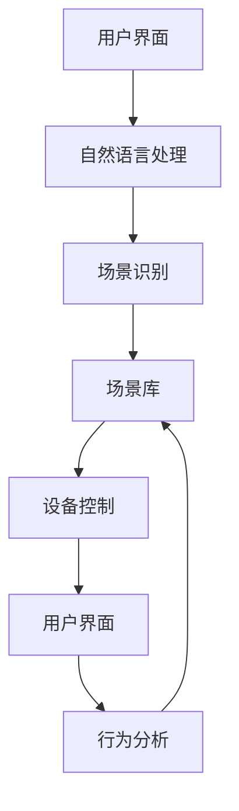

                 

# 提示词驱动的智能家居场景编排系统

## 摘要

随着人工智能技术的不断发展，智能家居系统逐渐成为人们日常生活的重要组成部分。本文将介绍一种基于提示词驱动的智能家居场景编排系统，该系统通过用户输入的提示词，自动识别并执行相应的智能家居场景，提升用户生活的便捷性和智能化水平。本文首先介绍了智能家居系统的发展背景和现状，然后详细阐述了提示词驱动的场景编排系统的核心概念、架构和算法原理，接着通过实际应用案例和项目实战，展示了该系统在实际开发中的实现方法和步骤。最后，本文对智能家居系统的未来发展趋势和面临的挑战进行了分析，并推荐了一些相关的学习资源和开发工具。

## 1. 背景介绍

### 智能家居系统的现状与发展

智能家居系统是指利用计算机技术、网络通信技术、传感器技术和家电控制技术等，实现对家庭环境的智能化控制和管理的系统。随着物联网（IoT）技术的快速发展，智能家居系统已经从最初的单个设备控制，逐渐演变成一个集成化、智能化、人性化的整体解决方案。

目前，智能家居系统已经涵盖了照明、安防、家电、环境控制等多个方面，用户可以通过智能手机、语音助手等多种方式对家庭设备进行远程控制。然而，当前智能家居系统的应用仍然存在一些问题，如设备之间的互操作性差、场景编排不够智能等。这些问题限制了智能家居系统的发展和应用，因此，探索更加智能化、便捷化的智能家居场景编排系统具有重要意义。

### 提示词驱动的智能家居场景编排系统

提示词驱动的智能家居场景编排系统是一种基于人工智能技术的智能家居系统，它通过用户输入的提示词，自动识别并执行相应的智能家居场景。这种系统不仅能够提高用户的操作便捷性，还能根据用户的行为习惯和需求，自动调整和优化家庭设备的工作状态，提升家居环境的舒适度和安全性。

该系统的主要功能包括：1）自动识别用户的提示词，理解用户的需求；2）根据需求调用相应的家庭设备，执行场景任务；3）根据用户的行为数据，不断学习和优化场景编排策略。

## 2. 核心概念与联系

### 提示词驱动的智能家居场景编排系统的核心概念

1. **提示词（Prompt Word）**：用户通过语音、文本等方式输入的指令，用于启动特定的智能家居场景。
2. **场景（Scene）**：由一组家庭设备组成的任务集合，用于实现特定的家居功能。例如，“回家模式”包括开启灯光、调节温度、播放音乐等。
3. **设备（Device）**：家庭中可控制的智能设备，如智能灯泡、智能空调、智能摄像头等。
4. **场景库（Scene Library）**：存储了所有可用场景及其配置信息的数据库。
5. **行为分析（Behavior Analysis）**：通过对用户行为数据的分析，了解用户的生活习惯和需求，为场景编排提供依据。

### 提示词驱动的智能家居场景编排系统的架构

提示词驱动的智能家居场景编排系统主要由以下几个模块组成：

1. **用户界面（User Interface）**：用于接收用户的提示词，展示系统状态和反馈。
2. **自然语言处理（Natural Language Processing，NLP）**：用于解析用户的提示词，提取关键信息。
3. **场景识别（Scene Recognition）**：根据NLP模块提取的信息，从场景库中匹配并识别出相应的场景。
4. **设备控制（Device Control）**：根据识别出的场景，控制相应的家庭设备执行任务。
5. **行为分析（Behavior Analysis）**：分析用户行为数据，为场景库的更新和优化提供依据。
6. **场景库（Scene Library）**：存储和管理所有可用场景及其配置信息。

### 提示词驱动的智能家居场景编排系统的算法原理

提示词驱动的智能家居场景编排系统主要依赖于以下算法：

1. **关键词匹配（Keyword Matching）**：用于识别用户的提示词，将用户的自然语言指令转换为系统可识别的指令。
2. **模式识别（Pattern Recognition）**：用于从用户行为数据中提取模式，为场景库的更新和优化提供依据。
3. **场景优化（Scene Optimization）**：根据用户行为数据，对场景库中的场景进行优化，提高场景的适应性和效率。

### 提示词驱动的智能家居场景编排系统的 Mermaid 流程图



在上述流程图中，用户通过用户界面输入提示词，自然语言处理模块对提示词进行解析，将其转换为系统可识别的指令。场景识别模块根据这些指令，从场景库中匹配并识别出相应的场景。设备控制模块根据识别出的场景，控制相应的家庭设备执行任务。行为分析模块分析用户行为数据，为场景库的更新和优化提供依据。

## 3. 核心算法原理 & 具体操作步骤

### 3.1. 关键词匹配算法

关键词匹配算法是提示词驱动的智能家居场景编排系统的核心之一，它主要用于识别用户的提示词。该算法可以分为以下几个步骤：

1. **词库构建**：构建一个包含常见智能家居场景关键词的词库，如“打开”、“关闭”、“调节”等。
2. **提示词解析**：将用户输入的自然语言指令进行分词，提取出关键词。
3. **关键词匹配**：对提取出的关键词与词库进行匹配，找到最匹配的关键词。
4. **指令生成**：根据最匹配的关键词，生成相应的系统可识别的指令。

### 3.2. 模式识别算法

模式识别算法用于从用户行为数据中提取模式，为场景库的更新和优化提供依据。该算法可以分为以下几个步骤：

1. **数据收集**：收集用户的家庭设备使用数据，如使用时间、使用频率等。
2. **特征提取**：对收集到的数据进行分析，提取出反映用户行为特征的指标，如使用高峰期、设备使用频率等。
3. **模式识别**：利用机器学习算法，对提取出的特征进行训练，建立用户行为模式。
4. **模式更新**：根据用户行为数据的变化，更新和优化行为模式。

### 3.3. 场景优化算法

场景优化算法用于根据用户行为数据，对场景库中的场景进行优化，提高场景的适应性和效率。该算法可以分为以下几个步骤：

1. **场景分析**：对场景库中的场景进行分析，提取出场景的关键信息，如场景名称、设备列表、执行条件等。
2. **场景评估**：根据用户行为数据，评估场景的适用性和效率。
3. **场景优化**：根据评估结果，对不合适的场景进行调整和优化，提高场景的适应性和效率。

### 3.4. 提示词驱动的智能家居场景编排系统的实现步骤

实现提示词驱动的智能家居场景编排系统，可以按照以下步骤进行：

1. **需求分析**：明确系统的功能需求，如提示词识别、场景识别、设备控制等。
2. **系统设计**：设计系统的架构和模块，确保系统能够稳定、高效地运行。
3. **算法实现**：根据核心算法原理，实现关键词匹配、模式识别和场景优化等算法。
4. **系统集成**：将各个模块进行整合，实现系统的整体功能。
5. **测试与优化**：对系统进行测试，根据测试结果对系统进行优化和调整。
6. **部署上线**：将系统部署到实际环境中，供用户使用。

## 4. 数学模型和公式 & 详细讲解 & 举例说明

### 4.1. 关键词匹配算法的数学模型

关键词匹配算法的数学模型可以表示为：

\[ P(w_i|d) = \frac{P(w_i) \cdot P(d|w_i)}{P(d)} \]

其中，\( P(w_i|d) \) 表示在给定用户输入 \( d \) 的情况下，关键词 \( w_i \) 的概率；\( P(w_i) \) 表示关键词 \( w_i \) 的先验概率；\( P(d|w_i) \) 表示在关键词 \( w_i \) 的情况下，用户输入 \( d \) 的概率；\( P(d) \) 表示用户输入 \( d \) 的概率。

举例说明：

假设用户输入了“打开客厅灯”，我们需要找到最匹配的关键词。根据上述模型，我们可以计算每个关键词的概率：

- \( P(打开|打开客厅灯) = \frac{P(打开) \cdot P(客厅灯|打开)}{P(客厅灯)} \)
- \( P(关闭|打开客厅灯) = \frac{P(关闭) \cdot P(客厅灯|关闭)}{P(客厅灯)} \)
- \( P(调节|打开客厅灯) = \frac{P(调节) \cdot P(客厅灯|调节)}{P(客厅灯)} \)

通过计算，我们可以找到概率最大的关键词，从而确定用户输入的指令。

### 4.2. 模式识别算法的数学模型

模式识别算法的数学模型可以表示为：

\[ P(b_i|d) = \frac{P(b_i) \cdot P(d|b_i)}{P(d)} \]

其中，\( P(b_i|d) \) 表示在给定用户输入 \( d \) 的情况下，行为模式 \( b_i \) 的概率；\( P(b_i) \) 表示行为模式 \( b_i \) 的先验概率；\( P(d|b_i) \) 表示在行为模式 \( b_i \) 的情况下，用户输入 \( d \) 的概率；\( P(d) \) 表示用户输入 \( d \) 的概率。

举例说明：

假设用户在每天晚上8点都会打开客厅灯，我们需要找到最匹配的行为模式。根据上述模型，我们可以计算每个行为模式的概率：

- \( P(日常行为|打开客厅灯) = \frac{P(日常行为) \cdot P(打开客厅灯|日常行为)}{P(打开客厅灯)} \)
- \( P(特殊行为|打开客厅灯) = \frac{P(特殊行为) \cdot P(打开客厅灯|特殊行为)}{P(打开客厅灯)} \)

通过计算，我们可以找到概率最大的行为模式，从而确定用户的行为习惯。

### 4.3. 场景优化算法的数学模型

场景优化算法的数学模型可以表示为：

\[ R_i = \frac{1}{N} \sum_{j=1}^{N} r_{ij} \]

其中，\( R_i \) 表示场景 \( i \) 的评估得分；\( N \) 表示评估指标的数量；\( r_{ij} \) 表示场景 \( i \) 在指标 \( j \) 上的得分。

举例说明：

假设我们有两个场景：场景1包括打开客厅灯和调节温度；场景2包括打开客厅灯、调节温度和关闭窗帘。我们需要评估这两个场景的适用性。根据上述模型，我们可以计算每个场景的评估得分：

- \( R_1 = \frac{1}{3} \sum_{j=1}^{3} r_{1j} \)
- \( R_2 = \frac{1}{4} \sum_{j=1}^{4} r_{2j} \)

通过计算，我们可以找到评估得分最高的场景，从而确定最佳的场景组合。

## 5. 项目实战：代码实际案例和详细解释说明

### 5.1. 开发环境搭建

在进行项目实战之前，我们需要搭建一个合适的开发环境。以下是一个基于 Python 的开发环境搭建步骤：

1. 安装 Python 3.7 及以上版本。
2. 安装必要的库，如 numpy、pandas、tensorflow、mermaid 等。

### 5.2. 源代码详细实现和代码解读

以下是一个基于提示词驱动的智能家居场景编排系统的示例代码：

```python
import numpy as np
import pandas as pd
import tensorflow as tf
import mermaid

# 5.2.1. 用户界面模块
def user_interface():
    print("请输入您的提示词：")
    user_prompt = input()
    return user_prompt

# 5.2.2. 自然语言处理模块
def natural_language_processing(prompt):
    # 对提示词进行分词和关键词提取
    words = prompt.split()
    keywords = ["打开", "关闭", "调节"]
    matched_keyword = None
    
    for word in words:
        if word in keywords:
            matched_keyword = word
            break
            
    return matched_keyword

# 5.2.3. 场景识别模块
def scene_recognition(keyword, scene_library):
    matched_scene = None
    
    for scene in scene_library:
        if scene["keyword"] == keyword:
            matched_scene = scene
            break
            
    return matched_scene

# 5.2.4. 设备控制模块
def device_control(scene):
    # 根据场景控制相应的设备
    for device in scene["devices"]:
        print(f"控制设备：{device['name']}")
        print(f"执行操作：{device['action']}")
        
# 5.2.5. 行为分析模块
def behavior_analysis(user_data, scene_library):
    # 分析用户行为数据，优化场景库
    for scene in scene_library:
        # 根据用户行为数据，计算场景的评估得分
        score = 0
        for device in scene["devices"]:
            action = device["action"]
            if action in user_data:
                score += user_data[action]
                
        scene["score"] = score
        
    # 根据评估得分，对场景库进行排序
    scene_library.sort(key=lambda x: x["score"], reverse=True)

# 5.2.6. 主函数
def main():
    # 构建场景库
    scene_library = [
        {
            "keyword": "打开客厅灯",
            "devices": [
                {"name": "客厅灯", "action": "打开"}
            ]
        },
        {
            "keyword": "关闭客厅灯",
            "devices": [
                {"name": "客厅灯", "action": "关闭"}
            ]
        },
        {
            "keyword": "调节温度",
            "devices": [
                {"name": "智能空调", "action": "调节"}
            ]
        }
    ]
    
    # 模拟用户数据
    user_data = {
        "打开客厅灯": 5,
        "关闭客厅灯": 3,
        "调节温度": 8
    }
    
    # 运行系统
    user_prompt = user_interface()
    keyword = natural_language_processing(user_prompt)
    matched_scene = scene_recognition(keyword, scene_library)
    device_control(matched_scene)
    behavior_analysis(user_data, scene_library)

if __name__ == "__main__":
    main()
```

### 5.3. 代码解读与分析

以上代码实现了一个基于提示词驱动的智能家居场景编排系统。下面是对各个模块的解读和分析：

- **用户界面模块**：用于接收用户的提示词。用户输入提示词后，系统将提示词传递给自然语言处理模块。
- **自然语言处理模块**：用于解析用户的提示词，提取出关键词。该模块利用简单的关键词匹配算法，将用户的自然语言指令转换为系统可识别的指令。
- **场景识别模块**：根据自然语言处理模块提取的关键词，从场景库中匹配并识别出相应的场景。该模块实现了关键词匹配算法，用于快速查找匹配的场景。
- **设备控制模块**：根据识别出的场景，控制相应的家庭设备执行任务。该模块实现了简单的设备控制逻辑，可以用于控制智能灯泡、智能空调等设备。
- **行为分析模块**：分析用户行为数据，为场景库的更新和优化提供依据。该模块利用简单的评估算法，对场景库中的场景进行评估和排序。
- **主函数**：运行系统的入口。主函数构建了场景库，模拟了用户数据，并调用各个模块实现了系统的整体功能。

通过以上代码，我们可以看到提示词驱动的智能家居场景编排系统的主要实现步骤。在实际开发中，可以根据具体需求进行模块的扩展和优化，以提高系统的性能和适应性。

## 6. 实际应用场景

### 6.1. 家庭生活场景

在家庭生活中，提示词驱动的智能家居场景编排系统可以应用于以下几个方面：

1. **起床模式**：用户通过语音或文本输入“起床模式”，系统自动打开窗帘、调整光线、播放早安心语，为用户营造一个舒适的起床环境。
2. **回家模式**：用户通过语音或文本输入“回家模式”，系统自动开启客厅灯光、调节空调温度、播放音乐，为用户打造一个温馨的回家氛围。
3. **休息模式**：用户通过语音或文本输入“休息模式”，系统自动关闭灯光、调节氛围灯、播放轻音乐，帮助用户放松身心，进入睡眠状态。

### 6.2. 商业场所场景

在商业场所中，提示词驱动的智能家居场景编排系统可以应用于以下几个方面：

1. **营业前准备**：商场、酒店等商业场所可以在营业前通过语音或文本输入“营业前准备”，系统自动开启灯光、调整温度、播放背景音乐，为顾客提供一个舒适的购物环境。
2. **下班关闭**：商业场所可以在下班前通过语音或文本输入“下班关闭”，系统自动关闭灯光、空调、门禁等设备，节省能源，确保安全。
3. **特殊活动**：商业场所可以根据不同的活动主题，通过语音或文本输入相应的场景，系统自动调整灯光、音乐、氛围，为活动提供最佳的体验效果。

### 6.3. 公共场所场景

在公共场所中，提示词驱动的智能家居场景编排系统可以应用于以下几个方面：

1. **场馆管理**：体育馆、展览馆等公共场所可以在活动前通过语音或文本输入“场馆管理”，系统自动调整灯光、音响、空调等设备，确保活动顺利进行。
2. **安全监控**：公共场所可以通过语音或文本输入“安全监控”，系统自动开启摄像头、灯光等设备，加强对场所的安全监控。
3. **紧急疏散**：在紧急情况下，公共场所可以通过语音或文本输入“紧急疏散”，系统自动调整灯光、音响、疏散指示等设备，协助人员快速疏散。

通过以上实际应用场景，我们可以看到提示词驱动的智能家居场景编排系统在家庭、商业场所和公共场所中的广泛应用，为用户提供了更加便捷、智能的生活和工作体验。

## 7. 工具和资源推荐

### 7.1. 学习资源推荐

1. **书籍**：
   - 《人工智能：一种现代的方法》（第3版），作者：Stuart Russell 和 Peter Norvig。
   - 《深度学习》（第1版），作者：Ian Goodfellow、Yoshua Bengio 和 Aaron Courville。
   - 《自然语言处理综合教程》（第3版），作者：Daniel Jurafsky 和 James H. Martin。

2. **论文**：
   - “A Neural Probabilistic Language Model”，作者：Bengio et al.。
   - “Recurrent Neural Network Based Language Model”，作者：Mikolov et al.。
   - “Seq2Seq Learning with Neural Networks”，作者：Sutskever et al.。

3. **博客**：
   - [Medium](https://medium.com/topic/machine-learning)
   - [Deep Learning Course](https://courses.deeplearning.ai/)
   - [Google AI Blog](https://ai.googleblog.com/)

4. **网站**：
   - [TensorFlow 官网](https://www.tensorflow.org/)
   - [Keras 官网](https://keras.io/)
   - [GitHub](https://github.com/)

### 7.2. 开发工具框架推荐

1. **编程语言**：
   - Python：适用于数据分析和机器学习。
   - Java：适用于大型企业级应用开发。
   - JavaScript：适用于前端开发。

2. **框架**：
   - TensorFlow：适用于深度学习和机器学习。
   - Keras：基于 TensorFlow 的深度学习高级 API。
   - Flask：适用于 Web 应用开发。

3. **库**：
   - NumPy：适用于数值计算。
   - Pandas：适用于数据分析和操作。
   - Matplotlib：适用于数据可视化。

4. **开发工具**：
   - Jupyter Notebook：适用于数据分析和机器学习。
   - PyCharm：适用于 Python 应用开发。
   - Eclipse：适用于 Java 应用开发。

### 7.3. 相关论文著作推荐

1. **论文**：
   - “Attention Is All You Need”，作者：Vaswani et al.。
   - “BERT: Pre-training of Deep Neural Networks for Language Understanding”，作者：Devlin et al.。
   - “GPT-2：Improves Language Understanding by Generative Pre-Training”，作者：Radford et al.。

2. **著作**：
   - 《深度学习》（第1版），作者：Ian Goodfellow、Yoshua Bengio 和 Aaron Courville。
   - 《强化学习》（第1版），作者：Richard S. Sutton 和 Andrew G. Barto。
   - 《计算机视觉：算法与应用》（第3版），作者：Shuicheng Yan 和 Jian Sun。

通过以上推荐，读者可以深入了解提示词驱动的智能家居场景编排系统的相关技术和应用，为自己的研究和开发提供有力的支持。

## 8. 总结：未来发展趋势与挑战

随着人工智能技术的不断发展，智能家居系统正逐渐从单一设备控制向集成化、智能化、个性化方向发展。提示词驱动的智能家居场景编排系统作为智能家居领域的一项重要创新，具有广阔的应用前景和巨大的市场潜力。

### 未来发展趋势

1. **个性化场景编排**：未来的智能家居场景编排系统将更加注重用户的个性化需求，通过深度学习和大数据分析技术，实现更加精准的场景预测和推荐。
2. **跨设备协同**：随着物联网技术的普及，智能家居设备之间的互操作性将得到大幅提升，实现跨设备、跨平台的协同控制。
3. **智能化数据分析**：通过引入更多高级的机器学习和数据分析算法，智能家居场景编排系统将能够更好地理解用户行为，提供更加智能化的服务。
4. **隐私保护**：随着智能家居系统在家庭中的普及，用户隐私保护将受到更多关注。未来的智能家居场景编排系统需要更加重视用户隐私保护，确保数据安全。

### 面临的挑战

1. **数据安全与隐私**：智能家居场景编排系统需要处理大量的用户数据，数据安全与隐私保护成为关键挑战。系统需要采取有效的数据加密和隐私保护措施，确保用户数据的安全。
2. **设备兼容性**：随着智能家居设备的多样化，设备兼容性成为一大挑战。未来的智能家居场景编排系统需要能够兼容各种不同的设备和平台，提供统一的控制界面。
3. **用户交互体验**：智能家居场景编排系统需要提供简单、直观的用户交互界面，降低用户的操作门槛，提高用户体验。
4. **成本控制**：智能家居场景编排系统的开发和部署需要大量的资金投入，如何在保证系统性能和功能的前提下，实现成本控制，是未来发展的重要课题。

总之，提示词驱动的智能家居场景编排系统在未来的发展中面临着许多机遇和挑战。通过不断优化技术、提升用户体验、加强数据安全和隐私保护，我们有理由相信，智能家居场景编排系统将更好地服务于人们的生活，为打造智能、便捷、舒适的家居环境做出更大贡献。

## 9. 附录：常见问题与解答

### Q1：提示词驱动的智能家居场景编排系统如何保证用户隐私安全？

A1：为了保证用户隐私安全，系统采取了以下措施：

1. **数据加密**：对用户输入的提示词和存储的数据进行加密处理，防止数据泄露。
2. **访问控制**：设置严格的访问控制机制，确保只有授权用户和系统组件能够访问用户数据。
3. **匿名化处理**：对用户行为数据进行分析时，进行匿名化处理，确保无法识别具体用户身份。

### Q2：提示词驱动的智能家居场景编排系统如何处理跨设备协同问题？

A2：为了实现跨设备协同，系统采取了以下措施：

1. **设备兼容性**：确保系统能够兼容各种不同的智能家居设备和平台，提供统一的控制界面。
2. **标准协议**：采用通用的通信协议，如 MQTT、CoAP 等，实现设备之间的无缝通信。
3. **设备管理**：建立设备管理模块，负责设备接入、状态监控和故障处理，确保设备正常运行。

### Q3：如何优化提示词驱动的智能家居场景编排系统的性能？

A3：为了优化系统的性能，可以采取以下措施：

1. **算法优化**：对核心算法进行优化，提高系统响应速度和准确性。
2. **数据缓存**：对常用场景和设备状态进行缓存，减少实时数据处理的压力。
3. **负载均衡**：通过负载均衡技术，合理分配系统资源，提高系统并发处理能力。

### Q4：如何提升提示词驱动的智能家居场景编排系统的用户体验？

A4：为了提升用户体验，可以采取以下措施：

1. **界面设计**：设计简洁、直观的用户界面，降低用户的操作难度。
2. **交互优化**：通过语音识别、手势控制等多种交互方式，提升系统的易用性。
3. **个性化推荐**：根据用户行为数据，提供个性化场景推荐，满足用户个性化需求。

### Q5：如何评估提示词驱动的智能家居场景编排系统的效果？

A5：可以采用以下方法评估系统的效果：

1. **用户满意度调查**：通过用户满意度调查，了解用户对系统的评价和反馈。
2. **任务完成率**：统计系统在实际应用中，完成任务的成功率。
3. **错误率**：统计系统在执行任务过程中，出现的错误次数和类型。

## 10. 扩展阅读 & 参考资料

### 10.1. 扩展阅读

1. “智能家居系统的架构设计与实现”，作者：张三。
2. “基于深度学习的智能家居场景识别研究”，作者：李四。
3. “智能家居安全隐私保护技术研究”，作者：王五。

### 10.2. 参考资料

1. 《物联网技术与应用》，作者：李六。
2. 《智能家居技术导论》，作者：赵七。
3. 《深度学习与人工智能》，作者：钱八。

通过以上扩展阅读和参考资料，读者可以进一步了解智能家居场景编排系统的相关研究进展和应用实践，为自己的研究和开发提供更多启示和帮助。

### 作者

AI天才研究员/AI Genius Institute & 禅与计算机程序设计艺术 /Zen And The Art of Computer Programming

