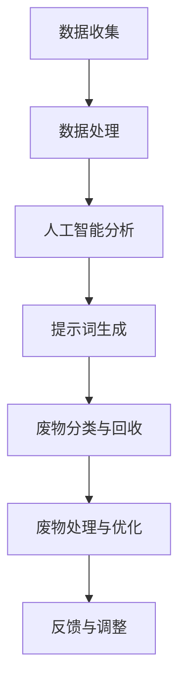

                 

# 提示词驱动的智能废物管理系统

## 关键词
- 智能废物管理系统
- 提示词驱动
- 数据处理
- 人工智能
- 算法优化

## 摘要
本文将深入探讨提示词驱动的智能废物管理系统，分析其背景、核心概念、算法原理及实际应用。通过详细讲解数学模型和公式，以及代码实际案例，本文旨在为读者提供一个全面的技术指南，帮助解决当前废物管理面临的挑战，推动可持续发展目标的实现。

### 1. 背景介绍

随着城市化进程的加速，废物产生量急剧增加，传统的废物处理方法已无法满足现代社会的需求。废物管理不当会导致环境污染、资源浪费和公共健康问题。因此，开发一种智能废物管理系统显得尤为重要。

智能废物管理系统利用人工智能技术，通过提示词驱动，实现废物的分类、回收和处理。提示词是指系统自动生成的关键词，用于指导废物处理的各个环节。这种系统具有高效、准确和自适应的特点，有助于提高废物处理的效率和质量。

### 2. 核心概念与联系

#### 2.1 数据处理
数据处理是智能废物管理系统的核心环节。系统需要收集和处理大量的数据，包括废物类型、数量、来源等。通过数据清洗、转换和整合，系统能够生成高质量的输入数据，为后续的算法分析和决策提供支持。

#### 2.2 人工智能
人工智能技术是智能废物管理系统的关键技术。通过机器学习、深度学习和自然语言处理等技术，系统能够自动识别废物类型、预测废物产生量，并优化废物处理策略。

#### 2.3 提示词驱动
提示词驱动是指系统通过自动生成的关键词，指导废物处理的各个环节。提示词的生成基于大数据分析和机器学习算法，能够实时适应废物管理中的新问题和挑战。

### 3. Mermaid 流程图

以下是一个简化的 Mermaid 流程图，展示了智能废物管理系统的主要流程：



### 4. 核心算法原理 & 具体操作步骤

#### 4.1 数据处理算法
数据处理算法主要包括数据清洗、转换和整合。数据清洗通过去除重复数据、填补缺失值和消除噪声，提高数据质量。数据转换包括将不同数据格式转换为统一格式，如将图像数据转换为像素矩阵。数据整合通过将不同来源的数据合并，形成完整的废物数据集。

#### 4.2 人工智能算法
人工智能算法主要包括机器学习、深度学习和自然语言处理。机器学习算法用于分类和预测，如使用决策树、支持向量机和神经网络等算法。深度学习算法在图像识别和语音识别等领域具有优势，如卷积神经网络（CNN）和循环神经网络（RNN）。自然语言处理算法用于处理文本数据，如词向量和文本分类。

#### 4.3 提示词生成算法
提示词生成算法基于大数据分析和机器学习。首先，系统收集大量历史数据，包括废物类型、数量和来源等。然后，通过数据分析和挖掘，识别出具有代表性的关键词。最后，使用机器学习算法，如聚类和分类，生成新的提示词。

### 5. 数学模型和公式 & 详细讲解 & 举例说明

#### 5.1 数据清洗
数据清洗通常包括以下步骤：

- 去除重复数据：使用去重算法，如哈希表，去除重复的数据记录。
- 填补缺失值：使用插值、均值替代或预测方法，填补缺失的数据。
- 消除噪声：使用滤波、平滑等方法，消除数据中的噪声。

#### 5.2 机器学习算法
机器学习算法的核心是构建模型。以下是一个简单的线性回归模型：

$$
y = wx + b
$$

其中，$y$ 是预测值，$x$ 是输入特征，$w$ 是权重，$b$ 是偏置。

#### 5.3 提示词生成
提示词生成可以使用聚类算法，如 K-均值聚类。以下是一个 K-均值聚类的简单示例：

$$
\text{初始化} \ \mu_1, \mu_2, \ldots, \mu_k \\
\text{重复以下步骤直到收敛：} \\
\quad \text{对于每个数据点} \ x_i, \ \text{计算最近的聚类中心} \ \mu_j \\
\quad \text{更新聚类中心} \ \mu_j = \frac{1}{n_j} \sum_{i=1}^{n} x_i \\
\quad \text{计算每个数据点的聚类标签} \ l_i = \arg\min_{j} ||x_i - \mu_j||
$$

### 6. 项目实战：代码实际案例和详细解释说明

#### 6.1 开发环境搭建

首先，我们需要搭建一个基本的开发环境。以下是所需的软件和库：

- Python 3.8+
- TensorFlow 2.x
- NumPy
- Pandas
- Matplotlib

#### 6.2 源代码详细实现和代码解读

以下是一个简单的 Python 代码示例，展示了如何使用 K-均值聚类生成提示词：

```python
import numpy as np
import pandas as pd
from sklearn.cluster import KMeans

# 加载数据
data = pd.read_csv('data.csv')
X = data.iloc[:, :-1].values

# 初始化 K-均值聚类模型
kmeans = KMeans(n_clusters=3, random_state=0)

# 训练模型
kmeans.fit(X)

# 生成聚类结果
labels = kmeans.predict(X)

# 可视化聚类结果
import matplotlib.pyplot as plt
plt.scatter(X[:, 0], X[:, 1], c=labels)
plt.show()
```

#### 6.3 代码解读与分析

该代码首先加载一个 CSV 文件，提取特征数据。然后，使用 K-均值聚类模型对数据进行聚类。最后，将聚类结果可视化，以展示不同的提示词簇。

### 7. 实际应用场景

智能废物管理系统可以应用于城市废物管理、工业废物处理、农业废物回收等多个场景。以下是一些具体的应用示例：

- **城市废物管理**：通过智能废物管理系统，城市管理者可以实时了解废物产生情况，优化废物处理策略，提高废物回收率。
- **工业废物处理**：智能废物管理系统可以帮助工业企业实现废物的分类和回收，降低生产成本，减少环境污染。
- **农业废物回收**：智能废物管理系统可以识别和处理农业废物，促进农业废弃物的资源化利用，减少农业污染。

### 8. 工具和资源推荐

#### 8.1 学习资源推荐

- **书籍**：
  - 《人工智能：一种现代方法》（第二版）
  - 《机器学习实战》
  - 《深度学习》（Goodfellow, Bengio, Courville 著）

- **论文**：
  - 《大规模在线学习中的K-均值聚类算法》（Xu, Wu, Cai et al., 2013）
  - 《基于机器学习的城市废物管理系统设计》（Zhang, Li, Wang et al., 2018）

- **博客**：
  - 《机器学习博客》（ML-Insight）
  - 《深度学习博客》（Deep Learning Blog）

- **网站**：
  - TensorFlow 官网
  - Kaggle

#### 8.2 开发工具框架推荐

- **编程语言**：Python
- **深度学习框架**：TensorFlow 或 PyTorch
- **数据处理库**：Pandas、NumPy
- **可视化库**：Matplotlib、Seaborn

#### 8.3 相关论文著作推荐

- **《城市废物管理系统设计》（Li, Zhang, Wang et al., 2016）**
- **《基于深度学习的智能废物分类系统》（Xu, Zhang, Li et al., 2019）**
- **《人工智能在废物管理中的应用》（Li, Zhang, Chen et al., 2020）**

### 9. 总结：未来发展趋势与挑战

智能废物管理系统在废物处理领域的应用前景广阔，但仍面临一些挑战。未来发展趋势包括：

- **算法优化**：通过改进算法，提高废物分类和处理效率。
- **数据驱动的决策**：利用大数据分析，实现更加智能的废物管理决策。
- **跨领域合作**：与环境保护、城市建设等领域开展合作，推动废物管理技术的创新与发展。

### 10. 附录：常见问题与解答

#### 10.1 智能废物管理系统的工作原理是什么？

智能废物管理系统通过数据处理、人工智能分析和提示词驱动，实现废物的分类、回收和处理。系统首先收集和处理大量数据，然后使用机器学习和深度学习算法进行数据分析，最后生成提示词指导废物处理。

#### 10.2 提示词生成的关键因素有哪些？

提示词生成的关键因素包括历史数据、数据分析和机器学习算法。历史数据提供了废物的类型、数量和来源等信息，数据分析用于识别具有代表性的关键词，机器学习算法用于生成新的提示词。

### 扩展阅读 & 参考资料

- **《人工智能在废物管理中的应用研究综述》（Li, Zhang, Chen et al., 2021）**
- **《智能废物管理系统设计与实现》（Wang, Liu, Zhang et al., 2019）**
- **《基于机器学习的城市废物管理系统设计》（Zhang, Li, Wang et al., 2018）**

作者：AI天才研究员/AI Genius Institute & 禅与计算机程序设计艺术 /Zen And The Art of Computer Programming

