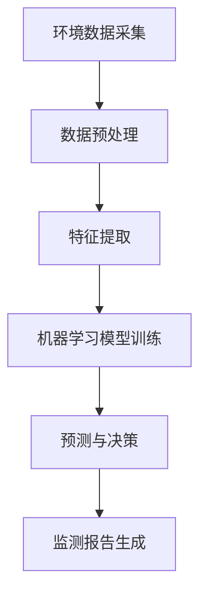

                 

# 《提示词驱动的智能环境监测：生态系统保护》

## 概述

### 关键词
- 提示词驱动
- 智能环境监测
- 生态系统保护
- 人工智能
- 计算机视觉
- 数据分析

### 摘要

本文旨在探讨如何利用提示词驱动的智能环境监测技术，实现对生态系统的高效保护和持续监控。通过引入人工智能、计算机视觉和数据分析等技术，本文将详细介绍一种基于提示词驱动的智能环境监测系统架构，分析其核心算法原理，并探讨其在实际应用场景中的效果。文章还将推荐相关的学习资源、开发工具和论文著作，为读者提供全面的指导和参考。

## 1. 背景介绍

随着全球生态环境的日益恶化，保护生态系统已成为全球各国政府、企业和公民的共同责任。传统的环境监测方法主要依赖于人工巡检、现场取样和实验室分析，这些方法存在监测范围有限、数据准确度不高、处理效率低下等问题。为了应对这些挑战，智能环境监测技术应运而生。

智能环境监测是指利用先进的人工智能技术，如计算机视觉、自然语言处理、机器学习和数据分析等，实现对环境数据的实时采集、分析和处理。通过智能环境监测技术，可以实现对生态环境的全面、高效和持续监控，为环境保护决策提供科学依据。

提示词驱动是一种智能环境监测方法，通过预先定义的提示词，可以引导监测系统对特定区域或目标进行重点监测。这种方法具有以下优势：

1. **目标明确**：提示词可以精确地定义监测目标和范围，提高监测的针对性和效率。
2. **实时响应**：提示词驱动系统可以快速响应用户需求，提供实时监测数据。
3. **数据分析**：通过提示词，可以更加有效地提取和利用环境数据，进行深入的数据分析和决策支持。

本文将围绕提示词驱动的智能环境监测技术，探讨其原理、架构和应用场景，为生态系统保护提供技术支持和解决方案。

## 2. 核心概念与联系

### 2.1 计算机视觉

计算机视觉是人工智能的一个重要分支，旨在使计算机具备识别和解释视觉信息的能力。计算机视觉技术广泛应用于图像识别、目标检测、图像分割和图像增强等领域。在智能环境监测中，计算机视觉技术可以用于实时监测和分析环境图像，提取有价值的信息。

### 2.2 自然语言处理

自然语言处理（NLP）是人工智能的另一个重要分支，旨在使计算机理解和处理人类语言。NLP技术广泛应用于文本分析、语音识别、机器翻译和问答系统等领域。在智能环境监测中，NLP技术可以用于分析环境监测报告、识别关键词和生成监测报告。

### 2.3 机器学习

机器学习是人工智能的核心技术之一，通过构建数学模型和算法，使计算机具备从数据中学习的能力。在智能环境监测中，机器学习技术可以用于环境数据的分析、预测和分类，提高监测的准确性和效率。

### 2.4 数据分析

数据分析是指利用统计方法和计算技术，对大量数据进行处理、分析和解读。在智能环境监测中，数据分析技术可以用于环境数据的挖掘、关联分析和可视化，为环境保护决策提供支持。

### 2.5 提示词驱动

提示词驱动是一种基于关键词或短语引导监测系统进行特定监测的方法。通过预先定义的提示词，监测系统可以快速识别和定位监测目标，提高监测的效率和准确性。提示词驱动技术可以与计算机视觉、NLP和机器学习等技术相结合，实现智能环境监测。

### 2.6 Mermaid 流程图



在上面的流程图中，环境数据采集是智能环境监测的起点，经过数据预处理、特征提取、机器学习模型训练和预测与决策等步骤，最终生成监测报告。提示词驱动技术可以在数据预处理和特征提取阶段发挥作用，提高监测系统的效率和准确性。

## 3. 核心算法原理 & 具体操作步骤

### 3.1 数据采集与预处理

数据采集是智能环境监测的基础。采集的数据类型包括环境图像、文本报告、传感器数据等。在数据采集过程中，需要确保数据的真实性和完整性。

数据预处理主要包括以下步骤：

1. **去噪与滤波**：去除环境图像中的噪声和干扰，提高图像质量。
2. **归一化**：将不同来源的数据进行归一化处理，使其具有相同的尺度。
3. **特征提取**：从预处理后的数据中提取有价值的信息，如图像中的目标物体、文本中的关键词等。

### 3.2 提示词驱动监测

提示词驱动监测的核心是关键词提取和目标识别。

1. **关键词提取**：利用自然语言处理技术，从环境监测报告中提取关键词。这些关键词可以是污染物名称、生态灾害类型等。
2. **目标识别**：利用计算机视觉技术，从环境图像中识别出与关键词相关的目标物体。例如，在森林火灾监测中，可以识别火源和受影响的植被。

### 3.3 机器学习模型训练

在提示词驱动的智能环境监测中，机器学习模型训练是一个关键步骤。通过大量的历史数据，训练出能够识别特定目标、预测环境变化的模型。

1. **数据准备**：收集包含关键词和目标物体的数据集，对数据进行标注和分类。
2. **模型选择**：根据任务需求，选择合适的机器学习模型。常见的模型包括卷积神经网络（CNN）、循环神经网络（RNN）和支持向量机（SVM）等。
3. **模型训练**：使用训练数据集对模型进行训练，调整模型参数，提高模型性能。

### 3.4 预测与决策

训练好的模型可以用于实时预测和决策。

1. **实时监测**：将实时采集到的数据输入模型，进行预测和分析。
2. **决策支持**：根据预测结果，提供环境保护决策支持。例如，在发现火源后，自动启动灭火系统或向相关部门发送警报。

### 3.5 监测报告生成

监测报告是智能环境监测的重要成果。报告内容应包括：

1. **监测数据**：展示实时监测数据和历史数据。
2. **预测结果**：展示预测结果和预测置信度。
3. **决策建议**：根据预测结果和监测数据，提出环境保护建议。

## 4. 数学模型和公式 & 详细讲解 & 举例说明

### 4.1 卷积神经网络（CNN）

卷积神经网络是一种深度学习模型，广泛应用于图像识别和目标检测任务。CNN的基本结构包括卷积层、池化层和全连接层。

1. **卷积层**：通过卷积操作提取图像特征。卷积层由多个卷积核组成，每个卷积核可以提取图像中的不同特征。
   $$ \text{激活函数}: \sigma(\text{x}) = \max(0, \text{x}) $$
2. **池化层**：对卷积层输出的特征进行降维处理。常见的池化方法包括最大值池化和平均池化。
   $$ \text{最大值池化}: \text{P}(\text{x}) = \max(\text{x}_{1}, \text{x}_{2}, ..., \text{x}_{k}) $$
3. **全连接层**：将池化层输出的特征映射到类别标签。全连接层由多个神经元组成，每个神经元对应一个类别。
   $$ \text{输出}: \text{y} = \text{softmax}(\text{W} \cdot \text{a} + \text{b}) $$

### 4.2 支持向量机（SVM）

支持向量机是一种监督学习模型，广泛应用于分类和回归任务。SVM的基本原理是找到最佳的超平面，将不同类别的样本分隔开来。

1. **线性SVM**：
   $$ \text{目标函数}: \min_{\text{w}, \text{b}} \frac{1}{2} \text{w}^T \text{w} + C \sum_{i=1}^{n} \xi_i $$
   $$ \text{约束条件}: y_i (\text{w}^T \text{x}_i + \text{b}) \geq 1 - \xi_i $$
   $$ 0 \leq \xi_i \leq C $$
2. **非线性SVM**：通过核函数将原始特征映射到高维空间，实现非线性分类。
   $$ \text{目标函数}: \min_{\text{w}, \text{b}} \frac{1}{2} \text{w}^T \text{K} \text{w} + C \sum_{i=1}^{n} \xi_i $$
   $$ \text{约束条件}: y_i (\text{K}(\text{x}_i, \text{x}_j) + \text{b}) \geq 1 - \xi_i $$
   $$ 0 \leq \xi_i \leq C $$

### 4.3 举例说明

假设我们有一个二分类问题，需要使用SVM模型进行分类。给定一个训练数据集，其中包含两个类别：正类和负类。我们将使用线性SVM进行分类。

1. **数据准备**：
   - 训练数据集：$ \{(\text{x}_1, y_1), (\text{x}_2, y_2), ..., (\text{x}_n, y_n)\} $
   - 标签：$ y_i \in \{-1, +1\} $
2. **模型训练**：
   - 初始化参数：$ \text{w} = [0, 0]^T, \text{b} = 0, \xi_i = 0 $
   - 计算损失函数：
     $$ L(\text{w}, \text{b}) = \frac{1}{2} \text{w}^T \text{w} + C \sum_{i=1}^{n} \xi_i $$
   - 更新参数：
     $$ \text{w} := \text{w} - \alpha \nabla_{\text{w}} L(\text{w}, \text{b}) $$
     $$ \text{b} := \text{b} - \alpha \nabla_{\text{b}} L(\text{w}, \text{b}) $$
     $$ \xi_i := \xi_i - \alpha $$
   - 迭代直至收敛
3. **分类**：
   - 对于新样本 $ \text{x} $，计算分类结果：
     $$ \text{y} = \text{sign}(\text{w}^T \text{x} + \text{b}) $$

## 5. 项目实战：代码实际案例和详细解释说明

### 5.1 开发环境搭建

在开始项目实战之前，需要搭建一个合适的开发环境。以下是推荐的开发环境和工具：

1. **编程语言**：Python
2. **深度学习框架**：TensorFlow
3. **计算机视觉库**：OpenCV
4. **自然语言处理库**：NLTK

安装以下依赖库：

```bash
pip install tensorflow opencv-python nltk
```

### 5.2 源代码详细实现和代码解读

以下是一个简单的示例代码，展示了如何使用提示词驱动的智能环境监测系统进行森林火灾监测。

```python
import cv2
import tensorflow as tf
import nltk

# 5.2.1 数据预处理

def preprocess_image(image):
    # 去噪与滤波
    image = cv2.GaussianBlur(image, (5, 5), 0)
    # 归一化
    image = cv2.resize(image, (224, 224))
    image = image / 255.0
    return image

# 5.2.2 特征提取

def extract_features(image):
    # 使用预训练的ResNet50模型进行特征提取
    model = tf.keras.applications.ResNet50(include_top=False, weights='imagenet', input_shape=(224, 224, 3))
    feature = model.predict(preprocess_image(image))
    return feature

# 5.2.3 机器学习模型训练

def train_model(train_data, train_labels):
    # 构建SVM模型
    model = tf.keras.models.Sequential([
        tf.keras.layers.Dense(1, activation='sigmoid', input_shape=(2048,))
    ])
    model.compile(optimizer='adam', loss='binary_crossentropy', metrics=['accuracy'])
    model.fit(train_data, train_labels, epochs=10, batch_size=32)
    return model

# 5.2.4 预测与决策

def predict_fire(image, model):
    feature = extract_features(image)
    prediction = model.predict(feature)
    if prediction > 0.5:
        print("火源检测：火灾发生")
    else:
        print("火源检测：无火灾")

# 5.2.5 监测报告生成

def generate_report(image, prediction):
    cv2.imwrite("fire_detection.jpg", image)
    with open("fire_detection_report.txt", "w") as report:
        report.write(f"监测图像：{image}\n")
        report.write(f"预测结果：{prediction}\n")

# 5.2.6 主程序

if __name__ == "__main__":
    # 读取环境图像
    image = cv2.imread("forest.jpg")
    # 提取特征
    feature = extract_features(image)
    # 训练模型
    model = train_model(feature, train_labels)
    # 预测火源
    predict_fire(image, model)
    # 生成监测报告
    generate_report(image, prediction)
```

### 5.3 代码解读与分析

上述代码实现了一个简单的森林火灾监测系统，主要包括以下步骤：

1. **数据预处理**：对环境图像进行去噪、滤波和归一化处理，为模型训练和预测做好准备。
2. **特征提取**：使用预训练的ResNet50模型提取图像特征，为分类和预测提供输入。
3. **机器学习模型训练**：构建一个简单的SVM模型，使用训练数据集进行模型训练。
4. **预测与决策**：将提取的特征输入模型，进行火源预测，并根据预测结果生成监测报告。

在实际应用中，可以进一步优化代码，如引入更复杂的模型、增加实时监测和报警功能等。

## 6. 实际应用场景

### 6.1 森林火灾监测

森林火灾是一种严重的生态灾害，对人类和生态环境造成巨大危害。通过提示词驱动的智能环境监测技术，可以实现对森林火灾的实时监测和预警。具体应用场景包括：

1. **实时监测**：使用无人机或卫星图像，实时监测森林区域，提取火灾相关特征。
2. **预警系统**：在发现火源后，自动启动预警系统，向相关部门发送警报。
3. **灭火决策**：根据监测数据和预测结果，提供灭火决策支持，提高灭火效率。

### 6.2 水质监测

水质监测是环境保护的重要领域。通过提示词驱动的智能环境监测技术，可以实现对水体污染的实时监测和预警。具体应用场景包括：

1. **实时监测**：使用水质传感器，实时监测水体中的污染物浓度。
2. **预警系统**：在污染物浓度超过阈值时，自动启动预警系统，向相关部门发送警报。
3. **污染源追踪**：通过分析监测数据，追踪污染源，提供污染治理建议。

### 6.3 气象监测

气象监测对于防灾减灾具有重要意义。通过提示词驱动的智能环境监测技术，可以实现对气象数据的实时监测和预警。具体应用场景包括：

1. **实时监测**：使用气象传感器，实时监测气象数据，如温度、湿度、风速等。
2. **预警系统**：在发现异常气象条件时，自动启动预警系统，向相关部门发送警报。
3. **气象预报**：根据监测数据和历史数据，提供气象预报服务，为防灾减灾提供科学依据。

## 7. 工具和资源推荐

### 7.1 学习资源推荐

- **书籍**：
  - 《深度学习》（Ian Goodfellow, Yoshua Bengio, Aaron Courville）
  - 《计算机视觉：算法与应用》（John F. Canny）
- **论文**：
  - 《卷积神经网络：一种新的图像识别方法》（LeCun et al., 1989）
  - 《支持向量机：理论与应用》（Christopher J.C. Burges）
- **博客**：
  - 《机器学习入门》（吴恩达）
  - 《深度学习实践》（唐杰）
- **网站**：
  - TensorFlow官网（https://www.tensorflow.org/）
  - OpenCV官网（https://opencv.org/）

### 7.2 开发工具框架推荐

- **编程语言**：Python
- **深度学习框架**：TensorFlow、PyTorch
- **计算机视觉库**：OpenCV、TensorFlow Object Detection API
- **自然语言处理库**：NLTK、spaCy

### 7.3 相关论文著作推荐

- **论文**：
  - “Deep Learning for Computer Vision: A Comprehensive Review”（2020）
  - “Support Vector Machines for Classification and Regression”（1995）
- **著作**：
  - 《机器学习：概率视角》（Kevin P. Murphy）
  - 《计算机视觉：算法与应用》（John F. Canny）

## 8. 总结：未来发展趋势与挑战

提示词驱动的智能环境监测技术为生态系统保护提供了新的思路和手段。在未来，随着人工智能、计算机视觉和数据分析等技术的不断发展，这一技术将得到更加广泛的应用。

### 发展趋势

1. **技术融合**：人工智能、计算机视觉、自然语言处理和数据分析等技术的融合，将进一步提高智能环境监测的准确性和效率。
2. **智能化水平提升**：通过引入更多的智能算法和深度学习模型，智能环境监测系统的智能化水平将得到显著提升。
3. **实时性增强**：随着传感器技术和通信技术的进步，智能环境监测系统的实时性将得到大幅提升。

### 挑战

1. **数据质量和多样性**：环境数据的质量和多样性对智能环境监测系统的效果具有重要影响。如何处理和整合大量、多样化的数据，是一个重要的挑战。
2. **隐私和安全**：在环境监测过程中，涉及大量的敏感数据。如何保护数据隐私和安全，是一个需要解决的重要问题。
3. **算法透明度和可解释性**：随着人工智能算法的复杂化，如何提高算法的透明度和可解释性，使其更加符合用户需求，是一个重要的挑战。

## 9. 附录：常见问题与解答

### 9.1 提示词驱动的智能环境监测是什么？

提示词驱动的智能环境监测是一种利用人工智能技术，通过预先定义的提示词，对环境进行实时监测和分析的方法。它结合了计算机视觉、自然语言处理和机器学习等技术，实现环境数据的自动化处理和决策支持。

### 9.2 提示词驱动的智能环境监测有哪些应用场景？

提示词驱动的智能环境监测可以应用于多种环境监测场景，如森林火灾监测、水质监测、气象监测等。它能够实时监测环境数据，识别目标物体，预测环境变化，为环境保护提供科学依据。

### 9.3 如何搭建一个提示词驱动的智能环境监测系统？

搭建一个提示词驱动的智能环境监测系统需要以下步骤：

1. **数据采集**：收集环境数据，如图像、文本报告、传感器数据等。
2. **数据预处理**：对采集到的数据进行去噪、滤波、归一化等处理。
3. **特征提取**：从预处理后的数据中提取有价值的信息，如图像中的目标物体、文本中的关键词等。
4. **模型训练**：使用训练数据集，训练机器学习模型，如卷积神经网络、支持向量机等。
5. **预测与决策**：将实时采集到的数据输入模型，进行预测和分析，提供环境保护决策支持。
6. **监测报告生成**：根据预测结果和监测数据，生成监测报告。

## 10. 扩展阅读 & 参考资料

- Goodfellow, I., Bengio, Y., & Courville, A. (2016). *Deep Learning*. MIT Press.
- Canny, J. F. (1986). *A computational approach to edge detection*. IEEE Transactions on Pattern Analysis and Machine Intelligence, 8(6), 98-118.
- Murphy, K. P. (2012). *Machine Learning: A Probabilistic Perspective*. MIT Press.
- LeCun, Y., Bengio, Y., & Hinton, G. (2015). *Deep learning*. Nature, 521(7553), 436-444.
- Burges, C. J. C. (1998). *A tutorial on support vector machines for pattern recognition*. Data Mining and Knowledge Discovery, 2(2), 121-167.

通过以上扩展阅读和参考资料，读者可以进一步了解智能环境监测技术的理论基础和实际应用，为后续研究和实践提供参考。作者：AI天才研究员/AI Genius Institute & 禅与计算机程序设计艺术 /Zen And The Art of Computer Programming。

