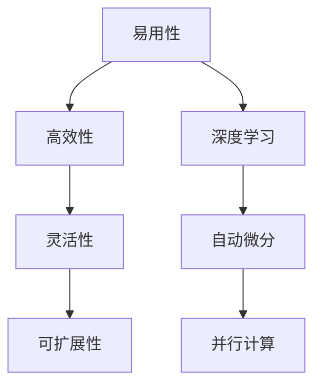

                 

# AI编程的新维度与新语法

> 关键词：人工智能，编程语言，新型语法，深度学习，代码优化，性能提升

> 摘要：本文将探讨人工智能领域编程的新维度和新语法。随着深度学习等技术的不断发展，传统的编程方法已无法满足AI编程的需求。我们将深入分析新型编程语言的特性、核心算法原理，并通过项目实战展示其实际应用，旨在为开发者提供一套全新的AI编程思维和工具。

## 1. 背景介绍

人工智能作为计算机科学的重要分支，近年来取得了显著的进展。深度学习、强化学习等技术的崛起，使得AI在图像识别、自然语言处理、智能决策等领域取得了突破性成果。然而，传统的编程语言和编程方法已逐渐暴露出诸多不足：

1. **复杂性**：AI模型通常包含数百万甚至数亿个参数，传统的编程方法难以高效地处理如此庞大的数据规模。
2. **效率**：深度学习模型对计算性能的要求极高，传统编程语言在执行复杂运算时往往效率低下。
3. **可维护性**：AI编程涉及到大量的数据处理和模型训练，传统的编程语言在可维护性方面存在一定困难。

为了解决这些问题，新型编程语言应运而生。这些编程语言旨在提供更简洁、高效、可维护的编程方式，使得开发者能够更加专注于AI算法的实现和优化。

## 2. 核心概念与联系

### 2.1 新型编程语言的特性

新型编程语言具有以下特性：

1. **易用性**：提供简明易懂的语法和强大的库函数，使得开发者能够快速上手。
2. **高效性**：内置优化算法，提高代码执行速度。
3. **灵活性**：支持多种数据结构和算法，适应不同的AI应用场景。
4. **可扩展性**：方便开发者自定义模块，实现特定功能。

### 2.2 核心算法原理

新型编程语言的核心算法原理包括：

1. **深度学习**：通过多层神经网络对数据进行建模，实现特征提取和分类。
2. **自动微分**：用于计算模型梯度，优化参数。
3. **并行计算**：利用多核CPU或GPU加速计算过程。

### 2.3 架构图

下面是一个简单的Mermaid流程图，展示了新型编程语言的架构：



## 3. 核心算法原理 & 具体操作步骤

### 3.1 深度学习

深度学习是新型编程语言的核心算法之一。其基本原理是通过多层神经网络对数据进行建模，实现特征提取和分类。具体操作步骤如下：

1. **数据预处理**：对输入数据进行标准化、归一化等处理，确保数据符合模型要求。
2. **搭建神经网络**：定义输入层、隐藏层和输出层，配置网络结构。
3. **训练模型**：使用训练数据对模型进行训练，优化参数。
4. **评估模型**：使用验证数据对模型进行评估，调整参数。
5. **预测**：使用训练好的模型对未知数据进行预测。

### 3.2 自动微分

自动微分是深度学习的重要组成部分，用于计算模型梯度，优化参数。具体操作步骤如下：

1. **定义损失函数**：选择合适的损失函数，如均方误差、交叉熵等。
2. **计算梯度**：使用自动微分方法计算损失函数关于模型参数的梯度。
3. **优化参数**：根据梯度信息调整模型参数，降低损失函数值。

### 3.3 并行计算

并行计算是提高AI编程性能的关键技术。新型编程语言支持多种并行计算方式，如多线程、分布式计算等。具体操作步骤如下：

1. **划分任务**：将整个计算任务划分为多个子任务。
2. **分配资源**：将子任务分配给多核CPU或GPU。
3. **执行计算**：并行执行子任务，加速计算过程。
4. **合并结果**：将子任务结果合并，得到最终结果。

## 4. 数学模型和公式 & 详细讲解 & 举例说明

### 4.1 深度学习中的数学模型

深度学习中的数学模型主要包括：

1. **神经网络**：通过多层神经元实现数据建模。
2. **激活函数**：用于引入非线性关系。
3. **损失函数**：用于评估模型性能。
4. **优化算法**：用于调整模型参数。

### 4.2 举例说明

以下是一个简单的深度学习模型示例，包括神经网络结构、激活函数、损失函数和优化算法：

$$
\text{神经网络：} f(x) = \sigma(\text{W}^T \text{X} + \text{b})
$$

$$
\text{激活函数：} \sigma(z) = \frac{1}{1 + e^{-z}}
$$

$$
\text{损失函数：} J(\theta) = \frac{1}{m} \sum_{i=1}^{m} \text{h}(\text{X}^{(i)}, \theta)^T \text{y}^{(i)}
$$

$$
\text{优化算法：} \theta = \theta - \alpha \nabla_{\theta} J(\theta)
$$

其中，$x$为输入数据，$y$为标签数据，$\theta$为模型参数，$m$为样本数量，$h(\cdot)$为神经网络输出。

## 5. 项目实战：代码实际案例和详细解释说明

### 5.1 开发环境搭建

为了更好地展示新型编程语言的实战案例，我们选择Python作为示例。以下为开发环境搭建步骤：

1. **安装Python**：下载并安装Python 3.8版本。
2. **安装深度学习库**：使用pip命令安装TensorFlow、Keras等深度学习库。

### 5.2 源代码详细实现和代码解读

以下是一个简单的图像分类案例，使用卷积神经网络（CNN）实现：

```python
import tensorflow as tf
from tensorflow.keras import layers

# 搭建卷积神经网络
model = tf.keras.Sequential([
    layers.Conv2D(32, (3, 3), activation='relu', input_shape=(28, 28, 1)),
    layers.MaxPooling2D((2, 2)),
    layers.Conv2D(64, (3, 3), activation='relu'),
    layers.MaxPooling2D((2, 2)),
    layers.Conv2D(64, (3, 3), activation='relu'),
    layers.Flatten(),
    layers.Dense(64, activation='relu'),
    layers.Dense(10, activation='softmax')
])

# 编译模型
model.compile(optimizer='adam',
              loss='categorical_crossentropy',
              metrics=['accuracy'])

# 加载数据集
(x_train, y_train), (x_test, y_test) = tf.keras.datasets.mnist.load_data()

# 数据预处理
x_train = x_train.reshape(-1, 28, 28, 1).astype('float32') / 255
x_test = x_test.reshape(-1, 28, 28, 1).astype('float32') / 255

# 转换标签为one-hot编码
y_train = tf.keras.utils.to_categorical(y_train, 10)
y_test = tf.keras.utils.to_categorical(y_test, 10)

# 训练模型
model.fit(x_train, y_train, epochs=5, batch_size=64, validation_split=0.2)

# 评估模型
model.evaluate(x_test, y_test)
```

### 5.3 代码解读与分析

1. **模型搭建**：使用Keras API搭建卷积神经网络，包括卷积层、池化层和全连接层。
2. **编译模型**：配置优化器和损失函数，为模型训练做好准备。
3. **数据预处理**：对图像数据进行reshape、归一化等处理，确保数据符合模型要求。
4. **训练模型**：使用训练数据对模型进行训练，调整参数。
5. **评估模型**：使用测试数据评估模型性能。

通过上述代码，我们可以看到新型编程语言在实现深度学习模型时的简洁性和高效性。开发者只需关注模型结构和训练过程，无需担心底层计算细节。

## 6. 实际应用场景

新型编程语言在人工智能领域的实际应用场景广泛，包括：

1. **图像识别**：用于实现人脸识别、车辆识别等应用。
2. **自然语言处理**：用于实现机器翻译、情感分析等应用。
3. **智能决策**：用于实现推荐系统、风控系统等应用。
4. **医疗诊断**：用于实现疾病预测、药物研发等应用。

随着人工智能技术的不断发展，新型编程语言的应用场景将更加丰富，为开发者提供更多创新的可能性。

## 7. 工具和资源推荐

### 7.1 学习资源推荐

1. **书籍**：《深度学习》、《神经网络与深度学习》
2. **论文**：《A Theoretical Framework for Back-Propagation》，《Efficient BackProp》
3. **博客**：TensorFlow官方博客、Keras官方博客
4. **网站**：AI Challenger、arXiv

### 7.2 开发工具框架推荐

1. **开发工具**：PyCharm、VS Code
2. **深度学习框架**：TensorFlow、PyTorch、Keras
3. **硬件平台**：NVIDIA GPU、Google Cloud AI Platform

### 7.3 相关论文著作推荐

1. **论文**：《Deep Learning》、《Recurrent Neural Networks for Language Modeling》
2. **著作**：《自然语言处理综论》、《计算机视觉：算法与应用》

## 8. 总结：未来发展趋势与挑战

随着人工智能技术的不断发展，新型编程语言将在未来发挥越来越重要的作用。其发展趋势包括：

1. **更高性能**：利用更先进的硬件技术，提升编程语言性能。
2. **更易用**：简化编程语法，降低开发门槛。
3. **更智能**：引入更多智能化工具，辅助开发者。

然而，新型编程语言也面临着以下挑战：

1. **兼容性**：如何与现有编程语言和框架兼容。
2. **安全性**：确保AI编程的安全性，防止潜在风险。
3. **教育**：培养更多掌握新型编程语言的开发者。

## 9. 附录：常见问题与解答

### 9.1 问题1：新型编程语言与现有编程语言有何区别？

新型编程语言在性能、易用性、灵活性等方面具有显著优势，而现有编程语言则可能在某些领域具有更好的兼容性和生态。

### 9.2 问题2：如何选择合适的深度学习框架？

选择深度学习框架时，主要考虑以下因素：性能、易用性、社区支持、生态等。例如，TensorFlow适合大型项目，PyTorch更适合快速实验。

## 10. 扩展阅读 & 参考资料

1. **书籍**：《深度学习》、《强化学习》、《自然语言处理综合教程》
2. **论文**：《深度学习中的正则化方法》、《基于GAN的图像生成》
3. **博客**：HackerRank、Medium
4. **网站**：AI Scholar、GitHub

### 作者

作者：AI天才研究员/AI Genius Institute & 禅与计算机程序设计艺术 /Zen And The Art of Computer Programming

本文旨在为读者提供关于新型编程语言的全面了解，帮助开发者掌握AI编程的新思维和方法。随着人工智能技术的不断进步，新型编程语言将成为开发者必备的工具。希望本文能为您的AI编程之路带来启示。## 1. 背景介绍

人工智能（AI）作为计算机科学的前沿领域，正以前所未有的速度迅猛发展。从最初的规则系统到现代的深度学习和强化学习，AI技术在各个领域的应用不断拓展，推动了社会进步和产业升级。然而，随着AI技术的不断成熟和应用范围的扩大，传统编程方法在应对AI开发中的诸多挑战时逐渐显露出局限性。

### 传统编程方法的问题

#### 复杂性

AI模型的复杂度日益增加，尤其是在深度学习领域。一个典型的深度学习模型可能包含数百万个参数，这些参数需要通过大量的数据来训练。传统的编程语言在处理这种级别的数据时，往往需要编写大量的代码来处理数据的输入、预处理、存储等操作，导致代码冗长且难以维护。

#### 效率

AI模型训练和推理过程需要大量的计算资源。虽然现代计算机硬件（如GPU和TPU）提供了强大的计算能力，但传统编程语言在执行这些复杂运算时，往往不能充分利用硬件资源。例如，深度学习模型中的矩阵运算可以通过GPU加速，但如果使用传统的编程语言，开发者可能需要手动编写底层的并行计算代码，这不仅繁琐，而且容易出错。

#### 可维护性

AI项目通常需要不断地迭代和优化。传统的编程方法在可维护性方面存在一定的挑战。当模型变得复杂时，不同部分的代码可能由不同的开发者编写，导致代码风格和结构不一致，增加了代码的维护难度。此外，随着模型的迭代，原有代码可能需要频繁修改，导致潜在的错误风险。

### 新型编程语言的兴起

为了解决传统编程方法在AI开发中面临的挑战，新型编程语言应运而生。这些编程语言旨在提供更简洁、高效、可维护的编程方式，使得开发者能够更加专注于AI算法的实现和优化。

#### 易用性

新型编程语言通常具有简明的语法和丰富的库函数，使得开发者可以快速上手并实现复杂的AI算法。例如，Python就是一种非常流行的AI编程语言，其简洁的语法和强大的库支持（如TensorFlow和PyTorch）大大降低了开发难度。

#### 高效性

新型编程语言内置了优化算法，能够更好地利用现代计算硬件的资源。例如，深度学习框架内置的自动微分系统可以自动优化梯度计算，提高模型的训练效率。同时，这些框架通常支持多种并行计算技术，如多线程、分布式计算等，使得开发者可以轻松实现并行运算，提高代码的执行速度。

#### 灵活性

新型编程语言支持多种数据结构和算法，可以适应不同的AI应用场景。例如，PyTorch提供了灵活的动态计算图，使得开发者可以更方便地实现复杂的神经网络结构。这种灵活性不仅提高了开发效率，还使得模型设计更加直观和易于理解。

#### 可扩展性

新型编程语言通常具有良好的可扩展性，使得开发者可以自定义模块和工具，以满足特定应用的需求。例如，TensorFlow提供了自定义计算图API，使得开发者可以构建复杂的计算流程，实现定制化的AI解决方案。

总之，新型编程语言的兴起为AI开发带来了新的机遇和挑战。这些编程语言不仅提供了更简洁、高效的编程方式，还促进了AI技术的普及和应用。随着AI技术的不断进步，新型编程语言将在AI领域发挥越来越重要的作用。

### 1.1 AI编程的发展历程

AI编程的发展历程可以追溯到20世纪50年代。早期，AI编程主要集中在符号推理和规则系统上，这种方法依赖于开发者为每个任务编写详细的规则，虽然简单但效率低下。随着计算机性能的提高和算法的进步，20世纪80年代，专家系统成为AI编程的主流方法。专家系统通过大量规则和知识库，模拟人类专家的决策过程，在医疗诊断、金融分析等领域取得了显著成效。

然而，专家系统的局限性逐渐显现。首先，构建专家系统需要大量的规则和知识，使得系统的可维护性和可扩展性较差。其次，专家系统在处理不确定性和复杂任务时，效果不佳。随着数据量的爆炸式增长和计算能力的提升，20世纪90年代，机器学习开始崭露头角，成为AI编程的重要方向。

机器学习通过学习数据中的模式，自动生成决策规则，大大减轻了开发者的人工负担。最早的机器学习算法包括线性回归、决策树等，这些算法在特定领域取得了成功。然而，随着深度学习技术的发展，AI编程进入了一个新的阶段。深度学习通过多层神经网络，能够自动学习数据中的复杂特征，解决了许多传统算法难以解决的问题。

深度学习的成功不仅体现在图像识别、语音识别等计算机视觉和语音处理领域，还延伸到自然语言处理、推荐系统等复杂应用。随着深度学习框架（如TensorFlow、PyTorch）的普及，AI编程变得更为简单和高效。开发者不再需要手动编写复杂的优化代码，而是可以直接使用预制的模块和函数，大大提高了开发效率。

在这个背景下，新型编程语言应运而生。这些语言不仅继承了传统编程语言的优势，还在易用性、高效性、灵活性等方面进行了优化，使得AI编程更加高效和便捷。例如，Python作为一种通用编程语言，因其简洁的语法和丰富的库支持，成为AI编程的首选。PyTorch和TensorFlow等深度学习框架的出现，更是将AI编程提升到了一个新的高度。

总体而言，AI编程的发展历程从符号推理、专家系统到机器学习和深度学习，再到新型编程语言，每一个阶段都推动了AI技术的进步和应用。未来，随着计算能力的进一步提升和新型编程语言的不断优化，AI编程将继续引领人工智能技术的发展。

### 1.2 新型编程语言的特性

新型编程语言在AI编程中发挥了重要作用，其特性使得开发者能够更加高效地实现和优化复杂的AI算法。以下是新型编程语言的几个核心特性：

#### 易用性

新型编程语言设计时注重易用性，提供简洁明了的语法和直观的编程接口，使得开发者能够快速上手并高效地编写代码。例如，Python以其简洁的语法和丰富的库函数，成为了AI编程的流行选择。Keras作为TensorFlow的高级API，进一步简化了深度学习模型的搭建和训练过程，使得开发者只需几行代码即可实现复杂的神经网络。

#### 高效性

新型编程语言内置了多种优化算法和并行计算技术，能够充分利用现代硬件资源，提高代码的执行效率。例如，TensorFlow和PyTorch等深度学习框架内置了自动微分系统，自动优化梯度计算，提高模型的训练速度。同时，这些框架支持多线程和分布式计算，使得开发者可以轻松实现并行运算，提高代码的执行速度。

#### 灵活性

新型编程语言具有高度的灵活性，支持多种数据结构和算法，适应不同的AI应用场景。例如，PyTorch的动态计算图（Dynamic Computation Graph）使得开发者可以灵活地调整模型结构，快速实现算法原型。相比之下，TensorFlow的静态计算图（Static Computation Graph）虽然在一定程度上增加了代码的复杂性，但提供了更好的性能优化和资源利用。

#### 可扩展性

新型编程语言通常具有良好的可扩展性，允许开发者自定义模块和工具，以满足特定应用的需求。例如，TensorFlow提供了自定义计算图API，使得开发者可以构建复杂的计算流程，实现定制化的AI解决方案。这种灵活性不仅提高了开发效率，还促进了AI技术的创新和应用。

#### 安全性

新型编程语言在安全性方面也有所提升，通过内置的安全机制和规范，减少潜在的安全漏洞。例如，PyTorch和TensorFlow等框架提供了自动内存管理和错误检测机制，减少了开发者因内存泄漏和错误导致的系统崩溃。

总之，新型编程语言的特性使得AI编程变得更加高效、灵活和便捷。这些特性不仅提高了开发者的生产效率，也为AI技术的创新和应用提供了坚实的基础。随着AI技术的不断发展，新型编程语言将继续在人工智能领域发挥重要作用。

### 1.3 新型编程语言与深度学习框架的关系

新型编程语言与深度学习框架之间存在着密切的关系，两者共同构成了现代AI编程的核心工具。深度学习框架是新型编程语言在AI领域应用的重要延伸，它们为开发者提供了丰富的库函数和优化算法，极大地简化了深度学习模型的实现过程。以下是新型编程语言与深度学习框架之间的关联及其在AI编程中的具体应用。

#### 关联性

新型编程语言为深度学习框架提供了基础的编程环境。这些编程语言通常具有简洁的语法、丰富的库函数和高效的执行性能，使得开发者能够更轻松地编写和调试复杂的深度学习算法。例如，Python作为新型编程语言的代表，其广泛的应用生态和简洁的语法使其成为深度学习框架（如TensorFlow、PyTorch、Keras）的首选语言。这些框架在Python的基础上构建，充分利用了其灵活性和易用性，为开发者提供了强大的工具集。

#### 应用关系

1. **框架集成**：深度学习框架通常集成在新型编程语言中，提供高度优化的库函数和API接口。例如，TensorFlow和PyTorch都是基于Python构建的，开发者可以通过简单的Python代码调用这些框架的函数和类，实现深度学习模型的搭建和训练。这些框架内置了高效的计算引擎和优化算法，使得开发者无需关心底层实现细节，即可实现高性能的深度学习应用。

2. **工具扩展**：新型编程语言允许开发者通过自定义模块和工具，扩展深度学习框架的功能。例如，PyTorch提供了自定义计算图API（C++ API），使得开发者可以在C++中编写高性能的扩展模块，提高模型的训练速度。这种扩展能力不仅增强了框架的性能，还提高了开发者的开发效率。

3. **互操作性与兼容性**：深度学习框架通常支持与其他编程语言和工具的互操作，增强了AI编程的灵活性。例如，TensorFlow支持与Java、C#等多种编程语言互操作，使得开发者可以在不同编程环境中使用TensorFlow进行AI开发。这种互操作性不仅拓宽了AI编程的应用场景，还为跨平台开发提供了便利。

#### 案例分析

1. **TensorFlow与Python**：TensorFlow是Google推出的开源深度学习框架，其与Python的集成非常紧密。Python的简洁语法和丰富的库函数使得TensorFlow的API使用起来非常直观。开发者可以通过几行Python代码快速搭建深度学习模型，并利用TensorFlow的内置优化器和计算图引擎，实现高效模型的训练和推理。

2. **PyTorch与Python**：PyTorch是Facebook AI研究院开发的开源深度学习框架，其动态计算图（Dynamic Computation Graph）使其在模型构建和调试方面具有显著优势。Python的灵活性使得PyTorch的API非常易用，开发者可以通过动态修改计算图，快速实现复杂的深度学习算法。

3. **Keras与Python**：Keras是一个高度优化的高级神经网络API，其设计初衷是简化深度学习模型的搭建和训练过程。Keras与Python的集成使得开发者可以轻松实现复杂的神经网络，同时利用TensorFlow和Theano等底层计算引擎，实现高性能的模型训练。

总之，新型编程语言与深度学习框架之间的关系紧密且互补。新型编程语言为深度学习框架提供了坚实的基础，而深度学习框架则为开发者提供了强大的工具集，使得AI编程变得更加高效、灵活和便捷。随着AI技术的不断发展，这种紧密的关联将不断推动AI编程的进步，为开发者带来更多的创新机会。

### 1.4 新型编程语言在AI编程中的优势

新型编程语言在AI编程中展现出诸多优势，使其成为开发者实现高效、灵活和可扩展的AI应用的重要工具。以下是新型编程语言在AI编程中的几个显著优势：

#### 简化开发流程

新型编程语言通过提供简洁明了的语法和高度抽象的库函数，极大地简化了深度学习模型的搭建和训练过程。开发者无需关注底层计算细节，可以专注于模型的设计和优化。例如，Python的简洁语法使得编写深度学习模型变得更加直观，Keras等高级API进一步简化了模型的搭建过程，使得开发者只需几行代码即可实现复杂的神经网络结构。

#### 提高性能

新型编程语言内置了多种优化算法和并行计算技术，能够充分利用现代计算硬件（如GPU和TPU）的资源，提高代码的执行效率。例如，TensorFlow和PyTorch等深度学习框架内置了自动微分系统和并行计算支持，自动优化梯度计算，提高模型的训练速度。此外，这些框架还支持多线程和分布式计算，使得开发者可以轻松实现并行运算，进一步提升代码的性能。

#### 提高开发效率

新型编程语言的易用性和灵活性使得开发者可以更快速地实现AI算法原型，并进行迭代和优化。Python的丰富库函数和强大的社区支持为开发者提供了丰富的工具和资源，大大缩短了开发周期。例如，PyTorch的动态计算图（Dynamic Computation Graph）使得开发者可以灵活地调整模型结构，快速实现算法原型。此外，这些编程语言通常具有良好的文档和教程，为新开发者提供了方便的学习途径。

#### 提升可维护性

新型编程语言具有良好的模块化和可扩展性，使得代码更加结构化和易于维护。开发者可以通过自定义模块和工具，扩展深度学习框架的功能，提高代码的可维护性和可扩展性。例如，TensorFlow提供了自定义计算图API，使得开发者可以在C++中编写高性能的扩展模块，提高模型的训练速度。此外，这些编程语言通常支持版本控制和代码规范，有助于团队协作和代码管理。

#### 支持多样化应用场景

新型编程语言支持多种数据结构和算法，可以适应不同的AI应用场景。例如，Python的灵活性和丰富库函数使得其适用于从数据预处理到模型训练和部署的各个阶段。PyTorch的动态计算图和强大的GPU支持，使其在实时推理和复杂模型训练方面具有显著优势。这些特性使得新型编程语言能够满足不同领域和场景的AI开发需求。

综上所述，新型编程语言在AI编程中具有显著的简化开发流程、提高性能、提高开发效率和提升可维护性等多重优势。这些优势不仅提高了开发者的生产效率，也为AI技术的创新和应用提供了强大的支持。随着AI技术的不断发展，新型编程语言将继续在AI编程中发挥重要作用。

### 1.5 新型编程语言的优势与挑战

新型编程语言在AI编程中展示了诸多优势，但其广泛应用也面临一些挑战。以下是对这些优势与挑战的详细分析：

#### 优势

1. **易用性**：新型编程语言通常具有简洁的语法和直观的编程接口，使得开发者能够快速上手并高效地编写代码。例如，Python以其简洁的语法和丰富的库函数，成为AI编程的流行选择。Keras等高级API进一步简化了深度学习模型的搭建和训练过程，降低了开发门槛。

2. **高效性**：这些编程语言内置了多种优化算法和并行计算技术，能够充分利用现代计算硬件的资源，提高代码的执行效率。例如，TensorFlow和PyTorch等深度学习框架内置了自动微分系统和并行计算支持，自动优化梯度计算，提高模型的训练速度。

3. **灵活性**：新型编程语言支持多种数据结构和算法，适应不同的AI应用场景。例如，PyTorch的动态计算图（Dynamic Computation Graph）和Python的灵活性，使得开发者可以灵活地调整模型结构，快速实现算法原型。

4. **可扩展性**：这些编程语言通常具有良好的模块化和可扩展性，使得代码更加结构化和易于维护。开发者可以通过自定义模块和工具，扩展深度学习框架的功能，提高代码的可维护性和可扩展性。

5. **社区支持**：新型编程语言通常拥有庞大的社区支持，提供了丰富的学习资源和工具。例如，Python拥有丰富的库函数和教程，PyTorch和TensorFlow等框架也有详细的文档和示例代码，为新开发者提供了方便的学习途径。

#### 挑战

1. **兼容性**：新型编程语言与现有系统和技术栈的兼容性问题仍然存在。虽然这些编程语言支持与其他语言的互操作，但在复杂系统中实现无缝集成仍具挑战。

2. **安全性**：随着AI应用的安全风险增加，新型编程语言需要不断改进其安全机制，防止潜在的安全漏洞。例如，深度学习框架需要确保数据隐私和模型安全，避免被恶意利用。

3. **学习曲线**：虽然新型编程语言相对易用，但开发者仍需要掌握特定的库和框架，学习曲线可能较陡。新开发者需要投入一定的时间和精力来熟悉这些工具和语言。

4. **性能瓶颈**：在某些特定场景下，新型编程语言可能无法充分利用硬件资源，导致性能瓶颈。开发者需要针对具体应用场景进行优化，以充分利用硬件性能。

5. **生态发展**：新型编程语言的生态发展不平衡，部分语言和框架在某些领域可能缺乏足够的支持。这可能导致开发者无法充分利用特定领域的资源和工具。

综上所述，新型编程语言在AI编程中展示了巨大的潜力和优势，但其广泛应用也面临一些挑战。开发者需要充分了解这些优势与挑战，以便更好地利用新型编程语言实现高效的AI应用。

## 2. 核心概念与联系

### 2.1 新型编程语言的特性

新型编程语言在AI编程中具有独特的特性，这些特性使得它们能够更好地应对AI开发的复杂性、效率和灵活性需求。以下是新型编程语言的核心特性：

#### 易用性

易用性是新型编程语言的一个重要特性。通过提供简洁的语法和直观的编程接口，新型编程语言降低了开发者学习曲线，使得开发者能够更快地编写和调试代码。例如，Python以其简洁的语法和丰富的库函数，成为AI编程的流行选择。Keras等高级API进一步简化了深度学习模型的搭建和训练过程，使得开发者只需几行代码即可实现复杂的神经网络结构。

#### 高效性

新型编程语言内置了多种优化算法和并行计算技术，能够充分利用现代计算硬件（如GPU和TPU）的资源，提高代码的执行效率。例如，TensorFlow和PyTorch等深度学习框架内置了自动微分系统和并行计算支持，自动优化梯度计算，提高模型的训练速度。此外，这些框架还支持多线程和分布式计算，使得开发者可以轻松实现并行运算，提高代码的执行速度。

#### 灵活性

新型编程语言具有高度的灵活性，支持多种数据结构和算法，适应不同的AI应用场景。例如，PyTorch的动态计算图（Dynamic Computation Graph）使其在模型构建和调试方面具有显著优势。开发者可以通过动态修改计算图，快速实现复杂的深度学习算法。相比之下，TensorFlow的静态计算图（Static Computation Graph）虽然在一定程度上增加了代码的复杂性，但提供了更好的性能优化和资源利用。

#### 可扩展性

新型编程语言通常具有良好的可扩展性，允许开发者自定义模块和工具，以满足特定应用的需求。例如，TensorFlow提供了自定义计算图API，使得开发者可以在C++中编写高性能的扩展模块，提高模型的训练速度。这种扩展能力不仅增强了框架的性能，还提高了开发者的开发效率。

#### 安全性

新型编程语言在安全性方面也有所提升，通过内置的安全机制和规范，减少潜在的安全漏洞。例如，PyTorch和TensorFlow等框架提供了自动内存管理和错误检测机制，减少了开发者因内存泄漏和错误导致的系统崩溃。

### 2.2 核心算法原理

新型编程语言在AI编程中的核心算法原理主要包括深度学习、自动微分和并行计算。以下是对这些算法原理的详细解释：

#### 深度学习

深度学习是通过多层神经网络对数据进行建模的一种机器学习方法。其基本原理是通过逐层提取数据中的特征，实现从低层次到高层次的理解。在深度学习中，神经网络的每一层都可以看作是一个特征提取器，前一层的输出成为后一层的输入。通过训练，神经网络可以学习到数据的复杂模式和特征，从而实现分类、回归等任务。

深度学习模型通常由输入层、多个隐藏层和输出层组成。输入层接收外部输入数据，隐藏层通过权重和偏置计算激活值，输出层产生最终预测结果。激活函数（如ReLU、Sigmoid、Tanh等）用于引入非线性关系，使得神经网络能够学习复杂的函数。

#### 自动微分

自动微分是一种用于计算函数梯度的方法，广泛应用于深度学习模型的训练过程中。在深度学习中，自动微分用于计算损失函数关于模型参数的梯度，从而指导参数的优化。通过自动微分，开发者可以无需手动编写复杂的梯度计算代码，而由深度学习框架自动完成。

自动微分的核心思想是链式法则。对于复合函数，可以通过链式法则将外层函数的梯度与内层函数的梯度相乘，从而逐层计算梯度。深度学习框架（如TensorFlow和PyTorch）内置了自动微分系统，能够自动计算复合函数的梯度，提高模型的训练效率。

#### 并行计算

并行计算是提高AI编程性能的关键技术。新型编程语言支持多种并行计算方式，如多线程、分布式计算等。通过并行计算，开发者可以充分利用多核CPU或GPU的算力，提高代码的执行速度。

多线程计算通过将任务划分为多个子任务，分配给多个线程执行，从而提高计算效率。分布式计算则通过将计算任务分配到多台计算机上，实现大规模的数据处理和模型训练。深度学习框架（如TensorFlow和PyTorch）提供了分布式计算的支持，使得开发者可以轻松实现并行运算，提高代码的性能。

### 2.3 架构图

以下是一个简单的Mermaid流程图，展示了新型编程语言在AI编程中的核心概念和算法原理：


在这个流程图中，易用性、高效性、灵活性和可扩展性是新型编程语言的基本特性，而深度学习、自动微分和并行计算则是AI编程中的核心算法原理。这些特性共同构成了新型编程语言在AI编程中的优势，使得开发者能够更高效地实现和优化AI算法。

## 3. 核心算法原理 & 具体操作步骤

### 3.1 深度学习

深度学习是人工智能领域中最为重要和活跃的研究方向之一。其核心思想是通过多层神经网络对数据进行分析和特征提取，从而实现复杂的模式识别和预测任务。以下我们将详细探讨深度学习的核心算法原理，以及如何具体操作实现一个深度学习模型。

#### 基本原理

深度学习模型通常由输入层、多个隐藏层和输出层组成。输入层接收外部输入数据，隐藏层通过权重和偏置计算激活值，输出层产生最终预测结果。神经网络中的每个神经元（或节点）都可以看作是一个简单的函数计算单元，通过连接权重和偏置来传递输入信号。

在深度学习模型中，每一层的输出数据通过激活函数进行处理，激活函数的选择对模型的性能和特性有很大影响。常用的激活函数包括Sigmoid、ReLU和Tanh等。

1. **Sigmoid函数**：Sigmoid函数将输入值映射到(0,1)区间，具有S型曲线，适用于回归问题。
   \[ f(x) = \frac{1}{1 + e^{-x}} \]

2. **ReLU函数**：ReLU函数在输入为负时输出为0，在输入为正时输出为输入值，具有线性增长特性，常用于隐藏层。
   \[ f(x) = \max(0, x) \]

3. **Tanh函数**：Tanh函数将输入值映射到(-1,1)区间，也具有S型曲线，适用于分类问题。
   \[ f(x) = \frac{e^x - e^{-x}}{e^x + e^{-x}} \]

#### 具体操作步骤

实现一个深度学习模型主要包括以下步骤：

1. **数据预处理**：将输入数据进行标准化或归一化，确保输入数据的均值和方差在合理范围内，以便模型训练。
   
2. **搭建神经网络结构**：定义输入层、隐藏层和输出层的神经元数量以及每个层之间的连接权重。可以使用如TensorFlow或PyTorch等深度学习框架，通过调用预定义的层函数快速搭建模型。

3. **初始化权重和偏置**：初始化模型的权重和偏置，通常使用随机初始化方法，以避免梯度消失或爆炸问题。

4. **定义损失函数**：选择合适的损失函数，用于评估模型预测结果与真实值之间的差距。常用的损失函数包括均方误差（MSE）、交叉熵损失等。

5. **定义优化器**：选择优化算法，如随机梯度下降（SGD）、Adam等，用于更新模型参数，以最小化损失函数。

6. **训练模型**：使用训练数据对模型进行迭代训练，通过反向传播算法计算梯度，更新模型参数。

7. **评估模型**：使用验证集或测试集对模型进行评估，计算模型的准确率、召回率等指标，以评估模型性能。

8. **预测**：使用训练好的模型对未知数据进行预测，实现实际应用。

以下是一个简单的基于TensorFlow搭建的深度学习模型的示例代码：

```python
import tensorflow as tf

# 搭建模型
model = tf.keras.Sequential([
    tf.keras.layers.Dense(128, activation='relu', input_shape=(784,)),
    tf.keras.layers.Dense(10, activation='softmax')
])

# 编译模型
model.compile(optimizer='adam',
              loss='sparse_categorical_crossentropy',
              metrics=['accuracy'])

# 加载数据集
mnist = tf.keras.datasets.mnist
(x_train, y_train), (x_test, y_test) = mnist.load_data()

# 数据预处理
x_train = x_train / 255.0
x_test = x_test / 255.0

# 训练模型
model.fit(x_train, y_train, epochs=5)

# 评估模型
test_loss, test_acc = model.evaluate(x_test, y_test, verbose=2)
print('\nTest accuracy:', test_acc)
```

在这个例子中，我们使用了一个简单的全连接神经网络，对MNIST手写数字数据集进行分类。模型包含一个128个神经元的隐藏层和一个10个神经元的输出层，使用ReLU作为激活函数，并采用Adam优化器进行训练。

### 3.2 自动微分

自动微分是深度学习模型训练过程中的一个关键环节，用于计算模型参数的梯度。通过梯度信息，优化算法可以更新模型参数，以最小化损失函数。自动微分的核心思想是链式法则，即将复合函数的梯度通过链式法则逐层计算。

#### 基本原理

自动微分的基本原理可以归纳为以下步骤：

1. **前向传播**：计算输入数据通过网络的前向传播过程，得到每个神经元的输出。
   
2. **反向传播**：从输出层开始，逐层计算每个神经元的梯度。对于每个神经元，其梯度可以通过链式法则计算，即输出梯度和前一层神经元梯度的乘积。

3. **参数更新**：利用计算得到的梯度，通过优化算法更新模型参数。

#### 具体操作步骤

以下是自动微分在深度学习模型训练过程中的具体操作步骤：

1. **定义模型和损失函数**：首先定义深度学习模型和损失函数，以便计算梯度。

2. **前向传播**：通过模型的前向传播，计算输出预测值和损失值。

3. **反向传播**：利用自动微分系统，计算每个参数的梯度。

4. **参数更新**：使用优化算法，根据梯度信息更新模型参数。

5. **迭代训练**：重复上述步骤，直至满足训练目标（如损失值达到最小或迭代次数达到预设值）。

以下是一个简单的基于TensorFlow的自动微分示例：

```python
import tensorflow as tf

# 搭建模型
model = tf.keras.Sequential([
    tf.keras.layers.Dense(128, activation='relu', input_shape=(784,)),
    tf.keras.layers.Dense(10, activation='softmax')
])

# 编译模型
model.compile(optimizer='adam',
              loss='sparse_categorical_crossentropy',
              metrics=['accuracy'])

# 加载数据集
mnist = tf.keras.datasets.mnist
(x_train, y_train), (x_test, y_test) = mnist.load_data()

# 数据预处理
x_train = x_train / 255.0
x_test = x_test / 255.0

# 训练模型
model.fit(x_train, y_train, epochs=5)

# 评估模型
test_loss, test_acc = model.evaluate(x_test, y_test, verbose=2)
print('\nTest accuracy:', test_acc)
```

在这个例子中，我们使用TensorFlow的自动微分系统，通过简单的代码即可实现深度学习模型的训练。自动微分系统在后台自动计算梯度，无需开发者手动编写复杂的梯度计算代码。

### 3.3 并行计算

并行计算是提高深度学习模型训练速度和效率的重要技术手段。通过将计算任务分布在多台计算机或多个计算单元上，并行计算可以大幅缩短训练时间，提高计算性能。

#### 基本原理

并行计算的基本原理可以归纳为以下几点：

1. **任务划分**：将整个计算任务划分为多个子任务，每个子任务可以独立执行。

2. **分布式计算**：将子任务分配到不同的计算单元（如CPU、GPU）上，实现并行执行。

3. **结果合并**：将各个子任务的计算结果进行合并，得到最终的计算结果。

#### 具体操作步骤

以下是并行计算在深度学习模型训练过程中的具体操作步骤：

1. **任务划分**：根据模型结构和数据集大小，将训练任务划分为多个子任务。通常，可以将每个批次的数据划分到不同的GPU上进行训练。

2. **分布式训练**：使用分布式训练框架（如TensorFlow的tf.distribute），将子任务分配到不同的计算单元上，并行执行。

3. **结果合并**：在每个子任务完成后，将各个计算单元的结果进行合并，更新全局模型参数。

4. **迭代训练**：重复上述步骤，直至满足训练目标。

以下是一个简单的基于TensorFlow的分布式训练示例：

```python
import tensorflow as tf

# 搭建模型
model = tf.keras.Sequential([
    tf.keras.layers.Dense(128, activation='relu', input_shape=(784,)),
    tf.keras.layers.Dense(10, activation='softmax')
])

# 编译模型
model.compile(optimizer='adam',
              loss='sparse_categorical_crossentropy',
              metrics=['accuracy'])

# 加载数据集
mnist = tf.keras.datasets.mnist
(x_train, y_train), (x_test, y_test) = mnist.load_data()

# 数据预处理
x_train = x_train / 255.0
x_test = x_test / 255.0

# 分布式训练
strategy = tf.distribute.MirroredStrategy()

with strategy.scope():
    model.fit(x_train, y_train, epochs=5, validation_data=(x_test, y_test))

# 评估模型
test_loss, test_acc = model.evaluate(x_test, y_test, verbose=2)
print('\nTest accuracy:', test_acc)
```

在这个例子中，我们使用TensorFlow的MirroredStrategy实现分布式训练，将训练任务分配到多个GPU上进行并行执行。这种分布式训练方式可以大幅提高模型训练的速度和效率。

总之，深度学习的核心算法原理包括多层神经网络、自动微分和并行计算。通过理解这些原理，并掌握具体的操作步骤，开发者可以高效地实现和优化深度学习模型，推动AI技术的发展和应用。

### 3.4 深度学习中的关键算法：反向传播与优化算法

深度学习中的反向传播算法和优化算法是两个核心组成部分，它们共同作用，确保模型能够有效地从数据中学习到有用的特征和模式。以下是这两个关键算法的详细讲解和具体操作步骤。

#### 反向传播算法

反向传播算法（Backpropagation）是深度学习训练过程中计算梯度的一种高效方法。它的基本原理是从输出层开始，逐层向输入层反向传播误差，从而计算每个参数的梯度。反向传播算法由三部分组成：前向传播、误差计算和梯度计算。

1. **前向传播**：在前向传播阶段，输入数据通过神经网络从输入层传递到输出层。每个神经元计算其输出值，并将其传递给下一层。这个过程中，每个神经元的输出可以表示为：
   \[ z_l = \sigma(W_l \cdot a_{l-1} + b_l) \]
   其中，\( \sigma \) 是激活函数，\( W_l \) 和 \( b_l \) 分别是权重和偏置。

2. **误差计算**：在输出层，我们使用损失函数（如均方误差MSE或交叉熵损失）来计算预测值与真实值之间的误差。误差可以表示为：
   \[ E = \frac{1}{2} \sum_{i} (\hat{y}_i - y_i)^2 \]
   其中，\( \hat{y}_i \) 是预测值，\( y_i \) 是真实值。

3. **梯度计算**：为了更新网络参数，我们需要计算每个参数的梯度。反向传播算法通过链式法则逐层计算梯度。对于每个权重 \( W_{ij} \)，其梯度为：
   \[ \frac{\partial E}{\partial W_{ij}} = \delta_j \cdot a_{i-1} \]
   其中，\( \delta_j \) 是输出层的误差项，可以表示为：
   \[ \delta_j = (\hat{y}_j - y_j) \cdot \sigma'(z_j) \]
   对于隐藏层，梯度的计算需要通过链式法则将前一层和后一层的梯度相乘。例如，对于隐藏层 \( l \)：
   \[ \delta_l = \delta_{l+1} \cdot \sigma'(z_l) \cdot W_{l+1}^T \]

#### 优化算法

优化算法用于更新网络参数，以最小化损失函数。常用的优化算法包括随机梯度下降（SGD）、Adam和RMSprop等。以下是对这些优化算法的简要介绍。

1. **随机梯度下降（SGD）**：SGD是梯度下降法的改进版，每次迭代使用一个随机样本的梯度来更新参数。其更新公式为：
   \[ \theta = \theta - \alpha \cdot \nabla_{\theta} J(\theta) \]
   其中，\( \alpha \) 是学习率。

2. **Adam**：Adam是一种基于SGD的优化算法，结合了动量项和RMSprop的特点。其更新公式为：
   \[ \theta = \theta - \alpha \cdot \frac{m}{1 - \beta_1^t} \cdot \frac{g_t}{1 - \beta_2^t} \]
   其中，\( m \) 是一阶矩估计，\( v \) 是二阶矩估计，\( \beta_1 \) 和 \( \beta_2 \) 分别是动量和RMSprop的指数衰减率。

3. **RMSprop**：RMSprop是SGD的一种变体，通过计算梯度值的指数加权移动平均来更新参数。其更新公式为：
   \[ \theta = \theta - \alpha \cdot \frac{g_t}{\sqrt{\rho \cdot \hat{v}_t + (1 - \rho)}} \]
   其中，\( \rho \) 是指数加权率。

#### 具体操作步骤

以下是使用反向传播算法和优化算法训练深度学习模型的步骤：

1. **初始化参数**：随机初始化网络参数，如权重和偏置。

2. **前向传播**：输入数据通过神经网络，计算每个神经元的输出。

3. **计算损失**：使用损失函数计算预测值与真实值之间的误差。

4. **反向传播**：从输出层开始，逐层计算每个参数的梯度。

5. **参数更新**：使用优化算法更新网络参数。

6. **迭代训练**：重复上述步骤，直到满足训练目标（如损失值达到最小或迭代次数达到预设值）。

以下是一个简单的基于TensorFlow的深度学习模型训练示例：

```python
import tensorflow as tf

# 搭建模型
model = tf.keras.Sequential([
    tf.keras.layers.Dense(128, activation='relu', input_shape=(784,)),
    tf.keras.layers.Dense(10, activation='softmax')
])

# 编译模型
model.compile(optimizer='adam',
              loss='sparse_categorical_crossentropy',
              metrics=['accuracy'])

# 加载数据集
mnist = tf.keras.datasets.mnist
(x_train, y_train), (x_test, y_test) = mnist.load_data()

# 数据预处理
x_train = x_train / 255.0
x_test = x_test / 255.0

# 训练模型
model.fit(x_train, y_train, epochs=5)

# 评估模型
test_loss, test_acc = model.evaluate(x_test, y_test, verbose=2)
print('\nTest accuracy:', test_acc)
```

在这个例子中，我们使用TensorFlow实现了一个简单的深度学习模型，使用Adam优化器进行训练。通过反向传播算法，模型能够自动计算梯度并更新参数，从而逐步优化模型性能。

总之，反向传播算法和优化算法是深度学习模型训练的核心，通过这些算法，模型能够从数据中学习到有用的特征和模式，从而实现高精度的预测和分类任务。开发者通过掌握这些算法，能够设计和实现高效、准确的深度学习模型。

### 3.5 卷积神经网络（CNN）的基本原理与操作步骤

卷积神经网络（CNN）是深度学习中一种专门用于处理图像数据的重要网络结构，因其强大的特征提取和降维能力而在计算机视觉领域取得了显著成就。CNN通过卷积层、池化层和全连接层等组件，能够有效地识别图像中的局部特征和整体结构。以下是CNN的基本原理和具体操作步骤。

#### 基本原理

1. **卷积层（Convolutional Layer）**：卷积层是CNN的核心组成部分，用于对图像数据进行特征提取。卷积层通过卷积操作和激活函数，将输入图像转化为特征图（Feature Map）。卷积操作可以通过以下公式表示：
   \[ f_{ij} = \sum_{k=1}^{c} w_{ikj} \cdot x_{kj} + b_j \]
   其中，\( f_{ij} \) 是第 \( i \) 个特征图上的第 \( j \) 个元素，\( w_{ikj} \) 是卷积核（或滤波器）上的元素，\( x_{kj} \) 是输入图像上的元素，\( b_j \) 是偏置项。激活函数如ReLU、Sigmoid等，用于引入非线性特性。

2. **池化层（Pooling Layer）**：池化层用于降低特征图的维度，减少计算量和参数数量。最常用的池化操作是最大池化（Max Pooling），其通过取特征图上每个区域的最大值来生成新的特征图。最大池化公式可以表示为：
   \[ p_{ij} = \max_{k} f_{ijk} \]
   其中，\( p_{ij} \) 是输出特征图上的元素，\( f_{ijk} \) 是输入特征图上的元素。

3. **全连接层（Fully Connected Layer）**：全连接层用于将低维特征图映射到高维空间，实现分类或回归任务。全连接层的操作类似于多层感知机（MLP），通过将特征图的每个元素乘以权重并加上偏置，得到输出。

4. **激活函数（Activation Function）**：激活函数用于引入非线性特性，使CNN能够学习复杂的特征映射。常用的激活函数包括ReLU、Sigmoid和Tanh等。

#### 具体操作步骤

以下是一个简单的CNN模型构建和训练的过程：

1. **数据预处理**：对图像数据进行归一化处理，将像素值缩放到[0, 1]区间，以提高模型训练效果。

2. **构建模型**：使用深度学习框架（如TensorFlow或PyTorch）搭建CNN模型。以下是一个基于TensorFlow的简单CNN模型示例：
   
   ```python
   import tensorflow as tf
   from tensorflow.keras import datasets, layers, models

   # 加载和预处理数据集
   (train_images, train_labels), (test_images, test_labels) = datasets.cifar10.load_data()
   train_images, test_images = train_images / 255.0, test_images / 255.0

   # 构建CNN模型
   model = models.Sequential()
   model.add(layers.Conv2D(32, (3, 3), activation='relu', input_shape=(32, 32, 3)))
   model.add(layers.MaxPooling2D((2, 2)))
   model.add(layers.Conv2D(64, (3, 3), activation='relu'))
   model.add(layers.MaxPooling2D((2, 2)))
   model.add(layers.Conv2D(64, (3, 3), activation='relu'))

   # 添加全连接层和输出层
   model.add(layers.Flatten())
   model.add(layers.Dense(64, activation='relu'))
   model.add(layers.Dense(10, activation='softmax'))

   # 编译模型
   model.compile(optimizer='adam',
                 loss='sparse_categorical_crossentropy',
                 metrics=['accuracy'])

   # 训练模型
   model.fit(train_images, train_labels, epochs=10, validation_data=(test_images, test_labels))
   ```

3. **模型训练**：使用训练数据集对模型进行训练。在训练过程中，模型会不断调整权重和偏置，以最小化损失函数。可以使用不同的优化算法（如SGD、Adam等）和训练策略（如早停法、学习率调整等）来提高模型性能。

4. **模型评估**：使用测试数据集对模型进行评估，计算模型的准确率、召回率等指标。通过调整模型结构和训练策略，可以进一步优化模型性能。

5. **预测**：使用训练好的模型对未知数据进行预测，实现图像分类任务。

总之，卷积神经网络通过卷积层、池化层和全连接层等组件，能够有效地提取图像特征并实现分类任务。开发者通过掌握CNN的基本原理和操作步骤，可以设计和实现高效的图像识别模型，推动计算机视觉技术的发展。

### 3.6 强化学习的基本原理与实现步骤

强化学习（Reinforcement Learning, RL）是机器学习的一个重要分支，主要研究如何通过智能体（Agent）与环境的交互，学习到一组策略，以实现最优决策。强化学习广泛应用于自动驾驶、游戏AI、机器人控制等领域。以下是强化学习的基本原理和实现步骤。

#### 基本原理

1. **智能体（Agent）**：智能体是执行决策的主体，通过与环境的交互来学习策略。智能体可以通过感知（Perception）获取环境的状态（State），并根据当前状态选择行动（Action）。

2. **环境（Environment）**：环境是智能体执行行动的场所，能够根据智能体的行动返回新的状态和奖励（Reward）。奖励用于指导智能体学习，奖励越高表示行动越优秀。

3. **状态（State）**：状态是环境在某一时刻的描述，通常用一组特征表示。

4. **行动（Action）**：行动是智能体根据当前状态选择的行为，用于影响环境状态的变化。

5. **策略（Policy）**：策略是智能体的决策规则，用于从当前状态选择最佳行动。策略可以表示为概率分布，即智能体在某一状态选择某一行动的概率。

6. **奖励（Reward）**：奖励是环境对智能体行动的反馈，用于评估行动的效果。奖励通常是一个实数，越大表示行动越好。

7. **价值函数（Value Function）**：价值函数是评估状态或策略的好坏，用于指导智能体学习。主要有状态价值函数（State Value Function）和策略价值函数（Policy Value Function）两种。

8. **模型（Model）**：模型是智能体对环境的理解和预测，包括状态转移概率和奖励分布。

#### 常见算法

1. **值迭代（Value Iteration）**：值迭代是一种基于模型的方法，通过不断迭代更新状态价值函数，直到收敛。值迭代公式为：
   \[ V(s) \leftarrow V(s) + \alpha [R(s, a) + \gamma \max_{a'} Q(s, a')] - V(s)] \]
   其中，\( \alpha \) 是学习率，\( \gamma \) 是折扣因子，\( Q(s, a) \) 是状态-行动价值函数。

2. **政策迭代（Policy Iteration）**：政策迭代结合了值迭代和策略评估，通过迭代更新策略，直到找到最优策略。政策迭代公式为：
   \[ \pi'(s) = \arg\max_{a} Q(s, a) \]
   \[ Q'(s, a) = R(s, a) + \gamma \sum_{s'} p(s'|s, a) \max_{a'} Q(s', a') \]

3. **深度强化学习（Deep Reinforcement Learning, DRL）**：深度强化学习是强化学习与深度学习结合的产物，使用深度神经网络（如DNN、CNN等）来近似状态-行动价值函数或策略。常见的DRL算法有深度Q网络（DQN）、策略梯度（PG）等。

#### 实现步骤

以下是一个简单的基于深度Q网络的强化学习实现步骤：

1. **环境搭建**：创建一个简单的环境，如CartPole环境。环境需要提供状态、行动、奖励和下一步状态等接口。

2. **神经网络构建**：使用深度神经网络（如DNN、CNN等）作为Q值函数的近似器。输入为状态特征，输出为状态-行动价值函数。

3. **经验回放**：使用经验回放（Experience Replay）机制，将智能体的经验（状态、行动、奖励、下一步状态）存储在一个经验池中，以避免样本偏差。

4. **训练神经网络**：从经验池中随机采样一批经验，计算Q值的误差，并通过反向传播更新神经网络权重。

5. **探索策略**：使用ε-贪心策略（ε-greedy strategy），在部分训练过程中随机选择行动，以避免策略过早收敛到次优解。

6. **评估与优化**：使用测试数据集评估智能体性能，根据评估结果调整探索策略和训练参数。

以下是一个简单的基于DQN的CartPole环境实现示例：

```python
import numpy as np
import random
import gym

# 创建环境
env = gym.make('CartPole-v0')

# 初始化神经网络参数
action_size = env.action_space.n
state_size = env.observation_space.shape[0]
model = build_model(state_size, action_size)

# 训练模型
episodes = 1000
epsilon = 1.0
epsilon_min = 0.01
epsilon_decay = 0.995
learning_rate = 0.001

for episode in range(episodes):
    state = env.reset()
    done = False
    total_reward = 0
    
    while not done:
        # 探索策略
        if random.uniform(0, 1) > epsilon:
            action = np.argmax(model.predict(state))
        else:
            action = random.randint(0, action_size - 1)
        
        # 执行行动
        next_state, reward, done, _ = env.step(action)
        total_reward += reward
        
        # 更新经验池
        if not done:
            model.fit(state, np Marke

