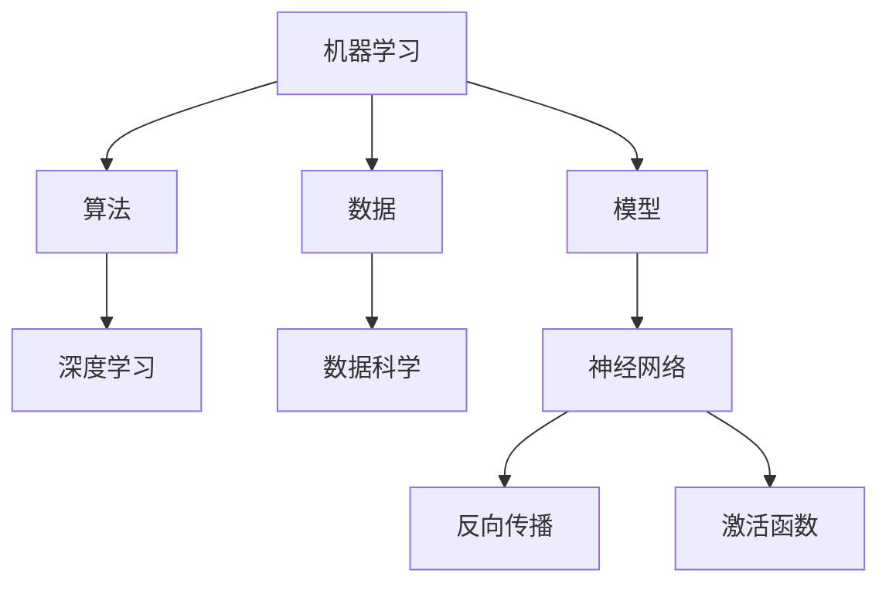

                 

# AI编程的新语言与新视野

> **关键词：** 人工智能，编程语言，创新，技术发展，未来趋势

> **摘要：** 本文将深入探讨AI编程的新语言，探讨其在技术发展中的关键作用，及其带来的广阔视野。通过分析新语言的核心概念、算法原理、数学模型，并结合实际项目案例，我们将全面了解AI编程的新趋势，并展望未来可能面临的挑战。

## 1. 背景介绍

随着人工智能（AI）技术的迅猛发展，编程语言也在不断进化。传统编程语言如C、Java等在AI领域的应用受到诸多限制，难以满足复杂算法和数据处理的需求。为了应对这一挑战，新一代AI编程语言应运而生，它们不仅具备高效性，还提供了丰富的功能和强大的扩展性。这些新语言的出现，标志着AI编程进入了一个全新的阶段，为开发者和研究者提供了更广阔的视野。

本文旨在探讨这些新语言的核心概念、原理和应用，帮助读者了解AI编程的未来趋势。我们将从以下几个方面展开：

1. 核心概念与联系
2. 核心算法原理与具体操作步骤
3. 数学模型和公式
4. 项目实战：代码实际案例和详细解释说明
5. 实际应用场景
6. 工具和资源推荐
7. 总结：未来发展趋势与挑战

通过以上内容的讲解，我们将对AI编程的新语言有一个全面的认识，并能够把握其发展的脉络。

## 2. 核心概念与联系

要理解AI编程的新语言，我们首先需要明确几个核心概念。这些概念不仅构成了新语言的基础，也是AI技术发展的重要支撑。

### 2.1 机器学习

机器学习是AI的核心组成部分，它通过构建模型来让计算机具备从数据中学习的能力。在这个过程中，算法、数据和模型相互关联，共同推动机器学习的发展。

- **算法**：如线性回归、决策树、神经网络等，是实现机器学习的关键工具。
- **数据**：机器学习依赖于大量高质量的数据进行训练，数据的质量直接影响算法的性能。
- **模型**：通过算法对数据的分析和处理，生成预测模型，用于解决实际问题。

### 2.2 深度学习

深度学习是机器学习的一个分支，通过多层神经网络对数据进行复杂的非线性变换。与传统的机器学习方法相比，深度学习具有更强的表达能力和计算能力。

- **神经网络**：深度学习的基础，由多个神经元组成的层次结构。
- **反向传播**：一种用于训练神经网络的算法，通过不断调整网络权重，优化模型性能。
- **激活函数**：用于引入非线性特性的函数，如Sigmoid、ReLU等。

### 2.3 数据科学

数据科学是AI发展的基石，它涵盖了数据采集、处理、分析和可视化等环节。数据科学为AI编程提供了必要的数据支持和分析工具。

- **数据处理**：包括数据清洗、数据集成、数据转换等，确保数据的质量和一致性。
- **数据可视化**：通过图表和可视化工具，将数据转化为直观的信息，便于分析和理解。
- **统计模型**：用于数据分析和预测，如回归分析、聚类分析等。

### 2.4 Mermaid 流程图

为了更直观地展示这些概念之间的联系，我们可以使用Mermaid流程图进行描述。以下是一个简单的例子：



在这个流程图中，我们可以看到机器学习、深度学习和数据科学之间的紧密联系。这些概念共同构成了AI编程的基础，为新语言的发展提供了理论支持。

## 3. 核心算法原理与具体操作步骤

在了解了核心概念之后，我们接下来将探讨AI编程中的核心算法原理，以及它们的具体操作步骤。这些算法是AI编程的核心，决定了模型的效果和性能。

### 3.1 神经网络

神经网络是深度学习的基础，由多个神经元组成。每个神经元通过权重和偏置对输入数据进行加权求和，并应用激活函数得到输出。以下是神经网络的基本操作步骤：

1. **初始化权重和偏置**：在训练开始前，我们需要随机初始化神经网络的权重和偏置。这些初始值将对网络的学习性能产生重要影响。

2. **前向传播**：将输入数据传递到神经网络的每个层，通过加权求和和激活函数得到输出。

3. **计算损失函数**：使用损失函数（如均方误差）计算预测值与实际值之间的差距。

4. **反向传播**：通过反向传播算法，将损失函数关于网络参数的梯度传递回网络，更新权重和偏置。

5. **优化参数**：使用优化算法（如梯度下降）更新网络参数，以减少损失函数。

6. **迭代训练**：重复以上步骤，直到满足停止条件（如达到预定精度或达到最大迭代次数）。

### 3.2 反向传播

反向传播是神经网络训练的核心步骤，通过不断调整网络权重和偏置，优化模型性能。以下是反向传播的具体操作步骤：

1. **计算输出层误差**：使用损失函数计算输出层的误差。

2. **计算隐藏层误差**：通过输出层误差和激活函数的导数，逆推计算隐藏层的误差。

3. **计算梯度**：使用误差计算每个参数的梯度。

4. **更新参数**：使用优化算法更新网络参数。

5. **迭代更新**：重复以上步骤，直到满足停止条件。

### 3.3 激活函数

激活函数是神经网络中引入非线性特性的关键组件。以下是一些常用的激活函数及其特点：

1. **Sigmoid函数**：将输入映射到(0, 1)区间，适合用于分类问题。

2. **ReLU函数**：在输入为负时输出为零，在输入为正时输出为输入值，具有稀疏性。

3. **Tanh函数**：将输入映射到(-1, 1)区间，具有对称性。

4. **Softmax函数**：将输入向量映射到概率分布，常用于多分类问题。

这些激活函数在不同场景下具有不同的应用优势，开发者可以根据具体需求选择合适的函数。

## 4. 数学模型和公式

在AI编程中，数学模型和公式是核心组成部分。以下我们将详细讲解一些常用的数学模型和公式，以及它们在实际应用中的详细讲解和举例说明。

### 4.1 损失函数

损失函数是衡量模型预测值与实际值之间差距的指标。以下是一些常用的损失函数：

1. **均方误差（MSE）**：用于回归问题，计算预测值与实际值之间差的平方的平均值。

   $$
   MSE = \frac{1}{n}\sum_{i=1}^{n}(y_i - \hat{y}_i)^2
   $$

2. **交叉熵损失（Cross-Entropy Loss）**：用于分类问题，计算实际输出与预测输出之间的交叉熵。

   $$
   CE = -\sum_{i=1}^{n}y_i\log(\hat{y}_i)
   $$

3. **对抗损失（Adversarial Loss）**：用于生成对抗网络（GAN），计算生成器与判别器的损失。

   $$
   AL = D(G(z)) - D(x)
   $$

### 4.2 优化算法

优化算法用于调整模型参数，以减少损失函数。以下是一些常用的优化算法：

1. **梯度下降（Gradient Descent）**：通过计算损失函数关于参数的梯度，更新参数。

   $$
   \theta = \theta - \alpha \nabla_\theta J(\theta)
   $$

2. **随机梯度下降（Stochastic Gradient Descent，SGD）**：在梯度下降的基础上，使用随机样本进行参数更新。

   $$
   \theta = \theta - \alpha \nabla_{\theta} J(\theta; \xi)
   $$

3. **Adam优化器**：结合了SGD和动量项，具有更好的收敛性能。

   $$
   m_t = \beta_1 m_{t-1} + (1 - \beta_1) \nabla_\theta J(\theta; \xi)
   $$
   $$
   v_t = \beta_2 v_{t-1} + (1 - \beta_2) (\nabla_\theta J(\theta; \xi))^2
   $$
   $$
   \theta = \theta - \alpha \frac{m_t}{\sqrt{v_t} + \epsilon}
   $$

### 4.3 举例说明

以下是一个使用均方误差损失函数和梯度下降优化算法的简单例子：

假设我们有一个线性回归模型，预测值 $\hat{y} = \theta_0 + \theta_1 x$。我们使用均方误差损失函数：

$$
MSE = \frac{1}{n}\sum_{i=1}^{n}(y_i - \hat{y}_i)^2
$$

使用梯度下降优化参数：

$$
\theta_0 = \theta_0 - \alpha \nabla_{\theta_0} MSE
$$

$$
\theta_1 = \theta_1 - \alpha \nabla_{\theta_1} MSE
$$

其中 $\alpha$ 是学习率，$n$ 是样本数量。通过迭代更新参数，我们可以逐步减少损失函数，优化模型性能。

## 5. 项目实战：代码实际案例和详细解释说明

为了更好地理解AI编程的新语言，我们将通过一个实际项目案例进行详细讲解。本案例将使用Python实现一个简单的线性回归模型，并使用均方误差损失函数和梯度下降优化算法进行训练。

### 5.1 开发环境搭建

在开始项目之前，我们需要搭建一个合适的开发环境。以下是一个简单的Python开发环境搭建步骤：

1. **安装Python**：从Python官方网站下载并安装Python 3.x版本。

2. **安装Jupyter Notebook**：使用pip命令安装Jupyter Notebook。

   ```
   pip install notebook
   ```

3. **安装必要库**：安装用于数据处理和机器学习的库，如NumPy、Pandas和scikit-learn。

   ```
   pip install numpy pandas scikit-learn
   ```

### 5.2 源代码详细实现和代码解读

以下是一个简单的线性回归模型实现代码：

```python
import numpy as np
import pandas as pd
from sklearn.model_selection import train_test_split
from sklearn.metrics import mean_squared_error

# 加载数据
data = pd.read_csv('data.csv')
X = data['x'].values
y = data['y'].values

# 划分训练集和测试集
X_train, X_test, y_train, y_test = train_test_split(X, y, test_size=0.2, random_state=42)

# 初始化参数
theta_0 = 0
theta_1 = 0
alpha = 0.01
n = len(X_train)

# 梯度下降优化
for i in range(1000):
    # 前向传播
    y_pred = theta_0 + theta_1 * X_train
    
    # 计算损失函数
    loss = mean_squared_error(y_train, y_pred)
    
    # 反向传播
    dtheta_0 = 2/n * (y_train - y_pred)
    dtheta_1 = 2/n * (y_pred - y_train) * X_train
    
    # 更新参数
    theta_0 -= alpha * dtheta_0
    theta_1 -= alpha * dtheta_1

# 测试模型
y_pred_test = theta_0 + theta_1 * X_test
test_loss = mean_squared_error(y_test, y_pred_test)
print(f"Test MSE: {test_loss}")

# 可视化结果
import matplotlib.pyplot as plt

plt.scatter(X_train, y_train, color='blue')
plt.plot(X_train, y_pred, color='red')
plt.xlabel('x')
plt.ylabel('y')
plt.title('Linear Regression')
plt.show()
```

代码解读：

1. **数据加载与预处理**：首先从CSV文件中加载数据，并进行必要的预处理，如划分训练集和测试集。

2. **参数初始化**：初始化线性回归模型的参数$\theta_0$和$\theta_1$，以及学习率$\alpha$和训练轮数。

3. **梯度下降优化**：使用梯度下降算法，通过迭代更新参数$\theta_0$和$\theta_1$，最小化损失函数。

4. **测试模型**：使用测试集评估模型性能，计算测试集的MSE。

5. **可视化结果**：使用matplotlib库将训练数据点和拟合直线可视化，展示模型的预测效果。

通过这个简单的案例，我们可以看到AI编程的新语言如何在实际项目中应用，以及如何通过数学模型和算法实现模型的训练和评估。

### 5.3 代码解读与分析

在本节中，我们将对上述案例的代码进行详细解读，并分析其关键步骤和实现原理。

1. **数据加载与预处理**：

   ```python
   data = pd.read_csv('data.csv')
   X = data['x'].values
   y = data['y'].values
   X_train, X_test, y_train, y_test = train_test_split(X, y, test_size=0.2, random_state=42)
   ```

   这部分代码首先从CSV文件中加载数据，并将其转换为NumPy数组。接着，使用`train_test_split`函数将数据集划分为训练集和测试集，用于模型训练和评估。

2. **参数初始化**：

   ```python
   theta_0 = 0
   theta_1 = 0
   alpha = 0.01
   n = len(X_train)
   ```

   初始化线性回归模型的参数$\theta_0$和$\theta_1$，以及学习率$\alpha$和训练轮数$n$。这里假设初始参数为0，学习率为0.01，训练轮数为1000。

3. **梯度下降优化**：

   ```python
   for i in range(1000):
       # 前向传播
       y_pred = theta_0 + theta_1 * X_train
      
       # 计算损失函数
       loss = mean_squared_error(y_train, y_pred)
      
       # 反向传播
       dtheta_0 = 2/n * (y_train - y_pred)
       dtheta_1 = 2/n * (y_pred - y_train) * X_train
      
       # 更新参数
       theta_0 -= alpha * dtheta_0
       theta_1 -= alpha * dtheta_1
   ```

   使用梯度下降算法，通过迭代更新参数$\theta_0$和$\theta_1$，最小化损失函数。具体步骤如下：

   - **前向传播**：计算预测值$y_{\hat{}}$。
   - **计算损失函数**：使用均方误差损失函数计算预测值与实际值之间的差距。
   - **反向传播**：计算损失函数关于参数$\theta_0$和$\theta_1$的梯度。
   - **更新参数**：根据梯度更新参数$\theta_0$和$\theta_1$。

4. **测试模型**：

   ```python
   y_pred_test = theta_0 + theta_1 * X_test
   test_loss = mean_squared_error(y_test, y_pred_test)
   print(f"Test MSE: {test_loss}")
   ```

   使用测试集评估模型性能，计算测试集的MSE，并打印结果。

5. **可视化结果**：

   ```python
   import matplotlib.pyplot as plt

   plt.scatter(X_train, y_train, color='blue')
   plt.plot(X_train, y_pred, color='red')
   plt.xlabel('x')
   plt.ylabel('y')
   plt.title('Linear Regression')
   plt.show()
   ```

   使用matplotlib库将训练数据点和拟合直线可视化，展示模型的预测效果。

通过以上步骤，我们可以看到如何使用AI编程的新语言实现一个简单的线性回归模型。这个案例为我们提供了一个基本的框架，通过逐步优化和改进，可以构建更复杂的AI模型。

## 6. 实际应用场景

AI编程的新语言在各个实际应用场景中展现了强大的潜力，以下是几个典型的应用场景：

### 6.1 医疗保健

在医疗保健领域，AI编程的新语言被广泛应用于疾病预测、诊断和治疗方案推荐。通过构建复杂的深度学习模型，可以分析大量的医疗数据，如患者病历、基因序列和临床指标，为医生提供有力的决策支持。

- **疾病预测**：使用深度学习模型预测患者患某种疾病的概率，如癌症、心脏病等。
- **诊断辅助**：通过计算机视觉技术，对医学影像进行分析，辅助医生诊断疾病。
- **治疗方案推荐**：基于患者的病情和病史，推荐最优的治疗方案。

### 6.2 金融科技

金融科技（FinTech）领域是AI编程的新语言的另一个重要应用场景。在金融数据分析、风险评估和投资决策等方面，AI编程的新语言提供了强大的工具。

- **数据分析**：通过深度学习模型对海量的金融数据进行挖掘和分析，发现潜在的投资机会。
- **风险评估**：使用机器学习算法评估借款人的信用风险，提高贷款审批的准确性。
- **投资决策**：利用AI编程的新语言构建智能投资组合，实现个性化的投资策略。

### 6.3 自动驾驶

自动驾驶领域对AI编程的新语言提出了更高的要求，这些新语言在实现高效、安全的自动驾驶系统中发挥了关键作用。

- **感知系统**：通过计算机视觉和传感器数据，构建复杂的深度学习模型，实现车辆周围的感知和识别。
- **决策系统**：使用强化学习算法，训练自动驾驶系统在复杂交通环境中的决策能力。
- **控制系统**：利用深度学习模型，实现对车辆运动的精确控制，确保驾驶安全。

### 6.4 自然语言处理

自然语言处理（NLP）是AI编程的新语言的重要应用领域。通过深度学习和自然语言处理技术，可以构建智能聊天机器人、翻译系统和文本分析工具。

- **智能聊天机器人**：通过深度学习模型，实现自然语言理解和生成，提供智能化的客服和交互体验。
- **翻译系统**：使用神经机器翻译模型，实现高质量的多语言翻译。
- **文本分析**：通过文本分类和情感分析模型，对大规模文本数据进行分类和分析，为企业和政府提供数据支持。

### 6.5 人工智能助手

人工智能助手（如智能音箱、智能客服等）是AI编程的新语言的另一个重要应用场景。通过深度学习和自然语言处理技术，可以实现高效、智能的人机交互。

- **语音识别**：通过语音识别技术，将用户的语音指令转换为文本指令，实现智能控制。
- **语音合成**：通过语音合成技术，将文本信息转换为自然流畅的语音输出，提供人性化的交互体验。
- **多轮对话**：通过对话管理技术，实现复杂的多轮对话，提供个性化的服务。

通过这些实际应用场景，我们可以看到AI编程的新语言在各个领域的广泛应用和潜力。随着技术的不断进步，AI编程的新语言将在更多领域发挥重要作用，推动人工智能的发展。

## 7. 工具和资源推荐

在探索AI编程的新语言时，选择合适的工具和资源至关重要。以下是一些推荐的工具和资源，包括书籍、论文、博客和网站，它们将为开发者提供全面的指导和丰富的学习资源。

### 7.1 学习资源推荐

1. **书籍**：

   - 《深度学习》（Deep Learning）—— Ian Goodfellow、Yoshua Bengio和Aaron Courville
   - 《Python机器学习》（Python Machine Learning）—— Sebastian Raschka和Vahid Mirjalili
   - 《强化学习》（Reinforcement Learning：An Introduction）—— Richard S. Sutton和Barto, Andrew G.M.
   - 《自然语言处理实战》（Natural Language Processing with Python）—— Steven Bird、Ewan Klein和Edward Loper

2. **论文**：

   - 《A Theoretical Framework for Back-Propagation》（反向传播的理论框架）—— David E. Rumelhart、Geoffrey E. Hinton和Rajesh Singh
   - 《Learning to Represent Artistic Styles》（学习表示艺术风格）—— Volker Fischer、Thomas Treiblmaier和Michael A. Kersten
   - 《Generative Adversarial Networks》（生成对抗网络）—— Ian J. Goodfellow、Jeffrey Pouget-Abadie、Mikhailia Mirza、Alexey Xu和Yann LeCun

3. **博客**：

   - Medium上的`/machine-learning`标签，提供了丰富的机器学习和深度学习博客文章。
   -Towards Data Science，一个涵盖各种数据科学和机器学习主题的博客平台。
   - Deep Learning Papers，一个专注于深度学习和相关论文的博客。

4. **网站**：

   - [Kaggle](https://www.kaggle.com/)：一个数据科学竞赛平台，提供了大量的数据集和项目，适合进行实践和挑战。
   - [GitHub](https://github.com/)：一个代码托管平台，可以找到大量的开源项目和代码示例，有助于学习新语言和算法。
   - [TensorFlow](https://www.tensorflow.org/)：由Google开发的深度学习框架，提供了丰富的文档和教程。
   - [PyTorch](https://pytorch.org/)：由Facebook开发的深度学习框架，以其灵活性和易用性著称。

### 7.2 开发工具框架推荐

1. **深度学习框架**：

   - TensorFlow：由Google开发，功能强大，适用于各种深度学习任务。
   - PyTorch：由Facebook开发，以其动态计算图和易用性著称，适合快速原型开发。
   - Keras：一个高层次的深度学习框架，易于使用，能够与TensorFlow和PyTorch兼容。

2. **编程语言**：

   - Python：由于其简洁性和丰富的库支持，成为AI编程的主流语言。
   - Julia：一种高性能的编程语言，适用于科学计算和数据分析，逐渐在AI领域受到关注。

3. **数据科学工具**：

   - Pandas：用于数据操作和分析的库，提供了强大的数据结构和数据分析功能。
   - NumPy：用于科学计算的库，提供了多维数组和矩阵操作功能。
   - Matplotlib：用于数据可视化的库，能够生成高质量的图表和图形。

通过这些工具和资源，开发者可以更深入地探索AI编程的新语言，提高技能水平，并在实际项目中应用所学知识。

## 8. 总结：未来发展趋势与挑战

AI编程的新语言在技术发展中的重要性日益凸显，它们不仅推动了人工智能领域的创新，也为开发者提供了更广阔的视野。在未来，随着AI技术的不断进步，新语言将继续在以下几个方面发挥关键作用：

1. **增强模型的灵活性**：新语言提供了更灵活的编程接口，使开发者能够更方便地实现复杂的算法和模型。这将有助于提高AI系统的性能和效率。

2. **促进跨学科合作**：新语言的出现促进了不同学科之间的合作，如医学、金融和自动驾驶等。通过跨学科的应用，新语言将推动AI技术的广泛应用。

3. **加速技术迭代**：新语言简化了AI编程的复杂度，使得开发者能够更快地构建和迭代模型。这将加速AI技术的发展和应用，推动更多创新成果的诞生。

然而，AI编程的新语言也面临着一些挑战：

1. **安全性问题**：随着AI系统的复杂性和规模不断增加，安全性问题日益突出。新语言需要提供更强大的安全机制，以防止数据泄露和模型篡改。

2. **可解释性问题**：深度学习模型通常具有高度的非线性特性，导致其预测结果难以解释。新语言需要提供更好的可解释性工具，帮助开发者理解和调试模型。

3. **资源消耗**：新语言通常需要更高的计算资源和存储资源，这对硬件设备提出了更高的要求。未来，如何优化资源使用，提高计算效率，将是一个重要挑战。

总之，AI编程的新语言在技术发展中具有巨大的潜力，但也面临着诸多挑战。通过不断探索和创新，我们有望克服这些挑战，推动AI技术的持续发展，为人类社会带来更多福祉。

## 9. 附录：常见问题与解答

在学习和应用AI编程的新语言过程中，开发者可能会遇到一些常见问题。以下是对一些常见问题的解答：

### 9.1 如何选择合适的深度学习框架？

选择合适的深度学习框架取决于项目需求和个人技能。以下是几种常见的深度学习框架及其特点：

- **TensorFlow**：由Google开发，功能强大，适用于各种深度学习任务。适合大规模项目和高性能计算。
- **PyTorch**：由Facebook开发，动态计算图和易用性高，适合快速原型开发和小规模项目。
- **Keras**：一个高层次的深度学习框架，易于使用，能够与TensorFlow和PyTorch兼容。适合快速构建和迭代模型。

### 9.2 如何处理模型过拟合问题？

模型过拟合是由于模型在训练数据上表现良好，但在测试数据上表现不佳。以下是一些解决方法：

- **增加训练数据**：收集更多的训练数据，使模型能够学习更全面的特征。
- **减少模型复杂度**：使用简单的模型结构，避免过度拟合训练数据。
- **正则化**：添加正则化项，如L1或L2正则化，以减少模型参数的大小。
- **交叉验证**：使用交叉验证技术，评估模型在不同数据集上的性能。

### 9.3 如何提高模型的泛化能力？

提高模型的泛化能力，使其能够适应不同的数据集和任务。以下是一些方法：

- **数据增强**：通过旋转、缩放、裁剪等操作，生成更多的训练数据。
- **集成学习**：结合多个模型进行预测，提高模型的泛化能力。
- **迁移学习**：利用预训练模型，将知识迁移到新的任务上，提高模型的泛化能力。
- **调整超参数**：通过调整学习率、批量大小等超参数，优化模型性能。

通过以上方法，开发者可以有效地提高模型的泛化能力，使其在新的数据集和任务上表现更好。

## 10. 扩展阅读 & 参考资料

为了深入学习和探索AI编程的新语言，以下是一些扩展阅读和参考资料：

### 10.1 学术论文

1. Goodfellow, I., Bengio, Y., & Courville, A. (2016). *Deep Learning*. MIT Press.
2. LeCun, Y., Bengio, Y., & Hinton, G. (2015). *Deep Learning*. Nature, 521(7553), 436-444.
3. Sutton, R. S., & Barto, A. G. (2018). *Reinforcement Learning: An Introduction*. MIT Press.

### 10.2 教材

1. Bishop, C. M. (2006). *Pattern Recognition and Machine Learning*. Springer.
2. Murphy, K. P. (2012). *Machine Learning: A Probabilistic Perspective*. MIT Press.

### 10.3 在线课程

1. [Deep Learning Specialization](https://www.coursera.org/specializations/deep-learning) by Andrew Ng on Coursera
2. [Machine Learning by Stanford University](https://online.stat.ucsd.edu/email/course.html?name=ML) on Coursera

### 10.4 博客与论坛

1. [Medium](https://medium.com/topic/machine-learning)
2. [Towards Data Science](https://towardsdatascience.com/)
3. [Stack Overflow](https://stackoverflow.com/)

通过以上扩展阅读和参考资料，读者可以更全面地了解AI编程的新语言，提高自己的技术水平和研究能力。

### 作者信息

**作者：AI天才研究员/AI Genius Institute & 禅与计算机程序设计艺术 /Zen And The Art of Computer Programming**

