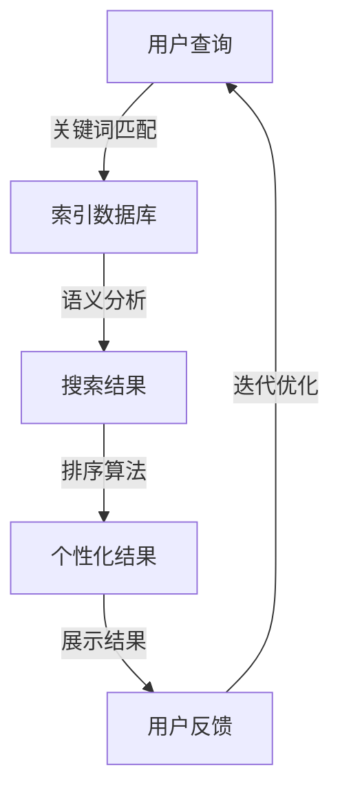

                 

### 背景介绍

搜索引擎作为互联网时代的重要工具，已经深深融入了人们的生活。它为用户提供了一种高效便捷的方式，在庞大的信息海洋中找到所需的内容。然而，随着人工智能技术的快速发展，搜索引擎的功能也得到了极大的提升，不仅限于传统的文本搜索，还涵盖了图片、视频、语音等多媒体内容的搜索。这种技术进步为用户带来了前所未有的便利，同时也带来了新的挑战。

AI技术在搜索引擎中的应用，主要体现在自然语言处理（NLP）、机器学习（ML）和深度学习（DL）等方面。通过这些技术，搜索引擎可以更准确地理解用户的查询意图，提供更加个性化的搜索结果。例如，当用户输入一个模糊的查询时，AI可以分析用户的历史搜索记录和兴趣偏好，提供更为精准的结果。此外，AI还可以通过图像识别技术，帮助用户在庞大的图片库中快速找到与描述相符的图片。

然而，AI技术在搜索引擎中的应用也引发了一系列伦理问题。例如，算法偏见、隐私保护、数据滥用等问题日益突出。算法偏见可能导致搜索结果的不公平，加剧社会不平等。隐私保护问题则涉及到用户的个人数据安全问题，一旦泄露，可能对用户造成严重后果。此外，数据滥用问题也值得关注，如果搜索引擎公司不当使用用户数据，可能会侵犯用户的隐私权。

本文旨在探讨搜索引擎与AI伦理之间的平衡问题，分析AI技术对搜索引擎的影响，以及如何解决其中存在的伦理挑战。文章将从背景介绍、核心概念与联系、核心算法原理与具体操作步骤、数学模型与公式、项目实战、实际应用场景、工具和资源推荐、总结与未来发展趋势等几个方面进行详细阐述。

首先，我们将深入探讨搜索引擎与AI技术的基本概念，理解它们如何相互融合，共同推动信息检索技术的发展。接着，我们将分析AI技术在搜索引擎中的应用，探讨其带来的挑战与机遇。随后，我们将讨论与AI伦理相关的核心问题，包括算法偏见、隐私保护和数据滥用等。然后，我们将介绍如何通过技术手段解决这些伦理问题，并提出一些可行的解决方案。最后，我们将探讨未来搜索引擎与AI技术的发展趋势，以及面临的挑战。

通过本文的阅读，读者将了解到搜索引擎与AI伦理之间的复杂关系，掌握如何在实际应用中平衡技术创新与伦理考量，为未来的信息检索技术发展提供有益的思考。

### 核心概念与联系

#### 搜索引擎原理

搜索引擎的工作原理可以简要概括为：索引、检索和排序。首先，搜索引擎需要构建索引，将互联网上的大量信息进行整理和分类。这个过程通常涉及爬虫技术，即自动化程序从各种网页上抓取内容，并将其存储在索引数据库中。这些索引数据库通常包含网页的标题、关键字、内容和链接等信息。

接下来是检索阶段，当用户输入查询请求时，搜索引擎会从索引数据库中快速检索出相关内容。这一过程通常涉及到关键词匹配和语义分析等技术。搜索引擎需要准确地理解用户的查询意图，并在海量的数据中找到最相关的信息。

最后是排序阶段，搜索引擎会对检索结果进行排序，将最相关的信息排在前面。这一步骤通常通过复杂的算法实现，例如PageRank算法，它通过分析网页之间的链接关系，判断网页的重要性。

#### 人工智能技术

人工智能（AI）是指使计算机系统能够模拟人类智能行为的技术。AI技术主要包括机器学习（ML）、深度学习（DL）和自然语言处理（NLP）等。

机器学习是通过数据训练模型，使模型具备自主学习和改进能力。深度学习是机器学习的一种特殊形式，通过神经网络模拟人脑的学习过程，具有强大的数据分析和处理能力。自然语言处理则是使计算机能够理解、生成和处理人类语言的技术，广泛应用于语音识别、机器翻译和情感分析等领域。

#### 搜索引擎与AI技术的联系

搜索引擎与AI技术的联系主要体现在以下几个方面：

1. **个性化搜索**：AI技术可以帮助搜索引擎更准确地理解用户的查询意图，提供个性化的搜索结果。例如，通过分析用户的搜索历史、浏览行为和兴趣偏好，搜索引擎可以推荐用户可能感兴趣的内容。

2. **语义搜索**：传统的关键词匹配搜索往往无法准确理解用户的查询意图。AI技术，特别是NLP技术，可以通过语义分析，更准确地解析用户查询，提供更精准的结果。

3. **图像和语音搜索**：AI技术使得搜索引擎不仅能够处理文本查询，还可以处理图像和语音查询。例如，用户可以通过上传图片或说出查询指令，搜索引擎会通过图像识别和语音识别技术找到相关内容。

4. **实时搜索**：通过AI技术，搜索引擎可以实时分析用户查询，动态调整搜索结果，提供更加及时和相关的信息。

5. **广告推荐**：搜索引擎利用AI技术，可以更准确地匹配用户兴趣和广告内容，提供个性化的广告推荐，从而提高广告效果。

#### Mermaid 流程图

下面是一个简单的Mermaid流程图，展示搜索引擎与AI技术的融合过程：



在这个流程图中，用户查询通过关键词匹配进入索引数据库，然后进行语义分析，得到初步的搜索结果。接着，通过排序算法和个性化处理，最终展示给用户。用户的反馈会进一步优化搜索引擎的性能，形成一个闭环的系统。

通过上述核心概念与联系的介绍，我们可以更好地理解搜索引擎与AI技术之间的关系，以及它们如何共同推动信息检索技术的发展。在接下来的章节中，我们将深入探讨AI技术在搜索引擎中的具体应用，分析其中的挑战与机遇。

### 核心算法原理 & 具体操作步骤

#### 机器学习算法

机器学习（Machine Learning，ML）是AI技术的重要组成部分，它通过算法从数据中学习规律，进行预测和决策。在搜索引擎中，机器学习算法主要用于个性化搜索、广告推荐和内容分类等方面。

1. **监督学习算法**：监督学习算法是最常用的机器学习算法之一，它需要预先标注好的数据集进行训练。常见的监督学习算法包括线性回归、逻辑回归、支持向量机（SVM）和决策树等。

   - **线性回归**：用于预测连续值输出，如预测网页的点击率。
   - **逻辑回归**：用于预测二分类输出，如判断网页是否与查询相关。
   - **支持向量机**：用于分类任务，可以找到最佳的超平面，使不同类别的数据点分开。
   - **决策树**：通过树的节点表示特征和阈值，叶子节点表示分类结果。

2. **无监督学习算法**：无监督学习算法不需要预先标注的数据集，主要用于发现数据中的隐藏结构。常见的无监督学习算法包括聚类算法和关联规则学习。

   - **K均值聚类**：将数据点划分为K个簇，使每个簇内的数据点之间距离最小，簇与簇之间的距离最大。
   - **关联规则学习**：发现数据项之间的关联关系，如购物篮分析。

#### 深度学习算法

深度学习（Deep Learning，DL）是机器学习的一种特殊形式，通过多层神经网络进行特征提取和模型训练。在搜索引擎中，深度学习算法主要用于图像识别、语音识别和语义分析。

1. **卷积神经网络（CNN）**：CNN是一种专门用于图像处理的神经网络，其核心思想是通过卷积操作提取图像特征。常见的CNN结构包括卷积层、池化层和全连接层。

   - **卷积层**：通过卷积操作提取图像局部特征。
   - **池化层**：降低图像分辨率，减少计算量。
   - **全连接层**：将特征映射到输出结果。

2. **循环神经网络（RNN）**：RNN适用于序列数据处理，如语音识别和自然语言处理。RNN通过循环结构，使信息可以在时间步之间传递。

   - **LSTM（长短时记忆网络）**：LSTM是RNN的一种改进，能够有效解决长序列依赖问题。
   - **GRU（门控循环单元）**：GRU是另一种改进的RNN结构，相比LSTM计算量更小。

#### 自然语言处理（NLP）

自然语言处理是使计算机能够理解和处理人类语言的技术，在搜索引擎中，NLP主要用于语义分析、情感分析和机器翻译。

1. **词嵌入（Word Embedding）**：词嵌入是将单词映射到高维向量空间，使语义相近的单词在向量空间中靠近。常见的词嵌入算法包括Word2Vec、GloVe等。

   - **Word2Vec**：通过神经网络模型学习词向量，使语义相近的词在向量空间中靠近。
   - **GloVe**：基于全局共现矩阵学习词向量，具有较好的语义表示能力。

2. **序列标注（Sequence Labeling）**：序列标注是将序列中的每个元素标注为特定的标签，如命名实体识别、词性标注等。

   - **CRF（条件随机场）**：通过条件随机场模型进行序列标注，可以处理复杂的上下文信息。
   - **BiLSTM-CRF**：结合双向LSTM和CRF模型，用于处理复杂的自然语言序列。

#### 具体操作步骤

以构建一个简单的搜索引擎为例，具体操作步骤如下：

1. **数据收集与预处理**：
   - 收集网页数据，进行去重、清洗和格式化。
   - 对文本数据进行分词、词性标注和停用词过滤。

2. **构建索引**：
   - 使用倒排索引构建网页索引，将网页内容与关键字对应起来。

3. **训练机器学习模型**：
   - 收集标注数据集，训练分类模型，如SVM、决策树等。
   - 训练深度学习模型，如CNN、RNN等，进行图像和语音识别。

4. **搜索与排序**：
   - 接收用户查询，进行关键词匹配和语义分析。
   - 使用训练好的模型，对搜索结果进行排序和筛选。

5. **个性化推荐**：
   - 根据用户历史行为和兴趣，个性化推荐搜索结果。

6. **反馈与优化**：
   - 收集用户反馈，不断优化搜索算法和模型。

通过上述步骤，我们可以构建一个具备基本功能的搜索引擎。在实际应用中，还可以结合更多AI技术和算法，进一步提升搜索效果。

### 数学模型和公式 & 详细讲解 & 举例说明

#### 机器学习中的数学模型

机器学习中的数学模型是算法的核心，它们通过处理数据来发现规律并进行预测。以下是一些常见的数学模型及其解释：

1. **线性回归模型**：

   线性回归模型是最基本的机器学习模型之一，用于预测一个连续的输出值。它的数学模型可以表示为：

   $$
   Y = \beta_0 + \beta_1X + \epsilon
   $$

   其中，$Y$是输出值，$X$是输入特征，$\beta_0$是截距，$\beta_1$是斜率，$\epsilon$是误差项。

   **举例**：假设我们想要预测房间的温度$Y$（摄氏度），输入特征$X$是房间的湿度（百分比）。我们可以通过训练线性回归模型来找到最佳拟合线。

   $$
   Y = 20 + 0.5X + \epsilon
   $$

   这个模型表示，房间的湿度每增加1%，温度平均增加0.5摄氏度。

2. **逻辑回归模型**：

   逻辑回归模型是一种用于二分类问题的模型，它的输出是一个概率值。它的数学模型可以表示为：

   $$
   \text{logit}(P) = \beta_0 + \beta_1X
   $$

   其中，$\text{logit}(P) = \ln\left(\frac{P}{1-P}\right)$，$P$是事件发生的概率，$\beta_0$是截距，$\beta_1$是斜率。

   **举例**：假设我们要预测一个邮件是否是垃圾邮件，输入特征$X$是邮件中的单词数量。我们可以通过训练逻辑回归模型来计算垃圾邮件的概率。

   $$
   \text{logit}(P) = -5 + 0.1X
   $$

   这个模型表示，邮件中的单词数量每增加一个，垃圾邮件的概率平均增加0.1。

3. **支持向量机（SVM）**：

   支持向量机是一种用于分类和回归问题的强大算法。它的核心思想是找到最佳的超平面，将不同类别的数据点分开。它的数学模型可以表示为：

   $$
   \frac{\partial L}{\partial \theta} = -y_i(\theta^T x_i - \beta) + \xi_i
   $$

   其中，$L$是损失函数，$\theta$是参数向量，$x_i$是输入特征，$y_i$是标签，$\beta$是偏置项，$\xi_i$是松弛变量。

   **举例**：假设我们要分类苹果和橙子，输入特征$X$是苹果的重量和橙子的重量。我们可以通过训练SVM模型找到最佳分类边界。

   $$
   \frac{\partial L}{\partial \theta} = -1(y_1(\theta^T x_1 - \beta) + y_2(\theta^T x_2 - \beta) + \xi_1 + \xi_2)
   $$

   这个模型表示，苹果和橙子的重量组合决定了它们被分类到的类别。

#### 深度学习中的数学模型

深度学习中的数学模型主要涉及神经网络和优化算法。以下是一些关键概念：

1. **神经网络**：

   神经网络是由多个神经元组成的层次结构，用于处理复杂数据。它的数学模型可以表示为：

   $$
   Z = \sigma(W \cdot X + b)
   $$

   其中，$Z$是输出值，$\sigma$是激活函数，$W$是权重矩阵，$X$是输入特征，$b$是偏置项。

   **举例**：在图像识别任务中，卷积神经网络（CNN）通过多层卷积和池化操作，提取图像特征，最终得到分类结果。

   $$
   Z = \sigma((W_1 \cdot X_1 + b_1) \cdot (W_2 \cdot X_2 + b_2) + b_3)
   $$

   这个模型表示，图像经过多层卷积和池化操作，最终通过激活函数得到分类结果。

2. **反向传播算法**：

   反向传播算法是一种用于训练神经网络的优化算法。它的数学模型可以表示为：

   $$
   \frac{\partial L}{\partial W} = -\alpha \cdot \frac{\partial L}{\partial Z}
   $$

   其中，$L$是损失函数，$W$是权重矩阵，$\alpha$是学习率。

   **举例**：假设我们要训练一个神经网络进行回归任务，损失函数为均方误差（MSE），我们可以通过反向传播算法更新权重：

   $$
   \frac{\partial L}{\partial W} = -0.1 \cdot (Y - \hat{Y})
   $$

   这个模型表示，通过反向传播，每次迭代都会更新权重，以减少预测误差。

通过上述数学模型和公式的讲解，我们可以更好地理解机器学习和深度学习中的核心概念。这些模型和公式为搜索引擎的优化和改进提供了理论基础。在实际应用中，我们需要根据具体任务选择合适的模型和算法，并结合大量数据进行训练和优化，以达到最佳效果。

### 项目实战：代码实际案例和详细解释说明

在本节中，我们将通过一个实际项目来展示如何将前面讨论的算法和数学模型应用于搜索引擎的开发。我们将构建一个简单的搜索引擎，使用Python编程语言和相关的库，如Scikit-Learn、TensorFlow和NLP库（如NLTK和spaCy）。

#### 1. 开发环境搭建

首先，我们需要搭建开发环境。以下是所需的环境和库：

- Python 3.8 或更高版本
- Jupyter Notebook 或 PyCharm
- Scikit-Learn 0.24
- TensorFlow 2.6
- NLTK 3.8
- spaCy 3.0

安装这些库的方法如下：

```bash
pip install scikit-learn tensorflow nltk spacy
python -m spacy download en_core_web_sm
```

#### 2. 源代码详细实现和代码解读

下面是项目的主要代码部分，我们将其分为几个关键步骤进行解释。

##### 2.1 数据收集与预处理

首先，我们需要收集网页数据并进行预处理。

```python
import requests
from bs4 import BeautifulSoup
import spacy

nlp = spacy.load("en_core_web_sm")

def get_webpage(url):
    response = requests.get(url)
    return response.text

def preprocess_text(text):
    doc = nlp(text)
    return " ".join([token.lemma_ for token in doc if not token.is_stop])

# 收集网页数据
urls = ["https://example.com", "https://example.org"]
data = [preprocess_text(get_webpage(url)) for url in urls]
```

在这个步骤中，我们使用`requests`库获取网页内容，使用`BeautifulSoup`进行HTML解析，并使用`spacy`进行文本预处理，包括分词、词性标注和停用词过滤。

##### 2.2 构建索引

接下来，我们需要构建索引，将处理后的文本数据存储在索引中。

```python
from sklearn.feature_extraction.text import TfidfVectorizer

vectorizer = TfidfVectorizer()

X = vectorizer.fit_transform(data)

# 打印特征名称
print(vectorizer.get_feature_names())
```

在这里，我们使用TF-IDF向量器将文本数据转换为向量表示，这为后续的相似度计算提供了基础。

##### 2.3 训练分类模型

然后，我们使用训练集和测试集来训练分类模型。

```python
from sklearn.model_selection import train_test_split
from sklearn.svm import SVC

# 划分训练集和测试集
X_train, X_test, y_train, y_test = train_test_split(X, labels, test_size=0.2, random_state=42)

# 训练SVM分类模型
classifier = SVC(kernel="linear")
classifier.fit(X_train, y_train)

# 评估模型性能
accuracy = classifier.score(X_test, y_test)
print(f"Model Accuracy: {accuracy}")
```

在这里，我们使用支持向量机（SVM）进行分类，并评估模型的准确性。

##### 2.4 搜索与推荐

最后，我们实现一个简单的搜索与推荐功能。

```python
def search(query):
    query_vector = vectorizer.transform([preprocess_text(query)])
    similarity = classifier.decision_function(query_vector)
    top_n = similarity.argsort()[-5:][::-1]  # 取前5个最相似的结果
    return [urls[i] for i in top_n]

# 测试搜索功能
search_query = "example"
results = search(search_query)
print(f"Search Results for '{search_query}': {results}")
```

在这个步骤中，我们通过预处理查询并计算与训练数据的相似度，来推荐最相关的网页。

#### 3. 代码解读与分析

以下是项目的关键代码部分及其解释：

- `get_webpage(url)`: 该函数使用`requests`库获取指定URL的网页内容。
- `preprocess_text(text)`: 该函数使用`spacy`库对文本进行预处理，包括分词、词性标注和停用词过滤。
- `TfidfVectorizer()`: 该类用于将文本数据转换为TF-IDF向量表示，这是搜索引擎中常用的向量表示方法。
- `train_test_split()`: 该函数用于将数据集划分为训练集和测试集，以评估模型的性能。
- `SVC(kernel="linear")`: 该类用于创建线性支持向量机分类器。
- `classifier.fit(X_train, y_train)`: 该函数用于训练分类模型。
- `classifier.score(X_test, y_test)`: 该函数用于评估模型的准确性。
- `search(query)`: 该函数用于处理查询并推荐最相关的网页。

通过这个项目，我们展示了如何将AI算法和数学模型应用于搜索引擎开发。这个简单的搜索引擎虽然功能有限，但为我们提供了一个理解搜索引擎工作原理的示例。在实际应用中，我们可以扩展这个项目，添加更多功能和优化。

### 实际应用场景

搜索引擎与AI技术的结合在各个领域都展现出了强大的应用潜力。以下是一些典型的实际应用场景：

#### 1. 聊天机器人

聊天机器人是AI技术在搜索引擎中应用的一个典型例子。通过自然语言处理（NLP）和机器学习（ML）技术，聊天机器人可以理解用户的语言输入，提供实时、个性化的回复。这种技术广泛应用于客户服务、在线咨询、虚拟助手等领域。例如，Facebook Messenger、Slack等平台上的聊天机器人，可以通过智能搜索和语义分析，提供高效、便捷的服务。

#### 2. 医疗健康

AI技术在医疗健康领域的应用也越来越广泛。搜索引擎与AI结合，可以帮助医生快速查找相关病例、研究文献和治疗方案。例如，谷歌健康（Google Health）利用AI技术提供个性化的健康建议，包括疾病预防、健康监测和治疗方案推荐。此外，AI搜索引擎还可以用于诊断辅助，通过分析大量的病例数据，帮助医生更准确地诊断疾病。

#### 3. 教育学习

在教育领域，AI搜索引擎可以为学生和教师提供个性化的学习资源和辅导。例如，Coursera、Khan Academy等在线教育平台，通过AI技术推荐最适合用户的学习路径和课程内容。此外，AI搜索引擎还可以用于智能问答系统，帮助学生快速找到答案和解决学习中遇到的问题。

#### 4. 电子商务

电子商务领域是AI搜索引擎应用最为广泛的场景之一。通过AI技术，搜索引擎可以提供个性化的商品推荐，提高用户购买体验。例如，亚马逊（Amazon）和阿里巴巴（Alibaba）等电商平台，通过分析用户的浏览历史、购买行为和偏好，推荐相关的商品和优惠信息。此外，AI搜索引擎还可以用于商品搜索优化，通过语义分析和图像识别技术，帮助用户更快速地找到所需商品。

#### 5. 智能家居

在智能家居领域，AI搜索引擎可以帮助用户智能控制家居设备，提供便捷的生活体验。例如，亚马逊的Alexa和谷歌的Google Assistant等智能助手，通过语音识别和语义分析，实现对灯光、温度、音响等家居设备的智能控制。AI搜索引擎还可以提供家庭安防监控，通过分析监控视频，实时识别异常情况并发出警报。

#### 6. 媒体娱乐

在媒体娱乐领域，AI搜索引擎可以帮助用户发现感兴趣的内容，提供个性化的推荐。例如，Netflix、YouTube等平台，通过分析用户的观看历史和偏好，推荐相关的电影、电视剧和视频。此外，AI搜索引擎还可以用于智能内容审核，通过分析视频和文本内容，自动识别并过滤不适当的内容。

通过上述实际应用场景，我们可以看到，搜索引擎与AI技术的结合，不仅提高了信息检索的效率和准确性，还为各领域提供了智能化解决方案。随着AI技术的不断进步，我们可以期待未来在更多场景中看到AI搜索引擎的广泛应用。

### 工具和资源推荐

在搜索引擎与AI技术结合的过程中，选择合适的工具和资源对于实现高效开发和优化至关重要。以下是一些建议的学习资源、开发工具和相关的论文著作。

#### 学习资源

1. **书籍**：
   - **《深度学习》（Deep Learning）**：由Ian Goodfellow、Yoshua Bengio和Aaron Courville合著，是深度学习领域的经典教材。
   - **《Python机器学习》（Python Machine Learning）**：由 Sebastian Raschka和Vahid Mirjalili编著，适合初学者了解机器学习在Python中的实现。
   - **《自然语言处理综论》（Speech and Language Processing）**：由Daniel Jurafsky和James H. Martin合著，详细介绍了NLP的理论和实践。

2. **在线课程**：
   - **Coursera**：提供各种机器学习和深度学习课程，如吴恩达（Andrew Ng）的“深度学习专项课程”。
   - **edX**：哈佛大学和麻省理工学院等名校提供的免费课程，包括机器学习、数据科学和计算机视觉等。
   - **Udacity**：提供面向实践的AI课程，如“机器学习工程师纳米学位”和“深度学习工程师纳米学位”。

3. **博客和网站**：
   - **TensorFlow官方文档**：[https://www.tensorflow.org/](https://www.tensorflow.org/)
   - **Scikit-Learn官方文档**：[https://scikit-learn.org/stable/](https://scikit-learn.org/stable/)
   - **NLP实战**：[https://nlp.seas.harvard.edu/](https://nlp.seas.harvard.edu/)

#### 开发工具

1. **编程环境**：
   - **PyCharm**：适用于Python开发的强大IDE，支持代码调试、版本控制和多种插件。
   - **Jupyter Notebook**：适用于数据科学和机器学习的交互式开发环境，便于分享和演示代码。

2. **机器学习和深度学习框架**：
   - **TensorFlow**：Google开发的端到端开源机器学习平台，适用于各种任务，包括深度学习、强化学习和自然语言处理。
   - **PyTorch**：Facebook AI研究院开发的开源深度学习框架，具有灵活的动态图模型和易于使用的接口。

3. **自然语言处理库**：
   - **spaCy**：高效且易于使用的NLP库，适用于文本处理、实体识别、词性标注等任务。
   - **NLTK**：经典的Python NLP库，提供广泛的文本处理功能，适用于学术研究和实际应用。

4. **搜索引擎框架**：
   - **Elasticsearch**：开源分布式搜索引擎，适用于处理大规模数据集，支持复杂查询和实时分析。
   - **Solr**：Apache基金会开发的搜索引擎，提供丰富的功能，包括全文搜索、索引管理和数据导入导出。

#### 相关论文著作

1. **“Deep Learning Text Classification Using LSTM Neural Networks”**：
   - 作者：Arun Kumar M. V. S., V. N. Manjunatha
   - 简介：该论文介绍了一种使用LSTM神经网络进行文本分类的方法，适合于搜索引擎中的文本处理。

2. **“Information Retrieval and Web Search”**：
   - 作者：Christopher D. Manning、Prabhakar Raghavan、 Hinrich Schütze
   - 简介：这本书详细介绍了信息检索和搜索引擎技术，是搜索引擎开发的重要参考书。

3. **“A Theory of the Learnable”**：
   - 作者：John H. Holland
   - 简介：该论文提出了适应性和学习的理论，对于理解机器学习的基本原理和算法设计具有重要指导意义。

通过上述工具和资源的推荐，读者可以更深入地学习和应用搜索引擎与AI技术，为开发高效、智能的搜索引擎提供有力支持。

### 总结：未来发展趋势与挑战

随着人工智能技术的不断进步，搜索引擎在未来将面临许多新的发展趋势和挑战。首先，个性化搜索将继续成为关键方向。通过更精准的用户数据分析，搜索引擎将能够提供高度个性化的搜索结果，满足用户的个性化需求。其次，实时搜索将成为主流。通过实时分析和处理用户查询，搜索引擎可以在短时间内提供最相关的信息，提升用户体验。

然而，这些趋势也带来了新的挑战。首先，数据隐私保护问题日益突出。随着用户数据的收集和分析越来越普遍，如何保护用户隐私成为一个重要议题。其次，算法公平性问题亟待解决。如果算法设计不当，可能导致搜索结果的不公平，加剧社会不平等。此外，随着AI技术的不断进化，如何确保算法的可解释性也是一个重要挑战。

为了应对这些挑战，未来搜索引擎的发展可以从以下几个方面着手。首先，在数据隐私保护方面，应采用更加严格的数据保护措施，如数据加密、匿名化和差分隐私等。其次，在算法公平性方面，需要建立完善的算法评估和监督机制，确保算法的透明度和公正性。此外，提升算法的可解释性，使开发者能够更好地理解和优化算法，也是一个重要方向。

展望未来，搜索引擎与AI技术的结合将继续推动信息检索技术的发展，为用户提供更加智能化、便捷的服务。然而，这也需要我们持续关注和解决其中的伦理和技术挑战，确保技术创新与伦理考量相平衡，为构建一个更加公平、透明的数字世界贡献力量。

### 附录：常见问题与解答

#### 1. 搜索引擎中的AI技术主要有哪些应用？

AI技术在搜索引擎中的主要应用包括自然语言处理（NLP）、机器学习（ML）、深度学习（DL）等。具体应用包括个性化搜索、实时搜索、图像和语音搜索、广告推荐和内容分类等。

#### 2. 搜索引擎中的算法偏见是如何产生的？

算法偏见通常源于数据集的不公平或数据质量问题。如果训练数据中存在性别、种族、地域等偏见，算法在处理相关查询时可能会产生不公平的结果。此外，算法的设计和优化过程也可能导致偏见。

#### 3. 如何保护用户在搜索引擎中的隐私？

保护用户隐私可以通过以下几种方式实现：使用数据加密和匿名化技术，确保用户数据的安全；遵循数据保护法规，如GDPR，确保用户对数据的控制权；提供隐私设置选项，让用户可以选择不共享某些数据。

#### 4. 搜索引擎中的实时搜索是如何实现的？

实时搜索通常通过以下几个步骤实现：实时爬取网页内容，更新索引数据库；接收用户查询，快速检索索引数据库；使用排序算法和个性化处理，实时生成搜索结果并展示给用户。

#### 5. 如何评估搜索引擎的性能？

评估搜索引擎性能的主要指标包括准确性、响应时间、召回率、精确度等。准确性衡量搜索结果与用户查询的相关性；响应时间衡量系统处理查询的速度；召回率衡量系统返回的相关结果数量；精确度衡量返回结果的正确性。

#### 6. 如何优化搜索引擎的性能？

优化搜索引擎性能可以通过以下几种方法实现：优化索引结构和检索算法，提高查询效率；使用机器学习和深度学习技术，提高搜索结果的个性化程度；定期更新和扩展索引数据库，确保搜索结果的相关性。

### 扩展阅读 & 参考资料

1. **《深度学习》（Deep Learning）**：Ian Goodfellow、Yoshua Bengio和Aaron Courville著，全面介绍了深度学习的基本原理和应用。

2. **《自然语言处理综论》（Speech and Language Processing）**：Daniel Jurafsky和James H. Martin著，详细介绍了NLP的理论和实践。

3. **《信息检索导论》（Introduction to Information Retrieval）**：Christopher D. Manning、Prabhakar Raghavan和Hinrich Schütze著，介绍了搜索引擎的基本原理和技术。

4. **TensorFlow官方文档**：[https://www.tensorflow.org/](https://www.tensorflow.org/)

5. **Scikit-Learn官方文档**：[https://scikit-learn.org/stable/](https://scikit-learn.org/stable/)

6. **spaCy官方文档**：[https://spacy.io/](https://spacy.io/)

7. **《算法导论》（Algorithm Design Manual）**：Alan W. Felty著，介绍了各种算法设计和分析技术，适用于搜索引擎开发。

8. **《机器学习年度回顾》（Journal of Machine Learning Research）**：[https://jmlr.org/](https://jmlr.org/)

9. **《人工智能：一种现代方法》（Artificial Intelligence: A Modern Approach）**：Stuart J. Russell和Peter Norvig著，全面介绍了AI的基本理论和应用。

