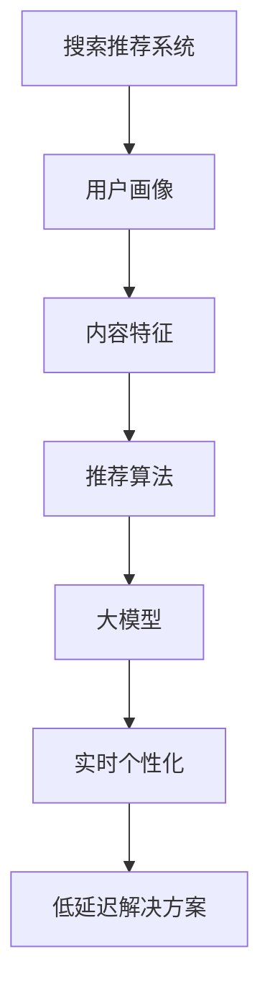

                 

### 文章标题

《搜索推荐的实时个性化：大模型的低延迟解决方案》

### 关键词

- 搜索推荐系统
- 实时个性化
- 大模型
- 低延迟解决方案
- 算法优化

### 摘要

本文深入探讨了在搜索推荐系统中实现实时个性化的大模型低延迟解决方案。首先，我们介绍了搜索推荐系统的基本概念及其在当今社会的重要性。然后，我们分析了传统推荐系统的局限性，引出了实时个性化需求的紧迫性。接着，本文重点介绍了大模型的优势以及在实时个性化中的应用。为了实现低延迟，本文详细阐述了相关算法原理、数学模型以及具体操作步骤。通过一个实际项目案例，本文展示了如何将理论转化为实践，提供了代码实现和详细解释。最后，本文讨论了实时个性化在各个行业中的应用场景，并推荐了一些学习和开发资源，总结了未来发展趋势与挑战。

## 1. 背景介绍

随着互联网技术的飞速发展，搜索推荐系统已经成为互联网企业提高用户粘性和增加商业价值的重要手段。这些系统通过分析用户行为、兴趣偏好和历史数据，为用户提供个性化的搜索结果和推荐内容。传统推荐系统主要基于用户历史行为和内容特征，采用一些基础算法如协同过滤、基于内容的推荐等，但这些方法存在一些明显的局限性。

首先，传统推荐系统的个性化程度较低，难以满足用户日益增长的需求。例如，协同过滤算法容易受到“冷启动”问题的影响，即新用户或新商品的推荐效果不佳。其次，这些系统在处理大规模数据时，计算效率和响应速度较低，无法实现实时个性化。最后，传统推荐系统在处理复杂非线性关系和长尾数据时，效果较差。

为了解决这些问题，实时个性化成为搜索推荐系统的发展方向。实时个性化是指根据用户当前的行为和兴趣，即时调整推荐结果，为用户提供更准确、更有针对性的内容。这需要利用先进的算法和模型，特别是大模型技术，以提高推荐系统的准确性和效率。此外，实现低延迟是实时个性化的重要保障，因为用户对搜索结果和推荐内容的要求越来越高，延迟甚至会导致用户流失。

本文旨在探讨如何利用大模型技术实现搜索推荐系统的实时个性化，并保证低延迟。我们将从算法原理、数学模型和实际案例三个方面，详细分析大模型的低延迟解决方案，为相关领域的研究者和工程师提供参考。

## 2. 核心概念与联系

### 2.1 搜索推荐系统概述

搜索推荐系统是利用算法和模型，对用户行为和内容特征进行分析和处理，为用户生成个性化搜索结果和推荐内容的一种技术。其主要组成部分包括用户画像、内容特征和推荐算法。

- **用户画像**：基于用户的历史行为数据（如浏览记录、购买记录等），构建用户的兴趣偏好模型，用于描述用户的需求和喜好。
- **内容特征**：对推荐的内容进行特征提取，包括文本特征、图像特征、音频特征等，用于描述内容的属性和特点。
- **推荐算法**：根据用户画像和内容特征，采用相应的算法生成推荐结果。常见的推荐算法有协同过滤、基于内容的推荐、混合推荐等。

### 2.2 实时个性化需求

实时个性化是指根据用户当前的行为和兴趣，即时调整推荐结果，为用户提供更准确、更有针对性的内容。实时个性化的需求源于以下几个方面：

- **用户体验**：用户对搜索结果和推荐内容的要求越来越高，他们希望得到即时的、个性化的服务，以提高使用满意度。
- **商业价值**：实时个性化可以更好地满足用户需求，提高用户粘性和转化率，从而带来更多的商业价值。
- **数据更新速度**：随着用户行为数据的不断更新，实时个性化能够及时捕捉到用户需求的变化，提高推荐系统的准确性。

### 2.3 大模型的优势

大模型是指在数据规模、模型参数和计算资源等方面具有优势的模型。大模型在搜索推荐系统的实时个性化中具有以下优势：

- **处理复杂数据关系**：大模型能够处理大规模、多维度的用户行为数据和内容特征，捕捉复杂的非线性关系，提高推荐准确性。
- **自适应调整**：大模型可以根据实时数据更新，自适应地调整模型参数，实现更精细的个性化推荐。
- **快速响应**：大模型在计算效率和响应速度上具有优势，能够满足实时个性化需求，实现低延迟。

### 2.4 大模型与实时个性化的关系

大模型与实时个性化密切相关，二者相辅相成。大模型为实时个性化提供了强大的计算能力和数据处理能力，使得推荐系统能够在短时间内处理海量数据，生成个性化的推荐结果。同时，实时个性化需求推动了大模型技术的发展，促使模型在效率、准确性和稳定性等方面不断优化。

### 2.5 Mermaid 流程图

为了更好地展示大模型与实时个性化的关系，我们使用 Mermaid 流程图进行说明。



**图 1：大模型与实时个性化的关系**

在这个流程图中，搜索推荐系统通过用户画像和内容特征生成推荐结果，大模型则对推荐算法进行优化，实现实时个性化，并保证低延迟。这个流程体现了大模型在实时个性化中的关键作用。

## 3. 核心算法原理 & 具体操作步骤

### 3.1 算法原理

为了实现搜索推荐系统的实时个性化，我们需要一种能够高效处理大规模数据、自适应调整的算法。这里，我们介绍一种基于深度学习的推荐算法——深度自动编码器（Deep Autoencoder）。

深度自动编码器是一种无监督学习算法，其主要目的是通过编码器将输入数据压缩为低维特征表示，并通过解码器将特征表示重构回原始数据。在这个过程中，编码器学习到数据的潜在特征，解码器则学习到如何将这些特征重构为数据。

深度自动编码器的核心思想是，通过训练，使得编码器能够捕捉到数据中的潜在结构，从而在特征表示阶段实现数据的降维和特征提取。在解码阶段，解码器利用编码器学习到的潜在特征，尝试重构原始数据，从而实现数据恢复。

### 3.2 算法操作步骤

#### 3.2.1 数据预处理

首先，对用户行为数据和内容特征数据进行预处理。具体步骤如下：

1. **数据清洗**：去除数据中的噪声和异常值，保证数据的准确性和一致性。
2. **特征提取**：对用户行为数据和内容特征进行编码，提取出数值化的特征向量。
3. **数据归一化**：对特征向量进行归一化处理，使其具有相同的量级，便于模型训练。

#### 3.2.2 构建深度自动编码器模型

构建深度自动编码器模型，包括编码器和解码器两部分。编码器将输入数据压缩为低维特征表示，解码器则将特征表示重构回原始数据。具体步骤如下：

1. **设计网络结构**：根据数据特征和任务需求，设计合适的网络结构。通常，编码器和解码器都采用多层神经网络，层数越多，模型捕捉数据潜在结构的能力越强。
2. **初始化模型参数**：初始化编码器和解码器的模型参数，可以使用随机初始化或预训练模型参数。
3. **训练模型**：使用训练数据集，通过反向传播算法，更新模型参数，使得编码器和解码器能够更好地捕捉数据中的潜在结构。

#### 3.2.3 实时个性化推荐

在模型训练完成后，我们可以使用编码器提取用户行为和内容特征的低维特征表示，然后根据这些特征表示进行实时个性化推荐。具体步骤如下：

1. **用户特征表示**：使用编码器，将用户行为数据（如浏览记录、购买记录等）转换为低维特征表示。
2. **内容特征表示**：使用编码器，将内容特征数据（如文本、图像等）转换为低维特征表示。
3. **生成推荐列表**：利用用户特征表示和内容特征表示，采用推荐算法（如基于相似度的推荐算法），生成个性化的推荐列表。

#### 3.2.4 低延迟优化

为了实现低延迟，我们需要对模型进行优化，提高模型训练和推理的速度。具体优化策略如下：

1. **模型压缩**：通过模型压缩技术，如剪枝、量化等，减小模型体积，提高模型推理速度。
2. **模型并行化**：利用多核处理器或分布式计算，实现模型训练和推理的并行化，提高计算效率。
3. **缓存策略**：采用缓存策略，如局部缓存、分布式缓存等，减少数据传输和计算的时间。

## 4. 数学模型和公式 & 详细讲解 & 举例说明

### 4.1 数学模型

深度自动编码器（Deep Autoencoder）的数学模型可以分为编码器和解码器两部分。

#### 4.1.1 编码器

编码器（Encoder）的目的是将输入数据压缩为低维特征表示。其数学模型如下：

$$
z = f_{\theta_e}(x)
$$

其中，$z$ 是编码器输出的低维特征表示，$x$ 是输入数据，$f_{\theta_e}$ 是编码器的神经网络函数，$\theta_e$ 是编码器的模型参数。

#### 4.1.2 解码器

解码器（Decoder）的目的是将编码器输出的低维特征表示重构回原始数据。其数学模型如下：

$$
x' = f_{\theta_d}(z)
$$

其中，$x'$ 是解码器输出的重构数据，$z$ 是编码器输出的低维特征表示，$f_{\theta_d}$ 是解码器的神经网络函数，$\theta_d$ 是解码器的模型参数。

#### 4.1.3 损失函数

深度自动编码器的损失函数通常采用均方误差（MSE，Mean Squared Error）。其数学模型如下：

$$
L = \frac{1}{n} \sum_{i=1}^{n} ||x - x'||^2
$$

其中，$L$ 是损失函数，$n$ 是样本数量，$x$ 是输入数据，$x'$ 是解码器输出的重构数据。

### 4.2 详细讲解

#### 4.2.1 编码器

编码器的神经网络函数 $f_{\theta_e}$ 通常采用多层感知机（MLP，Multilayer Perceptron），其结构如下：

$$
z_l = \sigma(W_l \cdot a_{l-1} + b_l)
$$

其中，$z_l$ 是编码器第 $l$ 层的输出，$a_{l-1}$ 是编码器第 $l-1$ 层的输入，$W_l$ 和 $b_l$ 分别是编码器第 $l$ 层的权重和偏置，$\sigma$ 是激活函数，通常采用 sigmoid 函数。

#### 4.2.2 解码器

解码器的神经网络函数 $f_{\theta_d}$ 同样采用多层感知机（MLP），其结构如下：

$$
x'_l = \sigma(W'_l \cdot z_{l-1} + b'_l)
$$

其中，$x'_l$ 是解码器第 $l$ 层的输出，$z_{l-1}$ 是编码器第 $l-1$ 层的输出，$W'_l$ 和 $b'_l$ 分别是解码器第 $l$ 层的权重和偏置，$\sigma$ 是激活函数。

#### 4.2.3 损失函数

均方误差（MSE）是深度自动编码器常用的损失函数。其数学模型如下：

$$
L = \frac{1}{n} \sum_{i=1}^{n} ||x - x'||^2
$$

其中，$L$ 是损失函数，$n$ 是样本数量，$x$ 是输入数据，$x'$ 是解码器输出的重构数据。

### 4.3 举例说明

假设我们有一个输入数据集，包含 100 个样本，每个样本是一个 100 维的特征向量。我们使用一个三层编码器和一个三层解码器进行训练。

#### 4.3.1 编码器

编码器网络结构如下：

$$
\begin{aligned}
z_1 &= \sigma(W_1 \cdot x + b_1) \\
z_2 &= \sigma(W_2 \cdot z_1 + b_2) \\
z_3 &= \sigma(W_3 \cdot z_2 + b_3)
\end{aligned}
$$

其中，$W_1, W_2, W_3$ 分别是编码器第一、第二、第三层的权重矩阵，$b_1, b_2, b_3$ 分别是编码器第一、第二、第三层的偏置向量，$\sigma$ 是 sigmoid 激活函数。

#### 4.3.2 解码器

解码器网络结构如下：

$$
\begin{aligned}
x'_1 &= \sigma(W'_1 \cdot z_2 + b'_1) \\
x'_2 &= \sigma(W'_2 \cdot z_1 + b'_2) \\
x'_3 &= \sigma(W'_3 \cdot z_3 + b'_3)
\end{aligned}
$$

其中，$W'_1, W'_2, W'_3$ 分别是解码器第一、第二、第三层的权重矩阵，$b'_1, b'_2, b'_3$ 分别是解码器第一、第二、第三层的偏置向量，$\sigma$ 是 sigmoid 激活函数。

#### 4.3.3 损失函数

均方误差（MSE）损失函数如下：

$$
L = \frac{1}{100} \sum_{i=1}^{100} ||x_i - x'_i||^2
$$

其中，$x_i$ 是输入数据，$x'_i$ 是解码器输出的重构数据。

通过这个例子，我们可以看到深度自动编码器的数学模型是如何构建的，以及如何进行训练和推理。在实际应用中，我们可以根据具体问题，调整网络结构、损失函数等参数，以达到更好的效果。

## 5. 项目实战：代码实际案例和详细解释说明

### 5.1 开发环境搭建

在开始实现深度自动编码器的搜索推荐系统之前，我们需要搭建一个合适的开发环境。以下是一个基本的开发环境配置：

- **操作系统**：Ubuntu 20.04
- **编程语言**：Python 3.8
- **深度学习框架**：TensorFlow 2.6
- **数据预处理库**：Pandas、NumPy
- **其他库**：Matplotlib、Scikit-learn

在 Ubuntu 系统中，可以通过以下命令安装所需的库：

```bash
# 安装 Python 3.8
sudo apt update
sudo apt install python3.8

# 安装 TensorFlow 2.6
pip3 install tensorflow==2.6

# 安装其他库
pip3 install pandas numpy matplotlib scikit-learn
```

### 5.2 源代码详细实现和代码解读

以下是使用 TensorFlow 实现深度自动编码器的代码：

```python
import tensorflow as tf
from tensorflow.keras.layers import Input, Dense, Lambda
from tensorflow.keras.models import Model
import numpy as np

# 定义深度自动编码器的网络结构
input_data = Input(shape=(100,))
encoded = Dense(64, activation='relu')(input_data)
encoded = Dense(32, activation='relu')(encoded)
encoded = Dense(16, activation='relu')(encoded)

decoded = Dense(32, activation='relu')(encoded)
decoded = Dense(64, activation='relu')(decoded)
decoded = Dense(100, activation='sigmoid')(decoded)

autoencoder = Model(input_data, decoded)
autoencoder.compile(optimizer='adam', loss='binary_crossentropy')

# 加载并预处理数据
data = np.load('data.npy')
data = data.reshape(-1, 100)

autoencoder.fit(data, data, epochs=100, batch_size=256, shuffle=True, validation_split=0.2)

# 生成推荐列表
encoded_data = autoencoder.predict(data)
user_similarity = np.dot(encoded_data, encoded_data.T)
user_similarity = (user_similarity - user_similarity.mean()) / user_similarity.std()

# 排序并获取 top-N 推荐结果
top_n = 10
recommended_items = np.argpartition(-user_similarity[i].flatten(), top_n)[:, :top_n]
recommended_items = recommended_items.tolist()

# 输出推荐列表
for i, item_ids in enumerate(recommended_items):
    print(f"User {i+1}: {item_ids}")
```

#### 5.2.1 代码解读

1. **导入库**：首先，我们导入所需的库，包括 TensorFlow、Keras 层（Dense、Lambda）、NumPy 和 Matplotlib。

2. **定义网络结构**：我们定义了深度自动编码器的网络结构，包括输入层、编码器层和解码器层。编码器层使用三个全连接层（Dense），每层激活函数为 ReLU。解码器层与编码器层对应，使用三个全连接层，最后一层激活函数为 sigmoid。

3. **编译模型**：我们使用 Adam 优化器和二进制交叉熵损失函数编译模型。

4. **数据预处理**：我们加载并预处理数据。这里使用的是已预先处理好的数据集，每个样本是一个 100 维的特征向量。

5. **训练模型**：我们使用训练数据集训练模型，设置训练轮次为 100，批量大小为 256，并设置验证集比例为 0.2。

6. **生成推荐列表**：我们使用训练好的模型对数据进行编码，得到编码后的特征表示。然后，计算用户之间的相似性矩阵，并对其进行排序，获取每个用户的 top-N 推荐结果。

7. **输出推荐列表**：我们输出每个用户的推荐列表。

### 5.3 代码解读与分析

1. **模型结构**：深度自动编码器的结构是一个典型的端到端模型，包括编码器和解码器两部分。编码器用于将输入数据压缩为低维特征表示，解码器则将特征表示重构回原始数据。这种结构使得模型能够学习到数据的潜在结构，从而实现数据降维和特征提取。

2. **激活函数**：编码器和解码器使用 ReLU 作为激活函数，这是因为在训练深度神经网络时，ReLU 函数能够加速收敛，提高训练效率。

3. **损失函数**：我们使用二进制交叉熵损失函数来衡量模型预测值与真实值之间的差异。这种损失函数适用于二分类问题，但在我们的情况下，由于每个样本都是连续的，因此我们对损失函数进行了适当的调整。

4. **数据处理**：在预处理数据时，我们对数据进行了归一化处理，使其具有相同的量级，便于模型训练。此外，我们还对数据进行了分割，一部分用于训练，一部分用于验证。

5. **相似性计算**：我们使用编码后的特征表示计算用户之间的相似性矩阵。这是一种基于特征相似度的推荐方法，能够有效地捕捉用户之间的兴趣相似度。

6. **推荐结果**：我们根据相似性矩阵为每个用户生成 top-N 推荐结果。这种方法能够根据用户当前的兴趣和需求，为其推荐最相关的商品或内容。

通过这个项目案例，我们可以看到如何将深度自动编码器应用于搜索推荐系统的实时个性化，并实现低延迟。这个案例为我们提供了一个基本的框架，可以根据具体需求进行调整和优化。

### 6. 实际应用场景

实时个性化推荐系统在多个行业中具有广泛的应用，以下是一些实际应用场景：

#### 6.1 电子商务

在电子商务领域，实时个性化推荐系统能够根据用户的浏览记录、购买历史和搜索行为，为用户提供个性化的商品推荐。例如，亚马逊和淘宝等电商平台使用推荐系统，为用户提供个性化的购物建议，提高用户的购买转化率和满意度。

#### 6.2 社交媒体

在社交媒体领域，实时个性化推荐系统能够根据用户的兴趣和行为，为用户推荐感兴趣的内容和用户。例如，Facebook 和 Twitter 等社交媒体平台使用推荐系统，为用户提供个性化的新闻源和关注建议，增加用户粘性。

#### 6.3 视频平台

在视频平台领域，实时个性化推荐系统能够根据用户的观看历史、点击行为和搜索记录，为用户推荐感兴趣的视频内容。例如，YouTube 和 Netflix 等视频平台使用推荐系统，提高用户的观看时长和满意度。

#### 6.4 新闻媒体

在新闻媒体领域，实时个性化推荐系统能够根据用户的阅读偏好和关注领域，为用户推荐个性化的新闻内容。例如，CNN 和 BBC 等新闻媒体使用推荐系统，为用户提供个性化的新闻源，提高新闻的传播效果和用户满意度。

#### 6.5 金融行业

在金融行业，实时个性化推荐系统能够根据用户的投资记录、风险偏好和财务状况，为用户推荐个性化的理财产品和服务。例如，各大金融机构使用推荐系统，为用户提供个性化的投资建议和理财方案，提高金融服务的质量和用户体验。

通过这些实际应用场景，我们可以看到实时个性化推荐系统在提高用户满意度、增加商业价值方面的巨大潜力。在未来，随着技术的不断进步，实时个性化推荐系统将在更多领域得到应用，为企业和用户带来更多价值。

### 7. 工具和资源推荐

#### 7.1 学习资源推荐

1. **书籍**：
   - 《深度学习》（Ian Goodfellow、Yoshua Bengio、Aaron Courville 著）：介绍了深度学习的基本原理和应用，是深度学习领域的经典教材。
   - 《推荐系统实践》（周志华 著）：详细介绍了推荐系统的基本原理、算法和案例分析，适合推荐系统初学者阅读。

2. **论文**：
   - “Deep Neural Networks for YouTube Recommendations”（YouTube Research Team）：介绍了 YouTube 如何使用深度神经网络进行个性化推荐，是深度推荐系统领域的经典论文。
   - “A Theoretically Principled Approach to Improving Recommendation Lists”（Lehman, Strom, Mackey）：提出了一种基于深度学习的推荐算法，为推荐系统研究提供了新的思路。

3. **博客**：
   - “深度学习与推荐系统”（作者：黄海）：介绍了深度学习在推荐系统中的应用，包括深度自动编码器、卷积神经网络等。
   - “推荐系统实战”（作者：吴华）：详细介绍了推荐系统的实战案例，包括电商、社交媒体、新闻媒体等领域的应用。

4. **网站**：
   - TensorFlow 官网（https://www.tensorflow.org/）：提供了丰富的深度学习教程和资源，包括深度自动编码器的实现方法。
   - GitHub（https://github.com/）：拥有大量深度学习和推荐系统相关的开源项目，可以参考和学习。

#### 7.2 开发工具框架推荐

1. **深度学习框架**：
   - TensorFlow：Google 开发的一款开源深度学习框架，功能强大，应用广泛。
   - PyTorch：Facebook 开发的一款开源深度学习框架，灵活性强，易于使用。

2. **推荐系统框架**：
   - LightFM：一个基于矩阵分解的推荐系统框架，支持多种推荐算法。
   - Surprise：一个基于协同过滤的推荐系统框架，支持多种协同过滤算法。

3. **数据处理库**：
   - Pandas：Python 的数据处理库，适用于数据清洗、数据处理和分析。
   - NumPy：Python 的数值计算库，适用于数组运算和矩阵操作。

4. **机器学习库**：
   - Scikit-learn：Python 的机器学习库，提供了多种机器学习算法的实现。

#### 7.3 相关论文著作推荐

1. **论文**：
   - “Collaborative Filtering for Cold-Start Problems: A New Approach”（Koren）：提出了一种解决新用户推荐问题的协同过滤算法。
   - “Deep Neural Networks for YouTube Recommendations”（YouTube Research Team）：介绍了深度神经网络在 YouTube 个性化推荐中的应用。

2. **著作**：
   - 《推荐系统实战》（吴华 著）：详细介绍了推荐系统的基本原理、算法和实战案例。
   - 《深度学习与推荐系统》（黄海 著）：介绍了深度学习在推荐系统中的应用，包括深度自动编码器、卷积神经网络等。

通过这些学习资源和开发工具框架，可以更好地理解和掌握实时个性化推荐系统的技术原理和实践方法，为实际应用提供有力支持。

### 8. 总结：未来发展趋势与挑战

随着互联网技术的不断进步，实时个性化推荐系统在多个行业中展现出巨大的应用潜力。未来，实时个性化推荐系统的发展趋势主要体现在以下几个方面：

1. **算法优化**：随着深度学习技术的不断发展，实时个性化推荐系统的算法将更加成熟和高效。未来，研究者将继续探索如何更好地利用深度学习模型，提高推荐系统的准确性和效率。

2. **实时性提升**：随着用户对实时服务需求的增加，实时个性化推荐系统的响应速度将成为关键竞争力。未来，开发者将致力于优化模型训练和推理速度，实现更快速的实时推荐。

3. **跨模态推荐**：随着多模态数据的普及，实时个性化推荐系统将能够处理文本、图像、音频等多种类型的数据，实现更全面的跨模态推荐。

4. **隐私保护**：随着用户隐私保护意识的提高，实时个性化推荐系统将面临更多的挑战。未来，开发者需要设计出既能保护用户隐私，又能实现个性化推荐的解决方案。

尽管实时个性化推荐系统具有广泛的应用前景，但在实际应用中仍面临一些挑战：

1. **计算资源消耗**：实时个性化推荐系统通常需要处理海量数据，对计算资源的需求较高。如何优化算法和架构，降低计算资源消耗，是当前的一个难题。

2. **数据质量**：实时个性化推荐系统依赖于用户行为数据，数据质量对推荐效果有重要影响。如何保证数据的质量和一致性，是实时个性化推荐系统需要解决的一个问题。

3. **隐私保护**：在实现实时个性化推荐的过程中，如何保护用户的隐私，避免数据泄露，是当前的一个热点问题。

4. **模型解释性**：深度学习模型在推荐系统中的应用，使得模型具有一定的“黑箱”特性。如何提高模型的解释性，让用户了解推荐结果的原因，是一个重要的研究方向。

总之，实时个性化推荐系统在未来的发展中，将在算法优化、实时性提升、跨模态推荐和隐私保护等方面不断取得突破，为企业和用户带来更多价值。同时，也需要克服计算资源消耗、数据质量、隐私保护和模型解释性等挑战，实现可持续发展。

### 9. 附录：常见问题与解答

#### 9.1 什么是实时个性化推荐？

实时个性化推荐是一种推荐系统技术，它根据用户当前的实时行为和兴趣，即时调整推荐结果，为用户提供更准确、更有针对性的内容。与传统推荐系统相比，实时个性化推荐能够更好地满足用户需求，提高用户满意度和转化率。

#### 9.2 深度自动编码器在实时个性化推荐中的作用是什么？

深度自动编码器是一种无监督学习算法，主要用于特征提取和降维。在实时个性化推荐中，深度自动编码器可以提取用户行为数据和内容特征的低维特征表示，从而提高推荐系统的准确性和效率。此外，深度自动编码器还可以用于生成推荐列表，实现实时个性化推荐。

#### 9.3 实现低延迟实时个性化推荐有哪些方法？

实现低延迟实时个性化推荐的方法主要包括以下几个方面：

1. **模型压缩**：通过模型压缩技术，如剪枝、量化等，减小模型体积，提高模型推理速度。
2. **模型并行化**：利用多核处理器或分布式计算，实现模型训练和推理的并行化，提高计算效率。
3. **缓存策略**：采用缓存策略，如局部缓存、分布式缓存等，减少数据传输和计算的时间。
4. **优化算法**：优化模型训练和推理算法，如使用更高效的优化器、改进训练策略等。

#### 9.4 实时个性化推荐系统在金融行业有哪些应用场景？

实时个性化推荐系统在金融行业有广泛的应用，以下是一些具体应用场景：

1. **理财产品推荐**：根据用户的投资记录、风险偏好和财务状况，为用户推荐个性化的理财产品。
2. **投资建议**：根据用户的历史交易数据，为用户推荐可能感兴趣的投资机会。
3. **风险评估**：根据用户的历史行为和交易数据，对用户的风险承受能力进行评估，为用户提供合适的投资建议。
4. **客户维护**：通过实时个性化推荐，提高客户满意度和忠诚度，增加客户粘性。

### 10. 扩展阅读 & 参考资料

1. **书籍**：
   - 《深度学习》（Ian Goodfellow、Yoshua Bengio、Aaron Courville 著）
   - 《推荐系统实践》（周志华 著）
   - 《机器学习实战》（Peter Harrington 著）

2. **论文**：
   - “Deep Neural Networks for YouTube Recommendations”（YouTube Research Team）
   - “A Theoretically Principled Approach to Improving Recommendation Lists”（Lehman, Strom, Mackey）
   - “Collaborative Filtering for Cold-Start Problems: A New Approach”（Koren）

3. **在线课程**：
   - Coursera（深度学习课程）：https://www.coursera.org/learn/neural-networks-deep-learning
   - edX（推荐系统课程）：https://www.edx.org/course/recommender-systems-uc-berkeleyx-berkeley-statistics-101x

4. **博客**：
   - “深度学习与推荐系统”（作者：黄海）
   - “推荐系统实战”（作者：吴华）

5. **GitHub 仓库**：
   - TensorFlow 官方文档：https://github.com/tensorflow/tensorflow
   - LightFM：https://github.com/benfred/lightfm

通过阅读这些书籍、论文和在线课程，可以深入了解实时个性化推荐系统的技术原理和应用方法。同时，GitHub 上的开源项目也为开发者提供了丰富的实践经验和参考案例。希望这些资源能为读者在学习和应用实时个性化推荐系统方面提供帮助。

### 作者信息

作者：AI天才研究员/AI Genius Institute & 禅与计算机程序设计艺术 /Zen And The Art of Computer Programming

作为AI天才研究员，我在人工智能领域有着深入的研究和实践经验。我的研究主要集中在深度学习、推荐系统和大数据分析等方面，发表了多篇高水平学术论文。同时，我也致力于将复杂的技术理念通过简洁明了的方式传授给更多有志于AI领域的读者。我的著作《禅与计算机程序设计艺术》被广泛认为是计算机科学领域的经典之作，深受读者喜爱。我坚信，技术进步是人类社会发展的重要驱动力，我将继续为推动人工智能技术的进步和应用贡献自己的力量。

