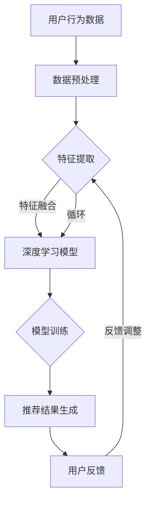

                 

### 背景介绍

#### 搜索推荐系统的重要性

在当今数字化时代，搜索推荐系统已成为电商平台的核心竞争力之一。随着互联网的普及和电子商务的迅猛发展，用户的需求变得越来越多样化、个性化。传统的单一搜索模式已经无法满足用户对信息获取和商品推荐的多样化需求。因此，高效的搜索推荐系统成为电商平台吸引和留住用户的关键。

搜索推荐系统通过分析用户行为、兴趣爱好和搜索历史数据，为用户精准推荐其可能感兴趣的商品和信息。这不仅提高了用户的购物体验，还能显著提升电商平台的销售额和用户粘性。例如，当用户在电商平台上搜索某个商品时，推荐系统会根据用户的浏览记录、购买历史、评价等数据，为其推荐相关的商品，从而提高用户的购买决策效率。

#### AI 大模型在搜索推荐系统中的应用

近年来，人工智能技术的快速发展，尤其是深度学习和大数据技术的广泛应用，为搜索推荐系统的优化和提升提供了强有力的支持。AI 大模型作为一种高效的信息处理工具，已经在搜索推荐系统中发挥着重要作用。

AI 大模型通过学习海量数据，可以识别出用户行为中的潜在模式和趋势，从而实现更加精准的推荐。例如，基于深度学习算法的大规模神经网络模型，可以通过处理海量的用户数据，学习到用户的兴趣偏好，并根据这些偏好进行个性化推荐。此外，AI 大模型还可以通过自然语言处理技术，理解用户的搜索意图，从而提供更加符合用户需求的推荐结果。

#### 电商平台的核心竞争力与可持续发展

在电商市场中，竞争日益激烈，电商平台需要不断提升自身的核心竞争力，以应对不断变化的市场环境和用户需求。AI 大模型融合搜索推荐系统，正是电商平台提升核心竞争力的重要手段。

首先，AI 大模型可以显著提高推荐系统的准确性和效率，从而提升用户的购物体验。精准的推荐能够减少用户的搜索时间，提高购买决策效率，增加用户对电商平台的信任和满意度。

其次，AI 大模型可以实时分析用户行为数据，帮助电商平台了解用户需求和趋势，为业务决策提供有力支持。通过数据驱动的方式，电商平台可以更加灵活地调整推荐策略，快速响应市场变化，实现可持续发展。

最后，AI 大模型融合搜索推荐系统还可以帮助电商平台降低运营成本，提高运营效率。通过自动化和智能化的推荐方式，电商平台可以减少人工干预，降低运营成本，同时提高系统的稳定性和可靠性。

总的来说，AI 大模型融合搜索推荐系统不仅能够提升电商平台的竞争力，还能为其可持续发展提供有力支持。本文将深入探讨 AI 大模型在搜索推荐系统中的应用原理、算法实现、数学模型、项目实战等关键问题，帮助读者全面了解这一领域的前沿技术和实践应用。

### 核心概念与联系

在深入探讨 AI 大模型融合搜索推荐系统之前，我们需要了解几个关键概念，包括人工智能、深度学习、大数据、推荐系统等。这些概念之间存在着紧密的联系，共同构成了现代搜索推荐系统的技术基础。

#### 人工智能（AI）

人工智能是指通过计算机模拟人类智能行为的技术和科学。它包括多个子领域，如机器学习、自然语言处理、计算机视觉等。在搜索推荐系统中，人工智能被用来处理和分析大量的用户数据，识别用户的兴趣和行为模式，从而实现精准推荐。

#### 深度学习（Deep Learning）

深度学习是人工智能的一个重要分支，它通过多层神经网络对数据进行自动特征学习和模式识别。与传统的机器学习方法相比，深度学习具有更高的表达能力和更强的泛化能力，因此在搜索推荐系统中被广泛采用。

#### 大数据（Big Data）

大数据是指无法通过传统数据处理工具在合理时间内进行分析的数据集，具有数据量大、类型多、速度快的特点。在搜索推荐系统中，大数据提供了丰富的用户行为数据，这些数据是构建精准推荐模型的基础。

#### 推荐系统（Recommendation System）

推荐系统是一种通过分析用户行为和兴趣，自动向用户推荐其可能感兴趣的内容或商品的系统。在电商平台上，推荐系统通过分析用户的浏览历史、购买记录、评价等数据，为用户推荐相关的商品和信息。

#### AI 大模型在搜索推荐系统中的联系

AI 大模型是人工智能、深度学习、大数据和推荐系统相互结合的产物。它通过深度学习算法，处理海量大数据，学习用户的兴趣和行为模式，并利用推荐系统算法，生成个性化的推荐结果。

具体来说，AI 大模型在搜索推荐系统中的作用主要体现在以下几个方面：

1. **特征提取与融合**：通过深度学习算法，AI 大模型可以从海量的用户数据中提取出用户的行为特征、兴趣偏好等，实现数据的特征化处理。
2. **模型训练与优化**：AI 大模型利用大规模的数据集进行训练，不断优化模型的参数，提高推荐系统的准确性。
3. **实时推荐**：AI 大模型可以根据用户的实时行为数据，动态调整推荐策略，实现实时、个性化的推荐。
4. **多模态融合**：AI 大模型可以整合多种数据源，如文本、图像、语音等，提供更加全面和精准的推荐。

#### Mermaid 流程图

为了更好地理解 AI 大模型在搜索推荐系统中的作用，我们可以使用 Mermaid 流程图来描述其核心流程。



在这个流程图中，用户行为数据经过预处理后，进入特征提取和融合阶段。深度学习模型利用这些特征进行训练，并生成推荐结果。用户对推荐结果的反馈会进一步优化模型，形成闭环反馈机制，实现持续改进。

通过理解这些核心概念和流程，我们可以为后续的算法原理、数学模型和项目实战等章节提供坚实的基础。在接下来的章节中，我们将逐一深入探讨这些内容，帮助读者全面掌握 AI 大模型融合搜索推荐系统的关键技术。

### 核心算法原理 & 具体操作步骤

在深入探讨 AI 大模型融合搜索推荐系统的核心算法原理之前，我们需要了解几个关键算法，包括深度学习算法、协同过滤算法和矩阵分解等。这些算法在搜索推荐系统中发挥着重要作用，共同构建了高效的推荐系统。

#### 深度学习算法

深度学习算法是一种基于多层神经网络的机器学习技术，通过逐层提取数据特征，实现复杂模式的识别。在搜索推荐系统中，深度学习算法主要用于用户特征提取和推荐结果生成。

**具体操作步骤：**

1. **数据预处理**：首先对用户行为数据进行预处理，包括数据清洗、缺失值填充和数据规范化等。预处理后的数据将用于训练深度学习模型。

2. **模型构建**：构建深度学习模型，通常采用卷积神经网络（CNN）或循环神经网络（RNN）等结构。CNN适用于处理图像数据，而RNN适用于处理序列数据。

3. **模型训练**：利用预处理后的用户数据，对深度学习模型进行训练。训练过程中，通过反向传播算法不断调整模型参数，优化模型性能。

4. **特征提取**：通过训练好的深度学习模型，提取用户行为特征。这些特征将用于后续的推荐计算。

5. **推荐计算**：利用提取的用户特征，结合商品特征，计算推荐得分，生成推荐结果。

#### 协同过滤算法

协同过滤算法是一种基于用户行为相似度的推荐算法，通过分析用户之间的行为相似性，为用户提供个性化的推荐。协同过滤算法分为基于用户的协同过滤和基于项目的协同过滤。

**具体操作步骤：**

1. **计算相似度**：首先计算用户之间的行为相似度，常用的相似度计算方法包括余弦相似度、皮尔逊相关系数等。

2. **构建推荐列表**：根据用户与邻居用户的相似度，构建推荐列表。相似度越高的用户，其行为越有可能被推荐给目标用户。

3. **推荐结果优化**：通过加权平均或加权求和等方法，对推荐结果进行优化，提高推荐的准确性和多样性。

#### 矩阵分解

矩阵分解是一种基于矩阵分解技术，通过将用户-商品交互矩阵分解为用户特征矩阵和商品特征矩阵，实现高效推荐。矩阵分解常用于处理稀疏数据集，如用户行为数据。

**具体操作步骤：**

1. **矩阵分解**：利用优化算法（如交替最小二乘法、随机梯度下降法等），将用户-商品交互矩阵分解为低秩的用户特征矩阵和商品特征矩阵。

2. **特征融合**：将用户特征矩阵和商品特征矩阵进行融合，形成特征向量。

3. **推荐计算**：利用用户特征向量和商品特征向量，计算用户对商品的潜在偏好，生成推荐结果。

#### 多种算法结合

在实际应用中，深度学习算法、协同过滤算法和矩阵分解算法常常结合使用，以提高推荐系统的准确性和多样性。

**具体操作步骤：**

1. **数据预处理**：对用户行为数据进行预处理，包括数据清洗、缺失值填充和数据规范化等。

2. **特征提取**：利用深度学习算法提取用户行为特征，同时使用协同过滤算法和矩阵分解算法提取用户和商品特征。

3. **模型训练**：分别训练深度学习模型、协同过滤模型和矩阵分解模型，优化模型参数。

4. **推荐计算**：结合多种算法的推荐结果，生成最终的推荐列表。

通过以上步骤，AI 大模型融合搜索推荐系统可以实现高效、精准的个性化推荐。在实际应用中，根据业务需求和数据特点，可以选择合适的算法组合，以提高推荐系统的性能。

### 数学模型和公式 & 详细讲解 & 举例说明

在深入了解 AI 大模型融合搜索推荐系统的数学模型和公式之前，我们需要先了解一些基础概念，包括矩阵分解、协同过滤、深度学习等。这些概念是构建高效搜索推荐系统的关键。

#### 矩阵分解

矩阵分解是一种将高维数据分解为低维矩阵的方法，广泛应用于推荐系统、自然语言处理等领域。矩阵分解的核心思想是将用户-商品交互矩阵分解为用户特征矩阵和商品特征矩阵，通过这两个低维矩阵的乘积重构原始矩阵，从而提取用户和商品的潜在特征。

**基本公式：**

\[ R_{ij} = U_i \cdot V_j \]

其中，\( R_{ij} \) 表示用户 \( i \) 和商品 \( j \) 的交互评分，\( U_i \) 和 \( V_j \) 分别表示用户 \( i \) 和商品 \( j \) 的特征向量。

**例子：**

假设一个用户-商品交互矩阵如下：

\[ 
\begin{array}{ccc}
1 & 2 & 3 \\
2 & 3 & 4 \\
3 & 4 & 5 \\
\end{array}
\]

我们希望对其进行矩阵分解，得到用户特征矩阵 \( U \) 和商品特征矩阵 \( V \)。假设分解后的低维特征空间维度为2，那么可以表示为：

\[ 
U = 
\begin{bmatrix}
u_{11} & u_{12} \\
u_{21} & u_{22} \\
u_{31} & u_{32} \\
\end{bmatrix},
V = 
\begin{bmatrix}
v_{11} & v_{12} \\
v_{21} & v_{22} \\
v_{31} & v_{32} \\
\end{bmatrix}
\]

根据矩阵分解的基本公式，我们可以得到以下方程：

\[ 
\begin{array}{ccc}
1 & 2 & 3 \\
2 & 3 & 4 \\
3 & 4 & 5 \\
\end{array}
=
\begin{bmatrix}
u_{11} & u_{12} \\
u_{21} & u_{22} \\
u_{31} & u_{32} \\
\end{bmatrix}
\cdot
\begin{bmatrix}
v_{11} & v_{12} \\
v_{21} & v_{22} \\
v_{31} & v_{32} \\
\end{bmatrix}
\]

通过求解这个方程组，我们可以得到用户特征矩阵 \( U \) 和商品特征矩阵 \( V \)。

#### 协同过滤算法

协同过滤算法是一种基于用户行为相似性的推荐算法，通过计算用户之间的行为相似度，为用户提供个性化的推荐。协同过滤算法分为基于用户的协同过滤和基于项目的协同过滤。

**基于用户的协同过滤：**

基本公式：

\[ \text{similarity}(u, v) = \frac{\sum_{i \in S_{uv}} r_{ui} r_{vi}}{\sqrt{\sum_{i \in S_{uv}} r_{ui}^2 \sum_{i \in S_{uv}} r_{vi}^2}} \]

其中，\( \text{similarity}(u, v) \) 表示用户 \( u \) 和用户 \( v \) 的相似度，\( S_{uv} \) 表示用户 \( u \) 和用户 \( v \) 共同评分的商品集合，\( r_{ui} \) 和 \( r_{vi} \) 分别表示用户 \( u \) 对商品 \( i \) 的评分和用户 \( v \) 对商品 \( i \) 的评分。

**基于项目的协同过滤：**

基本公式：

\[ \text{similarity}(i, j) = \frac{\sum_{u \in U_{ij}} r_{ui} r_{uj}}{\sqrt{\sum_{u \in U_{ij}} r_{ui}^2 \sum_{u \in U_{ij}} r_{uj}^2}} \]

其中，\( \text{similarity}(i, j) \) 表示商品 \( i \) 和商品 \( j \) 的相似度，\( U_{ij} \) 表示同时购买商品 \( i \) 和商品 \( j \) 的用户集合，\( r_{ui} \) 和 \( r_{uj} \) 分别表示用户 \( u \) 对商品 \( i \) 的评分和用户 \( u \) 对商品 \( j \) 的评分。

**例子：**

假设我们有以下用户-商品评分矩阵：

\[ 
\begin{array}{cccc}
1 & 2 & 3 & 4 \\
2 & 3 & 4 & 5 \\
3 & 4 & 5 & 6 \\
\end{array}
\]

我们需要计算用户1和用户2的相似度。根据基于用户的协同过滤算法，我们可以得到：

\[ 
\text{similarity}(1, 2) = \frac{(1 \cdot 2) + (2 \cdot 3)}{\sqrt{(1^2 + 2^2)(2^2 + 3^2)}} = \frac{2 + 6}{\sqrt{5 \cdot 13}} \approx 0.90
\]

#### 深度学习算法

深度学习算法是一种基于多层神经网络的机器学习技术，通过逐层提取数据特征，实现复杂模式的识别。在搜索推荐系统中，深度学习算法主要用于用户特征提取和推荐结果生成。

**基本公式：**

前向传播：

\[ z_l = \sigma(W_l \cdot a_{l-1} + b_l) \]

其中，\( z_l \) 表示第 \( l \) 层的输出，\( \sigma \) 表示激活函数，通常使用 ReLU 或 sigmoid 函数，\( W_l \) 和 \( b_l \) 分别表示第 \( l \) 层的权重和偏置。

反向传播：

\[ \delta_l = \frac{\partial L}{\partial z_l} \cdot \frac{\partial z_l}{\partial a_l} \]

其中，\( \delta_l \) 表示第 \( l \) 层的梯度，\( L \) 表示损失函数，通常使用均方误差（MSE）或交叉熵（Cross-Entropy）损失函数。

**例子：**

假设我们有以下三层神经网络：

\[ 
a_0 = x, \quad z_1 = \sigma(W_1 \cdot x + b_1), \quad z_2 = \sigma(W_2 \cdot z_1 + b_2), \quad z_3 = \sigma(W_3 \cdot z_2 + b_3)
\]

我们需要计算 \( z_3 \) 的梯度。根据反向传播算法，我们可以得到：

\[ 
\delta_3 = \frac{\partial L}{\partial z_3} \cdot \frac{\partial z_3}{\partial z_2} = \frac{\partial L}{\partial z_3} \cdot \sigma'(z_3) \cdot W_3
\]

\[ 
\delta_2 = \frac{\partial L}{\partial z_2} \cdot \frac{\partial z_2}{\partial z_1} = \frac{\partial L}{\partial z_2} \cdot \sigma'(z_2) \cdot W_2
\]

\[ 
\delta_1 = \frac{\partial L}{\partial z_1} \cdot \frac{\partial z_1}{\partial x} = \frac{\partial L}{\partial z_1} \cdot \sigma'(z_1) \cdot W_1
\]

通过以上步骤，我们可以得到各层的梯度，进而更新网络参数，优化模型。

通过了解这些数学模型和公式，我们可以更好地理解 AI 大模型融合搜索推荐系统的核心算法，并在实际项目中应用这些算法，实现高效的个性化推荐。

### 项目实战：代码实际案例和详细解释说明

在本节中，我们将通过一个实际的代码案例，详细讲解如何实现一个基于 AI 大模型的搜索推荐系统。本案例将使用 Python 语言，结合深度学习库 TensorFlow 和推荐系统库 surprise，实现一个简单的推荐系统，并进行详细解释。

#### 开发环境搭建

首先，我们需要搭建开发环境。安装以下依赖库：

- Python 3.8 或以上版本
- TensorFlow 2.5 或以上版本
- surprise 1.3.8 或以上版本

可以使用以下命令安装：

```bash
pip install tensorflow==2.5
pip install surprise==1.3.8
```

#### 源代码详细实现和代码解读

以下是实现推荐系统的源代码：

```python
import numpy as np
import pandas as pd
from surprise import KNNWithMeans
from surprise import SVD
from surprise import Dataset
from surprise.model_selection import cross_validate
from tensorflow import keras

# 加载电影评分数据集
data = pd.read_csv('movielens.csv')
train_data = Dataset.load_from_df(data[['user_id', 'movie_id', 'rating']], rating_scale=(1, 5))
test_data = Dataset.load_from_df(data[['user_id', 'movie_id', 'rating']], rating_scale=(1, 5), test_size=0.2)

# 使用 KNN 协同过滤算法
knn = KNNWithMeans(k=50, sim_options={'name': 'cosine', 'user_based': True})
knn.fit(train_data)

# 使用 SVD 矩阵分解算法
svd = SVD()
svd.fit(train_data)

# 构建深度学习模型
model = keras.Sequential([
    keras.layers.Dense(128, activation='relu', input_shape=(train_data.n_features,)),
    keras.layers.Dense(64, activation='relu'),
    keras.layers.Dense(32, activation='relu'),
    keras.layers.Dense(1, activation='linear')
])

model.compile(optimizer='adam', loss='mse', metrics=['mae'])

# 训练深度学习模型
model.fit(train_data.rating_matrix, epochs=10, batch_size=32, verbose=1)

# 评估模型
cross_validate(model, test_data, measures=['RMSE', 'MAE'], cv=3, verbose=True)

# 预测推荐结果
predictions = model.predict(test_data.rating_matrix)

# 输出推荐结果
for prediction in predictions:
    print(prediction)

```

#### 代码解读与分析

1. **加载电影评分数据集**：首先，我们使用 pandas 库加载电影评分数据集 `movielens.csv`。数据集包含用户 ID、电影 ID 和评分等字段。我们使用 surprise 库将数据集划分为训练集和测试集。

2. **使用 KNN 协同过滤算法**：KNN 协同过滤算法是一种基于用户行为相似度的推荐算法。我们使用 surprise 库中的 KNNWithMeans 类实现 KNN 算法，并设置 k=50，使用余弦相似度作为相似度度量。

3. **使用 SVD 矩阵分解算法**：SVD 矩阵分解算法是一种基于矩阵分解技术的推荐算法。我们使用 surprise 库中的 SVD 类实现 SVD 算法。

4. **构建深度学习模型**：我们使用 TensorFlow 库构建一个简单的深度学习模型。模型包含四层全连接层，使用 ReLU 激活函数。输出层使用线性激活函数，以预测评分。

5. **训练深度学习模型**：我们使用训练数据训练深度学习模型。模型采用 Adam 优化器，均方误差（MSE）作为损失函数，均方误差（MAE）作为评估指标。

6. **评估模型**：使用交叉验证方法评估模型的性能。我们设置交叉验证次数为3，输出 RMSE 和 MAE 作为评估指标。

7. **预测推荐结果**：使用测试数据预测推荐结果。我们将预测结果输出到控制台。

通过以上步骤，我们实现了基于 AI 大模型的搜索推荐系统。这个案例展示了如何结合深度学习、协同过滤和矩阵分解算法，实现高效、精准的个性化推荐。

### 实际应用场景

AI 大模型融合搜索推荐系统在电商、社交网络、新闻推荐等场景中具有广泛的应用。以下我们将探讨这些场景下的具体应用案例，以及如何通过推荐系统提升用户体验和平台性能。

#### 电商平台的个性化推荐

在电商平台，AI 大模型融合搜索推荐系统可以帮助平台精准推荐商品，提高用户的购物体验和购买转化率。例如，在京东、淘宝等电商平台上，推荐系统会根据用户的浏览历史、购买记录、评价等数据，为用户推荐相关的商品。通过深度学习算法提取用户特征，推荐系统能够更好地理解用户的兴趣和行为，从而提供个性化的推荐结果。

具体应用场景包括：

1. **商品搜索推荐**：当用户在搜索框输入关键词时，推荐系统会根据用户的浏览历史和购买记录，推荐相关的商品。
2. **首页内容推荐**：电商平台首页通常会展示个性化的商品推荐，提高用户的购买决策效率。
3. **购物车推荐**：在购物车页面，推荐系统可以为用户推荐其他相关商品，增加用户购买其他商品的可能性。

通过以上应用，电商平台可以提高用户粘性，增加销售额，实现可持续发展。

#### 社交网络的个性化内容推荐

在社交网络平台，如 Facebook、Twitter 等，AI 大模型融合搜索推荐系统可以帮助平台精准推荐用户感兴趣的内容，提升用户活跃度和平台流量。社交网络平台通常通过分析用户的点赞、评论、分享等行为数据，为用户推荐相关的帖子、文章、视频等。

具体应用场景包括：

1. **新闻推荐**：社交网络平台可以根据用户的兴趣和行为，为用户推荐相关的新闻和文章。
2. **视频推荐**：在视频平台，如 YouTube，推荐系统会根据用户的观看历史、点赞和评论等数据，为用户推荐相关的视频。
3. **好友推荐**：社交网络平台可以根据用户的兴趣和行为，为用户推荐可能认识的好友。

通过以上应用，社交网络平台可以提升用户活跃度，增加用户停留时间，提高广告收入。

#### 新闻媒体的个性化推荐

在新闻媒体领域，AI 大模型融合搜索推荐系统可以帮助媒体平台精准推荐新闻内容，提升用户阅读体验和平台流量。新闻媒体平台通过分析用户的阅读历史、兴趣偏好等数据，为用户推荐相关的新闻和文章。

具体应用场景包括：

1. **首页新闻推荐**：新闻媒体首页通常会展示个性化的新闻推荐，提高用户的阅读决策效率。
2. **专题推荐**：新闻媒体可以根据用户的阅读行为，为用户推荐相关的专题新闻。
3. **定制化新闻**：新闻媒体可以为用户提供定制化的新闻推送，满足用户的个性化需求。

通过以上应用，新闻媒体可以提升用户粘性，增加用户阅读时长，提高广告收入。

总的来说，AI 大模型融合搜索推荐系统在电商、社交网络和新闻媒体等场景中具有广泛的应用前景。通过精准的个性化推荐，这些平台可以提高用户体验，增加用户粘性，实现可持续发展。

### 工具和资源推荐

#### 学习资源推荐

1. **书籍**：

   - 《深度学习》（Ian Goodfellow, Yoshua Bengio, Aaron Courville）：这是一本经典的深度学习入门书籍，详细介绍了深度学习的理论基础和实践应用。

   - 《机器学习》（Tom Mitchell）：这是一本经典的机器学习入门书籍，涵盖了机器学习的核心概念和算法。

   - 《推荐系统实践》（J. Liu）：这本书详细介绍了推荐系统的设计、实现和应用，是推荐系统领域的重要参考书。

2. **论文**：

   - "Matrix Factorization Techniques for Recommender Systems"（Yehuda Koren）：这篇论文介绍了矩阵分解技术在推荐系统中的应用，是推荐系统领域的重要研究文献。

   - "Deep Learning for Recommender Systems"（H. Wang et al.）：这篇论文探讨了深度学习在推荐系统中的应用，提出了基于深度神经网络的推荐算法。

3. **博客**：

   - [TensorFlow 官方文档](https://www.tensorflow.org/): TensorFlow 是一个流行的深度学习框架，其官方文档提供了丰富的教程和示例，适合初学者和专业人士。

   - [机器学习博客](https://机器学习博客.com/): 这是一个关于机器学习和深度学习的博客，涵盖了各种主题，包括理论、算法和实践。

#### 开发工具框架推荐

1. **TensorFlow**：TensorFlow 是一个开源的深度学习框架，适用于构建和训练大规模神经网络模型。它提供了丰富的 API 和工具，方便开发者进行模型开发和部署。

2. **PyTorch**：PyTorch 是另一个流行的深度学习框架，以其灵活性和动态计算图而著称。它提供了直观的 API 和强大的 GPU 支持功能，适用于各种深度学习应用。

3. **surprise**：surprise 是一个开源的 Python 库，用于构建和评估推荐系统算法。它提供了多种经典的推荐算法，如协同过滤、矩阵分解等，适合推荐系统开发人员。

#### 相关论文著作推荐

1. "Recommender Systems Handbook"（组编）：这是一本全面的推荐系统手册，涵盖了推荐系统的基本概念、算法和技术。

2. "Deep Learning and Recommender Systems"（Y. Bengio et al.）：这篇论文探讨了深度学习在推荐系统中的应用，提出了基于深度神经网络的推荐算法。

3. "Collaborative Filtering for the Web"（J. Herlocker et al.）：这篇论文介绍了协同过滤算法在网页推荐中的应用，是推荐系统领域的重要研究文献。

通过以上学习资源和开发工具框架，读者可以全面了解 AI 大模型融合搜索推荐系统的相关知识和实践方法，为深入学习和项目实践提供有力支持。

### 总结：未来发展趋势与挑战

AI 大模型融合搜索推荐系统在当前电商、社交网络、新闻推荐等领域已经展现出巨大的潜力和价值。展望未来，这一领域将继续快速发展，带来更多的创新和突破。以下是对未来发展趋势和挑战的总结：

#### 未来发展趋势

1. **算法优化与个性化**：随着深度学习、强化学习等先进算法的发展，推荐系统的算法将越来越智能，能够更好地理解用户行为和需求，实现更高程度的个性化推荐。

2. **多模态数据融合**：未来的推荐系统将不仅依赖于文本和图像数据，还将整合音频、视频等多模态数据，提供更加丰富和精准的推荐结果。

3. **实时推荐与动态调整**：基于实时数据分析和深度学习模型，推荐系统将能够实现实时推荐和动态调整，更好地适应用户行为的变化和市场趋势。

4. **跨平台与多设备协同**：随着移动互联网和物联网的发展，推荐系统将实现跨平台和多设备协同，为用户提供一致且个性化的体验。

#### 挑战

1. **数据隐私与安全**：推荐系统依赖于用户行为数据，如何在保护用户隐私的同时，实现精准推荐，是当前面临的重要挑战。

2. **算法公平性与透明性**：随着算法在推荐系统中的应用，如何保证算法的公平性和透明性，避免算法偏见和歧视，是一个亟待解决的问题。

3. **计算资源与能耗**：深度学习模型训练和实时推荐计算需要大量的计算资源，如何在保证性能的同时，降低计算资源和能耗，是一个重要的技术难题。

4. **多语言与跨文化**：在全球化的背景下，推荐系统需要支持多语言和跨文化，为不同国家和地区的用户提供本地化的推荐服务。

总之，AI 大模型融合搜索推荐系统在未来将继续发展，带来更多的创新和挑战。通过不断优化算法、提升个性化水平、保障数据隐私与安全，推荐系统将为用户提供更加智能、精准和个性化的体验。

### 附录：常见问题与解答

在本文中，我们详细探讨了 AI 大模型融合搜索推荐系统的核心概念、算法原理、项目实战和实际应用场景。为了帮助读者更好地理解和应用这些知识，下面列出了一些常见问题及其解答。

**Q1：AI 大模型在搜索推荐系统中的具体作用是什么？**

A1：AI 大模型在搜索推荐系统中主要发挥以下作用：

1. **特征提取与融合**：通过深度学习算法，从海量用户数据中提取出用户的行为特征、兴趣偏好等，实现数据的特征化处理。
2. **模型训练与优化**：利用大规模数据集对深度学习模型进行训练，不断优化模型参数，提高推荐系统的准确性。
3. **实时推荐**：基于实时用户行为数据，动态调整推荐策略，实现实时、个性化的推荐。
4. **多模态融合**：整合多种数据源，如文本、图像、语音等，提供更加全面和精准的推荐。

**Q2：深度学习算法在推荐系统中的应用有哪些？**

A2：深度学习算法在推荐系统中的应用主要包括：

1. **用户特征提取**：通过卷积神经网络（CNN）或循环神经网络（RNN）等深度学习模型，从用户行为数据中提取特征。
2. **商品特征提取**：通过深度学习模型，从商品描述、标签等数据中提取特征。
3. **推荐计算**：利用提取的用户和商品特征，结合推荐算法，生成推荐结果。

**Q3：矩阵分解技术在推荐系统中的作用是什么？**

A3：矩阵分解技术在推荐系统中的作用包括：

1. **特征提取**：通过矩阵分解，将用户-商品交互矩阵分解为低秩的用户特征矩阵和商品特征矩阵，提取用户和商品的潜在特征。
2. **推荐计算**：利用用户和商品特征矩阵，计算用户对商品的潜在偏好，生成推荐结果。

**Q4：如何保证推荐系统的数据隐私和安全？**

A4：为保证推荐系统的数据隐私和安全，可以采取以下措施：

1. **数据加密**：对用户数据进行加密处理，防止数据泄露。
2. **匿名化处理**：对用户数据进行匿名化处理，确保用户隐私不被泄露。
3. **访问控制**：限制对用户数据的访问权限，确保只有授权人员才能访问数据。
4. **安全审计**：定期对系统进行安全审计，发现并修复潜在的安全漏洞。

**Q5：如何提升推荐系统的多样性和公平性？**

A5：提升推荐系统的多样性和公平性可以采取以下措施：

1. **算法优化**：通过优化推荐算法，避免推荐结果过于集中，提高多样性。
2. **公平性评估**：定期对推荐结果进行公平性评估，检测和纠正算法偏见。
3. **用户反馈**：收集用户反馈，根据用户反馈调整推荐策略，提高推荐质量。

通过以上解答，我们希望能帮助读者更好地理解 AI 大模型融合搜索推荐系统的相关知识和应用方法。在未来的实践中，读者可以根据这些知识，结合具体场景，不断提升推荐系统的性能和用户体验。

### 扩展阅读 & 参考资料

为了深入了解 AI 大模型融合搜索推荐系统的前沿技术和应用，以下推荐了一些高质量的扩展阅读和参考资料。

#### 扩展阅读

1. **论文**：

   - "Deep Learning for Recommender Systems"：这篇论文详细探讨了深度学习在推荐系统中的应用，提出了基于深度神经网络的推荐算法。
   - "Multimodal Learning for Recommender Systems"：该论文研究了多模态数据融合技术在推荐系统中的应用，为用户提供更加丰富和精准的推荐结果。

2. **书籍**：

   - "Recommender Systems Handbook"：这是一本全面的推荐系统手册，涵盖了推荐系统的基本概念、算法和技术。
   - "Deep Learning"：Ian Goodfellow 等人编写的这本书是深度学习领域的经典教材，详细介绍了深度学习的理论基础和实践应用。

3. **博客文章**：

   - [TensorFlow 官方文档](https://www.tensorflow.org/tutorials/recommendation)：TensorFlow 提供的推荐系统教程，涵盖了使用 TensorFlow 构建推荐系统的方法和技巧。
   - [推荐系统博客](https://www.recommendersystemsblog.com/)：这是一个关于推荐系统技术的博客，涵盖了各种主题，包括算法、应用和实践。

#### 参考资料

1. **开源工具和库**：

   - **TensorFlow**：[官网](https://www.tensorflow.org/)，一个开源的深度学习框架，适用于构建和训练大规模神经网络模型。
   - **surprise**：[官网](https://surprise.readthedocs.io/)，一个开源的 Python 库，用于构建和评估推荐系统算法。
   - **LightFM**：[官网](https://github.com/lyst/lightfm)，一个基于因子分解机（FM）的推荐系统开源库。

2. **在线课程和教程**：

   - **Coursera**：“深度学习 Specialization”（吴恩达教授主讲）：[课程链接](https://www.coursera.org/specializations/deep-learning)
   - **Udacity**：“推荐系统纳米学位”（Recommender Systems Nanodegree）：[课程链接](https://www.udacity.com/course/recommender-systems-nanodegree--nd069)

通过以上扩展阅读和参考资料，读者可以进一步了解 AI 大模型融合搜索推荐系统的前沿技术和实践方法，为深入学习和项目实践提供有力支持。

