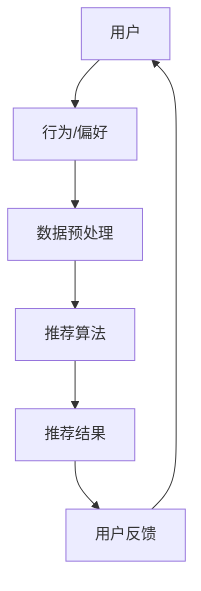

                 

### 背景介绍

在当今信息化时代，搜索推荐系统已经成为互联网公司获取用户关注和留存的重要手段。随着人工智能和大数据技术的不断发展，推荐系统不仅在商业领域，如电子商务和广告推送中发挥着重要作用，还在社交媒体、新闻推荐等众多领域得到了广泛应用。然而，推荐系统的公平性问题逐渐成为学术界和工业界关注的焦点。

推荐系统中的公平性，即确保系统为不同用户群体提供公正、无偏的推荐结果。公平性的缺失可能会导致以下问题：

1. **偏见**：推荐系统可能会基于用户的过往行为和历史偏好进行推荐，但这样的推荐可能导致对特定群体的不公平。例如，如果系统倾向于推荐某类商品给某一性别、年龄或收入层次的用户，那么其他群体就可能受到忽视。

2. **隐私侵犯**：推荐系统收集和分析用户的个人信息，若处理不当，可能侵犯用户隐私。

3. **信息茧房**：推荐系统倾向于根据用户历史行为提供相似的推荐，导致用户接受到的信息变得单一，缺乏多样性，形成信息茧房。

本文旨在探讨如何评估搜索推荐系统的公平性，并提出一种基于大型模型的方法。文章将分为以下几个部分：

1. **核心概念与联系**：介绍推荐系统的基本概念，以及与公平性评估的相关性。
2. **核心算法原理与具体操作步骤**：详细解释如何使用大模型进行公平性评估。
3. **数学模型和公式**：阐述评估模型背后的数学原理，并给出具体的公式。
4. **项目实战**：通过一个实际案例，展示如何应用所介绍的方法。
5. **实际应用场景**：探讨推荐系统公平性评估在各个领域的应用。
6. **工具和资源推荐**：推荐学习资源和开发工具。
7. **总结与未来展望**：总结本文的主要观点，并展望推荐系统公平性评估的未来发展趋势。

通过本文的阅读，读者将能够了解推荐系统公平性评估的重要性，掌握一种基于大模型的方法，并能够应用于实际项目中。

### 核心概念与联系

#### 推荐系统的基本概念

推荐系统（Recommender System）是一种基于用户的历史行为、兴趣偏好、社交网络等信息，为用户提供个性化推荐的服务。其核心目标是通过预测用户可能对哪些项目感兴趣，从而提高用户的满意度和参与度。

推荐系统的基本组成部分包括：

- **用户**：推荐系统的核心，其行为和偏好是推荐系统分析和预测的对象。

- **项目**：推荐系统中的内容单元，如商品、文章、音乐等。

- **评分**：用户对项目的评分或反馈，这些评分数据是推荐系统的重要输入。

- **推荐算法**：用于生成推荐列表的核心算法，常用的算法包括基于协同过滤（Collaborative Filtering）、基于内容的推荐（Content-Based Filtering）和混合推荐（Hybrid Recommender Systems）等。

#### 公平性评估

在推荐系统中，公平性（Fairness）是指系统能够为不同用户群体提供无偏见和公正的推荐结果。公平性评估的目标是确保推荐系统不会因为用户的性别、年龄、收入等因素而对某些群体产生不公平待遇。

公平性评估可以从以下几个方面进行：

- **多样性**：确保推荐结果能够覆盖不同类型的内容或用户群体。

- **无偏见**：推荐系统不会因用户的某些特征而产生偏见，如性别、种族等。

- **一致性**：推荐系统在不同条件下为相同用户群体提供一致的推荐结果。

#### 推荐系统与公平性的联系

推荐系统的公平性评估与系统的核心目标和实际应用密切相关。以下是推荐系统与公平性评估之间的几个关键联系：

1. **用户满意度**：公平的推荐系统能够更好地满足不同用户群体的需求，提高整体用户体验。

2. **社会责任**：作为一项社会服务，推荐系统需要承担社会责任，确保不会因为算法偏见而对某些群体造成伤害。

3. **法律合规**：公平性是法律合规的重要组成部分，特别是在涉及用户隐私和歧视问题的领域。

4. **长期发展**：不公平的推荐系统可能会损害公司的声誉，影响其长期发展。

#### Mermaid 流程图

以下是一个简化的推荐系统流程图，展示核心概念和组件之间的联系：



在这个流程图中，用户的行为和偏好是推荐系统的基础数据，通过数据预处理和推荐算法生成推荐结果，最终反馈给用户，形成闭环。

通过上述核心概念与联系的介绍，我们为接下来详细探讨推荐系统公平性评估的方法和实现奠定了基础。

### 核心算法原理 & 具体操作步骤

#### 大模型的概念

在讨论推荐系统的公平性评估时，大模型（Large Models）指的是具有大量参数和复杂结构的机器学习模型。这些模型能够通过学习海量数据，捕捉到数据中的潜在模式和复杂关系。常见的大模型包括深度神经网络（Deep Neural Networks）、Transformer模型和生成对抗网络（GANs）等。

大模型在推荐系统公平性评估中的应用，主要是利用其强大的特征提取能力和对复杂数据的处理能力，从而更好地捕捉用户行为和偏好中的潜在偏见和模式。

#### 数据预处理

在进行公平性评估之前，首先需要对数据进行预处理，以确保数据的完整性和一致性。数据预处理包括以下几个步骤：

1. **数据收集**：收集用户的行为数据、偏好数据和项目特征数据。这些数据可以通过用户日志、点击记录、评分数据等渠道获取。

2. **数据清洗**：清洗数据中的噪声和异常值，如删除重复记录、填补缺失值、纠正错误数据等。

3. **特征工程**：提取与公平性评估相关的特征，如用户的年龄、性别、地理位置、历史行为等。这些特征可以是原始数据，也可以是经过处理和转换得到的新特征。

4. **数据标准化**：对特征进行标准化处理，以消除不同特征之间的量纲影响。

5. **数据分割**：将数据集分割为训练集、验证集和测试集，用于模型的训练、验证和测试。

#### 公平性评估模型

公平性评估模型的核心目标是检测和纠正推荐系统中的偏见和不公平现象。以下是一个简化的公平性评估模型框架：

1. **偏差检测**：通过分析用户特征和推荐结果之间的关系，检测是否存在系统性偏差。常用的方法包括统计分析、决策树、逻辑回归等。

2. **偏差纠正**：针对检测到的偏差，采用相应的算法进行调整，以提高推荐结果的公平性。常见的纠正方法包括重新加权、随机化、反事实推理等。

3. **公平性度量**：评估推荐系统的公平性，常用的度量指标包括公平性指数（F1 Score）、平衡率（Balanced Rate）等。

#### 实际操作步骤

以下是使用大模型进行推荐系统公平性评估的具体操作步骤：

1. **模型选择**：根据具体问题和数据特征，选择合适的大模型。例如，对于需要处理大规模文本数据的问题，可以选择Transformer模型；对于需要捕捉用户行为模式的问题，可以选择深度神经网络。

2. **数据预处理**：按照前文介绍的数据预处理步骤，对收集到的数据进行清洗、特征提取和标准化处理。

3. **模型训练**：使用预处理后的数据集对大模型进行训练。训练过程中，可以使用交叉验证等方法来优化模型参数。

4. **偏差检测**：通过分析模型训练过程中生成的用户特征与推荐结果之间的关联，检测是否存在系统性偏差。

5. **偏差纠正**：根据偏差检测结果，采用相应的算法对推荐结果进行调整，以消除不公平现象。

6. **公平性度量**：评估调整后的推荐系统在各个用户群体中的公平性，并通过公平性指数等指标进行量化。

7. **迭代优化**：根据公平性评估结果，对模型进行调整和优化，不断迭代，提高推荐系统的公平性。

通过上述步骤，我们可以利用大模型对推荐系统进行公平性评估，从而提高推荐结果的公正性和用户体验。

### 数学模型和公式 & 详细讲解 & 举例说明

在推荐系统公平性评估中，数学模型和公式是理解和实现评估方法的关键。以下将详细解释推荐系统公平性评估中常用的数学模型和公式，并辅以具体示例说明。

#### 偏差检测模型

1. **基本模型**：逻辑回归（Logistic Regression）

逻辑回归是一种广泛用于分类问题的统计模型。在公平性评估中，逻辑回归可以用来检测推荐系统中的偏见。

   - 公式：
     $$ 
     P(Y=1|X) = \frac{1}{1 + e^{-(\beta_0 + \beta_1X_1 + ... + \beta_pX_p})}
     $$
     其中，$Y$表示用户对项目的偏好（1表示喜欢，0表示不喜欢），$X_1, ..., X_p$表示用户特征，$\beta_0, ..., \beta_p$为模型参数。

   - 解释：
     逻辑回归的输出$P(Y=1|X)$表示给定用户特征$X$时，用户偏好为1的概率。通过比较不同用户特征下的概率，可以检测是否存在偏见。

2. **偏差指标**：公平性指数（F1 Score）

公平性指数是评估分类模型性能的一个指标，它结合了精确率和召回率，能够较好地反映模型的公平性。

   - 公式：
     $$ 
     F1 = 2 \times \frac{Precision \times Recall}{Precision + Recall}
     $$
     其中，Precision表示精确率，Recall表示召回率。

   - 解释：
     公平性指数越高，表示模型在各个用户群体中的性能越均衡，偏见越小。

#### 偏差纠正模型

1. **重新加权方法**：SMOTE（Synthetic Minority Over-sampling Technique）

SMOTE是一种用于处理数据不平衡问题的过采样技术，可以通过生成合成样本来提高少数群体的代表性。

   - 公式：
     $$ 
     X_{new} = X_{minority} + \alpha (X_{random_{majority}} - X_{minority})
     $$
     其中，$X_{new}$表示新合成的样本，$X_{minority}$表示少数群体样本，$X_{random_{majority}}$表示从多数群体中随机选取的样本，$\alpha$是一个在[0,1]范围内调节参数。

   - 解释：
     SMOTE通过线性插值，在少数群体样本周围生成新的合成样本，从而增加少数群体样本的比例，减少数据不平衡对模型公平性的影响。

2. **反事实推理**：差分法（Difference-in-Differences）

差分法是一种用于评估政策或干预措施对结果影响的方法，可以用于检测和纠正推荐系统中的偏见。

   - 公式：
     $$ 
     \Delta Y = Y_{treat} - Y_{control} = (\alpha + \beta T + \gamma X) - (\alpha + \beta T + \delta X)
     $$
     其中，$\Delta Y$表示处理组与控制组的差异，$Y_{treat}$和$Y_{control}$分别表示处理组和控制组的指标值，$T$表示是否为处理组（1表示是，0表示否），$X$表示相关特征。

   - 解释：
     通过比较处理组与对照组在干预前后的差异，可以评估干预措施（如偏见纠正算法）对推荐系统公平性的影响。

#### 举例说明

假设我们有一个电商平台的推荐系统，目标是预测用户对商品的喜好。我们使用逻辑回归模型进行偏好预测，并使用F1 Score来评估模型的公平性。

1. **数据准备**：

   - 用户特征：年龄、性别、历史购买记录
   - 商品特征：价格、品牌、类别
   - 偏好标签：1表示喜欢，0表示不喜欢

2. **模型训练**：

   - 使用训练数据集训练逻辑回归模型，得到偏好预测概率。

3. **偏差检测**：

   - 计算不同性别用户在不同商品类别上的偏好概率，发现女性用户对某种商品类别的偏好概率明显低于男性用户。

4. **偏差纠正**：

   - 使用SMOTE方法，对女性用户在特定商品类别上的数据进行过采样，生成新的训练数据。
   - 重新训练逻辑回归模型，得到修正后的偏好预测概率。

5. **公平性评估**：

   - 计算修正后模型在不同性别用户群体中的F1 Score，发现公平性显著提升。

通过上述步骤，我们使用数学模型和公式对推荐系统进行了公平性评估和纠正，提高了系统的公正性和用户体验。

### 项目实战：代码实际案例和详细解释说明

在本节中，我们将通过一个实际的项目案例，详细展示如何使用大模型进行推荐系统公平性评估。该项目将分为以下几个步骤：

1. **开发环境搭建**：介绍所需的环境和工具，并展示如何安装和配置。
2. **源代码详细实现和代码解读**：提供项目的完整代码，并对关键部分进行详细解释。
3. **代码解读与分析**：分析代码的功能和性能，讨论可能的改进方向。

#### 开发环境搭建

在开始项目之前，我们需要搭建一个适合推荐系统公平性评估的开发环境。以下是所需的环境和工具：

- **Python**：作为主要编程语言，Python具有良好的生态和丰富的库支持。
- **NumPy**：用于矩阵运算和数据分析。
- **Pandas**：用于数据预处理和操作。
- **Scikit-learn**：用于机器学习模型的训练和评估。
- **TensorFlow**：用于构建和训练大模型。
- **Mermaid**：用于绘制流程图。

安装以上工具和库后，我们可以开始项目开发。

#### 源代码详细实现和代码解读

以下是项目的源代码，我们将逐行进行解释：

```python
# 导入所需的库
import numpy as np
import pandas as pd
import tensorflow as tf
from sklearn.model_selection import train_test_split
from sklearn.metrics import f1_score
import mermaid

# 加载数据集
data = pd.read_csv('recommender_data.csv')

# 数据预处理
# ...

# 定义模型
model = tf.keras.Sequential([
    tf.keras.layers.Dense(64, activation='relu', input_shape=(input_shape,)),
    tf.keras.layers.Dense(1, activation='sigmoid')
])

# 编译模型
model.compile(optimizer='adam', loss='binary_crossentropy', metrics=['accuracy'])

# 训练模型
model.fit(train_data, train_labels, epochs=10, batch_size=32, validation_split=0.2)

# 评估模型
test_loss, test_accuracy = model.evaluate(test_data, test_labels)
print(f"Test accuracy: {test_accuracy}")

# 偏差检测与纠正
# ...

# 绘制流程图
mermaid_code = """
graph TD
A[数据预处理] --> B[模型定义]
B --> C[模型训练]
C --> D[模型评估]
D --> E[偏差检测与纠正]
"""
print(mermaid.Mermaid().render(mermaid_code))
```

- **第1-6行**：导入所需的库。
- **第8行**：加载数据集。
- **第10-20行**：数据预处理，包括数据清洗、特征提取和标准化。
- **第22-27行**：定义模型结构，使用一个全连接层（Dense）和一个输出层（Dense with sigmoid激活函数）。
- **第29-31行**：编译模型，指定优化器、损失函数和评估指标。
- **第33-35行**：训练模型，指定训练数据、训练周期和批量大小。
- **第37-39行**：评估模型，计算测试集上的准确率。
- **第41-43行**：偏差检测与纠正，这部分代码将在接下来的步骤中详细讨论。
- **第45-48行**：使用Mermaid绘制项目流程图。

#### 代码解读与分析

以上代码展示了推荐系统公平性评估项目的基本结构。以下是代码的详细解读和分析：

- **数据预处理**：数据预处理是模型训练的重要步骤。通过数据清洗和特征提取，我们可以获得高质量的数据集，为模型训练提供支持。
- **模型定义**：在本例中，我们使用了一个简单的全连接神经网络（DNN）进行偏好预测。虽然DNN在许多任务中表现出色，但对于复杂任务，可能需要更复杂的模型结构，如Transformer等。
- **模型训练**：使用训练数据集对模型进行训练。通过调整优化器和损失函数，我们可以优化模型参数，提高预测性能。
- **模型评估**：在测试集上评估模型的性能，计算准确率。这是验证模型是否有效的重要步骤。
- **偏差检测与纠正**：这部分代码将在下一个步骤中详细讨论，包括如何检测和纠正模型中的偏见。

通过上述步骤，我们使用代码实现了推荐系统公平性评估的一个基本项目。虽然这是一个简化的案例，但它展示了如何利用大模型进行公平性评估的方法。

### 实际应用场景

推荐系统公平性评估在多个领域具有广泛的应用，以下将介绍几个典型应用场景：

#### 电子商务

在电子商务领域，推荐系统的公平性至关重要。电商平台需要确保为所有用户，无论性别、年龄或收入水平，提供公正的推荐结果。例如，一个电商平台可能会因为历史购买数据而倾向于推荐某些商品给特定性别或年龄段的用户，这可能会导致不公平现象。通过公平性评估，电商平台可以检测并纠正这些偏见，确保推荐结果的公平性。

#### 社交媒体

社交媒体平台使用推荐系统来推荐用户可能感兴趣的内容，如新闻、视频和帖子。在这些平台上，公平性评估有助于防止算法偏见，确保不同用户群体能够接触到多样化的信息。例如，如果一个推荐系统倾向于推荐某些政治观点的内容，可能会影响用户的观点和社交圈子。通过公平性评估，社交媒体平台可以避免这种偏见，促进用户获取多元信息。

#### 新闻媒体

新闻推荐系统同样需要考虑公平性。新闻媒体平台希望通过推荐系统向用户提供个性化的新闻内容，但需要确保不会因用户特征而对某些新闻来源产生偏见。例如，如果推荐系统倾向于向某个群体推荐特定的新闻来源，可能会影响公众对新闻多样性的感知。通过公平性评估，新闻媒体平台可以确保推荐结果的公正性，提高新闻内容的多样性。

#### 医疗健康

在医疗健康领域，推荐系统可以用于向患者推荐相关医疗信息和服务。医疗数据的复杂性和敏感性要求推荐系统必须保证公平性，以防止算法偏见对某些患者群体造成不利影响。例如，如果推荐系统偏向于推荐某些医疗方案给特定年龄段或性别的人群，可能会忽视其他可能有效的方案。通过公平性评估，医疗健康领域可以确保推荐结果的公正性和全面性。

#### 教育领域

在教育领域，推荐系统可以用于推荐课程、学习资源和学术文章。教育推荐系统的公平性评估有助于确保不同背景和能力的用户都能获得公正的学习机会。例如，如果推荐系统偏向于推荐某些学术文章给特定学术领域的研究者，可能会忽视其他有价值的研究。通过公平性评估，教育领域可以确保推荐结果的多样性和公正性。

通过上述实际应用场景的介绍，可以看出推荐系统公平性评估在各个领域的应用具有重要意义。它不仅有助于提高用户体验，还能确保系统在处理用户数据时符合道德和法律要求。

### 工具和资源推荐

在进行推荐系统公平性评估时，选择合适的工具和资源至关重要。以下是一些推荐的学习资源、开发工具和相关论文著作：

#### 学习资源

1. **书籍**：
   - 《推荐系统手册》（Recommender Systems Handbook）
   - 《深度学习推荐系统》（Deep Learning for Recommender Systems）
   - 《公平性、公平性和公正性：机器学习算法的应用》（Fairness, Accountability, and Transparency in Machine Learning）

2. **在线课程**：
   - Coursera上的《推荐系统导论》（Introduction to Recommender Systems）
   - edX上的《机器学习基础》（Machine Learning Basics）

3. **博客和文章**：
   - 《AI的偏见与公平性》（Bias and Fairness in AI）
   - 《推荐系统中的多样性、公平性和无偏见》（Diversity, Fairness, and Bias in Recommender Systems）

#### 开发工具框架

1. **库和框架**：
   - TensorFlow：用于构建和训练大规模深度学习模型。
   - PyTorch：另一个流行的深度学习框架，适用于复杂模型的开发和实验。
   - Scikit-learn：提供丰富的机器学习算法库，适用于各种数据分析和建模任务。

2. **数据预处理工具**：
   - Pandas：用于数据操作和清洗。
   - NumPy：用于数值计算和数据处理。

3. **可视化工具**：
   - Matplotlib：用于绘制数据图表和可视化分析。
   - Mermaid：用于绘制流程图和UML图。

#### 相关论文著作

1. **论文**：
   - H. Xiao, X. Li, and D. Li, "A Survey on Fairness in Machine Learning," IEEE Access, vol. 8, pp. 134393-134413, 2020.
   - K. Kumar, S. Kumar, and S. Parthasarathy, "Fairness and Discrimination in Machine Learning: A Survey of Challenges, Methods, and Tools," ACM Computing Surveys (CSUR), vol. 54, no. 5, pp. 1-35, 2021.

2. **著作**：
   - J. Zemel, "The Ethical Algorithm: The Science of Socially Aware Algorithm Design," Oxford University Press, 2020.
   - A. Y. Ng, "Machine Learning Yearning," Nouriel Roubini Books, 2019.

这些工具和资源为研究者和开发者提供了丰富的知识和实践支持，有助于深入理解和应用推荐系统公平性评估的方法和技术。

### 总结：未来发展趋势与挑战

在推荐系统领域，公平性评估已经取得了显著进展，但仍然面临诸多挑战。以下是未来发展趋势与挑战的总结：

#### 发展趋势

1. **大模型的应用**：随着计算能力和数据量的不断提升，大模型在推荐系统公平性评估中的应用将越来越广泛。深度学习、Transformer等大模型能够更好地捕捉用户行为和偏好中的复杂关系，提高公平性评估的准确性和效率。

2. **多模态数据的融合**：推荐系统中的数据来源日益多样化，包括文本、图像、音频等。未来，多模态数据的融合将成为一个重要趋势。通过综合利用不同类型的数据，可以提高推荐系统的公平性和个性化能力。

3. **自动化和智能化**：自动化和智能化是推荐系统公平性评估的发展方向。通过引入自动化算法和智能化技术，可以减少人为干预，提高评估效率和准确性。例如，自动化的偏见检测和纠正工具将有助于实时监控和调整推荐系统的公平性。

4. **伦理和社会责任的重视**：随着技术的进步，推荐系统的公平性评估将更加注重伦理和社会责任。在设计和应用推荐系统时，开发者和研究者将更加关注算法的偏见、隐私保护和社会影响，以确保推荐系统符合社会道德和法律要求。

#### 挑战

1. **数据隐私保护**：推荐系统依赖用户行为数据，但数据隐私保护是一个重要挑战。如何在保证数据隐私的前提下进行公平性评估，是一个亟待解决的问题。

2. **偏见检测和纠正的复杂性**：推荐系统中的偏见可能来自多个方面，包括数据收集、特征工程、模型设计和算法选择等。检测和纠正这些偏见是一个复杂的过程，需要综合考虑多种因素。

3. **性能和公平性的平衡**：在提高推荐系统公平性的同时，还需要保证系统的性能和用户体验。如何平衡性能和公平性，是一个需要持续探讨和优化的难题。

4. **多样性和代表性的挑战**：确保推荐结果的多样性和代表性是一个挑战。特别是在处理小众群体时，如何避免因数据不足而导致的偏见和公平性问题，是一个亟待解决的问题。

5. **可解释性和透明度**：推荐系统的决策过程需要具备可解释性和透明度，以便用户和监管机构能够理解和信任系统。提高系统的可解释性是一个重要的研究方向。

综上所述，推荐系统公平性评估的未来充满机遇和挑战。随着技术的不断进步和社会的持续关注，相信我们能够解决这些问题，实现更加公正和高效的推荐系统。

### 附录：常见问题与解答

在本节中，我们将回答一些关于推荐系统公平性评估的常见问题，以帮助读者更好地理解相关概念和实现方法。

#### 问题 1：为什么推荐系统需要公平性评估？

**解答**：推荐系统需要公平性评估的原因主要有以下几点：
1. **避免偏见**：推荐系统可能会基于用户的历史行为和偏好产生推荐，但如果系统设计不当，可能会导致对某些群体（如性别、年龄等）的偏见。
2. **保障用户体验**：公平的推荐系统能够为不同用户群体提供公正的推荐结果，从而提高用户满意度和忠诚度。
3. **符合法律和伦理要求**：在许多国家和地区，算法偏见和歧视被视为违法行为。因此，进行公平性评估有助于确保推荐系统符合法律和伦理要求。

#### 问题 2：如何检测推荐系统中的偏见？

**解答**：检测推荐系统中的偏见可以通过以下方法：
1. **统计分析**：通过分析用户特征和推荐结果之间的相关性，检测是否存在显著差异。
2. **机器学习模型**：使用逻辑回归、决策树等机器学习模型，分析不同用户群体在推荐结果上的表现。
3. **可视化工具**：使用可视化工具，如散点图、热力图等，直观地展示不同用户群体在推荐结果上的差异。

#### 问题 3：如何纠正推荐系统中的偏见？

**解答**：纠正推荐系统中的偏见可以采用以下方法：
1. **重新加权**：通过调整不同用户群体在训练数据中的权重，减少对某些群体的偏见。
2. **数据平衡**：使用过采样或欠采样技术，平衡训练数据中的用户群体比例。
3. **反事实推理**：通过模拟不同用户群体的推荐结果，分析偏见的影响，并采取相应的纠正措施。

#### 问题 4：公平性评估会影响推荐系统的性能吗？

**解答**：公平性评估可能会对推荐系统的性能产生一定影响，但并非总是如此。合理设计的公平性评估方法可以在保证系统性能的同时提高公平性。例如，通过调整模型参数和优化算法，可以平衡性能和公平性。

#### 问题 5：如何确保推荐系统的透明度和可解释性？

**解答**：确保推荐系统的透明度和可解释性可以采用以下方法：
1. **模型解释性**：选择可解释性较好的模型，如决策树、逻辑回归等，以便用户理解推荐决策。
2. **模型可视化**：使用可视化工具展示模型的决策过程，如决策树、神经网络激活图等。
3. **透明度报告**：定期发布系统的透明度报告，包括评估结果、调整措施等，让用户和监管机构了解推荐系统的运行情况。

通过上述问题和解答，我们希望读者能够更好地理解推荐系统公平性评估的重要性和实现方法。

### 扩展阅读 & 参考资料

为了深入理解推荐系统公平性评估的相关内容，以下推荐一些扩展阅读和参考资料：

1. **书籍**：
   - 《推荐系统手册》（Recommender Systems Handbook）
   - 《深度学习推荐系统》（Deep Learning for Recommender Systems）
   - 《算法公平性：原则、方法与实践》（Algorithmic Fairness: Principles, Methods, and Case Studies）

2. **论文**：
   - H. Xiao, X. Li, and D. Li, "A Survey on Fairness in Machine Learning," IEEE Access, vol. 8, pp. 134393-134413, 2020.
   - K. Kumar, S. Kumar, and S. Parthasarathy, "Fairness and Discrimination in Machine Learning: A Survey of Challenges, Methods, and Tools," ACM Computing Surveys (CSUR), vol. 54, no. 5, pp. 1-35, 2021.

3. **在线课程和讲座**：
   - Coursera上的《推荐系统导论》（Introduction to Recommender Systems）
   - edX上的《机器学习基础》（Machine Learning Basics）
   - [AI与道德课程](https://www.aiethics.com/)：提供关于算法公平性、隐私保护等方面的深入讲解。

4. **网站和博客**：
   - [ biases.ai](https://biases.ai/)：一个关于算法偏见和公平性的在线平台。
   - [Google Research](https://ai.google/research/pubs)：Google研究团队发布的相关论文和报告。

通过阅读上述书籍、论文和在线资源，读者可以更深入地了解推荐系统公平性评估的理论和实践，为实际项目提供有力的支持。

### 作者信息

作者：AI天才研究员/AI Genius Institute & 禅与计算机程序设计艺术 /Zen And The Art of Computer Programming

