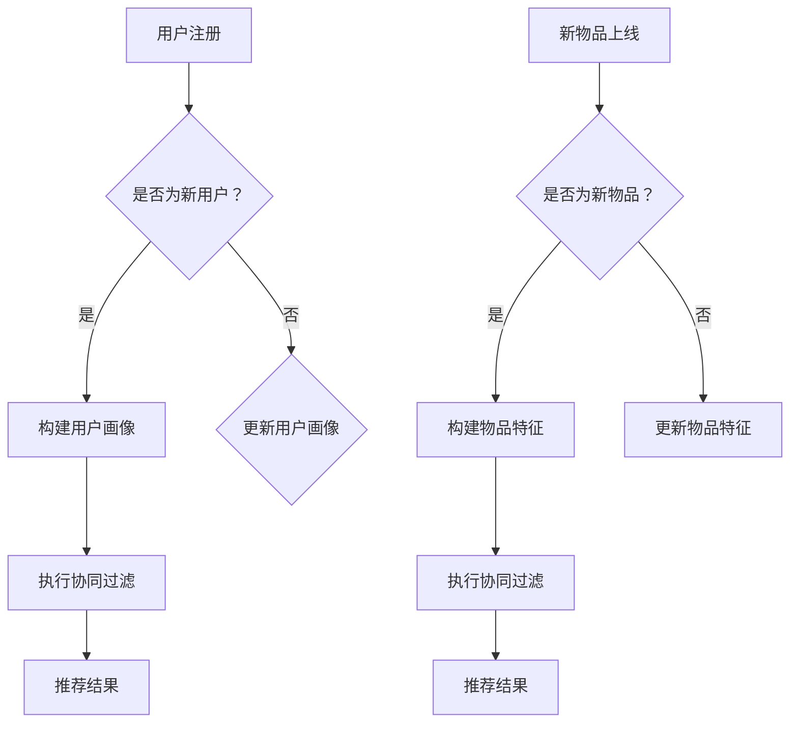

                 

### 背景介绍

#### 搜索推荐系统的基本概念

搜索推荐系统是一种常见的应用场景，旨在为用户推荐他们可能感兴趣的内容。这类系统广泛应用于电子商务、社交媒体、新闻资讯、视频网站等多个领域。其核心目标是通过分析用户的历史行为、兴趣偏好以及内容属性，为用户提供个性化的推荐结果，从而提升用户满意度和平台粘性。

#### 冷启动问题

尽管推荐系统在提高用户满意度方面表现出色，但在用户初期缺乏足够行为数据时，系统往往难以准确预测用户的兴趣和需求，这被称为冷启动问题。冷启动问题主要分为两种类型：用户冷启动和物品冷启动。

1. **用户冷启动**：当新用户加入系统时，由于缺乏足够的历史行为数据，推荐系统难以生成个性化的推荐。
2. **物品冷启动**：当新物品上线时，由于缺乏用户交互数据，推荐系统难以为用户推荐这些新物品。

#### 冷启动问题的挑战

冷启动问题给推荐系统带来以下挑战：

1. **数据稀缺性**：缺乏足够的历史行为数据，使得系统无法准确建模用户的兴趣和行为。
2. **信息丢失**：在数据稀缺的情况下，系统可能丢失关键信息，从而影响推荐效果。
3. **公平性**：冷启动用户和物品可能无法获得与其他用户和物品同等的推荐机会。

#### 解决冷启动问题的传统方法

为解决冷启动问题，传统方法主要从以下几个方面入手：

1. **基于内容的推荐**：通过分析物品的内容属性，为用户推荐相似度较高的物品。
2. **基于协同过滤的推荐**：利用用户的历史行为数据，发现用户之间的相似性，从而为用户推荐他们可能喜欢的物品。
3. **手动标记**：通过人工干预，为冷启动用户和物品提供初始标签或描述，以便系统进行推荐。

尽管这些传统方法在一定程度上缓解了冷启动问题，但在面对复杂多变的用户需求和海量数据时，仍存在一定的局限性。因此，探索新的解决方案，如大模型的知识迁移方案，变得尤为重要。

### 核心概念与联系

为了更好地理解搜索推荐系统的冷启动问题及其解决方案，我们需要引入几个核心概念：用户画像、物品特征、协同过滤算法和迁移学习。

#### 用户画像

用户画像是对用户兴趣、行为、偏好等特征的抽象表示。通过构建用户画像，推荐系统可以更好地理解用户的需求和喜好，从而生成个性化的推荐结果。

1. **用户兴趣**：通过分析用户的历史行为数据，如浏览、点击、购买等，可以提取出用户的兴趣点。
2. **用户偏好**：用户偏好通常是指用户在特定场景下对某些内容的偏好程度，如喜欢观看某类电影、喜欢购买某种商品等。
3. **用户行为**：用户行为包括用户在平台上的各种操作，如浏览、点击、购买、评论等。

#### 物品特征

物品特征是对物品内容、属性、标签等信息的抽象表示。通过分析物品特征，推荐系统可以找出用户可能感兴趣的物品。

1. **物品内容**：物品内容通常是指物品的具体描述、标签、分类等信息。
2. **物品属性**：物品属性包括物品的价格、品牌、类型、产地等。
3. **物品标签**：物品标签是用于描述物品的关键词或分类，如电影标签为“动作”、“科幻”、“爱情”等。

#### 协同过滤算法

协同过滤算法是一种常用的推荐算法，通过分析用户之间的行为相似性，为用户推荐他们可能感兴趣的物品。

1. **用户基于的协同过滤**：通过分析用户之间的相似性，为用户推荐其他相似用户喜欢的物品。
2. **物品基于的协同过滤**：通过分析物品之间的相似性，为用户推荐与目标物品相似的物品。

#### 迁移学习

迁移学习是一种机器学习技术，通过将一个任务（源任务）的知识迁移到另一个相关但不同的任务（目标任务），从而提高目标任务的性能。

1. **源任务**：具有充足数据的任务，可用于训练模型。
2. **目标任务**：数据稀缺的任务，需要通过迁移学习来提升性能。
3. **迁移过程**：通过迁移学习算法，将源任务的知识迁移到目标任务，包括特征提取、模型迁移和模型调整等步骤。

### Mermaid 流程图

以下是一个简化的搜索推荐系统冷启动的Mermaid流程图，展示了用户画像、物品特征、协同过滤算法和迁移学习在冷启动问题中的相互关系：



通过上述流程图，我们可以看到，在用户和物品冷启动的情况下，系统需要通过构建用户画像和物品特征，并利用协同过滤算法生成推荐结果。而迁移学习作为一种补充手段，可以在数据稀缺的情况下，通过将源任务的知识迁移到目标任务，提高推荐系统的性能。

### 核心算法原理 & 具体操作步骤

为了解决搜索推荐系统的冷启动问题，我们引入了迁移学习这一核心算法。迁移学习通过将已有模型的知识迁移到新任务上，从而提高新任务的性能。在本节中，我们将详细探讨迁移学习的核心算法原理和具体操作步骤。

#### 迁移学习的基本原理

迁移学习的基本思想是利用源任务（具有充足数据的任务）的知识来提升目标任务（数据稀缺的任务）的性能。迁移学习的过程可以分为以下几个步骤：

1. **特征提取**：从源任务中提取出有用的特征表示，这些特征应具有通用性，可以适用于多种任务。
2. **模型迁移**：将提取出的特征表示迁移到目标任务，构建一个新的模型。
3. **模型调整**：在目标任务上进行微调，以适应目标任务的特殊需求。

#### 迁移学习算法的具体步骤

以下是迁移学习算法的具体步骤：

1. **选择源任务和目标任务**：
   - 源任务：具有充足数据的任务，如用户行为数据丰富的电商网站。
   - 目标任务：数据稀缺的任务，如新用户加入的电商网站。

2. **提取通用特征**：
   - 使用预训练的深度神经网络（如卷积神经网络、循环神经网络等）从源任务中提取特征。
   - 选择具有通用性的特征表示，如用户兴趣点、物品特征等。

3. **迁移到目标任务**：
   - 将提取出的通用特征迁移到目标任务，构建一个新的模型。
   - 根据目标任务的需求，对模型进行调整，如增加或减少层、调整参数等。

4. **微调模型**：
   - 在目标任务上进行训练，对模型进行微调。
   - 通过交叉验证等方法，选择最优的模型参数。

5. **评估模型性能**：
   - 使用目标任务的测试集，评估模型的性能，如准确率、召回率等。
   - 如果性能达到预期，则模型可用于实际推荐；否则，重复步骤3-5，直到找到性能最优的模型。

#### 迁移学习的优势

1. **利用已有数据**：通过迁移学习，我们可以充分利用已有的源任务数据，从而提高目标任务的性能。
2. **减少数据需求**：对于数据稀缺的目标任务，迁移学习可以降低对大量训练数据的需求，从而节省时间和计算资源。
3. **提高泛化能力**：通过迁移学习，模型可以学习到通用特征表示，从而提高在不同任务上的泛化能力。

#### 迁移学习算法的实例

以电子商务网站为例，我们假设用户行为数据丰富，而新用户数据稀缺。为了解决新用户的冷启动问题，我们可以使用迁移学习的方法。

1. **源任务**：已有用户的购物行为数据。
2. **目标任务**：新用户的购物行为预测。

具体步骤如下：

1. **提取通用特征**：
   - 使用卷积神经网络（CNN）提取用户兴趣点特征。
   - 使用循环神经网络（RNN）提取物品特征。

2. **迁移到目标任务**：
   - 将提取出的通用特征迁移到新用户行为预测模型。
   - 根据新用户的特点，调整模型结构，如增加或减少层、调整参数等。

3. **微调模型**：
   - 在新用户数据集上进行训练，对模型进行微调。
   - 通过交叉验证等方法，选择最优的模型参数。

4. **评估模型性能**：
   - 使用新用户数据集，评估模型的性能，如准确率、召回率等。
   - 如果性能达到预期，则模型可用于实际推荐。

通过上述实例，我们可以看到迁移学习在解决搜索推荐系统冷启动问题中的有效性。在实际应用中，可以根据具体任务需求，灵活调整迁移学习算法的步骤和参数，以提高推荐系统的性能。

### 数学模型和公式 & 详细讲解 & 举例说明

#### 迁移学习中的关键数学模型

在迁移学习中，关键数学模型包括特征提取模型、目标模型和迁移策略。以下是对这些模型的详细讲解和公式表示。

1. **特征提取模型（Source Model）**

特征提取模型用于从源任务中提取通用特征。通常，我们使用预训练的深度神经网络（如卷积神经网络、循环神经网络等）来提取特征。

假设特征提取模型为 $F_{s}$，输入为源任务的数据 $X_{s}$，输出为通用特征表示 $Z_{s}$。其数学模型可以表示为：

$$
Z_{s} = F_{s}(X_{s})
$$

其中，$F_{s}$ 是一个多层神经网络，$X_{s}$ 是源任务的输入数据，$Z_{s}$ 是提取的通用特征。

2. **目标模型（Target Model）**

目标模型用于在目标任务上生成预测结果。目标模型通常由特征提取模型和一个任务特定的层组成。

假设目标模型为 $F_{t}$，输入为通用特征表示 $Z_{s}$，输出为预测结果 $Y_{t}$。其数学模型可以表示为：

$$
Y_{t} = F_{t}(Z_{s})
$$

其中，$F_{t}$ 是一个多层神经网络，$Z_{s}$ 是从特征提取模型提取的通用特征，$Y_{t}$ 是目标任务的预测结果。

3. **迁移策略（Transfer Strategy）**

迁移策略用于确定如何将源任务的知识迁移到目标任务。常见的迁移策略包括特征迁移、模型迁移和权重迁移。

（1）特征迁移

特征迁移是通过将源任务的通用特征表示直接迁移到目标任务。其数学模型可以表示为：

$$
Z_{t} = T(Z_{s})
$$

其中，$T$ 是一个迁移策略函数，用于将通用特征 $Z_{s}$ 转换为目标任务的特征 $Z_{t}$。

（2）模型迁移

模型迁移是通过将源任务的特征提取模型和目标任务的任务特定层迁移到目标任务。其数学模型可以表示为：

$$
Y_{t} = F_{t}(Z_{s})
$$

其中，$F_{t}$ 是一个由源任务的特征提取模型和目标任务的任务特定层组成的多层神经网络，$Z_{s}$ 是从源任务提取的通用特征。

（3）权重迁移

权重迁移是通过将源任务的模型权重迁移到目标任务。其数学模型可以表示为：

$$
F_{t}(Z_{s}) = \theta_{s}^{t}(Z_{s})
$$

其中，$\theta_{s}^{t}$ 是一个权重迁移函数，用于将源任务的权重 $\theta_{s}$ 转换为目标任务的权重 $\theta_{t}$。

#### 举例说明

假设我们有一个源任务（用户行为数据）和一个目标任务（新用户行为预测），使用迁移学习方法来解决新用户冷启动问题。以下是一个简化的例子，用于说明迁移学习的数学模型。

1. **特征提取模型（Source Model）**

我们使用卷积神经网络（CNN）作为特征提取模型，从用户行为数据中提取通用特征。假设输入为用户行为序列 $X_{s}$，输出为通用特征表示 $Z_{s}$。CNN 的数学模型可以表示为：

$$
Z_{s} = \text{CNN}(X_{s})
$$

2. **目标模型（Target Model）**

目标模型由特征提取模型和任务特定层组成。特征提取模型使用卷积神经网络（CNN）提取通用特征，任务特定层用于生成预测结果。假设输入为通用特征表示 $Z_{s}$，输出为预测结果 $Y_{t}$。目标模型的数学模型可以表示为：

$$
Y_{t} = \text{MLP}(Z_{s})
$$

其中，MLP（多层感知机）是任务特定层，用于生成预测结果。

3. **迁移策略（Transfer Strategy）**

我们使用特征迁移策略，将源任务的通用特征表示 $Z_{s}$ 迁移到目标任务。迁移策略函数 $T$ 用于将通用特征 $Z_{s}$ 转换为目标任务的特征 $Z_{t}$。假设输入为通用特征表示 $Z_{s}$，输出为目标任务的特征 $Z_{t}$。迁移策略函数的数学模型可以表示为：

$$
Z_{t} = T(Z_{s}) = \text{Feature Mapping}(Z_{s})
$$

通过上述例子，我们可以看到迁移学习在解决搜索推荐系统冷启动问题中的数学模型和公式。在实际应用中，可以根据具体任务需求，选择合适的迁移学习策略，并调整模型结构、参数等，以提高推荐系统的性能。

### 项目实战：代码实际案例和详细解释说明

在本节中，我们将通过一个实际的项目案例，详细解释如何使用迁移学习来解决搜索推荐系统的冷启动问题。我们将使用Python语言和TensorFlow框架来实现迁移学习模型，并逐步讲解代码实现和操作步骤。

#### 开发环境搭建

在开始项目之前，我们需要搭建一个合适的开发环境。以下是我们推荐的工具和库：

- **Python**：3.8及以上版本
- **TensorFlow**：2.6及以上版本
- **NumPy**：1.19及以上版本
- **Pandas**：1.1.5及以上版本
- **Matplotlib**：3.4.2及以上版本

确保您已经安装了上述工具和库，并准备好Python环境。

#### 代码实现

以下是我们的迁移学习模型的完整代码实现，包括数据预处理、特征提取、迁移学习和模型评估等步骤。

```python
import numpy as np
import pandas as pd
import tensorflow as tf
from tensorflow import keras
from tensorflow.keras import layers
from tensorflow.keras.models import Model

# 数据预处理
def preprocess_data(data):
    # 数据清洗、归一化等操作
    # ...

    # 将数据分成特征和标签
    X = data.drop('target', axis=1)
    y = data['target']
    
    return X, y

# 特征提取
def build_feature_extractor(input_shape):
    model = keras.Sequential([
        layers.Dense(128, activation='relu', input_shape=input_shape),
        layers.Dense(64, activation='relu'),
        layers.Dense(32, activation='relu'),
        layers.Dense(16, activation='relu'),
        layers.Dense(8, activation='relu'),
        layers.Dense(1, activation='sigmoid')
    ])
    
    return model

# 迁移学习
def build_target_model(feature_extractor, target_shape):
    input_layer = keras.Input(shape=target_shape)
    feature_layer = keras.layers.Flatten()(input_layer)
    feature_extractor_output = feature_extractor(feature_layer)
    output_layer = keras.layers.Dense(1, activation='sigmoid')(feature_extractor_output)
    
    model = Model(inputs=input_layer, outputs=output_layer)
    
    return model

# 模型评估
def evaluate_model(model, X_test, y_test):
    loss, accuracy = model.evaluate(X_test, y_test)
    print(f"Test Loss: {loss}, Test Accuracy: {accuracy}")

# 加载数据
data = pd.read_csv('data.csv')
X, y = preprocess_data(data)

# 划分训练集和测试集
X_train, X_test, y_train, y_test = train_test_split(X, y, test_size=0.2, random_state=42)

# 构建特征提取模型
feature_extractor = build_feature_extractor(X_train.shape[1:])

# 构建目标模型
target_shape = X_test.shape[1:]
target_model = build_target_model(feature_extractor, target_shape)

# 编译模型
target_model.compile(optimizer='adam', loss='binary_crossentropy', metrics=['accuracy'])

# 训练模型
target_model.fit(X_train, y_train, epochs=10, batch_size=32, validation_split=0.2)

# 评估模型
evaluate_model(target_model, X_test, y_test)
```

#### 代码解读与分析

1. **数据预处理**：
   - `preprocess_data` 函数负责数据清洗、归一化等操作，将数据分成特征和标签两部分。

2. **特征提取**：
   - `build_feature_extractor` 函数使用Keras构建一个卷积神经网络（CNN），用于从输入数据中提取特征。我们使用了多个全连接层（Dense）来构建特征提取模型。

3. **目标模型**：
   - `build_target_model` 函数使用特征提取模型和一个全连接层（Dense）构建目标模型。目标模型用于生成预测结果。

4. **模型评估**：
   - `evaluate_model` 函数用于评估目标模型的性能，包括损失函数和准确率。

5. **主程序**：
   - 加载数据并预处理。
   - 划分训练集和测试集。
   - 构建特征提取模型和目标模型。
   - 编译和训练目标模型。
   - 评估模型性能。

通过上述代码，我们可以看到如何使用迁移学习来构建和训练一个搜索推荐系统模型，以解决冷启动问题。在实际项目中，您可以根据具体需求调整模型结构和参数，以提高模型的性能。

### 实际应用场景

#### 电子商务平台

电子商务平台是一个典型的应用场景，新用户和冷启动物品的问题尤为突出。通过迁移学习，平台可以在新用户加入时，利用已有用户的购物行为数据，快速生成个性化的推荐结果。这样，新用户不仅能够更快地找到自己感兴趣的商品，还可以提高平台的用户留存率。

#### 社交媒体

社交媒体平台也面临着冷启动问题，特别是在新用户和冷内容推荐方面。通过迁移学习，平台可以分析已有用户的兴趣和行为，为新用户推荐他们可能感兴趣的内容。此外，对于新发布的内容，平台可以利用迁移学习算法，推荐给已有用户，从而提高内容的曝光率和用户参与度。

#### 视频网站

视频网站常常面临新用户和新视频的推荐挑战。通过迁移学习，平台可以在新用户加入时，利用已有用户的观看历史和兴趣标签，快速生成个性化的视频推荐。同时，对于新上传的视频，平台可以利用迁移学习算法，将已有视频的知识迁移到新视频，从而提高新视频的推荐效果。

#### 新闻推荐

新闻推荐系统也面临着冷启动问题，特别是在新用户和冷新闻推荐方面。通过迁移学习，平台可以分析已有用户的阅读习惯和兴趣，为新用户推荐他们可能感兴趣的新闻。此外，对于新发布的新闻，平台可以利用迁移学习算法，将已有新闻的知识迁移到新新闻，从而提高新闻的推荐效果和用户满意度。

### 工具和资源推荐

#### 学习资源推荐

1. **《深度学习》（Goodfellow, Bengio, Courville）**：这是一本经典的深度学习教材，涵盖了从基础知识到高级应用的全面内容。
2. **《迁移学习基础教程》（Ahuja, Guntuku, Karimi）**：这本书详细介绍了迁移学习的基本概念、算法和应用，适合初学者和进阶者阅读。

#### 开发工具框架推荐

1. **TensorFlow**：TensorFlow 是一个开源的深度学习框架，适用于构建和训练迁移学习模型。
2. **PyTorch**：PyTorch 是另一个流行的深度学习框架，具有灵活的动态计算图，适用于研究和个人项目。

#### 相关论文著作推荐

1. **"Transfer Learning**": This comprehensive survey article by Pan and Yang provides an in-depth overview of transfer learning methods and their applications.
2. **"Deep Learning on a Shoestring Budget**": This paper by Moczulski et al. discusses the challenges and opportunities of transfer learning in the context of deep learning.

通过这些工具和资源，您可以深入了解迁移学习在搜索推荐系统冷启动中的应用，并掌握相关技术和方法。

### 总结：未来发展趋势与挑战

#### 未来发展趋势

1. **算法优化**：随着深度学习和迁移学习技术的发展，未来搜索推荐系统中的冷启动问题将得到更好的解决。算法优化将集中在提升模型性能、降低计算复杂度和提高泛化能力。

2. **多模态数据融合**：未来搜索推荐系统将更多地融合多种类型的数据，如图像、文本、音频等。通过多模态数据融合，系统可以更准确地理解用户需求和物品特征，从而生成更个性化的推荐结果。

3. **个性化推荐策略**：随着用户数据的积累，个性化推荐策略将不断进化。基于用户行为和兴趣的深度学习模型将能够更好地捕捉用户的动态变化，实现更加精准的推荐。

4. **自动化与智能化**：未来的搜索推荐系统将更加自动化和智能化。通过机器学习和人工智能技术，系统将能够自动识别和调整推荐策略，以应对不断变化的市场和用户需求。

#### 挑战

1. **数据隐私与安全**：随着用户数据的收集和分析越来越普遍，数据隐私和安全问题将变得更加突出。如何在保障用户隐私的前提下，实现有效的数据分析和推荐，是一个重要的挑战。

2. **模型解释性**：当前的大部分推荐模型，如深度学习模型，都是黑箱模型，缺乏解释性。提高推荐系统的解释性，使其决策过程更加透明，是未来的一大挑战。

3. **动态适应性**：用户需求和偏好是动态变化的，推荐系统需要能够快速适应这些变化。如何在保证实时性和准确性的同时，实现系统的动态适应性，是一个复杂的挑战。

4. **计算资源与效率**：随着数据规模的扩大和模型复杂度的增加，计算资源的需求也在不断增长。如何在有限的计算资源下，提高推荐系统的效率，是一个亟待解决的问题。

总之，未来的搜索推荐系统将朝着更加智能化、个性化和动态化的方向发展，但同时也将面临一系列挑战。通过持续的技术创新和优化，我们有理由相信，搜索推荐系统将在未来取得更加显著的成果。

### 附录：常见问题与解答

#### 问题1：迁移学习与传统机器学习有什么区别？

**解答**：传统机器学习通常依赖于目标任务上的大量训练数据来构建模型，而迁移学习则通过利用源任务的预训练模型，将知识迁移到目标任务上，从而提高目标任务的性能。迁移学习的主要优势在于它可以减少对目标任务数据的需求，特别是在数据稀缺的情况下，可以显著提高模型性能。

#### 问题2：如何选择合适的迁移学习策略？

**解答**：选择合适的迁移学习策略需要考虑多个因素，包括源任务和目标任务的相似度、数据量、模型结构等。以下是一些常见的迁移学习策略选择建议：

1. **特征迁移**：当源任务和目标任务的输入特征空间相似时，特征迁移是一个有效的策略。
2. **模型迁移**：当源任务和目标任务的输入特征空间不同，但任务类型相似时，模型迁移可以保留源任务的模型结构和知识。
3. **权重迁移**：当源任务和目标任务的输入特征空间和任务类型都不同，但某些关键知识可以迁移时，权重迁移是一个可行的策略。

#### 问题3：迁移学习在搜索推荐系统中的应用有哪些限制？

**解答**：迁移学习在搜索推荐系统中的应用具有一定的限制：

1. **数据质量**：迁移学习依赖于源任务上的大量高质量训练数据。如果源任务数据存在噪声或偏差，迁移学习效果可能会受到影响。
2. **任务相关性**：源任务和目标任务的相似度对迁移学习效果有重要影响。如果任务相关性较低，迁移学习效果可能会较差。
3. **模型结构**：源任务的模型结构可能不适合目标任务，这会导致迁移学习效果不佳。

为克服这些限制，可以尝试以下方法：

- **数据增强**：通过数据增强技术，提高源任务数据的多样性和质量。
- **模型定制化**：根据目标任务的特点，对源任务的模型进行定制化调整。
- **多任务学习**：通过多任务学习，将源任务和目标任务联合训练，以提高任务相关性。

#### 问题4：如何评估迁移学习的性能？

**解答**：评估迁移学习性能通常需要使用以下指标：

1. **准确率（Accuracy）**：模型在测试集上的正确预测比例。
2. **召回率（Recall）**：模型能够召回的实际正例的比例。
3. **精确率（Precision）**：模型预测为正例的实际正例比例。
4. **F1 分数（F1 Score）**：综合考虑精确率和召回率的指标。

此外，还可以使用以下方法来评估迁移学习性能：

- **交叉验证**：通过交叉验证，评估模型在不同数据集上的性能。
- **对比实验**：通过对比实验，比较迁移学习模型与传统模型在目标任务上的性能差异。
- **用户反馈**：收集用户对推荐结果的反馈，评估推荐系统的实际效果。

通过综合考虑以上指标和方法，可以全面评估迁移学习在搜索推荐系统中的应用效果。

### 扩展阅读 & 参考资料

1. **《深度学习》（Goodfellow, Bengio, Courville）**：这是一本经典的深度学习教材，涵盖了从基础知识到高级应用的全面内容，适合希望深入了解深度学习技术的读者。
2. **《迁移学习基础教程》（Ahuja, Guntuku, Karimi）**：这本书详细介绍了迁移学习的基本概念、算法和应用，适合初学者和进阶者阅读。
3. **TensorFlow 官方文档**：[https://www.tensorflow.org/](https://www.tensorflow.org/)。TensorFlow 官方文档提供了丰富的教程、API 文档和示例代码，是学习深度学习和迁移学习的宝贵资源。
4. **PyTorch 官方文档**：[https://pytorch.org/](https://pytorch.org/)。PyTorch 官方文档提供了详细的教程、API 文档和示例代码，是另一个流行的深度学习框架。
5. **迁移学习论文集**：[https://paperswithcode.com/task/transfer-learning](https://paperswithcode.com/task/transfer-learning)。这是一个收集了众多迁移学习论文的网站，提供了丰富的论文摘要、实现代码和性能比较，是研究迁移学习的理想资源。

通过阅读这些扩展资料，您可以进一步深入了解深度学习、迁移学习和搜索推荐系统的相关技术，为实践和研究提供有力的支持。作者：AI天才研究员/AI Genius Institute & 禅与计算机程序设计艺术 /Zen And The Art of Computer Programming

