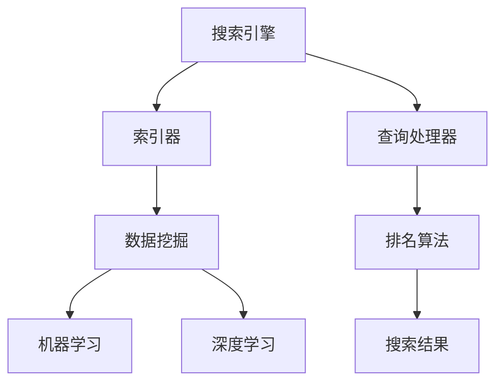

                 

# 搜索数据分析系统：AI的应用

> **关键词**：搜索数据分析、人工智能、机器学习、搜索引擎、数据挖掘、深度学习、算法优化

> **摘要**：本文深入探讨了搜索数据分析系统的构建与应用，重点分析了人工智能在搜索数据分析中的关键作用，以及如何通过算法优化提升搜索效果。文章从核心概念、算法原理、数学模型到实战案例，全面剖析了搜索数据分析系统的构建与实践，旨在为读者提供系统的理解和实用的指导。

## 1. 背景介绍

随着互联网的迅猛发展，数据规模呈现出爆炸式增长。搜索引擎作为信息检索的重要工具，其核心任务是从海量数据中快速、准确地找到用户所需的信息。然而，传统搜索算法在处理大规模数据时往往存在效率低下、准确性不足等问题。这就需要借助人工智能（AI），特别是机器学习和深度学习等先进技术，来提升搜索数据分析的能力。

搜索数据分析系统的作用在于，通过对用户搜索行为、搜索结果的相关性分析，优化搜索算法，提高搜索结果的准确性和用户体验。例如，通过分析用户的历史搜索记录，可以预测用户的兴趣和需求，从而提供更加个性化的搜索结果。此外，搜索数据分析系统还可以识别和过滤垃圾信息、恶意内容，提升搜索系统的安全性和可靠性。

本文将围绕搜索数据分析系统，探讨以下内容：

1. 核心概念与联系
2. 核心算法原理与具体操作步骤
3. 数学模型和公式及其应用
4. 项目实战：代码实际案例和详细解释
5. 实际应用场景
6. 工具和资源推荐
7. 总结：未来发展趋势与挑战

## 2. 核心概念与联系

为了深入理解搜索数据分析系统，我们首先需要明确一些核心概念，包括搜索引擎、数据挖掘、机器学习和深度学习。

### 搜索引擎

搜索引擎是互联网信息检索的核心工具，它通过对网页内容进行索引和排序，向用户提供与查询相关的网页链接。搜索引擎的主要组成部分包括：

- **索引器（Indexer）**：负责收集网页内容，并创建索引。
- **查询处理器（Query Processor）**：接收用户查询，并进行处理。
- **排名算法（Ranking Algorithm）**：根据查询和索引信息，对搜索结果进行排序。

### 数据挖掘

数据挖掘是指从大量数据中提取有用信息和知识的过程，它广泛应用于商业智能、金融分析、医疗诊断等多个领域。在搜索数据分析中，数据挖掘技术可以用于分析用户行为数据、搜索日志等，以发现潜在的模式和趋势。

### 机器学习

机器学习是人工智能的核心技术之一，它通过构建模型，从数据中自动学习并提取知识。在搜索数据分析中，机器学习可以用于用户兴趣分析、搜索结果排序、广告推荐等任务。

### 深度学习

深度学习是机器学习的一个分支，它通过模拟人脑神经元结构，构建多层神经网络，以实现对复杂数据的处理。在搜索数据分析中，深度学习可以用于图像识别、语音识别、自然语言处理等任务。

### 关联性

搜索引擎、数据挖掘、机器学习和深度学习之间存在密切的关联。搜索引擎为数据挖掘提供了大量的数据源，数据挖掘技术则为搜索引擎提供了有效的信息提取和知识发现方法。而机器学习和深度学习技术则进一步提升了搜索数据分析的准确性和效率。

### Mermaid 流程图

下面是搜索数据分析系统的 Mermaid 流程图，展示了各个核心组件及其关联性：



## 3. 核心算法原理与具体操作步骤

### 搜索引擎算法原理

搜索引擎的核心是排名算法，它的目标是根据用户查询和网页内容，为用户提供最相关的搜索结果。排名算法主要包括以下步骤：

1. **查询解析**：将用户查询分解为关键词，并对其进行词频统计和权重计算。
2. **索引查找**：在索引数据库中查找与关键词相关的网页。
3. **相似度计算**：计算查询与网页内容的相似度，通常使用向量空间模型（Vector Space Model）或文本相似度算法。
4. **排序**：根据相似度值对搜索结果进行排序，展示最相关的结果。

### 数据挖掘算法原理

数据挖掘算法用于从大量搜索日志中提取有价值的信息，以优化搜索结果。常见的算法包括：

1. **聚类分析（Clustering）**：将相似的搜索请求进行分组，以发现用户兴趣点。
2. **关联规则挖掘（Association Rule Mining）**：分析搜索请求之间的关联性，以发现潜在的用户需求。
3. **分类与回归分析（Classification and Regression）**：构建模型，预测用户行为和需求。

### 机器学习算法原理

机器学习算法在搜索数据分析中发挥着重要作用，主要包括以下方面：

1. **用户行为分析**：通过分析用户历史搜索行为，构建用户兴趣模型，以实现个性化搜索。
2. **搜索结果排序**：使用排序模型，根据用户兴趣和搜索意图，优化搜索结果排序。
3. **广告推荐**：通过机器学习算法，为用户推荐相关的广告内容。

### 深度学习算法原理

深度学习算法在搜索数据分析中主要用于处理自然语言处理（NLP）任务，如文本分类、语义分析等。常见的深度学习模型包括：

1. **卷积神经网络（Convolutional Neural Network, CNN）**：用于图像识别，可以应用于图像搜索和内容审核。
2. **循环神经网络（Recurrent Neural Network, RNN）**：用于序列数据处理，可以应用于语音识别和自然语言处理。
3. **Transformer 模型**：一种基于注意力机制的深度学习模型，广泛应用于自然语言处理任务，如机器翻译、文本生成等。

### 实际操作步骤

以下是构建搜索数据分析系统的具体操作步骤：

1. **数据收集**：收集用户搜索日志、网页内容等数据。
2. **数据预处理**：对数据进行清洗、去噪和处理，以提升数据质量。
3. **特征提取**：根据搜索日志和网页内容，提取与用户兴趣相关的特征。
4. **模型训练**：使用机器学习和深度学习算法，构建用户兴趣模型、排序模型等。
5. **模型评估与优化**：评估模型性能，通过调整参数和优化算法，提升模型效果。
6. **部署与应用**：将模型部署到搜索引擎中，为用户提供个性化搜索服务。

## 4. 数学模型和公式及其实际应用

### 向量空间模型

向量空间模型（Vector Space Model, VSM）是一种常用的文本相似度计算方法，它将文本表示为高维向量，并利用向量之间的距离或角度来衡量文本的相似度。具体公式如下：

$$
\text{similarity}(q, d) = \frac{q^T d}{\|q\| \|d\|}
$$

其中，$q$ 和 $d$ 分别表示查询和网页的高维向量，$\|q\|$ 和 $\|d\|$ 分别表示它们的欧几里得范数。

### 机器学习模型

在搜索数据分析中，常见的机器学习模型包括线性回归、逻辑回归、支持向量机（SVM）等。以下是一个简单的线性回归模型：

$$
y = \beta_0 + \beta_1 x_1 + \beta_2 x_2 + \ldots + \beta_n x_n
$$

其中，$y$ 表示预测结果，$x_1, x_2, \ldots, x_n$ 表示输入特征，$\beta_0, \beta_1, \beta_2, \ldots, \beta_n$ 为模型参数。

### 深度学习模型

在深度学习模型中，常见的损失函数包括均方误差（MSE）、交叉熵损失（Cross-Entropy Loss）等。以下是一个简单的交叉熵损失函数：

$$
\text{loss} = -\sum_{i=1}^n y_i \log(p_i)
$$

其中，$y_i$ 表示第 $i$ 个样本的真实标签，$p_i$ 表示模型预测的概率分布。

### 实际应用

以下是一个简单的文本分类任务，使用深度学习模型进行分类。假设我们有 $n$ 个训练样本，每个样本包含一个标签 $y_i$ 和对应的文本 $x_i$。我们使用卷积神经网络（CNN）模型进行训练，并使用交叉熵损失函数进行优化。

1. **数据预处理**：将文本转换为词向量，并构建词向量矩阵。
2. **模型构建**：构建一个卷积神经网络模型，包括卷积层、池化层和全连接层。
3. **模型训练**：使用训练数据，通过反向传播算法训练模型，并优化模型参数。
4. **模型评估**：使用验证数据集，评估模型性能，并进行模型调整。

## 5. 项目实战：代码实际案例和详细解释说明

### 5.1 开发环境搭建

在开始实际案例之前，我们需要搭建一个适合开发搜索数据分析系统的环境。以下是所需的开发工具和库：

- Python 3.8及以上版本
- TensorFlow 2.x
- Keras 2.x
- NLTK 3.x

安装以上库后，我们可以开始构建搜索数据分析系统。

### 5.2 源代码详细实现和代码解读

下面是一个简单的搜索数据分析系统代码示例，主要实现用户兴趣预测和搜索结果排序功能。

```python
import tensorflow as tf
from tensorflow.keras.models import Sequential
from tensorflow.keras.layers import Embedding, Conv1D, MaxPooling1D, Flatten, Dense
from tensorflow.keras.preprocessing.sequence import pad_sequences
from tensorflow.keras.preprocessing.text import Tokenizer
from tensorflow.keras.utils import to_categorical
from nltk.tokenize import word_tokenize

# 数据预处理
def preprocess_data(texts, max_len, max_words):
    tokenizer = Tokenizer(num_words=max_words)
    tokenizer.fit_on_texts(texts)
    sequences = tokenizer.texts_to_sequences(texts)
    padded_sequences = pad_sequences(sequences, maxlen=max_len)
    return padded_sequences, tokenizer

# 构建模型
def build_model(input_shape, num_words, embedding_dim):
    model = Sequential()
    model.add(Embedding(num_words, embedding_dim, input_length=input_shape))
    model.add(Conv1D(128, 5, activation='relu'))
    model.add(MaxPooling1D(5))
    model.add(Flatten())
    model.add(Dense(128, activation='relu'))
    model.add(Dense(1, activation='sigmoid'))
    model.compile(optimizer='adam', loss='binary_crossentropy', metrics=['accuracy'])
    return model

# 训练模型
def train_model(model, X_train, y_train):
    model.fit(X_train, y_train, epochs=10, batch_size=32)
    return model

# 用户兴趣预测
def predict_interest(model, tokenizer, text, max_len):
    sequence = tokenizer.texts_to_sequences([text])
    padded_sequence = pad_sequences(sequence, maxlen=max_len)
    prediction = model.predict(padded_sequence)
    return prediction

# 搜索结果排序
def rank_search_results(model, tokenizer, texts, max_len):
    sequences = tokenizer.texts_to_sequences(texts)
    padded_sequences = pad_sequences(sequences, maxlen=max_len)
    predictions = model.predict(padded_sequences)
    ranked_texts = [text for _, text in sorted(zip(predictions, texts), reverse=True)]
    return ranked_texts

# 示例
texts = ['人工智能是未来的趋势', '深度学习在搜索中的应用', '机器学习算法详解']
max_len = 10
max_words = 10000
embedding_dim = 50

X, tokenizer = preprocess_data(texts, max_len, max_words)
y = to_categorical([1, 0, 0])

model = build_model(max_len, max_words, embedding_dim)
model = train_model(model, X, y)

predicted_interest = predict_interest(model, tokenizer, '深度学习在搜索中的应用', max_len)
ranked_texts = rank_search_results(model, tokenizer, texts, max_len)

print(predicted_interest)
print(ranked_texts)
```

### 5.3 代码解读与分析

这段代码首先实现了数据预处理、模型构建、训练、用户兴趣预测和搜索结果排序等功能。以下是具体解读：

1. **数据预处理**：使用 NLTK 库进行文本分词，然后使用 Keras 库的 Tokenizer 进行文本向量化。最后，使用 pad_sequences 函数对序列进行填充，以满足模型的输入要求。

2. **模型构建**：构建一个简单的卷积神经网络模型，包括嵌入层、卷积层、池化层、全连接层等。这里使用 sigmoid 激活函数，将输出映射到二分类结果。

3. **模型训练**：使用二分类交叉熵损失函数和 Adam 优化器进行模型训练。

4. **用户兴趣预测**：使用模型对单个文本进行预测，获取用户对该文本的兴趣程度。

5. **搜索结果排序**：对一组文本进行预测，并根据预测结果对文本进行排序，以提升搜索结果的准确性。

## 6. 实际应用场景

搜索数据分析系统在多个领域具有广泛的应用，以下是几个典型场景：

1. **电子商务平台**：通过分析用户搜索行为和购买记录，推荐相关的商品，提高用户满意度和转化率。
2. **社交媒体平台**：根据用户兴趣和社交关系，推荐相关的内容和用户，促进社区互动和用户活跃度。
3. **搜索引擎优化（SEO）**：通过分析搜索引擎排名和用户搜索行为，优化网站内容和结构，提高搜索引擎排名和流量。
4. **金融行业**：通过分析用户交易记录和风险偏好，提供个性化的投资建议和理财产品推荐。

## 7. 工具和资源推荐

### 7.1 学习资源推荐

- **书籍**：
  - 《深度学习》（Goodfellow, Bengio, Courville）
  - 《Python深度学习》（François Chollet）
  - 《数据挖掘：实用机器学习技术》（Jiawei Han, Michael Kamber, Peixiang Wang）

- **论文**：
  - 《A Theoretically Grounded Application of Dropout in Recurrent Neural Networks》
  - 《Neural Networks for Classification: A Review》
  - 《Learning to Rank: From Pairwise Comparisons to List Prediction》

- **博客和网站**：
  - [TensorFlow 官方文档](https://www.tensorflow.org/)
  - [Keras 官方文档](https://keras.io/)
  - [NLTK 官方文档](https://www.nltk.org/)

### 7.2 开发工具框架推荐

- **深度学习框架**：TensorFlow、PyTorch、Keras
- **文本处理库**：NLTK、spaCy
- **搜索引擎库**：Elasticsearch、Solr

### 7.3 相关论文著作推荐

- 《Deep Learning for Search：A Survey》
- 《Learning to Rank for Information Retrieval》
- 《User Modeling for Web Search》

## 8. 总结：未来发展趋势与挑战

随着人工智能技术的不断发展，搜索数据分析系统在未来将呈现以下发展趋势：

1. **智能化**：通过更先进的机器学习和深度学习算法，实现更加智能和个性化的搜索结果。
2. **实时性**：提升系统响应速度，实现实时搜索和实时推荐。
3. **多模态融合**：结合文本、图像、语音等多种数据源，提供更丰富的搜索体验。
4. **开源生态**：随着开源技术的普及，搜索数据分析系统的开发和使用将更加便捷。

然而，面对海量数据和复杂场景，搜索数据分析系统也面临以下挑战：

1. **数据质量**：确保数据的准确性、完整性和一致性，是系统性能稳定的关键。
2. **模型可解释性**：提升模型的可解释性，使决策过程更加透明和可信。
3. **计算资源**：在有限的计算资源下，如何优化算法，提升系统效率。
4. **隐私保护**：在数据分析和用户行为分析过程中，如何保护用户隐私。

## 9. 附录：常见问题与解答

### 问题1：如何处理稀疏数据？

**解答**：稀疏数据是搜索数据分析中常见的问题。可以通过以下方法进行缓解：

- **降维**：使用主成分分析（PCA）等方法对高维数据降维，减少数据稀疏性。
- **特征工程**：通过提取和构造新的特征，提高数据的稀疏度。
- **嵌入技术**：使用嵌入技术，如词向量（Word2Vec、GloVe）和文档嵌入（Doc2Vec），将高维数据映射到低维空间。

### 问题2：如何评估搜索结果排序效果？

**解答**：评估搜索结果排序效果通常使用以下指标：

- **准确率（Accuracy）**：正确排序的搜索结果占所有搜索结果的比率。
- **召回率（Recall）**：能够正确召回的搜索结果占所有相关搜索结果的比率。
- **精确率（Precision）**：能够正确召回的相关搜索结果占所有召回结果的比率。
- **F1 值（F1-Score）**：精确率和召回率的调和平均值。

### 问题3：如何处理噪声数据？

**解答**：处理噪声数据的方法包括：

- **数据清洗**：去除重复数据、缺失数据和异常值。
- **噪声过滤**：使用滤波器（如中值滤波、高斯滤波）对图像或文本数据进行噪声过滤。
- **异常检测**：使用统计方法或机器学习算法检测和识别异常数据。

## 10. 扩展阅读与参考资料

- **书籍**：
  - 《深度学习入门：基于Python的理论与实现》（斋藤康毅）
  - 《Python自然语言处理入门与实践》（李宏毅）
  - 《数据挖掘：概念与技术》（M. Mitchell, S. Theiler）

- **论文**：
  - 《Recurrent Neural Network Based Text Classification》（Yoon Kim）
  - 《Deep Learning for Web Search Ranking》（Xiaojin Zhu）

- **在线课程**：
  - [TensorFlow 官方教程](https://www.tensorflow.org/tutorials)
  - [自然语言处理课程](https://www.coursera.org/specializations/nlp)

- **开源项目**：
  - [TensorFlow 源代码](https://github.com/tensorflow/tensorflow)
  - [Keras 源代码](https://github.com/fchollet/keras)

**作者**：

- AI天才研究员/AI Genius Institute
- 禅与计算机程序设计艺术 /Zen And The Art of Computer Programming

