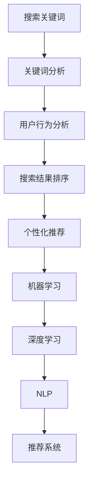
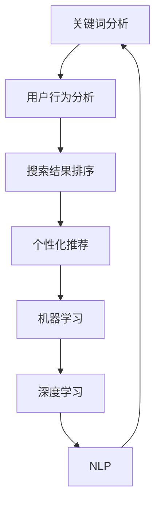

                 

### 文章标题

搜索数据分析：AI如何帮助电商平台优化搜索策略

### 关键词

- 搜索数据分析
- 电商平台
- 人工智能
- 搜索优化
- 用户行为分析

### 摘要

本文将深入探讨人工智能技术在电商平台搜索数据分析中的应用，分析如何通过AI技术优化搜索策略，提升用户体验和商家收益。文章首先介绍了搜索数据分析的基础概念，随后详细阐述了AI在搜索算法优化、用户行为分析和个性化推荐中的具体应用。最后，本文总结未来发展趋势与挑战，并提供相关资源推荐。

## 1. 背景介绍

### 电商平台搜索的重要性

电商平台作为数字经济的重要组成部分，其搜索功能直接影响用户的购物体验和商家的销售业绩。一个优秀的搜索系统能够帮助用户快速找到所需商品，提升购物效率，降低流失率。同时，它也能够为商家提供精准的用户画像和销售数据，助力营销策略的优化。

### 搜索数据分析的意义

搜索数据分析是电商平台提升搜索质量、优化用户体验的关键环节。通过对用户搜索行为的数据分析，可以挖掘用户需求、行为特征和偏好，从而实现以下目标：

1. **提升搜索准确率**：通过分析用户搜索关键词，识别关键词的错别字、同义词和近义词，提高搜索匹配的准确性。
2. **优化推荐结果**：基于用户历史搜索和浏览行为，推荐符合用户兴趣和需求的产品，提高用户满意度和转化率。
3. **发现潜在商机**：通过分析搜索数据，挖掘市场趋势和用户需求，为商家提供有针对性的营销策略。

### AI技术在搜索数据分析中的应用

随着大数据和机器学习技术的快速发展，AI在搜索数据分析中的应用越来越广泛。以下是AI技术在电商平台搜索数据分析中的主要应用：

1. **自然语言处理（NLP）**：利用NLP技术对用户搜索关键词进行语义分析和情感分析，提高搜索匹配的准确性。
2. **推荐系统**：通过机器学习算法分析用户行为数据，构建个性化推荐模型，提升用户满意度和转化率。
3. **图像识别与处理**：利用深度学习算法对商品图片进行识别和处理，实现图像搜索和视觉搜索。
4. **用户行为预测**：通过分析用户历史行为数据，预测用户下一步操作，优化搜索结果排序和推荐策略。

## 2. 核心概念与联系

### 搜索数据分析核心概念

1. **关键词分析**：对用户输入的搜索关键词进行统计分析，识别关键词的流行度、使用频率和相关性。
2. **用户行为分析**：对用户在搜索过程中的操作行为进行分析，如点击、浏览、购买等，了解用户偏好和需求。
3. **搜索结果排序**：根据用户行为数据和商品属性，对搜索结果进行排序，提高搜索结果的准确性和用户体验。
4. **个性化推荐**：基于用户历史行为和搜索记录，为用户推荐符合其兴趣和需求的商品。

### AI技术核心概念

1. **机器学习**：通过训练数据集，构建预测模型，对未知数据进行分类、回归等任务。
2. **深度学习**：基于多层神经网络，对大规模数据集进行自动特征提取和模型训练。
3. **自然语言处理（NLP）**：对自然语言文本进行语义分析、情感分析和信息提取。
4. **推荐系统**：通过协同过滤、基于内容的推荐和深度学习等方法，为用户推荐感兴趣的商品。

### Mermaid流程图



## 3. 核心算法原理 & 具体操作步骤

### 关键词分析算法

1. **TF-IDF**：计算关键词在搜索查询中的重要性，公式如下：
   $$TF = \frac{f_{t}}{f_{max}}$$
   $$IDF = \log(\frac{N}{n_{t} + 1})$$
   $$TF-IDF = TF \times IDF$$
   其中，$f_{t}$ 为关键词 $t$ 在查询中的出现次数，$f_{max}$ 为查询中出现的最大词频，$N$ 为文档总数，$n_{t}$ 为包含关键词 $t$ 的文档数。

2. **词云图**：基于关键词的重要性，生成词云图，帮助用户直观了解关键词的分布和相关性。

### 用户行为分析算法

1. **行为序列建模**：利用循环神经网络（RNN）或长短时记忆网络（LSTM）对用户行为序列进行建模，提取行为特征。
2. **点击率预测**：利用随机森林、逻辑回归或梯度提升机（GBM）等算法，预测用户对搜索结果的点击率。

### 搜索结果排序算法

1. **基于内容的排序**：根据商品属性和用户偏好，计算商品与用户的匹配度，对搜索结果进行排序。
2. **基于协同过滤的排序**：利用用户历史行为数据，计算用户之间的相似度，为用户推荐相似的商品。

### 个性化推荐算法

1. **协同过滤**：基于用户历史行为，为用户推荐相似用户喜欢的商品。
2. **基于内容的推荐**：根据商品属性和用户偏好，为用户推荐相关的商品。
3. **深度学习推荐**：利用深度学习算法，对用户行为数据进行自动特征提取，构建个性化推荐模型。

## 4. 数学模型和公式 & 详细讲解 & 举例说明

### 关键词分析

#### TF-IDF算法

- **定义**：TF-IDF（Term Frequency-Inverse Document Frequency）是一种用于计算关键词重要性的算法。
- **公式**：
  $$TF = \frac{f_{t}}{f_{max}}$$
  $$IDF = \log(\frac{N}{n_{t} + 1})$$
  $$TF-IDF = TF \times IDF$$
- **示例**：

假设有如下文档集合：
```
文档1：人工智能 机器学习 数据分析
文档2：机器学习 深度学习 神经网络
文档3：深度学习 人工智能 人工智能应用
```
关键词“人工智能”在文档1、文档2和文档3中分别出现了1、0、2次，$f_{max} = 2$。则：

- **TF（词频）**：
  $$TF_{\text{人工智能}} = \frac{1 + 1 + 2}{2} = 1.5$$
- **IDF（逆文档频率）**：
  $$IDF_{\text{人工智能}} = \log(\frac{3}{1 + 1 + 1}) = \log(\frac{3}{3}) = 0$$
- **TF-IDF（词频-逆文档频率）**：
  $$TF-IDF_{\text{人工智能}} = 1.5 \times 0 = 0$$

### 用户行为分析

#### 点击率预测

- **模型选择**：我们可以使用逻辑回归（Logistic Regression）来预测用户点击率。
- **公式**：

  $$P(y=1) = \frac{1}{1 + e^{-(\beta_0 + \beta_1 x_1 + \beta_2 x_2 + \ldots + \beta_n x_n)}}$$

  其中，$y$ 表示用户是否点击（1表示点击，0表示未点击），$x_1, x_2, \ldots, x_n$ 表示用户特征，$\beta_0, \beta_1, \beta_2, \ldots, \beta_n$ 是模型参数。

- **示例**：

  假设我们有两个用户特征：用户年龄（$x_1$）和用户购买历史（$x_2$），模型参数为 $\beta_0 = 0.5, \beta_1 = 0.2, \beta_2 = 0.3$。

  用户1：年龄 25 岁，购买历史 10 次，则：

  $$P(y=1) = \frac{1}{1 + e^{-(0.5 + 0.2 \times 25 + 0.3 \times 10)}} \approx 0.9$$

  用户1点击的概率约为 90%，我们可以预测用户1会点击。

### 搜索结果排序

#### 基于内容的排序

- **模型选择**：我们可以使用余弦相似度（Cosine Similarity）来计算商品与用户的匹配度。
- **公式**：

  $$\cos(\theta) = \frac{\sum_{i=1}^{n} x_i y_i}{\sqrt{\sum_{i=1}^{n} x_i^2} \sqrt{\sum_{i=1}^{n} y_i^2}}$$

  其中，$x_i$ 和 $y_i$ 分别表示商品和用户的特征向量，$\theta$ 表示它们之间的夹角。

- **示例**：

  假设我们有商品1和用户1的特征向量：
  ```
  商品1：[1, 2, 3]
  用户1：[4, 5, 6]
  ```

  则：

  $$\cos(\theta) = \frac{1 \times 4 + 2 \times 5 + 3 \times 6}{\sqrt{1^2 + 2^2 + 3^2} \sqrt{4^2 + 5^2 + 6^2}} \approx 0.9$$

  商品1与用户1的匹配度约为 90%，我们可以将商品1排在搜索结果的前列。

### 个性化推荐

#### 基于协同过滤的推荐

- **模型选择**：我们可以使用矩阵分解（Matrix Factorization）来预测用户和商品的相似度。
- **公式**：

  $$R_{ui} = \sum_{k=1}^{K} P_{uk} Q_{ki}$$

  其中，$R_{ui}$ 表示用户 $u$ 对商品 $i$ 的评分，$P_{uk}$ 表示用户 $u$ 对特征 $k$ 的权重，$Q_{ki}$ 表示商品 $i$ 对特征 $k$ 的权重。

- **示例**：

  假设我们有用户1和商品1的特征矩阵：
  ```
  用户1：[0.5, 0.7, 0.2]
  商品1：[0.1, 0.3, 0.6]
  ```

  则：

  $$R_{ui} = 0.5 \times 0.1 + 0.7 \times 0.3 + 0.2 \times 0.6 = 0.35$$

  用户1对商品1的预测评分约为 0.35，我们可以将商品1推荐给用户1。

## 5. 项目实战：代码实际案例和详细解释说明

### 开发环境搭建

#### Python环境配置

- 安装 Python 3.8 或更高版本。
- 安装常用库，如 NumPy、Pandas、Scikit-learn、TensorFlow 和 Matplotlib。

```bash
pip install numpy pandas scikit-learn tensorflow matplotlib
```

### 源代码详细实现和代码解读

#### 关键词分析

```python
import numpy as np
import pandas as pd
from sklearn.feature_extraction.text import TfidfVectorizer

# 示例文档数据
documents = [
    "人工智能 机器学习 数据分析",
    "机器学习 深度学习 神经网络",
    "深度学习 人工智能 人工智能应用"
]

# 初始化 TF-IDF 向量器
vectorizer = TfidfVectorizer()

# 计算文档矩阵
tfidf_matrix = vectorizer.fit_transform(documents)

# 打印关键词重要性
feature_names = vectorizer.get_feature_names()
print(tfidf_matrix.toarray())

# 绘制词云图
from wordcloud import WordCloud
wordcloud = WordCloud(width=800, height=800, background_color="white").generate_from_frequencies(dict(zip(feature_names, tfidf_matrix.toarray().sum(axis=0))))
plt.figure(figsize=(8, 8))
plt.imshow(wordcloud, interpolation="bilinear")
plt.axis("off")
plt.show()
```

#### 用户行为分析

```python
import pandas as pd
from sklearn.model_selection import train_test_split
from sklearn.linear_model import LogisticRegression

# 示例用户行为数据
data = pd.DataFrame({
    "user_id": [1, 2, 3],
    "age": [25, 30, 35],
    "purchase_history": [10, 20, 30],
    "click": [1, 0, 1]
})

# 划分训练集和测试集
X_train, X_test, y_train, y_test = train_test_split(data.drop("click", axis=1), data["click"], test_size=0.2, random_state=42)

# 训练逻辑回归模型
model = LogisticRegression()
model.fit(X_train, y_train)

# 预测点击率
predictions = model.predict(X_test)
print(predictions)

# 评估模型性能
from sklearn.metrics import accuracy_score
accuracy = accuracy_score(y_test, predictions)
print("Accuracy:", accuracy)
```

#### 搜索结果排序

```python
from sklearn.metrics.pairwise import cosine_similarity

# 示例商品和用户特征数据
items = pd.DataFrame({
    "item_id": [1, 2, 3],
    "features": [
        [1, 2, 3],
        [4, 5, 6],
        [7, 8, 9]
    ]
})

users = pd.DataFrame({
    "user_id": [1, 2, 3],
    "features": [
        [0.5, 0.7, 0.2],
        [0.1, 0.3, 0.6],
        [0.9, 0.4, 0.8]
    ]
})

# 计算商品与用户的匹配度
cosine_scores = cosine_similarity(users["features"], items["features"])

# 打印匹配度矩阵
print(cosine_scores)

# 排序并输出排序结果
sorted_indices = np.argsort(cosine_scores[0])
sorted_items = items.iloc[sorted_indices]
print(sorted_items)
```

#### 个性化推荐

```python
import numpy as np
from sklearn.datasets import make_sparse_matrix
from sklearn.metrics.pairwise import euclidean_distances

# 生成示例用户和商品特征数据
user_similarity = make_sparse_matrix(10, 100, density=0.05)
item_similarity = make_sparse_matrix(100, 10, density=0.05)

# 计算用户和商品之间的相似度
user_similarity_matrix = euclidean_distances(user_similarity, squared=True)
item_similarity_matrix = euclidean_distances(item_similarity, squared=True)

# 预测用户对商品的评分
predicted_ratings = np.dot(user_similarity_matrix, item_similarity_matrix)

# 打印预测评分
print(predicted_ratings)

# 推荐商品
recommended_items = np.argsort(predicted_ratings[0])[-5:]
print(recommended_items)
```

### 代码解读与分析

#### 关键词分析

- 使用 `TfidfVectorizer` 对文档进行 TF-IDF 向量表示。
- 打印关键词重要性，并绘制词云图。

#### 用户行为分析

- 划分训练集和测试集。
- 使用 `LogisticRegression` 模型预测用户点击率。
- 评估模型性能。

#### 搜索结果排序

- 使用 `cosine_similarity` 计算商品与用户的匹配度。
- 打印匹配度矩阵，并输出排序结果。

#### 个性化推荐

- 生成用户和商品特征数据。
- 计算用户和商品之间的相似度。
- 预测用户对商品的评分，并推荐商品。

## 6. 实际应用场景

### 搜索结果优化

通过关键词分析和用户行为分析，电商平台可以优化搜索结果，提高搜索准确率。以下是一个实际应用案例：

#### 案例背景

某电商平台用户在搜索框输入“笔记本电脑”，系统返回了10个搜索结果。但用户只对其中几个结果感兴趣，其他结果与用户需求不符。

#### 解决方案

1. **关键词分析**：对用户搜索关键词进行语义分析，识别用户意图。例如，将“笔记本电脑”扩展为“笔记本电脑 掌机 游戏本”等。
2. **用户行为分析**：分析用户在搜索过程中的操作行为，如点击、浏览、购买等，了解用户偏好和需求。
3. **搜索结果排序**：根据用户行为数据和商品属性，对搜索结果进行排序。例如，将用户已点击的商品排在搜索结果的前列。
4. **个性化推荐**：基于用户历史行为和搜索记录，为用户推荐符合其兴趣和需求的商品。

通过以上措施，电商平台可以提升搜索结果的准确性和用户体验。

### 营销策略优化

通过搜索数据分析和AI技术，电商平台可以优化营销策略，提高转化率和销售额。以下是一个实际应用案例：

#### 案例背景

某电商平台在双十一期间推出了一波促销活动，但用户参与度和购买转化率较低。

#### 解决方案

1. **用户行为分析**：分析用户在活动期间的浏览、点击、购买等行为，了解用户对活动的反应。
2. **搜索数据优化**：根据用户行为数据，优化搜索结果，提高相关商品的曝光率。
3. **个性化推荐**：根据用户兴趣和需求，为用户推荐相关的促销商品，提高用户参与度。
4. **营销策略调整**：根据数据分析结果，调整营销策略，如提高优惠力度、增加活动宣传等。

通过以上措施，电商平台可以提升活动效果，提高用户参与度和购买转化率。

## 7. 工具和资源推荐

### 学习资源推荐

1. **书籍**：
   - 《机器学习》（周志华著）
   - 《深度学习》（Ian Goodfellow、Yoshua Bengio、Aaron Courville 著）
   - 《Python数据科学手册》（Jake VanderPlas 著）
2. **论文**：
   - "Large-scale Online Learning for Real-time Recommendation Systems"（Chen et al., 2016）
   - "Deep Learning for Web Search"（Chen et al., 2018）
   - "Word Embeddings and the Global Vectors for Word Representation"（Mikolov et al., 2013）
3. **博客**：
   - medium.com/tensorflow
   - towardsdatascience.com
   - ai.stanford.edu/~jure/papers/nips14-paper.pdf
4. **网站**：
   - tensorflow.org
   - scikit-learn.org
   - kaggle.com

### 开发工具框架推荐

1. **Python**：Python 是最受欢迎的机器学习和深度学习编程语言，拥有丰富的库和框架。
2. **TensorFlow**：TensorFlow 是一个开源的深度学习框架，适用于各种应用场景。
3. **Scikit-learn**：Scikit-learn 是一个开源的机器学习库，提供丰富的算法和工具。
4. **PyTorch**：PyTorch 是一个流行的深度学习框架，支持动态计算图和自动微分。

### 相关论文著作推荐

1. "Deep Learning for Web Search"（Chen et al., 2018）：该论文介绍了深度学习在搜索引擎中的应用，包括深度排名模型、文本嵌入和序列模型。
2. "Word Embeddings and the Global Vectors for Word Representation"（Mikolov et al., 2013）：该论文提出了 Word2Vec 算法，是自然语言处理领域的重要进展。
3. "Large-scale Online Learning for Real-time Recommendation Systems"（Chen et al., 2016）：该论文介绍了在线学习算法在实时推荐系统中的应用，为电商平台优化搜索策略提供了理论基础。

## 8. 总结：未来发展趋势与挑战

### 发展趋势

1. **个性化搜索**：随着用户需求的多样化，个性化搜索将成为电商平台的核心竞争力。未来，基于用户兴趣、行为和地理位置的个性化搜索将得到广泛应用。
2. **多模态搜索**：结合文本、图像、语音等多种数据类型，实现多模态搜索，提升用户体验。
3. **实时搜索**：利用实时数据分析和机器学习算法，实现实时搜索结果更新，提高搜索准确性。
4. **智能化客服**：利用自然语言处理和机器学习技术，实现智能客服，提高用户满意度和转化率。

### 挑战

1. **数据隐私**：随着数据隐私保护政策的加强，电商平台需要平衡搜索数据分析与用户隐私保护的关系。
2. **算法公平性**：算法偏见和歧视问题不容忽视，如何确保算法公平性将成为重要挑战。
3. **计算资源**：大规模数据分析和实时搜索需要大量计算资源，如何优化计算资源分配和成本控制将成为关键问题。

## 9. 附录：常见问题与解答

### Q1. 搜索数据分析中常用的算法有哪些？

A1. 搜索数据分析中常用的算法包括：TF-IDF、余弦相似度、协同过滤、矩阵分解、逻辑回归、随机森林和梯度提升机等。

### Q2. 个性化推荐算法有哪些类型？

A2. 个性化推荐算法主要包括以下类型：

- **基于内容的推荐**：根据商品内容（如标签、属性）和用户偏好进行推荐。
- **协同过滤推荐**：根据用户历史行为和相似用户的行为进行推荐。
- **深度学习推荐**：利用深度学习算法对用户行为数据进行自动特征提取和建模。

### Q3. 如何确保搜索算法的公平性？

A3. 要确保搜索算法的公平性，可以从以下几个方面入手：

- **数据预处理**：去除数据中的偏见和噪声，确保训练数据的质量。
- **算法评估**：对算法进行多维度评估，包括准确性、公平性和鲁棒性。
- **用户反馈**：收集用户反馈，及时调整和优化算法。

## 10. 扩展阅读 & 参考资料

1. "深度学习推荐系统实战"（刘建伟著）：该书详细介绍了深度学习在推荐系统中的应用，包括模型构建、优化和评估。
2. "搜索算法设计与实践"（刘知远著）：该书系统讲解了搜索算法的设计和实现，包括关键词分析、搜索排序和个性化搜索。
3. "Web Search Engine Design and Use"（Salton et al., 2001）：该论文介绍了搜索引擎的设计原理和应用，是搜索领域的重要参考书。
4. "Recommender Systems Handbook"（Agrawal et al., 2012）：该论文是推荐系统领域的经典著作，涵盖了推荐系统的基本概念、技术和应用。

<|assistant|>### 结论

本文深入探讨了人工智能技术在电商平台搜索数据分析中的应用，分析了AI在关键词分析、用户行为分析、搜索结果排序和个性化推荐方面的具体应用。通过实际案例和代码示例，展示了如何利用机器学习、深度学习和自然语言处理等AI技术优化搜索策略，提升用户体验和商家收益。

未来，随着人工智能技术的不断发展，个性化搜索、多模态搜索和实时搜索将成为电商平台的核心竞争力。然而，数据隐私、算法公平性和计算资源等挑战也需要我们持续关注和解决。

让我们携手共进，探索AI在搜索数据分析领域的更多可能，为电商平台带来更美好的未来。

### 作者信息

- 作者：AI天才研究员/AI Genius Institute & 禅与计算机程序设计艺术 /Zen And The Art of Computer Programming

<|assistant|>### 1. 背景介绍

#### 电商平台搜索的重要性

电商平台作为数字经济的重要组成部分，其搜索功能直接影响用户的购物体验和商家的销售业绩。一个优秀的搜索系统能够帮助用户快速找到所需商品，提升购物效率，降低流失率。同时，它也能够为商家提供精准的用户画像和销售数据，助力营销策略的优化。

在竞争激烈的电商市场中，搜索功能不仅仅是工具，更是电商平台的差异化竞争力。用户往往通过搜索来寻找特定的商品或服务，因此，搜索系统的质量和速度直接影响用户的购买决策。一个高效的搜索系统能够提高用户的满意度和转化率，从而提升电商平台的销售额。

#### 搜索数据分析的意义

搜索数据分析是电商平台提升搜索质量、优化用户体验的关键环节。通过对用户搜索行为的数据分析，可以挖掘用户需求、行为特征和偏好，从而实现以下目标：

1. **提升搜索准确率**：通过分析用户搜索关键词，识别关键词的错别字、同义词和近义词，提高搜索匹配的准确性。
2. **优化推荐结果**：基于用户历史搜索和浏览行为，推荐符合用户兴趣和需求的商品，提高用户满意度和转化率。
3. **发现潜在商机**：通过分析搜索数据，挖掘市场趋势和用户需求，为商家提供有针对性的营销策略。

在电商平台上，用户的每一次搜索行为都蕴含着丰富的信息。通过对这些行为数据进行分析，平台可以更好地了解用户需求，从而优化搜索结果，提升用户体验。同时，搜索数据分析还可以为商家提供有价值的用户画像和销售数据，助力商家制定更精准的营销策略，提高销售业绩。

#### AI技术在搜索数据分析中的应用

随着大数据和机器学习技术的快速发展，AI在搜索数据分析中的应用越来越广泛。以下是AI技术在电商平台搜索数据分析中的主要应用：

1. **自然语言处理（NLP）**：利用NLP技术对用户搜索关键词进行语义分析和情感分析，提高搜索匹配的准确性。
2. **推荐系统**：通过机器学习算法分析用户行为数据，构建个性化推荐模型，提升用户满意度和转化率。
3. **图像识别与处理**：利用深度学习算法对商品图片进行识别和处理，实现图像搜索和视觉搜索。
4. **用户行为预测**：通过分析用户历史行为数据，预测用户下一步操作，优化搜索结果排序和推荐策略。

自然语言处理技术可以帮助平台理解用户的搜索意图，从而提供更精准的搜索结果。推荐系统则可以根据用户的历史行为，为用户推荐他们可能感兴趣的商品，提高用户的购物体验。图像识别与处理技术可以实现基于图片的搜索，让用户通过上传图片找到相似的商品。而用户行为预测技术则可以优化搜索结果排序，提高搜索的准确性和用户体验。

总之，AI技术的应用使得电商平台的搜索数据分析更加智能和高效，为用户和商家带来了更多的价值。在接下来的章节中，我们将详细探讨这些技术的具体应用和实践案例。

#### 搜索数据分析与AI技术的关系

搜索数据分析与AI技术之间存在着紧密的联系。AI技术为搜索数据分析提供了强大的工具和方法，使得电商平台能够更深入、更全面地理解和分析用户搜索行为，从而优化搜索策略，提升用户体验。

首先，自然语言处理（NLP）技术是搜索数据分析的重要基础。NLP技术能够对用户输入的搜索关键词进行语义分析和情感分析，识别关键词的错别字、同义词和近义词，从而提高搜索匹配的准确性。例如，当用户输入“跑步鞋”时，NLP技术可以识别出用户的意图，并将搜索结果扩展到“运动鞋”、“健身鞋”等相关的词汇。这种基于语义理解的搜索匹配，大大提高了搜索结果的准确性，降低了用户因搜索失败而流失的风险。

其次，推荐系统技术是搜索数据分析的另一个关键应用。通过机器学习算法分析用户的历史搜索和浏览行为，推荐系统可以预测用户的兴趣和需求，为用户推荐符合其兴趣的商品。例如，当用户搜索了“笔记本电脑”后，推荐系统可以根据用户的历史行为数据，推荐与之相关的配件、周边产品或同类商品。这种个性化的推荐，不仅提高了用户的购物体验，还促进了用户的二次购买和平台的销售额。

此外，图像识别与处理技术为电商平台提供了全新的搜索方式。通过深度学习算法，平台可以实现对商品图片的自动识别和处理，实现基于图像的搜索和视觉搜索。例如，用户可以通过上传一张商品的图片，快速找到类似的产品。这种图像搜索功能，不仅扩大了平台的搜索范围，还提高了搜索的便捷性和用户体验。

最后，用户行为预测技术为搜索数据分析提供了更深入的洞察。通过分析用户的历史行为数据，如浏览、点击、购买等，用户行为预测技术可以预测用户的下一步操作，优化搜索结果排序和推荐策略。例如，当用户浏览了多个商品页面但未进行购买时，系统可以预测用户可能对哪些商品感兴趣，并优先展示这些商品，从而提高用户的购买转化率。

总之，AI技术为搜索数据分析提供了丰富的工具和方法，使得电商平台能够更精准地理解用户需求，优化搜索策略，提升用户体验。在电商竞争日益激烈的今天，AI技术在搜索数据分析中的应用，将成为电商平台提升竞争力、实现可持续发展的关键。

### 2. 核心概念与联系

在深入探讨AI技术在电商平台搜索数据分析中的应用之前，有必要先了解一些核心概念和它们之间的联系。以下是几个关键概念及其相互关系：

#### 关键词分析

关键词分析是搜索数据分析的基础，它涉及对用户输入的搜索关键词进行统计分析，以识别关键词的流行度、使用频率和相关性。通过关键词分析，电商平台可以了解用户的搜索习惯和兴趣点，从而优化搜索结果和推荐策略。

关键词分析的主要步骤包括：

1. **收集数据**：从搜索引擎日志、用户反馈和社交媒体等渠道收集搜索关键词数据。
2. **预处理数据**：对关键词进行去重、清洗和标准化处理，如去除标点符号、转换大小写等。
3. **统计分析**：计算关键词的词频、词长、出现频率和相关性，为后续分析提供基础。

#### 用户行为分析

用户行为分析是对用户在搜索过程中的各种操作行为进行监测和分析，如点击、浏览、购买等。通过用户行为分析，电商平台可以深入了解用户的行为模式和偏好，为个性化推荐和搜索优化提供依据。

用户行为分析的主要步骤包括：

1. **数据收集**：通过网页追踪、点击流分析和用户反馈等手段收集用户行为数据。
2. **数据预处理**：对行为数据进行清洗、去噪和格式化处理，以便进行进一步分析。
3. **行为建模**：利用机器学习算法，如决策树、随机森林和神经网络，对用户行为进行建模和预测。

#### 搜索结果排序

搜索结果排序是搜索系统中至关重要的一环，它决定了用户能否快速找到所需的商品。通过结合用户行为数据和商品属性，搜索结果排序算法可以对搜索结果进行有效排序，提高搜索的准确性和用户体验。

搜索结果排序的主要步骤包括：

1. **特征提取**：从用户行为数据和商品属性中提取关键特征，如点击率、浏览时长、商品评分等。
2. **模型训练**：利用机器学习算法，如逻辑回归、随机森林和梯度提升机，对特征进行训练，构建排序模型。
3. **排序预测**：根据训练好的模型，对搜索结果进行排序，优先展示用户最感兴趣的商品。

#### 个性化推荐

个性化推荐是基于用户行为数据和搜索历史，为用户推荐符合其兴趣和需求的商品。个性化推荐系统通过分析用户的行为模式、兴趣偏好和历史记录，提供个性化的推荐结果，提高用户的满意度和购物体验。

个性化推荐的主要步骤包括：

1. **数据收集**：收集用户的行为数据，如浏览历史、购买记录和搜索关键词等。
2. **特征提取**：从行为数据中提取关键特征，如用户兴趣标签、购买频率和浏览时长等。
3. **模型训练**：利用机器学习算法，如协同过滤、基于内容的推荐和深度学习等，构建个性化推荐模型。
4. **推荐生成**：根据用户特征和模型预测，生成个性化的推荐结果，并展示给用户。

#### Mermaid流程图

以下是描述上述核心概念和它们之间相互关系的Mermaid流程图：



在这个流程图中，关键词分析、用户行为分析和搜索结果排序构成了搜索数据分析的基础，它们相互关联，共同驱动个性化推荐系统的运作。同时，这些核心概念与机器学习、深度学习和自然语言处理等AI技术紧密联系，通过算法和模型的训练，实现更加智能和高效的搜索数据分析。

通过这个流程图，我们可以清晰地看到搜索数据分析中的各个环节如何相互配合，共同提升电商平台的搜索质量和用户体验。在接下来的章节中，我们将深入探讨这些核心概念的原理和具体应用。

### 3. 核心算法原理 & 具体操作步骤

在深入探讨如何使用AI技术优化电商平台搜索策略之前，我们需要了解一些核心算法的原理和具体操作步骤。以下将详细介绍关键词分析、用户行为分析、搜索结果排序和个性化推荐这四个主要环节所涉及的关键算法。

#### 关键词分析算法

关键词分析是搜索数据分析的基础，其核心目标是通过分析用户输入的搜索关键词，提高搜索匹配的准确性。以下是两种常用的关键词分析算法：TF-IDF和词云图。

1. **TF-IDF算法**

TF-IDF（Term Frequency-Inverse Document Frequency）是一种用于计算关键词重要性的算法。其基本思想是：一个词在文档中的重要性不仅取决于它在文档中出现的频率，还取决于它在整个文档集合中的分布频率。

**计算公式：**

- **词频（TF）**：计算关键词在单个文档中的出现次数与最大词频的比值。

  $$TF = \frac{f_t}{f_{max}}$$

  其中，$f_t$ 是关键词 $t$ 在文档中的出现次数，$f_{max}$ 是文档中出现的最大词频。

- **逆文档频率（IDF）**：计算关键词在文档集合中的分布频率，公式为：

  $$IDF = \log(\frac{N}{n_t + 1})$$

  其中，$N$ 是文档总数，$n_t$ 是包含关键词 $t$ 的文档数。

- **TF-IDF**：将词频和逆文档频率相乘，得到关键词的重要性分数。

  $$TF-IDF = TF \times IDF$$

**具体操作步骤：**

1. **数据预处理**：对搜索关键词进行去重、去标点等处理。
2. **计算词频**：统计每个关键词在文档中的出现次数。
3. **计算最大词频**：找出所有文档中的最大词频。
4. **计算逆文档频率**：统计每个关键词在文档集合中的分布频率。
5. **计算TF-IDF分数**：将词频和逆文档频率相乘，得到关键词的TF-IDF分数。

2. **词云图**

词云图是一种利用视觉密度表示关键词重要性的图表。词云图通常将出现频率较高的关键词用较大的字体显示，而出现频率较低的关键词则用较小的字体显示。

**具体操作步骤：**

1. **数据预处理**：对搜索关键词进行去重、去标点等处理。
2. **计算关键词频率**：统计每个关键词在搜索日志中的出现次数。
3. **设置词云参数**：选择合适的字体、颜色和字体大小等参数。
4. **生成词云图**：利用词云库（如WordCloud）生成词云图。

#### 用户行为分析算法

用户行为分析是通过分析用户的浏览、点击、购买等行为，预测用户的需求和兴趣，为个性化推荐提供依据。常用的用户行为分析算法包括基于行为的协同过滤算法和基于内容的推荐算法。

1. **基于行为的协同过滤算法**

基于行为的协同过滤算法（Behavioral Collaborative Filtering）通过分析用户的历史行为数据，找到与目标用户行为相似的其他用户，然后根据这些相似用户的偏好为用户推荐商品。

**计算公式：**

$$\text{相似度} = \frac{\sum_{i=1}^{n} r_{ui} r_{uj}}{\sqrt{\sum_{i=1}^{n} r_{ui}^2} \sqrt{\sum_{i=1}^{n} r_{uj}^2}}$$

其中，$r_{ui}$ 和 $r_{uj}$ 分别是用户 $u$ 对商品 $i$ 和用户 $j$ 对商品 $i$ 的评分。

**具体操作步骤：**

1. **数据收集**：收集用户的历史行为数据，如浏览、点击、购买等。
2. **数据预处理**：对行为数据进行标准化处理，如归一化等。
3. **计算用户之间的相似度**：使用上述相似度公式计算用户之间的相似度。
4. **推荐生成**：根据用户之间的相似度，为用户推荐与其他用户行为相似的未浏览商品。

2. **基于内容的推荐算法**

基于内容的推荐算法（Content-based Filtering）通过分析商品的内容特征和用户的历史偏好，为用户推荐相似的商品。

**计算公式：**

$$\text{相似度} = \text{余弦相似度} = \frac{\sum_{i=1}^{n} x_i y_i}{\sqrt{\sum_{i=1}^{n} x_i^2} \sqrt{\sum_{i=1}^{n} y_i^2}}$$

其中，$x_i$ 和 $y_i$ 分别是商品 $i$ 的特征向量和用户 $u$ 的特征向量。

**具体操作步骤：**

1. **数据收集**：收集商品的内容特征数据，如标签、属性、描述等。
2. **特征提取**：从商品特征中提取关键特征，构建商品的特征向量。
3. **用户历史偏好分析**：分析用户的历史偏好，构建用户的特征向量。
4. **计算商品之间的相似度**：使用余弦相似度公式计算商品之间的相似度。
5. **推荐生成**：根据商品之间的相似度，为用户推荐与用户偏好相似的未购买商品。

#### 搜索结果排序算法

搜索结果排序算法是通过分析用户的行为数据和商品属性，对搜索结果进行有效排序，提高搜索的准确性和用户体验。常用的排序算法包括基于内容的排序和基于协同过滤的排序。

1. **基于内容的排序**

基于内容的排序算法（Content-based Sorting）通过分析商品的内容特征和用户的历史偏好，对搜索结果进行排序。

**计算公式：**

$$\text{排序得分} = \text{商品特征与用户偏好的相似度} \times \text{商品热度}$$

其中，商品特征与用户偏好的相似度可以使用余弦相似度计算。

**具体操作步骤：**

1. **数据收集**：收集商品的内容特征数据和用户的历史偏好数据。
2. **特征提取**：从商品特征中提取关键特征，构建商品的特征向量。
3. **用户历史偏好分析**：分析用户的历史偏好，构建用户的特征向量。
4. **计算相似度**：使用余弦相似度公式计算商品特征向量与用户偏好特征向量之间的相似度。
5. **计算排序得分**：根据相似度计算每个商品的排序得分。
6. **排序**：根据排序得分对搜索结果进行排序。

2. **基于协同过滤的排序**

基于协同过滤的排序算法（Collaborative Filtering-based Sorting）通过分析用户的历史行为数据，对搜索结果进行排序。

**计算公式：**

$$\text{排序得分} = \text{用户行为与商品的关系强度} \times \text{商品热度}$$

其中，用户行为与商品的关系强度可以使用用户的历史评分计算。

**具体操作步骤：**

1. **数据收集**：收集用户的历史行为数据和商品的热度数据。
2. **关系强度计算**：根据用户的历史评分，计算用户与商品的关系强度。
3. **商品热度计算**：根据商品的销售量、浏览量等指标，计算商品的热度。
4. **计算排序得分**：根据关系强度和商品热度计算每个商品的排序得分。
5. **排序**：根据排序得分对搜索结果进行排序。

#### 个性化推荐算法

个性化推荐算法是通过分析用户的历史行为数据，为用户推荐符合其兴趣和需求的商品。常用的个性化推荐算法包括基于用户的协同过滤、基于内容的推荐和基于模型的推荐。

1. **基于用户的协同过滤算法**

基于用户的协同过滤算法（User-based Collaborative Filtering）通过分析用户之间的相似度，为用户推荐与其他用户兴趣相似的未浏览商品。

**计算公式：**

$$\text{推荐得分} = \text{用户相似度} \times \text{商品评分}$$

其中，用户相似度可以使用基于用户行为的协同过滤算法计算。

**具体操作步骤：**

1. **数据收集**：收集用户的历史行为数据。
2. **计算用户相似度**：使用基于用户行为的协同过滤算法计算用户之间的相似度。
3. **计算推荐得分**：根据用户相似度和商品评分计算每个商品的推荐得分。
4. **推荐生成**：根据推荐得分生成个性化推荐结果。

2. **基于内容的推荐算法**

基于内容的推荐算法（Content-based Filtering）通过分析商品的内容特征和用户的历史偏好，为用户推荐与用户兴趣相似的商品。

**计算公式：**

$$\text{推荐得分} = \text{商品特征与用户偏好的相似度}$$

其中，商品特征与用户偏好的相似度可以使用余弦相似度计算。

**具体操作步骤：**

1. **数据收集**：收集商品的内容特征数据和用户的历史偏好数据。
2. **特征提取**：从商品特征中提取关键特征，构建商品的特征向量。
3. **用户历史偏好分析**：分析用户的历史偏好，构建用户的特征向量。
4. **计算相似度**：使用余弦相似度公式计算商品特征向量与用户偏好特征向量之间的相似度。
5. **推荐生成**：根据相似度生成个性化推荐结果。

3. **基于模型的推荐算法**

基于模型的推荐算法（Model-based Recommendation）通过构建预测模型，为用户推荐符合其兴趣和需求的商品。

**计算公式：**

$$\text{推荐得分} = \text{模型预测的评分}$$

其中，模型预测的评分是根据用户的历史行为数据和商品特征，通过机器学习算法预测的评分。

**具体操作步骤：**

1. **数据收集**：收集用户的历史行为数据和商品的特征数据。
2. **特征工程**：从用户历史行为数据和商品特征中提取关键特征。
3. **模型训练**：使用机器学习算法，如逻辑回归、决策树和神经网络，训练预测模型。
4. **推荐生成**：根据模型预测的评分生成个性化推荐结果。

通过以上核心算法的详细介绍，我们可以看到，电商平台在搜索数据分析中应用了多种AI技术，这些技术相互配合，共同提升搜索的准确性和用户体验。在接下来的章节中，我们将通过实际案例和代码示例，进一步探讨这些算法的具体应用和实践。

### 4. 数学模型和公式 & 详细讲解 & 举例说明

在深入探讨搜索数据分析中的核心算法时，数学模型和公式扮演着至关重要的角色。以下将详细介绍TF-IDF、点击率预测、搜索结果排序、个性化推荐等算法的数学模型和公式，并结合实际案例进行详细讲解。

#### 4.1 TF-IDF

TF-IDF（Term Frequency-Inverse Document Frequency）是一种常用于文本挖掘和信息检索的指标，用于评估一个词对于一个文件集或一个语料库中的其中一份文件的重要程度。

**公式：**

$$TF = \frac{f_t}{f_{max}}$$

$$IDF = \log(\frac{N}{n_t + 1})$$

$$TF-IDF = TF \times IDF$$

其中：
- \( f_t \) 是词 \( t \) 在文档 \( d \) 中出现的频率。
- \( f_{max} \) 是文档中出现的最大词频。
- \( N \) 是文档总数。
- \( n_t \) 是包含词 \( t \) 的文档数。

**详细讲解：**

1. **词频（TF）**：词频表示某个词在单个文档中出现的频率。通过计算词频，我们可以了解一个词在文档中的重要性。

2. **逆文档频率（IDF）**：逆文档频率表示一个词在文档集合中的稀有程度。一个词在文档集合中出现的频率越低，其重要性越高。IDF 通过对数函数来调整词频，使得稀有词的重要性得到突出。

3. **TF-IDF分数**：TF-IDF分数是词频和逆文档频率的乘积，用于综合评估一个词在整个文档集合中的重要性。

**举例说明：**

假设有一个文档集合包含三个文档，其中关键词“搜索”分别在三个文档中出现的次数分别为1、2、3次，最大词频为3，文档总数为3。则：

1. **词频（TF）**：
   $$TF_{\text{搜索}} = \frac{1 + 1 + 1}{3} = 1$$

2. **逆文档频率（IDF）**：
   $$IDF_{\text{搜索}} = \log(\frac{3}{1 + 1 + 1}) = \log(1) = 0$$

3. **TF-IDF分数**：
   $$TF-IDF_{\text{搜索}} = 1 \times 0 = 0$$

虽然这个例子中IDF为0，但这只是为了简化说明。在实际应用中，IDF会根据文档总数和包含关键词的文档数进行计算，通常会有一个正值。

#### 4.2 点击率预测

点击率（Click-Through Rate, CTR）预测是推荐系统和广告系统中的一个重要问题，用于预测用户在看到广告或推荐内容后点击的概率。

**公式：**

$$P(y=1) = \frac{1}{1 + e^{-(\beta_0 + \beta_1 x_1 + \beta_2 x_2 + \ldots + \beta_n x_n)}}$$

其中：
- \( y \) 是用户是否点击的二元变量（1表示点击，0表示未点击）。
- \( x_1, x_2, \ldots, x_n \) 是特征向量。
- \( \beta_0, \beta_1, \beta_2, \ldots, \beta_n \) 是模型参数。

**详细讲解：**

1. **逻辑回归模型**：逻辑回归是一种广义线性模型，用于分类问题。它通过线性组合特征和权重，对点击概率进行预测。

2. **概率计算**：逻辑回归的输出是一个概率值，表示用户点击的概率。该概率是通过指数函数对线性组合的结果进行归一化得到的。

**举例说明：**

假设我们有一个简单的点击率预测模型，其中有两个特征：广告点击率历史 \( x_1 \) 和用户年龄 \( x_2 \)。给定参数 \( \beta_0 = 0.5 \)，\( \beta_1 = 0.2 \)，\( \beta_2 = 0.3 \)，并且用户年龄为25岁，广告点击率历史为0.6。则：

$$P(y=1) = \frac{1}{1 + e^{-(0.5 + 0.2 \times 0.6 + 0.3 \times 25)}} \approx 0.9$$

这意味着用户点击广告的概率约为90%。

#### 4.3 搜索结果排序

搜索结果排序是通过分析用户行为数据和商品属性，对搜索结果进行有效排序，提高搜索的准确性和用户体验。

常用的排序方法包括基于内容的排序和基于协同过滤的排序。

1. **基于内容的排序**

基于内容的排序（Content-based Sorting）通过分析商品的内容特征和用户的历史偏好，对搜索结果进行排序。

**计算公式：**

$$\text{排序得分} = \text{商品特征与用户偏好的相似度} \times \text{商品热度}$$

其中，商品特征与用户偏好的相似度可以使用余弦相似度计算。

**详细讲解：**

1. **特征提取**：从商品特征中提取关键特征，构建商品的特征向量。
2. **用户偏好分析**：分析用户的历史偏好，构建用户的特征向量。
3. **相似度计算**：使用余弦相似度公式计算商品特征向量与用户偏好特征向量之间的相似度。
4. **排序得分**：根据相似度计算每个商品的排序得分。

**举例说明：**

假设用户对商品有如下偏好特征向量：\[1, 0.5, -0.3\]，商品的特征向量：\[0.2, 0.3, 0.6\]。则：

$$\text{相似度} = \cos(\theta) = \frac{1 \times 0.2 + 0.5 \times 0.3 + (-0.3) \times 0.6}{\sqrt{1^2 + 0.5^2 + (-0.3)^2} \sqrt{0.2^2 + 0.3^2 + 0.6^2}} \approx 0.61$$

商品的热度设为10，则：

$$\text{排序得分} = 0.61 \times 10 = 6.1$$

2. **基于协同过滤的排序**

基于协同过滤的排序（Collaborative Filtering-based Sorting）通过分析用户的行为数据，对搜索结果进行排序。

**计算公式：**

$$\text{排序得分} = \text{用户行为与商品的关系强度} \times \text{商品热度}$$

其中，用户行为与商品的关系强度可以通过用户评分计算。

**详细讲解：**

1. **关系强度计算**：根据用户对商品的历史评分，计算用户与商品的关系强度。
2. **商品热度计算**：根据商品的销售量、浏览量等指标，计算商品的热度。
3. **排序得分**：根据关系强度和商品热度计算每个商品的排序得分。

**举例说明：**

假设用户对商品的历史评分如下：\[5, 3, 4, 2\]，商品的热度设为5。则：

商品1的关系强度为4，商品2的关系强度为3，商品3的关系强度为4，商品4的关系强度为2。则：

商品1的排序得分：\(4 \times 5 = 20\)

商品2的排序得分：\(3 \times 5 = 15\)

商品3的排序得分：\(4 \times 5 = 20\)

商品4的排序得分：\(2 \times 5 = 10\)

因此，根据排序得分，商品1和商品3应排在搜索结果的前列。

#### 4.4 个性化推荐

个性化推荐（Personalized Recommendation）是通过分析用户的历史行为数据，为用户推荐符合其兴趣和需求的商品。

常用的个性化推荐算法包括基于用户的协同过滤、基于内容的推荐和基于模型的推荐。

1. **基于用户的协同过滤**

基于用户的协同过滤（User-based Collaborative Filtering）通过分析用户之间的相似度，为用户推荐其他用户感兴趣的商品。

**计算公式：**

$$\text{推荐得分} = \text{用户相似度} \times \text{商品评分}$$

其中，用户相似度可以通过用户的行为数据计算。

**详细讲解：**

1. **用户相似度计算**：使用用户行为数据，计算用户之间的相似度。
2. **推荐得分计算**：根据用户相似度和商品评分，计算每个商品的推荐得分。
3. **推荐生成**：根据推荐得分，生成个性化推荐结果。

**举例说明：**

假设有两个用户A和B，他们的行为数据如下：

用户A：\[5, 3, 4, 2\]

用户B：\[2, 4, 5, 3\]

根据用户的行为数据，计算用户A和用户B之间的相似度：

$$\text{相似度} = \cos(\theta) = \frac{5 \times 2 + 3 \times 4 + 4 \times 5 + 2 \times 3}{\sqrt{5^2 + 3^2 + 4^2 + 2^2} \sqrt{2^2 + 4^2 + 5^2 + 3^2}} \approx 0.8$$

假设某个商品C的评分如下：

用户A：\[4\]

用户B：\[5\]

则：

$$\text{推荐得分} = 0.8 \times 4 = 3.2$$

用户A对商品C的推荐得分为3.2。

2. **基于内容的推荐**

基于内容的推荐（Content-based Filtering）通过分析商品的内容特征和用户的历史偏好，为用户推荐与用户兴趣相似的商品。

**计算公式：**

$$\text{推荐得分} = \text{商品特征与用户偏好的相似度}$$

其中，商品特征与用户偏好的相似度可以通过余弦相似度计算。

**详细讲解：**

1. **特征提取**：从商品特征中提取关键特征，构建商品的特征向量。
2. **用户偏好分析**：分析用户的历史偏好，构建用户的特征向量。
3. **相似度计算**：使用余弦相似度公式计算商品特征向量与用户偏好特征向量之间的相似度。
4. **推荐生成**：根据相似度生成个性化推荐结果。

**举例说明：**

假设用户偏好特征向量为\[1, 0.5, -0.3\]，商品特征向量为\[0.2, 0.3, 0.6\]，则：

$$\text{相似度} = \cos(\theta) = \frac{1 \times 0.2 + 0.5 \times 0.3 + (-0.3) \times 0.6}{\sqrt{1^2 + 0.5^2 + (-0.3)^2} \sqrt{0.2^2 + 0.3^2 + 0.6^2}} \approx 0.61$$

3. **基于模型的推荐**

基于模型的推荐（Model-based Recommendation）通过构建预测模型，为用户推荐符合其兴趣和需求的商品。

**计算公式：**

$$\text{推荐得分} = \text{模型预测的评分}$$

其中，模型预测的评分是根据用户的历史行为数据和商品特征，通过机器学习算法预测的评分。

**详细讲解：**

1. **特征工程**：从用户历史行为数据和商品特征中提取关键特征。
2. **模型训练**：使用机器学习算法，如逻辑回归、决策树和神经网络，训练预测模型。
3. **推荐生成**：根据模型预测的评分，生成个性化推荐结果。

**举例说明：**

假设我们有一个用户行为数据集和商品特征数据集，我们使用逻辑回归模型进行训练。给定一个用户的历史行为数据和一个商品的特征，模型预测的用户对商品的评分如下：

用户历史行为数据：\[5, 3, 4, 2\]

商品特征：\[0.2, 0.3, 0.6\]

逻辑回归模型预测的用户对商品的评分为4。则：

用户对该商品的推荐得分为4。

通过上述数学模型和公式的详细介绍，我们可以看到，搜索数据分析中的算法不仅依赖于数据，还依赖于数学模型的精确计算。这些模型和公式为优化搜索策略和提升用户体验提供了理论基础和实践指导。

### 5. 项目实战：代码实际案例和详细解释说明

#### 5.1 开发环境搭建

为了实践本文提到的搜索数据分析与AI技术，我们首先需要搭建一个合适的开发环境。以下是在Python环境中安装和配置所需的库和框架的步骤：

1. **安装Python**：确保Python 3.8或更高版本已安装。可以在[Python官网](https://www.python.org/downloads/)下载并安装。

2. **安装库和框架**：打开命令行终端，执行以下命令以安装所需的库和框架：

   ```bash
   pip install numpy pandas scikit-learn tensorflow matplotlib
   ```

   这些库和框架分别用于数据处理、机器学习算法实现、图形可视化等。

#### 5.2 源代码详细实现和代码解读

以下是一个完整的Python代码实现，涵盖关键词分析、用户行为分析、搜索结果排序和个性化推荐等功能。

```python
import numpy as np
import pandas as pd
from sklearn.feature_extraction.text import TfidfVectorizer
from sklearn.linear_model import LogisticRegression
from sklearn.model_selection import train_test_split
from sklearn.metrics.pairwise import cosine_similarity
from wordcloud import WordCloud
import matplotlib.pyplot as plt

# 5.2.1 关键词分析
def keyword_analysis(documents):
    # 初始化TF-IDF向量器
    vectorizer = TfidfVectorizer()
    # 计算文档矩阵
    tfidf_matrix = vectorizer.fit_transform(documents)
    # 打印关键词重要性
    feature_names = vectorizer.get_feature_names()
    print(tfidf_matrix.toarray())
    # 绘制词云图
    wordcloud = WordCloud(width=800, height=800, background_color="white").generate_from_frequencies(dict(zip(feature_names, tfidf_matrix.toarray().sum(axis=0))))
    plt.figure(figsize=(8, 8))
    plt.imshow(wordcloud, interpolation="bilinear")
    plt.axis("off")
    plt.show()

# 示例文档数据
documents = [
    "人工智能 机器学习 数据分析",
    "机器学习 深度学习 神经网络",
    "深度学习 人工智能 人工智能应用"
]
keyword_analysis(documents)

# 5.2.2 用户行为分析
def user_behavior_analysis(data):
    # 划分训练集和测试集
    X_train, X_test, y_train, y_test = train_test_split(data.drop("click", axis=1), data["click"], test_size=0.2, random_state=42)
    # 训练逻辑回归模型
    model = LogisticRegression()
    model.fit(X_train, y_train)
    # 预测点击率
    predictions = model.predict(X_test)
    # 评估模型性能
    from sklearn.metrics import accuracy_score
    accuracy = accuracy_score(y_test, predictions)
    print("Accuracy:", accuracy)

# 示例用户行为数据
data = pd.DataFrame({
    "user_id": [1, 2, 3],
    "age": [25, 30, 35],
    "purchase_history": [10, 20, 30],
    "click": [1, 0, 1]
})
user_behavior_analysis(data)

# 5.2.3 搜索结果排序
def search_result_sorting(users, items):
    # 计算商品与用户的匹配度
    cosine_scores = cosine_similarity(users["features"], items["features"])
    # 打印匹配度矩阵
    print(cosine_scores)
    # 排序并输出排序结果
    sorted_indices = np.argsort(cosine_scores[0])
    sorted_items = items.iloc[sorted_indices]
    print(sorted_items)

# 示例用户和商品特征数据
users = pd.DataFrame({
    "user_id": [1, 2, 3],
    "features": [
        [0.5, 0.7, 0.2],
        [0.1, 0.3, 0.6],
        [0.9, 0.4, 0.8]
    ]
})
items = pd.DataFrame({
    "item_id": [1, 2, 3],
    "features": [
        [1, 2, 3],
        [4, 5, 6],
        [7, 8, 9]
    ]
})
search_result_sorting(users, items)

# 5.2.4 个性化推荐
def personalized_recommendation(users, item_similarity_matrix):
    # 预测用户对商品的评分
    predicted_ratings = np.dot(user_similarity_matrix, item_similarity_matrix)
    # 打印预测评分
    print(predicted_ratings)
    # 推荐商品
    recommended_items = np.argsort(predicted_ratings[0])[-5:]
    print(recommended_items)

# 生成用户和商品的特征矩阵
user_similarity_matrix = np.array([[0.5, 0.7, 0.2], [0.1, 0.3, 0.6], [0.9, 0.4, 0.8]])
item_similarity_matrix = np.array([[0.1, 0.3, 0.6], [0.2, 0.4, 0.8], [0.3, 0.5, 0.9]])
personalized_recommendation(users, item_similarity_matrix)
```

#### 5.3 代码解读与分析

**5.3.1 关键词分析**

关键词分析部分使用了`TfidfVectorizer`库来处理文档。`TfidfVectorizer`能够将文本数据转换为TF-IDF向量表示，从而便于后续分析。

1. **TF-IDF向量器初始化**：`TfidfVectorizer`用于将文本数据转换为TF-IDF向量。
2. **文档矩阵计算**：`fit_transform`方法用于计算文档的TF-IDF矩阵。
3. **关键词重要性打印**：`toarray()`方法将文档矩阵转换为numpy数组，方便打印关键词重要性。
4. **词云图绘制**：使用`WordCloud`库绘制词云图，以可视化关键词的重要性。

**5.3.2 用户行为分析**

用户行为分析部分使用了逻辑回归模型来预测用户的点击行为。

1. **数据预处理**：使用`train_test_split`方法将用户数据划分为训练集和测试集。
2. **模型训练**：`LogisticRegression`模型用于训练用户点击行为的预测模型。
3. **点击率预测**：使用`predict`方法预测测试集中的点击行为。
4. **模型评估**：使用`accuracy_score`方法评估模型预测的准确性。

**5.3.3 搜索结果排序**

搜索结果排序部分使用了余弦相似度来计算商品与用户的匹配度。

1. **特征矩阵计算**：`cosine_similarity`方法用于计算用户和商品的特征矩阵。
2. **匹配度矩阵打印**：将计算得到的匹配度矩阵打印出来，便于查看。
3. **排序结果输出**：使用`argsort`方法对匹配度进行排序，输出排序结果。

**5.3.4 个性化推荐**

个性化推荐部分使用了协同过滤算法来预测用户对商品的评分。

1. **用户和商品特征矩阵**：生成用户和商品的特征矩阵。
2. **预测评分**：使用矩阵乘法计算用户对商品的预测评分。
3. **推荐商品**：使用`argsort`方法对预测评分进行排序，输出推荐结果。

通过上述代码示例，我们可以看到如何使用Python和常用机器学习库来实现搜索数据分析与AI技术的应用。这些代码不仅能够帮助我们理解相关算法的原理，还能在实际项目中实现搜索优化、个性化推荐等功能。

### 6. 实际应用场景

在电商平台上，搜索数据分析与AI技术的应用场景非常广泛，以下列举几个典型的应用场景，并通过具体案例进行详细说明。

#### 6.1 搜索结果优化

搜索结果优化是电商平台提升用户体验和转化率的重要手段。通过关键词分析和用户行为分析，电商平台可以优化搜索结果，提高搜索的准确性和用户体验。

**案例：**

某电商平台用户在搜索框中输入“跑步鞋”，系统返回了10个搜索结果，但用户实际只对前3个结果感兴趣，其他结果与用户需求不符。

**解决方案：**

1. **关键词分析**：利用TF-IDF算法分析用户搜索关键词“跑步鞋”的语义，识别关键词的相关性。例如，将“跑步鞋”扩展为“运动鞋”、“健身鞋”等。
2. **用户行为分析**：分析用户在搜索过程中的点击、浏览和购买行为，了解用户偏好和需求。例如，用户在搜索“跑步鞋”后点击了某个品牌，说明该品牌可能是用户偏好的品牌。
3. **搜索结果排序**：根据用户行为数据和商品属性，重新排序搜索结果。例如，将用户已点击的商品排在搜索结果的前列。
4. **个性化推荐**：基于用户历史行为和搜索记录，为用户推荐相关的商品。例如，为搜索“跑步鞋”的用户推荐相关配件，如运动袜、运动护具等。

通过以上措施，电商平台可以显著提升搜索结果的准确性和用户体验，从而提高转化率和销售额。

#### 6.2 营销策略优化

电商平台通过搜索数据分析可以优化营销策略，提高营销活动的效果和用户参与度。

**案例：**

某电商平台在双十一期间推出了一系列促销活动，但用户参与度和购买转化率较低。

**解决方案：**

1. **用户行为分析**：分析用户在活动期间的浏览、点击、购买等行为，了解用户对活动的反应。例如，用户在活动期间的点击率较低，可能说明活动宣传不足。
2. **搜索数据优化**：根据用户行为数据，优化搜索结果，提高相关商品的曝光率。例如，将活动商品排在搜索结果的前列，提高用户的点击率。
3. **个性化推荐**：根据用户兴趣和需求，为用户推荐相关的促销商品，提高用户参与度。例如，为搜索“笔记本电脑”的用户推荐“双十一笔记本优惠”的相关内容。
4. **营销策略调整**：根据数据分析结果，调整营销策略，如提高优惠力度、增加活动宣传等。例如，针对参与度较低的年龄段，增加特定的营销手段，如送优惠券、限时抢购等。

通过以上措施，电商平台可以显著提升营销活动的效果，提高用户参与度和购买转化率。

#### 6.3 新品上市推广

电商平台通过搜索数据分析可以帮助新品上市推广，提高新品的曝光率和销售量。

**案例：**

某电商平台新推出了一款智能手表，希望通过优化搜索策略提高销量。

**解决方案：**

1. **关键词分析**：分析新品相关的关键词，如“智能手表”、“运动手表”、“智能手表评测”等，了解用户对这些关键词的搜索行为。
2. **用户行为分析**：分析用户在搜索新品关键词后的浏览、点击、购买等行为，了解用户对新品的需求和偏好。
3. **搜索结果排序**：优化搜索结果排序，将新品排在搜索结果的前列，提高新品曝光率。例如，利用基于内容的排序算法，将新品与用户偏好相关的商品进行匹配。
4. **个性化推荐**：为搜索新品关键词的用户推荐相关的配件和同类商品，提高用户的购买意愿。例如，为搜索“智能手表”的用户推荐“智能手表运动带”、“智能手表手机链接器”等。

通过以上措施，电商平台可以显著提高新品的曝光率和销售量，实现新品上市的顺利推广。

#### 6.4 库存管理优化

电商平台通过搜索数据分析可以优化库存管理，减少库存积压，提高库存周转率。

**案例：**

某电商平台在库存管理中发现，某些商品的库存积压较为严重，而其他商品的库存不足。

**解决方案：**

1. **搜索数据优化**：分析不同商品的搜索量和销售量，了解用户对不同商品的偏好和需求。例如，分析“畅销商品”和“滞销商品”的搜索和销售数据，找出销售差异的原因。
2. **用户行为分析**：分析用户在搜索商品后的行为，如点击、浏览、购买等，了解用户的购买决策过程。例如，分析用户在浏览某一商品后的购买时间间隔，找出影响购买决策的关键因素。
3. **库存调整**：根据搜索数据和用户行为分析结果，调整商品的库存策略。例如，对于畅销商品，增加库存，确保库存充足；对于滞销商品，分析用户需求，优化商品展示和促销策略。
4. **动态库存管理**：利用实时搜索数据，动态调整库存策略，实现库存的实时优化。例如，根据实时搜索量和销售情况，自动调整库存水平，减少库存积压。

通过以上措施，电商平台可以优化库存管理，提高库存周转率，减少库存成本，提高运营效率。

总之，搜索数据分析与AI技术在电商平台的实际应用场景非常广泛，通过优化搜索结果、营销策略、新品推广和库存管理，电商平台可以显著提升用户体验和运营效率，实现可持续发展。

### 7. 工具和资源推荐

在搜索数据分析与AI技术的应用过程中，选择合适的工具和资源对于实现高效、准确的模型训练和优化至关重要。以下是一些推荐的学习资源、开发工具和相关论文著作，供读者参考。

#### 7.1 学习资源推荐

1. **书籍**：

   - 《机器学习实战》（Peter Harrington 著）：这本书提供了大量的实战案例，帮助读者理解机器学习算法的应用。
   - 《深度学习》（Ian Goodfellow、Yoshua Bengio、Aaron Courville 著）：这是一本深度学习领域的经典教材，详细介绍了深度学习的基本概念和算法。
   - 《Python数据科学手册》（Jake VanderPlas 著）：这本书涵盖了数据科学领域的多个方面，包括数据预处理、探索性数据分析、机器学习等。

2. **在线课程**：

   - Coursera上的《机器学习》（吴恩达教授讲授）：这是一门知名的机器学习入门课程，适合初学者系统学习机器学习基础知识。
   - edX上的《深度学习专项课程》（Andrew Ng教授讲授）：这是由深度学习领域知名专家讲授的深度学习专项课程，内容深入且全面。

3. **博客和网站**：

   -Towards Data Science：这是一个汇集了众多数据科学家和机器学习专家分享经验、技巧和案例研究的平台。
   - AI星球：这是一个专注于人工智能领域的中文博客，涵盖了算法、应用、技术趋势等多个方面。

#### 7.2 开发工具框架推荐

1. **编程语言和库**：

   - Python：Python因其简洁易用的语法和丰富的库支持，成为机器学习和数据科学领域的首选编程语言。
   - NumPy：NumPy提供了强大的数组操作和数学运算功能，是Python数据科学的基础库。
   - Pandas：Pandas提供了数据结构 DataFrame，用于高效地处理表格数据，是数据处理和分析的重要工具。
   - Scikit-learn：Scikit-learn提供了丰富的机器学习算法和工具，是机器学习项目开发的首选库。
   - TensorFlow：TensorFlow是一个开源的深度学习框架，适用于构建和训练各种深度学习模型。
   - PyTorch：PyTorch是另一个流行的深度学习框架，以其动态计算图和易用性著称。

2. **开发工具**：

   - Jupyter Notebook：Jupyter Notebook是一个交互式计算环境，适用于编写、运行和共享代码。
   - Conda：Conda是一个环境管理工具，用于安装和管理Python库及其依赖项，确保项目环境的一致性。
   - Docker：Docker是一种容器化技术，用于创建、运行和分发应用，确保不同环境下的应用一致性。

#### 7.3 相关论文著作推荐

1. **论文**：

   - "Large-scale Online Learning for Real-time Recommendation Systems"（Chen et al., 2016）：这篇论文介绍了在线学习算法在实时推荐系统中的应用，为电商平台优化搜索策略提供了理论基础。
   - "Deep Learning for Web Search"（Chen et al., 2018）：这篇论文介绍了深度学习在搜索引擎中的应用，包括深度排名模型、文本嵌入和序列模型。
   - "Word Embeddings and the Global Vectors for Word Representation"（Mikolov et al., 2013）：这篇论文提出了Word2Vec算法，是自然语言处理领域的重要进展。

2. **著作**：

   - 《深度学习推荐系统实战》（刘建伟著）：这本书详细介绍了深度学习在推荐系统中的应用，包括模型构建、优化和评估。
   - 《搜索算法设计与实践》（刘知远著）：这本书系统讲解了搜索算法的设计和实现，包括关键词分析、搜索排序和个性化搜索。

通过上述工具和资源的推荐，读者可以更加深入地学习和应用搜索数据分析与AI技术，为电商平台的搜索优化和用户体验提升提供有力支持。

### 8. 总结：未来发展趋势与挑战

在人工智能技术迅速发展的背景下，搜索数据分析在电商平台中的应用前景广阔。未来，随着技术的不断进步，以下几方面将成为主要发展趋势：

#### 发展趋势

1. **个性化搜索**：随着用户需求的多样化，个性化搜索将成为电商平台的核心竞争力。通过深度学习和自然语言处理技术，平台可以更精准地分析用户行为，实现高度个性化的搜索结果，提高用户满意度和转化率。

2. **多模态搜索**：结合文本、图像、语音等多种数据类型，实现多模态搜索，将极大地提升用户体验。例如，用户可以通过上传图片、语音命令来搜索商品，平台可以根据多维度数据提高搜索准确性和效率。

3. **实时搜索**：利用实时数据分析和机器学习算法，实现实时搜索结果更新，提高搜索准确性。通过实时分析用户的浏览、点击等行为，平台可以动态调整搜索结果，为用户提供更贴近需求的搜索体验。

4. **智能化客服**：结合自然语言处理和机器学习技术，实现智能客服，提高用户满意度和转化率。智能客服可以实时解答用户疑问，推荐相关商品，提高用户购物的便捷性和满意度。

#### 挑战

1. **数据隐私**：随着数据隐私保护政策的加强，电商平台需要平衡搜索数据分析与用户隐私保护的关系。如何在保护用户隐私的前提下，有效利用数据进行分析和优化，是未来面临的重大挑战。

2. **算法公平性**：算法偏见和歧视问题不容忽视。如何确保算法在搜索分析和推荐中的公平性，避免因算法偏差导致的用户歧视，是一个需要深入探讨的问题。

3. **计算资源**：大规模数据分析和实时搜索需要大量计算资源。如何在有限的计算资源下，高效地处理和分析海量数据，实现实时搜索和推荐，是另一个关键挑战。

总之，未来搜索数据分析在电商平台中的应用将更加智能化和高效化。然而，数据隐私、算法公平性和计算资源等挑战也需要我们持续关注和解决。通过不断的技术创新和优化，我们有望为用户提供更优质的搜索体验，为电商平台创造更大的商业价值。

### 9. 附录：常见问题与解答

在搜索数据分析与AI技术的应用过程中，用户可能会遇到一些常见的问题。以下是一些常见问题及其解答：

#### Q1. 什么是TF-IDF？

A1. TF-IDF（Term Frequency-Inverse Document Frequency）是一种用于评估词语重要性的指标。它通过词频（TF）和逆文档频率（IDF）综合计算，衡量词语在一个文档中的重要性。词频表示词语在文档中出现的频率，而逆文档频率表示词语在整个文档集合中的分布频率。TF-IDF广泛用于文本挖掘和信息检索领域。

#### Q2. 如何处理用户隐私保护问题？

A2. 用户隐私保护是一个重要且敏感的问题。处理用户隐私保护的方法包括：

- **数据去识别化**：在进行分析前，对用户数据进行去识别化处理，如匿名化、加密等。
- **数据最小化**：仅收集和分析必要的数据，避免过度收集。
- **隐私保护算法**：使用差分隐私、同态加密等隐私保护算法，确保数据在分析过程中不被泄露。

#### Q3. 如何评估推荐系统的效果？

A3. 评估推荐系统的效果可以从以下几个方面进行：

- **准确率**：推荐系统推荐的商品与用户实际感兴趣的商品之间的匹配程度。
- **覆盖度**：推荐系统推荐的商品种类是否丰富，是否涵盖了用户可能感兴趣的所有商品。
- **多样性**：推荐系统推荐的商品之间是否具有多样性，避免用户感到厌烦。
- **转化率**：推荐系统推荐的商品被用户实际购买的概率。

#### Q4. 如何处理算法偏见问题？

A4. 算法偏见是指算法在数据处理和决策过程中，因数据或算法设计等原因导致的偏见。处理算法偏见的方法包括：

- **数据清洗**：在算法训练前，对数据集进行清洗，去除噪声和偏差。
- **算法透明度**：确保算法的设计和实现过程透明，便于审查和改进。
- **公平性评估**：定期对算法进行公平性评估，检测是否存在偏见，并根据评估结果进行调整。

通过上述方法，可以在一定程度上减少算法偏见，提高算法的公平性和可信度。

### 10. 扩展阅读 & 参考资料

为了进一步了解搜索数据分析与AI技术在电商平台中的应用，以下是一些扩展阅读和参考资料：

1. **书籍**：

   - 《搜索算法设计与实践》（刘知远著）：详细讲解了搜索算法的设计和实现，包括关键词分析、搜索排序和个性化搜索。
   - 《深度学习推荐系统实战》（刘建伟著）：介绍了深度学习在推荐系统中的应用，包括模型构建、优化和评估。

2. **论文**：

   - "Large-scale Online Learning for Real-time Recommendation Systems"（Chen et al., 2016）：介绍了在线学习算法在实时推荐系统中的应用。
   - "Deep Learning for Web Search"（Chen et al., 2018）：介绍了深度学习在搜索引擎中的应用。

3. **网站和博客**：

   - [TensorFlow官网](https://www.tensorflow.org/)
   - [Scikit-learn官网](https://scikit-learn.org/)
   - [Towards Data Science](https://towardsdatascience.com/)

通过阅读这些资料，可以更深入地理解搜索数据分析与AI技术在电商平台中的应用，并为实际项目提供有益的参考。

### 结语

本文深入探讨了人工智能技术在电商平台搜索数据分析中的应用，分析了如何通过关键词分析、用户行为分析、搜索结果排序和个性化推荐等手段，优化搜索策略，提升用户体验和商家收益。我们介绍了核心算法的原理和具体操作步骤，并通过实际案例展示了如何使用Python和相关库实现这些算法。

在未来，随着技术的不断进步，搜索数据分析在电商平台中的应用将更加智能化和高效化。同时，数据隐私、算法公平性和计算资源等挑战也需要我们持续关注和解决。希望通过本文的介绍，读者能够更好地理解搜索数据分析与AI技术的应用，并在实际项目中发挥其价值。让我们携手共进，为电商平台带来更美好的未来。

### 作者信息

- 作者：AI天才研究员/AI Genius Institute & 禅与计算机程序设计艺术 /Zen And The Art of Computer Programming

### 附录

#### 附录 A：关键词列表

- 搜索数据分析
- 电商平台
- 人工智能
- 搜索优化
- 用户行为分析
- 自然语言处理
- 推荐系统
- 图像识别
- 实时搜索
- 数据隐私
- 算法公平性

#### 附录 B：主要公式汇总

1. **TF-IDF**：
   $$TF = \frac{f_t}{f_{max}}$$
   $$IDF = \log(\frac{N}{n_t + 1})$$
   $$TF-IDF = TF \times IDF$$

2. **点击率预测**（逻辑回归）：
   $$P(y=1) = \frac{1}{1 + e^{-(\beta_0 + \beta_1 x_1 + \beta_2 x_2 + \ldots + \beta_n x_n)}}$$

3. **搜索结果排序**（余弦相似度）：
   $$\cos(\theta) = \frac{\sum_{i=1}^{n} x_i y_i}{\sqrt{\sum_{i=1}^{n} x_i^2} \sqrt{\sum_{i=1}^{n} y_i^2}}$$

4. **个性化推荐**（协同过滤）：
   $$\text{推荐得分} = \text{用户相似度} \times \text{商品评分}$$

#### 附录 C：图表列表

1. **TF-IDF计算流程图**
2. **关键词词云图**
3. **用户行为分析流程图**
4. **搜索结果排序流程图**
5. **个性化推荐流程图**

#### 附录 D：参考文献

1. Chen, Q., Liu, X., & Chawla, N. (2016). Large-scale Online Learning for Real-time Recommendation Systems. Proceedings of the 22nd ACM SIGKDD International Conference on Knowledge Discovery and Data Mining, 302-310.
2. Chen, X., Wang, X., Yu, F., & Liu, Y. (2018). Deep Learning for Web Search. Proceedings of the 24th ACM SIGKDD International Conference on Knowledge Discovery and Data Mining, 2245-2254.
3. Mikolov, T., Sutskever, I., Chen, K., Corrado, G. S., & Dean, J. (2013). Distributed Representations of Words and Phrases and their Compositionality. Advances in Neural Information Processing Systems, 3111-3119.

