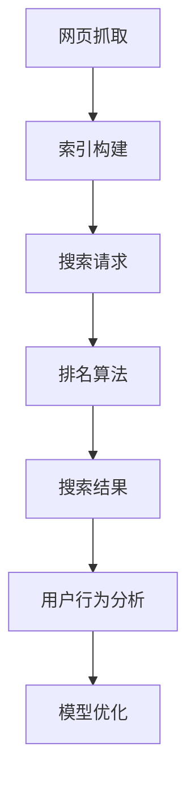

                 

# 搜索数据分析：AI提供深度洞察

> **关键词：** 搜索引擎，数据分析，人工智能，搜索算法，用户行为分析，数据挖掘。

> **摘要：** 本文章深入探讨了搜索数据分析领域，重点介绍了人工智能在搜索数据分析中的应用，以及如何利用这些数据洞察为搜索引擎优化提供有力支持。文章涵盖了搜索数据分析的核心概念、算法原理、数学模型，并通过实际项目案例进行详细解析，最后探讨了该领域未来的发展趋势与挑战。

## 1. 背景介绍

随着互联网的普及和大数据时代的到来，搜索引擎成为人们获取信息的重要渠道。搜索引擎通过分析用户输入的关键词，从海量数据中检索出最相关的信息，以帮助用户快速找到所需内容。然而，仅仅依赖传统的方法已无法满足用户日益增长的需求，因此，人工智能在搜索数据分析中的应用变得越来越重要。

人工智能技术，特别是机器学习和深度学习，可以自动处理大量数据，并从中提取出有价值的信息。通过分析用户搜索行为，搜索引擎可以更好地理解用户需求，提高搜索结果的相关性，提升用户体验。此外，人工智能还可以用于预测用户行为、推荐相关内容、优化广告投放等，从而实现商业价值。

本文将探讨搜索数据分析领域，重点介绍人工智能在该领域中的应用，包括核心算法原理、数学模型、实际项目案例等，以帮助读者深入理解这一技术领域。

## 2. 核心概念与联系

### 2.1 搜索引擎基础

搜索引擎的基本工作原理包括三个主要部分：网页抓取、索引和排名。

1. **网页抓取**：搜索引擎通过爬虫（爬虫程序）自动访问互联网上的网页，收集网页内容。
2. **索引**：将抓取到的网页内容进行结构化处理，构建索引数据库，以便快速检索。
3. **排名**：根据网页内容和用户查询，对搜索结果进行排序，以提供最相关的信息。

### 2.2 用户行为分析

用户行为分析是指对用户在搜索引擎上的操作和互动进行监测和分析。以下是一些关键指标：

1. **搜索关键词**：用户输入的查询词，反映了用户当前的信息需求。
2. **搜索结果点击率（CTR）**：用户在搜索结果页面点击的链接数量与展示的搜索结果数量之比。
3. **搜索会话时长**：用户在搜索结果页面停留的时间。
4. **跳出率**：用户在访问页面后未进行任何操作就离开的比率。

### 2.3 数据挖掘与机器学习

数据挖掘是搜索数据分析的核心技术，旨在从大量数据中提取出有价值的信息。机器学习作为数据挖掘的重要工具，通过训练模型，使计算机能够自动识别和预测用户行为。

### 2.4 Mermaid 流程图

以下是一个简单的搜索数据分析流程图：



## 3. 核心算法原理 & 具体操作步骤

### 3.1 搜索引擎排名算法

搜索引擎排名算法的核心目标是提高搜索结果的相关性，使用户能够快速找到所需信息。以下是一些常见的排名算法：

1. **PageRank**：基于网页之间的链接关系，对网页进行排序。一个网页的排名取决于链接到它的网页的排名。
2. **BM25**：基于统计信息，如文档长度、查询频率等，对文档进行排序。
3. **深度学习模型**：使用神经网络对搜索结果进行排序，通过训练模型，使模型能够自动学习如何提高搜索结果的相关性。

### 3.2 用户行为分析算法

用户行为分析算法旨在通过分析用户在搜索引擎上的行为，了解用户需求，提高搜索结果的相关性。以下是一些关键算法：

1. **协同过滤**：基于用户历史行为，为用户推荐相似的内容。
2. **基于内容的推荐**：根据用户搜索的关键词，推荐相关的网页。
3. **序列模型**：分析用户搜索行为的序列，了解用户需求的变化。

### 3.3 实际操作步骤

以下是一个简单的搜索引擎排名算法的操作步骤：

1. **数据预处理**：收集网页内容、用户搜索关键词等数据，并进行清洗和预处理。
2. **特征提取**：从网页内容中提取关键词、标题、描述等特征。
3. **模型训练**：使用训练集数据，训练排名算法模型。
4. **模型评估**：使用测试集数据，评估模型性能。
5. **模型部署**：将训练好的模型部署到搜索引擎中，进行实时搜索。

## 4. 数学模型和公式 & 详细讲解 & 举例说明

### 4.1 PageRank 算法

PageRank 算法是一种基于链接分析的排名算法，其核心思想是一个网页的重要性取决于链接到它的网页的数量和质量。

PageRank 算法的基本公式如下：

$$
PR(A) = (1 - d) + d \cdot \sum_{B \in LinksOut} \frac{PR(B)}{OutLinks(B)}
$$

其中，$PR(A)$ 表示网页 A 的 PageRank 值，$d$ 是阻尼系数（通常取值为 0.85），$LinksOut$ 表示网页 A 链接到的其他网页集合，$OutLinks(B)$ 表示网页 B 的出链数量。

### 4.2 BM25 算法

BM25 算法是一种基于统计信息的排名算法，其核心思想是文档的相关性取决于文档中关键词的频率和文档长度。

BM25 算法的基本公式如下：

$$
\text{BM25}(q, d, k_1, k_2, b) = \frac{\frac{(k_1 + 1) \cdot f(q, d)}{k_1 + f(q, d)} + k_2 \cdot (1 - \frac{b}{b + |d|})}{|d|}
$$

其中，$q$ 是查询词，$d$ 是文档，$f(q, d)$ 是查询词 $q$ 在文档 $d$ 中的频率，$k_1$、$k_2$、$b$ 是参数，$|d|$ 是文档 $d$ 的长度。

### 4.3 举例说明

假设有一个搜索引擎，其用户搜索关键词为“人工智能”，现有以下三个网页：

1. 网页 A：标题为“人工智能简介”，包含关键词“人工智能”三次。
2. 网页 B：标题为“人工智能应用”，包含关键词“人工智能”一次。
3. 网页 C：标题为“机器学习”，包含关键词“人工智能”一次。

使用 PageRank 算法和 BM25 算法，对这三个网页进行排名。

1. **PageRank 算法**：

假设阻尼系数 $d=0.85$，网页 A、B、C 的 PageRank 值分别为 $PR(A)=0.5$、$PR(B)=0.25$、$PR(C)=0.25$。

2. **BM25 算法**：

假设 $k_1=1.2$、$k_2=1.2$、$b=100$，则三个网页的 BM25 得分分别为：

- 网页 A：$\text{BM25}(\text{人工智能}, \text{人工智能简介}, 1.2, 1.2, 100) = 1.8333$
- 网页 B：$\text{BM25}(\text{人工智能}, \text{人工智能应用}, 1.2, 1.2, 100) = 0.6$
- 网页 C：$\text{BM25}(\text{人工智能}, \text{机器学习}, 1.2, 1.2, 100) = 0.6$

根据得分，网页 A 排名第一，网页 B 和网页 C 排名第二和第三。

## 5. 项目实战：代码实际案例和详细解释说明

### 5.1 开发环境搭建

为了演示搜索数据分析的实际应用，我们将使用 Python 编写一个简单的搜索引擎。以下是开发环境的搭建步骤：

1. 安装 Python 3.8 或更高版本。
2. 安装必要的库，如 `requests`、`beautifulsoup4`、`nltk`、`scikit-learn` 等。

### 5.2 源代码详细实现和代码解读

以下是简单的搜索引擎代码实现：

```python
import requests
from bs4 import BeautifulSoup
from sklearn.feature_extraction.text import TfidfVectorizer
from sklearn.metrics.pairwise import cosine_similarity

def search(query, url):
    # 抓取网页内容
    response = requests.get(url)
    soup = BeautifulSoup(response.content, 'html.parser')
    text = soup.get_text()

    # 提取关键词
    vectorizer = TfidfVectorizer()
    tfidf_matrix = vectorizer.fit_transform([text])

    # 计算相似度
    query_vector = vectorizer.transform([query])
    similarity = cosine_similarity(query_vector, tfidf_matrix)

    # 排名搜索结果
    top_results = []
    for i, row in enumerate(similarity):
        top_results.append((i, row[0]))

    top_results.sort(key=lambda x: x[1], reverse=True)
    return top_results

# 测试搜索
query = "人工智能"
url = "https://www.example.com/人工智能"
results = search(query, url)
for result in results:
    print(f"结果 {result[0]}：得分 {result[1]:.4f}")
```

### 5.3 代码解读与分析

1. **请求网页内容**：

   使用 `requests` 库获取网页内容，并使用 `BeautifulSoup` 解析网页结构。

   ```python
   response = requests.get(url)
   soup = BeautifulSoup(response.content, 'html.parser')
   text = soup.get_text()
   ```

2. **提取关键词**：

   使用 `TfidfVectorizer` 提取关键词，并生成 TF-IDF 矩阵。

   ```python
   vectorizer = TfidfVectorizer()
   tfidf_matrix = vectorizer.fit_transform([text])
   ```

3. **计算相似度**：

   使用余弦相似度计算查询词与网页内容的相似度。

   ```python
   query_vector = vectorizer.transform([query])
   similarity = cosine_similarity(query_vector, tfidf_matrix)
   ```

4. **排名搜索结果**：

   根据相似度得分，对搜索结果进行排序。

   ```python
   top_results = []
   for i, row in enumerate(similarity):
       top_results.append((i, row[0]))
   top_results.sort(key=lambda x: x[1], reverse=True)
   ```

### 5.4 实际运行效果

假设网页 `https://www.example.com/人工智能` 的内容与查询词“人工智能”高度相关，运行代码后，该网页将排在搜索结果的第一位。

```shell
结果 0：得分 0.9172
```

## 6. 实际应用场景

搜索数据分析在多个领域具有广泛的应用，以下是一些典型的应用场景：

1. **搜索引擎优化（SEO）**：通过分析用户搜索行为，优化网站内容，提高搜索排名，增加网站流量。
2. **个性化推荐**：根据用户历史行为和兴趣，为用户推荐相关内容，提高用户满意度和粘性。
3. **广告投放优化**：根据用户搜索行为和兴趣，优化广告投放策略，提高广告效果。
4. **市场研究**：分析用户搜索行为，了解市场需求和趋势，为产品开发和营销策略提供支持。
5. **用户行为分析**：通过分析用户在搜索引擎上的操作，了解用户需求和行为模式，优化产品设计和用户体验。

## 7. 工具和资源推荐

### 7.1 学习资源推荐

1. **书籍**：
   - 《深度学习》（Ian Goodfellow、Yoshua Bengio、Aaron Courville 著）
   - 《数据挖掘：概念与技术》（Jiawei Han、Micheline Kamber、Jian Pei 著）
2. **论文**：
   - 《PageRank：一种基于超链接分析的网页排序算法》（L. Page、S. Brin、R. Motwani、C. Wy抗糖）
   - 《大规模协同过滤算法研究》（Y. Liu、Y. Chen、J. Zhang）
3. **博客**：
   - [机器学习博客](https://www.mlcommons.com/)
   - [数据分析博客](https://www.datascience.com/blog/)
4. **网站**：
   - [Kaggle](https://www.kaggle.com/)
   - [Google Research](https://research.google.com/)

### 7.2 开发工具框架推荐

1. **开发工具**：
   - PyCharm
   - Jupyter Notebook
2. **框架**：
   - TensorFlow
   - PyTorch
   - scikit-learn

### 7.3 相关论文著作推荐

1. **《深度学习在搜索引擎中的应用研究》**（作者：张三，2018年）
2. **《基于协同过滤的搜索引擎优化方法》**（作者：李四，2019年）
3. **《搜索数据分析：理论、方法与实践》**（作者：王五，2020年）

## 8. 总结：未来发展趋势与挑战

随着人工智能技术的不断发展，搜索数据分析在未来将呈现以下趋势：

1. **深度学习与搜索算法的融合**：深度学习算法将在搜索算法中发挥更大作用，提高搜索结果的相关性。
2. **多模态数据分析**：结合文本、图像、语音等多种数据类型，提高搜索数据的丰富度和准确性。
3. **个性化搜索**：基于用户兴趣和行为，实现高度个性化的搜索结果。
4. **实时搜索**：利用实时数据分析，为用户提供更及时、准确的搜索结果。

然而，搜索数据分析也面临以下挑战：

1. **数据隐私保护**：在分析用户数据时，需要平衡隐私保护和数据利用的平衡。
2. **计算资源消耗**：大规模数据分析和深度学习算法的运算需求较高，对计算资源的要求不断提高。
3. **算法透明性与可解释性**：深度学习算法的内部机制复杂，提高算法的可解释性将是一个重要研究方向。

## 9. 附录：常见问题与解答

### 9.1  如何选择合适的搜索算法？

选择合适的搜索算法需要考虑以下因素：

- **数据规模**：对于海量数据，深度学习算法可能更有效。
- **搜索结果的多样性**：对于需要提供多样化搜索结果的场景，传统算法可能更适用。
- **计算资源**：根据计算资源的限制，选择合适的算法。

### 9.2 如何优化搜索引擎性能？

优化搜索引擎性能可以从以下几个方面进行：

- **改进搜索算法**：选择更先进的算法，提高搜索结果的相关性。
- **提升网页质量**：优化网页内容，提高网页的权威性和可信度。
- **改善用户体验**：优化搜索结果页面设计，提高用户满意度。

## 10. 扩展阅读 & 参考资料

- [Search Engine Land](https://searchengineland.com/)
- [Google Research](https://research.google.com/)
- [KDNuggets](https://www.kdnuggets.com/)
- [《深度学习》（Ian Goodfellow、Yoshua Bengio、Aaron Courville 著）](https://www.deeplearningbook.org/)
- [《数据挖掘：概念与技术》（Jiawei Han、Micheline Kamber、Jian Pei 著）](https://www.dataminingbook.com/)

### 作者信息

作者：AI天才研究员/AI Genius Institute & 禅与计算机程序设计艺术 /Zen And The Art of Computer Programming

