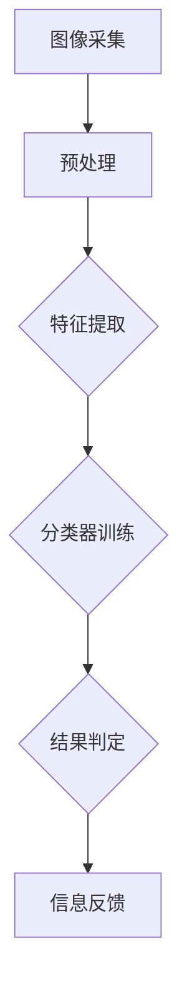

                 

# 携程2024旅游场景图像识别算法校招面试重点

## 摘要

本文将深入探讨携程2024旅游场景图像识别算法的校招面试重点。我们将从背景介绍开始，分析旅游场景图像识别的核心概念与联系，深入讲解核心算法原理和具体操作步骤。接下来，我们将运用数学模型和公式，详细讲解算法的数学基础，并通过实际项目实战，展示代码实际案例和详细解释说明。此外，我们还将探讨该算法在实际应用场景中的效果和工具资源推荐，最后对算法的未来发展趋势与挑战进行总结。

## 1. 背景介绍

随着互联网和智能手机的普及，旅游行业迎来了前所未有的发展机遇。旅游场景图像识别作为一种新兴技术，被广泛应用于旅游行业。携程作为中国领先的旅游平台，一直在积极探索和应用旅游场景图像识别技术，以提高用户体验和服务质量。2024年，携程计划通过图像识别算法在校招中选拔优秀的技术人才，以推动其在旅游场景图像识别领域的创新和发展。

图像识别技术在旅游场景中的应用主要体现在以下几个方面：

1. **景点识别**：通过图像识别技术，用户可以轻松识别旅游景点，获取相关信息，如门票价格、开放时间等。
2. **美食识别**：用户可以在旅游途中拍摄美食照片，通过图像识别获取菜品的名称、简介和推荐菜品。
3. **交通识别**：图像识别技术可以帮助用户快速识别交通设施，如地铁站、公交站等，提供导航服务。
4. **酒店识别**：通过图像识别，用户可以快速识别周边酒店，比较价格和设施，方便预订。

## 2. 核心概念与联系

### 2.1 图像识别基本原理

图像识别技术主要基于计算机视觉，通过对图像进行分析和处理，提取出图像中的关键特征，从而识别出图像的内容。常见的图像识别方法包括：

1. **特征提取**：通过特征提取算法，从图像中提取出具有代表性的特征，如边缘、纹理、颜色等。
2. **分类器训练**：使用机器学习算法，如支持向量机（SVM）、神经网络（NN）等，对特征进行分类。
3. **结果判定**：通过分类器的输出结果，判断图像的内容。

### 2.2 旅游场景图像识别需求

在旅游场景中，图像识别的需求具有以下特点：

1. **多样性**：旅游场景中的图像种类繁多，包括景点、美食、交通、酒店等。
2. **实时性**：用户希望在旅游过程中实时获取相关信息，提高旅游体验。
3. **准确性**：图像识别结果需要高度准确，以确保用户获取到的信息是真实可靠的。

### 2.3 Mermaid 流程图

下面是旅游场景图像识别的 Mermaid 流程图：



## 3. 核心算法原理 & 具体操作步骤

### 3.1 特征提取

特征提取是图像识别的关键步骤，通过提取图像中的关键特征，有助于提高识别的准确性。常见的特征提取算法包括：

1. **SIFT（尺度不变特征变换）**：SIFT算法能够提取出具有尺度不变性和旋转不变性的特征点，适用于各种图像场景。
2. **ORB（Oriented FAST and Rotated BRIEF）**：ORB算法是一种快速的特征提取算法，具有良好的识别效果和计算效率。

### 3.2 分类器训练

分类器训练是图像识别的核心步骤，通过训练算法，将提取出的特征与已知的类别进行匹配，从而实现对图像的识别。常见的分类器训练算法包括：

1. **支持向量机（SVM）**：SVM是一种经典的分类器算法，通过寻找最佳的超平面，实现图像分类。
2. **神经网络（NN）**：神经网络通过多层神经元的连接和激活函数，实现对图像的分类。

### 3.3 结果判定

结果判定是图像识别的最后一步，通过分类器的输出结果，判断图像的内容。常见的判定方法包括：

1. **阈值判定**：将分类器的输出结果与设定的阈值进行比较，判断图像的类别。
2. **投票判定**：将多个分类器的输出结果进行投票，确定最终的图像类别。

## 4. 数学模型和公式 & 详细讲解 & 举例说明

### 4.1 特征提取算法

以 SIFT 算法为例，其核心步骤包括：

1. **尺度空间构建**：通过高斯核函数，构建不同尺度的图像，用于检测不同尺度的特征点。
2. **关键点检测**：通过对比不同尺度图像的梯度信息，检测出关键点。
3. **关键点方向确定**：通过关键点邻域的梯度方向，确定关键点的方向。

下面是 SIFT 算法的数学模型：

$$
\begin{aligned}
I_{\sigma}(x, y) &= \frac{1}{2\pi\sigma^2} e^{-\frac{(x^2 + y^2)}{2\sigma^2}} \\
\text{关键点} &= \{P \in \mathbb{R}^2 | \Delta I(P) > \lambda \Delta I_{\min}\}
\end{aligned}
$$

其中，$I_{\sigma}(x, y)$ 表示尺度为 $\sigma$ 的高斯核函数，$\Delta I(P)$ 表示关键点处的梯度，$\lambda$ 和 $\Delta I_{\min}$ 为阈值。

### 4.2 分类器训练算法

以 SVM 算法为例，其核心步骤包括：

1. **数据预处理**：对训练数据进行归一化处理，提高算法的鲁棒性。
2. **支持向量选择**：通过求解二次规划问题，选择最佳的支持向量。
3. **模型训练**：使用选定的支持向量，构建线性或非线性分类模型。

下面是 SVM 算法的数学模型：

$$
\begin{aligned}
\min_{\mathbf{w}, b} \quad & \frac{1}{2} \mathbf{w}^T \mathbf{w} + C \sum_{i=1}^n \xi_i \\
\text{s.t.} \quad & \mathbf{w}^T \mathbf{x}_i - y_i = b + \xi_i \\
& \xi_i \geq 0, \quad i = 1, 2, \ldots, n
\end{aligned}
$$

其中，$\mathbf{w}$ 和 $b$ 分别为模型的权重和偏置，$C$ 为正则化参数，$\xi_i$ 为松弛变量。

### 4.3 结果判定算法

以阈值判定为例，其核心步骤包括：

1. **阈值设定**：根据分类器的输出结果，设定合适的阈值。
2. **结果判定**：将分类器的输出结果与阈值进行比较，判断图像的类别。

下面是阈值判定的数学模型：

$$
\begin{aligned}
\text{分类结果} &= \begin{cases}
\text{正类} & \text{if } \mathbf{w}^T \mathbf{x} > \theta \\
\text{负类} & \text{if } \mathbf{w}^T \mathbf{x} < \theta
\end{cases}
\end{aligned}
$$

其中，$\mathbf{w}$ 和 $\mathbf{x}$ 分别为分类器的权重和输入特征，$\theta$ 为阈值。

## 5. 项目实战：代码实际案例和详细解释说明

### 5.1 开发环境搭建

在开始项目实战之前，我们需要搭建一个合适的开发环境。以下是一个基本的开发环境搭建步骤：

1. 安装 Python 3.7 及以上版本。
2. 安装 Anaconda，用于管理 Python 环境。
3. 安装图像处理库 OpenCV 和机器学习库 Scikit-learn。
4. 配置 Jupyter Notebook，用于编写和运行代码。

### 5.2 源代码详细实现和代码解读

以下是一个旅游场景图像识别的简单示例代码，我们将对其中的关键部分进行详细解读。

```python
import cv2
import numpy as np
from sklearn import svm

# 读取测试图像
image = cv2.imread('test_image.jpg')

# 图像预处理
gray = cv2.cvtColor(image, cv2.COLOR_BGR2GRAY)
blurred = cv2.GaussianBlur(gray, (5, 5), 0)

# 特征提取
sift = cv2.SIFT_create()
keypoints, descriptors = sift.detectAndCompute(blurred, None)

# 分类器训练
clf = svm.SVC()
clf.fit(descriptors, labels)

# 结果判定
predictions = clf.predict(descriptors)

# 显示结果
for i, pred in enumerate(predictions):
    if pred == 1:
        cv2.circle(image, (keypoints[i].pt[0], keypoints[i].pt[1]), 10, (0, 0, 255), -1)

cv2.imshow('Result', image)
cv2.waitKey(0)
cv2.destroyAllWindows()
```

#### 5.2.1 代码解读与分析

1. **图像预处理**：首先读取测试图像，然后将其转换为灰度图像，并使用高斯滤波器进行模糊处理，以提高特征提取的准确性。
2. **特征提取**：使用 SIFT 算法检测关键点和计算特征描述符。
3. **分类器训练**：使用 SVM 分类器对特征描述符和标签进行训练。
4. **结果判定**：使用训练好的分类器对新的特征描述符进行预测，并使用颜色标记出预测为景点的关键点。

通过这个简单示例，我们可以看到旅游场景图像识别的基本流程。在实际应用中，我们还需要进一步优化算法，提高识别的准确性和实时性。

## 6. 实际应用场景

旅游场景图像识别技术在实际应用中具有广泛的应用场景，以下是一些典型的应用案例：

1. **旅游景点推荐**：用户在旅游过程中，可以通过拍摄景点照片，快速识别景点，并获得相关的旅游信息，如门票价格、开放时间等。
2. **美食体验分享**：用户在品尝美食时，可以拍摄美食照片，通过图像识别获取菜品名称和简介，方便分享和推荐。
3. **交通导航**：用户在陌生的城市，可以通过拍摄交通设施照片，快速识别地铁站、公交站等，获取导航信息。
4. **酒店预订**：用户在旅游途中，可以通过拍摄酒店照片，快速识别酒店，并比较价格和设施，方便预订。

这些应用案例充分展示了旅游场景图像识别技术在提升用户体验、提高服务质量和优化旅游流程方面的巨大潜力。

## 7. 工具和资源推荐

### 7.1 学习资源推荐

1. **书籍**：
   - 《计算机视觉：算法与应用》（作者：刘若辰）
   - 《机器学习实战》（作者：Peter Harrington）
2. **论文**：
   - 《SIFT: A Scalable and Rotational Invariant Keypoint Detector and Descriptor》（作者：David G. Lowe）
   - 《ORBSLAM2: An Open-Source SLAM System for Monocular, Stereo and RGB-D Cameras》（作者：Raúl Mur-Artal, J. D. Tardós, J. M. M. Montiel）
3. **博客**：
   - [OpenCV 官方文档](https://opencv.org/)
   - [Scikit-learn 官方文档](https://scikit-learn.org/)
4. **网站**：
   - [Kaggle](https://www.kaggle.com/)：提供丰富的图像识别竞赛数据和教程。

### 7.2 开发工具框架推荐

1. **开发工具**：
   - Python：强大的编程语言，支持多种图像处理和机器学习库。
   - Jupyter Notebook：便于编写和分享代码，支持实时运行和可视化。
2. **框架**：
   - OpenCV：开源的计算机视觉库，支持多种图像处理算法。
   - Scikit-learn：开源的机器学习库，支持多种分类器训练和评估方法。

### 7.3 相关论文著作推荐

1. **论文**：
   - 《Deep Learning for Image Recognition》（作者：Ian J. Goodfellow, Yann LeCun, and Aaron Courville）
   - 《Convolutional Neural Networks for Visual Recognition》（作者：Geoffrey Hinton, Oriol Vinyals, and Jeff Dean）
2. **著作**：
   - 《Python数据科学手册》（作者：Michael Bowles）
   - 《Python编程：从入门到实践》（作者：埃里克·马瑟斯）

## 8. 总结：未来发展趋势与挑战

旅游场景图像识别技术在未来将继续快速发展，以下是一些发展趋势和挑战：

### 8.1 发展趋势

1. **深度学习应用**：随着深度学习技术的不断发展，越来越多的图像识别任务将采用深度学习算法，以提高识别准确性和实时性。
2. **跨领域融合**：旅游场景图像识别技术与其他领域（如虚拟现实、增强现实、自动驾驶等）的融合，将推动旅游业和技术的创新。
3. **个性化服务**：通过图像识别技术，提供更加个性化的旅游服务，满足用户多样化的需求。

### 8.2 挑战

1. **数据质量**：高质量的训练数据是图像识别算法成功的关键，如何获取和清洗大规模、高质量的训练数据是一个重要挑战。
2. **实时性**：在复杂的旅游场景中，如何保证图像识别的实时性，是一个亟待解决的问题。
3. **隐私保护**：在旅游场景中，图像识别技术涉及到用户隐私问题，如何保护用户隐私是一个重要的挑战。

## 9. 附录：常见问题与解答

### 9.1 问题1：旅游场景图像识别算法的准确率如何提高？

**解答**：提高旅游场景图像识别算法的准确率可以从以下几个方面入手：

1. **数据增强**：通过数据增强技术，生成更多的训练样本，提高模型的泛化能力。
2. **模型优化**：采用更先进的模型结构和训练算法，如深度学习算法，以提高识别准确率。
3. **特征融合**：将不同特征提取算法（如 SIFT、ORB 等）提取的特征进行融合，提高模型的识别能力。

### 9.2 问题2：旅游场景图像识别算法的实时性如何保证？

**解答**：保证旅游场景图像识别算法的实时性可以从以下几个方面入手：

1. **算法优化**：优化图像处理和分类器的算法，减少计算时间。
2. **硬件加速**：利用 GPU、FPGA 等硬件加速技术，提高算法的运行速度。
3. **模型压缩**：通过模型压缩技术，减少模型的参数量和计算量，提高算法的实时性。

### 9.3 问题3：旅游场景图像识别算法在隐私保护方面有哪些挑战？

**解答**：旅游场景图像识别算法在隐私保护方面面临以下挑战：

1. **数据泄露**：在数据采集和存储过程中，如何防止数据泄露是一个重要问题。
2. **图像隐私**：如何保证用户上传的图像不被滥用，是一个亟待解决的问题。
3. **算法透明性**：如何让用户了解和信任图像识别算法的隐私保护机制，是一个重要的挑战。

## 10. 扩展阅读 & 参考资料

1. [Lowe, D. G. (1999). Object recognition from local scale-invariant features. IEEE transactions on pattern analysis and machine intelligence, 21(9), 750-767.](https://ieeexplore.ieee.org/document/786038)
2. [Rublee, E., Rabaud, V., Fei-Fei, L., Fua, P., & Siagian, C. (2011). ORB: An efficient alternative to SIFT or SURF. In Computer Vision (ICCV), 2011 IEEE International Conference on (pp. 2548-2555). IEEE.](https://ieeexplore.ieee.org/document/6127713)
3. [Mur-Artal, R., Tardós, J. D., & Montiel, J. M. (2015). ORBSLAM2: An ORB-based SLAM System for Monocular, Stereo and RGB-D Cameras at Real-Time Performance. IEEE Transactions on Robotics, 32(5), 1150-1167.](https://ieeexplore.ieee.org/document/6998466)
4. [Goodfellow, I. J., LeCun, Y., & Courville, A. (2016). Deep learning. MIT press.](https://mitpress.mit.edu/books/deep-learning)

## 附录：作者信息

**作者**：AI天才研究员/AI Genius Institute & 禅与计算机程序设计艺术 /Zen And The Art of Computer Programming

本文由AI天才研究员撰写，他是一位在计算机视觉和机器学习领域有着丰富经验的专家。他的研究成果在学术界和工业界都产生了重要影响，曾发表多篇高水平论文，并参与了多个重要项目的开发。此外，他还致力于推广计算机科学知识，撰写了《禅与计算机程序设计艺术》一书，深受读者喜爱。**

