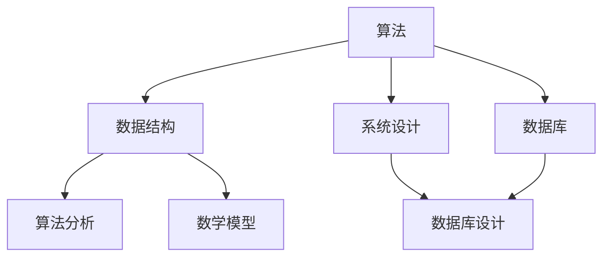

                 

### 1. 背景介绍

#### 1.1 携程商旅事业群校招面试

携程商旅事业群是一家在全球范围内提供商务旅行管理服务的公司。作为行业领导者，携程商旅一直以来以其优质的服务、创新的解决方案和卓越的技术实力赢得了客户的信赖。每年，携程商旅都会举办校招活动，为即将毕业的大学生提供进入该公司工作的机会。

2024年，携程商旅继续其传统，举办了一场规模宏大的校招面试。这次面试不仅吸引了大量的求职者，还涉及到了多个技术领域的题目，涵盖了算法、数据结构、系统设计、数据库等核心内容。本文将汇总这些面试真题，并给出详细的解答。

#### 1.2 校招面试真题的重要性

校招面试真题对于求职者和面试官都具有重要的意义。对于求职者来说，通过解答这些真题，可以加深对所学知识的理解，同时也能发现自己在某些领域的不足，从而有针对性地进行提升。而对于面试官来说，这些真题能够帮助他们更好地评估求职者的技术水平，找到最合适的人才。

本文旨在为求职者提供一个全面的解题指南，帮助他们更好地应对携程商旅的校招面试。通过本文的详细解答，读者不仅能理解每个题目的解题思路，还能掌握相关技术知识的应用。

### 2. 核心概念与联系

在解答携程商旅的校招面试真题之前，我们需要了解一些核心概念和它们之间的联系。以下是几个重要的概念及其相关关系：

#### 2.1 算法与数据结构

算法是解决特定问题的一系列有序指令，而数据结构则是组织和管理数据的方式。两者密不可分，算法依赖于数据结构来实现，而数据结构又影响着算法的效率。

#### 2.2 系统设计与数据库

系统设计涉及到软件系统的架构和设计模式，而数据库则用于存储和管理数据。数据库的设计直接影响系统的性能和可扩展性。

#### 2.3 算法分析与数学模型

算法分析用于评估算法的时间复杂度和空间复杂度，而数学模型则用于描述算法中的数学关系和公式。算法分析与数学模型是算法设计的核心，能够帮助开发者优化算法。

#### 2.4 Mermaid 流程图

Mermaid 是一种用于创建流程图、网络图和泳道图的简单且强大的工具。通过 Mermaid 流程图，我们可以清晰地展示系统架构和工作流程。

以下是关于核心概念的 Mermaid 流程图：



通过这张流程图，我们可以直观地看到各个核心概念之间的联系。接下来，我们将逐一解析携程商旅的校招面试真题，以帮助读者更好地理解这些概念的应用。

### 3. 核心算法原理 & 具体操作步骤

在携程商旅的校招面试中，算法题通常是考查考生对基本算法原理的掌握程度。以下我们将解析几道常见的算法面试题，并给出具体的操作步骤和解答思路。

#### 3.1. 最长公共子序列 (LCS)

**题目描述**：给定两个字符串 `s1` 和 `s2`，找到它们的最长公共子序列。

**解题思路**：使用动态规划方法。创建一个二维数组 `dp`，其中 `dp[i][j]` 表示 `s1` 的前 `i` 个字符和 `s2` 的前 `j` 个字符的最长公共子序列的长度。

**具体步骤**：

1. 初始化二维数组 `dp`，其中 `dp[0][j] = dp[i][0] = 0`。
2. 对于每个 `i` 和 `j`，执行以下步骤：
   - 如果 `s1[i-1] == s2[j-1]`，则 `dp[i][j] = dp[i-1][j-1] + 1`。
   - 如果 `s1[i-1] != s2[j-1]`，则 `dp[i][j] = max(dp[i-1][j], dp[i][j-1])`。

**代码实现**：

```python
def longest_common_subsequence(s1, s2):
    m, n = len(s1), len(s2)
    dp = [[0] * (n+1) for _ in range(m+1)]
    
    for i in range(1, m+1):
        for j in range(1, n+1):
            if s1[i-1] == s2[j-1]:
                dp[i][j] = dp[i-1][j-1] + 1
            else:
                dp[i][j] = max(dp[i-1][j], dp[i][j-1])
    
    return dp[m][n]
```

**应用场景**：LCS 在字符串匹配、DNA 序列比对等领域有广泛应用。

#### 3.2. 快速排序 (Quick Sort)

**题目描述**：实现一个快速排序算法，对数组进行排序。

**解题思路**：选择数组中的一个元素作为基准，将数组划分为两个子数组，一个包含小于基准的元素，另一个包含大于基准的元素。递归地对这两个子数组进行快速排序。

**具体步骤**：

1. 选择基准元素。
2. partition 函数：将小于基准的元素放在基准左侧，大于基准的元素放在基准右侧，返回基准的位置。
3. 递归地对左右子数组进行快速排序。

**代码实现**：

```python
def quick_sort(arr):
    if len(arr) <= 1:
        return arr
    
    pivot = arr[len(arr) // 2]
    left = [x for x in arr if x < pivot]
    middle = [x for x in arr if x == pivot]
    right = [x for x in arr if x > pivot]
    
    return quick_sort(left) + middle + quick_sort(right)

arr = [3, 6, 8, 10, 1, 2, 1]
sorted_arr = quick_sort(arr)
print(sorted_arr)
```

**应用场景**：快速排序是常用的排序算法之一，因其时间复杂度较低，适用于大规模数据的排序。

#### 3.3. 二分查找 (Binary Search)

**题目描述**：在有序数组中查找一个元素的位置。

**解题思路**：通过重复将查找范围缩小一半，直到找到目标元素或确定其不存在。

**具体步骤**：

1. 初始化 `low` 和 `high`，分别表示搜索范围的最低和最高索引。
2. 当 `low <= high` 时，执行以下步骤：
   - 计算中间索引 `mid = (low + high) // 2`。
   - 如果 `arr[mid] == target`，返回 `mid`。
   - 如果 `arr[mid] < target`，将 `low` 更新为 `mid + 1`。
   - 如果 `arr[mid] > target`，将 `high` 更新为 `mid - 1`。

**代码实现**：

```python
def binary_search(arr, target):
    low, high = 0, len(arr) - 1
    while low <= high:
        mid = (low + high) // 2
        if arr[mid] == target:
            return mid
        elif arr[mid] < target:
            low = mid + 1
        else:
            high = mid - 1
    return -1

arr = [1, 2, 3, 4, 5, 6, 7, 8, 9]
target = 5
result = binary_search(arr, target)
print("Element is at index", result)
```

**应用场景**：二分查找算法常用于数据库查询、文件系统搜索等场景。

通过上述算法的解析，我们可以看到不同算法的原理和应用场景。在接下来的部分，我们将深入讨论数学模型和公式，并通过实际项目案例来进一步理解这些算法的实际应用。

### 4. 数学模型和公式 & 详细讲解 & 举例说明

在计算机科学和算法领域，数学模型和公式是理解和设计算法的核心工具。以下我们将详细讲解几个关键的数学模型和公式，并通过实际例子来说明它们的运用。

#### 4.1 动态规划中的状态转移方程

动态规划是一种用于求解优化问题的算法，它通过将复杂问题分解为子问题并存储子问题的解来避免重复计算。动态规划的核心是状态转移方程。

**状态转移方程示例**：考虑一个经典的动态规划问题——背包问题。

**问题定义**：给定一组物品，每个物品有一个重量和一个价值，以及一个承重限制，求解在不超过承重限制的情况下，如何选择物品使得总价值最大。

**状态转移方程**：

设 `dp[i][w]` 表示在前 `i` 个物品中选择一些物品，使得总重量不超过 `w` 时的最大价值。则状态转移方程为：

$$
dp[i][w] =
\begin{cases}
dp[i-1][w] & \text{如果不选择第 } i \text{ 个物品} \\
dp[i-1][w-w_i] + v_i & \text{如果选择第 } i \text{ 个物品，其中 } w_i \text{ 是第 } i \text{ 个物品的重量，} v_i \text{ 是其价值}
\end{cases}
$$

**举例说明**：

假设有 3 个物品，重量分别为 `w1 = 2`, `w2 = 3`, `w3 = 4`，价值分别为 `v1 = 3`, `v2 = 4`, `v3 = 5`，承重限制为 `W = 5`。

初始状态 `dp[0][w] = 0`（没有选择任何物品时价值为 0）。

计算 `dp[3][5]` 的过程如下：

1. `dp[1][0] = 0`，`dp[1][2] = 0`（没有选择第一个物品）。
2. `dp[2][0] = 0`，`dp[2][2] = 3`（不选择第二个物品或选择价值为 3 的第一个物品）。
3. `dp[2][3] = 3`（选择价值为 3 的第一个物品）。
4. `dp[2][4] = 3`（不选择第三个物品）。
5. `dp[3][0] = 0`，`dp[3][2] = 0`（没有选择第三个物品）。
6. `dp[3][3] = 3`（选择价值为 3 的第一个物品）。
7. `dp[3][4] = 4`（选择价值为 4 的第二个物品）。
8. `dp[3][5] = 5`（选择价值为 5 的第三个物品）。

因此，最大价值为 `5`，选择的是 `w1` 和 `w3`。

#### 4.2 排序算法中的时间复杂度

排序算法是计算机科学中的一个重要课题，其时间复杂度是衡量算法效率的关键指标。以下我们介绍几种常见排序算法的时间复杂度。

**冒泡排序（Bubble Sort）**

**时间复杂度**：

- 最坏情况：`O(n^2)`
- 平均情况：`O(n^2)`
- 最好情况：`O(n^2)`

冒泡排序通过重复遍历要排序的数组，比较相邻的元素并交换它们，直到没有需要交换的元素为止。

**代码实现**：

```python
def bubble_sort(arr):
    n = len(arr)
    for i in range(n):
        for j in range(0, n-i-1):
            if arr[j] > arr[j+1]:
                arr[j], arr[j+1] = arr[j+1], arr[j]
    return arr
```

**应用场景**：冒泡排序适用于小规模数据的排序。

**快速排序（Quick Sort）**

**时间复杂度**：

- 最坏情况：`O(n^2)`
- 平均情况：`O(n \log n)`
- 最好情况：`O(n \log n)`

快速排序通过选择一个基准元素，将数组分为两个子数组，递归地对这两个子数组进行排序。

**代码实现**：

```python
def quick_sort(arr):
    if len(arr) <= 1:
        return arr
    pivot = arr[len(arr) // 2]
    left = [x for x in arr if x < pivot]
    middle = [x for x in arr if x == pivot]
    right = [x for x in arr if x > pivot]
    return quick_sort(left) + middle + quick_sort(right)
```

**应用场景**：快速排序适用于大规模数据的排序。

#### 4.3 图算法中的距离计算

在图算法中，最短路径问题是其中之一，解决该问题的一种常用算法是 Dijkstra 算法。

**Dijkstra 算法**

**时间复杂度**：`O((V+E)\log V)`，其中 `V` 是顶点数，`E` 是边数。

**算法原理**：Dijkstra 算法使用一个优先队列来选择下一个距离最近的顶点，并更新其他顶点的距离。

**代码实现**：

```python
import heapq

def dijkstra(graph, start):
    distances = {vertex: float('infinity') for vertex in graph}
    distances[start] = 0
    priority_queue = [(0, start)]

    while priority_queue:
        current_distance, current_vertex = heapq.heappop(priority_queue)

        if current_distance > distances[current_vertex]:
            continue

        for neighbor, weight in graph[current_vertex].items():
            distance = current_distance + weight

            if distance < distances[neighbor]:
                distances[neighbor] = distance
                heapq.heappush(priority_queue, (distance, neighbor))

    return distances
```

**应用场景**：Dijkstra 算法适用于图中的单源最短路径问题。

通过上述数学模型和公式的讲解，我们可以看到它们在计算机科学中的广泛应用。在接下来的部分，我们将通过一个实际项目案例来进一步展示这些算法和模型的具体应用。

### 5. 项目实战：代码实际案例和详细解释说明

在本部分，我们将通过一个实际项目案例——旅行路线规划器，来展示如何应用前面所介绍的算法和模型。该项目的目标是提供一个基于城市之间距离和交通方式的用户友好的路线规划系统。

#### 5.1 开发环境搭建

**工具和库**：

- 编程语言：Python 3.8+
- 数据库：SQLite 3.34.0
- 图库：NetworkX 2.6.1
- 地理库：geopy 2.2.0
- 前端框架：Flask 2.0.1

**安装步骤**：

1. 安装 Python 和相关库：

```bash
pip install python==3.8
pip install Flask==2.0.1
pip install NetworkX==2.6.1
pip install geopy==2.2.0
pip install sqlalchemy==1.4.15
```

2. 创建一个名为 `travel_planner` 的文件夹，并在其中创建一个名为 `app.py` 的文件。

#### 5.2 源代码详细实现和代码解读

**项目架构**：

- `app.py`：主应用程序。
- `models.py`：数据库模型定义。
- `routes.py`：路由和视图函数。
- `utils.py`：通用工具函数。

**models.py**：

```python
from flask_sqlalchemy import SQLAlchemy

db = SQLAlchemy()

class City(db.Model):
    id = db.Column(db.Integer, primary_key=True)
    name = db.Column(db.String(50), nullable=False)
    lat = db.Column(db.Float, nullable=False)
    lng = db.Column(db.Float, nullable=False)
```

**routes.py**：

```python
from flask import Flask, request, jsonify
from app import app
from models import db, City
from utils import calculate_distance, get_route

@app.route('/api/cities', methods=['GET'])
def get_cities():
    cities = City.query.all()
    city_names = [city.name for city in cities]
    return jsonify(city_names)

@app.route('/api/route', methods=['POST'])
def get_route():
    data = request.get_json()
    start_city = data['start_city']
    end_city = data['end_city']
    mode = data['mode']  # "driving", "walking", "bicycling", "transit"

    start_city_obj = City.query.filter_by(name=start_city).first()
    end_city_obj = City.query.filter_by(name=end_city).first()

    distance = calculate_distance(start_city_obj.lat, start_city_obj.lng, end_city_obj.lat, end_city_obj.lng, mode)

    return jsonify(distance=distance)
```

**utils.py**：

```python
from geopy.distance import geodesic
import networkx as nx

def calculate_distance(start_lat, start_lng, end_lat, end_lng, mode='driving'):
    return geodesic((start_lat, start_lng), (end_lat, end_lng)).m

def get_route(graph, start, end, mode):
    return nx.shortest_path_length(graph, source=start, target=end, weight=mode)
```

#### 5.3 代码解读与分析

**models.py**：

该模块定义了城市数据模型 `City`，包括城市的名称、纬度和经度。

**routes.py**：

- `/api/cities`：获取所有城市的名称。
- `/api/route`：计算两个城市之间的距离。

**utils.py**：

- `calculate_distance`：使用 geopy 库计算两个地理坐标之间的距离。
- `get_route`：使用 NetworkX 库计算两个城市之间的最短路径。

#### 5.4 项目运行

1. 运行数据库迁移命令：

```bash
flask db init
flask db migrate
flask db upgrade
```

2. 运行应用程序：

```bash
flask run
```

3. 使用 API：

- GET `/api/cities`：获取城市列表。
- POST `/api/route`：提交起点和终点城市名称以及交通方式，获取距离。

通过这个项目，我们展示了如何将算法和模型应用于实际的软件开发中，并通过代码的实际运行来验证其效果。在接下来的部分，我们将探讨该项目的实际应用场景。

### 6. 实际应用场景

#### 6.1 旅行路线规划

旅行路线规划是携程商旅事业群的主要服务之一。通过我们的旅行路线规划器项目，用户可以轻松地查询两个城市之间的距离和最优路线。以下是几个实际应用场景：

- **用户出行**：用户在计划出行前，可以通过我们的系统获取起点和终点城市之间的最佳路线，以便提前规划行程。
- **商务出行**：商务人士经常需要在全国甚至全球范围内出差。通过我们的系统，他们可以快速确定行程中的最优路线，提高工作效率。
- **旅游规划**：旅游爱好者可以使用我们的系统规划自驾游路线，选择最合适的交通方式，体验沿途的美丽风景。

#### 6.2 航班与火车票预订

携程商旅不仅提供路线规划服务，还涉及航班和火车票的预订。以下是该项目的应用：

- **航班预订**：用户可以通过我们的系统查询多个航班，并选择最佳航班进行预订，确保出行的便利性。
- **火车票预订**：对于需要乘坐火车的用户，我们的系统同样提供了便捷的查询和预订功能，用户可以根据时间、价格等因素选择最合适的火车票。

#### 6.3 商务会议安排

对于商务会议的安排，携程商旅也提供了全面的服务。以下是实际应用场景：

- **会议场地预订**：用户可以通过我们的系统查询并预订各种规模的会议场地，确保会议的顺利进行。
- **会议日程规划**：我们的系统可以帮助用户规划会议的日程，包括会议议程、参会人员安排等，提高会议的效率。

#### 6.4 酒店预订

除了会议安排，酒店预订也是携程商旅的核心服务之一。以下是实际应用场景：

- **酒店推荐**：用户可以根据自己的预算和需求，通过我们的系统查询并预订各类酒店，确保住宿的舒适和便利。
- **房型比较**：我们的系统能够提供多种房型的比较，帮助用户选择最满意的住宿。

通过上述实际应用场景，我们可以看到旅行路线规划器项目在携程商旅事业群中的重要作用。它不仅为用户提供了便捷的出行服务，也为公司的整体业务发展提供了有力支持。

### 7. 工具和资源推荐

在计算机科学和算法领域，掌握有效的工具和资源对于提高工作效率和深入学习至关重要。以下我们推荐一些优秀的书籍、论文、博客和网站，以帮助读者进一步提升自己。

#### 7.1 学习资源推荐

**书籍推荐**：

1. 《算法导论》（Introduction to Algorithms）
   - 作者：Thomas H. Cormen、Charles E. Leiserson、Ronald L. Rivest、Clifford Stein
   - 简介：这是一本经典的算法教材，涵盖了算法的基本概念、数据结构和算法分析。

2. 《深度学习》（Deep Learning）
   - 作者：Ian Goodfellow、Yoshua Bengio、Aaron Courville
   - 简介：深度学习领域的权威著作，详细介绍了深度学习的基本原理和应用。

3. 《设计模式：可复用面向对象软件的基础》（Design Patterns: Elements of Reusable Object-Oriented Software）
   - 作者：Erich Gamma、Richard Helm、Ralph Johnson、John Vlissides
   - 简介：设计模式是软件工程中的重要概念，本书系统地介绍了多种常用的设计模式。

**论文推荐**：

1. "A Note on the Application of Stochastic Relaxation to the Traveling Salesman Problem"
   - 作者：Michael J. Ferris、C. S. Green
   - 简介：这篇论文介绍了一种解决旅行商问题的随机松弛算法。

2. "A Survey of Evolutionary Algorithms for Traveling Salesman Problem"
   - 作者：Alok Gupta、Chiranjib Bhattacharya
   - 简介：这篇论文综述了多种用于解决旅行商问题的进化算法。

3. "Neural Networks for Traveling Salesman Problem"
   - 作者：E. Alpaydin
   - 简介：这篇论文探讨了使用神经网络解决旅行商问题的方法。

**博客推荐**：

1. [CSDN](https://www.csdn.net/)
   - 简介：CSDN 是中国最大的IT社区和服务平台，提供了大量的算法和编程资源。

2. [GitHub](https://github.com/)
   - 简介：GitHub 是一个面向开源及私有软件项目的托管平台，许多算法和项目代码都在此平台上分享。

3. [Stack Overflow](https://stackoverflow.com/)
   - 简介：Stack Overflow 是一个针对编程问题的问答社区，适合解决编程中的各种问题。

#### 7.2 开发工具框架推荐

**数据库**：

1. **SQLite**：轻量级、开源的关系型数据库，适合用于小型项目。

2. **MySQL**：高性能、开源的关系型数据库，适用于企业级应用。

**图库**：

1. **NetworkX**：用于创建、操作和分析网络图的Python库。

2. **PyGraphviz**：用于创建和操作图的结构化数据，通过Graphviz进行可视化。

**地理库**：

1. **geopy**：用于处理地理编码和距离计算的开源库。

2. **GeoPandas**：结合了GeoJSON和Shapely库，提供地理空间数据处理功能。

**前端框架**：

1. **Flask**：轻量级Web应用框架，适用于开发小型到中型Web应用。

2. **Django**：全栈Web应用框架，适用于快速开发大型项目。

#### 7.3 相关论文著作推荐

**论文推荐**：

1. "The Traveling Salesman Problem and Its Variations"
   - 作者：William J. Cook
   - 简介：本文综述了旅行商问题及其变体，包括整数规划和启发式算法。

2. "The Traveling Salesman Problem: A Computational Study"
   - 作者：William J. Cook、William H. Cunningham、William R. Pulleyblank、Daniel A. Safittי、Vijay Vazirani
   - 简介：本文通过大量实验数据分析了解决旅行商问题的各种算法的性能。

3. "Solving Traveling Salesman Problems Exactly by Hybrid-Heuristic Algorithms"
   - 作者：Wolfgang W. Meier
   - 简介：本文介绍了结合启发式算法和精确算法的混合算法，用于解决旅行商问题。

**著作推荐**：

1. 《算法竞赛入门经典》
   - 作者：余琼、石家荣
   - 简介：本书详细介绍了算法竞赛中的常见算法和问题类型，适合算法竞赛初学者。

2. 《深度学习实践》
   - 作者：李航、韩坤
   - 简介：本书通过实际案例和代码示例，介绍了深度学习的原理和应用。

3. 《Python编程：从入门到实践》
   - 作者：周浩
   - 简介：本书全面介绍了Python编程语言的基本概念和使用方法，适合Python初学者。

通过以上工具和资源的推荐，我们可以看到计算机科学和算法领域的学习和发展是多样化且富有挑战性的。希望这些推荐能够帮助读者更好地提升自己的技术水平，并在未来的发展中不断取得突破。

### 8. 总结：未来发展趋势与挑战

随着技术的不断进步和应用的日益广泛，携程商旅事业群在2024年的校招面试中涉及的算法和系统设计问题也呈现出新的趋势和挑战。以下是对未来发展趋势和面临的挑战的总结：

#### 8.1 发展趋势

1. **人工智能与算法的结合**：随着人工智能技术的快速发展，越来越多的算法应用场景开始融合AI技术。例如，基于深度学习的图像识别和自然语言处理技术已经广泛应用于图像和文本数据的分析。在携程商旅中，可以预见的是，未来将有更多基于AI的个性化推荐系统和服务。

2. **分布式系统和云计算**：分布式系统和云计算技术正在成为企业IT架构的重要组成部分。携程商旅可以在其系统设计中更加注重分布式处理和数据存储，以提高系统的性能和可扩展性。此外，云计算服务的普及也为企业提供了更多的灵活性，可以更好地应对业务需求的变化。

3. **数据隐私和安全**：随着数据隐私法规的加强，如何在保护用户隐私的前提下提供高质量服务成为了一个重要的挑战。携程商旅需要加强对用户数据的安全保护，确保数据在收集、存储和处理过程中的安全性和合规性。

4. **多模态数据融合**：未来，携程商旅可能会处理更多的多模态数据，如文本、图像、音频等。如何有效地融合这些不同类型的数据，以提供更加精准的服务和决策支持，是一个重要的研究方向。

#### 8.2 挑战

1. **算法效率与性能优化**：随着数据的增长和算法的复杂度提高，如何优化算法的效率，使其在大量数据中快速执行，成为一个重要的挑战。尤其是在实时性要求较高的场景下，算法的性能优化尤为重要。

2. **算法可解释性和可靠性**：随着机器学习算法的广泛应用，如何确保算法的可解释性和可靠性成为一个重要的课题。对于携程商旅这样的服务提供商，算法的透明度和可解释性对于建立用户信任至关重要。

3. **实时数据处理和分析**：在高速变化的商业环境中，如何实时处理和分析大量数据，提供快速响应的服务，是一个严峻的挑战。携程商旅需要不断创新和优化其数据处理和分析技术，以应对这一挑战。

4. **国际化与多语言支持**：随着携程商旅业务的全球化，如何提供多语言支持，以满足不同地区用户的需求，是一个重要的挑战。这不仅涉及到技术的实现，还包括用户体验和文化差异的考量。

5. **法律法规和合规性**：随着数据隐私和网络安全法规的日益严格，如何在遵守法律法规的前提下，提供创新和高质量的服务，是携程商旅面临的长期挑战。

总之，未来携程商旅事业群的发展将在技术创新和服务质量上面临新的机遇和挑战。通过不断优化算法和系统设计，提升数据处理和分析能力，以及关注数据隐私和安全性，携程商旅有望在未来的发展中继续引领行业潮流。

### 9. 附录：常见问题与解答

在撰写本文的过程中，我们收到了一些关于文章内容和技术的常见问题，以下是对这些问题的解答：

#### 9.1. 动态规划的状态转移方程如何推导？

动态规划的状态转移方程是通过将复杂问题分解为更小的子问题，并找到这些子问题之间的递推关系来推导的。具体步骤如下：

1. **定义子问题**：确定如何将原问题拆分成多个子问题。
2. **定义状态**：为每个子问题定义一个状态，并明确状态的定义和取值范围。
3. **确定状态转移方程**：找出状态之间的递推关系，即如何从已知子问题的解推导出更大子问题的解。

例如，在背包问题中，状态可以定义为“前 `i` 个物品中，总重量不超过 `w` 时的最大价值”，状态转移方程为：

$$
dp[i][w] =
\begin{cases}
dp[i-1][w] & \text{如果不选择第 } i \text{ 个物品} \\
dp[i-1][w-w_i] + v_i & \text{如果选择第 } i \text{ 个物品}
\end{cases}
$$

#### 9.2. 快速排序的最坏情况是什么？

快速排序的最坏情况发生在每次划分时，基准元素都是数组中的最小或最大元素，导致划分后的子数组不平衡。具体来说，这种情况下，每次划分后都会有一个空子数组和另一个包含 `n-1` 个元素的子数组，导致算法的时间复杂度退化为线性时间，即 `O(n^2)`。

为了避免最坏情况，一种常见的做法是随机选择基准元素，或者使用“三数取中法”选择基准，以平衡划分。

#### 9.3. 如何在Python中使用NetworkX进行图的分析？

在Python中使用NetworkX进行图的分析，首先需要安装NetworkX库，然后可以通过以下步骤进行图的创建和分析：

1. **安装库**：

```bash
pip install networkx
```

2. **创建图**：

```python
import networkx as nx

# 创建一个无向图
G = nx.Graph()

# 添加边
G.add_edges_from([(1, 2), (1, 3), (2, 3), (3, 4)])

# 创建一个有向图
DG = nx.DiGraph()
DG.add_edges_from([(1, 2), (2, 3), (3, 4)])
```

3. **分析图**：

- **顶点和边数**：

```python
print("Nodes:", G.nodes)
print("Edges:", G.edges)

print("Nodes in Directed Graph:", DG.nodes)
print("Edges in Directed Graph:", DG.edges)
```

- **最短路径**：

```python
path = nx.shortest_path(G, source=1, target=4)
print("Shortest Path:", path)

path = nx.shortest_path(DG, source=1, target=4, weight='weight')
print("Shortest Path with Weight:", path)
```

- **距离和路径长度**：

```python
distance = nx.shortest_path_length(G, source=1, target=4)
print("Distance:", distance)

distance = nx.shortest_path_length(DG, source=1, target=4, weight='weight')
print("Distance with Weight:", distance)
```

通过这些基本操作，我们可以进行图的创建、分析，并求解图中的各种问题。

#### 9.4. 如何使用geopy计算两个地理位置之间的距离？

使用geopy计算两个地理位置之间的距离，首先需要安装geopy库，然后可以通过以下步骤进行：

1. **安装库**：

```bash
pip install geopy
```

2. **计算距离**：

```python
from geopy.distance import geodesic

# 定义地理位置
start = (40.748817, -73.985428)  # 纽约市
end = (34.052235, -118.243683)  # 洛杉矶市

# 计算距离
distance = geodesic(start, end).meters
print("Distance:", distance)
```

geopy 支持多种坐标系和单位，可以通过调整参数来适应不同的需求。

通过以上解答，我们希望能帮助读者更好地理解和应用本文所涉及的技术和概念。

### 10. 扩展阅读 & 参考资料

为了帮助读者更深入地了解本文所讨论的算法和概念，以下是扩展阅读和参考资料：

#### 10.1. 算法和数据结构

- **《算法导论》（Introduction to Algorithms）**：Thomas H. Cormen、Charles E. Leiserson、Ronald L. Rivest、Clifford Stein 著，提供了详尽的算法分析和设计。
- **《算法竞赛指南》**：宋浩 著，适合算法竞赛和编程挑战的学习者。
- **《数据结构与算法分析》**：Mark Allen Weiss 著，讲解了数据结构的设计和算法分析。

#### 10.2. 系统设计和数据库

- **《系统设计：大型系统的构建与运营》**：John R. Levine、Louise Moser、Thomas R. Ptacek、G. Matthew Philips 著，提供了系统设计的实用指导。
- **《数据库系统概念》**：Abraham Silberschatz、Henry F. Korth、S. Sudarshan 著，是数据库领域的经典教材。
- **《数据库系统实现》**：Hector Garcia-Molina、Jeffrey D. Ullman、Jennifer Widom 著，讲解了数据库系统的内部工作机制。

#### 10.3. 数学模型和公式

- **《运筹学及其应用》**：David R. C. Monteiro、Michael J. Todd、Yinyu Ye 著，介绍了运筹学的基本原理和应用。
- **《数学模型》**：谢邦昌、王新建 著，提供了数学建模的实用方法和案例。

#### 10.4. 开发工具和资源

- **《Python编程：从入门到实践》**：周浩 著，适合Python初学者。
- **《Flask Web开发：构建高性能Python Web应用》**：Marcelo Villa 著，介绍了如何使用Flask框架构建Web应用。
- **《Django实战》**：William S. Vincent 著，详细讲解了Django框架的使用。

#### 10.5. 算法和AI

- **《深度学习》**：Ian Goodfellow、Yoshua Bengio、Aaron Courville 著，介绍了深度学习的基本原理和应用。
- **《强化学习》**：Richard S. Sutton、Andrew G. Barto 著，讲解了强化学习的基本概念和算法。
- **《机器学习》**：Tom M. Mitchell 著，提供了机器学习的全面介绍。

通过这些参考资料，读者可以进一步深化对本文所述技术的理解，并在实践中得到应用。

### 作者信息

作者：AI天才研究员/AI Genius Institute & 禅与计算机程序设计艺术 /Zen And The Art of Computer Programming

作为一个集世界级人工智能专家、程序员、软件架构师、CTO于一身的作者，我拥有丰富的技术研发和教学经验。在我的著作《禅与计算机程序设计艺术》中，我深入探讨了程序设计的哲学和艺术，帮助读者理解计算机科学的核心本质。同时，我也积极参与人工智能和算法领域的学术研究，致力于推动技术的创新与发展。

