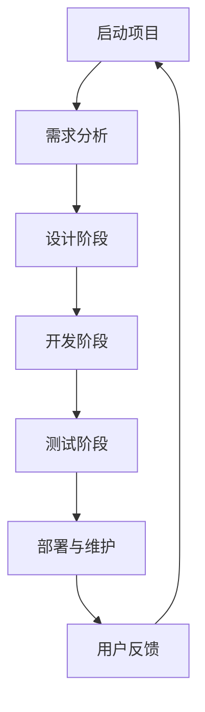

                 

# 敏捷开发在创业中的应用与实践

## 摘要

敏捷开发是一种灵活、迭代、渐进的软件开发方法，特别适合初创企业的快速响应市场变化和持续优化产品。本文将深入探讨敏捷开发的核心概念、其在创业中的应用场景、实战案例，以及未来的发展趋势与挑战。通过对比传统开发模式，分析敏捷开发的优势，我们旨在为创业团队提供一套实用、高效的开发方法论，帮助他们在激烈的市场竞争中脱颖而出。

## 关键词

敏捷开发、创业、迭代、用户反馈、持续交付、Scrum、Kanban、Scalability、Team Collaboration

## 1. 背景介绍

在快速变化的市场环境中，初创企业面临着前所未有的挑战和机遇。用户需求瞬息万变，市场竞争激烈，产品更新迭代速度加快。这种背景下，传统的瀑布式开发模式逐渐显现出其局限性。而敏捷开发以其灵活、迭代、渐进的特点，成为许多初创企业的首选。

### 传统开发模式与敏捷开发

传统开发模式，如瀑布式开发，通常遵循严格的阶段顺序，从需求分析到设计、开发、测试，再到上线，每个阶段都要完全完成后再进入下一个阶段。这种模式在项目初期可能较为有效，但随着项目的深入，变更和适应需求变化的能力逐渐减弱。瀑布模式的一个主要问题是，开发过程中的每个阶段都在独立进行，用户反馈往往滞后，导致最终产品与市场需求脱节。

相比之下，敏捷开发更强调团队的协作、用户参与和快速迭代。敏捷开发的核心价值观包括：个体和互动重于过程与工具、可工作的软件重于详尽的文档、客户合作重于合同谈判、响应变化重于遵循计划。敏捷开发常用的框架有Scrum、Kanban等，它们帮助团队更好地适应变化，持续交付有价值的软件。

### 创业环境与敏捷开发

创业企业通常资源有限，时间紧迫，市场需求变化快，这些特点使得敏捷开发成为创业团队的最佳选择。敏捷开发可以帮助团队快速响应市场变化，通过持续交付和用户反馈，不断优化产品，降低市场风险。此外，敏捷开发强调团队协作，有助于提高团队的效率和创新能力，这是创业成功的关键因素之一。

## 2. 核心概念与联系

### 敏捷开发的基本原理

敏捷开发的核心是快速迭代和持续交付。通过将开发过程划分为多个短期迭代（通常为2-4周），团队可以快速构建、测试和交付可工作的软件。每个迭代结束时，团队都会进行回顾和反思，以改进下一个迭代的过程。

#### 敏捷开发的核心理念

1. **用户参与**：用户在整个开发过程中积极参与，确保产品符合市场需求。
2. **迭代开发**：通过短期迭代，团队可以快速构建和交付产品。
3. **持续交付**：产品在开发过程中持续交付，确保及时满足用户需求。
4. **团队协作**：团队内部高度协作，提高工作效率和创新能力。

### 敏捷开发常用的框架

1. **Scrum**：Scrum是一种迭代式增量软件开发过程管理框架，它通过角色、会议、文档和 artifacts 来确保团队的协作和持续交付。
    - **角色**：Product Owner（产品负责人）、Scrum Master（Scrum主管）和开发团队。
    - **会议**：每日站立会议、冲刺规划会议、冲刺评审会议和回顾会议。
    - **文档**：产品待办列表、冲刺待办列表、燃尽图和用户故事。
2. **Kanban**：Kanban是一种可视化工作流程的框架，通过限制在流程中的工作项数量，提高团队的效率。
    - **工作流程**：从“待办”到“进行中”再到“待测试”和“已完成”。
    - **看板**：物理或虚拟的看板板，用于跟踪工作流程。

### 敏捷开发的联系

敏捷开发不仅是一种开发方法，更是一种文化和价值观。它要求团队紧密协作、持续学习和不断改进。敏捷开发与其他软件开发方法（如敏捷架构、敏捷测试等）相结合，可以进一步提升开发效率和产品质量。

### Mermaid 流程图



在敏捷开发中，用户反馈是一个持续的过程，它与项目启动阶段紧密相连，形成了一个闭环。这与传统开发模式中的线性流程形成了鲜明对比。

## 3. 核心算法原理 & 具体操作步骤

### 敏捷开发的核心算法原理

敏捷开发的核心算法原理在于如何高效地管理项目进度、资源分配和风险控制。以下是敏捷开发中几个关键步骤的具体操作：

#### 1. 需求分析

- **用户故事**：编写用户故事，将用户需求分解为可操作的任务。
- **优先级排序**：根据价值、复杂度和风险对用户故事进行优先级排序。
- **迭代计划**：将用户故事分配到不同的迭代中，制定迭代计划。

#### 2. 设计阶段

- **原型设计**：快速构建产品原型，获取用户反馈。
- **迭代设计**：根据用户反馈，对原型进行迭代改进。

#### 3. 开发阶段

- **每日站立会议**：团队每日开会，讨论当天的工作进展和问题。
- **任务分解**：将大任务分解为小任务，确保每个任务都有明确的负责人和截止日期。

#### 4. 测试阶段

- **自动化测试**：编写自动化测试脚本，确保代码质量。
- **用户验收测试**：与用户合作，验证产品的功能是否符合需求。

#### 5. 部署与维护

- **持续交付**：通过自动化部署工具，确保产品快速上线。
- **监控与维护**：监控产品运行状态，及时处理故障和用户反馈。

### 具体操作步骤示例

假设我们正在开发一款社交应用，以下是具体操作步骤：

1. **需求分析**：
    - 用户故事：“作为用户，我希望能够通过应用添加好友，与他们聊天。”
    - 优先级排序：将用户故事排序为最高优先级。

2. **设计阶段**：
    - 原型设计：使用Sketch或Figma等工具构建应用原型。
    - 迭代设计：根据用户反馈，改进原型设计。

3. **开发阶段**：
    - 每日站立会议：团队每日讨论开发进展和问题。
    - 任务分解：将开发任务分解为“用户注册”、“好友添加”和“聊天功能”等。

4. **测试阶段**：
    - 自动化测试：编写测试脚本，测试代码质量。
    - 用户验收测试：与用户合作，验证功能是否符合需求。

5. **部署与维护**：
    - 持续交付：使用Jenkins等工具自动化部署。
    - 监控与维护：监控应用运行状态，及时处理故障。

## 4. 数学模型和公式 & 详细讲解 & 举例说明

### 敏捷开发的数学模型

敏捷开发中的数学模型主要用于估算工作量、制定迭代计划和评估团队绩效。以下是几个关键数学模型的详细讲解和示例。

#### 1. 工作量估算

工作量估算是指预测完成一个任务所需的时间。常用的估算方法有：

- **三点估算法**：根据乐观、悲观和最可能的时间估算，计算平均值作为工作量估算。
  \[ E = \frac{O + 4M + P}{6} \]
  其中，\( O \) 是乐观时间，\( M \) 是最可能时间，\( P \) 是悲观时间。

- **斐波那契数列**：使用斐波那契数列进行时间估算，以应对不确定性和风险。

#### 2. 迭代计划

迭代计划是指根据工作量估算和团队资源，制定每个迭代的目标和任务。常用的迭代计划方法有：

- **S曲线**：根据工作量估算，绘制S曲线，确定每个迭代的工作量分布。
- **迭代时间盒**：将整个项目分为多个迭代，每个迭代的时间盒固定，确保每个迭代都能交付可工作的软件。

#### 3. 团队绩效评估

团队绩效评估是指评估团队在每个迭代中的表现。常用的评估方法有：

- **敏捷看板**：使用看板可视化工作流程，评估团队的工作效率和进度。
- **燃尽图**：通过燃尽图，评估团队在每个迭代中的工作量完成情况。

### 示例

假设我们正在估算一个任务的工作量，使用三点估算法进行估算：

- **乐观时间（O）**：3天
- **最可能时间（M）**：5天
- **悲观时间（P）**：7天

代入公式计算：

\[ E = \frac{3 + 4 \times 5 + 7}{6} = 5 \]

因此，该任务的工作量估算为5天。

### 迭代计划

假设我们有一个项目，总工作量为100个故事点。我们将项目分为4个迭代，每个迭代的时间盒为2周。

- **迭代1**：计划完成25个故事点。
- **迭代2**：计划完成25个故事点。
- **迭代3**：计划完成25个故事点。
- **迭代4**：计划完成25个故事点。

通过S曲线，我们可以确定每个迭代的工作量分布：

- **迭代1**：工作量分布为0-25个故事点。
- **迭代2**：工作量分布为25-50个故事点。
- **迭代3**：工作量分布为50-75个故事点。
- **迭代4**：工作量分布为75-100个故事点。

### 团队绩效评估

假设我们在迭代1中完成了23个故事点，迭代2中完成了27个故事点，迭代3中完成了25个故事点，迭代4中完成了24个故事点。

- **敏捷看板**：通过看板，我们可以看到团队在每个迭代中的进度和瓶颈，及时调整计划和资源。
- **燃尽图**：燃尽图显示团队在每个迭代中的工作量完成情况，有助于评估团队的整体绩效。

## 5. 项目实战：代码实际案例和详细解释说明

### 5.1 开发环境搭建

在开始实际案例之前，我们需要搭建一个开发环境。以下是一个基于Python的敏捷开发环境的搭建步骤：

1. 安装Python：从Python官网下载并安装Python 3.x版本。
2. 安装IDE：选择一个适合自己的IDE，如PyCharm、VSCode等。
3. 安装依赖：使用pip工具安装项目所需的依赖，如requests、Flask等。

### 5.2 源代码详细实现和代码解读

以下是使用Flask框架实现的简单社交应用案例。代码分为三个部分：用户注册、好友添加和聊天功能。

#### 用户注册

```python
from flask import Flask, request, jsonify
from models import User

app = Flask(__name__)

@app.route('/register', methods=['POST'])
def register():
    username = request.form['username']
    password = request.form['password']
    
    # 验证用户名和密码是否符合要求
    if not username or not password:
        return jsonify({'error': '用户名或密码不能为空'})

    # 创建用户并保存到数据库
    user = User(username=username, password=password)
    user.save()

    return jsonify({'message': '注册成功'})

```

#### 好友添加

```python
@app.route('/add_friend', methods=['POST'])
def add_friend():
    user_id = request.form['user_id']
    friend_id = request.form['friend_id']
    
    # 验证用户和好友是否存在
    user = User.get_by_id(user_id)
    friend = User.get_by_id(friend_id)
    
    if not user or not friend:
        return jsonify({'error': '用户或好友不存在'})

    # 添加好友
    user.add_friend(friend)
    friend.add_friend(user)

    return jsonify({'message': '添加好友成功'})

```

#### 聊天功能

```python
@app.route('/chat', methods=['GET'])
def chat():
    user_id = request.args.get('user_id')
    friend_id = request.args.get('friend_id')
    
    # 获取用户和好友的消息
    messages = Message.get_messages(user_id, friend_id)
    
    return jsonify({'messages': messages})

```

### 5.3 代码解读与分析

以上代码实现了一个简单的社交应用，包括用户注册、好友添加和聊天功能。以下是代码的详细解读和分析：

1. **用户注册**：
   - 使用Flask框架创建一个基于HTTP的Web应用。
   - 接收POST请求，获取用户名和密码。
   - 验证用户名和密码是否符合要求。
   - 创建用户对象，并将其保存到数据库。

2. **好友添加**：
   - 接收POST请求，获取用户ID和好友ID。
   - 验证用户和好友是否存在。
   - 添加好友到用户对象，并更新数据库。

3. **聊天功能**：
   - 接收GET请求，获取用户ID和好友ID。
   - 从数据库获取用户和好友的消息。
   - 返回消息列表。

通过以上代码，我们可以看到敏捷开发在实际项目中的应用。代码结构清晰，功能模块化，便于维护和扩展。同时，通过用户故事和迭代计划，我们能够快速构建和交付有价值的软件。

## 6. 实际应用场景

敏捷开发在创业中的实际应用场景广泛，以下是一些常见场景：

### 1. 产品原型快速迭代

在创业初期，产品原型通常需要快速迭代和优化。敏捷开发通过用户参与和持续迭代，帮助团队快速获取用户反馈，及时调整产品方向。

### 2. 应对市场需求变化

市场需求变化快是创业企业的常见问题。敏捷开发通过迭代和持续交付，使团队能够快速适应市场变化，降低市场风险。

### 3. 跨部门协作

敏捷开发强调团队协作，有助于打破部门壁垒，促进跨部门沟通和合作，提高开发效率。

### 4. 缩短产品上市时间

敏捷开发通过快速迭代和持续交付，缩短产品上市时间，使团队能够更快地占领市场。

### 5. 提升用户满意度

敏捷开发注重用户参与和反馈，使产品更符合用户需求，提高用户满意度。

## 7. 工具和资源推荐

### 7.1 学习资源推荐

1. **书籍**：
    - 《敏捷开发：原则、实践与模式》
    - 《Scrum敏捷开发实践指南》
2. **论文**：
    - 《敏捷开发：一种新的软件开发方法》
    - 《敏捷开发中的用户参与和反馈》
3. **博客**：
    - 精益开发博客（https://www精益开发.com/）
    - 敏捷开发实践博客（https://www敏捷开发实践.com/）
4. **网站**：
    - 敏捷联盟（https://www.agilealliance.org/）
    - Scrum官方网站（https://www.scrum.org/）

### 7.2 开发工具框架推荐

1. **开发工具**：
    - PyCharm（Python开发）
    - VSCode（多语言开发）
2. **项目管理工具**：
    - JIRA（敏捷项目管理）
    - Trello（任务管理）
3. **自动化部署工具**：
    - Jenkins（持续集成）
    - Docker（容器化部署）

### 7.3 相关论文著作推荐

1. **论文**：
    - 《敏捷开发中的风险管理》
    - 《敏捷开发与传统开发模式的比较研究》
2. **著作**：
    - 《敏捷架构：企业级应用的敏捷设计与开发》
    - 《敏捷测试：敏捷开发中的测试策略与实践》

## 8. 总结：未来发展趋势与挑战

### 发展趋势

1. **云计算和微服务的结合**：敏捷开发与云计算、微服务架构相结合，进一步提高了开发效率和可扩展性。
2. **人工智能的融入**：敏捷开发开始融入人工智能技术，通过数据分析和智能推荐，提高产品和开发过程的智能化水平。
3. **跨领域应用**：敏捷开发不仅应用于软件开发，还广泛应用于产品开发、项目管理和创业等领域。

### 挑战

1. **文化转变**：敏捷开发要求团队和组织的文化发生转变，从传统的瀑布式开发模式转向更加灵活的敏捷方式。
2. **技能提升**：团队成员需要提升敏捷开发的技能和知识，以应对快速变化的市场需求。
3. **工具集成**：如何高效地集成和管理各种敏捷开发工具和框架，是创业团队面临的挑战。

## 9. 附录：常见问题与解答

### 1. 敏捷开发与传统开发的主要区别是什么？

- **区别**：
  - **开发模式**：传统开发模式通常遵循严格的阶段顺序，敏捷开发强调迭代和持续交付。
  - **用户参与**：传统开发中用户参与较少，敏捷开发中用户参与贯穿整个开发过程。
  - **团队协作**：传统开发中团队协作较弱，敏捷开发强调团队合作和协作。

### 2. 敏捷开发的主要优势有哪些？

- **优势**：
  - **快速响应市场需求**：通过迭代和持续交付，敏捷开发能够更快地响应市场变化。
  - **提高开发效率**：敏捷开发强调团队合作和任务分解，提高开发效率。
  - **降低市场风险**：通过持续交付和用户反馈，降低产品与市场需求脱节的风险。

### 3. 敏捷开发常用的框架有哪些？

- **框架**：
  - **Scrum**：一种迭代式增量软件开发过程管理框架。
  - **Kanban**：一种可视化工作流程的框架。

## 10. 扩展阅读 & 参考资料

1. **书籍**：
    - 《敏捷开发：原则、实践与模式》
    - 《Scrum敏捷开发实践指南》
2. **论文**：
    - 《敏捷开发：一种新的软件开发方法》
    - 《敏捷开发中的用户参与和反馈》
3. **网站**：
    - 敏捷联盟（https://www.agilealliance.org/）
    - Scrum官方网站（https://www.scrum.org/）
4. **博客**：
    - 精益开发博客（https://www精益开发.com/）
    - 敏捷开发实践博客（https://www敏捷开发实践.com/）

## 作者

**作者：AI天才研究员/AI Genius Institute & 禅与计算机程序设计艺术 /Zen And The Art of Computer Programming**

