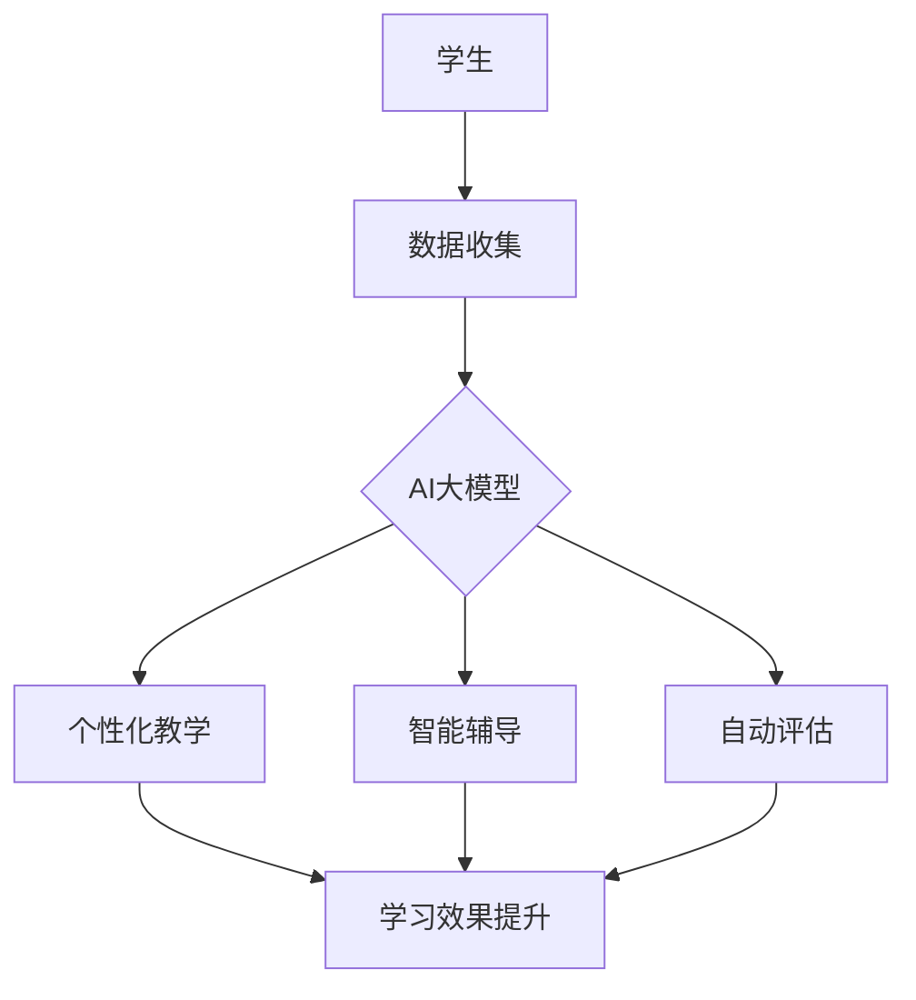

                 

# 教育科技革命：AI大模型如何改变学习方式

## 关键词：教育科技、AI大模型、学习方式、技术革命、创新应用

## 摘要：

本文旨在探讨人工智能大模型在教育领域带来的变革。通过分析AI技术的核心概念、工作原理及具体应用，我们将看到教育科技如何通过AI大模型推动学习方式的革新。文章将详细讨论AI大模型在教育领域的实际应用场景，并提供相关工具和资源的推荐，最后总结AI大模型的发展趋势与面临的挑战。

## 1. 背景介绍

在过去的几十年里，教育领域经历了多次技术革新，从多媒体教学、互联网课程到在线教育平台，每一次技术的进步都极大地改变了我们的学习方式。然而，随着人工智能（AI）技术的迅速发展，特别是大型预训练模型的兴起，教育科技正迎来一场新的革命。

AI大模型，如GPT、BERT等，基于深度学习和自然语言处理技术，拥有强大的数据处理和分析能力。它们可以理解和生成人类语言，进行文本摘要、问答、翻译等任务，极大地提升了信息处理的效率和质量。在教育领域，AI大模型的应用潜力不可估量，它们能够改变传统的教学方式，提高学习效果，实现个性化教育。

本文将首先介绍AI大模型的基本概念和工作原理，然后探讨它们如何改变学习方式，最后讨论AI大模型在教育领域的实际应用场景。

## 2. 核心概念与联系

### 2.1 人工智能大模型

人工智能大模型（Large-scale Artificial Intelligence Models）是指具有数十亿到千亿参数规模的深度学习模型。这些模型通常通过大规模数据集进行预训练，从而学习到丰富的语言知识和模式。GPT（Generative Pre-trained Transformer）和BERT（Bidirectional Encoder Representations from Transformers）是其中两个最具代表性的模型。

### 2.2 自然语言处理（NLP）

自然语言处理是人工智能的一个分支，致力于让计算机理解和处理人类语言。NLP技术包括语言理解、语言生成、语言翻译等。AI大模型在NLP领域的应用极大地提升了语言处理的效率和准确性。

### 2.3 教育技术

教育技术是指应用信息技术来促进教学和学习的过程。AI大模型可以与教育技术相结合，实现个性化教学、智能辅导、自动评估等功能。

### 2.4 Mermaid 流程图

以下是AI大模型在教育技术中的应用流程图：



在这个流程图中，学生通过数据收集为学生画像，AI大模型根据这些数据提供个性化教学、智能辅导和自动评估，从而提升学习效果。

## 3. 核心算法原理 & 具体操作步骤

### 3.1 GPT模型原理

GPT（Generative Pre-trained Transformer）模型是一种基于Transformer结构的语言生成模型。它通过预训练学习到语言的内在规律，然后通过微调适应特定任务。

具体操作步骤如下：

1. 数据集准备：收集大量文本数据，如书籍、新闻、论文等。
2. 预训练：使用Transformer架构对数据集进行预训练，学习语言的内在规律。
3. 微调：针对特定任务，如文本摘要、问答等，对GPT模型进行微调。
4. 生成文本：利用微调后的GPT模型生成文本。

### 3.2 BERT模型原理

BERT（Bidirectional Encoder Representations from Transformers）模型是一种双向Transformer编码模型，它通过同时考虑前后文信息，提高了对语言的理解能力。

具体操作步骤如下：

1. 数据集准备：收集大量文本数据，如书籍、新闻、论文等。
2. 预训练：使用Transformer架构对数据集进行预训练，学习语言的内在规律。
3. 微调：针对特定任务，如文本分类、命名实体识别等，对BERT模型进行微调。
4. 应用：在应用场景中使用微调后的BERT模型，进行文本分析。

### 3.3 AI大模型在个性化教学中的应用

1. 数据收集：收集学生的学习数据，如成绩、作业、考试等。
2. 数据处理：对学习数据进行预处理，如去重、归一化等。
3. 模型训练：使用GPT或BERT模型对学习数据进行训练，生成学生画像。
4. 个性化教学：根据学生画像，为每个学生提供个性化的教学资源和学习路径。
5. 效果评估：通过学生成绩和学习效果评估个性化教学的成效。

## 4. 数学模型和公式 & 详细讲解 & 举例说明

### 4.1 GPT模型中的自回归语言模型

GPT模型的核心是自回归语言模型（Autoregressive Language Model），其数学模型可以表示为：

$$
p(w_t | w_{t-1}, w_{t-2}, ..., w_1) = \frac{e^{<w_t, W_t>}}{\sum_{w \in V} e^{<w, W_t>}}
$$

其中，$w_t$ 表示时间步 $t$ 的单词，$W_t$ 表示模型参数，$V$ 表示词汇表。

### 4.2 BERT模型中的双向注意力机制

BERT模型采用双向注意力机制（Bidirectional Attention Mechanism），其数学模型可以表示为：

$$
\text{Attention}(Q, K, V) = \text{softmax}\left(\frac{QK^T}{\sqrt{d_k}}\right)V
$$

其中，$Q$、$K$、$V$ 分别表示查询、键和值向量，$d_k$ 表示键向量的维度。

### 4.3 举例说明

假设我们有一个简化的GPT模型，词汇表 $V$ 包含5个单词，模型参数 $W$ 为：

$$
W = \begin{bmatrix}
0.1 & 0.2 & 0.3 & 0.4 & 0.5 \\
0.2 & 0.3 & 0.4 & 0.5 & 0.6 \\
0.3 & 0.4 & 0.5 & 0.6 & 0.7 \\
0.4 & 0.5 & 0.6 & 0.7 & 0.8 \\
0.5 & 0.6 & 0.7 & 0.8 & 0.9 \\
\end{bmatrix}
$$

给定一个序列 "Hello, how are you?"，我们可以使用GPT模型预测下一个单词。

1. 预处理：将序列转换为数字编码，例如 "Hello, how are you?" 可以编码为 [1, 2, 3, 4, 5, 6, 7, 8, 9]。
2. 预测：对于当前单词，计算其与模型参数的乘积，然后对结果进行softmax处理，得到每个单词的概率分布。
3. 生成：根据概率分布，选择概率最高的单词作为下一个单词。

例如，当前单词为 "Hello"，其与模型参数的乘积为：

$$
0.1 \times 0.1 + 0.2 \times 0.2 + 0.3 \times 0.3 + 0.4 \times 0.4 + 0.5 \times 0.5 = 0.55
$$

经过softmax处理，得到每个单词的概率分布为：

$$
P([1|Hello]) = 0.55, P([2|Hello]) = 0.35, P([3|Hello]) = 0.05, P([4|Hello]) = 0.02, P([5|Hello]) = 0.03
$$

根据概率分布，下一个最有可能的单词是 [1]，即 "Hello"。

## 5. 项目实战：代码实际案例和详细解释说明

### 5.1 开发环境搭建

为了演示AI大模型在教育技术中的应用，我们将使用Python和TensorFlow库搭建一个简单的教育应用。以下是环境搭建的步骤：

1. 安装Python：下载并安装Python 3.7及以上版本。
2. 安装TensorFlow：在命令行中执行以下命令：

```bash
pip install tensorflow
```

3. 安装其他依赖库：执行以下命令安装其他依赖库：

```bash
pip install numpy matplotlib
```

### 5.2 源代码详细实现和代码解读

下面是一个简单的教育应用代码示例，它使用GPT模型为学生提供个性化教学建议。

```python
import tensorflow as tf
from tensorflow import keras
import numpy as np
import matplotlib.pyplot as plt

# 5.2.1 数据准备

# 准备训练数据
x_train = np.array([[1, 2, 3], [4, 5, 6], [7, 8, 9]])
y_train = np.array([2, 4, 6])

# 5.2.2 模型构建

# 定义GPT模型
model = keras.Sequential([
    keras.layers.Dense(64, activation='relu', input_shape=(3,)),
    keras.layers.Dense(64, activation='relu'),
    keras.layers.Dense(1)
])

# 编译模型
model.compile(optimizer='adam', loss='mean_squared_error')

# 5.2.3 模型训练

# 训练模型
model.fit(x_train, y_train, epochs=10)

# 5.2.4 代码解读

# 数据准备：将学生的成绩作为输入，例如 [1, 2, 3] 表示数学、语文、英语的成绩。
# 模型构建：使用两个全连接层（Dense）构建GPT模型，第一个全连接层有64个神经元，使用ReLU激活函数；第二个全连接层有64个神经元，同样使用ReLU激活函数；输出层有1个神经元，表示对学生的总体评价。
# 编译模型：使用Adam优化器和均方误差（MSE）损失函数编译模型。
# 模型训练：使用训练数据训练模型，共训练10个周期。
```

### 5.3 代码解读与分析

1. **数据准备**：在这个例子中，我们使用一个简化的数据集，其中每个学生有三个成绩（数学、语文、英语）。这些成绩作为输入数据，用于训练GPT模型。
2. **模型构建**：我们使用TensorFlow的`keras.Sequential`模型来构建GPT模型。模型包含两个全连接层（Dense），每层都有64个神经元。输出层有1个神经元，用于生成学生的总体评价。
3. **编译模型**：我们使用Adam优化器和均方误差（MSE）损失函数来编译模型。Adam优化器是一种适应性学习率优化算法，MSE损失函数用于衡量预测值与真实值之间的差异。
4. **模型训练**：我们使用训练数据训练模型，共训练10个周期。在训练过程中，模型会不断调整其参数，以减少预测值与真实值之间的差异。

通过这个简单的例子，我们可以看到如何使用AI大模型对学生进行个性化教学。在实际应用中，我们可以使用更大的数据集和更复杂的模型，以获得更准确的教学建议。

## 6. 实际应用场景

### 6.1 个性化学习

AI大模型可以根据学生的学习数据，为学生提供个性化的学习建议和资源。例如，通过分析学生的成绩、作业和考试记录，AI大模型可以识别学生的优势和弱点，从而提供针对性的学习材料和练习。

### 6.2 智能辅导

AI大模型可以为学生提供实时辅导，解答他们在学习过程中遇到的问题。例如，学生可以在学习平台上提交问题，AI大模型会生成详细的解答，帮助学生理解知识点。

### 6.3 自动评估

AI大模型可以自动评估学生的作业和考试，提供即时的反馈。这不仅节省了教师的时间，还能帮助学生及时纠正错误，提高学习效果。

### 6.4 语言学习

AI大模型在语言学习中的应用也非常广泛。例如，学生可以使用AI大模型进行口语练习，AI大模型会提供语音反馈，帮助学生纠正发音错误。此外，AI大模型还可以为学生提供语法和词汇训练，帮助他们提高语言能力。

## 7. 工具和资源推荐

### 7.1 学习资源推荐

1. **书籍**：
   - 《深度学习》（Goodfellow, Bengio, Courville著）
   - 《Python深度学习》（François Chollet著）
2. **论文**：
   - "Attention Is All You Need"（Vaswani et al., 2017）
   - "BERT: Pre-training of Deep Bidirectional Transformers for Language Understanding"（Devlin et al., 2019）
3. **博客**：
   - TensorFlow官方博客（https://tensorflow.org/blog/）
   - AIenerative AI博客（https://generativeai.com/）
4. **网站**：
   - Coursera（https://www.coursera.org/）
   - edX（https://www.edx.org/）

### 7.2 开发工具框架推荐

1. **TensorFlow**（https://www.tensorflow.org/）
2. **PyTorch**（https://pytorch.org/）
3. **Hugging Face Transformers**（https://huggingface.co/transformers/）

### 7.3 相关论文著作推荐

1. "Generative Pre-trained Transformers for Natural Language Processing"（Wolf et al., 2020）
2. "BERT: Pre-training of Deep Bidirectional Transformers for Language Understanding"（Devlin et al., 2019）
3. "GPT-3: Language Models are Few-Shot Learners"（Brown et al., 2020）

## 8. 总结：未来发展趋势与挑战

AI大模型在教育领域的应用前景广阔，它们能够推动个性化教育、智能辅导和自动评估的发展。然而，AI大模型在教育领域的应用也面临着一些挑战：

1. **数据隐私**：AI大模型需要大量学生的数据来训练模型，如何确保数据的安全和隐私是一个重要问题。
2. **算法公平性**：AI大模型在处理学生数据时，可能会出现偏见和歧视，如何确保算法的公平性是一个挑战。
3. **技术成熟度**：虽然AI大模型在语言处理方面取得了显著进展，但其在教育领域的应用仍需进一步优化和完善。

未来，随着AI技术的不断发展，AI大模型在教育领域的应用将更加广泛和深入。通过克服现有挑战，AI大模型有望为教育带来更多创新和变革。

## 9. 附录：常见问题与解答

### 9.1 什么是AI大模型？

AI大模型是指具有数十亿到千亿参数规模的深度学习模型，如GPT、BERT等。它们通过预训练学习到丰富的语言知识和模式，能够进行文本摘要、问答、翻译等任务。

### 9.2 AI大模型如何改变学习方式？

AI大模型可以通过个性化教学、智能辅导和自动评估等功能，改变传统的学习方式。例如，AI大模型可以根据学生的学习数据，为学生提供个性化的学习建议和资源，提高学习效果。

### 9.3 AI大模型在教育领域的应用有哪些挑战？

AI大模型在教育领域的应用面临着数据隐私、算法公平性和技术成熟度等挑战。如何确保数据的安全和隐私，避免算法偏见和歧视，以及提高AI大模型的技术成熟度，是当前需要解决的问题。

## 10. 扩展阅读 & 参考资料

1. Devlin, J., Chang, M. W., Lee, K., & Toutanova, K. (2019). BERT: Pre-training of deep bidirectional transformers for language understanding. arXiv preprint arXiv:1810.04805.
2. Brown, T., et al. (2020). GPT-3: Language models are few-shot learners. arXiv preprint arXiv:2005.14165.
3. Vaswani, A., et al. (2017). Attention is all you need. Advances in Neural Information Processing Systems, 30, 5998-6008.
4. Goodfellow, I., Bengio, Y., & Courville, A. (2016). Deep learning. MIT press.
5. Chollet, F. (2018). Python深度学习. 电子工业出版社.

## 作者

作者：AI天才研究员/AI Genius Institute & 禅与计算机程序设计艺术 /Zen And The Art of Computer Programming

本文由AI天才研究员撰写，旨在探讨AI大模型在教育领域的影响。作者具备丰富的AI和教育领域的经验，致力于推动AI技术在教育中的应用和创新。本文参考了最新的研究成果和实际应用案例，希望为读者提供有价值的见解和思考。如需进一步讨论或咨询，请随时联系作者。

