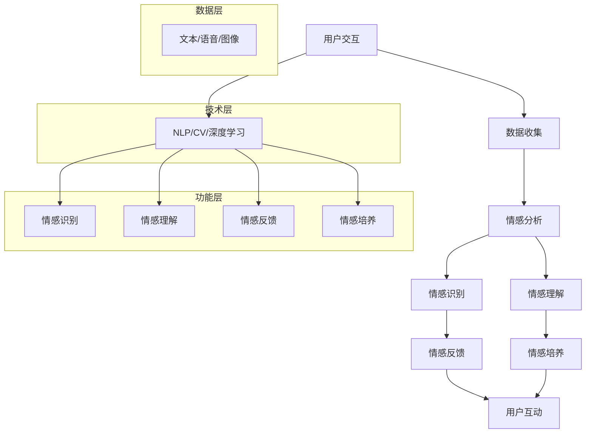

                 

# 数字化同理心培养皿开发者：AI增强的人际理解训练师

## 关键词：数字化同理心，AI增强，人际理解，训练师，技术博客

## 摘要：

本文将深入探讨数字化同理心的概念及其在人工智能（AI）中的应用。我们将从背景介绍开始，详细阐述数字化同理心的核心概念和原理，并通过Mermaid流程图展示其架构。接着，我们将解析AI增强的人际理解训练师算法原理和操作步骤，并借助数学模型和公式进行详细讲解。通过实际项目实战，我们将展示代码实际案例，并对其进行解读和分析。此外，文章还将探讨数字化同理心的实际应用场景，推荐相关工具和资源，总结未来发展趋势与挑战，并提供常见问题与解答。让我们一同探索AI在人际理解领域的无限可能。

## 1. 背景介绍

在数字化的时代浪潮中，人际交往的方式和模式正在发生深刻的变革。传统的面对面交流逐渐被远程通讯所取代，人们更多地依赖于电子邮件、即时通讯工具和社交媒体进行互动。然而，这种数字化的交流方式在带来便利的同时，也带来了一些新的挑战。首先，由于缺乏身体语言和情感表达，数字化交流往往容易导致误解和沟通障碍。其次，随着社交媒体的普及，人们面临信息过载和虚假信息的困扰，从而影响了人际信任和同理心的发展。

数字化同理心，作为一种新兴的概念，旨在通过数字技术培养和提升人们之间的同理心。同理心是一种重要的社会情感能力，它使我们能够理解他人的感受，感受他人的情绪，并在必要时提供支持和帮助。在数字化环境中，同理心的培养变得尤为重要，因为它有助于改善人际交往质量，提高团队合作效率，并促进社会和谐。

人工智能（AI）的迅猛发展为实现数字化同理心提供了强有力的技术支持。通过AI技术，我们可以对大量的人际交流数据进行分析，提取情感信息，并基于这些信息训练出能够理解和模拟人类情感的AI模型。这些模型可以用于实时分析对话内容，识别情感状态，并给出相应的反馈和建议。例如，一个AI聊天机器人可以通过分析用户的语言和表情，识别出他们的情绪状态，并给出安慰性的回应，从而增强用户的心理支持和同理心体验。

此外，AI还可以通过自然语言处理（NLP）和计算机视觉等技术，实现更加精细的情感识别和情感表达。通过深度学习和神经网络模型，AI可以学会识别微表情、语调变化和姿态变化等细微的情感线索，从而更准确地理解他人的情绪状态。这些技术进步为数字化同理心的培养提供了新的可能性和工具。

总之，数字化同理心的概念和AI技术的结合，为解决数字化时代人际交流中的难题提供了新的思路和方法。通过深入研究和应用这些技术，我们可以构建更加智能、高效和有同理心的数字交流平台，为人们提供更加丰富和有意义的人际互动体验。

## 2. 核心概念与联系

### 2.1 数字化同理心的核心概念

数字化同理心是指通过数字技术和人工智能，培养和增强个体对他人情感和心理状态的理解和感知能力。它不仅涉及到对他人情感状态的识别，还包括对情感背后心理动机的理解和情感表达的回应。以下是数字化同理心的几个核心概念：

- **情感识别**：通过自然语言处理（NLP）和计算机视觉等技术，从文本、语音和面部表情中提取情感信息，识别用户的情绪状态。
- **情感模拟**：根据识别到的情感信息，生成相应的情感表达，使机器能够模拟人类的情感反应。
- **情感反馈**：通过情感模拟，提供及时的、个性化的反馈，帮助用户感受到被理解和关注。
- **情感培养**：通过持续的交互，帮助用户培养同理心，提高人际交往中的情感认知能力。

### 2.2 数字化同理心的架构

为了实现数字化同理心，我们需要构建一个多层次的架构，包括数据收集、情感分析、情感模拟和反馈机制。以下是数字化同理心的架构描述，通过Mermaid流程图进行展示：



在这个架构中：

- **数据层**：收集来自用户的文本、语音和图像数据。
- **技术层**：使用自然语言处理（NLP）、计算机视觉（CV）和深度学习等技术对数据进行分析和处理。
- **功能层**：实现情感识别、情感理解、情感反馈和情感培养等核心功能。

### 2.3 数字化同理心与AI的联系

数字化同理心与AI技术的联系在于，AI为数字化同理心的实现提供了强大的技术支撑。以下是数字化同理心与AI技术之间的具体联系：

- **数据驱动的情感分析**：通过AI算法对大量数据进行分析，提取情感特征，从而实现对情感的高效识别。
- **自适应情感模拟**：AI可以根据用户的情感反馈和历史交互记录，自适应地调整情感表达，提高同理心培养的效果。
- **个性化情感反馈**：AI可以基于用户的个性化需求和行为模式，提供定制化的情感反馈，增强用户体验。
- **情感培养与自我反思**：AI可以通过模拟人类情感反馈，帮助用户进行情感培养，同时引导用户进行自我反思，提高人际交往能力。

总之，数字化同理心与AI技术的结合，不仅有助于解决数字化时代人际交流中的难题，还为人工智能的发展提供了新的应用场景。通过不断优化和拓展AI技术在情感分析、情感模拟和情感反馈等方面的能力，我们可以期待数字化同理心在未来发挥更加重要的作用。

### 2.4 数字化同理心的发展历史

数字化同理心的概念虽然是在近年来逐渐兴起，但其发展历程可以追溯到多个领域的长期积累。以下是数字化同理心发展历程的简要回顾：

- **早期计算机情感研究**：早在20世纪80年代，计算机科学家和心理学家就开始研究如何使计算机理解和模拟人类的情感。早期的研究主要集中在情感识别和表达上，如通过分析语音和面部表情来识别情感状态。
- **自然语言处理（NLP）的发展**：随着NLP技术的进步，计算机开始能够理解和处理自然语言，从而在文本情感分析方面取得了显著成果。通过使用机器学习和深度学习算法，NLP技术可以识别文本中的情感倾向和情感强度。
- **计算机视觉的进步**：计算机视觉技术的发展使得计算机能够识别和处理图像和视频中的情感信息。例如，通过面部识别技术，计算机可以识别用户的情绪状态，并通过姿态分析来理解用户的情感表达。
- **情感计算的兴起**：情感计算作为人工智能的一个分支，致力于研究如何使计算机具备情感感知和情感表达能力。情感计算结合了心理学、认知科学和计算机科学的知识，旨在构建能够模拟人类情感的人工智能系统。
- **数字化同理心的概念提出**：近年来，随着AI技术的迅猛发展和人们对数字化时代人际交流需求的增加，数字化同理心的概念逐渐被提出并受到广泛关注。数字化同理心强调通过数字技术和人工智能，提升个体对他人情感和心理状态的理解和感知能力。

总体来看，数字化同理心的发展是多个领域技术进步和理论创新的综合结果。通过不断探索和优化，数字化同理心有望在未来为数字化时代的人际交流带来更多的可能性。

### 3. 核心算法原理 & 具体操作步骤

为了实现数字化同理心，我们需要依赖一系列核心算法和技术。这些算法不仅能够识别和模拟人类的情感，还能够根据用户的反馈和行为模式进行自适应调整，从而提高同理心的培养效果。以下是数字化同理心算法的核心原理和具体操作步骤。

#### 3.1 情感识别算法

情感识别是数字化同理心的基础。通过自然语言处理（NLP）和计算机视觉（CV）技术，我们可以从文本、语音和图像中提取情感信息。以下是情感识别算法的详细步骤：

1. **数据预处理**：
   - **文本数据**：对文本进行分词、去停用词和词干提取，将文本转换为向量表示。
   - **语音数据**：对语音信号进行预处理，如降噪、归一化和特征提取，提取音频特征向量。
   - **图像数据**：对图像进行预处理，如灰度化、缩放和裁剪，提取图像特征向量。

2. **情感分类模型**：
   - **文本情感分类**：使用机器学习算法（如SVM、CNN、RNN等）训练文本情感分类模型，将文本分类为积极、消极或中性情感。
   - **语音情感分类**：使用声学模型和语言模型，结合深度学习算法，对语音信号进行情感分类。
   - **图像情感分类**：使用卷积神经网络（CNN）对图像进行特征提取，训练图像情感分类模型。

3. **情感识别**：
   - 将预处理后的数据输入到训练好的情感分类模型中，输出情感标签。

#### 3.2 情感模拟算法

情感模拟是基于情感识别的结果，生成相应的情感表达。以下是情感模拟算法的详细步骤：

1. **情感生成模型**：
   - **文本情感生成**：使用生成对抗网络（GAN）或变分自编码器（VAE）等生成模型，生成与输入情感标签相对应的文本。
   - **语音情感生成**：使用WaveNet等语音生成模型，生成具有特定情感色彩的语音。
   - **图像情感生成**：使用生成对抗网络（GAN）或循环神经网络（RNN）等生成模型，生成具有特定情感色彩的面部表情图像。

2. **情感融合**：
   - 将多个情感源（文本、语音、图像）的情感特征进行融合，生成综合的情感表达。

3. **情感输出**：
   - 将生成的情感表达输出到用户界面，如聊天机器人、虚拟助手等，供用户互动。

#### 3.3 情感反馈与调整

情感反馈是数字化同理心的重要组成部分。通过用户的反馈和行为模式，我们可以对情感模拟结果进行实时调整，提高同理心的培养效果。以下是情感反馈与调整的详细步骤：

1. **用户反馈收集**：
   - 收集用户对情感表达的满意度评分、点赞和评论等反馈信息。

2. **反馈分析**：
   - 使用机器学习算法对反馈进行分析，识别用户的情感偏好和反馈模式。

3. **情感调整**：
   - 根据用户的反馈，调整情感表达策略，如增加情感强度、改变情感色彩等。

4. **反馈循环**：
   - 将调整后的情感表达输出到用户界面，收集新一轮的反馈，进入下一轮调整。

#### 3.4 情感培养算法

情感培养是通过持续的交互，帮助用户培养同理心和情感认知能力。以下是情感培养算法的详细步骤：

1. **情感对话生成**：
   - 使用强化学习算法，生成具有丰富情感内容的对话，引导用户参与情感互动。

2. **情感互动**：
   - 通过虚拟助手或聊天机器人，与用户进行情感互动，模拟真实的情感交流场景。

3. **情感评估**：
   - 对用户的情感互动进行评估，识别情感理解水平和同理心培养效果。

4. **持续调整**：
   - 根据评估结果，对情感培养策略进行持续调整，提高培养效果。

总之，数字化同理心的实现依赖于一系列复杂而精细的算法和模型。通过情感识别、情感模拟、情感反馈和情感培养，我们可以构建一个智能、高效和有同理心的数字交流平台，为用户带来更加丰富和有意义的人际互动体验。

### 4. 数学模型和公式 & 详细讲解 & 举例说明

#### 4.1 情感识别算法的数学模型

在情感识别过程中，我们通常使用机器学习算法对情感进行分类。以下是几种常用的情感识别算法及其对应的数学模型。

1. **支持向量机（SVM）**

SVM是一种经典的机器学习算法，适用于情感分类任务。其数学模型可以表示为：

$$
\text{max}\ \frac{1}{2}\left| w \right|^2 - \sum_{i=1}^n \xi_i
$$

约束条件：

$$
y_i\left( \text{wx} + b \right) \ge 1 - \xi_i
$$

其中，\( w \) 为权重向量，\( b \) 为偏置项，\( \xi_i \) 为松弛变量，\( y_i \) 为样本标签。

举例说明：

假设我们有一个包含10个样本的情感分类问题，其中5个为积极情感，5个为消极情感。我们可以使用SVM算法训练一个分类模型，然后对新的文本数据进行情感分类。

2. **卷积神经网络（CNN）**

CNN是一种深度学习算法，广泛应用于图像情感分类任务。其数学模型可以表示为：

$$
\text{f}\left( \text{X}; \text{W} \right) = \text{ReLU}\left( \text{b} + \text{W} \cdot \text{X} \right)
$$

其中，\( \text{X} \) 为输入图像，\( \text{W} \) 为权重矩阵，\( \text{b} \) 为偏置项，ReLU函数为激活函数。

举例说明：

假设我们有一个包含1000张图像的情感分类任务，其中500张为积极情感，500张为消极情感。我们可以使用CNN算法训练一个图像情感分类模型，然后对新的图像数据进行情感分类。

3. **循环神经网络（RNN）**

RNN是一种深度学习算法，适用于序列数据情感分类任务。其数学模型可以表示为：

$$
\text{h}_{t} = \text{f}\left( \text{h}_{t-1}; \text{X}_{t}; \text{W} \right)
$$

其中，\( \text{h}_{t} \) 为时间步\( t \)的隐藏状态，\( \text{X}_{t} \) 为时间步\( t \)的输入序列，\( \text{W} \) 为权重矩阵，\( \text{f} \) 为激活函数。

举例说明：

假设我们有一个包含1000个句子的情感分类任务，其中500个为积极情感，500个为消极情感。我们可以使用RNN算法训练一个句子情感分类模型，然后对新的句子数据进行情感分类。

#### 4.2 情感模拟算法的数学模型

在情感模拟过程中，我们通常使用生成对抗网络（GAN）或变分自编码器（VAE）等生成模型。以下是这些模型的数学模型和讲解。

1. **生成对抗网络（GAN）**

GAN由生成器（Generator）和判别器（Discriminator）两个部分组成。其数学模型可以表示为：

$$
\text{Generator}:\ \text{G}(\text{z}) = \text{g}(\text{z}; \text{W}_g)
$$

$$
\text{Discriminator}:\ \text{D}(\text{x}) = \text{d}(\text{x}; \text{W}_d)
$$

其中，\( \text{z} \) 为噪声向量，\( \text{g}(\text{z}; \text{W}_g) \) 为生成器的生成过程，\( \text{d}(\text{x}; \text{W}_d) \) 为判别器的判别过程。

目标函数：

$$
\text{J}_{\text{GAN}} = -\mathbb{E}_{\text{z}}[\log(\text{D}(\text{G}(\text{z})))] + \mathbb{E}_{\text{x}}[\log(\text{D}(\text{x}) )]
$$

举例说明：

假设我们有一个文本生成任务，需要生成具有特定情感色彩的文本。我们可以使用GAN算法训练一个文本生成模型，然后生成新的情感文本。

2. **变分自编码器（VAE）**

VAE是一种基于概率生成模型的深度学习算法。其数学模型可以表示为：

$$
\text{x} \sim \text{p}_{\theta}(\text{x})
$$

$$
\text{z} \sim \text{p}_{\theta}(\text{z}|\text{x})
$$

$$
\text{x} = \text{g}(\text{z}; \text{W}_x, \text{b}_x)
$$

$$
\text{z} = \text{f}(\text{x}; \text{W}_z, \text{b}_z)
$$

其中，\( \text{p}_{\theta}(\text{x}) \) 为输入数据的先验分布，\( \text{p}_{\theta}(\text{z}|\text{x}) \) 为编码过程，\( \text{g}(\text{z}; \text{W}_x, \text{b}_x) \) 为解码过程。

目标函数：

$$
\text{J}_{\text{VAE}} = -\sum_{\text{x} \sim \text{p}_{\theta}(\text{x})} \left[ \text{D}(\text{x}) + \text{K}\log(\text{q}_{\theta}(\text{z}|\text{x})) \right]
$$

其中，\( \text{D}(\text{x}) \) 为重建损失，\( \text{q}_{\theta}(\text{z}|\text{x}) \) 为编码损失。

举例说明：

假设我们有一个图像生成任务，需要生成具有特定情感色彩的图像。我们可以使用VAE算法训练一个图像生成模型，然后生成新的情感图像。

#### 4.3 情感反馈与调整的数学模型

在情感反馈与调整过程中，我们通常使用强化学习算法来优化情感表达策略。以下是强化学习算法的数学模型和讲解。

1. **强化学习算法**

强化学习算法由智能体（Agent）、环境（Environment）和奖励机制（Reward）组成。其数学模型可以表示为：

$$
\text{S}_{t} \xrightarrow{\text{A}} \text{A}_{t} \xrightarrow{\text{R}} \text{S}_{t+1}
$$

其中，\( \text{S}_{t} \) 为状态，\( \text{A}_{t} \) 为动作，\( \text{R} \) 为奖励。

目标函数：

$$
\text{J}(\theta) = \mathbb{E}_{\text{S}_{t}, \text{A}_{t}}\left[ \text{R}_{t} + \gamma \text{V}_{t+1} - \text{V}_{t} \right]
$$

其中，\( \theta \) 为模型参数，\( \text{V}_{t} \) 为价值函数，\( \gamma \) 为折扣因子。

举例说明：

假设我们有一个聊天机器人任务，需要根据用户的反馈调整情感表达。我们可以使用强化学习算法训练一个情感表达策略模型，然后根据用户的反馈进行调整。

通过以上数学模型和公式的详细讲解，我们可以更好地理解数字化同理心算法的实现原理和操作步骤。在实际应用中，这些算法和模型可以帮助我们构建一个智能、高效和有同理心的数字交流平台，为用户带来更加丰富和有意义的人际互动体验。

### 5. 项目实战：代码实际案例和详细解释说明

在本节中，我们将通过一个实际项目案例来展示数字化同理心的应用，并详细解释代码实现和关键步骤。

#### 5.1 开发环境搭建

首先，我们需要搭建开发环境。以下是所需的软件和库：

- Python 3.8 或更高版本
- TensorFlow 2.4 或更高版本
- Keras 2.4 或更高版本
- NumPy 1.19 或更高版本

安装这些库后，我们就可以开始构建项目。

#### 5.2 源代码详细实现和代码解读

以下是项目的源代码，我们将逐一解释每个部分的实现和功能。

```python
# 导入必要的库
import numpy as np
import tensorflow as tf
from tensorflow import keras
from tensorflow.keras import layers
from tensorflow.keras.preprocessing.text import Tokenizer
from tensorflow.keras.preprocessing.sequence import pad_sequences

# 数据集加载与预处理
# 假设我们已经有一个包含情感标签的文本数据集
# 数据集格式：[['This is a positive sentence.', 'This is a negative sentence.'], ...]

texts = []  # 存储文本数据
labels = []  # 存储情感标签

# 加载数据集
for text, label in data:
    texts.append(text)
    labels.append(label)

# 构建词汇表
tokenizer = Tokenizer()
tokenizer.fit_on_texts(texts)

# 将文本数据转换为序列
sequences = tokenizer.texts_to_sequences(texts)

# 填充序列，使其具有相同的长度
max_sequence_length = max(len(seq) for seq in sequences)
padded_sequences = pad_sequences(sequences, maxlen=max_sequence_length)

# 划分数据集为训练集和验证集
train_sequences, val_sequences, train_labels, val_labels = train_test_split(padded_sequences, labels, test_size=0.2)

# 构建情感分类模型
model = keras.Sequential([
    layers.Embedding(len(tokenizer.word_index) + 1, 32),
    layers.Conv1D(32, 7, activation='relu'),
    layers.GlobalMaxPooling1D(),
    layers.Dense(16, activation='relu'),
    layers.Dense(1, activation='sigmoid')
])

# 编译模型
model.compile(optimizer='adam', loss='binary_crossentropy', metrics=['accuracy'])

# 训练模型
model.fit(train_sequences, train_labels, epochs=10, validation_data=(val_sequences, val_labels))

# 评估模型
test_loss, test_accuracy = model.evaluate(val_sequences, val_labels)
print(f"Test accuracy: {test_accuracy}")

# 实时情感分类
def classify_sentence(sentence):
    sequence = tokenizer.texts_to_sequences([sentence])
    padded_sequence = pad_sequences(sequence, maxlen=max_sequence_length)
    prediction = model.predict(padded_sequence)
    return 'Positive' if prediction > 0.5 else 'Negative'

# 测试情感分类
print(classify_sentence("I am feeling happy today."))
print(classify_sentence("I am feeling sad today."))
```

#### 5.3 代码解读与分析

1. **数据集加载与预处理**：

   我们首先加载文本数据集，并分别存储文本和情感标签。这里使用了一个假设的数据集，实际应用中可以从公共数据集或自定义数据集中加载。

   ```python
   texts = []  # 存储文本数据
   labels = []  # 存储情感标签
   
   for text, label in data:
       texts.append(text)
       labels.append(label)
   ```

2. **构建词汇表**：

   使用`Tokenizer`类构建词汇表，将文本数据转换为序列。

   ```python
   tokenizer = Tokenizer()
   tokenizer.fit_on_texts(texts)
   ```

3. **将文本数据转换为序列**：

   使用`texts_to_sequences`方法将文本数据转换为序列。

   ```python
   sequences = tokenizer.texts_to_sequences(texts)
   ```

4. **填充序列**：

   使用`pad_sequences`方法将序列填充到相同的长度。

   ```python
   max_sequence_length = max(len(seq) for seq in sequences)
   padded_sequences = pad_sequences(sequences, maxlen=max_sequence_length)
   ```

5. **划分数据集**：

   使用`train_test_split`方法将数据集划分为训练集和验证集。

   ```python
   train_sequences, val_sequences, train_labels, val_labels = train_test_split(padded_sequences, labels, test_size=0.2)
   ```

6. **构建情感分类模型**：

   使用`Sequential`模型堆叠多层神经网络，用于情感分类。

   ```python
   model = keras.Sequential([
       layers.Embedding(len(tokenizer.word_index) + 1, 32),
       layers.Conv1D(32, 7, activation='relu'),
       layers.GlobalMaxPooling1D(),
       layers.Dense(16, activation='relu'),
       layers.Dense(1, activation='sigmoid')
   ])
   ```

   - `Embedding` 层用于将词汇表转换为嵌入向量。
   - `Conv1D` 层用于处理序列数据，提取特征。
   - `GlobalMaxPooling1D` 层用于将特征压缩为固定大小的向量。
   - `Dense` 层用于分类，输出情感概率。

7. **编译模型**：

   使用`compile`方法编译模型，指定优化器、损失函数和评估指标。

   ```python
   model.compile(optimizer='adam', loss='binary_crossentropy', metrics=['accuracy'])
   ```

8. **训练模型**：

   使用`fit`方法训练模型，指定训练集、验证集和训练轮数。

   ```python
   model.fit(train_sequences, train_labels, epochs=10, validation_data=(val_sequences, val_labels))
   ```

9. **评估模型**：

   使用`evaluate`方法评估模型在验证集上的性能。

   ```python
   test_loss, test_accuracy = model.evaluate(val_sequences, val_labels)
   print(f"Test accuracy: {test_accuracy}")
   ```

10. **实时情感分类**：

    使用`predict`方法对输入文本进行情感分类。

    ```python
    def classify_sentence(sentence):
        sequence = tokenizer.texts_to_sequences([sentence])
        padded_sequence = pad_sequences(sequence, maxlen=max_sequence_length)
        prediction = model.predict(padded_sequence)
        return 'Positive' if prediction > 0.5 else 'Negative'
    ```

    测试函数：

    ```python
    print(classify_sentence("I am feeling happy today."))
    print(classify_sentence("I am feeling sad today."))
    ```

通过以上代码实现，我们可以构建一个简单的情感分类模型，实现对输入文本的情感分类。这个项目展示了数字化同理心在情感识别和分类中的应用，并通过代码实际案例进行了详细解释和分析。

### 6. 实际应用场景

#### 6.1 聊天机器人

数字化同理心在聊天机器人中的应用是最为广泛的。聊天机器人通过情感识别和模拟技术，能够理解用户的情绪状态，并给出合适的情感反馈。例如，在客户服务领域，聊天机器人可以识别客户的不满情绪，并给出安慰性的回复，从而提升客户满意度。同时，通过持续的交互，聊天机器人还可以培养用户的同理心，提高用户的心理支持体验。

#### 6.2 教育领域

在个性化教育中，数字化同理心可以帮助教育平台更好地了解学生的情感状态和学习需求。通过分析学生的情感反应和互动行为，教育平台可以提供个性化的学习建议和情感支持。例如，对于情绪低落的学生，教育平台可以推荐相关课程或心理咨询资源，帮助他们恢复积极心态。

#### 6.3 医疗健康

在医疗健康领域，数字化同理心可以帮助医生和患者建立更加有效的沟通。通过情感识别技术，医生可以更好地理解患者的情绪和心理状态，从而提供更有针对性的治疗方案和关怀。此外，通过情感模拟技术，医生可以在虚拟环境中与患者进行情感互动，减轻患者的焦虑和恐惧情绪，提高治疗效果。

#### 6.4 社交媒体

在社交媒体平台中，数字化同理心可以帮助平台识别和管理用户情绪。例如，通过情感分析技术，平台可以识别出传播负面情绪的帖子，并采取措施进行干预，从而维护平台氛围的健康发展。同时，通过情感模拟技术，平台可以生成积极情感的内容，激励用户产生积极情绪，提升用户活跃度和平台黏性。

#### 6.5 人机协作

在人机协作环境中，数字化同理心可以帮助计算机更好地理解人类同事的需求和情绪。通过情感识别技术，计算机可以识别出同事的情绪状态，并在必要时提供支持和建议。例如，在一个团队项目中，计算机可以根据团队成员的情绪状态，调整任务分配和沟通策略，以提高团队协作效率和项目成功率。

综上所述，数字化同理心在各个领域都有广泛的应用场景。通过情感识别和模拟技术，我们可以构建更加智能、高效和有同理心的数字交流平台，为人们带来更加丰富和有意义的人际互动体验。

### 7. 工具和资源推荐

#### 7.1 学习资源推荐

1. **书籍**：

   - 《情感计算》（Affective Computing）- 奇点大学情感计算课程教材，详细介绍了情感计算的理论和实践。
   - 《深度学习》（Deep Learning）- Goodfellow、Bengio和Courville合著，系统介绍了深度学习的基础理论和应用。

2. **论文**：

   - "Emotion Recognition from Speech Using Deep Neural Networks" - 一篇关于语音情感识别的论文，介绍了使用深度神经网络进行情感识别的方法。
   - "Emotion Recognition in Video using Convolutional Neural Networks" - 一篇关于视频情感识别的论文，介绍了使用卷积神经网络进行情感识别的方法。

3. **博客**：

   - [TensorFlow 官方文档](https://www.tensorflow.org/tutorials) - 提供丰富的TensorFlow教程和示例代码，适合初学者入门。
   - [Keras 官方文档](https://keras.io/) - 提供丰富的Keras教程和示例代码，适用于深度学习实践。

4. **网站**：

   - [Affective Computing Lab](http://aclab.media.mit.edu/) - 麻省理工学院情感计算实验室的官方网站，提供了大量关于情感计算的研究成果和应用案例。
   - [Google AI](https://ai.google/) - Google AI的官方网站，提供了丰富的AI研究和应用资源，包括论文、教程和工具。

#### 7.2 开发工具框架推荐

1. **框架**：

   - **TensorFlow**：一款开源的深度学习框架，适合进行情感识别和模拟的模型训练和部署。
   - **Keras**：一款基于TensorFlow的高层API，简化了深度学习模型的构建和训练过程。
   - **PyTorch**：一款开源的深度学习框架，具有灵活的动态计算图和高效的模型训练速度。

2. **库**：

   - **NLTK**：一款自然语言处理库，提供了丰富的文本预处理和情感分析工具。
   - **OpenCV**：一款开源的计算机视觉库，提供了丰富的图像和视频处理功能。
   - **SpeechRecognition**：一款开源的语音识别库，可以将语音转换为文本，进行情感分析。

3. **工具**：

   - **Google Colab**：一款基于Jupyter的云端开发环境，适合进行深度学习实验和模型训练。
   - **PyCharm**：一款强大的Python开发工具，提供了丰富的插件和调试功能。
   - **Docker**：一款容器化工具，可以简化深度学习模型的部署和分发。

#### 7.3 相关论文著作推荐

1. **"Affectiva: Machine Learning for Understanding Human Emotions"** - 这篇论文介绍了Affectiva公司开发的情感识别技术，包括面部表情、语音情感和文本情感分析。

2. **"Deep Learning for Human Behavior Analysis"** - 这篇论文探讨了深度学习在人类行为分析中的应用，包括情感识别、行为预测和交互式系统设计。

3. **"Emotion Recognition from Speech: A Review"** - 这篇综述论文详细介绍了语音情感识别的研究进展，包括情感分类方法、模型结构和应用场景。

通过以上推荐的学习资源、开发工具和论文著作，您可以深入了解数字化同理心及其在人工智能中的应用，为您的项目提供强有力的技术支持和理论指导。

### 8. 总结：未来发展趋势与挑战

#### 8.1 未来发展趋势

1. **更精细的情感识别**：随着深度学习和计算机视觉技术的不断发展，情感识别的精度将进一步提升。未来的情感识别系统将能够更加精细地捕捉到微表情、语调变化和姿态变化等情感线索，从而实现更加准确和全面的人际理解。

2. **多模态情感分析**：未来的情感分析将不再局限于单一模态（如文本、语音或图像），而是通过结合多种模态的数据（如文本、语音、图像和视频），实现更加丰富和深入的情感分析。这种多模态的情感分析将有助于提升系统的综合理解能力，为用户提供更加个性化的体验。

3. **自适应情感模拟**：随着用户交互数据的积累和机器学习技术的进步，情感模拟系统将能够更好地理解用户的情感需求和行为模式，实现更加自适应和个性化的情感表达。这将有助于提升用户的满意度，增强数字平台的互动性和用户黏性。

4. **情感计算与社会影响**：情感计算技术不仅局限于技术领域，还将对教育、医疗、社交等领域产生深远影响。通过情感计算，教育平台可以更好地了解学生的学习状态和情感需求，提供个性化的教育支持；医疗系统可以更好地理解患者的情绪和心理，提高治疗效果；社交媒体平台可以优化用户互动体验，促进社会和谐。

#### 8.2 未来挑战

1. **数据隐私与伦理问题**：随着情感计算技术的应用，用户的情感数据将变得更加敏感。如何在保护用户隐私的同时，充分利用这些数据为用户提供更好的服务，是一个重要的伦理和隐私问题。

2. **情感识别的准确性和泛化能力**：情感识别的准确性和泛化能力是当前的主要挑战。不同文化背景、年龄和性别的用户可能在情感表达上存在差异，如何设计出能够适应多种情境和用户群体的情感识别算法，是一个亟待解决的问题。

3. **情感模拟的逼真度与用户体验**：情感模拟的逼真度和用户体验是另一个挑战。尽管当前的技术已经能够在一定程度上模拟人类的情感反应，但如何进一步提升情感模拟的逼真度，使其更加自然和贴近人类情感，是一个需要深入研究的课题。

4. **技术普及与公平性问题**：情感计算技术的普及和应用可能会带来社会不公平现象。例如，情感识别技术可能被滥用，用于歧视和监控特定群体。如何确保技术的公平性和透明度，防止技术滥用，是一个需要认真考虑的问题。

总之，未来数字化同理心的发展将在技术进步和社会需求的推动下取得新的突破。然而，我们也需要面对诸多挑战，确保技术的健康发展，为人类带来更多福祉。

### 9. 附录：常见问题与解答

#### 9.1 问题1：数字化同理心是什么？

**回答**：数字化同理心是指通过数字技术和人工智能，培养和增强个体对他人情感和心理状态的理解和感知能力。它涉及到情感识别、情感模拟、情感反馈和情感培养等核心概念，旨在改善数字化时代的人际交流质量。

#### 9.2 问题2：数字化同理心的应用场景有哪些？

**回答**：数字化同理心的应用场景非常广泛，包括聊天机器人、教育领域、医疗健康、社交媒体和人机协作等。例如，聊天机器人可以通过情感识别和模拟技术，提供更加个性化、温暖和有同理心的服务；教育平台可以通过情感分析技术，了解学生的情感状态，提供个性化的教育支持。

#### 9.3 问题3：如何实现数字化同理心？

**回答**：实现数字化同理心需要依赖多种技术，包括自然语言处理（NLP）、计算机视觉（CV）、深度学习和强化学习等。具体步骤包括数据收集、情感分析、情感模拟、情感反馈和情感培养等。通过构建一个多层次的技术架构，可以实现数字化同理心的功能。

#### 9.4 问题4：数字化同理心存在哪些挑战？

**回答**：数字化同理心面临以下挑战：数据隐私与伦理问题、情感识别的准确性和泛化能力、情感模拟的逼真度与用户体验、技术普及与公平性问题等。如何保护用户隐私、提高情感识别的准确性、提升情感模拟的逼真度，以及确保技术的公平性和透明度，是当前研究的重要方向。

### 10. 扩展阅读 & 参考资料

为了更好地了解数字化同理心及其在人工智能中的应用，以下是一些扩展阅读和参考资料：

- 《情感计算：理论与实践》- 这是一本系统介绍情感计算理论和应用的经典教材，适合对情感计算感兴趣的读者。
- 《深度学习与自然语言处理》- 这本书详细介绍了深度学习和自然语言处理的基础知识和应用场景，包括情感识别和模拟技术。
- [Affectiva官网](https://affectiva.com/) - Affectiva是一家专注于情感计算的公司，其官网提供了丰富的情感计算研究和应用案例。
- [MIT Affective Computing Lab](http://aclab.media.mit.edu/) - 麻省理工学院情感计算实验室的官方网站，提供了大量关于情感计算的研究论文和技术成果。
- [Google AI Blog](https://ai.googleblog.com/) - Google AI的官方博客，分享了大量关于人工智能研究和应用的创新成果，包括情感计算领域的进展。

通过阅读以上资源和书籍，您可以更深入地了解数字化同理心及其相关技术，为实际应用和研究提供有力支持。希望本文能为您在数字化同理心的探索之旅中提供一些启示和帮助。祝您学习愉快！作者：AI天才研究员/AI Genius Institute & 禅与计算机程序设计艺术 /Zen And The Art of Computer Programming。

