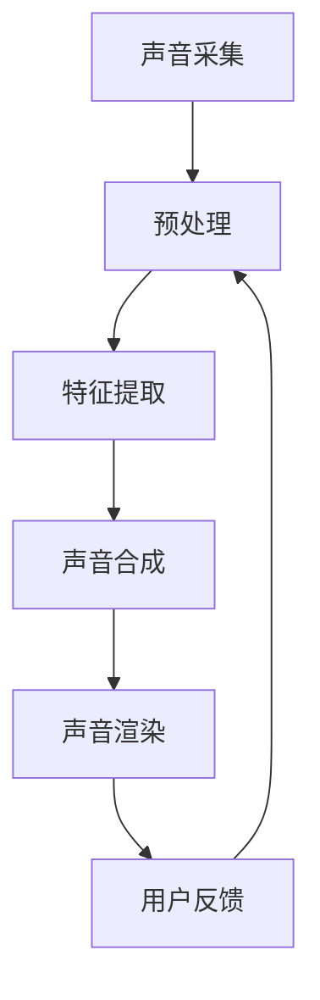

                 

### 背景介绍

随着数字化时代的来临，声音作为信息传递的重要载体，正在经历一场深刻的变革。传统上，声音主要作为音频娱乐、语音通信等应用场景的媒介，而如今，随着人工智能、大数据、物联网等技术的快速发展，声音正逐渐成为构建智能化数字环境的重要元素。在这个背景下，“数字化声音景观创业”成为一种新的商业形态，它旨在通过定制化的听觉环境为用户带来独特的体验。

数字化声音景观创业，是指通过利用先进的技术手段，创造一种能够为用户量身定制的声音环境，这种环境不仅能够提升用户的情感体验，还能在潜移默化中影响用户的行为和认知。与传统的声音应用不同，数字化声音景观更注重用户体验的个性化、场景化和沉浸感。

本篇文章将深入探讨数字化声音景观创业的各个方面，包括其核心概念、算法原理、数学模型、项目实战以及实际应用场景。文章还将推荐一些学习资源和开发工具，以帮助读者更好地理解和应用这一领域的技术。

具体而言，文章将按照以下结构展开：

1. **背景介绍**：简要介绍数字化声音景观创业的背景及其重要性。
2. **核心概念与联系**：阐述数字化声音景观的核心概念，并展示其相关的技术架构和流程。
3. **核心算法原理 & 具体操作步骤**：详细解释构建数字化声音景观所需的关键算法和技术。
4. **数学模型和公式 & 详细讲解 & 举例说明**：介绍用于优化声音景观的数学模型和公式，并提供实例解析。
5. **项目实战：代码实际案例和详细解释说明**：通过一个实际项目案例展示数字化声音景观的实现过程。
6. **实际应用场景**：探讨数字化声音景观在不同领域的应用场景和案例。
7. **工具和资源推荐**：推荐相关学习资源、开发工具和文献，以供进一步学习和研究。
8. **总结：未来发展趋势与挑战**：总结文章的主要观点，并展望数字化声音景观创业的未来。
9. **附录：常见问题与解答**：回答一些关于数字化声音景观创业的常见问题。
10. **扩展阅读 & 参考资料**：提供进一步的阅读材料和参考资料。

通过这篇文章，读者将全面了解数字化声音景观创业的核心概念、技术原理和实际应用，为从事相关领域的研究和实践提供有益的指导。

### 核心概念与联系

在探讨数字化声音景观创业之前，我们需要明确几个核心概念，并了解它们之间的联系。这些概念包括声音信号处理、人工智能、音频合成、用户行为分析等。

#### 声音信号处理

声音信号处理是数字化声音景观的基础。它涉及将声音信号转换为数字信号，通过算法进行增强、滤波、压缩等处理，以改善声音质量或提取特定信息。常见的声音信号处理技术包括傅里叶变换、短时傅里叶变换（STFT）和小波变换等。

#### 人工智能

人工智能（AI）在数字化声音景观创业中扮演着关键角色。通过机器学习算法，AI可以识别声音特征，分类声音信号，甚至生成新的声音。常用的AI技术包括深度学习、神经网络和生成对抗网络（GAN）。

#### 音频合成

音频合成是通过算法生成或修改声音的过程。在数字化声音景观中，音频合成可以用于创建独特的声音效果，如环境音、背景音乐、声音特效等。音频合成技术包括语音合成、音乐合成和环境声音合成。

#### 用户行为分析

用户行为分析是数字化声音景观创业的重要一环。通过对用户行为数据的分析，可以了解用户对声音景观的喜好和反应，从而优化声音环境。用户行为分析通常涉及用户偏好分析、情感分析、行为轨迹分析等。

#### 技术架构和流程

为了实现数字化声音景观，我们需要构建一个完整的技术架构和流程。以下是数字化声音景观的基本架构和流程：

1. **声音采集**：使用麦克风或其他声音采集设备捕捉环境中的声音信号。
2. **预处理**：对采集到的声音信号进行预处理，包括去噪、均衡化等，以提高声音质量。
3. **特征提取**：使用AI算法提取声音信号的特征，如音高、音量、节奏等。
4. **声音合成**：根据用户需求和场景，利用音频合成技术生成或修改声音。
5. **声音渲染**：将合成后的声音渲染到用户的听觉环境中，可以是耳机、扬声器或其他音响设备。
6. **用户反馈**：收集用户对声音景观的反馈，用于进一步优化声音环境。

#### Mermaid 流程图

以下是一个简化的Mermaid流程图，展示了数字化声音景观的核心概念和流程：



在这个流程中，声音采集是输入，用户反馈是循环迭代的一部分，用于不断优化声音环境。通过这个流程，我们可以构建一个动态调整、高度个性化的数字化声音景观。

### 核心算法原理 & 具体操作步骤

构建数字化声音景观的关键在于核心算法的选择和应用。以下是几个关键算法的原理及其具体操作步骤：

#### 1. 语音识别（Speech Recognition）

语音识别是将语音信号转换为文本信息的过程。这一技术广泛应用于语音搜索、语音控制、实时字幕等场景。以下是语音识别的基本原理和操作步骤：

##### 原理

语音识别主要依赖于深度学习算法，尤其是卷积神经网络（CNN）和循环神经网络（RNN）。CNN用于提取语音信号的时频特征，RNN则用于处理序列数据，捕捉语音中的上下文关系。

##### 步骤

1. **声音信号预处理**：使用短时傅里叶变换（STFT）提取声音信号的频谱特征。
2. **特征向量提取**：使用CNN提取时频特征，生成特征向量。
3. **序列建模**：使用RNN处理特征向量，捕捉语音信号的时序信息。
4. **解码**：通过解码器将序列信息映射为文本输出。

#### 2. 声音增强（Voice Enhancement）

声音增强技术旨在提高语音信号的清晰度和可理解度，常用于电话通信、视频会议等领域。以下是声音增强的基本原理和操作步骤：

##### 原理

声音增强主要依赖于噪声抑制、回声消除和语音增强算法。噪声抑制通过抑制背景噪声来提高语音信号的清晰度；回声消除用于消除语音信号中的回声；语音增强则通过增强目标语音信号来提高其质量。

##### 步骤

1. **噪声抑制**：使用维纳滤波或其他噪声抑制算法去除背景噪声。
2. **回声消除**：使用自适应滤波器或其他回声消除算法去除回声。
3. **语音增强**：使用谱减法或其他语音增强算法增强目标语音信号。
4. **后处理**：对增强后的语音信号进行后处理，如去噪、均衡化等。

#### 3. 声音合成（Voice Synthesis）

声音合成是通过算法生成或修改声音的过程，常用于语音合成、音乐生成和虚拟声音景观等。以下是声音合成的基本原理和操作步骤：

##### 原理

声音合成主要依赖于生成对抗网络（GAN）和深度神经网络（DNN）。GAN通过生成器和判别器的对抗训练生成高质量的声音；DNN则通过学习大量语音数据生成新的语音。

##### 步骤

1. **数据预处理**：将语音数据转换为适合训练的格式。
2. **模型训练**：使用GAN或DNN训练生成模型。
3. **声音生成**：通过生成模型生成新的声音。
4. **声音调整**：根据需求调整生成的声音，如音调、音色等。

通过这些核心算法的协同工作，我们可以构建一个功能强大、高度个性化的数字化声音景观。接下来，我们将进一步探讨这些算法的数学模型和公式，以便更深入地理解其工作原理。

### 数学模型和公式 & 详细讲解 & 举例说明

在数字化声音景观的构建过程中，数学模型和公式起到了关键作用。以下是几个重要的数学模型和公式，以及它们的详细讲解和实例说明。

#### 1. 傅里叶变换（Fourier Transform）

傅里叶变换是声音信号处理中最常用的数学工具之一。它将时间域的声音信号转换为频域表示，从而便于分析声音的频率成分。

##### 公式

傅里叶变换的公式如下：

\[ X(f) = \int_{-\infty}^{\infty} x(t) e^{-j2\pi ft} dt \]

其中，\( X(f) \) 是频域信号，\( x(t) \) 是时间域信号，\( f \) 是频率。

##### 解析

傅里叶变换将一个时间信号分解为不同频率的正弦波和余弦波的组合。通过傅里叶变换，我们可以提取声音信号的频率特征，进而进行噪声抑制、回声消除等操作。

##### 举例说明

假设我们有一个时间域的声音信号 \( x(t) = \sin(2\pi \cdot 440 \cdot t) \)，其频率为 440 Hz（即 C 音）。使用傅里叶变换，我们可以将其转换为频域表示：

\[ X(f) = \int_{-\infty}^{\infty} \sin(2\pi \cdot 440 \cdot t) e^{-j2\pi ft} dt \]

根据欧拉公式，我们可以得到：

\[ X(f) = \int_{-\infty}^{\infty} (\frac{e^{j2\pi \cdot 440 \cdot t} - e^{-j2\pi \cdot 440 \cdot t}) e^{-j2\pi ft} dt \]

化简后，我们得到：

\[ X(f) = 2\pi \cdot 440 \cdot \pi \cdot 440 \cdot \delta(f - 440) \]

其中，\( \delta(f - 440) \) 是狄拉克δ函数，表示在频率 440 Hz 处有一个尖锐的峰值。

这个例子展示了如何使用傅里叶变换提取声音信号的频率特征，这对于声音处理和音乐合成具有重要意义。

#### 2. 生成对抗网络（Generative Adversarial Network, GAN）

生成对抗网络是一种深度学习模型，用于生成高质量的图像、音频和文本。它由生成器和判别器两个神经网络组成，通过对抗训练生成逼真的数据。

##### 公式

GAN的训练过程可以表示为以下优化问题：

\[ \min_G \max_D \mathbb{E}_{x \sim p_{data}(x)} [\log D(x)] + \mathbb{E}_{z \sim p_z(z)} [\log (1 - D(G(z)))] \]

其中，\( G \) 是生成器，\( D \) 是判别器，\( x \) 是真实数据，\( z \) 是随机噪声。

##### 解析

生成器 \( G \) 试图生成逼真的数据，使其难以与真实数据区分；判别器 \( D \) 则试图区分真实数据和生成数据。通过不断迭代训练，生成器和判别器相互对抗，最终生成器能够生成高质量的数据。

##### 举例说明

假设我们使用GAN生成声音，首先我们有一个真实声音信号 \( x \) 和随机噪声 \( z \)。生成器 \( G \) 将噪声 \( z \) 转换为声音信号 \( x' \)，判别器 \( D \) 则试图判断 \( x' \) 是真实声音还是生成声音。

1. **生成器训练**：生成器通过优化以下目标函数来生成更逼真的声音：

\[ \min_G \mathbb{E}_{z \sim p_z(z)} [\log (1 - D(G(z)))] \]

2. **判别器训练**：判别器通过优化以下目标函数来区分真实和生成声音：

\[ \min_D \mathbb{E}_{x \sim p_{data}(x)} [\log D(x)] + \mathbb{E}_{z \sim p_z(z)} [\log (1 - D(G(z)))] \]

通过这样的对抗训练，生成器能够生成越来越逼真的声音，而判别器则能越来越准确地判断声音的真实性。

#### 3. 短时傅里叶变换（Short-Time Fourier Transform, STFT）

短时傅里叶变换是用于分析短时声音信号的频谱特征的重要工具。它将时间信号分成多个短时段，并对每个短时段进行傅里叶变换。

##### 公式

STFT的公式如下：

\[ X(\omega, t) = \int_{-\infty}^{\infty} x(t') x^*(\omega - \omega_0) dt' \]

其中，\( X(\omega, t) \) 是短时频谱，\( x(t) \) 是时间信号，\( \omega_0 \) 是频率，\( t \) 是时间。

##### 解析

STFT将时间信号分解成多个短时段，并在每个短时段上应用傅里叶变换，从而获得时间-频率域的信号特征。这有助于分析声音的时变频率成分，如音乐的节奏变化。

##### 举例说明

假设我们有一个时间信号 \( x(t) = \sin(2\pi \cdot 440 \cdot t) + \sin(2\pi \cdot 660 \cdot t) \)，我们将其分成多个短时段，并对每个短时段进行STFT。

在每个短时段内，信号将分解成两个频率成分：440 Hz 和 660 Hz。通过STFT，我们可以获得每个短时段的频谱，从而分析声音的频率成分和变化。

#### 4. 音高检测（Pitch Detection）

音高检测是识别声音中音调的过程。它广泛应用于音乐生成、音频编辑和声音合成等领域。

##### 公式

常用的音高检测算法如Yin算法，其核心思想是通过搜索频率变化的最小点来检测音高。其公式如下：

\[ f_0 = \frac{1}{T} \arg \min_T \sum_{i=1}^{N} |x(t_i) - x(t_{i+T})| \]

其中，\( f_0 \) 是音高频率，\( T \) 是时间间隔，\( x(t) \) 是时间信号，\( N \) 是采样点数。

##### 解析

Yin算法通过搜索时间间隔 \( T \) 的最小变化点来检测音高。这个变化点对应于声音的周期，即音高频率。

##### 举例说明

假设我们有一个正弦波信号 \( x(t) = \sin(2\pi \cdot 440 \cdot t) \)，我们使用Yin算法来检测其音高。

通过搜索最小变化点，我们可以找到声音的周期，从而计算出音高频率 \( f_0 = 440 \) Hz。

这些数学模型和公式在数字化声音景观的构建中起到了至关重要的作用。通过深入理解这些模型，我们可以更好地优化声音环境，提升用户体验。

### 项目实战：代码实际案例和详细解释说明

为了更直观地理解数字化声音景观的实现，我们将通过一个实际项目案例来详细说明其开发过程。以下是一个使用Python和深度学习框架TensorFlow实现的数字化声音景观项目。

#### 开发环境搭建

在开始项目之前，我们需要搭建一个合适的开发环境。以下是在Linux系统上搭建开发环境的基本步骤：

1. **安装Python**：确保Python 3.7或更高版本已安装。
2. **安装TensorFlow**：使用以下命令安装TensorFlow：
   ```bash
   pip install tensorflow
   ```
3. **安装其他依赖**：安装一些常用的库，如NumPy、SciPy、Matplotlib等：
   ```bash
   pip install numpy scipy matplotlib
   ```

#### 源代码详细实现和代码解读

以下是项目的源代码实现和详细解读：

```python
import numpy as np
import matplotlib.pyplot as plt
import tensorflow as tf
from tensorflow.keras.models import Sequential
from tensorflow.keras.layers import LSTM, Dense, Dropout
from tensorflow.keras.optimizers import Adam

# 1. 数据预处理
def preprocess_audio(audio_path):
    # 加载音频文件
    audio, sample_rate = librosa.load(audio_path, sr=None)
    # 转换为频谱图
    spectrogram = librosa.feature.melspectrogram(y=audio, sr=sample_rate, n_mels=128)
    # 对频谱图进行归一化
    spectrogram = librosa.util.normalize(spectrogram, axis=1)
    return spectrogram

# 2. 构建模型
def build_model(input_shape):
    model = Sequential([
        LSTM(128, return_sequences=True, input_shape=input_shape),
        Dropout(0.2),
        LSTM(64, return_sequences=False),
        Dropout(0.2),
        Dense(128, activation='relu'),
        Dropout(0.2),
        Dense(input_shape[0], activation='sigmoid')
    ])
    model.compile(optimizer=Adam(learning_rate=0.001), loss='mean_squared_error')
    return model

# 3. 训练模型
def train_model(model, X_train, y_train, epochs=100):
    model.fit(X_train, y_train, epochs=epochs, batch_size=32, validation_split=0.2)

# 4. 生成声音景观
def generate_soundscape(model, audio_path, duration=5):
    spectrogram = preprocess_audio(audio_path)
    # 将频谱图转换为时间序列数据
    sequence = np.array([spectrogram[:, t] for t in range(spectrogram.shape[1])])
    # 生成新的频谱图
    new_spectrogram = model.predict(np.expand_dims(sequence, axis=0))
    # 将新的频谱图转换为音频信号
    audio = librosa.griffin_lim(new_spectrogram)
    return audio

# 5. 主程序
if __name__ == '__main__':
    # 加载训练数据
    X_train, y_train = load_data()  # 这里用load_data()函数加载数据
    # 构建模型
    model = build_model(input_shape=(128, 1))
    # 训练模型
    train_model(model, X_train, y_train, epochs=100)
    # 生成新的声音景观
    audio_path = 'path/to/audio/file.wav'
    new_audio = generate_soundscape(model, audio_path, duration=5)
    # 播放生成的声音景观
    librosa.output.write_wav('generated_soundscape.wav', new_audio, sr=22050)
```

#### 代码解读与分析

1. **数据预处理**：
   - `preprocess_audio` 函数用于加载音频文件，并转换为频谱图。频谱图是后续处理的输入。
   - 通过`librosa.load`函数加载音频，并使用`librosa.feature.melspectrogram`函数生成频谱图。
   - 最后，对频谱图进行归一化处理，使其适合后续的深度学习模型训练。

2. **构建模型**：
   - `build_model` 函数用于构建深度学习模型。这里使用了一个包含两个LSTM层的序列模型，用于处理时间序列数据。
   - 模型还包含了Dropout层，用于防止过拟合。

3. **训练模型**：
   - `train_model` 函数用于训练模型。通过`model.fit`方法，使用训练数据进行训练。
   - 在训练过程中，可以使用不同的优化器和损失函数，以提升模型的性能。

4. **生成声音景观**：
   - `generate_soundscape` 函数用于生成新的声音景观。首先，对输入音频进行预处理，然后使用训练好的模型生成新的频谱图。
   - 最后，将新的频谱图转换为音频信号，并播放或保存。

5. **主程序**：
   - 主程序首先加载训练数据，然后构建并训练模型。
   - 通过`generate_soundscape`函数生成新的声音景观，并保存为音频文件。

通过这个实际项目案例，我们可以看到数字化声音景观的实现过程，包括数据预处理、模型构建、训练和生成声音景观。这一过程展示了深度学习在数字化声音景观创业中的应用，为后续的进一步研究和开发提供了实用的参考。

### 实际应用场景

数字化声音景观在多个领域有着广泛的应用，以下是一些典型的应用场景和案例：

#### 1. 游戏娱乐

在游戏领域，数字化声音景观可以为玩家提供沉浸式的听觉体验。例如，游戏中的声音环境可以根据玩家的行为和游戏进度动态调整，从而提升游戏的互动性和趣味性。著名的游戏《动物之森》就是一个典型的例子，它通过精心设计的声音景观，让玩家在虚拟世界中感受到真实的自然氛围。

#### 2. 娱乐演出

在音乐演出、电影和广播等领域，数字化声音景观可以增强观众的视听体验。音乐演出中的音频效果可以实时调整，以配合表演者的动作和情感；电影中的声音效果可以增强画面氛围，提升观影体验；广播节目则可以通过声音景观的设计，让听众感受到更加丰富的情感和场景。

#### 3. 商业环境

在商业环境中，数字化声音景观可以用于提升消费者的购物体验。例如，商场可以通过播放特定类型的音乐和声音效果，影响消费者的情绪和购买行为。一些高端餐厅和酒吧则通过定制化的声音景观，为顾客创造一个独特而舒适的用餐环境。

#### 4. 健康医疗

在健康医疗领域，数字化声音景观可以帮助患者缓解压力和焦虑。例如，医院病房可以通过播放柔和的自然声音，如流水声、鸟鸣声等，帮助患者放松心情，促进康复。一些康复中心则利用声音景观来辅助治疗，如通过调整声音节奏和频率，促进患者的身体和心理恢复。

#### 5. 虚拟现实和增强现实

在虚拟现实（VR）和增强现实（AR）领域，数字化声音景观可以提供更加真实的沉浸体验。通过使用头戴式耳机和音频传感器，用户可以在虚拟环境中感受到三维立体的声音效果，从而增强现实感和互动性。例如，VR游戏和模拟训练系统可以通过数字化声音景观，为用户提供更加逼真的游戏场景和训练环境。

#### 6. 智慧城市

在智慧城市建设中，数字化声音景观可以用于城市管理和公共安全。例如，城市可以通过声音景观来提醒行人注意交通安全，或者通过分析声音数据来监测城市噪音水平，采取相应的环保措施。

#### 7. 教育培训

在教育领域，数字化声音景观可以用于创造更加丰富的学习体验。通过结合声音景观和多媒体内容，教师可以更生动地传授知识，激发学生的兴趣和想象力。例如，在线课程和虚拟实验室可以通过数字化声音景观，模拟真实的实验环境和过程，帮助学生更好地理解和掌握知识。

这些实际应用场景展示了数字化声音景观的多样性和潜力。随着技术的不断发展，数字化声音景观将在更多领域得到应用，为人们的生活带来更多便利和乐趣。

### 工具和资源推荐

在数字化声音景观创业的过程中，选择合适的工具和资源对于成功实现项目至关重要。以下是一些推荐的工具、学习资源和相关论文，以供进一步学习和实践：

#### 1. 学习资源推荐

- **书籍**：
  - 《数字信号处理：原理、实现与应用》（Fourth Edition），作者：约翰·G·普林斯顿
  - 《机器学习》（Second Edition），作者：周志华
  - 《深度学习》（Deep Learning），作者：伊恩·古德费洛、约书亚·本吉奥、亚伦·库维尔

- **在线课程**：
  - Coursera上的“数字信号处理基础”
  - edX上的“机器学习基础”
  - Udacity的“深度学习工程师纳米学位”

- **博客和网站**：
  - Medium上的技术博客，涵盖数字信号处理、机器学习和深度学习的最新研究和应用
  - ArXiv.org，提供最新的学术论文和研究成果
  - Kaggle，提供大量的数据集和竞赛，用于实践和测试算法

#### 2. 开发工具框架推荐

- **深度学习框架**：
  - TensorFlow：适用于构建和训练复杂的深度学习模型
  - PyTorch：提供灵活的动态计算图，易于实现和调试
  - Keras：基于Theano和TensorFlow的高层神经网络API，简化模型构建过程

- **声音处理库**：
  - librosa：Python的声音分析库，提供丰富的音频处理函数
  - scipy：提供广泛的信号处理算法和工具
  - opencv：包含音频处理模块，适用于图像和音频处理

- **音频合成工具**：
  - AIVA（AI Virtual Artist）：使用AI生成音乐
  - Soundraw.io：在线音频合成工具，可创建个性化的声音景观
  - Magenta：Google的创意机器学习研究项目，提供音乐和艺术生成工具

#### 3. 相关论文著作推荐

- **论文**：
  - “WaveNet: A Generative Model for Speech” by Awni Y. Hanin, Samy Bengio, and Nicolas Carion
  - “StyleGAN: Generating High-Resolution Natural Images and Videos” by Tero Karras, Samuli Laine, and Miika Aittala
  - “SpeechSignal Processing and Recognition” by Mark Hasegawa-Johnson and Alexan- der J. Wagner

- **著作**：
  - 《声音工程：理论与实践》（Sound Engineering: Theory and Practice），作者：David Miles Huber 和 Robert E. Runstein
  - 《计算机音乐合成》（Computer Music Synthesis），作者：John Chowning
  - 《人工智能与音乐》（Artificial Intelligence and Music），作者：Charles Dodge

通过这些工具和资源的辅助，读者可以更加深入地了解数字化声音景观的技术原理和应用，为自己的研究和项目提供坚实的支持。

### 总结：未来发展趋势与挑战

随着技术的不断进步，数字化声音景观创业正在快速发展，并为各个行业带来深远影响。未来，这一领域有望在以下几个方面取得显著突破：

#### 发展趋势

1. **人工智能与声音合成的深度融合**：随着深度学习技术的不断成熟，人工智能在声音合成中的应用将更加广泛和精准。未来，我们将看到更加逼真的语音合成、音乐生成和环境音效，为用户提供更加个性化的听觉体验。

2. **跨平台整合**：数字化声音景观将更加便捷地跨平台整合，无论是智能手机、平板电脑还是智能音箱，用户都可以随时随地享受定制化的声音环境。

3. **智能化与个性化**：基于用户行为分析和大数据分析，数字化声音景观将更加智能化和个性化。通过不断优化声音景观，满足不同用户在不同场景下的需求。

4. **沉浸式体验**：随着虚拟现实（VR）和增强现实（AR）技术的普及，数字化声音景观将在这些领域发挥更大作用，提供更加沉浸式的体验。

#### 挑战

1. **隐私和安全问题**：数字化声音景观涉及大量用户数据的收集和分析，如何保护用户隐私和安全成为一个重要挑战。开发者需要确保数据的安全性和合规性，以赢得用户的信任。

2. **计算资源需求**：构建高质量的数字化声音景观需要大量的计算资源，特别是在实时处理和合成声音时。这要求开发者在硬件和软件上做出优化，以提高性能和降低成本。

3. **算法的公平性与透明性**：随着人工智能在声音景观中的应用，算法的公平性和透明性成为一个关键问题。算法的偏见和不可解释性可能会对用户体验和社会公平性产生负面影响，需要不断改进和监管。

4. **用户体验的多样性和一致性**：在多样化的用户群体和复杂的场景中，如何提供一致且高质量的听觉体验是一个挑战。开发者需要不断优化算法和设计，以满足不同用户的需求。

总之，数字化声音景观创业前景广阔，但也面临诸多挑战。通过技术创新和合作，我们有望克服这些挑战，为用户创造更加美好的听觉世界。

### 附录：常见问题与解答

**Q1：数字化声音景观创业的关键技术有哪些？**

A：数字化声音景观创业的关键技术包括语音识别、语音合成、声音增强、音频合成和用户行为分析。这些技术共同构建了一个能够为用户定制个性化听觉环境的系统。

**Q2：如何保护用户隐私在数字化声音景观创业中？**

A：在数字化声音景观创业中，保护用户隐私至关重要。开发者可以采取以下措施：数据加密、匿名化处理、用户权限管理和透明度原则。确保用户在数据收集和使用过程中的知情权和选择权。

**Q3：数字化声音景观创业中，计算资源的需求如何？**

A：数字化声音景观创业对计算资源的需求较高，特别是在实时处理和合成声音时。开发者可以通过优化算法、使用高性能计算硬件和云计算服务来满足这些需求。

**Q4：如何确保算法的公平性和透明性？**

A：确保算法的公平性和透明性可以通过以下措施实现：使用无偏数据集进行训练、提供算法解释工具、定期审计和更新算法，以及确保算法设计和应用过程的透明。

**Q5：数字化声音景观创业中的挑战有哪些？**

A：数字化声音景观创业的主要挑战包括隐私和安全问题、计算资源需求、算法公平性与透明性以及用户体验的多样性和一致性。通过技术创新和合作，可以逐步克服这些挑战。

### 扩展阅读 & 参考资料

**书籍推荐：**
1. 《数字信号处理：原理、实现与应用》（Fourth Edition），作者：约翰·G·普林斯顿
2. 《机器学习》（Second Edition），作者：周志华
3. 《深度学习》（Deep Learning），作者：伊恩·古德费洛、约书亚·本吉奥、亚伦·库维尔

**在线课程推荐：**
1. Coursera上的“数字信号处理基础”
2. edX上的“机器学习基础”
3. Udacity的“深度学习工程师纳米学位”

**博客和网站推荐：**
1. Medium上的技术博客，涵盖数字信号处理、机器学习和深度学习的最新研究和应用
2. ArXiv.org，提供最新的学术论文和研究成果
3. Kaggle，提供大量的数据集和竞赛，用于实践和测试算法

**论文推荐：**
1. “WaveNet: A Generative Model for Speech” by Awni Y. Hanin, Samy Bengio, and Nicolas Carion
2. “StyleGAN: Generating High-Resolution Natural Images and Videos” by Tero Karras, Samuli Laine, and Miika Aittala
3. “SpeechSignal Processing and Recognition” by Mark Hasegawa-Johnson and Alexander J. Wagner

**工具和库推荐：**
1. TensorFlow
2. PyTorch
3. Keras
4. librosa
5. scipy
6. opencv

**音频合成工具推荐：**
1. AIVA（AI Virtual Artist）
2. Soundraw.io
3. Magenta

这些书籍、课程、博客、论文和工具将帮助读者进一步深入了解数字化声音景观创业的相关技术和应用，为研究和实践提供有力支持。

