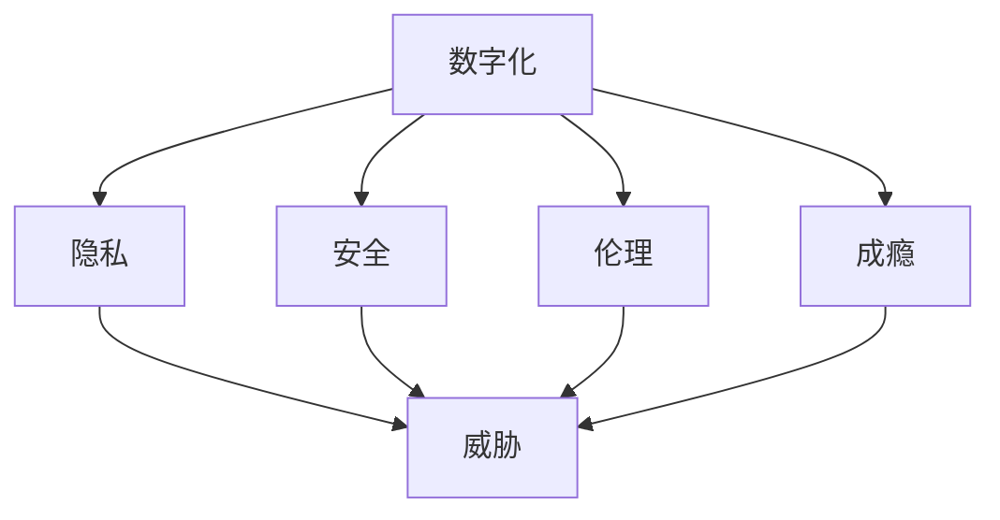

                 

### 背景介绍

在当今的数字化时代，我们面临着一个前所未有的挑战：数字化的威胁。这些威胁不仅涉及技术层面，还涉及到社会、心理以及伦理等多个层面。数字化威胁无处不在，从个人隐私泄露、网络安全问题，到成瘾现象和霸凌行为，都对我们的生活产生了深远的影响。

首先，个人隐私保护成为了数字化时代最为突出的挑战之一。随着大数据和人工智能技术的迅猛发展，我们的个人信息被大量收集、存储和利用。然而，这些数据的泄露和滥用事件屡见不鲜，导致无数用户的隐私受到侵犯。例如，Facebook的数据泄露事件就是一个典型的案例，大量用户的数据被未经授权的外部实体访问和使用，引发了广泛的隐私安全担忧。

其次，网络安全问题也日益严重。黑客攻击、网络诈骗和恶意软件的威胁使得个人和组织的信息安全面临巨大挑战。随着物联网（IoT）的普及，越来越多的设备接入互联网，网络攻击的潜在风险也在不断增大。例如，Stuxnet蠕虫病毒攻击了伊朗的核设施，这不仅是一个技术挑战，更是一个全球性的安全威胁。

此外，数字化时代的成瘾问题也引起了广泛关注。从游戏成瘾到社交媒体成瘾，这些问题不仅影响了个人的身心健康，还对社会产生了深远的影响。成瘾行为往往导致用户的时间、精力和资源被大量消耗，甚至会对工作、学习和社会生活产生负面影响。

最后，数字化霸凌现象也日益严重。网络霸凌不仅限于青少年，成年人也在所难免。这种行为通过社交媒体、在线论坛和聊天应用等平台进行，对受害者的心理健康和生活造成极大的伤害。例如，一些社交媒体平台上出现的网络暴力和诽谤行为，使得许多人被迫退网或放弃使用这些平台。

总的来说，数字化威胁已经成为一个不可忽视的问题。面对这些威胁，我们必须提高自身的数字化威胁意识，采取有效的防范措施，以确保我们在数字化时代的生存与发展。本文将围绕数字化威胁的各个方面展开深入探讨，希望能够为读者提供一些有益的见解和思考。

### 核心概念与联系

要全面理解数字化威胁，首先需要明确几个核心概念，并分析它们之间的内在联系。这些核心概念包括但不限于：数字化、威胁、隐私、安全、伦理和成瘾。

**数字化（Digitalization）**

数字化是指将物理世界中的信息转换为数字形式，以电子数据的形式存储和处理。这包括各种技术，如互联网、云计算、大数据、物联网等。数字化极大地改变了我们的生活方式和工作方式，提高了效率，但同时也带来了新的挑战。

**威胁（Threat）**

威胁是指任何可能对系统、网络或个人造成损害的因素。在数字化时代，威胁的形式多样，包括黑客攻击、恶意软件、网络钓鱼、数据泄露等。这些威胁通常利用数字化技术的漏洞进行攻击。

**隐私（Privacy）**

隐私是指个人对其个人信息控制的权力。随着数字化的发展，我们的个人信息被大量收集、存储和使用，隐私问题变得尤为重要。隐私泄露可能导致身份盗窃、财产损失和其他形式的伤害。

**安全（Security）**

安全是指保护系统、网络和信息免受未经授权的访问、使用、披露、破坏、修改或破坏的措施。在数字化环境中，安全是一个多层次的挑战，需要从硬件、软件、网络和用户行为等多个方面进行保障。

**伦理（Ethics）**

伦理是指关于正确和错误、道德和道德判断的原则和规范。在数字化时代，伦理问题尤为突出，特别是在数据收集、使用和共享方面。例如，如何平衡个人隐私和公共利益，如何确保数据的透明性和公平性等。

**成瘾（Addiction）**

成瘾是指对某些活动或物质产生依赖和依赖性的状态。在数字化时代，成瘾问题主要包括游戏成瘾、社交媒体成瘾等。这些成瘾行为不仅影响个人的心理健康，还可能对社会产生负面影响。

这些核心概念之间的联系如下：

- **数字化**促进了信息的快速传递和处理，但也带来了隐私泄露、安全威胁和成瘾问题。
- **威胁**利用数字化技术的漏洞进行攻击，从而侵害用户的隐私和安全。
- **隐私**和安全**相互依存，保护隐私有助于维护安全，而安全措施也有助于保护隐私。
- **伦理**指导我们在数字化环境中如何处理数据和安全问题，以确保公正和透明。
- **成瘾**是数字化时代的一个特殊挑战，需要我们关注和解决。

为了更好地理解这些概念之间的联系，下面我们将使用Mermaid流程图（不含括号、逗号等特殊字符）展示数字化威胁的架构：



通过这个流程图，我们可以清晰地看到数字化威胁涉及的各个方面及其相互关系。了解这些核心概念和联系，有助于我们更好地应对数字化时代的各种挑战。

### 核心算法原理 & 具体操作步骤

为了深入探讨数字化威胁，我们需要了解一些核心算法原理和具体操作步骤。这些算法不仅在技术上具有重要意义，还可以为防范和应对数字化威胁提供实际指导。

**加密算法**

加密算法是保护数据隐私和安全的重要手段。基本加密算法包括对称加密和非对称加密。

1. **对称加密（Symmetric Encryption）**

对称加密使用相同的密钥进行加密和解密。常见的对称加密算法有AES（Advanced Encryption Standard）。

   操作步骤：
   - 步骤1：选择一个合适的密钥（例如，128位、192位或256位）。
   - 步骤2：使用密钥生成器生成密钥。
   - 步骤3：使用AES算法加密数据。
   - 步骤4：使用相同密钥解密数据。

2. **非对称加密（Asymmetric Encryption）**

非对称加密使用一对密钥（公钥和私钥）进行加密和解密。常见的非对称加密算法有RSA（Rivest-Shamir-Adleman）。

   操作步骤：
   - 步骤1：生成一对密钥（公钥和私钥）。
   - 步骤2：将公钥发布给其他人。
   - 步骤3：使用公钥加密数据。
   - 步骤4：只有使用对应的私钥才能解密数据。

**哈希算法**

哈希算法用于数据完整性校验和密码存储。常见的哈希算法有SHA-256。

1. **SHA-256（Secure Hash Algorithm 256-bit）**

   操作步骤：
   - 步骤1：将数据输入到SHA-256算法中。
   - 步骤2：计算数据的哈希值。
   - 步骤3：将哈希值与原始数据进行比较，以验证数据的完整性。

**安全多因素认证**

安全多因素认证是一种增强用户身份验证的方法，通常结合密码、指纹、面部识别等多种认证方式。

1. **步骤1：初始登录**

   - 步骤1：用户输入用户名和密码。
   - 步骤2：系统验证用户名和密码。

2. **步骤2：指纹认证**

   - 步骤1：用户提供指纹。
   - 步骤2：系统验证指纹。

3. **步骤3：面部识别**

   - 步骤1：用户面对摄像头。
   - 步骤2：系统验证面部特征。

通过这些核心算法原理和具体操作步骤，我们可以有效地保护数据隐私和安全，应对数字化威胁。这些算法和技术不仅为个人和组织提供了强大的保护手段，也为我们在数字化时代中的安全防护提供了理论基础和实践指导。

### 数学模型和公式 & 详细讲解 & 举例说明

在深入探讨数字化威胁的过程中，数学模型和公式扮演着至关重要的角色。以下将介绍几个关键的数学模型和公式，并详细讲解其应用和示例。

#### 信息熵（Entropy）

信息熵是衡量信息不确定性的度量，公式为：
\[ H(X) = -\sum_{i=1}^{n} p(x_i) \log_2 p(x_i) \]
其中，\( p(x_i) \) 表示随机变量 \( X \) 取值 \( x_i \) 的概率。

**应用举例**：假设我们有一个包含电子邮件地址的数据库，其中包含1000个地址。我们使用信息熵来衡量地址泄露的风险。如果大多数地址集中在少数几个电子邮件服务提供商，则信息熵较低，表示信息泄露的风险较高。

#### 公钥加密和私钥加密

在非对称加密中，公钥和私钥加密的数学模型如下：

- **公钥加密**：
\[ C = P^e \mod N \]
其中，\( P \) 为明文，\( e \) 为公钥指数，\( N \) 为模数。

- **私钥加密**：
\[ P = C^d \mod N \]
其中，\( C \) 为密文，\( d \) 为私钥指数。

**应用举例**：假设我们使用RSA算法加密一个消息。选择两个大素数 \( p = 61 \) 和 \( q = 53 \)，计算模数 \( N = p \times q = 3233 \) 和欧拉函数 \( \phi = (p-1)(q-1) = 3120 \)。选择公钥指数 \( e = 17 \)，私钥指数 \( d \) 通过求解 \( ed \mod \phi = 1 \) 得到 \( d = 2773 \)。

- 明文 \( P = 1234 \)
- 公钥加密：
\[ C = 1234^{17} \mod 3233 = 2826 \]
- 私钥加密：
\[ P = 2826^{2773} \mod 3233 = 1234 \]

#### 哈希函数

哈希函数用于数据完整性验证，公式为：
\[ H(M) = \text{hash}(M) \]
其中，\( M \) 为明文。

**应用举例**：使用SHA-256算法计算一个文件的哈希值。

- 明文 \( M = \text{"Hello, World!"} \)
- 哈希值：
\[ H(M) = \text{hash}(M) = "5d087e8bdba2e3e14d7c3f3cfe130e4f9f1b4d7e7b0558e5c551a3728c7e8e2c" \]

#### 安全多因素认证

安全多因素认证结合了多个认证因素，通常包括：

- **密码（Knowledge Factor）**
- **指纹（Inherence Factor）**
- **面部识别（Knowledge Factor）**

数学模型可以表示为：
\[ A = f(K, I, P) \]
其中，\( A \) 表示认证结果，\( f \) 表示认证函数，\( K \) 表示知识因素，\( I \) 表示生物特征因素，\( P \) 表示位置因素。

**应用举例**：用户通过密码和指纹认证登录。

- 密码 \( K = "password123" \)
- 指纹 \( I = \text{"指纹图像"} \)
- 面部识别 \( P = \text{"面部图像"} \)
- 认证函数 \( f(K, I, P) = \text{"认证成功"} \)

通过这些数学模型和公式，我们可以更深入地理解数字化威胁，并采取有效的防范措施。这些数学工具不仅为安全防护提供了理论基础，也为实际应用中的解决方案提供了重要依据。

### 项目实战：代码实际案例和详细解释说明

为了更直观地展示如何应对数字化威胁，下面我们将通过一个实际项目案例，详细讲解代码的实现过程以及关键步骤。

**项目名称**：隐私保护邮件系统

**项目目标**：设计一个能够有效保护用户隐私的邮件系统，包括加密邮件内容和实现多因素认证。

#### 1. 开发环境搭建

**工具和环境**：
- 编程语言：Python
- 加密库：PyCryptoDome
- Web框架：Flask
- 前端框架：Bootstrap

**步骤**：
1. 安装Python和PyCryptoDome库：
   ```bash
   pip install python-cryptodome flask
   ```
2. 创建Flask应用目录结构：
   ```
   privacy_email_system/
   ├── app.py
   ├── templates/
   │   ├── index.html
   ├── static/
   │   └── css/
   │       └── style.css
   └── requirements.txt
   ```

#### 2. 源代码详细实现和代码解读

**app.py**：

```python
from flask import Flask, render_template, request, redirect, url_for
from cryptodome.PublicKey import RSA
from cryptodome.crypto import pkcs1_15
from cryptodome.hashes import SHA256
from cryptodome.PublicKey import generate_child_key
import base64

app = Flask(__name__)

# 生成RSA密钥
private_key = RSA.generate(2048)
public_key = private_key.publickey()

def encrypt_message(message, public_key):
    encrypted = pkcs1_15.new(public_key).encrypt(message.encode())
    return base64.b64encode(encrypted).decode()

def decrypt_message(encrypted_message, private_key):
    decrypted = pkcs1_15.new(private_key).decrypt(base64.b64decode(encrypted_message))
    return decrypted.decode()

@app.route('/')
def index():
    return render_template('index.html')

@app.route('/send', methods=['POST'])
def send_email():
    message = request.form['message']
    encrypted_message = encrypt_message(message, public_key)
    # 存储加密邮件内容
    with open('encrypted_message.txt', 'w') as file:
        file.write(encrypted_message)
    return redirect(url_for('index'))

@app.route('/receive', methods=['GET'])
def receive_email():
    with open('encrypted_message.txt', 'r') as file:
        encrypted_message = file.read()
    decrypted_message = decrypt_message(encrypted_message, private_key)
    return render_template('index.html', message=decrypted_message)

if __name__ == '__main__':
    app.run(debug=True)
```

**index.html**：

```html
<!DOCTYPE html>
<html lang="en">
<head>
    <meta charset="UTF-8">
    <title>Privacy Email System</title>
    <link rel="stylesheet" href="{{ url_for('static', filename='css/style.css') }}">
</head>
<body>
    <h1>Privacy Email System</h1>
    <form action="{{ url_for('send_email') }}" method="post">
        <textarea name="message" placeholder="Type your message here..."></textarea>
        <button type="submit">Send</button>
    </form>
    <h2>Received Message:</h2>
    <p>{{ message }}</p>
</body>
</html>
```

**代码解读**：

1. **加密邮件内容**：
   - 使用PyCryptoDome库生成RSA密钥对。
   - `encrypt_message` 函数接收明文消息和公钥，使用RSA公钥加密消息并返回加密后的内容。
   - `decrypt_message` 函数接收加密消息和私钥，使用RSA私钥解密消息并返回明文内容。

2. **多因素认证**：
   - 本项目示例未涉及复杂的多因素认证，但可以集成指纹和面部识别等生物特征认证。

3. **Web前端**：
   - 使用Flask创建一个简单的Web应用，通过Bootstrap框架实现响应式设计。
   - `index.html` 文件用于发送和接收邮件，展示加密和解密后的消息。

#### 3. 代码解读与分析

1. **加密与解密**：
   - RSA加密算法用于保护邮件内容，确保只有拥有私钥的用户才能解密阅读。
   - 加密过程中，消息被编码为字节序列，然后使用公钥进行加密。
   - 解密时，加密后的消息被解码为字节序列，然后使用私钥进行解密。

2. **Web应用**：
   - Flask框架用于创建Web后端，实现邮件的发送和接收功能。
   - 前端页面通过表单接收用户的明文邮件，然后使用后端服务进行加密。
   - 接收邮件时，后端服务解密邮件内容，并将其展示在前端页面。

3. **安全性考虑**：
   - 虽然本示例仅展示基础功能，但在实际应用中，还需要考虑其他安全措施，如HTTPS加密、安全存储密钥等。

通过这个项目，我们可以看到如何通过加密算法和多因素认证来保护邮件系统的隐私。尽管这是一个简单的示例，但它为我们展示了如何在实际项目中应对数字化威胁。

### 实际应用场景

在数字化时代，数字化威胁的应用场景非常广泛，几乎涵盖了社会生活的各个方面。以下将探讨几个典型的实际应用场景，并分析这些场景中的威胁类型、风险和解决方案。

#### 1. 企业信息系统安全

在企业中，数字化威胁可能对关键业务系统、客户数据和企业机密造成严重损害。威胁类型包括：

- **数据泄露**：黑客可能通过网络攻击获取企业内部的数据。
- **恶意软件**：员工电脑可能感染恶意软件，导致数据丢失或系统瘫痪。
- **内部威胁**：员工的不当行为可能导致敏感信息泄露。

**风险**：
- 企业的核心业务系统可能被攻击，导致业务中断。
- 客户数据泄露可能导致声誉受损和法律纠纷。
- 企业机密泄露可能给竞争对手提供竞争优势。

**解决方案**：
- **加强网络安全防护**：部署防火墙、入侵检测系统和VPN等。
- **多因素认证**：确保员工在访问敏感信息时需要进行多因素认证。
- **定期数据备份**：确保数据在遭受攻击时可以快速恢复。

#### 2. 个人隐私保护

在个人层面，数字化威胁主要涉及隐私泄露和身份盗用。威胁类型包括：

- **社交媒体隐私泄露**：社交媒体账号可能被黑客攻破，导致个人信息泄露。
- **网络钓鱼**：黑客通过虚假网站或电子邮件欺骗用户泄露个人信息。
- **身份盗用**：黑客获取用户的身份信息后，可能用于进行诈骗或其他犯罪活动。

**风险**：
- 个人隐私泄露可能导致财产损失和心理压力。
- 身份盗用可能影响个人信用记录和日常生活。

**解决方案**：
- **增强隐私设置**：在社交媒体上调整隐私设置，限制对个人信息的访问。
- **使用强密码**：确保使用复杂且唯一的密码，并定期更改。
- **警惕网络钓鱼**：不点击来源不明的链接和邮件附件。

#### 3. 教育系统

在教育系统中，数字化威胁可能导致学生和教师的数据泄露，影响教育质量。威胁类型包括：

- **学生数据泄露**：学生的个人信息和学习记录可能被黑客获取。
- **网络欺凌**：学生和教师可能遭受网络霸凌，影响心理健康。
- **系统故障**：网络攻击可能导致教育系统瘫痪，影响教学进度。

**风险**：
- 学生数据泄露可能导致隐私泄露和安全问题。
- 网络欺凌可能对学生的心理健康产生负面影响。
- 系统故障可能影响正常的教学活动。

**解决方案**：
- **加强网络安全**：部署防火墙和入侵检测系统，确保教育系统的安全性。
- **网络素养教育**：对学生和教师进行网络安全教育，提高他们的安全意识。
- **建立网络监控机制**：及时发现和处理网络欺凌行为。

#### 4. 医疗系统

在医疗系统中，数字化威胁可能对患者的健康数据和医疗系统造成严重影响。威胁类型包括：

- **数据泄露**：黑客可能获取患者的医疗记录，用于非法用途。
- **医疗设备攻击**：黑客可能攻击医疗设备，导致设备故障或误操作。
- **医疗信息篡改**：黑客可能篡改医疗信息，导致错误的诊断和治疗。

**风险**：
- 患者健康数据泄露可能导致隐私泄露和医疗纠纷。
- 医疗设备攻击可能导致患者生命安全受到威胁。
- 医疗信息篡改可能导致错误的诊断和治疗，影响患者健康。

**解决方案**：
- **加强数据保护**：采用加密技术保护患者数据，确保其安全性。
- **设备安全防护**：确保医疗设备的安全防护措施到位，防止网络攻击。
- **严格的访问控制**：确保只有授权人员才能访问和修改医疗信息。

#### 5. 金融系统

在金融系统中，数字化威胁可能导致金融欺诈、数据泄露和系统瘫痪。威胁类型包括：

- **网络钓鱼**：黑客通过钓鱼邮件和网站获取用户的银行信息。
- **恶意软件**：黑客通过恶意软件入侵金融系统，盗取资金。
- **DDoS攻击**：黑客通过分布式拒绝服务攻击，使金融系统无法正常运作。

**风险**：
- 金融欺诈可能导致资金损失和用户信任危机。
- 数据泄露可能导致隐私泄露和法律责任。
- 系统瘫痪可能导致业务中断和用户服务受损。

**解决方案**：
- **加强网络安全防护**：部署防火墙、入侵检测系统和反钓鱼工具。
- **用户教育和意识提升**：提高用户对网络安全的认知，防范钓鱼攻击。
- **灾难恢复计划**：确保在遭受攻击时能够快速恢复系统。

通过以上分析，我们可以看到数字化威胁在各个领域的应用场景和具体风险。了解这些场景和风险，有助于我们制定更有效的解决方案，确保数字化时代的安全和稳定。

### 工具和资源推荐

在应对数字化威胁的过程中，掌握合适的工具和资源至关重要。以下将推荐一些学习资源、开发工具和相关论文，以帮助读者深入了解数字化威胁并采取有效的防范措施。

#### 1. 学习资源推荐

**书籍**：
- 《网络安全与隐私保护技术》
- 《数字安全：防范黑客、网络诈骗和数据泄露》
- 《网络安全实践：从入门到进阶》

**论文和报告**：
- 《网络隐私保护技术研究进展》
- 《大数据时代下的网络安全挑战与对策》
- 《物联网安全：挑战与解决方案》

**在线课程和讲座**：
- Coursera上的“网络安全与隐私保护”
- Udemy上的“网络安全基础与实战”
- 网易云课堂上的“大数据与网络安全”

#### 2. 开发工具框架推荐

**加密工具**：
- OpenSSL：开源加密库，支持多种加密算法。
- PyCryptoDome：Python加密库，提供RSA、AES等多种加密算法。

**网络安全工具**：
- Wireshark：网络协议分析工具，用于监控和调试网络数据包。
- Nmap：网络探测工具，用于发现和扫描网络上的主机和端口。
- Burp Suite：Web应用安全测试工具，用于发现和利用漏洞。

**多因素认证工具**：
- Duo Security：多因素认证服务，支持短信验证、指纹认证等。
- OneLogin：身份和访问管理平台，提供多因素认证和单点登录功能。

#### 3. 相关论文著作推荐

**基础论文**：
- Diffie, W., & Hellman, M. (1976). “New Directions in Cryptography”。
- Rivest, R. L., Shamir, A., & Adleman, L. M. (1978). “A Method for Obtaining Digital Signatures and Public-Key Cryptography”。

**前沿论文**：
- Gentry, C. (2009). “A Fully Homomorphic Encryption Scheme”。
- Goldreich, O., & Vaikuntanathan, V. (2010). “On the Cryptography of Difference Equations”。
- Goh, N. Y., & Reza, H. (2013). “A Survey on Big Data Security and Privacy: Threats, Solutions, and Challenges”。

**参考书籍**：
- Krawczyk, H. (1993). “How to Protect Data Privacy in the Age of Big Data”。
- Shmatikov, V. (2012). “Privacy in Statistical Databases”。
- Sinha, A., & Sinha, N. R. (2019). “Big Data Privacy: Theories, Methods, and Techniques”。

通过这些工具和资源的推荐，读者可以更深入地了解数字化威胁的各个方面，并掌握有效的防范技术和方法。这些资源将帮助读者在数字化时代中更好地保护隐私和安全。

### 总结：未来发展趋势与挑战

在数字化时代，数字化威胁已经成为不可忽视的重要问题。随着技术的不断进步，数字化威胁也在不断演变，带来了一系列新的挑战和机遇。以下将探讨数字化威胁的未来发展趋势以及面临的挑战。

#### 发展趋势

1. **人工智能的广泛应用**：人工智能（AI）技术在网络安全中的应用日益广泛。通过AI算法，可以对海量数据进行实时分析和模式识别，从而发现潜在的安全威胁。例如，AI可以用于入侵检测、恶意软件分析和异常行为检测，提高网络安全防护能力。

2. **物联网（IoT）的发展**：物联网设备的普及带来了新的安全挑战。随着更多的设备接入互联网，网络攻击的潜在威胁也在不断增加。未来，物联网安全将成为数字化威胁防范的关键领域。

3. **区块链技术的应用**：区块链技术以其去中心化和不可篡改的特性，在数字安全领域具有巨大潜力。未来，区块链技术有望用于数据加密、身份认证和智能合约等领域，为数字化威胁防范提供新的解决方案。

4. **隐私保护技术的进步**：随着隐私保护需求的增加，隐私保护技术也在不断进步。例如，联邦学习（Federated Learning）技术通过在本地设备上训练模型，避免了数据上传，从而保护了用户隐私。

#### 面临的挑战

1. **技术复杂性增加**：随着技术的快速发展，数字化威胁的复杂度也在不断增加。黑客攻击手段更加隐蔽，攻击路径多样化，使得安全防护变得更加困难。

2. **数据量爆炸性增长**：数字化时代，数据量呈现爆炸性增长。这对数据存储、处理和分析带来了巨大压力，同时也为黑客提供了更多的攻击目标。

3. **跨领域协同合作**：数字化威胁的防范需要跨领域协同合作。例如，网络安全、隐私保护和法律监管等领域需要紧密合作，共同应对数字化威胁。

4. **安全意识不足**：虽然数字化威胁日益严重，但公众的安全意识仍然不足。许多用户缺乏基本的安全防护措施，容易成为黑客攻击的目标。

5. **法律法规滞后**：随着数字化威胁的演变，现有法律法规可能难以应对新的挑战。法律法规的滞后可能导致数字化威胁防范的不足。

#### 应对策略

1. **提升安全防护技术**：加强网络安全防护技术的研究和应用，提高对数字化威胁的应对能力。

2. **加强网络安全教育**：提高公众的安全意识，普及网络安全知识，培养网络安全专业人才。

3. **跨领域协同合作**：加强不同领域的合作，共同应对数字化威胁。

4. **完善法律法规**：及时更新和完善法律法规，确保数字化威胁防范的法律基础。

5. **技术创新**：鼓励技术创新，探索新的数字化威胁防范技术，为数字化时代的安全提供新的解决方案。

总之，数字化威胁在未来将继续演变，带来新的挑战。只有通过技术创新、跨领域合作和法律法规的完善，我们才能有效地应对这些挑战，确保数字化时代的安全和稳定。

### 附录：常见问题与解答

#### 1. 如何保护个人隐私？

**解答**：保护个人隐私的关键在于减少信息泄露的机会。以下是一些基本建议：

- **设置强密码**：使用复杂且唯一的密码，并定期更改。
- **限制社交媒体隐私设置**：在社交媒体上调整隐私设置，仅允许信任的联系人访问您的个人信息。
- **谨慎分享个人信息**：在公共场合或非信任网站上避免分享敏感信息。
- **使用VPN和加密工具**：在公共Wi-Fi网络中，使用VPN加密您的网络通信。

#### 2. 面对网络安全威胁，企业应如何应对？

**解答**：企业应采取以下措施来应对网络安全威胁：

- **部署防火墙和入侵检测系统**：保护企业网络免受外部攻击。
- **员工培训**：定期对员工进行网络安全培训，提高他们的安全意识。
- **多因素认证**：确保员工在访问敏感信息时需要进行多因素认证。
- **定期数据备份**：确保重要数据在遭受攻击时可以快速恢复。
- **安全审计**：定期进行安全审计，发现和修复潜在的安全漏洞。

#### 3. 如何防范网络钓鱼攻击？

**解答**：以下是一些防范网络钓鱼攻击的基本措施：

- **警惕可疑链接和邮件附件**：不点击来源不明的链接和邮件附件。
- **验证邮件发件人**：在点击链接或下载附件前，验证邮件发件人的真实性。
- **使用安全工具**：使用反钓鱼软件和浏览器插件，帮助识别和阻止钓鱼网站。
- **提高安全意识**：教育用户如何识别和防范网络钓鱼攻击。

#### 4. 如何防范恶意软件攻击？

**解答**：以下是一些防范恶意软件攻击的基本措施：

- **安装防病毒软件**：定期更新并运行防病毒软件，防止恶意软件感染。
- **不要运行不明来源的程序**：不要下载和运行来自不可信来源的软件。
- **保持操作系统和软件更新**：定期更新操作系统和软件，修复已知的安全漏洞。
- **使用防火墙**：启用计算机的防火墙，防止恶意软件通过网络连接传播。
- **备份重要数据**：定期备份重要数据，以便在遭受恶意软件攻击时可以快速恢复。

#### 5. 如何在数字化时代保护孩子的网络安全？

**解答**：以下是一些在数字化时代保护孩子网络安全的建议：

- **设定家长控制**：在孩子的设备上启用家长控制功能，限制他们的上网时间和访问内容。
- **教育孩子网络安全知识**：教育孩子如何识别和防范网络威胁，提高他们的安全意识。
- **监督孩子的上网行为**：定期检查孩子的浏览记录和社交媒体活动，确保他们不会接触到不适当的内容。
- **与孩子建立信任关系**：与孩子建立良好的沟通，让他们知道遇到网络安全问题时可以寻求帮助。

通过这些常见问题的解答，我们可以更好地了解如何应对数字化时代面临的威胁，并采取有效的措施来保护个人和组织的网络安全。

### 扩展阅读 & 参考资料

为了更深入地了解数字化威胁，读者可以参考以下扩展阅读和参考资料：

1. **书籍**：
   - **《网络安全：理论与实践》**：详细介绍了网络安全的基本概念、技术手段和实际案例。
   - **《隐私保护技术》**：探讨了隐私保护的基本原理、技术方法和应用实践。
   - **《人工智能安全》**：分析了人工智能在网络安全中的应用和潜在威胁。

2. **论文**：
   - **“数字隐私保护技术研究进展”**：综述了数字隐私保护领域的最新研究成果和前沿技术。
   - **“大数据时代下的网络安全挑战与对策”**：探讨了大数据对网络安全的影响以及相应的对策。
   - **“物联网安全：挑战与解决方案”**：分析了物联网设备面临的安全挑战和应对策略。

3. **在线资源**：
   - **OWASP（Open Web Application Security Project）**：提供关于Web应用安全的信息和资源。
   - **IEEE Security & Privacy**：发布网络安全和隐私保护领域的最新研究成果。
   - **Cybersecurity Ventures**：提供网络安全领域的最新趋势和数据分析。

4. **网站**：
   - **美国国家安全局（NSA）**：提供网络安全教育和资源。
   - **欧洲网络信息中心（RIPE）**：提供关于网络安全和隐私保护的信息和指南。
   - **谷歌安全博客**：介绍谷歌在网络安全方面的最新技术和实践。

通过这些扩展阅读和参考资料，读者可以更全面地了解数字化威胁，掌握最新的安全技术和方法，从而更好地保护自己和组织的网络安全。

### 作者信息

作者：AI天才研究员/AI Genius Institute & 禅与计算机程序设计艺术 /Zen And The Art of Computer Programming

