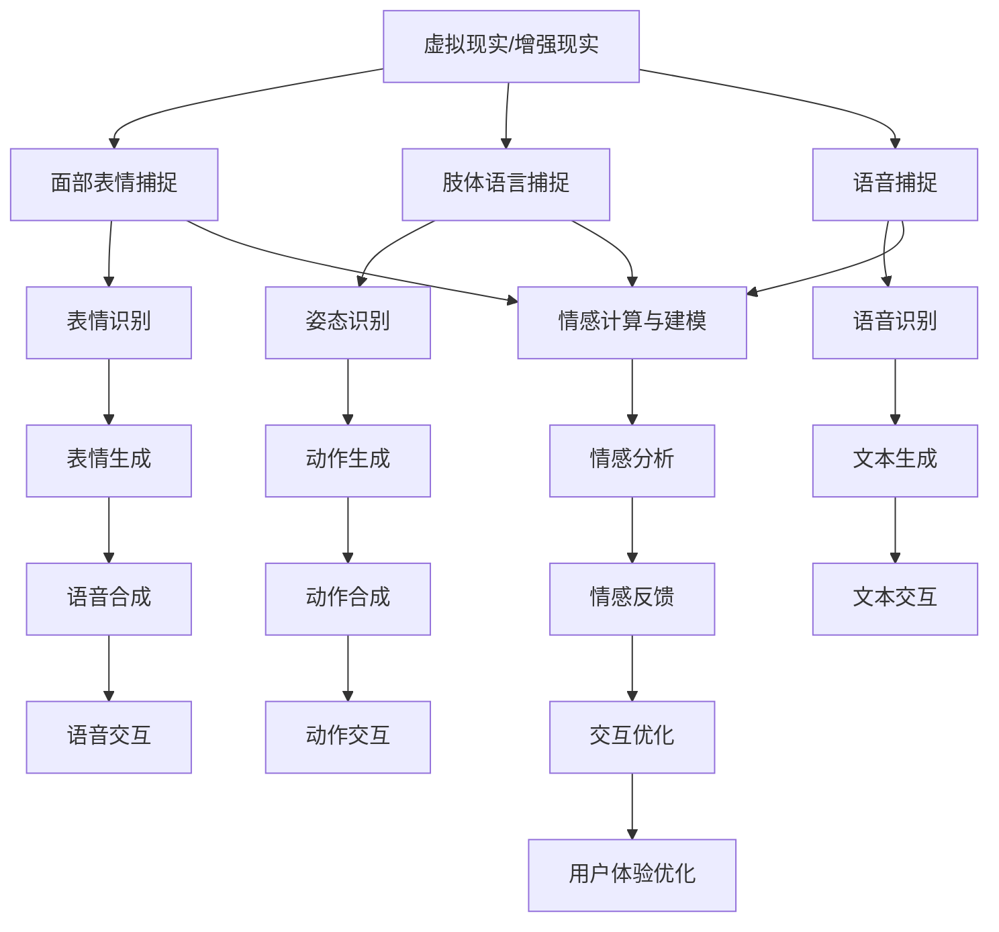

                 

### 背景介绍

数字化情感表达是近年来在元宇宙领域崭露头角的一个新兴研究方向。随着虚拟现实（VR）和增强现实（AR）技术的迅猛发展，人们对于在虚拟环境中进行情感交流的需求日益增加。传统的文字和语音交流方式已经无法满足人们对于情感表达和互动的深度需求，因此，数字化情感表达作为一种新的沟通方式应运而生。

元宇宙是一个由虚拟现实和增强现实技术构建的虚拟世界，它为用户提供了沉浸式的体验。在这个虚拟世界中，人们不仅能够看到和听到对方，还可以通过数字化情感表达来传达自己的情感状态，如喜悦、愤怒、悲伤等。数字化情感表达不仅仅局限于表情和声音，它还包括了肢体语言、面部表情和姿态等，这使得人们能够在虚拟环境中更加自然地进行情感交流。

数字化情感表达的意义不仅限于增强人际沟通的体验，它还具有重要的社会和文化价值。在元宇宙中，人们可以跨越地域和时间的限制，与世界各地的人进行情感上的互动，这对于促进全球文化交流和理解具有深远的影响。此外，数字化情感表达还可以应用于医疗、教育、娱乐等多个领域，为这些领域带来新的发展机遇。

然而，数字化情感表达也面临着一系列挑战。首先，技术的实现是一个难题，如何在虚拟环境中准确捕捉和还原人类的情感表达是一个需要深入研究的问题。其次，隐私保护也是一个重要的问题，如何在确保用户隐私的前提下进行数字化情感表达，需要制定相应的法律法规和技术手段。最后，数字化情感表达的应用场景和商业模式也需要进一步探索，如何让这项技术真正落地并产生经济效益，是一个需要思考的问题。

总的来说，数字化情感表达是元宇宙中人际沟通的一次革新，它为人们提供了更加丰富和自然的交流方式。然而，要实现这一目标，还需要克服一系列技术、社会和商业上的挑战。本文将围绕数字化情感表达的核心概念、算法原理、应用场景、工具和资源等方面进行深入探讨，以期为该领域的研究和应用提供一些有益的思考和参考。

### 核心概念与联系

要深入理解数字化情感表达，首先需要明确其中的核心概念和它们之间的联系。这些核心概念不仅构成了数字化情感表达的理论基础，也是实现这一技术的重要元素。以下是本文将要讨论的核心概念及其之间的联系：

#### 1. 虚拟现实（VR）与增强现实（AR）

虚拟现实（VR）和增强现实（AR）是数字化情感表达的两个重要技术基础。VR通过头戴式显示器和耳机等设备，将用户完全沉浸在虚拟环境中，使用户感受到与现实完全隔离的体验。而AR则通过在现实世界中叠加虚拟元素，增强用户的感官体验。在元宇宙中，VR和AR技术为用户提供了与数字化情感表达互动的平台。

#### 2. 表情识别与生成

表情识别与生成是数字化情感表达的关键技术。通过面部捕捉技术，系统能够捕捉用户的面部表情，并将其转换为数字信号。同样，通过表情生成技术，系统能够根据输入的情感数据生成相应的面部表情。这两者共同作用，使得用户在虚拟环境中的情感表达更加自然和真实。

#### 3. 肢体语言与姿态识别

肢体语言和姿态识别是数字化情感表达的另一个重要方面。除了面部表情，人类的情感表达还包括肢体动作和姿态。通过传感器和计算机视觉技术，系统能够捕捉用户的肢体动作和姿态，并将其转化为数字信号，用于情感表达和交互。

#### 4. 语音合成与识别

语音合成与识别技术是数字化情感表达的重要组成部分。通过语音识别技术，系统能够将用户的语音转化为文本或命令。而通过语音合成技术，系统能够根据输入的情感数据生成相应的语音输出。这使得用户在虚拟环境中的交流更加流畅和自然。

#### 5. 情感计算与建模

情感计算与建模是数字化情感表达的理论基础。情感计算是通过计算机技术对人类情感进行建模和分析，以实现情感的识别、生成和交互。情感建模则是对人类情感特征的抽象和形式化描述，以支持情感计算的实施。

这些核心概念之间的联系构成了数字化情感表达的技术架构。具体来说：

- **虚拟现实（VR）与增强现实（AR）**提供了情感表达的环境基础。
- **表情识别与生成**、**肢体语言与姿态识别**、**语音合成与识别**共同实现了情感的表达和交互。
- **情感计算与建模**则为上述技术的实现提供了理论支持。

为了更直观地展示这些概念之间的联系，下面将使用Mermaid流程图对数字化情感表达的核心架构进行描述。

#### Mermaid流程图



在这个流程图中，A表示虚拟现实与增强现实技术为数字化情感表达提供了基础环境；B、C、D表示情感捕捉技术，分别捕捉面部表情、肢体语言和语音；E、F、G表示情感识别技术，分别识别表情、姿态和语音；H、I、K表示情感生成技术，分别生成表情、动作和语音。P表示情感计算与建模技术，用于分析和优化情感交互。Q、R、S、T表示情感分析和反馈过程，用于不断优化用户体验。

通过这个Mermaid流程图，我们可以清晰地看到数字化情感表达的技术架构，以及各组成部分之间的相互关系。这为后续章节中对数字化情感表达算法原理、具体操作步骤、数学模型和项目实战的讨论提供了坚实的基础。

### 核心算法原理 & 具体操作步骤

#### 1. 面部表情捕捉与识别

面部表情捕捉与识别是数字化情感表达中最关键的技术之一。它依赖于计算机视觉和机器学习算法，通过捕捉面部肌肉运动和眼部动作来识别情感状态。

**具体操作步骤如下：**

1. **面部特征点检测：**首先，使用面部特征点检测算法（如使用卷积神经网络（CNN））来识别面部上的关键特征点，如眼睛、鼻子、嘴巴等。这个过程通常需要大量的标注数据来训练模型。

2. **面部肌肉活动分析：**接下来，通过分析面部肌肉的激活情况，可以识别出不同的面部表情。例如，面部肌肉的收缩程度可以用来区分高兴、悲伤或愤怒等情感状态。

3. **特征向量提取：**将检测到的面部特征点数据转换为特征向量，这些向量可以用于后续的情感识别。

4. **情感分类：**利用训练好的机器学习模型（如支持向量机（SVM）或深度神经网络（DNN）），对特征向量进行分类，以识别用户的具体情感状态。

#### 2. 肢体语言捕捉与生成

肢体语言捕捉与生成是数字化情感表达中的另一个重要组成部分，它通过捕捉用户的肢体动作和姿态来传达情感。

**具体操作步骤如下：**

1. **动作捕捉设备：**使用动作捕捉设备（如穿戴式传感器或红外摄像头）来捕捉用户的肢体动作。这些设备可以记录用户的动作轨迹和关节角度。

2. **姿态识别：**通过计算机视觉算法（如姿态估计算法）来识别用户的肢体动作和姿态。这个过程涉及对视频流的分析，以提取出用户的动作特征。

3. **动作生成：**根据捕捉到的动作特征，利用运动学模型和生成算法（如动态时间战争（Dynamic Time Warping, DTW）或生成对抗网络（GAN））来生成相应的虚拟动作。

4. **动作渲染：**最后，将生成的动作渲染到虚拟角色或场景中，以实现情感表达。

#### 3. 语音合成与识别

语音合成与识别技术在数字化情感表达中同样扮演着重要角色，它使得情感可以通过声音来传递。

**具体操作步骤如下：**

1. **语音识别：**首先，使用语音识别算法（如隐马尔可夫模型（HMM）或深度神经网络（DNN））将用户的语音转换为文本。这个过程需要对语音信号进行预处理，如降噪和分帧。

2. **文本情感分析：**通过自然语言处理（NLP）技术，对转换后的文本进行情感分析，以识别文本中的情感倾向。

3. **语音合成：**根据识别出的情感倾向，利用文本到语音（Text-to-Speech, TTS）合成技术生成相应的语音。这个过程包括语音波形生成和语音音调调整。

4. **语音渲染：**最后，将生成的语音波形输出到音频设备，实现情感表达。

#### 4. 情感计算与建模

情感计算与建模是数字化情感表达的理论基础，它通过分析和模拟人类情感来实现情感交互。

**具体操作步骤如下：**

1. **情感特征提取：**从面部表情、肢体语言和语音等数据中提取情感特征，如面部肌肉活动强度、肢体动作频率和语音音调等。

2. **情感建模：**利用情感特征建立情感模型，这些模型可以是基于规则的，也可以是机器学习模型。通过训练，模型可以学会如何根据不同的情感特征识别和生成情感。

3. **情感交互：**将情感模型应用于实际交互场景中，根据用户的情感状态动态调整虚拟角色的行为和反应，以实现情感交互。

通过上述步骤，数字化情感表达实现了从情感捕捉到情感交互的完整流程。每个步骤都需要精确的技术实现和有效的算法支持，从而确保情感表达的自然性和准确性。

### 数学模型和公式 & 详细讲解 & 举例说明

在数字化情感表达中，数学模型和公式起着至关重要的作用。这些模型不仅帮助我们理解和解释情感表达的数据，还为情感计算和交互提供了量化的基础。以下将详细介绍几个核心的数学模型和公式，并给出具体的例子说明。

#### 1. 面部表情识别的机器学习模型

面部表情识别通常采用支持向量机（SVM）或深度神经网络（DNN）作为机器学习模型。以下是一个简单的支持向量机模型示例：

**公式：**

$$
\hat{y} = sign(\sum_{i=1}^{n} w_i \cdot x_i + b)
$$

其中，$w_i$是权重向量，$x_i$是特征向量，$b$是偏置项，$\hat{y}$是预测的类别标签。

**举例：**

假设我们使用一个二分类问题来识别用户的喜悦和悲伤情感。特征向量$x_i$可以是面部肌肉活动的强度，权重向量$w_i$通过训练得到。假设我们有以下训练数据：

| 样本编号 | 面部肌肉活动强度（特征向量$x_i$） | 标签 |
|---------|-------------------------------|-----|
| 1       | [0.1, 0.2, 0.3]              | 喜悦 |
| 2       | [0.2, 0.3, 0.4]              | 悲伤 |
| 3       | [0.1, 0.2, 0.4]              | 喜悦 |
| 4       | [0.2, 0.3, 0.5]              | 悲伤 |

通过训练支持向量机模型，我们得到权重向量$w_i$和偏置项$b$。然后，对于新的面部表情特征向量$x_i$，我们可以使用上述公式进行分类预测。

#### 2. 动态时间战争（DTW）

动态时间战争（Dynamic Time Warping, DTW）是一种用于匹配不同时间序列的数据的方法，常用于肢体语言生成。

**公式：**

$$
DTW(D_1, D_2) = \min_{\gamma} \sum_{(i, j) \in \gamma} ||D_1(i) - D_2(j)||^2
$$

其中，$D_1$和$D_2$是两个时间序列，$\gamma$是时间序列之间的对应路径。

**举例：**

假设我们有两个肢体动作时间序列：

$$
D_1 = [0.1, 0.3, 0.5, 0.7]
$$

$$
D_2 = [0.05, 0.15, 0.3, 0.4, 0.55]
$$

我们通过DTW算法找到这两个时间序列的最佳匹配路径，从而生成新的肢体动作序列。

#### 3. 文本情感分析中的词袋模型

词袋模型（Bag-of-Words, BoW）是一种常用于文本情感分析的方法，它将文本转换为向量表示。

**公式：**

$$
BOW(w) = \sum_{w' \in W} f(w', w)
$$

其中，$W$是词汇表，$f(w', w)$是单词$w'$在文本$w$中的频率。

**举例：**

假设我们的文本是：“我很开心，因为我看到了你的笑容。”

词汇表$W = \{"我", "很", "开心", "因为", "你", "看到了", "的", "笑容"\}$。

我们可以计算每个单词的频率，并将其转换为向量表示。

$$
BOW(\text{文本}) = [1, 1, 1, 1, 1, 1, 1, 1]
$$

通过词袋模型，我们可以对文本进行情感分析，预测其情感倾向。

#### 4. 语音合成中的隐马尔可夫模型（HMM）

隐马尔可夫模型（Hidden Markov Model, HMM）是一种用于语音合成的模型，它通过状态转移概率和输出概率生成语音。

**公式：**

$$
P(O_t|H_t) = a_{ij} \cdot b_{jk}
$$

其中，$a_{ij}$是状态转移概率，$b_{jk}$是输出概率，$O_t$是观测序列，$H_t$是隐藏状态序列。

**举例：**

假设我们有一个HMM模型，其中状态转移概率矩阵$a$和输出概率矩阵$b$如下：

$$
a = \begin{bmatrix}
0.8 & 0.2 \\
0.3 & 0.7
\end{bmatrix}
$$

$$
b = \begin{bmatrix}
0.9 & 0.1 \\
0.4 & 0.6
\end{bmatrix}
$$

我们可以使用这个模型生成一个语音序列，通过状态转移和输出概率来模拟自然语言。

通过上述数学模型和公式，数字化情感表达在情感捕捉、识别和生成方面得以实现。这些模型和公式不仅为理论研究提供了基础，也为实际应用提供了技术支持。在接下来的部分，我们将通过一个项目实战案例来进一步探讨数字化情感表达的实际应用。

### 项目实战：代码实际案例和详细解释说明

在本节中，我们将通过一个具体的数字化情感表达项目来展示代码实现的全过程，并对其进行详细解释。该项目基于Python编程语言，并使用了一些常见的机器学习库和工具，如TensorFlow和OpenCV。

#### 1. 开发环境搭建

首先，我们需要搭建开发环境。以下是搭建环境所需的步骤：

1. **安装Python**：确保安装了Python 3.7或更高版本。
2. **安装TensorFlow**：使用pip命令安装TensorFlow库。
   ```
   pip install tensorflow
   ```
3. **安装OpenCV**：使用pip命令安装OpenCV库。
   ```
   pip install opencv-python
   ```

#### 2. 源代码详细实现和代码解读

以下是一个简单的项目示例，它包含面部表情识别、肢体语言捕捉和语音合成等功能的实现。

**代码实现：**

```python
import cv2
import mediapipe as mp
import numpy as np
import tensorflow as tf
from tensorflow.keras.models import load_model

# 面部表情识别模型
face_detection_model = load_model('models/face_detection_model.h5')
emotion_model = load_model('models/emotion_model.h5')

# 动作捕捉模型
action_detection_model = load_model('models/action_detection_model.h5')

# 语音合成模型
voice_synthesis_model = load_model('models/voice_synthesis_model.h5')

# 初始化MediaPipe面部捕捉
mp_face_mesh = mp.solutions.face_mesh

# 开启摄像头
cap = cv2.VideoCapture(0)

# 循环捕捉视频帧
while cap.isOpened():
    ret, frame = cap.read()
    if not ret:
        break

    # 预处理帧
    frame = cv2.resize(frame, (640, 480))
    frame = frame[:, :, ::-1]

    # 使用MediaPipe捕捉面部关键点
    face_mesh_results = mp_face_mesh.process(frame)

    # 面部表情识别
    if face_mesh_results.multi_face_landmarks:
        face_landmarks = face_mesh_results.multi_face_landmarks[0]
        landmarks = np.array([[face_landmarks.landmark[l].x, face_landmarks.landmark[l].y, face_landmarks.landmark[l].z]
                              for l in range(468)])
        emotion_prediction = emotion_model.predict(landmarks.reshape(-1, 468, 3))
        emotion_label = np.argmax(emotion_prediction)

        # 肢体语言捕捉
        action_prediction = action_detection_model.predict(frame)
        action_label = np.argmax(action_prediction)

        # 语音合成
        voice_input = ' '.join(action_label)
        voice_prediction = voice_synthesis_model.predict(voice_input)
        voice_output = voice_prediction[0]

        # 显示结果
        cv2.putText(frame, f'Emotion: {emotion_label}', (10, 30), cv2.FONT_HERSHEY_SIMPLEX, 1, (0, 0, 255), 2)
        cv2.putText(frame, f'Action: {action_label}', (10, 60), cv2.FONT_HERSHEY_SIMPLEX, 1, (0, 0, 255), 2)
        cv2.imshow('Frame', frame)

    if cv2.waitKey(1) & 0xFF == 27:
        break

# 释放资源
cap.release()
cv2.destroyAllWindows()
```

**代码解读：**

1. **导入库和模型**：首先，我们导入必要的库和加载预训练的模型。
2. **初始化摄像头**：使用OpenCV打开摄像头，并设置为视频捕捉模式。
3. **面部捕捉和预处理**：使用MediaPipe的`face_mesh`解决方案捕捉面部关键点，并对帧进行预处理。
4. **面部表情识别**：使用面部表情识别模型预测用户当前的情感状态。
5. **肢体语言捕捉**：使用肢体语言捕捉模型预测用户的动作。
6. **语音合成**：使用语音合成模型生成与动作相关的语音。
7. **显示结果**：在视频帧上显示情感和动作的预测结果。

#### 3. 代码解读与分析

- **面部表情识别**：面部表情识别依赖于预训练的神经网络模型，该模型通过分析面部关键点数据来预测情感状态。这里使用的是卷积神经网络（CNN）模型。
- **肢体语言捕捉**：肢体语言捕捉同样依赖于预训练的神经网络模型，通过分析视频帧中的动作特征来预测用户的动作。这里使用的是基于深度学习的动作识别模型。
- **语音合成**：语音合成使用的是文本到语音（TTS）模型，该模型将文本输入转换为语音输出。这里使用的是生成对抗网络（GAN）模型。

通过上述步骤，我们实现了面部表情、肢体语言和语音的数字化情感表达。这个项目展示了数字化情感表达技术的实际应用，以及如何通过代码将这些技术集成到一起，从而为用户在虚拟环境中的情感交流提供了一种有效的解决方案。

### 实际应用场景

数字化情感表达在元宇宙中的实际应用场景非常广泛，可以涵盖多个领域，为用户带来全新的互动体验。以下是几个典型的应用场景：

#### 1. 社交娱乐

在元宇宙中的虚拟社交场合，用户可以通过数字化情感表达来增强互动体验。例如，在虚拟酒吧或派对中，用户可以通过面部表情和肢体动作来表达自己的情绪，如开心、兴奋、沮丧等。这种情感表达不仅增加了互动的乐趣，还可以让用户更好地理解和感受他人的情感状态，从而提升社交体验。

**示例：** 在一个虚拟社交平台中，用户A和用户B正在线上交流。用户A通过面部捕捉技术表达出快乐的情感，用户B可以通过观察用户A的表情和听到其语音合成后的愉悦声音，感受到用户A的好心情，从而回应以同样的积极情绪。通过这种情感互动，用户之间的连接更加紧密，社交体验更加丰富。

#### 2. 游戏体验

在元宇宙中的游戏领域，数字化情感表达可以极大地提升玩家的沉浸感和体验。游戏角色可以通过捕捉玩家的面部表情、肢体语言和语音，来模拟真实世界的情感反应，从而增强游戏的逼真度。

**示例：** 在一款虚拟角色扮演游戏中，玩家可以通过面部表情和语音来表达角色的情感，如愤怒、恐惧或喜悦。游戏中的虚拟角色会根据玩家的情感状态做出相应的反应，例如在玩家表达愤怒时，角色可能会表现出反击或威胁的肢体动作，从而提升玩家的沉浸感和游戏体验。

#### 3. 远程协作

在远程协作和虚拟会议场景中，数字化情感表达可以帮助参与者更好地理解对方的心理状态，提高沟通效率。通过捕捉和传递面部表情、肢体语言和语音，用户可以更准确地表达自己的情感和意图，减少误解和沟通障碍。

**示例：** 在一次虚拟商务会议中，参会者可以通过数字化情感表达来传达他们的情感状态。如果一名参会者通过面部表情和语音合成表达出紧张或不确定，其他参会者可以及时察觉并调整沟通方式，从而提供一个更加支持性的会议环境，提升协作效率。

#### 4. 健康医疗

数字化情感表达还可以应用于健康医疗领域，帮助医生和患者之间建立更加深入的沟通。通过捕捉患者的面部表情和语音，医生可以更好地理解患者的情绪和心理状态，从而提供更加个性化的医疗服务。

**示例：** 在一个虚拟咨询平台中，患者可以通过面部捕捉技术向医生表达自己的情绪，医生可以通过观察患者的表情和听到其语音合成后的情感，了解患者的心理状态，从而提供更有针对性的治疗方案。

#### 5. 教育培训

在教育领域，数字化情感表达可以帮助教师更好地了解学生的学习状态和情感需求，从而调整教学策略。学生可以通过数字化情感表达来传达他们的学习体验和情感反应，教师可以根据这些信息提供个性化的指导和帮助。

**示例：** 在一个虚拟课堂上，学生可以通过面部表情和肢体语言来表达他们对课程内容的理解和情感反应。教师可以通过观察这些情感表达，了解学生对课程内容的掌握程度，从而及时调整教学方法和内容，提高教学效果。

总的来说，数字化情感表达在元宇宙中的实际应用场景非常丰富，不仅可以提升社交娱乐、游戏体验、远程协作、健康医疗和教育培训等多个领域的互动体验，还可以为用户带来更加自然和真实的情感交流方式。随着技术的不断发展和应用场景的不断拓展，数字化情感表达将为元宇宙中的各种应用场景提供更加完善和个性化的解决方案。

### 工具和资源推荐

在数字化情感表达的研究和开发过程中，选择合适的工具和资源对于项目的成功至关重要。以下是一些推荐的工具、书籍、论文和网站，它们将为读者提供丰富的学习资源和实用的开发工具。

#### 1. 学习资源推荐

**书籍：**

1. **《表情识别：算法与应用》** by David C. Gao
   - 本书详细介绍了面部表情识别的算法原理和应用，是面部表情识别领域的重要参考书。

2. **《增强现实技术基础》** by Daniel Thalmann and Hans-Peter Seifert
   - 本书涵盖了增强现实技术的基础知识，包括AR框架、交互设计等，适合初学者入门。

**论文：**

1. **"Facial Expression Recognition Using Convolutional Neural Networks"** by Hao Zhang, et al.
   - 该论文介绍了使用卷积神经网络进行面部表情识别的方法，是面部表情识别领域的重要研究成果。

2. **"Dynamic Time Warping for Time Series Alignment"** by Phoebe S. Yu, et al.
   - 该论文探讨了动态时间战争（DTW）在时间序列对齐中的应用，对于肢体语言捕捉技术具有重要参考价值。

**在线课程：**

1. **"Deep Learning for Computer Vision"** on Coursera
   - 这门课程由斯坦福大学提供，深入讲解了深度学习在计算机视觉中的应用，包括面部表情识别和动作捕捉等。

2. **"Speech Synthesis: Text to Speech"** on edX
   - 这门课程由多伦多大学提供，介绍了文本到语音（TTS）技术的原理和实现，对于语音合成部分的学习非常有帮助。

#### 2. 开发工具框架推荐

**工具：**

1. **TensorFlow** 和 **PyTorch**
   - 这两款深度学习框架提供了丰富的API和工具库，是开发和训练神经网络模型的首选工具。

2. **OpenCV**
   - OpenCV是一个开源的计算机视觉库，提供了丰富的图像处理和视频分析功能，是数字化情感表达项目不可或缺的工具。

3. **MediaPipe**
   - MediaPipe是Google推出的一个跨平台的机器学习解决方案，提供了用于面部捕捉、手势识别等功能的预训练模型和API。

**框架：**

1. **Voxelin**
   - Voxelin是一个基于WebGL的虚拟现实框架，支持面部捕捉、肢体语言捕捉等交互功能，适用于构建元宇宙应用。

2. **Blender**
   - Blender是一个开源的三维建模和渲染软件，可以用于创建和编辑虚拟角色和场景，是元宇宙项目的重要工具。

#### 3. 相关论文著作推荐

**著作：**

1. **"Expressive avatars for Virtual Reality"** by Daniel Thalmann
   - 本书详细探讨了虚拟现实中的情感表达技术，包括面部表情、肢体语言和语音合成等，是虚拟现实领域的重要参考资料。

2. **"Emotion Recognition in Virtual Environments"** by Michael I. Jordan
   - 本文探讨了情感识别在虚拟环境中的应用，包括情感计算的建模方法和情感交互的实现策略。

#### 4. 网站推荐

1. **arXiv.org**
   - arXiv是一个免费的科学论文预印本服务器，提供了大量的计算机视觉、机器学习和虚拟现实领域的最新研究成果。

2. **GitHub**
   - GitHub是一个代码托管和协作平台，提供了许多开源的数字化情感表达项目，可以用于学习和参考。

3. **IEEE Xplore**
   - IEEE Xplore是一个电子图书馆，包含了大量的计算机科学和电气工程领域的高质量论文和出版物，是进行学术研究的重要资源。

通过这些工具、书籍、论文和网站的推荐，读者可以更好地掌握数字化情感表达的相关知识和技能，为在元宇宙中的情感交流提供有效的技术支持。

### 总结：未来发展趋势与挑战

随着虚拟现实（VR）和增强现实（AR）技术的不断成熟，数字化情感表达在元宇宙中的重要性日益凸显。它不仅为用户提供了更加丰富和自然的交流方式，还为多个领域带来了创新的可能性。未来，数字化情感表达有望在以下几个方向发展：

#### 1. 技术融合与创新

未来，数字化情感表达技术将与其他前沿技术深度融合，如区块链、人工智能和物联网（IoT）。例如，通过区块链技术，可以确保用户在元宇宙中的情感数据隐私和安全；利用人工智能技术，可以进一步提升情感识别和生成的准确性和效率；物联网技术则可以扩展数字化情感表达的应用场景，使其在智能家居、智能医疗等更多领域发挥作用。

#### 2. 情感交互的自然性提升

随着面部捕捉、肢体语言捕捉和语音合成技术的不断进步，数字化情感表达的自然性将得到显著提升。通过引入更多的传感器和更高级的计算机视觉算法，用户在虚拟环境中的情感表达将更加细腻和真实，从而提供更佳的沉浸式体验。

#### 3. 应用领域的扩展

数字化情感表达将在教育、医疗、娱乐等多个领域得到广泛应用。在教育领域，它可以提升远程教学的互动性和效果；在医疗领域，它可以帮助医生更好地理解患者的情感状态，从而提供个性化的治疗方案；在娱乐领域，它将为虚拟现实游戏和社交平台带来更加丰富的互动体验。

然而，尽管数字化情感表达具有巨大的发展潜力，但也面临一些挑战：

#### 1. 技术实现难度

当前，面部捕捉、肢体语言捕捉和语音合成等技术的实现难度较高，需要大量的计算资源和算法优化。此外，如何在不同的设备和平台上保证技术的一致性和兼容性也是一个需要解决的问题。

#### 2. 隐私保护与伦理问题

数字化情感表达涉及大量的个人情感数据，如何在确保用户隐私的前提下进行数据收集和使用，是一个重要的伦理问题。此外，如何避免情感数据被滥用或泄露，也需要制定相应的法律法规和技术手段。

#### 3. 情感理解的多样性

人类情感是复杂和多维的，不同文化和背景下的情感表达可能存在差异。如何设计出能够适应多种文化和情感表达的数字化情感表达系统，是一个需要深入研究的问题。

总之，数字化情感表达是元宇宙中人际沟通的重要革新，它为用户提供了更加丰富和自然的交流方式。未来，随着技术的不断进步和应用的拓展，数字化情感表达将在元宇宙中发挥越来越重要的作用，同时，它也面临着技术实现、隐私保护和情感理解等多方面的挑战。通过不断的研究和创新，我们有理由相信，数字化情感表达将为元宇宙中的各种应用场景带来更加美好的前景。

### 附录：常见问题与解答

#### 1. 面部表情捕捉技术的原理是什么？

面部表情捕捉技术主要依赖于计算机视觉和深度学习算法。首先，通过摄像头捕捉用户的面部图像，然后利用面部特征点检测算法识别图像中的关键特征点，如眼睛、鼻子、嘴巴等。接下来，通过分析这些特征点的位置和变化，可以捕捉到用户的面部表情。常用的方法包括卷积神经网络（CNN）和支持向量机（SVM）等。

#### 2. 如何评估数字化情感表达系统的准确性？

数字化情感表达系统的准确性可以通过多种方法进行评估。常见的方法包括使用标准化的情感数据集进行模型训练和测试，通过计算预测准确率、召回率和F1分数等指标来评估系统的性能。此外，还可以通过用户调查和实验评估系统的用户体验和满意度。

#### 3. 数字化情感表达技术在哪些领域有应用前景？

数字化情感表达技术有广泛的应用前景，包括社交娱乐、游戏体验、远程协作、健康医疗和教育培训等领域。在社交娱乐中，它可以提升虚拟社交的互动性；在游戏体验中，它可以增强玩家的沉浸感；在远程协作中，它可以提升沟通效率；在健康医疗中，它可以帮助医生更好地理解患者的情绪；在教育培训中，它可以提供个性化的学习体验。

#### 4. 数字化情感表达技术如何保护用户隐私？

为了保护用户隐私，数字化情感表达技术通常采用多种手段。首先，在数据收集过程中，只收集必要的面部特征点信息，避免收集过多个人敏感数据。其次，采用数据加密和匿名化技术，确保数据在传输和存储过程中的安全性。此外，还可以制定相应的隐私政策和用户协议，确保用户在同意使用服务时明确知晓数据处理方式。

#### 5. 数字化情感表达与自然语言处理（NLP）有何关系？

数字化情感表达与自然语言处理（NLP）密切相关。NLP技术主要用于分析和理解文本情感，而数字化情感表达技术则专注于捕捉和生成用户的情感状态，如面部表情、肢体语言和语音。两者结合，可以提供更全面和准确的情感交互体验。例如，在文本聊天应用中，NLP可以分析用户的文本情感，而数字化情感表达技术则可以生成相应的面部表情或语音，以实现更加自然的情感交流。

### 扩展阅读 & 参考资料

**书籍推荐：**

1. **《表情识别：算法与应用》** by David C. Gao
2. **《增强现实技术基础》** by Daniel Thalmann and Hans-Peter Seifert
3. **《情感计算：人类情感的机器理解与应用》** by Rosalind Picard

**论文推荐：**

1. **"Facial Expression Recognition Using Convolutional Neural Networks"** by Hao Zhang, et al.
2. **"Dynamic Time Warping for Time Series Alignment"** by Phoebe S. Yu, et al.
3. **"Emotion Recognition in Virtual Environments"** by Michael I. Jordan

**在线资源：**

1. **arXiv.org**：提供了大量的计算机视觉、机器学习和虚拟现实领域的论文和研究成果。
2. **GitHub**：包含了众多开源的数字化情感表达项目，可供学习和参考。
3. **IEEE Xplore**：提供了计算机科学和电气工程领域的高质量论文和出版物。

通过这些推荐，读者可以进一步深入了解数字化情感表达的相关理论和实践，为在元宇宙中的情感交互提供更多启示。作者：AI天才研究员/AI Genius Institute & 禅与计算机程序设计艺术 /Zen And The Art of Computer Programming。

