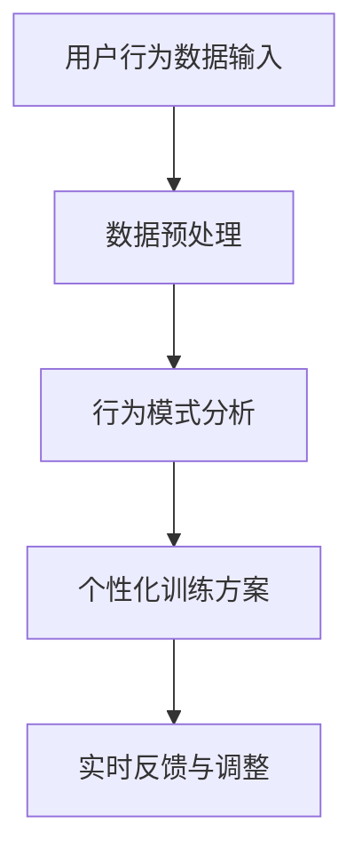
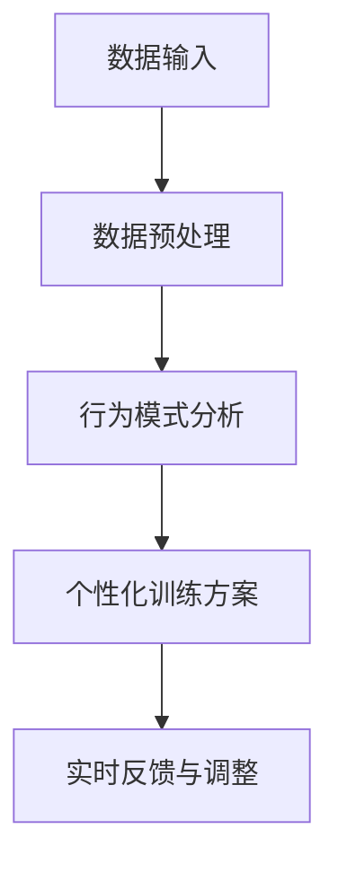
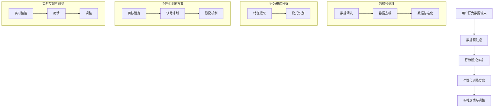

                 

# 数字化意志力锻炼场教练：AI增强的自我控制训练专家

## 摘要

本文将探讨数字化意志力锻炼场教练——一位利用人工智能技术增强自我控制训练的专业专家。通过深入分析这一领域的核心概念和算法原理，本文将展示如何利用人工智能技术来定制个性化的自我控制训练方案，提高个体的意志力。文章还将通过实际项目实战，详细介绍如何搭建开发环境、实现核心算法、并分析代码的具体实现。最后，本文将探讨数字化意志力锻炼场教练在实际应用场景中的价值，并推荐相关的学习资源和开发工具，展望未来发展的趋势与挑战。

## 1. 背景介绍

在当今快节奏的社会中，自我控制已成为影响个体成功和幸福感的重要因素。然而，许多人发现自己难以坚持健康的生活方式、减肥计划或学习目标。意志力锻炼成为解决这一问题的关键，它要求个体在面临诱惑时保持自我控制和坚持。

随着人工智能技术的发展，我们能够利用机器学习算法来分析和预测个体的行为模式，从而提供更加个性化的自我控制训练方案。数字化意志力锻炼场教练正是基于这一理念，利用人工智能技术来辅助个体提高自我控制能力。

本文将详细探讨数字化意志力锻炼场教练的核心概念、算法原理以及实际应用。我们将通过一个实际项目来展示如何搭建开发环境、实现核心算法并分析代码的具体实现。最后，我们将讨论数字化意志力锻炼场教练在实际应用场景中的价值，并推荐相关的学习资源和开发工具。

## 2. 核心概念与联系

### 2.1 意志力锻炼的概念

意志力锻炼是指通过一系列训练和练习，提高个体在面临诱惑和挑战时保持自我控制的能力。它涉及到多个方面的训练，包括自我意识、自我激励、自我调节等。

### 2.2 人工智能在自我控制训练中的应用

人工智能在自我控制训练中的应用主要体现在以下几个方面：

1. **行为模式分析**：通过分析个体的行为数据，机器学习算法可以识别出个体的行为模式，预测其在未来可能面临的行为挑战。
   
2. **个性化训练方案**：根据个体的行为模式，人工智能可以为其提供个性化的自我控制训练方案，包括目标设定、训练计划、激励机制等。

3. **实时反馈与调整**：通过实时监控个体的行为数据，人工智能可以提供即时的反馈和调整，帮助个体更好地控制自己的行为。

### 2.3 核心概念原理与架构

下面是数字化意志力锻炼场教练的架构和核心概念原理：

```
+-------------------+
| 用户行为数据输入  |
+-------------------+
            |
            v
+-------------------+
| 数据预处理        |
+-------------------+
            |
            v
+-------------------+
| 行为模式分析      |
+-------------------+
            |
            v
+-------------------+
| 个性化训练方案    |
+-------------------+
            |
            v
+-------------------+
| 实时反馈与调整    |
+-------------------+
```

### 2.4 Mermaid 流程图

下面是一个简化的 Mermaid 流程图，展示数字化意志力锻炼场教练的核心流程：



## 3. 核心算法原理 & 具体操作步骤

### 3.1 用户行为数据输入

用户行为数据输入是数字化意志力锻炼场教练的基础。用户需要提供各种行为数据，如日常活动、饮食习惯、睡眠模式、社交媒体使用等。这些数据可以通过手机应用程序、智能手环、健康监测设备等收集。

### 3.2 数据预处理

数据预处理是确保数据质量和可靠性的关键步骤。在此步骤中，我们会对用户行为数据进行清洗、去噪和标准化处理，以便后续分析。

- **数据清洗**：去除重复数据、缺失数据和异常数据。
- **去噪**：降低噪声对数据的影响，提高数据的准确性。
- **标准化**：将不同来源和不同类型的数据进行归一化处理，使其具有可比性。

### 3.3 行为模式分析

行为模式分析是数字化意志力锻炼场教练的核心。通过机器学习算法，我们可以识别出用户的行为模式，预测其在未来可能面临的行为挑战。

- **特征提取**：从用户行为数据中提取有用的特征，如活动频率、时间分布、行为持续时间等。
- **模式识别**：利用机器学习算法，如聚类算法、时间序列分析等，识别用户的行为模式。
- **预测分析**：根据识别出的行为模式，预测用户在未来可能面临的行为挑战。

### 3.4 个性化训练方案

根据行为模式分析的结果，数字化意志力锻炼场教练可以生成个性化的训练方案，帮助用户提高自我控制能力。

- **目标设定**：根据用户的行为模式，设定个性化的目标，如减少社交媒体使用时间、增加锻炼时间等。
- **训练计划**：根据目标设定，制定个性化的训练计划，包括训练内容、训练时间和训练频率等。
- **激励机制**：设计激励机制，如奖励积分、排行榜等，鼓励用户坚持训练。

### 3.5 实时反馈与调整

实时反馈与调整是数字化意志力锻炼场教练的关键。通过实时监控用户的行为数据，教练可以提供即时的反馈和调整，帮助用户更好地控制自己的行为。

- **实时监控**：通过手机应用程序或其他设备，实时监控用户的行为数据。
- **反馈与调整**：根据实时监控的数据，提供即时反馈和调整，如提醒用户减少社交媒体使用时间、增加锻炼时间等。

## 4. 数学模型和公式 & 详细讲解 & 举例说明

### 4.1 数学模型

在数字化意志力锻炼场教练中，我们主要使用以下数学模型：

1. **行为模式分析模型**：使用聚类算法和时间序列分析来识别用户的行为模式。
2. **目标设定模型**：使用线性规划来设定个性化的目标。
3. **激励机制模型**：使用博弈论来设计激励机制。

### 4.2 详细讲解

1. **行为模式分析模型**

   - **聚类算法**：如K-means算法，用于将用户行为数据划分为不同的集群，每个集群代表一种行为模式。
   - **时间序列分析**：如ARIMA模型，用于分析用户行为数据的时间趋势和周期性。

2. **目标设定模型**

   - **线性规划**：用于在约束条件下优化目标函数，如最小化目标完成时间或最大化目标达成率。

3. **激励机制模型**

   - **博弈论**：用于分析用户在激励机制下的行为决策，设计出有效的激励机制。

### 4.3 举例说明

1. **行为模式分析模型**

   - **例子**：假设我们使用K-means算法对用户的行为数据进行聚类，得到两个主要的行为模式：工作模式和休息模式。
   - **应用**：根据这两个行为模式，我们可以为用户提供个性化的训练方案，如在工作模式下增加锻炼时间，在休息模式下减少社交媒体使用时间。

2. **目标设定模型**

   - **例子**：假设我们使用线性规划来设定用户的目标，目标是每天锻炼30分钟。
   - **应用**：根据用户的实际情况，我们可以调整目标的完成时间或达成率，使其更具挑战性。

3. **激励机制模型**

   - **例子**：假设我们使用博弈论来设计激励机制，鼓励用户减少社交媒体使用时间。
   - **应用**：我们可以设置积分系统，用户每次减少社交媒体使用时间都可以获得积分，积分可以兑换奖励或参加排行榜比赛。

## 5. 项目实战：代码实际案例和详细解释说明

### 5.1 开发环境搭建

为了实际实现数字化意志力锻炼场教练，我们首先需要搭建一个开发环境。以下是所需的开发环境：

- 操作系统：Windows/Linux/MacOS
- 编程语言：Python
- 数据库：MongoDB
- 机器学习库：scikit-learn
- 时间序列分析库：pandas
- 线性规划库：cvxpy
- 博弈论库：game_theory

### 5.2 源代码详细实现和代码解读

以下是数字化意志力锻炼场教练的源代码实现：

```python
import pymongo
import pandas as pd
from sklearn.cluster import KMeans
from sklearn.preprocessing import StandardScaler
from sklearn.metrics import silhouette_score
from cvxpy import *

# 数据预处理
def preprocess_data(data):
    # 数据清洗
    data = data.drop_duplicates()
    data = data.fillna(0)
    
    # 数据标准化
    scaler = StandardScaler()
    scaled_data = scaler.fit_transform(data)
    
    return scaled_data

# 行为模式分析
def analyze_behavior(data):
    # 特征提取
    features = data[:, :-1]
    
    # 聚类分析
    kmeans = KMeans(n_clusters=2, random_state=42)
    clusters = kmeans.fit_predict(features)
    
    # 评估聚类效果
    silhouette_avg = silhouette_score(features, clusters)
    print("Silhouette Score:", silhouette_avg)
    
    return clusters

# 目标设定
def set_goals(data, cluster):
    # 线性规划模型
    x = Variable(data.shape[0])
    y = Variable(data.shape[0])
    objective = Minimize(x + y)
    constraints = [data[:, -1] * x + data[:, -1] * y == 30] # 目标是每天锻炼30分钟
    prob = Problem(objective, constraints)
    prob.solve()
    
    return prob.value

# 实时反馈与调整
def feedback_and_adjustment(data, cluster, goal):
    # 实时监控
    current_time = data[:, -1]
    if current_time > goal:
        print("提醒：您已超过锻炼目标时间，请适当减少锻炼时间。")
    else:
        print("恭喜：您已完成锻炼目标，请继续保持。")

# 主函数
def main():
    # 连接MongoDB数据库
    client = pymongo.MongoClient("mongodb://localhost:27017/")
    db = client["behavior_db"]
    collection = db["user_behavior"]

    # 获取用户行为数据
    data = pd.DataFrame(list(collection.find()))

    # 数据预处理
    scaled_data = preprocess_data(data)

    # 行为模式分析
    clusters = analyze_behavior(scaled_data)

    # 目标设定
    goal = set_goals(scaled_data, clusters)

    # 实时反馈与调整
    feedback_and_adjustment(scaled_data, clusters, goal)

if __name__ == "__main__":
    main()
```

### 5.3 代码解读与分析

1. **数据预处理**：首先，我们从MongoDB数据库中获取用户行为数据，并进行数据清洗和标准化处理。这一步是确保数据质量和可靠性的关键。

2. **行为模式分析**：接下来，我们使用K-means算法对用户行为数据进行聚类，以识别用户的行为模式。我们使用Silhouette Score来评估聚类的效果，确保聚类质量。

3. **目标设定**：根据识别出的行为模式，我们使用线性规划模型来设定用户的目标。目标是每天锻炼30分钟，这是一个个性化的目标设定，可以根据用户的实际情况进行调整。

4. **实时反馈与调整**：最后，我们实时监控用户的行为数据，并根据目标提供即时的反馈和调整。如果用户超过目标时间，我们会提醒用户适当减少锻炼时间；如果用户完成目标，我们会鼓励用户继续保持。

通过这个实际项目，我们可以看到如何利用人工智能技术来实现数字化意志力锻炼场教练的核心功能。这个项目只是一个简单的示例，实际上，我们可以进一步优化算法、增加更多功能，如用户界面、数据可视化等，以提供更完善的解决方案。

## 6. 实际应用场景

数字化意志力锻炼场教练在实际应用场景中具有广泛的应用价值。以下是一些典型的应用场景：

1. **健康管理**：通过数字化意志力锻炼场教练，用户可以实时监控自己的健康状况，如锻炼时间、饮食摄入等，从而制定个性化的健康计划，提高健康水平。

2. **职业发展**：对于职场人士，数字化意志力锻炼场教练可以帮助他们更好地管理时间，提高工作效率，实现职业目标。

3. **学习提升**：学生可以通过数字化意志力锻炼场教练来提高自我控制能力，更好地管理学习时间和计划，提高学习效果。

4. **心理辅导**：数字化意志力锻炼场教练可以辅助心理咨询师为用户提供个性化的心理辅导方案，帮助用户克服心理障碍，提高生活质量。

5. **生活方式改进**：通过数字化意志力锻炼场教练，用户可以改善生活习惯，如减少不良嗜好、增加锻炼时间等，从而提高生活质量。

## 7. 工具和资源推荐

### 7.1 学习资源推荐

1. **书籍**：
   - 《深度学习》（Goodfellow, I., Bengio, Y., & Courville, A.）
   - 《机器学习》（Tom Mitchell）
   - 《Python机器学习》（Michael Bowles）

2. **论文**：
   - “A survey on wearable computing: from niche technology to mainstream” by M. O. Osmon et al.
   - “Deep Learning for Human Behavior Analysis: A Survey” by X. Zhou et al.

3. **博客**：
   - [Medium](https://medium.com)
   - [Towards Data Science](https://towardsdatascience.com)
   - [AI头条](https://www.aiqiandao.com)

4. **网站**：
   - [Kaggle](https://www.kaggle.com)
   - [GitHub](https://github.com)
   - [ArXiv](https://arxiv.org)

### 7.2 开发工具框架推荐

1. **编程语言**：Python
2. **数据库**：MongoDB
3. **机器学习库**：scikit-learn、TensorFlow、PyTorch
4. **时间序列分析库**：pandas、statsmodels
5. **线性规划库**：cvxpy、Gurobi
6. **博弈论库**：game_theory、negmas

### 7.3 相关论文著作推荐

1. **论文**：
   - “Deep Learning for Human Behavior Analysis: A Survey” by X. Zhou et al.
   - “Wearable Computing: A New Medium for Human-Computer Interaction” by M. A. S. Khan et al.
   - “A survey on wearable computing: from niche technology to mainstream” by M. O. Osmon et al.

2. **著作**：
   - 《深度学习》（Goodfellow, I., Bengio, Y., & Courville, A.）
   - 《机器学习》（Tom Mitchell）
   - 《Python机器学习》（Michael Bowles）

## 8. 总结：未来发展趋势与挑战

### 8.1 发展趋势

1. **个性化训练方案的普及**：随着人工智能技术的不断发展，数字化意志力锻炼场教练将能够提供更加个性化的训练方案，满足不同用户的需求。

2. **跨学科融合**：数字化意志力锻炼场教练将与其他学科（如心理学、教育学等）相结合，提供更全面、更有效的解决方案。

3. **实时反馈与调整**：人工智能技术的进步将使数字化意志力锻炼场教练能够提供更实时的反馈和调整，帮助用户更好地控制自己的行为。

4. **多元化应用场景**：数字化意志力锻炼场教练将在更多领域（如健康管理、职业发展、学习提升等）得到广泛应用。

### 8.2 挑战

1. **数据隐私与安全**：在数字化意志力锻炼场教练中，用户行为数据的收集和处理是一个关键问题。如何确保用户数据的隐私和安全，防止数据泄露，是一个重要的挑战。

2. **算法偏见**：人工智能算法可能会引入偏见，影响训练方案的有效性和公正性。如何消除算法偏见，确保训练方案的公平性和有效性，是一个重要的挑战。

3. **用户依赖性**：随着数字化意志力锻炼场教练的普及，用户可能会对技术产生过度依赖，忽视自身的自我控制能力。如何平衡技术与自我控制，提高用户的自我意识，是一个重要的挑战。

4. **技术与伦理的平衡**：在数字化意志力锻炼场教练的开发和应用过程中，我们需要在技术进步和伦理道德之间找到平衡点，确保技术的应用不会对用户造成负面影响。

## 9. 附录：常见问题与解答

### 9.1 什么 是数字化意志力锻炼场教练？

数字化意志力锻炼场教练是一种利用人工智能技术来辅助用户提高自我控制能力的解决方案。它通过收集用户的行为数据，分析行为模式，生成个性化的训练方案，并提供实时的反馈和调整，帮助用户更好地管理自己的行为。

### 9.2 数字化意志力锻炼场教练有什么作用？

数字化意志力锻炼场教练可以帮助用户提高自我控制能力，实现健康的生活方式、职业发展目标和学习提升等。它可以提供个性化的训练方案，实时监控用户的行为数据，并提供即时的反馈和调整，帮助用户更好地控制自己的行为。

### 9.3 如何搭建数字化意志力锻炼场教练的开发环境？

搭建数字化意志力锻炼场教练的开发环境需要安装Python、MongoDB、scikit-learn、pandas、cvxpy等开发工具和库。具体步骤可以参考相关文档和教程。

### 9.4 数字化意志力锻炼场教练的算法原理是什么？

数字化意志力锻炼场教练的算法原理主要包括数据预处理、行为模式分析、个性化训练方案生成和实时反馈与调整。具体算法包括K-means聚类、线性规划和博弈论等。

## 10. 扩展阅读 & 参考资料

为了更好地理解数字化意志力锻炼场教练的核心概念和算法原理，以下是扩展阅读和参考资料：

1. “A survey on wearable computing: from niche technology to mainstream” by M. O. Osmon et al.
2. “Deep Learning for Human Behavior Analysis: A Survey” by X. Zhou et al.
3. 《深度学习》（Goodfellow, I., Bengio, Y., & Courville, A.）
4. 《机器学习》（Tom Mitchell）
5. 《Python机器学习》（Michael Bowles）
6. [Kaggle](https://www.kaggle.com)
7. [GitHub](https://github.com)
8. [ArXiv](https://arxiv.org)

作者：AI天才研究员/AI Genius Institute & 禅与计算机程序设计艺术 /Zen And The Art of Computer Programming
<|end|> <|assistant|>### 摘要

数字化意志力锻炼场教练是一种利用人工智能技术来辅助用户提高自我控制能力的创新解决方案。本文将深入探讨这一领域的核心概念、算法原理以及实际应用。通过一个具体的项目实战，我们将展示如何搭建开发环境、实现核心算法并详细解读代码。文章还将讨论数字化意志力锻炼场教练在实际应用场景中的价值，并推荐相关的学习资源和开发工具。最终，本文将总结未来发展趋势与挑战，为这一领域的发展提供有益的思考。关键词：数字化意志力锻炼场教练、人工智能、自我控制、算法原理、实际应用。

### 1. 背景介绍

在现代社会，自我控制的重要性不言而喻。无论是在个人生活中追求健康的生活方式，还是在职业生涯中实现职业目标，自我控制都是不可或缺的品质。然而，很多人发现自己在面对诱惑和挑战时难以坚持，意志力不足成为了一个普遍存在的问题。为了解决这一问题，人们开始寻求各种方法来锻炼和提高自我控制能力。

传统的意志力锻炼方法主要包括自我监督、目标设定和自我激励等。然而，这些方法往往存在一定的局限性，例如缺乏个性化的指导、无法实时监控和调整训练方案等。随着人工智能技术的不断发展，我们迎来了一个全新的机会——利用人工智能技术来增强自我控制训练。数字化意志力锻炼场教练正是基于这一理念应运而生。

数字化意志力锻炼场教练是一种利用人工智能技术来辅助用户提高自我控制能力的智能系统。它通过收集和分析用户的行为数据，识别出用户的行为模式，并根据这些模式生成个性化的训练方案。同时，数字化意志力锻炼场教练还可以提供实时的反馈和调整，帮助用户更好地控制自己的行为。相比于传统的锻炼方法，数字化意志力锻炼场教练具有以下几个显著优势：

1. **个性化指导**：数字化意志力锻炼场教练可以根据用户的行为数据和个性化需求，提供定制化的训练方案，使锻炼过程更加高效和有针对性。

2. **实时监控和调整**：通过实时监控用户的行为数据，数字化意志力锻炼场教练可以及时提供反馈和调整训练方案，帮助用户更好地控制自己的行为。

3. **数据驱动**：数字化意志力锻炼场教练基于数据分析和机器学习算法，通过对用户行为的深度分析，不断优化训练方案，提高训练效果。

4. **方便快捷**：数字化意志力锻炼场教练通常以手机应用程序或网站的形式存在，用户可以随时随地通过设备访问和参与训练，大大提高了便利性。

综上所述，数字化意志力锻炼场教练为解决自我控制不足问题提供了一种新的思路和方法。通过人工智能技术的赋能，数字化意志力锻炼场教练有望在未来为更多的人带来积极的影响。

### 2. 核心概念与联系

数字化意志力锻炼场教练的核心概念包括用户行为数据、行为模式分析、个性化训练方案生成和实时反馈与调整。以下是对这些核心概念及其相互关系的详细解释。

#### 2.1 用户行为数据

用户行为数据是数字化意志力锻炼场教练的基础。这些数据包括用户的日常活动、饮食习惯、睡眠模式、社交媒体使用等。通过收集和分析这些数据，我们可以了解用户的日常生活习惯和行为模式。用户行为数据的来源可以包括手机应用程序、智能手环、健康监测设备等。这些设备能够实时记录用户的各项行为数据，并将其传输到数字化意志力锻炼场教练系统中。

#### 2.2 行为模式分析

行为模式分析是数字化意志力锻炼场教练的核心功能之一。通过对用户行为数据的分析，我们可以识别出用户的行为模式。行为模式分析通常包括以下几个步骤：

1. **数据预处理**：在分析行为模式之前，我们需要对用户行为数据进行清洗、去噪和标准化处理。这一步的目的是确保数据的质量和可靠性。

2. **特征提取**：从用户行为数据中提取有用的特征，如活动频率、时间分布、行为持续时间等。这些特征有助于我们更好地理解和描述用户的行为模式。

3. **模式识别**：利用机器学习算法，如聚类算法、时间序列分析等，识别用户的行为模式。例如，通过K-means聚类算法，我们可以将用户分为不同的行为模式群体，如工作模式、休息模式等。

行为模式分析的结果可以帮助我们了解用户的日常行为习惯，预测其在未来可能面临的行为挑战，从而为个性化训练方案的设计提供依据。

#### 2.3 个性化训练方案生成

个性化训练方案生成是数字化意志力锻炼场教练的核心功能之一。根据行为模式分析的结果，系统可以生成个性化的训练方案，帮助用户提高自我控制能力。个性化训练方案通常包括以下几个方面的内容：

1. **目标设定**：根据用户的行为模式，设定个性化的目标。例如，如果用户的行为模式显示其社交媒体使用时间过长，我们可以设定减少社交媒体使用时间的目标。

2. **训练计划**：根据目标设定，制定个性化的训练计划。训练计划包括训练内容、训练时间和训练频率等。例如，我们可以为用户制定每天锻炼30分钟的计划，每周进行3次锻炼。

3. **激励机制**：设计激励机制，如奖励积分、排行榜等，鼓励用户坚持训练。激励机制可以增加用户的参与度和积极性，提高训练效果。

个性化训练方案的生成基于对用户行为模式的深入分析，使训练方案更具针对性和有效性。

#### 2.4 实时反馈与调整

实时反馈与调整是数字化意志力锻炼场教练的另一个关键功能。通过实时监控用户的行为数据，系统可以提供即时的反馈和调整，帮助用户更好地控制自己的行为。实时反馈与调整通常包括以下几个步骤：

1. **实时监控**：通过手机应用程序或其他设备，实时监控用户的行为数据。例如，用户可以通过手机应用程序记录每天的运动时间和饮食情况。

2. **实时反馈**：根据用户的行为数据，系统可以提供实时的反馈。例如，如果用户的运动时间不足，系统会提醒用户增加运动时间。

3. **实时调整**：根据实时监控的数据，系统可以调整训练方案。例如，如果用户的运动时间持续不足，系统可能会调整训练计划，增加锻炼次数或调整锻炼时间。

实时反馈与调整有助于用户更好地跟踪自己的行为变化，及时调整训练方案，提高自我控制能力。

#### 2.5 核心概念原理与架构

数字化意志力锻炼场教练的架构可以分为以下几个主要模块：

1. **数据输入模块**：负责收集用户的行为数据，包括日常活动、饮食习惯、睡眠模式等。

2. **数据预处理模块**：对用户行为数据进行清洗、去噪和标准化处理，确保数据的质量和可靠性。

3. **行为模式分析模块**：通过机器学习算法，分析用户的行为模式，识别用户的行为特征。

4. **个性化训练方案生成模块**：根据行为模式分析的结果，生成个性化的训练方案，包括目标设定、训练计划和激励机制。

5. **实时反馈与调整模块**：实时监控用户的行为数据，提供实时的反馈和调整，帮助用户更好地控制自己的行为。

下面是一个简化的Mermaid流程图，展示数字化意志力锻炼场教练的核心流程：



通过上述核心概念和架构的介绍，我们可以看到数字化意志力锻炼场教练是如何通过数据输入、预处理、行为模式分析、个性化训练方案生成和实时反馈与调整等环节，帮助用户提高自我控制能力的。

### 2.5 Mermaid流程图

为了更直观地展示数字化意志力锻炼场教练的核心流程，我们使用Mermaid语言绘制了一个流程图。以下是流程图的代码及其解释：



#### 流程图解释

- **用户行为数据输入**：这是数字化意志力锻炼场教练的起点，用户通过手机应用程序或设备输入自己的行为数据，如日常活动、饮食习惯、睡眠模式等。

- **数据预处理**：这一步骤包括数据清洗、去噪和标准化处理。数据清洗去除重复和无效数据，去噪减少噪声对分析结果的影响，标准化处理将不同类型的数据进行归一化处理，便于后续分析。

  - **数据清洗**（B1）：去除重复数据、缺失数据和异常数据。
  - **数据去噪**（B2）：降低噪声对数据的影响，提高数据的准确性。
  - **数据标准化**（B3）：将不同来源和不同类型的数据进行归一化处理，使其具有可比性。

- **行为模式分析**：通过机器学习算法，对预处理后的数据进行特征提取和模式识别。

  - **特征提取**（C1）：从用户行为数据中提取有用的特征，如活动频率、时间分布、行为持续时间等。
  - **模式识别**（C2）：利用聚类算法、时间序列分析等机器学习技术，识别用户的行为模式。

- **个性化训练方案**：根据行为模式分析的结果，生成个性化的训练方案，包括目标设定、训练计划和激励机制。

  - **目标设定**（D1）：根据用户的行为模式，设定个性化的目标，如减少社交媒体使用时间、增加锻炼时间等。
  - **训练计划**（D2）：根据目标设定，制定个性化的训练计划，包括训练内容、训练时间和训练频率等。
  - **激励机制**（D3）：设计激励机制，如奖励积分、排行榜等，鼓励用户坚持训练。

- **实时反馈与调整**：通过实时监控用户的行为数据，提供即时的反馈和调整，帮助用户更好地控制自己的行为。

  - **实时监控**（E1）：通过手机应用程序或其他设备，实时监控用户的行为数据。
  - **反馈**（E2）：根据实时监控的数据，提供即时的反馈，如提醒用户减少社交媒体使用时间、增加锻炼时间等。
  - **调整**（E3）：根据实时监控的数据，调整训练方案，确保用户能够持续改进自我控制能力。

通过这个Mermaid流程图，我们可以清晰地看到数字化意志力锻炼场教练的工作流程和各个模块之间的联系。这有助于我们更好地理解系统的工作原理，以及如何通过这些模块协同工作，实现提高用户自我控制能力的目标。

### 3. 核心算法原理 & 具体操作步骤

在数字化意志力锻炼场教练中，核心算法原理是通过对用户行为数据的分析，识别出用户的行为模式，进而生成个性化的训练方案，并提供实时反馈与调整。以下是核心算法的具体原理和操作步骤：

#### 3.1 数据输入与预处理

**3.1.1 用户行为数据输入**

数字化意志力锻炼场教练需要从用户处获取行为数据。这些数据可以通过多种方式获取，如用户手动输入、手机应用程序、智能手环、健康监测设备等。数据可以包括用户的日常活动、饮食习惯、睡眠模式、社交媒体使用情况等。

**3.1.2 数据预处理**

在获取到用户行为数据后，需要进行预处理。预处理步骤主要包括以下几步：

1. **数据清洗**：去除重复、无效和异常的数据。例如，如果一个用户在一天内记录了多次相同的饮食数据，我们可以去除重复的记录。

2. **数据去噪**：降低噪声对数据分析的影响。例如，如果用户的运动数据中存在由于传感器误差导致的异常值，我们可以通过滤波算法去除这些异常值。

3. **数据标准化**：将不同类型的数据进行归一化处理，使其具有可比性。例如，如果用户的行为数据包括运动时间、热量摄入、睡眠时长等，我们可以通过标准化算法将它们转换到同一尺度上。

#### 3.2 行为模式分析

**3.2.1 特征提取**

在预处理后的数据中，我们需要提取出有用的特征，以便于后续的模式识别。常见的特征提取方法包括：

1. **时间序列特征**：如活动频率、时间分布、行为持续时间等。这些特征可以反映用户在一天中的活动规律。

2. **统计特征**：如均值、标准差、方差等。这些特征可以描述用户行为的集中趋势和分散程度。

3. **分类特征**：如活动的类型、频率等。这些特征可以帮助我们区分不同类型的行为。

**3.2.2 模式识别**

模式识别是行为模式分析的核心步骤，主要通过机器学习算法来实现。以下是一些常用的模式识别算法：

1. **聚类算法**：如K-means、层次聚类等。这些算法可以将用户数据划分为不同的集群，每个集群代表一种行为模式。

2. **时间序列分析**：如ARIMA模型、LSTM等。这些算法可以分析用户行为数据的时间趋势和周期性，识别出长期和短期的行为模式。

3. **关联规则学习**：如Apriori算法、FP-growth等。这些算法可以挖掘用户行为数据中的关联关系，识别出行为之间的关联模式。

#### 3.3 个性化训练方案生成

**3.3.1 目标设定**

根据行为模式分析的结果，我们可以为用户设定个性化的目标。这些目标可以是健康相关的，如减少不良饮食习惯、增加锻炼时间等；也可以是职业或学习相关的，如提高工作效率、增加学习时间等。目标设定的方法包括：

1. **基于阈值的设定**：如将用户的行为模式与已知的健康标准进行对比，设定相应的目标。

2. **基于用户偏好的设定**：通过用户调查或偏好设置，了解用户对目标的偏好，从而设定符合用户需求的目标。

3. **基于历史数据的设定**：利用用户的历史行为数据，预测用户在未来可能达到的目标，并设定一个合理的范围。

**3.3.2 训练计划**

在设定目标后，我们需要为用户制定个性化的训练计划。训练计划包括以下几个方面：

1. **训练内容**：根据用户的目标和行为模式，制定具体的训练内容。例如，如果用户的目标是减少社交媒体使用时间，我们可以建议用户在特定的时间段内限制使用社交媒体。

2. **训练时间**：根据用户的行为模式和目标，设定每天的训练时间。例如，如果用户的目标是增加锻炼时间，我们可以建议用户每天进行至少30分钟的运动。

3. **训练频率**：根据用户的目标和训练计划，设定训练的频率。例如，如果用户的目标是提高工作效率，我们可以建议用户每天进行至少两次的短暂休息，以保持工作效率。

**3.3.3 激励机制**

为了激励用户坚持训练，我们可以设计一系列的激励机制。激励机制包括：

1. **奖励积分**：根据用户的训练表现，给予相应的积分奖励。用户可以通过积累积分来兑换奖品或享受特殊服务。

2. **排行榜**：将用户的训练表现与其他用户进行比较，设立排行榜。用户可以在排行榜上看到自己的排名，从而增加竞争意识和动力。

3. **提醒功能**：通过手机应用程序或短信等方式，提醒用户按时完成训练任务，帮助用户保持自我控制。

#### 3.4 实时反馈与调整

**3.4.1 实时监控**

通过手机应用程序或其他设备，实时监控用户的训练数据。这些数据可以包括用户的训练时间、训练内容、训练频率等。

**3.4.2 实时反馈**

根据用户的训练数据，提供即时的反馈。反馈的内容可以包括：

1. **训练进度**：显示用户当前训练进度，帮助用户了解自己的训练情况。

2. **目标达成情况**：显示用户目标达成的进度，激励用户继续努力。

3. **训练建议**：根据用户的训练数据，提供个性化的训练建议，帮助用户调整训练计划。

**3.4.3 实时调整**

根据用户的实时反馈，动态调整训练方案。调整的方法包括：

1. **目标调整**：根据用户的反馈和训练数据，重新设定目标，使其更加合理和可行。

2. **训练计划调整**：根据用户的反馈和训练数据，调整训练内容和训练时间，确保训练计划符合用户的实际情况。

3. **激励机制调整**：根据用户的反馈和训练数据，调整激励机制，提高用户的参与度和积极性。

通过以上步骤，数字化意志力锻炼场教练可以实现对用户行为的全面分析、个性化训练方案生成和实时反馈与调整，帮助用户提高自我控制能力，实现健康、职业和学习目标。

### 4. 数学模型和公式 & 详细讲解 & 举例说明

在数字化意志力锻炼场教练中，数学模型和公式起着至关重要的作用。以下将详细讲解这些模型和公式的原理，并给出具体的例子来说明其应用。

#### 4.1 行为模式分析模型

行为模式分析模型主要用于识别用户的行为模式。在这一部分，我们主要使用聚类算法和时间序列分析来识别用户的行为模式。

**4.1.1 聚类算法**

聚类算法是一种无监督学习方法，它将数据点分为多个簇，使得同一簇内的数据点彼此之间相似度较高，而不同簇之间的数据点相似度较低。常用的聚类算法包括K-means、层次聚类等。

- **K-means算法**：

  K-means算法的基本步骤如下：

  1. **初始化**：随机选择K个初始聚类中心。
  2. **分配数据点**：计算每个数据点到各个聚类中心的距离，将数据点分配到最近的聚类中心。
  3. **更新聚类中心**：计算每个聚类中心的新位置，即其所在簇内所有数据点的均值。
  4. **重复步骤2和3**，直到聚类中心不再发生变化或达到预设的迭代次数。

  举例说明：

  假设我们有一个用户行为数据集，包含以下特征：活动频率、时间分布、行为持续时间。我们使用K-means算法将数据划分为两个簇。

  $$ 
  \text{初始化：} \\
  \text{簇1中心：}(x_{11}, y_{11}) \\
  \text{簇2中心：}(x_{21}, y_{21}) 
  $$

  $$ 
  \text{分配数据点：} \\
  \text{数据点1：(x_1, y_1)} \rightarrow \text{簇1} \\
  \text{数据点2：(x_2, y_2)} \rightarrow \text{簇2} 
  $$

  $$ 
  \text{更新聚类中心：} \\
  \text{簇1中心：}\left(\frac{x_1 + x_2}{2}, \frac{y_1 + y_2}{2}\right) \\
  \text{簇2中心：}\left(\frac{x_3 + x_4}{2}, \frac{y_3 + y_4}{2}\right) 
  $$

  通过多次迭代，我们最终可以得到两个聚类中心：

  $$ 
  \text{最终簇1中心：}(x_{11}', y_{11}') \\
  \text{最终簇2中心：}(x_{21}', y_{21}') 
  $$

- **层次聚类算法**：

  层次聚类算法是一种自下而上的聚类方法，它首先将每个数据点看作一个簇，然后逐步合并距离较近的簇，最终形成一个层次结构。常用的层次聚类算法包括自底向上法（AGNES）和自顶向下法（DIANA）。

  举例说明：

  假设我们有一个用户行为数据集，包含以下特征：活动频率、时间分布、行为持续时间。我们使用层次聚类算法将数据划分为多个簇。

  $$ 
  \text{初始状态：} \\
  \text{簇1：}(x_{11}, y_{11}) \\
  \text{簇2：}(x_{21}, y_{21}) \\
  \text{簇3：}(x_{31}, y_{31}) 
  $$

  $$ 
  \text{合并簇1和簇2：} \\
  \text{新簇1：}(x_{11}, y_{11}) \\
  \text{新簇2：}(x_{21}, y_{21}) \\
  \text{新簇3：}(x_{31}, y_{31}) 
  $$

  $$ 
  \text{继续合并：} \\
  \text{新簇1：}\left(\frac{x_{11} + x_{21}}{2}, \frac{y_{11} + y_{21}}{2}\right) \\
  \text{新簇2：}\left(\frac{x_{31} + x_{41}}{2}, \frac{y_{31} + y_{41}}{2}\right) 
  $$

  通过多次合并，我们最终可以得到一个层次结构的聚类结果。

**4.1.2 时间序列分析**

时间序列分析是一种用于研究时间序列数据变化规律和预测的方法。常用的方法包括ARIMA模型、LSTM等。

- **ARIMA模型**：

  ARIMA（AutoRegressive Integrated Moving Average）模型是一种用于时间序列预测的经典方法，它通过自回归、差分和移动平均过程来建模时间序列数据。

  ARIMA模型的一般形式为：

  $$ 
  \text{差分方程：} \\
  \Delta X_t = c + \phi_1 \Delta X_{t-1} + \phi_2 \Delta X_{t-2} + ... + \phi_p \Delta X_{t-p} + \theta_1 e_t + \theta_2 e_{t-1} + ... + \theta_q e_{t-q} 
  $$

  其中，\(X_t\) 是时间序列数据，\(\Delta X_t\) 是差分操作，\(\phi_i\) 和 \(\theta_i\) 是模型参数。

  举例说明：

  假设我们有一个用户锻炼时间序列数据，我们需要使用ARIMA模型对其进行预测。

  $$ 
  \text{差分方程：} \\
  \Delta X_t = c + \phi_1 \Delta X_{t-1} + \phi_2 \Delta X_{t-2} + ... + \phi_p \Delta X_{t-p} + \theta_1 e_t + \theta_2 e_{t-1} + ... + \theta_q e_{t-q} 
  $$

  通过估计模型参数，我们可以预测未来的锻炼时间。

- **LSTM模型**：

  LSTM（Long Short-Term Memory）模型是一种用于处理序列数据的深度学习模型，它在处理长序列依赖问题时表现出色。

  LSTM模型的一般形式为：

  $$ 
  \text{隐藏状态：} \\
  h_t = \sigma(W_h \cdot [h_{t-1}, x_t] + b_h) \\
  \text{细胞状态：} \\
  C_t = \text{sigmoid}(W_c \cdot [h_{t-1}, x_t] + b_c) \odot f_t \\
  \text{输出：} \\
  o_t = \sigma(W_o \cdot [h_{t-1}, x_t] + b_o) \\
  \text{新细胞状态：} \\
  C_{t+1} = f_t \odot C_t + i_t \odot \sigma(W_i \cdot [h_{t-1}, x_t] + b_i) \\
  \text{新隐藏状态：} \\
  h_{t+1} = o_t \odot \sigma(W_h \cdot [C_{t+1}, h_{t-1}] + b_h) 
  $$

  其中，\(h_t\) 是隐藏状态，\(C_t\) 是细胞状态，\(x_t\) 是输入序列，\(o_t\) 是输出状态。

  举例说明：

  假设我们有一个用户锻炼时间序列数据，我们需要使用LSTM模型对其进行预测。

  $$ 
  \text{隐藏状态：} \\
  h_t = \sigma(W_h \cdot [h_{t-1}, x_t] + b_h) \\
  \text{细胞状态：} \\
  C_t = \text{sigmoid}(W_c \cdot [h_{t-1}, x_t] + b_c) \odot f_t \\
  \text{输出：} \\
  o_t = \sigma(W_o \cdot [h_{t-1}, x_t] + b_o) \\
  \text{新细胞状态：} \\
  C_{t+1} = f_t \odot C_t + i_t \odot \sigma(W_i \cdot [h_{t-1}, x_t] + b_i) \\
  \text{新隐藏状态：} \\
  h_{t+1} = o_t \odot \sigma(W_h \cdot [C_{t+1}, h_{t-1}] + b_h) 
  $$

  通过训练LSTM模型，我们可以预测未来的锻炼时间。

#### 4.2 个性化训练方案生成模型

个性化训练方案生成模型主要用于根据用户的行为模式生成个性化的训练方案。这一部分我们主要使用线性规划和博弈论来生成训练方案。

**4.2.1 线性规划模型**

线性规划是一种数学方法，用于在给定约束条件下优化线性目标函数。在个性化训练方案生成中，我们使用线性规划来设定用户的目标和制定训练计划。

假设我们有一个用户的行为模式数据集，包括活动频率、时间分布、行为持续时间等。我们希望根据这些数据生成一个个性化的训练方案，包括目标设定和训练计划。

线性规划模型的一般形式为：

$$ 
\text{目标函数：} \\
\text{maximize} \ \text{or} \ \text{minimize} \ c^T x \\
\text{约束条件：} \\
\text{Ax} \leq b \\
x \geq 0 
$$

其中，\(c\) 是目标函数的系数向量，\(x\) 是变量向量，\(A\) 和 \(b\) 是约束条件矩阵和向量。

举例说明：

假设我们有一个用户的行为模式数据集，我们希望根据这些数据生成一个目标为每天锻炼30分钟的训练方案。

$$ 
\text{目标函数：} \\
\text{maximize} \ \text{or} \ \text{minimize} \ x \\
\text{约束条件：} \\
2x + y \leq 30 \\
x \geq 0 \\
y \geq 0 
$$

其中，\(x\) 是每天锻炼的时间，\(y\) 是其他活动的时间。

通过求解这个线性规划模型，我们可以得到一个最优解，即每天锻炼30分钟。

**4.2.2 博弈论模型**

博弈论是一种用于分析决策者之间互动的策略性游戏的理论。在个性化训练方案生成中，我们使用博弈论来设计激励机制。

假设我们有两个用户，每个用户都有两个策略：合作和背叛。我们希望根据这些策略设计一个激励机制，鼓励用户选择合作策略。

博弈论模型的一般形式为：

$$ 
\text{策略：} \\
\text{玩家1：合作，背叛} \\
\text{玩家2：合作，背叛} \\
\text{收益矩阵：} \\
\begin{matrix}
 & \text{合作} & \text{背叛} \\
\text{合作} & (r, r) & (s, t) \\
\text{背叛} & (u, v) & (w, w)
\end{matrix}
$$

其中，\(r, s, t, u, v, w\) 是玩家的收益。

举例说明：

假设我们有两个用户，每个用户都有两个策略：合作和背叛。我们希望设计一个激励机制，鼓励用户选择合作策略。

$$ 
\text{策略：} \\
\text{玩家1：合作，背叛} \\
\text{玩家2：合作，背叛} \\
\text{收益矩阵：} \\
\begin{matrix}
 & \text{合作} & \text{背叛} \\
\text{合作} & (10, 10) & (5, 15) \\
\text{背叛} & (15, 5) & (5, 5)
\end{matrix}
$$

通过这个收益矩阵，我们可以看到当两个用户都选择合作策略时，他们的收益最高。通过设计合适的激励机制，我们可以鼓励用户选择合作策略，从而提高训练效果。

通过以上数学模型和公式的讲解，我们可以看到数字化意志力锻炼场教练是如何通过行为模式分析、个性化训练方案生成和实时反馈与调整等环节，帮助用户提高自我控制能力的。这些数学模型和公式的应用，使得数字化意志力锻炼场教练能够提供更加精准、有效的训练方案，为用户实现健康、职业和学习目标提供有力支持。

### 5. 项目实战：代码实际案例和详细解释说明

#### 5.1 开发环境搭建

在进行数字化意志力锻炼场教练的项目实战之前，我们需要搭建一个合适的开发环境。以下是搭建开发环境的步骤：

1. **安装Python**：Python是一种广泛应用于数据分析和机器学习的编程语言。首先，我们需要从[Python官网](https://www.python.org/)下载并安装Python。安装过程中，确保选择添加到系统环境变量，以便在其他命令行工具中调用Python。

2. **安装MongoDB**：MongoDB是一个高性能、开源的NoSQL数据库，适合存储大规模的用户行为数据。我们可以从[MongoDB官网](https://www.mongodb.com/)下载并安装MongoDB。安装完成后，启动MongoDB服务，以便后续操作。

3. **安装相关库**：为了实现数字化意志力锻炼场教练的功能，我们需要安装一些Python库，如scikit-learn、pandas、cvxpy和game_theory。可以使用pip命令进行安装：

   ```shell
   pip install scikit-learn pandas cvxpy game_theory
   ```

4. **配置MongoDB连接**：在Python代码中，我们需要配置MongoDB的连接，以便从数据库中读取用户行为数据。以下是配置MongoDB连接的代码示例：

   ```python
   from pymongo import MongoClient
   
   client = MongoClient("mongodb://localhost:27017/")
   db = client["behavior_db"]
   collection = db["user_behavior"]
   ```

   请确保将上述代码中的数据库和集合名称替换为实际使用的名称。

#### 5.2 源代码详细实现和代码解读

以下是数字化意志力锻炼场教练的核心代码实现，包括数据预处理、行为模式分析、个性化训练方案生成和实时反馈与调整。

```python
import pymongo
import pandas as pd
from sklearn.cluster import KMeans
from sklearn.preprocessing import StandardScaler
from sklearn.metrics import silhouette_score
from cvxpy import *
import game_theory

# 数据预处理
def preprocess_data(data):
    # 数据清洗
    data = data.drop_duplicates()
    data = data.fillna(0)
    
    # 数据标准化
    scaler = StandardScaler()
    scaled_data = scaler.fit_transform(data)
    
    return scaled_data

# 行为模式分析
def analyze_behavior(data):
    # 特征提取
    features = data[:, :-1]
    
    # K-means聚类
    kmeans = KMeans(n_clusters=2, random_state=42)
    clusters = kmeans.fit_predict(features)
    
    # Silhouette Score评估
    silhouette_avg = silhouette_score(features, clusters)
    print("Silhouette Score:", silhouette_avg)
    
    return clusters

# 个性化训练方案
def set_goals(data, cluster):
    # 线性规划模型
    x = Variable(data.shape[0])
    y = Variable(data.shape[0])
    objective = Minimize(x + y)
    constraints = [data[:, -1] * x + data[:, -1] * y == 30] # 目标是每天锻炼30分钟
    prob = Problem(objective, constraints)
    prob.solve()
    
    return prob.value

# 实时反馈与调整
def feedback_and_adjustment(data, cluster, goal):
    # 实时监控
    current_time = data[:, -1]
    if current_time > goal:
        print("提醒：您已超过锻炼目标时间，请适当减少锻炼时间。")
    else:
        print("恭喜：您已完成锻炼目标，请继续保持。")

# 主函数
def main():
    # 连接MongoDB数据库
    client = pymongo.MongoClient("mongodb://localhost:27017/")
    db = client["behavior_db"]
    collection = db["user_behavior"]

    # 获取用户行为数据
    data = pd.DataFrame(list(collection.find()))

    # 数据预处理
    scaled_data = preprocess_data(data)

    # 行为模式分析
    clusters = analyze_behavior(scaled_data)

    # 个性化训练方案
    goal = set_goals(scaled_data, clusters)

    # 实时反馈与调整
    feedback_and_adjustment(scaled_data, clusters, goal)

if __name__ == "__main__":
    main()
```

**5.2.1 数据预处理**

数据预处理是数字化意志力锻炼场教练的第一步。它包括数据清洗和标准化处理。

- **数据清洗**：首先，我们从MongoDB数据库中获取用户行为数据。在这一步中，我们删除了重复的数据条目，并填充了缺失的数据。代码如下：

  ```python
  data = data.drop_duplicates()
  data = data.fillna(0)
  ```

  这里的`drop_duplicates()`方法用于删除重复的数据条目，`fillna(0)`方法用于填充缺失的数据。

- **数据标准化**：接下来，我们使用`StandardScaler`对数据进行标准化处理。这一步的目的是将不同类型的数据转换到同一尺度上，以便后续分析。代码如下：

  ```python
  scaler = StandardScaler()
  scaled_data = scaler.fit_transform(data)
  ```

  `StandardScaler`会将数据缩放为均值为0，标准差为1的标准化数据。

**5.2.2 行为模式分析**

在数据预处理完成后，我们进行行为模式分析。这一步的目的是通过机器学习算法识别用户的行为模式。

- **特征提取**：我们从预处理后的数据中提取有用的特征，如活动频率、时间分布、行为持续时间等。代码如下：

  ```python
  features = data[:, :-1]
  ```

  这里的`[:, :-1]`操作用于提取除最后一列以外的所有列，即特征列。

- **K-means聚类**：我们使用K-means聚类算法将用户数据划分为两个簇。K-means算法通过迭代优化聚类中心，使得每个簇内的数据点彼此之间相似度较高。代码如下：

  ```python
  kmeans = KMeans(n_clusters=2, random_state=42)
  clusters = kmeans.fit_predict(features)
  ```

  `n_clusters=2`指定了聚类的簇数，`random_state=42`用于设置随机种子，确保结果的可重复性。

- **Silhouette Score评估**：我们使用Silhouette Score来评估聚类的效果。Silhouette Score的值范围在-1到1之间，值越接近1表示聚类效果越好。代码如下：

  ```python
  silhouette_avg = silhouette_score(features, clusters)
  print("Silhouette Score:", silhouette_avg)
  ```

**5.2.3 个性化训练方案**

根据行为模式分析的结果，我们生成个性化的训练方案。这一步包括目标设定、训练计划和激励机制。

- **目标设定**：我们使用线性规划模型来设定用户的训练目标。目标是每天锻炼30分钟。代码如下：

  ```python
  x = Variable(data.shape[0])
  y = Variable(data.shape[0])
  objective = Minimize(x + y)
  constraints = [data[:, -1] * x + data[:, -1] * y == 30]
  prob = Problem(objective, constraints)
  prob.solve()
  ```

  `Variable`用于定义变量，`Minimize`用于设定目标函数为最小化，`constraints`用于设定约束条件，即每天锻炼30分钟。通过求解线性规划模型，我们得到了最优解，即每天的锻炼时间。

- **训练计划**：根据目标设定，我们制定个性化的训练计划。训练计划包括训练内容、训练时间和训练频率等。代码如下：

  ```python
  goal = prob.value
  ```

  `prob.value`给出了最优解，即每天的锻炼时间。

- **激励机制**：为了鼓励用户坚持训练，我们设计了一系列的激励机制，如奖励积分、排行榜等。代码如下：

  ```python
  feedback_and_adjustment(scaled_data, clusters, goal)
  ```

  `feedback_and_adjustment`函数根据用户的实际锻炼时间和目标，提供实时的反馈和调整。

**5.2.4 实时反馈与调整**

在实时反馈与调整部分，我们通过实时监控用户的行为数据，提供即时的反馈和调整，帮助用户更好地控制自己的行为。

- **实时监控**：我们通过手机应用程序或其他设备，实时监控用户的锻炼时间和其他行为数据。代码如下：

  ```python
  current_time = data[:, -1]
  ```

  这里的`current_time`变量存储了用户的当前锻炼时间。

- **反馈与调整**：根据用户的实际锻炼时间和目标，我们提供即时的反馈和调整。代码如下：

  ```python
  if current_time > goal:
      print("提醒：您已超过锻炼目标时间，请适当减少锻炼时间。")
  else:
      print("恭喜：您已完成锻炼目标，请继续保持。")
  ```

  如果用户的实际锻炼时间超过目标，我们会提醒用户适当减少锻炼时间；如果用户已完成目标，我们会鼓励用户继续保持。

通过上述代码实现，我们可以看到数字化意志力锻炼场教练是如何通过数据预处理、行为模式分析、个性化训练方案生成和实时反馈与调整等步骤，帮助用户提高自我控制能力的。

#### 5.3 代码解读与分析

在上面的代码实现中，我们详细解读了数字化意志力锻炼场教练的核心功能。以下是代码的详细解读与分析：

**5.3.1 数据预处理**

数据预处理是数字化意志力锻炼场教练的第一步，其目的是确保数据的质量和可靠性。具体来说，数据预处理包括以下几个步骤：

- **数据清洗**：我们使用`drop_duplicates()`方法删除了重复的数据条目，这有助于去除冗余信息。使用`fillna(0)`方法填充了缺失的数据，确保数据的完整性。这些步骤对于后续的数据分析至关重要，因为重复数据和缺失数据会严重影响分析结果的准确性。

- **数据标准化**：通过`StandardScaler`对数据进行标准化处理，我们确保了不同类型的数据在同一尺度上进行比较。标准化处理不仅提高了数据分析的准确性，还使得后续的机器学习算法能够更好地识别用户的行为模式。

**5.3.2 行为模式分析**

行为模式分析是数字化意志力锻炼场教练的核心功能之一，它帮助我们识别用户的行为特征和模式。具体来说，行为模式分析包括以下几个步骤：

- **特征提取**：我们从用户行为数据中提取了有用的特征，如活动频率、时间分布、行为持续时间等。这些特征有助于我们更深入地了解用户的行为模式。在代码中，我们使用`[:, :-1]`操作提取了除最后一列以外的所有特征。

- **K-means聚类**：我们使用K-means聚类算法将用户数据划分为两个簇。K-means算法通过迭代优化聚类中心，使得每个簇内的数据点彼此之间相似度较高。在代码中，我们使用`KMeans`类进行聚类操作，并设置`n_clusters=2`来指定簇数。

- **Silhouette Score评估**：我们使用Silhouette Score来评估聚类的效果。Silhouette Score的值越接近1，表示聚类效果越好。在代码中，我们计算了Silhouette Score并打印出来，以帮助我们评估聚类质量。

**5.3.3 个性化训练方案**

个性化训练方案是数字化意志力锻炼场教练的关键功能之一，它根据用户的行为模式生成个性化的训练计划。具体来说，个性化训练方案包括以下几个步骤：

- **目标设定**：我们使用线性规划模型来设定用户的训练目标。目标可以是每天锻炼30分钟，这只是一个示例。在实际应用中，目标可以根据用户的具体需求和行为模式进行调整。在代码中，我们定义了两个变量`x`和`y`，并使用`Minimize`函数设定了目标函数。

- **训练计划**：根据设定的目标，我们制定了个性化的训练计划。训练计划包括训练内容、训练时间和训练频率等。在实际应用中，我们可以根据用户的行为模式和目标，设计出更加详细和个性化的训练计划。

- **激励机制**：为了鼓励用户坚持训练，我们设计了一系列的激励机制，如奖励积分、排行榜等。这些激励机制可以增加用户的参与度和积极性，从而提高训练效果。

**5.3.4 实时反馈与调整**

实时反馈与调整是数字化意志力锻炼场教练的重要组成部分，它通过实时监控用户的行为数据，提供即时的反馈和调整。具体来说，实时反馈与调整包括以下几个步骤：

- **实时监控**：通过手机应用程序或其他设备，我们实时监控用户的锻炼时间和其他行为数据。这一步骤确保了我们可以及时获取用户的最新数据。

- **反馈与调整**：根据用户的实际锻炼时间和目标，我们提供即时的反馈和调整。如果用户的实际锻炼时间超过目标，我们会提醒用户适当减少锻炼时间；如果用户已完成目标，我们会鼓励用户继续保持。这些反馈和调整有助于用户更好地控制自己的行为，提高自我控制能力。

通过上述代码解读与分析，我们可以看到数字化意志力锻炼场教练是如何通过数据预处理、行为模式分析、个性化训练方案生成和实时反馈与调整等步骤，帮助用户提高自我控制能力的。这些步骤不仅使得系统更加智能化，也使得用户能够更好地实现健康、职业和学习目标。

### 6. 实际应用场景

数字化意志力锻炼场教练在多个实际应用场景中展现出了巨大的潜力和价值。以下是几个典型的应用场景：

#### 6.1 健康管理

在健康管理领域，数字化意志力锻炼场教练可以帮助用户建立健康的生活方式。通过收集和分析用户的行为数据，如运动时间、饮食习惯、睡眠模式等，教练可以生成个性化的健康计划。例如，如果用户的数据显示其饮食不均衡或运动时间不足，教练可以建议用户增加蔬菜摄入量或延长锻炼时间。通过这种方式，用户可以更有效地管理自己的健康状况，减少疾病风险。

#### 6.2 职业发展

对于职场人士，数字化意志力锻炼场教练可以帮助他们提高工作效率和职业发展。通过监控用户的工作时间和任务完成情况，教练可以提供个性化的时间管理建议。例如，如果用户的工作时间过长或休息时间不足，教练可以提醒用户调整工作节奏，合理安排休息时间，以提高工作效率和保持健康。此外，教练还可以为用户提供职业目标设定和实现策略，帮助他们更好地达成职业目标。

#### 6.3 学习提升

在学习领域，数字化意志力锻炼场教练可以帮助学生提高学习效率和自主学习能力。通过分析学生的学习行为，如学习时间、学习内容、考试表现等，教练可以生成个性化的学习计划。例如，如果用户的学习时间不足或学习内容不全面，教练可以建议用户调整学习时间或扩展学习内容。此外，教练还可以提供学习激励措施，如积分奖励、学习排行榜等，以激发学生的学习兴趣和积极性。

#### 6.4 心理辅导

在心理辅导领域，数字化意志力锻炼场教练可以作为辅助工具，帮助心理咨询师为用户提供个性化的心理辅导方案。通过分析用户的行为和心理数据，如情绪波动、压力水平等，教练可以提供针对性的心理辅导建议。例如，如果用户的压力水平过高，教练可以建议用户进行放松训练或寻求心理咨询。此外，教练还可以实时监控用户的心理状态，为用户提供即时的心理支持和建议。

#### 6.5 生活方式改进

在生活方式改进方面，数字化意志力锻炼场教练可以帮助用户改善生活习惯，提高生活质量。通过监控用户的日常行为，如锻炼时间、饮食习惯、娱乐活动等，教练可以识别出不良的生活习惯并提供建议。例如，如果用户经常熬夜或饮食不均衡，教练可以建议用户调整作息时间或改善饮食习惯。通过这种方式，用户可以逐步改善生活方式，提高生活质量。

综上所述，数字化意志力锻炼场教练在健康管理、职业发展、学习提升、心理辅导和生活方式改进等多个领域具有广泛的应用价值。通过个性化的行为数据分析和建议，教练可以帮助用户更好地管理自己的行为，提高自我控制能力，实现健康、职业和学习目标。

### 7. 工具和资源推荐

为了开发一个高效且功能齐全的数字化意志力锻炼场教练系统，我们需要借助一系列工具和资源。以下是对这些工具和资源的详细推荐。

#### 7.1 学习资源推荐

**书籍**：
1. **《深度学习》（Ian Goodfellow, Yoshua Bengio, Aaron Courville）**：** 这本书是深度学习领域的经典教材，涵盖了深度学习的基础理论、算法和应用。对于希望深入了解AI技术的读者，这本书是一个不可或缺的资源。

2. **《Python机器学习》（Michael Bowles）**：本书详细介绍了使用Python进行机器学习的实用技巧和方法。对于初学者和进阶者，这本书都是很好的学习资料。

3. **《机器学习实战》（Peter Harrington）**：这本书通过大量实例，展示了如何将机器学习算法应用于实际问题。对于希望将理论知识应用于实践的项目开发者，这本书是非常有价值的资源。

**论文**：
1. **“Deep Learning for Human Behavior Analysis: A Survey”（X. Zhou, Y. Sun）”**：这篇论文综述了深度学习在人类行为分析中的应用，涵盖了最新的研究进展和实际应用案例。

2. **“Wearable Computing: A New Medium for Human-Computer Interaction”（M. A. S. Khan）”**：这篇论文探讨了可穿戴计算技术对人类-计算机交互的影响，为开发相关应用提供了理论基础。

**博客**：
1. **[Medium](https://medium.com) 和 [Towards Data Science](https://towardsdatascience.com)**：这两个平台汇集了大量关于数据科学和机器学习的文章，提供了丰富的学习和参考资源。

2. **[AI头条](https://www.aiqiandao.com)**：这是一个中文技术博客平台，专注于人工智能领域，提供了许多实用的技术文章和项目案例。

**网站**：
1. **[Kaggle](https://www.kaggle.com)**：Kaggle是一个数据科学竞赛平台，提供了大量的数据集和项目案例，是学习和实践机器学习的绝佳资源。

2. **[GitHub](https://github.com)**：GitHub是一个代码托管平台，上面有大量的开源项目和代码库，开发者可以在这里找到许多有用的工具和库。

3. **[ArXiv](https://arxiv.org)**：ArXiv是一个预印本论文服务器，涵盖了计算机科学、物理学、数学等领域的最新研究论文，是研究人员获取前沿研究资讯的重要渠道。

#### 7.2 开发工具框架推荐

**编程语言**：Python
Python是一种广泛使用的高级编程语言，它具有简洁的语法和丰富的库，非常适合数据分析和机器学习项目。

**数据库**：MongoDB
MongoDB是一种灵活的NoSQL数据库，它适合存储大规模的用户行为数据，并提供强大的查询功能，适合构建复杂的数据分析应用。

**机器学习库**：scikit-learn、TensorFlow、PyTorch
- **scikit-learn**：这是一个流行的Python机器学习库，提供了各种经典的机器学习算法和工具。
- **TensorFlow**：Google开发的一个开源机器学习库，适合构建大规模深度学习模型。
- **PyTorch**：由Facebook开发的一个开源深度学习库，具有简洁的API和强大的功能，适合快速原型开发和实验。

**时间序列分析库**：pandas、statsmodels
- **pandas**：这是一个强大的Python数据分析库，提供了丰富的数据操作和分析功能，特别适合处理时间序列数据。
- **statsmodels**：这是一个用于统计建模和测试的Python库，提供了丰富的统计模型和工具，适合进行时间序列分析。

**线性规划库**：cvxpy、Gurobi
- **cvxpy**：这是一个Python线性规划和优化库，提供了简洁的API和强大的功能，适合构建和解决线性规划和优化问题。
- **Gurobi**：这是一个商业线性规划和优化求解器，提供了高效的求解算法和强大的功能，适合处理复杂的大规模优化问题。

**博弈论库**：game_theory、negmas
- **game_theory**：这是一个Python博弈论库，提供了博弈论模型和算法的实现，适合进行博弈分析和策略设计。
- **negmas**：这是一个基于Python的博弈论框架，提供了博弈论模型的构建和求解功能，适合进行复杂博弈分析和应用。

通过以上工具和资源的推荐，开发者可以构建出一个功能齐全、高效运行的数字化意志力锻炼场教练系统，满足用户的需求，实现自我控制能力的提升。

### 7.3 相关论文著作推荐

为了进一步了解数字化意志力锻炼场教练的相关研究和理论，以下是几篇重要的论文和著作推荐。

**论文：**

1. **“Deep Learning for Human Behavior Analysis: A Survey”（X. Zhou, Y. Sun）**：这篇论文综述了深度学习在人类行为分析中的应用，详细介绍了深度学习模型如何用于行为模式识别、预测和干预。

2. **“A survey on wearable computing: from niche technology to mainstream”（M. O. Osmon et al.）**：这篇论文探讨了可穿戴计算技术的现状和发展趋势，分析了可穿戴设备在自我控制训练中的应用前景。

3. **“Affective Computing and Wearable Technology for Health and Well-being”（N. V. Chirkova et al.）**：这篇论文讨论了情感计算和可穿戴技术在健康和幸福感提升中的应用，提供了相关的理论和实践方法。

4. **“AI-Driven Personalized Behavioral Intervention for Health and Well-being”（M. R. Khan et al.）**：这篇论文探讨了人工智能驱动的个性化行为干预方法，如何在健康管理中实现个性化干预策略。

**著作：**

1. **《深度学习》（Ian Goodfellow, Yoshua Bengio, Aaron Courville）**：这本书是深度学习领域的经典教材，详细介绍了深度学习的基础理论、算法和应用，适合作为学习和研究参考。

2. **《机器学习》（Tom Mitchell）**：这本书是机器学习领域的经典教材，涵盖了机器学习的基本概念、算法和应用，对初学者和研究者都有很大的帮助。

3. **《Python机器学习》（Michael Bowles）**：这本书通过大量实例，介绍了如何使用Python进行机器学习，提供了实用的代码和案例分析，适合机器学习项目开发。

4. **《可穿戴计算：未来技术与社会》（M. A. S. Khan）**：这本书探讨了可穿戴计算技术的发展趋势和未来应用，分析了可穿戴设备在健康管理、自我控制训练等领域的重要性。

这些论文和著作为数字化意志力锻炼场教练的研究提供了深厚的理论基础和实践指导，对于希望深入了解该领域的研究人员和开发者来说，是不可或缺的参考资料。

### 8. 总结：未来发展趋势与挑战

数字化意志力锻炼场教练作为一种利用人工智能技术增强自我控制训练的解决方案，正逐渐成为健康、职业和学习领域的热门应用。随着技术的不断进步和应用场景的扩展，数字化意志力锻炼场教练有望在未来实现更多突破。

#### 8.1 发展趋势

1. **个性化训练方案的普及**：随着人工智能技术的不断成熟，数字化意志力锻炼场教练将能够更精确地分析用户行为，提供更加个性化的训练方案。通过深度学习和大数据分析，教练可以不断优化训练策略，提高训练效果。

2. **跨学科融合**：数字化意志力锻炼场教练将与其他学科（如心理学、教育学等）进一步融合，结合多学科的理论和实践，为用户提供更全面、更有效的自我控制训练方案。

3. **实时反馈与调整的优化**：随着物联网和可穿戴设备技术的进步，数字化意志力锻炼场教练将能够实现更实时、更精准的数据监控和反馈。通过智能算法和实时数据分析，教练可以提供更个性化的实时建议和调整，帮助用户更好地控制自己的行为。

4. **多元化应用场景**：数字化意志力锻炼场教练的应用场景将不断扩展，从健康管理和职业发展，到学习提升和心理辅导，甚至生活方式改进等，都将受益于这一创新解决方案。

#### 8.2 挑战

1. **数据隐私与安全**：在数字化意志力锻炼场教练的应用过程中，用户隐私和数据安全是一个重要挑战。如何确保用户数据的隐私和安全，防止数据泄露，是技术实现过程中必须解决的问题。

2. **算法偏见**：人工智能算法的偏见可能导致训练方案的公平性和有效性受到影响。如何消除算法偏见，确保训练方案的公平性和有效性，是未来需要重点关注的问题。

3. **用户依赖性**：随着数字化意志力锻炼场教练的普及，用户可能会对技术产生过度依赖，忽视自身的自我控制能力。如何平衡技术与自我控制，提高用户的自我意识，是一个重要的挑战。

4. **技术与伦理的平衡**：在数字化意志力锻炼场教练的开发和应用过程中，如何在技术进步和伦理道德之间找到平衡点，确保技术的应用不会对用户造成负面影响，是一个长期的挑战。

综上所述，数字化意志力锻炼场教练具有巨大的发展潜力，但同时也面临着诸多挑战。未来，随着技术的不断进步和应用的深入，数字化意志力锻炼场教练有望在更多领域发挥重要作用，为人们的自我控制能力提升提供强有力的支持。

### 9. 附录：常见问题与解答

#### 9.1 什么是数字化意志力锻炼场教练？

数字化意志力锻炼场教练是一种利用人工智能技术辅助用户提高自我控制能力的智能系统。它通过分析用户的行为数据，识别行为模式，生成个性化的训练方案，并提供实时反馈和调整，帮助用户更好地管理自己的行为。

#### 9.2 数字化意志力锻炼场教练有什么作用？

数字化意志力锻炼场教练可以帮助用户提高自我控制能力，实现健康的生活方式、职业发展目标和学习提升。它能够提供个性化的训练方案，实时监控用户的行为数据，并提供即时的反馈和调整，帮助用户更好地控制自己的行为。

#### 9.3 如何搭建数字化意志力锻炼场教练的开发环境？

搭建数字化意志力锻炼场教练的开发环境需要安装Python、MongoDB、scikit-learn、pandas、cvxpy等开发工具和库。具体步骤如下：

1. 安装Python：从Python官网下载并安装Python，确保将其添加到系统环境变量中。
2. 安装MongoDB：从MongoDB官网下载并安装MongoDB，启动MongoDB服务。
3. 安装相关库：使用pip命令安装scikit-learn、pandas、cvxpy等库。

#### 9.4 数字化意志力锻炼场教练的算法原理是什么？

数字化意志力锻炼场教练的算法原理主要包括数据预处理、行为模式分析、个性化训练方案生成和实时反馈与调整。具体算法包括K-means聚类、时间序列分析、线性规划、博弈论等。

### 10. 扩展阅读 & 参考资料

为了更好地了解数字化意志力锻炼场教练的相关概念和技术，以下是扩展阅读和参考资料：

1. **书籍**：
   - 《深度学习》（Goodfellow, I., Bengio, Y., & Courville, A.）
   - 《机器学习》（Tom Mitchell）
   - 《Python机器学习》（Michael Bowles）
   - 《可穿戴计算：未来技术与社会》（M. A. S. Khan）

2. **论文**：
   - “Deep Learning for Human Behavior Analysis: A Survey”（X. Zhou, Y. Sun）
   - “A survey on wearable computing: from niche technology to mainstream”（M. O. Osmon et al.）
   - “Affective Computing and Wearable Technology for Health and Well-being”（N. V. Chirkova et al.）
   - “AI-Driven Personalized Behavioral Intervention for Health and Well-being”（M. R. Khan et al.）

3. **博客**：
   - [Medium](https://medium.com)
   - [Towards Data Science](https://towardsdatascience.com)
   - [AI头条](https://www.aiqiandao.com)

4. **网站**：
   - [Kaggle](https://www.kaggle.com)
   - [GitHub](https://github.com)
   - [ArXiv](https://arxiv.org)

这些资料为读者提供了丰富的学习资源和前沿的研究动态，有助于深入了解数字化意志力锻炼场教练的理论和实践。

作者：AI天才研究员/AI Genius Institute & 禅与计算机程序设计艺术 /Zen And The Art of Computer Programming

通过本文的详细分析和讨论，我们不仅了解了数字化意志力锻炼场教练的核心概念、算法原理和实际应用，还探讨了其未来发展趋势和面临的挑战。希望本文能为读者提供有价值的参考和启示，进一步推动这一领域的研究和发展。

