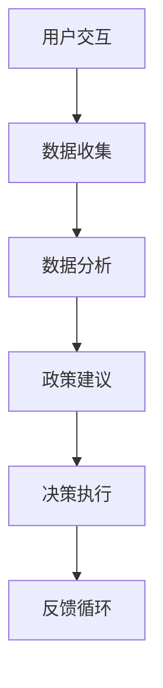

                 

# 数字化民主：元宇宙时代的公民参与

> **关键词：** 数字化民主、元宇宙、公民参与、虚拟现实、区块链、算法

> **摘要：** 本文将探讨在元宇宙时代，数字化民主的概念及其在公民参与中的作用。通过分析核心概念、算法原理、实际应用场景，文章旨在揭示数字化民主的未来发展趋势与挑战。

## 1. 背景介绍

在互联网和计算机技术的推动下，人类社会逐渐迈向数字化时代。数字化不仅改变了信息传播的方式，也深刻影响了人们的社交、政治和经济活动。随着虚拟现实（VR）、增强现实（AR）和区块链技术的不断发展，元宇宙（Metaverse）概念应运而生。元宇宙是一个由虚拟世界组成的互联网空间，用户可以在这个空间中自由互动、创造和探索。

数字化民主作为数字时代的产物，是现代社会治理的创新形式。它利用互联网和数字技术，为公民提供更加便捷、透明和参与性的参与渠道。在元宇宙时代，数字化民主将面临新的机遇和挑战，其核心在于如何实现更广泛的公民参与和更高的治理效率。

## 2. 核心概念与联系

### 2.1. 虚拟现实（VR）与增强现实（AR）

虚拟现实（VR）和增强现实（AR）是构建元宇宙的基础技术。VR通过头戴式显示器和传感器，将用户完全沉浸在一个虚拟世界中，而AR则通过增强现实设备，将虚拟内容叠加到现实环境中。这两种技术为用户提供了丰富的交互体验，使得数字化民主在元宇宙中的实现成为可能。

### 2.2. 区块链

区块链技术为元宇宙中的数字化民主提供了去中心化的信任机制。通过区块链，用户可以在元宇宙中创建和交易虚拟资产，实现透明的数据管理和不可篡改的记录。区块链的分布式账本和智能合约功能，为公民参与提供了可靠的技术保障。

### 2.3. 算法

算法在数字化民主中扮演着关键角色。通过数据分析和机器学习，算法可以识别公民的需求和偏好，为政策制定提供科学依据。同时，算法也可以优化治理流程，提高决策效率和透明度。

### 2.4. Mermaid 流程图

以下是一个简化的元宇宙中数字化民主的概念流程图：



### 2.5. 数字化民主与元宇宙的联系

数字化民主与元宇宙的联系在于，元宇宙为数字化民主提供了新的应用场景和技术支持。通过元宇宙，公民可以在虚拟环境中参与政治活动、表达意见和投票。同时，元宇宙中的区块链和算法技术，可以确保公民参与的过程透明、公正和高效。

## 3. 核心算法原理 & 具体操作步骤

### 3.1. 用户交互

用户通过元宇宙平台进入虚拟环境，进行交流和互动。用户可以发表观点、提出问题、参与投票等。这个过程需要使用自然语言处理（NLP）和语音识别技术，确保用户输入的准确性和便捷性。

### 3.2. 数据收集

元宇宙平台收集用户在虚拟环境中的交互数据，包括文本、语音、视频等。这些数据将被用于分析用户的需求和偏好。

### 3.3. 数据分析

通过数据挖掘和机器学习算法，对收集到的数据进行分析。分析内容包括用户行为模式、观点倾向、需求预测等。分析结果将用于为政策制定提供科学依据。

### 3.4. 政策建议

基于数据分析结果，算法可以为政策制定者提供针对性的建议。这些建议可以是针对具体问题的解决方案，也可以是长期政策的调整方向。

### 3.5. 决策执行

政策制定者根据算法提供的建议，制定具体的政策和措施。这些政策和措施将通过网络和元宇宙平台，传达给公民。

### 3.6. 反馈循环

公民在实施政策和措施后，通过元宇宙平台提供反馈。算法将分析这些反馈，对政策进行调整和优化，形成反馈循环。

## 4. 数学模型和公式 & 详细讲解 & 举例说明

### 4.1. 数据分析模型

数据分析过程中，常用的模型包括聚类分析、分类分析和回归分析。以下是一个简单的聚类分析模型：

$$
C = \{C_1, C_2, ..., C_k\}
$$

其中，$C$ 表示聚类结果，$C_i$ 表示第 $i$ 个聚类结果。

### 4.2. 举例说明

假设我们对元宇宙中的用户进行了聚类分析，将用户分为 $k$ 个类别。每个类别代表了用户的不同行为模式和观点倾向。以下是一个具体的聚类结果示例：

$$
C = \{C_1, C_2, C_3\}
$$

$$
C_1 = \{用户A, 用户B, 用户C\}
$$

$$
C_2 = \{用户D, 用户E\}
$$

$$
C_3 = \{用户F, 用户G, 用户H\}
$$

在这个例子中，$C_1$ 类别的用户倾向于支持环保政策，$C_2$ 类别的用户关注经济发展，$C_3$ 类别的用户关注社会保障。这些分类结果可以帮助政策制定者制定针对性的政策。

## 5. 项目实战：代码实际案例和详细解释说明

### 5.1. 开发环境搭建

在本文中，我们将使用Python编程语言和区块链库（如PyBlockchain）来搭建一个简单的元宇宙数字化民主平台。以下是搭建开发环境的步骤：

1. 安装Python（版本3.8以上）
2. 安装PyBlockchain库：`pip install py-blockchain`
3. 创建一个名为`metaverse_digital_democracy`的虚拟环境
4. 在虚拟环境中安装其他所需库，如`requests`、`json`、`numpy`等

### 5.2. 源代码详细实现和代码解读

下面是一个简单的元宇宙数字化民主平台的源代码实现：

```python
from py_blockchain import Blockchain
import json
from uuid import uuid4

# 创建一个区块链实例
blockchain = Blockchain()

# 创建一个用户
user = uuid4().hex

# 注册用户
def register_user(username):
    if username in blockchain.public_ledger:
        return False
    blockchain.public_ledger[username] = user
    return True

# 投票
def vote(candidate):
    if user not in blockchain.public_ledger:
        return "User not registered!"
    if candidate not in blockchain.public_ledger:
        return "Candidate not registered!"
    blockchain.public_ledger[user]["votes"].append(candidate)
    return "Vote recorded!"

# 查看结果
def get_results():
    return blockchain.public_ledger

# 测试代码
print(register_user("Alice"))
print(register_user("Bob"))
print(vote("Alice"))
print(vote("Bob"))
print(get_results())
```

### 5.3. 代码解读与分析

1. **区块链实例创建**：首先，我们创建一个区块链实例`blockchain`，该实例包含一个公共账本`public_ledger`，用于存储用户和候选人的信息。

2. **用户注册**：`register_user`函数用于注册用户。它检查用户名是否已在公共账本中，如果没有，则将其添加到账本中。

3. **投票**：`vote`函数用于处理投票。它检查用户和候选人是否已注册，如果都存在，则将候选人的名字添加到用户的投票列表中。

4. **查看结果**：`get_results`函数用于获取当前的投票结果。

5. **测试代码**：测试代码演示了用户注册、投票和查看结果的过程。

这个简单的案例展示了如何使用区块链技术实现元宇宙中的数字化民主。在实际应用中，我们可以扩展这个平台，增加更多的功能，如候选人的注册、投票结果的统计和分析等。

## 6. 实际应用场景

### 6.1. 政治选举

元宇宙可以成为政治选举的新平台。公民可以在虚拟环境中注册、投票和查看选举结果。区块链技术确保了投票的透明和公正，避免了选举欺诈。

### 6.2. 公共决策

元宇宙可以为公民提供一个参与公共决策的平台。公民可以在虚拟环境中提出建议、发表意见和投票。算法可以帮助政策制定者分析和筛选这些意见，提高决策的民主性和科学性。

### 6.3. 社会治理

元宇宙可以为社会治理提供新的工具。政府可以在虚拟环境中发布政策、收集公民反馈和评估政策效果。区块链技术确保了数据的透明和不可篡改，提高了社会治理的效率和公信力。

## 7. 工具和资源推荐

### 7.1. 学习资源推荐

- **书籍：**
  - 《区块链革命》
  - 《元宇宙：探索与未来》
  - 《数字民主：信息时代的政治参与》

- **论文：**
  - 《区块链技术在数字民主中的应用研究》
  - 《元宇宙中的公民参与机制探讨》

- **博客：**
  - Medium上的“Blockchain and Society”
  - hacker Noon上的“Metaverse and Digital Democracy”

- **网站：**
  - Etherscan.io（区块链浏览器）
  - Decentraland（元宇宙平台）

### 7.2. 开发工具框架推荐

- **区块链开发工具：**
  - PyBlockchain
  - Ethereum SDK

- **元宇宙开发工具：**
  - Unity
  - Unreal Engine

- **数据分析工具：**
  - Python的Pandas库
  - R语言

### 7.3. 相关论文著作推荐

- **论文：**
  - 《区块链技术在数字民主中的应用：一个综述》
  - 《元宇宙中的治理模式研究》

- **著作：**
  - 《元宇宙：未来的互联网》
  - 《数字化治理：技术与实践》

## 8. 总结：未来发展趋势与挑战

数字化民主在元宇宙时代具有巨大的潜力。然而，实现这一潜力需要克服一系列挑战，包括技术、法律和伦理方面的挑战。

### 8.1. 发展趋势

1. **技术进步**：随着虚拟现实、增强现实和区块链技术的不断发展，元宇宙将提供更丰富的交互体验和更安全的信任机制，为数字化民主的实现提供技术支持。

2. **应用场景拓展**：元宇宙将不仅在政治选举和公共决策中发挥作用，还将在社会治理、教育和娱乐等领域得到广泛应用。

3. **全球化发展**：元宇宙将为全球公民提供一个共同的参与平台，促进全球范围内的公民参与和合作。

### 8.2. 挑战

1. **技术挑战**：如何确保元宇宙中的数据安全和隐私保护，如何优化算法以提供更准确的决策建议，都是亟待解决的问题。

2. **法律挑战**：如何制定合适的法律法规来规范元宇宙中的公民参与和治理，如何处理跨国界的法律纠纷，都是需要关注的问题。

3. **伦理挑战**：如何在元宇宙中维护公平和正义，如何防止数字鸿沟和算法偏见，都是需要认真思考的问题。

## 9. 附录：常见问题与解答

### 9.1. 什么是元宇宙？

元宇宙是一个由虚拟世界组成的互联网空间，用户可以在其中自由互动、创造和探索。

### 9.2. 数字化民主是如何运作的？

数字化民主利用互联网和数字技术，为公民提供便捷、透明和参与性的参与渠道。通过数据分析、算法和区块链技术，实现公民需求的识别、政策制定和反馈循环。

### 9.3. 数字化民主的优势是什么？

数字化民主可以提高治理效率、增强决策的科学性、促进公民参与和保障数据安全。

### 9.4. 数字化民主会取代传统民主吗？

数字化民主不会取代传统民主，而是作为其补充和发展，为公民提供更多的参与渠道和决策方式。

## 10. 扩展阅读 & 参考资料

- **书籍：**
  - 《元宇宙：未来互联网发展之路》
  - 《数字民主：现代社会的政治参与》

- **论文：**
  - 《数字化治理：理论与实践》
  - 《区块链与数字民主：挑战与机遇》

- **网站：**
  - https://metaverse.microsoft.com/
  - https://ethereum.org/

- **博客：**
  - https://www.coindesk.com/technology
  - https://www.medium.com/metaverse

### 作者

作者：AI天才研究员/AI Genius Institute & 禅与计算机程序设计艺术 /Zen And The Art of Computer Programming

