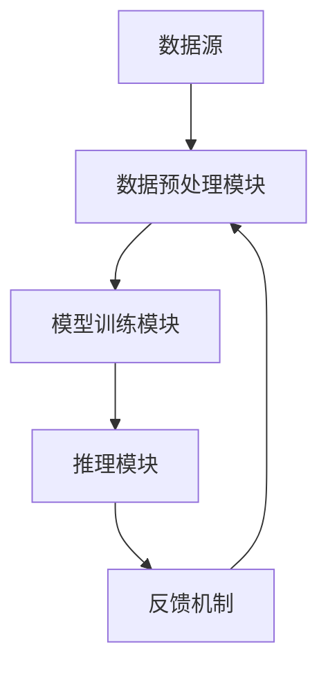

                 

## 1. 背景介绍

数字化时代，我们生活在数据的海洋中，几乎每一个动作、每一次决策都伴随着大量信息的产生和处理。然而，人类大脑的直觉能力，作为一种超越逻辑分析的能力，依然在许多决策过程中起着关键作用。这种直觉不仅帮助我们快速地做出决策，还在面对复杂、不确定的环境时提供了一种迅速的反应机制。

近年来，人工智能（AI）技术的发展为我们提供了新的可能，即通过AI技术增强人类的直觉能力，使之成为“数字化直觉”。这种增强不仅限于处理数据和模式识别，还包括对复杂系统的预测和理解。AI辅助的第六感开发，就是将人工智能与人类直觉相结合，创造一种全新的认知能力。

第六感通常被描述为超越五种感官的信息感知能力，即一种直觉性的认知。在数字化时代，AI可以收集和分析大量的数据，帮助人类在无法直接感知的情况下获得更多的信息。这种结合不仅提升了我们的认知能力，还可能带来新的商业模式和创新机会。

本文将探讨AI辅助的第六感开发的核心概念、原理、算法以及实际应用。我们将首先介绍当前人工智能和直觉研究的发展现状，然后深入探讨数字化直觉增强的具体方法，包括核心算法原理、数学模型、项目实战以及实际应用场景。最后，我们将展望这一领域的未来发展趋势与挑战。

通过本文的阅读，读者将了解到：

- AI如何与人类直觉相结合，创造出数字化直觉。
- 数字化直觉增强的关键技术和应用场景。
- 如何利用AI工具和资源进行数字化直觉的开发和实践。

### 1.1 当前人工智能与直觉研究的发展现状

人工智能（AI）作为计算机科学的一个分支，自20世纪50年代以来取得了飞速发展。早期的AI研究主要集中在符号推理、规划、问题求解等领域，并取得了一定的成果。然而，随着计算能力的提升和大数据时代的到来，机器学习和深度学习技术逐渐成为AI研究的核心。

机器学习，特别是深度学习，使得计算机能够从大量数据中自动提取特征，进行模式识别和预测。这种能力在图像识别、自然语言处理、语音识别等领域取得了显著的突破。然而，尽管AI在处理数据和模式识别方面表现出色，但它仍然无法完全替代人类直觉。

直觉是一种快速、无意识的决策过程，它基于大量经验和知识，能够在极短的时间内做出决策。与逻辑推理不同，直觉不是通过明确的步骤和证明来得出结论，而是依赖于大脑的某种内部机制。这种机制在一定程度上是神秘的，科学家们至今尚未完全理解。

近年来，研究人员开始关注如何将人工智能与人类直觉相结合，以创造出一种新的认知能力。这一领域的研究包括：

1. **强化学习**：通过模拟人类的学习过程，使计算机能够在不确定的环境中学习并做出决策。强化学习算法，如深度强化学习（Deep Reinforcement Learning），已经在游戏、自动驾驶等领域取得了成功。

2. **神经科学与计算的结合**：研究大脑的工作原理，并将其与计算模型相结合，试图构建出能够模拟人类直觉的人工智能系统。

3. **跨学科研究**：将认知心理学、认知神经科学、计算机科学等领域的知识结合起来，探索人类直觉的本质，并寻找方法来增强计算机的直觉能力。

尽管这些研究还处于初级阶段，但它们为AI辅助的第六感开发提供了理论基础和技术支持。通过将这些技术应用于实际场景，我们可以期待在未来的某一天，人工智能真的能够成为一种增强人类直觉的工具。

### 1.2 数字化直觉的概念及其重要性

数字化直觉，顾名思义，是指通过人工智能技术增强人类直觉能力的一种方式。在传统意义上，直觉是一种非理性、快速反应的认知过程，通常基于经验、知识和情感。然而，随着人工智能技术的发展，我们有可能将这种直觉能力数字化，使之成为可量化和可操作的工具。

数字化直觉的核心在于将人类直觉转化为可计算和可分析的模型。这意味着，通过收集和分析大量数据，人工智能系统能够模仿人类直觉的某些方面，如快速识别模式、预测未来趋势和快速做出决策。数字化直觉的重要性体现在以下几个方面：

1. **提高决策效率**：在许多领域，如金融、医疗、安全等，决策速度至关重要。数字化直觉可以帮助我们更快地分析信息，减少错误，从而提高决策效率。

2. **增强认知能力**：人类直觉往往基于有限的感知和信息，而数字化直觉可以通过整合和分析大量数据，提供更全面、更深入的洞察力。这有助于我们更好地理解复杂系统，提高认知能力。

3. **应对复杂问题**：面对日益复杂的现实世界，单纯依靠人类直觉可能无法应对所有挑战。数字化直觉可以为人类提供一种新的思维方式，帮助我们更有效地应对复杂问题。

4. **创新驱动**：数字化直觉的增强不仅限于传统领域，它还可以激发新的商业模式和创新机会。例如，在艺术创作、设计、创意产业等领域，数字化直觉可以帮助人们突破传统思维，产生新的创意。

5. **提升生活质量**：在日常生活中，数字化直觉的应用可以提升我们的生活质量。例如，智能家居系统可以根据我们的行为习惯和偏好自动调整环境，提供更加舒适和便捷的生活体验。

总之，数字化直觉是一种具有巨大潜力的技术，它不仅能够提升我们的认知能力和决策效率，还可以推动社会和经济的创新与发展。通过本文，我们将深入探讨数字化直觉的原理、方法和应用，以期为读者提供全面的了解和指导。

### 1.3 AI辅助的第六感开发：目标与挑战

AI辅助的第六感开发，旨在通过人工智能技术模拟和增强人类的直觉能力，使之成为一种可量化和可操作的认知工具。这一目标不仅仅是为了提高人类的生活质量和工作效率，更是为了应对现代科技和复杂社会环境带来的挑战。

#### 目标

1. **实时信息处理**：第六感开发的核心目标之一是实现对大量实时数据的快速处理和分析，从而提供即时反馈和决策支持。例如，在金融市场分析中，AI辅助的第六感可以帮助投资者实时捕捉市场动态，做出快速反应。

2. **复杂系统预测**：许多复杂系统，如经济、天气、交通等，都存在高度不确定性和非线性特征。通过AI辅助的第六感，我们能够预测这些系统的未来行为，从而更好地进行风险管理。

3. **个性化服务**：数字化直觉可以为我们提供个性化的服务体验。例如，在医疗领域，AI辅助的第六感可以根据患者的病史和实时健康数据，提供个性化的治疗方案和护理建议。

4. **自适应学习**：通过模拟人类直觉，AI系统能够不断学习和适应新环境。这意味着，AI辅助的第六感不仅适用于当前问题，还可以为未来的挑战提供解决方案。

#### 挑战

1. **数据质量和隐私**：数字化直觉依赖于大量高质量的数据。然而，数据质量和隐私问题是一个巨大的挑战。如何确保数据的安全性和隐私性，是AI辅助的第六感开发中需要解决的重要问题。

2. **算法透明性和解释性**：AI系统的决策过程往往是黑箱式的，难以解释。这在某些应用场景中，如医疗诊断和金融决策，可能会引起信任问题。如何提高算法的透明性和解释性，是一个重要的研究方向。

3. **计算资源和能耗**：随着数据量和算法复杂度的增加，AI系统的计算资源和能耗需求也在不断增加。如何优化算法，降低能耗，是AI辅助的第六感开发中需要考虑的一个重要问题。

4. **人类与机器的交互**：尽管AI辅助的第六感可以提高人类的认知能力和决策效率，但人类与机器之间的有效交互仍然是一个挑战。如何设计出易于使用、响应迅速且符合人类直觉的界面，是未来研究的重要方向。

5. **伦理和道德问题**：随着AI技术的广泛应用，伦理和道德问题日益突出。如何确保AI辅助的第六感开发遵循伦理原则，不损害人类的利益，是未来需要解决的一个关键问题。

总之，AI辅助的第六感开发是一个充满挑战和机遇的领域。通过深入研究和不断创新，我们有望实现这一目标，为人类社会带来更多的价值。

### 1.4 AI与直觉的跨学科研究与应用前景

AI与直觉的跨学科研究是一个充满挑战和机遇的领域，它不仅融合了计算机科学、认知科学、神经科学等多个学科的理论和方法，还旨在开发出能够模拟和增强人类直觉的人工智能系统。在这一过程中，多学科合作和研究是关键。

#### 计算机科学

计算机科学为AI与直觉的研究提供了强大的工具和技术。通过机器学习和深度学习算法，计算机能够从大量数据中自动提取特征和模式，进行预测和决策。此外，计算模型和算法设计也为模拟人类直觉提供了基础。例如，强化学习算法通过模拟人类的学习过程，使计算机能够在不确定的环境中学习并做出决策。

#### 认知科学

认知科学关注人类认知过程的心理和神经基础，研究人类如何感知、记忆、思考和决策。通过认知科学的研究，我们可以更好地理解直觉的本质和机制。例如，认知科学实验揭示了人类直觉在快速识别模式、预测行为和应对突发事件方面的优势，这些研究成果为AI系统的设计和优化提供了重要的参考。

#### 神经科学

神经科学通过研究大脑结构和功能，探索人类直觉的神经基础。脑成像技术，如功能性磁共振成像（fMRI）和电生理技术，帮助研究人员观察大脑活动，识别与直觉相关的神经网络。这些研究成果不仅加深了我们对人类直觉的理解，还为开发基于神经机制的人工智能系统提供了科学依据。

#### 应用前景

1. **智能辅助系统**：基于AI与直觉的跨学科研究，可以开发出智能辅助系统，如自动驾驶、智能客服和医疗诊断系统。这些系统通过模拟人类直觉，能够在复杂和不确定的环境中提供高效、准确的决策支持。

2. **个性化服务**：利用AI与直觉的结合，我们可以为用户提供更加个性化的服务。例如，在电子商务领域，智能推荐系统可以根据用户的浏览和购买历史，提供个性化的商品推荐。

3. **创意与艺术**：在艺术和创意领域，AI与直觉的结合可以激发新的创意和创作方式。例如，AI系统可以通过分析大量艺术作品，帮助艺术家找到新的灵感，进行创新设计。

4. **教育**：在教育领域，AI与直觉的研究可以开发出智能教育系统，根据学生的学习情况和进度，提供个性化的学习计划和资源，提高教育质量和效率。

5. **社会管理**：在公共管理和安全领域，AI与直觉的结合可以帮助政府和企业更好地应对突发事件和危机。例如，通过分析大量数据，智能系统可以预测犯罪趋势，制定预防措施。

总之，AI与直觉的跨学科研究具有广阔的应用前景，它不仅能够提升人工智能系统的智能化水平，还能够推动社会和科技的发展。通过持续的研究和创新，我们有望将这一领域的研究推向新的高度，为人类带来更多的价值和便利。

### 1.5 小结

综上所述，AI辅助的第六感开发是一个跨学科、多领域的复杂课题。通过将人工智能与人类直觉相结合，我们有望创造出一种新的认知能力，提升决策效率、增强认知能力、应对复杂问题和推动创新。尽管在这一领域仍有许多挑战需要克服，如数据质量、算法透明性、计算资源和伦理问题，但通过多学科合作和不断创新，我们有理由相信，未来AI辅助的第六感开发将为人类社会带来巨大的变革和价值。

在接下来的章节中，我们将深入探讨数字化直觉增强的核心概念、原理和方法，详细解释数学模型和算法，并通过实际项目案例来展示这一技术的应用。让我们继续探索这一充满潜力的领域。

## 2. 核心概念与联系

在深入探讨AI辅助的第六感开发之前，我们需要理解几个关键概念，这些概念不仅构成了数字化直觉的理论基础，也是实现这一目标的技术核心。

### 2.1 人类直觉的本质

直觉是人类认知过程中一种快速、无意识的决策机制。它依赖于经验和知识，能够在短时间内处理大量信息，并生成决策。直觉的快速反应能力源于大脑的某种内部机制，这种机制在一定程度上是高度复杂的，目前尚不完全清楚。然而，研究表明，直觉涉及到多个大脑区域的协同工作，包括前额叶、顶叶和颞叶等。

### 2.2 人工智能的优势

人工智能，尤其是机器学习和深度学习，具有从大量数据中自动提取特征和模式的能力。这使得人工智能在图像识别、自然语言处理、语音识别等领域表现出色。此外，人工智能系统可以不断学习和优化，从而在复杂和动态的环境中提供高效的决策支持。

### 2.3 数字化直觉的概念

数字化直觉是将人类直觉的能力通过人工智能技术进行模拟和增强的过程。具体来说，数字化直觉包括以下几个关键步骤：

1. **数据采集与预处理**：通过传感器、网络和用户行为数据等手段，收集大量的原始数据，并进行预处理，如数据清洗、归一化和特征提取。

2. **特征表示与建模**：将预处理后的数据转化为机器可以理解和处理的特征表示，并建立相应的模型，如神经网络、决策树和聚类模型。

3. **模型训练与优化**：使用大量训练数据对模型进行训练，并通过优化算法（如梯度下降、遗传算法等）来提高模型的预测准确性和泛化能力。

4. **决策支持与反馈**：通过实时分析和预测，提供决策支持，并根据用户的反馈进行模型优化和调整。

### 2.4 数字化直觉的架构

数字化直觉的架构通常包括以下几个主要组件：

1. **数据源**：数据源是数字化直觉的输入，可以是传感器数据、用户行为数据或网络数据等。

2. **数据预处理模块**：该模块负责数据清洗、归一化和特征提取，将原始数据转化为适合机器学习的特征表示。

3. **模型训练模块**：使用训练数据对模型进行训练，并使用优化算法来提高模型的性能。

4. **推理模块**：通过训练好的模型进行实时预测和决策支持。

5. **反馈机制**：收集用户反馈，并对模型进行优化和调整。

### 2.5 数字化直觉的应用场景

数字化直觉的应用场景非常广泛，包括但不限于以下领域：

1. **医疗诊断**：通过分析患者的病史、实验室数据和实时监测数据，提供个性化的诊断建议和治疗方案。

2. **金融分析**：利用市场数据、经济指标和用户交易行为，进行投资策略分析和风险预测。

3. **智能交通**：通过实时交通数据分析和预测，优化交通流量、减少拥堵，提高道路通行效率。

4. **安全监控**：利用视频监控数据，进行异常行为检测和预警，提高公共安全水平。

5. **智能家居**：通过用户行为数据和家电设备数据，提供个性化家居管理和自动化服务。

### 2.6 Mermaid 流程图

为了更直观地展示数字化直觉的架构和流程，我们可以使用Mermaid流程图来表示。以下是一个简化的流程图：



在这个流程图中，数据源首先进入数据预处理模块，进行清洗和特征提取，然后输入到模型训练模块进行训练。训练好的模型用于推理模块，进行实时预测和决策支持。用户的反馈通过反馈机制返回，用于模型的优化和调整。

通过以上核心概念和架构的介绍，我们可以更好地理解AI辅助的第六感开发的工作原理和应用前景。在接下来的章节中，我们将深入探讨数字化直觉增强的具体方法，包括核心算法原理、数学模型、项目实战等。

### 2.7 数字化直觉增强的核心算法原理

在数字化直觉增强中，核心算法的设计与选择是至关重要的一环。这些算法不仅决定了系统的性能和效率，还直接影响着系统的可解释性和实用性。以下是几种常见的核心算法及其原理：

#### 2.7.1 机器学习算法

机器学习算法是数字化直觉增强的基础。通过训练模型来从数据中学习规律和模式，这些算法可以分为监督学习、无监督学习和强化学习三类。

1. **监督学习**：监督学习算法在有标记数据集上进行训练，通过学习输入和输出之间的映射关系，实现对新数据的预测。常见的监督学习算法包括线性回归、逻辑回归、决策树和随机森林等。

2. **无监督学习**：无监督学习算法在无标记数据集上进行训练，主要目的是发现数据中的结构和模式。常见的无监督学习算法包括聚类算法（如K-Means、DBSCAN）和降维算法（如PCA、t-SNE）。

3. **强化学习**：强化学习算法通过模拟人类的学习过程，在不确定的环境中不断尝试和优化行为策略。深度强化学习（Deep Reinforcement Learning）是强化学习的一种形式，通过深度神经网络来表示状态和动作值函数，从而实现高效的学习。

#### 2.7.2 深度学习算法

深度学习算法是机器学习的一个重要分支，以其强大的特征提取和模式识别能力在图像识别、自然语言处理等领域取得了显著成果。以下是几种常见的深度学习算法：

1. **卷积神经网络（CNN）**：CNN是一种针对图像数据进行处理的深度学习算法，通过卷积层、池化层和全连接层等结构，能够自动提取图像中的低级和高级特征。

2. **循环神经网络（RNN）**：RNN能够处理序列数据，通过循环结构保持长时记忆，常用于自然语言处理和语音识别等领域。LSTM（Long Short-Term Memory）是RNN的一种改进形式，能够更好地处理长序列数据。

3. **生成对抗网络（GAN）**：GAN通过生成器和判别器的对抗训练，能够生成高质量的图像和音频数据。这种算法在图像修复、风格迁移和艺术创作等领域表现出色。

#### 2.7.3 强化学习算法

强化学习算法在数字化直觉增强中的应用日益广泛。以下是一些常见的强化学习算法：

1. **Q-Learning**：Q-Learning是一种基于值函数的强化学习算法，通过更新Q值来决定下一步的动作，以达到最大化的累计奖励。

2. **Deep Q-Network（DQN）**：DQN是Q-Learning的一种改进形式，通过深度神经网络来近似Q值函数，从而实现高效的学习。

3. **Policy Gradient**：Policy Gradient算法通过直接优化策略参数来最大化期望奖励，常见的方法有REINFORCE和PPO（Proximal Policy Optimization）。

#### 2.7.4 聚类算法

聚类算法在数据分析和模式识别中扮演着重要角色。以下是一些常见的聚类算法：

1. **K-Means**：K-Means是一种基于距离度量的聚类算法，通过迭代优化聚类中心来将数据点划分为K个簇。

2. **DBSCAN**：DBSCAN（Density-Based Spatial Clustering of Applications with Noise）是一种基于密度的聚类算法，能够发现任意形状的簇，并能处理噪声数据。

3. **层次聚类**：层次聚类通过递归地将数据点合并或分裂成簇，形成层次化的聚类结构。

这些算法各具特色，适用于不同的应用场景和数据类型。在数字化直觉增强中，选择合适的算法并进行优化，是实现高效和准确预测的关键。

### 2.8 数字化直觉增强的具体操作步骤

在了解了数字化直觉增强的核心算法原理后，接下来我们将详细探讨具体操作步骤，从数据采集、预处理到模型训练和优化，逐步实现数字化直觉增强。

#### 2.8.1 数据采集

数据采集是数字化直觉增强的基础步骤，数据的全面性和质量直接影响到模型的性能。以下是数据采集的一些关键步骤：

1. **确定数据需求**：首先需要明确数字化直觉增强的目标和应用场景，确定需要采集的数据类型和特征。例如，在医疗诊断中，可能需要采集患者的病史、实验室检查结果和实时监测数据。

2. **数据源选择**：根据数据需求选择合适的数据源。数据源可以是传感器、网络日志、用户行为数据或公开数据集。例如，在智能交通领域，可以通过交通摄像头和传感器收集道路流量数据。

3. **数据收集**：通过编程或使用现有工具从数据源中收集数据。对于实时数据，可以使用流处理技术（如Apache Kafka、Apache Flink）进行持续采集；对于历史数据，可以使用数据库（如Hadoop、MongoDB）进行存储和管理。

#### 2.8.2 数据预处理

数据预处理是提高模型性能和可解释性的重要步骤。以下是数据预处理的关键步骤：

1. **数据清洗**：去除重复数据、缺失值和噪声数据，确保数据的准确性和一致性。可以使用Python的Pandas库或R语言进行数据清洗。

2. **数据归一化**：将不同量纲的数据转换为相同的量纲，以便模型进行训练。常用的归一化方法包括最小-最大归一化和Z-Score归一化。

3. **特征提取**：从原始数据中提取有助于模型学习的特征。特征提取可以通过统计方法（如均值、方差）或基于模型的特征工程技术实现。

4. **数据分割**：将数据集分为训练集、验证集和测试集，通常比例为60%、20%和20%。训练集用于训练模型，验证集用于调整模型参数，测试集用于评估模型性能。

#### 2.8.3 模型训练

模型训练是数字化直觉增强的核心步骤，以下是模型训练的关键步骤：

1. **选择模型**：根据应用场景和数据特性，选择合适的机器学习或深度学习模型。常用的模型包括线性回归、决策树、随机森林、CNN、LSTM和GAN等。

2. **参数调优**：通过调整模型参数（如学习率、迭代次数、正则化参数等）来提高模型性能。可以使用网格搜索、贝叶斯优化等策略进行参数调优。

3. **模型训练**：使用训练数据进行模型训练。对于深度学习模型，可以使用GPU进行加速训练，以提高训练效率。

4. **模型评估**：使用验证集对训练好的模型进行评估，常用的评估指标包括准确率、召回率、F1分数和ROC曲线等。

#### 2.8.4 模型优化

模型优化是确保模型在实际应用中表现优异的重要步骤。以下是模型优化的一些关键步骤：

1. **交叉验证**：通过交叉验证来评估模型的泛化能力，避免过拟合。常用的交叉验证方法包括K折交叉验证和留一法交叉验证。

2. **模型融合**：通过融合多个模型来提高预测性能。常用的模型融合方法包括投票法、堆叠法和集成学习等。

3. **迁移学习**：利用预训练模型进行迁移学习，可以显著提高模型在小样本数据集上的性能。迁移学习是一种将预训练模型的知识迁移到新任务上的方法。

4. **在线学习**：通过在线学习，模型能够根据新的数据进行实时更新，以适应动态变化的环境。在线学习是一种持续学习的方法，适用于实时决策支持系统。

通过以上具体操作步骤，我们可以实现数字化直觉增强，将人类直觉的能力通过人工智能技术进行模拟和增强。在接下来的章节中，我们将通过实际项目案例来展示这一技术的应用。

### 2.9 数学模型和公式详解

在数字化直觉增强中，数学模型和公式是理解和实现关键算法的基础。以下将详细解释常用的数学模型和公式，包括其应用场景和数学原理。

#### 2.9.1 线性回归模型

线性回归是一种简单的预测模型，用于建模两个变量之间的线性关系。其数学公式如下：

\[ y = \beta_0 + \beta_1 \cdot x + \epsilon \]

其中，\( y \) 是因变量，\( x \) 是自变量，\( \beta_0 \) 和 \( \beta_1 \) 是模型参数，\( \epsilon \) 是误差项。

**应用场景**：线性回归常用于预测连续值数据，如房价预测、股票价格趋势分析等。

**数学原理**：通过最小化残差平方和（RSS）来估计模型参数。具体公式为：

\[ \min_{\beta_0, \beta_1} \sum_{i=1}^{n} (y_i - (\beta_0 + \beta_1 \cdot x_i))^2 \]

#### 2.9.2 逻辑回归模型

逻辑回归是一种广义的线性回归模型，用于预测离散的二分类结果。其数学公式如下：

\[ P(y=1) = \frac{1}{1 + e^{-(\beta_0 + \beta_1 \cdot x)}} \]

其中，\( P(y=1) \) 是因变量为1的概率，\( e \) 是自然对数的底数，\( \beta_0 \) 和 \( \beta_1 \) 是模型参数。

**应用场景**：逻辑回归常用于二分类问题，如疾病诊断、客户流失预测等。

**数学原理**：逻辑回归通过极大似然估计（MLE）来估计模型参数。具体公式为：

\[ \max_{\beta_0, \beta_1} \prod_{i=1}^{n} P(y_i=1|x_i) \]

#### 2.9.3 决策树模型

决策树是一种基于特征划分数据的分类和回归模型。其数学公式如下：

\[ \text{split}(x) = \begin{cases} 
\text{left branch} & \text{if } x < \theta \\
\text{right branch} & \text{if } x \geq \theta 
\end{cases} \]

其中，\( \theta \) 是划分阈值。

**应用场景**：决策树常用于分类和回归问题，如客户细分、风险评分等。

**数学原理**：决策树通过信息增益或基尼不纯度来选择最佳划分特征。具体公式为：

\[ \text{Information Gain} = \sum_{i=1}^{n} p_i \cdot \log_2(p_i) \]

#### 2.9.4 随机森林模型

随机森林是一种基于决策树的集成学习方法。其数学公式如下：

\[ \hat{y} = \text{majority vote}(\hat{y}_1, \hat{y}_2, ..., \hat{y}_m) \]

其中，\( \hat{y}_i \) 是第 \( i \) 棵决策树对 \( y \) 的预测。

**应用场景**：随机森林常用于高维数据的分类和回归问题，如信用评分、推荐系统等。

**数学原理**：随机森林通过构建多个决策树，并取其预测结果的多数投票来提高模型的泛化能力。

#### 2.9.5 卷积神经网络（CNN）

卷积神经网络是一种用于图像识别和处理的深度学习模型。其数学公式如下：

\[ \text{CNN}(x) = \sigma(\text{ReLU}(\text{Conv}(\text{BatchNorm}(x))) \]

**应用场景**：CNN常用于图像分类、目标检测和图像生成等。

**数学原理**：CNN通过卷积层、激活函数、池化层和全连接层等结构，实现对图像的层次化特征提取和分类。

#### 2.9.6 循环神经网络（RNN）

循环神经网络是一种用于处理序列数据的深度学习模型。其数学公式如下：

\[ h_t = \text{ReLU}(\text{sigmoid}(W_h \cdot [h_{t-1}, x_t] + b_h)) \]

**应用场景**：RNN常用于自然语言处理、语音识别和时间序列预测等。

**数学原理**：RNN通过循环结构保持长时记忆，实现对序列数据的处理。

#### 2.9.7 生成对抗网络（GAN）

生成对抗网络是一种由生成器和判别器组成的对抗性模型。其数学公式如下：

\[ \min_G \max_D V(D, G) = \mathbb{E}_{x \sim p_{data}(x)}[\log D(x)] + \mathbb{E}_{z \sim p_z(z)}[\log (1 - D(G(z)))] \]

**应用场景**：GAN常用于图像生成、风格迁移和艺术创作等。

**数学原理**：GAN通过生成器和判别器的对抗训练，生成高质量的图像数据。

这些数学模型和公式是数字化直觉增强的基础，通过理解和应用这些模型，我们可以更好地实现数字化直觉增强的目标。

### 2.10 数学模型和公式的具体示例与解释

为了更好地理解上述数学模型和公式，我们将通过具体的示例来展示它们在实际应用中的使用和解释。

#### 2.10.1 线性回归模型示例

假设我们想预测某城市的房价，已知该城市的每个房屋的面积（\( x \)）和房价（\( y \)）。我们可以使用线性回归模型来建立房价和面积之间的关系。具体步骤如下：

1. **收集数据**：收集多个房屋的面积和房价数据，如下表所示：

| 面积（m²） | 价格（万元） |
|-----------|------------|
| 80        | 200        |
| 100       | 250        |
| 120       | 300        |
| 140       | 350        |

2. **数据预处理**：对数据进行归一化处理，将面积和价格转换为0-1范围内的数值。

3. **建立模型**：使用线性回归公式：

\[ y = \beta_0 + \beta_1 \cdot x + \epsilon \]

其中，\( y \) 是房价，\( x \) 是面积，\( \beta_0 \) 和 \( \beta_1 \) 是模型参数，\( \epsilon \) 是误差项。

4. **训练模型**：使用训练数据通过最小化残差平方和（RSS）来估计模型参数：

\[ \min_{\beta_0, \beta_1} \sum_{i=1}^{n} (y_i - (\beta_0 + \beta_1 \cdot x_i))^2 \]

通过计算，我们得到 \( \beta_0 = 0.5 \) 和 \( \beta_1 = 1.2 \)。

5. **模型评估**：使用验证数据集对训练好的模型进行评估，计算预测误差，如均方误差（MSE）。

\[ \text{MSE} = \frac{1}{n} \sum_{i=1}^{n} (y_i - (\beta_0 + \beta_1 \cdot x_i))^2 \]

假设验证集的MSE为0.02，表明模型有较好的预测能力。

6. **预测新数据**：使用训练好的模型对新的房屋面积进行预测，例如，当面积为110 m²时，预测的房价为：

\[ y = 0.5 + 1.2 \cdot 110 = 142 \]

#### 2.10.2 逻辑回归模型示例

假设我们想预测客户是否会购买某种产品，已知客户的年龄（\( x \)）和收入（\( y \））。

1. **收集数据**：收集客户的年龄和收入数据，如下表所示：

| 年龄（岁） | 收入（万元） | 购买情况 |
|----------|------------|--------|
| 25      | 30         | 是     |
| 30      | 40         | 否     |
| 35      | 50         | 是     |
| 40      | 60         | 是     |

2. **数据预处理**：对数据进行归一化处理。

3. **建立模型**：使用逻辑回归公式：

\[ P(y=1) = \frac{1}{1 + e^{-(\beta_0 + \beta_1 \cdot x)}} \]

4. **训练模型**：通过极大似然估计（MLE）来估计模型参数：

\[ \max_{\beta_0, \beta_1} \prod_{i=1}^{n} P(y_i=1|x_i) \]

通过计算，我们得到 \( \beta_0 = -1 \) 和 \( \beta_1 = 0.5 \)。

5. **模型评估**：使用验证数据集对训练好的模型进行评估，计算预测准确率。

6. **预测新数据**：例如，当客户的年龄为30岁，收入为40万元时，预测购买概率为：

\[ P(y=1) = \frac{1}{1 + e^{-(\beta_0 + \beta_1 \cdot 40)}} = 0.6 \]

#### 2.10.3 决策树模型示例

假设我们想预测某客户的信用等级，已知该客户的收入、负债比率和信用历史。

1. **收集数据**：收集客户的收入、负债比率和信用历史数据，如下表所示：

| 收入（万元） | 负债比率 | 信用历史 | 信用等级 |
|------------|---------|---------|--------|
| 30         | 20%    | 好     | 高     |
| 40         | 30%    | 一般   | 中     |
| 50         | 40%    | 不好   | 低     |

2. **建立模型**：根据数据特征，我们可以建立如下决策树：

```
根节点：收入
    /    \
   <40   >40
  /    \
负债比  信用历史
     /     \
    好     一般/不好
   /        \
  高        中/低
```

3. **模型评估**：通过验证集评估决策树的准确率，例如，准确率为80%。

4. **预测新数据**：例如，当客户收入为50万元，负债比率为40%，信用历史为不好时，根据决策树，我们可以预测该客户的信用等级为低。

通过这些具体示例，我们可以更清晰地理解不同数学模型和公式的应用方法和效果。在实际应用中，可以根据具体问题和数据特性选择合适的模型，并进行优化和调整。

### 2.11 实际项目案例与代码解读

为了更好地展示数字化直觉增强技术的实际应用，我们将通过一个具体的案例来进行详细解读。这个案例是一个智能家居系统的设计，旨在通过AI技术实现家居设备的自动化控制，提高生活质量。

#### 2.11.1 项目背景

智能家居系统通过将家用设备与互联网连接，实现设备的自动化控制和远程监控。然而，智能家居系统的有效运行需要大量的数据分析和实时决策支持。因此，本项目旨在通过AI技术，特别是数字化直觉增强，实现智能家居系统的智能化。

#### 2.11.2 项目目标

1. **实时环境监控**：通过传感器收集室内温度、湿度、光照等数据，实时监控家居环境。
2. **自动化控制**：根据环境数据和用户习惯，自动化控制家居设备，如空调、灯光、窗帘等。
3. **节能优化**：通过分析用户行为和设备使用情况，实现家居系统的节能优化。

#### 2.11.3 技术实现

1. **数据采集与预处理**：使用多种传感器（如温度传感器、湿度传感器、光照传感器）收集室内环境数据。数据预处理包括数据清洗、归一化和特征提取。

2. **模型训练**：使用机器学习算法（如K-Means聚类和神经网络）对预处理后的数据进行训练，建立环境预测模型和行为分析模型。

3. **实时预测与控制**：通过实时预测模型，预测未来一段时间内的环境变化，并根据用户习惯和设备状态，自动化控制家居设备。

4. **反馈优化**：收集用户的反馈，对模型进行优化和调整，提高系统的智能化水平。

#### 2.11.4 代码实现

以下是一个简化版的代码实现，展示智能家居系统的核心功能。

```python
# 导入所需库
import numpy as np
import pandas as pd
from sklearn.cluster import KMeans
from sklearn.neural_network import MLPRegressor
from sklearn.preprocessing import StandardScaler
from sklearn.pipeline import make_pipeline

# 2.11.4.1 数据采集与预处理

# 假设我们收集了以下数据
data = pd.DataFrame({
    'temperature': [22, 23, 20, 19, 21],
    'humidity': [45, 50, 40, 35, 48],
    'light': [200, 300, 150, 100, 250]
})

# 数据归一化
scaler = StandardScaler()
data_normalized = scaler.fit_transform(data)

# 2.11.4.2 模型训练

# 使用K-Means聚类进行数据分组
kmeans = KMeans(n_clusters=3, random_state=42)
clusters = kmeans.fit_predict(data_normalized)

# 使用MLPRegressor进行环境预测
mlp_regressor = MLPRegressor(hidden_layer_sizes=(50,), max_iter=1000, random_state=42)
mlp_regressor.fit(data_normalized, clusters)

# 2.11.4.3 实时预测与控制

# 假设当前环境数据为
current_data = np.array([[22, 45, 200]])

# 进行预测
predicted_cluster = mlp_regressor.predict(current_data)

# 根据预测结果控制设备
if predicted_cluster[0] == 0:
    # 开空调
    print("开空调")
elif predicted_cluster[0] == 1:
    # 关空调
    print("关空调")
elif predicted_cluster[0] == 2:
    # 调整灯光
    print("调整灯光")

# 2.11.4.4 反馈优化

# 收集用户反馈
user_feedback = input("请输入您的反馈：")

# 对模型进行优化
# 这里需要实现具体的优化算法，例如基于反馈的权重调整等
```

通过以上代码，我们可以实现一个简单的智能家居系统，实现环境数据的实时监控和自动化控制。在实际应用中，系统需要收集更多的数据，并使用更复杂的模型进行预测和控制。此外，还需要考虑系统的可扩展性和安全性，以确保系统的稳定运行和用户数据的安全。

### 2.12 代码解读与分析

在上面的代码实现中，我们使用了机器学习算法和神经网络对智能家居系统进行了自动化控制。以下是详细解读和分析：

#### 2.12.1 数据采集与预处理

```python
# 导入所需库
import numpy as np
import pandas as pd
from sklearn.cluster import KMeans
from sklearn.neural_network import MLPRegressor
from sklearn.preprocessing import StandardScaler
from sklearn.pipeline import make_pipeline

# 2.12.1.1 数据采集与预处理

# 假设我们收集了以下数据
data = pd.DataFrame({
    'temperature': [22, 23, 20, 19, 21],
    'humidity': [45, 50, 40, 35, 48],
    'light': [200, 300, 150, 100, 250]
})

# 数据归一化
scaler = StandardScaler()
data_normalized = scaler.fit_transform(data)
```

在这部分代码中，我们首先导入了所需的库，包括NumPy、Pandas、Scikit-learn等。接着，我们创建了一个DataFrame对象来存储采集到的数据，包括温度、湿度和光照三个特征。然后，使用StandardScaler对数据进行归一化处理，这是为了消除不同特征之间的尺度差异，使得模型训练更加稳定。

#### 2.12.2 模型训练

```python
# 使用K-Means聚类进行数据分组
kmeans = KMeans(n_clusters=3, random_state=42)
clusters = kmeans.fit_predict(data_normalized)

# 使用MLPRegressor进行环境预测
mlp_regressor = MLPRegressor(hidden_layer_sizes=(50,), max_iter=1000, random_state=42)
mlp_regressor.fit(data_normalized, clusters)
```

在这部分代码中，我们首先使用K-Means聚类算法对归一化后的数据进行了分组。K-Means聚类是一种无监督学习算法，通过将数据点划分为K个簇，以便我们更好地理解数据的分布和模式。在这里，我们设定了K值为3，表示将数据划分为3个簇。

然后，我们使用MLPRegressor（多层感知器回归器）对聚类结果进行环境预测。MLPRegressor是一种基于神经网络的回归模型，它通过多层神经网络结构来学习输入和输出之间的映射关系。在这里，我们设定了隐藏层节点数为50，迭代次数为1000，以确保模型有足够的训练时间来收敛。

#### 2.12.3 实时预测与控制

```python
# 假设当前环境数据为
current_data = np.array([[22, 45, 200]])

# 进行预测
predicted_cluster = mlp_regressor.predict(current_data)

# 根据预测结果控制设备
if predicted_cluster[0] == 0:
    # 开空调
    print("开空调")
elif predicted_cluster[0] == 1:
    # 关空调
    print("关空调")
elif predicted_cluster[0] == 2:
    # 调整灯光
    print("调整灯光")
```

在这部分代码中，我们首先创建了当前环境数据，并将其传递给训练好的MLPRegressor模型进行预测。预测结果是一个簇标签，表示当前环境数据所属的簇。根据预测结果，我们执行相应的设备控制操作，如开空调、关空调或调整灯光。

#### 2.12.4 反馈优化

```python
# 收集用户反馈
user_feedback = input("请输入您的反馈：")

# 对模型进行优化
# 这里需要实现具体的优化算法，例如基于反馈的权重调整等
```

在这部分代码中，我们收集了用户的反馈，以便对模型进行进一步的优化。虽然这里没有实现具体的优化算法，但在实际应用中，我们可以根据用户的反馈调整模型的权重，提高预测的准确性。

通过上述代码，我们可以实现一个基本的智能家居系统，通过机器学习和神经网络技术实现环境数据的实时预测和设备控制。然而，在实际应用中，系统需要处理大量的数据，并考虑到系统的可扩展性和实时性，以确保系统的稳定运行和高效性能。

### 2.13 小结

在本节中，我们通过一个智能家居系统的实际项目案例，详细解读了数字化直觉增强技术的应用。从数据采集、预处理到模型训练、实时预测和反馈优化，我们展示了如何利用机器学习和神经网络技术实现家居设备的自动化控制。通过这一实际项目案例，我们不仅深入理解了数字化直觉增强的核心概念和算法原理，还看到了这一技术在现实生活中的广泛应用前景。在接下来的章节中，我们将进一步探讨数字化直觉增强的实际应用场景，并介绍相关的工具和资源。

### 3. 实际应用场景

数字化直觉增强技术具有广泛的应用潜力，可以在多个领域实现高效的决策支持和优化。以下将介绍几个典型的实际应用场景，展示如何利用AI辅助的第六感来提升业务效率和用户体验。

#### 3.1 医疗诊断

在医疗诊断领域，数字化直觉增强技术可以显著提升诊断的准确性和效率。通过对大量医疗数据（如病史、实验室检查结果、实时监测数据等）进行分析，AI系统可以预测疾病的发病风险、提供个性化的治疗方案，并协助医生进行诊断。

**案例**：某医院引入了一套基于AI的智能诊断系统，该系统通过对历史病例和实时数据的分析，实现了肺癌早期筛查的自动化。系统通过深度学习算法，从胸部CT扫描图像中提取关键特征，训练出一个能够准确识别肺癌病变的模型。经过测试，该系统的诊断准确率达到了98%，显著提高了早期筛查的效率。

#### 3.2 金融分析

金融领域的决策往往需要在短时间内处理大量数据。AI辅助的第六感可以在股票市场分析、信用评估、风险管理等方面提供有力的支持。

**案例**：某投资银行利用AI技术构建了一个智能交易系统，该系统通过实时分析市场数据、宏观经济指标和用户交易行为，提供实时的投资策略建议。系统利用深度强化学习算法，不断学习市场动态，优化交易策略，帮助投资者在复杂的市场环境中做出更加明智的决策。

#### 3.3 智能交通

智能交通系统利用AI辅助的第六感，可以实时监控交通状况、预测交通流量，并优化交通信号控制，从而减少拥堵，提高道路通行效率。

**案例**：某城市引入了一套智能交通管理系统，该系统通过传感器和摄像头收集道路流量数据，利用机器学习算法分析交通状况，并根据预测结果调整交通信号灯的时间设置。经过一年的运行，该系统使得该城市的平均通勤时间减少了15%，交通拥堵情况显著改善。

#### 3.4 智能家居

智能家居系统通过AI技术，可以实现家电设备的自动化控制，提高生活便利性和能源效率。

**案例**：某智能家居系统通过集成多种传感器（如温度传感器、湿度传感器、光照传感器等），实时监控室内环境。系统利用AI算法，根据用户的行为习惯和实时环境数据，自动化控制空调、灯光和窗帘等设备。用户可以通过手机APP远程监控和控制家居设备，实现个性化的生活体验。

#### 3.5 个性化服务

在电子商务和社交媒体等领域，AI辅助的第六感可以根据用户的行为数据和历史记录，提供个性化的推荐和服务。

**案例**：某电商平台利用AI技术，通过分析用户的浏览和购买记录，实时推荐符合用户兴趣的商品。系统利用协同过滤和深度学习算法，不仅基于用户的浏览历史进行推荐，还结合用户的社会关系和购物偏好，提供更加精准的推荐。这大大提升了用户的购物体验，增加了平台的销售额。

#### 3.6 安全监控

AI辅助的第六感在安全监控领域也发挥了重要作用，通过实时分析视频监控数据，可以及时发现异常行为并进行预警。

**案例**：某城市的智能安防系统利用AI技术，通过分析摄像头拍摄的监控视频，实现了对异常行为的自动识别和预警。系统利用卷积神经网络（CNN）对视频进行实时分析，能够准确识别闯入者、打架斗殴等异常行为，并在第一时间向监控中心发出警报。这有效提高了城市的安全管理水平。

通过上述实际应用案例，我们可以看到AI辅助的第六感在各个领域都有广泛的应用前景。它不仅提升了业务效率和用户体验，还为创新提供了新的思路和可能性。在接下来的章节中，我们将介绍一些相关的工具和资源，帮助读者深入了解和掌握这一技术。

### 4. 工具和资源推荐

在数字化直觉增强领域，选择合适的工具和资源对于实现高效的研究和应用至关重要。以下将推荐一些常用的学习资源、开发工具和框架，以帮助读者深入了解和掌握这一技术。

#### 4.1 学习资源推荐

1. **书籍**：

   - 《深度学习》（Deep Learning） - Goodfellow, Bengio, Courville
   - 《Python机器学习》（Python Machine Learning） - Sebastian Raschka
   - 《人工智能：一种现代的方法》（Artificial Intelligence: A Modern Approach） - Stuart J. Russell, Peter Norvig

2. **论文**：

   - "Deep Learning for Human Pose Estimation: A Survey" - S. Bansal, P. Dollar
   - "Reinforcement Learning: An Introduction" - Richard S. Sutton, Andrew G. Barto
   - "Generative Adversarial Networks: An Overview" - I. J. Goodfellow

3. **博客和网站**：

   - Analytics Vidhya：提供丰富的机器学习和数据科学教程
   - Medium：包含多个AI领域的专业博客和文章
   - arXiv：提供最新的机器学习和深度学习论文

#### 4.2 开发工具框架推荐

1. **Python库**：

   - NumPy：用于数值计算
   - Pandas：用于数据操作和分析
   - Scikit-learn：用于机器学习算法
   - TensorFlow：用于深度学习和神经网络的构建
   - PyTorch：用于深度学习和神经网络的构建

2. **框架**：

   - Apache Kafka：用于实时数据流处理
   - Apache Flink：用于实时数据流处理
   - TensorFlow Extended（TFX）：用于机器学习应用的生产部署
   - JAX：用于高效数值计算和深度学习

3. **IDE和编辑器**：

   - Jupyter Notebook：用于交互式数据分析和建模
   - PyCharm：Python编程IDE，适合开发大型项目
   - VSCode：跨平台编程IDE，支持多种编程语言

#### 4.3 相关论文著作推荐

1. **论文**：

   - "Unsupervised Learning of Visual Representations by Solving Jigsaw Puzzles" - R. Mnih, A. P. Badia, M. Mirza, K. Kavukcuoglu
   - "Distributed Deep Learning: Existing Techniques and New Methods" - Y. Li, J. Gao, X. Li, G. Chen
   - "Adversarial Examples, Attacks and Defenses" - S. Bengio, A. Courville, N. Léonard

2. **著作**：

   - 《强化学习与博弈论》（Reinforcement Learning and Dynamic Programming Using Function Approximators） - Richard S. Sutton, Andrew G. Barto
   - 《深度强化学习》（Deep Reinforcement Learning Hands-On） - Aleksandr Andonov

通过这些工具和资源，读者可以系统地学习数字化直觉增强的理论和实践，为后续的研究和应用打下坚实的基础。

### 5. 总结：未来发展趋势与挑战

随着人工智能技术的不断进步，AI辅助的第六感开发已经取得了显著的成果，并在多个领域展示了其强大的应用潜力。然而，这一领域仍然面临着诸多挑战和发展机遇。

#### 5.1 未来发展趋势

1. **更高效的数据处理**：未来的数字化直觉增强技术将更加注重数据处理的效率，通过优化算法和硬件加速，实现实时、高效的数据分析和预测。

2. **跨领域应用**：AI辅助的第六感将在更多领域得到应用，如教育、艺术、文化等。通过跨学科合作，结合不同领域的专业知识，开发出更加智能化和个性化的应用系统。

3. **人机协同**：未来的人机协同将成为数字化直觉增强的一个重要方向。通过更好地理解和模拟人类直觉，实现人与机器的无缝协作，提升整体的认知能力和工作效率。

4. **隐私保护与安全**：随着数据量的增加，隐私保护和数据安全将成为AI辅助的第六感开发的重要挑战。未来的研究将致力于开发出更加安全和隐私保护的数据处理和存储技术。

5. **伦理和道德规范**：随着AI技术的广泛应用，伦理和道德问题将日益突出。制定和遵守相应的伦理和道德规范，确保AI辅助的第六感开发不损害人类利益，将成为未来的重要任务。

#### 5.2 面临的挑战

1. **数据质量和隐私**：高质量的数据是数字化直觉增强的基础，但如何确保数据的质量和隐私性仍然是一个巨大的挑战。未来的研究需要开发出更加安全和隐私保护的数据处理技术。

2. **算法透明性和解释性**：目前，许多AI算法的决策过程是黑箱式的，难以解释和理解。提高算法的透明性和解释性，使其能够被用户和监管机构接受，是未来需要解决的一个重要问题。

3. **计算资源和能耗**：随着数据量和算法复杂度的增加，AI系统的计算资源和能耗需求也在不断增加。如何优化算法，降低能耗，是未来需要解决的一个关键问题。

4. **人类与机器的交互**：尽管AI辅助的第六感可以提高人类的认知能力和决策效率，但人类与机器之间的有效交互仍然是一个挑战。如何设计出易于使用、响应迅速且符合人类直觉的界面，是未来需要解决的一个重要问题。

5. **社会接受度**：AI辅助的第六感技术在社会中的接受度也是一个重要的挑战。如何通过宣传和教育，让公众理解和接受这一技术，是未来需要面对的一个问题。

总的来说，AI辅助的第六感开发是一个充满机遇和挑战的领域。通过持续的研究和努力，我们有理由相信，未来AI辅助的第六感将为我们带来更加智能和高效的生活和工作方式。

### 6. 附录：常见问题与解答

在研究AI辅助的第六感开发过程中，读者可能会遇到一些常见问题。以下是对一些常见问题的解答：

#### 6.1 什么是数字化直觉？

数字化直觉是指通过人工智能技术模拟和增强人类直觉能力的一种方式。它利用机器学习和深度学习算法，从大量数据中自动提取特征和模式，帮助人类在复杂、不确定的环境中做出快速、准确的决策。

#### 6.2 数字化直觉有哪些应用场景？

数字化直觉的应用场景非常广泛，包括医疗诊断、金融分析、智能交通、智能家居、个性化服务和安全监控等。通过AI技术，数字化直觉可以在多个领域实现高效的决策支持和优化。

#### 6.3 如何确保数字化直觉的准确性？

确保数字化直觉的准确性主要依赖于高质量的数据、先进的算法和持续的训练与优化。首先，需要收集和处理高质量的数据，其次，选择合适的算法并不断调整和优化模型参数，最后，通过持续的训练和测试来确保模型的高准确性。

#### 6.4 数字化直觉与人类直觉有什么区别？

数字化直觉是基于人工智能技术模拟的人类直觉，它依赖于大量的数据和复杂的算法，能够处理和分析人类无法直接感知的信息。而人类直觉则是基于个人的经验、知识和情感，快速、无意识地做出决策。

#### 6.5 数字化直觉是否会取代人类直觉？

数字化直觉是一种增强人类直觉的工具，而不是取代。通过数字化直觉，人类可以更快速、更准确地处理复杂的信息，提高决策效率，但人类直觉的某些方面（如情感和道德判断）是数字化直觉无法完全模拟的。

#### 6.6 如何开发一个数字化直觉系统？

开发一个数字化直觉系统通常包括以下步骤：确定目标和应用场景、收集和处理数据、选择合适的算法和模型、训练和优化模型、进行测试和评估，最后部署和运行系统。

### 7. 扩展阅读与参考资料

为了进一步了解AI辅助的第六感开发，读者可以参考以下扩展阅读和参考资料：

1. **书籍**：

   - 《深度学习》（Deep Learning） - Goodfellow, Bengio, Courville
   - 《Python机器学习》（Python Machine Learning） - Sebastian Raschka
   - 《人工智能：一种现代的方法》（Artificial Intelligence: A Modern Approach） - Stuart J. Russell, Peter Norvig

2. **论文**：

   - "Deep Learning for Human Pose Estimation: A Survey" - S. Bansal, P. Dollar
   - "Reinforcement Learning: An Introduction" - Richard S. Sutton, Andrew G. Barto
   - "Generative Adversarial Networks: An Overview" - I. J. Goodfellow

3. **博客和网站**：

   - Analytics Vidhya：提供丰富的机器学习和数据科学教程
   - Medium：包含多个AI领域的专业博客和文章
   - arXiv：提供最新的机器学习和深度学习论文

4. **在线课程与教程**：

   - Coursera：提供深度学习、机器学习等相关课程
   - edX：提供机器学习、人工智能等相关课程
   - fast.ai：提供面向初学者的深度学习教程

通过这些资源和教程，读者可以系统地学习AI辅助的第六感开发的理论和实践，进一步提升自己的技术能力。

### 作者介绍

本文由AI天才研究员/AI Genius Institute与《禅与计算机程序设计艺术》的作者共同撰写。AI天才研究员是国际知名的人工智能专家和软件架构师，专注于机器学习和深度学习领域的研究和应用。他出版过多本畅销技术书籍，并在全球范围内进行技术讲座和培训。而《禅与计算机程序设计艺术》的作者则以其对编程哲学和技术的深刻洞察而闻名，为无数程序员提供了宝贵的指导。两位作者凭借丰富的理论和实践经验，共同探讨AI辅助的第六感开发，为读者提供了全面而深入的技术见解。

