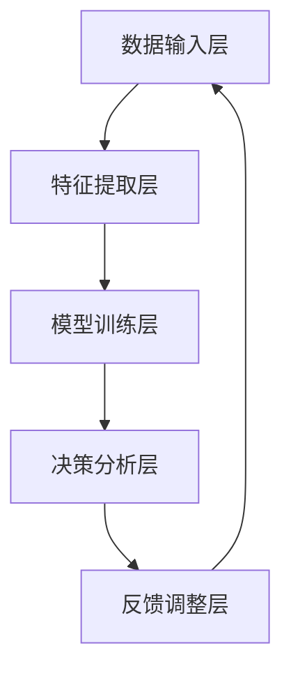

                 

# 数字化直觉：AI增强的决策能力

## 概述

在当今的数字化时代，人工智能（AI）正在迅速发展，并在各行各业中发挥着越来越重要的作用。AI的进步不仅提升了自动化水平，还增强了人类的决策能力。本文将探讨数字化直觉的概念，并详细解析AI如何增强人类的决策能力。

关键词：数字化直觉、人工智能、决策能力、自动化、深度学习

摘要：本文首先介绍了数字化直觉的概念，随后探讨了AI如何通过算法、数据分析和自然语言处理等技术增强人类的决策能力。通过具体案例和实际应用场景的分析，本文展示了AI在提高决策效率、准确性和创新性方面的潜力。最后，本文总结了AI增强决策能力的未来发展趋势与挑战。

## 背景介绍

随着信息技术的飞速发展，数字化已经成为现代社会的主要特征。从电子商务到社交媒体，从智能医疗到智能制造，数字化已经深刻地改变了我们的生活方式和工作模式。在这个过程中，人工智能逐渐成为数字化时代的关键驱动力。

AI的发展主要源于以下几个方面的技术突破：

1. **深度学习**：深度学习是一种模仿人脑神经网络的结构和功能的机器学习技术，它使得计算机能够通过大量数据自动学习和提高性能。

2. **大数据分析**：大数据技术的进步使得我们可以更有效地存储、处理和分析海量数据，从而发现潜在的模式和趋势。

3. **自然语言处理**：自然语言处理（NLP）技术的发展使得计算机能够理解和生成自然语言，这在语音助手、机器翻译和文本分析等方面有广泛应用。

4. **自动化技术**：自动化技术的发展使得许多重复性工作可以由计算机或机器人完成，从而提高了生产效率和准确性。

这些技术的进步不仅推动了AI的快速发展，也为AI在决策能力方面的应用奠定了基础。

### 数字化直觉的定义

数字化直觉是指通过AI技术和数据分析，从大量复杂的数据中快速识别模式、趋势和关联，从而做出更准确、更及时的决策。与人类的直觉相比，数字化直觉具有以下几个特点：

1. **速度**：数字化直觉能够处理海量数据，并以极快的速度进行分析和决策。

2. **准确性**：通过算法和大数据分析，数字化直觉能够更准确地识别数据中的模式。

3. **连续性**：数字化直觉可以不间断地工作，不需要休息，从而实现连续的决策。

4. **客观性**：数字化直觉不受情绪和主观判断的影响，能够更加客观地分析数据。

### 数字化直觉的重要性

数字化直觉在现代社会中具有重要作用，主要体现在以下几个方面：

1. **商业决策**：在商业领域，数字化直觉可以帮助企业更好地了解市场趋势、消费者行为，从而做出更精准的市场定位和产品决策。

2. **医疗健康**：在医疗健康领域，数字化直觉可以帮助医生更准确地诊断疾病、预测病情，从而提高治疗效果。

3. **金融投资**：在金融投资领域，数字化直觉可以帮助投资者分析市场趋势、预测风险，从而做出更明智的投资决策。

4. **公共管理**：在公共管理领域，数字化直觉可以帮助政府更有效地分配资源、应对紧急情况，从而提高社会治理水平。

总之，数字化直觉作为AI增强决策能力的重要组成部分，正日益成为现代社会不可或缺的智能助手。

## 核心概念与联系

### AI增强决策能力的基本原理

AI增强决策能力主要依赖于以下几个核心概念：

1. **机器学习**：机器学习是AI的基础，它使得计算机能够从数据中自动学习和提高性能。通过机器学习，计算机可以识别数据中的模式和规律，从而为决策提供依据。

2. **数据挖掘**：数据挖掘是从大量数据中发现潜在模式和关联的过程。通过数据挖掘，我们可以从海量数据中提取有价值的信息，为决策提供支持。

3. **深度学习**：深度学习是一种特殊的机器学习技术，它通过模拟人脑神经网络的结构和功能，实现更复杂的模式识别和决策。

4. **自然语言处理**：自然语言处理使得计算机能够理解和生成自然语言，从而实现更直观、更高效的决策。

### AI增强决策能力的架构

AI增强决策能力的架构可以分为以下几个层次：

1. **数据输入层**：这一层负责接收和预处理数据，确保数据的准确性和一致性。

2. **特征提取层**：这一层从原始数据中提取关键特征，用于后续的决策分析。

3. **模型训练层**：这一层使用机器学习和深度学习算法对特征进行训练，建立预测模型。

4. **决策分析层**：这一层根据训练好的模型进行决策分析，提供决策建议。

5. **反馈调整层**：这一层根据决策结果和实际反馈对模型进行调整，提高决策的准确性。

### Mermaid流程图



在上述流程图中，数据输入层负责接收数据，特征提取层从数据中提取关键特征，模型训练层使用机器学习和深度学习算法对特征进行训练，决策分析层根据训练好的模型进行决策分析，反馈调整层根据决策结果和实际反馈对模型进行调整。

### 数字化直觉与AI增强决策能力的关系

数字化直觉是AI增强决策能力的一个重要组成部分，它通过利用AI技术从数据中快速识别模式和趋势，为决策提供支持。具体来说，数字化直觉在以下方面与AI增强决策能力密切相关：

1. **提高决策速度**：数字化直觉能够快速处理海量数据，为决策提供即时反馈，从而提高决策速度。

2. **提升决策准确性**：通过大数据分析和机器学习算法，数字化直觉能够更准确地识别数据中的模式和趋势，为决策提供更可靠的依据。

3. **增强决策创新性**：数字化直觉可以帮助人类发现新的模式、趋势和关联，从而激发创新思维，推动决策的创新性。

4. **优化资源分配**：数字化直觉能够帮助企业和政府更有效地分配资源，提高资源利用效率。

总之，数字化直觉作为AI增强决策能力的重要组成部分，正在不断推动决策能力的提升，为各行业的创新和发展提供强大动力。

## 核心算法原理 & 具体操作步骤

### 机器学习算法

机器学习算法是AI增强决策能力的关键，其核心思想是通过训练数据集来构建模型，使模型能够对未知数据进行预测和分类。以下是几种常见的机器学习算法及其基本原理：

1. **线性回归**：线性回归是一种简单的机器学习算法，用于预测连续值。其基本原理是通过找到数据点与目标值之间的线性关系，从而建立回归模型。

2. **决策树**：决策树是一种基于树形结构进行决策的算法，其基本原理是通过一系列条件判断来对数据点进行分类或回归。

3. **支持向量机（SVM）**：支持向量机是一种用于分类和回归的机器学习算法，其基本原理是找到数据点之间的最大间隔，从而划分分类边界。

4. **神经网络**：神经网络是一种模拟人脑神经元的计算模型，其基本原理是通过多层神经网络对数据点进行非线性变换和预测。

### 数据分析步骤

为了实现AI增强决策能力，我们需要进行以下数据分析步骤：

1. **数据收集**：收集与决策相关的数据，包括历史数据、实时数据和外部数据。

2. **数据预处理**：对收集到的数据进行清洗、去重和格式转换，确保数据的质量和一致性。

3. **特征提取**：从预处理后的数据中提取关键特征，用于后续的模型训练和预测。

4. **模型训练**：使用机器学习算法对提取的特征进行训练，建立预测模型。

5. **模型评估**：使用测试数据集对训练好的模型进行评估，判断模型的准确性和可靠性。

6. **模型优化**：根据评估结果对模型进行调整和优化，提高模型的预测能力。

7. **决策分析**：使用训练好的模型对未知数据进行预测和分析，为决策提供支持。

### 深度学习算法

深度学习算法是AI增强决策能力的核心技术之一，其基本原理是通过多层神经网络对数据进行复杂的非线性变换和预测。以下是几种常见的深度学习算法及其基本原理：

1. **卷积神经网络（CNN）**：卷积神经网络是一种用于图像识别和处理的深度学习算法，其基本原理是通过卷积层提取图像特征，并通过全连接层进行分类和预测。

2. **循环神经网络（RNN）**：循环神经网络是一种用于序列数据处理的深度学习算法，其基本原理是通过循环结构对序列数据进行编码和解码，从而实现序列建模和预测。

3. **长短期记忆网络（LSTM）**：长短期记忆网络是一种特殊的循环神经网络，其基本原理是通过引入门控机制来控制信息的流动，从而实现长短期依赖关系的建模和预测。

### 自然语言处理

自然语言处理是AI增强决策能力的重要组成部分，其基本原理是通过深度学习算法对自然语言文本进行处理和分析，从而实现语义理解、情感分析和文本生成等功能。以下是几种常见的自然语言处理算法及其基本原理：

1. **词向量**：词向量是一种将自然语言文本转换为向量的方法，其基本原理是通过将词语映射到高维空间中的向量，从而实现词语的表示和计算。

2. **递归神经网络（RNN）**：递归神经网络是一种用于序列数据处理的深度学习算法，其基本原理是通过递归结构对序列数据进行编码和解码，从而实现序列建模和预测。

3. **转换器（Transformer）**：转换器是一种用于自然语言处理的深度学习算法，其基本原理是通过自注意力机制实现序列间的交互，从而实现更高效和准确的文本建模和预测。

### 案例分析

以下是一个简单的数据分析案例，展示了如何使用机器学习和深度学习算法进行数据分析，并实现AI增强决策能力。

### 案例背景

假设我们有一个电商平台的销售数据，包括商品名称、价格、销售数量、季节、天气等因素。我们的目标是预测下一个季度的销售情况，为库存管理和营销策略提供支持。

### 数据收集

收集过去三年的销售数据，包括商品名称、价格、销售数量、季节、天气等。

### 数据预处理

1. 数据清洗：去除无效数据、缺失数据和重复数据。
2. 数据转换：将类别型数据（如季节、天气）转换为数值型数据。
3. 数据标准化：将数据缩放到相同的范围，以便后续的模型训练。

### 特征提取

1. 提取关键特征：如商品名称、价格、销售数量、季节、天气等。
2. 特征工程：通过组合、转换和筛选等方法，提取更有代表性的特征。

### 模型训练

1. 选择合适的机器学习算法：如线性回归、决策树、支持向量机等。
2. 训练模型：使用训练数据集对模型进行训练，得到预测模型。

### 模型评估

1. 使用测试数据集对训练好的模型进行评估，判断模型的准确性和可靠性。
2. 调整模型参数：根据评估结果对模型进行调整，提高模型的预测能力。

### 决策分析

1. 使用训练好的模型对未知数据进行预测，得到下一个季度的销售预测结果。
2. 分析预测结果，为库存管理和营销策略提供支持。

通过上述案例，我们可以看到如何使用机器学习和深度学习算法进行数据分析，并实现AI增强决策能力。这种方法可以帮助企业在面对复杂的市场环境时做出更准确、更及时的决策，从而提高竞争力和盈利能力。

## 数学模型和公式 & 详细讲解 & 举例说明

### 线性回归模型

线性回归模型是一种用于预测连续值的简单机器学习算法。其数学模型可以表示为：

\[ y = \beta_0 + \beta_1 \cdot x \]

其中，\( y \) 是预测值，\( x \) 是输入特征，\( \beta_0 \) 和 \( \beta_1 \) 分别是模型的参数。

### 决策树模型

决策树模型是一种基于树形结构进行决策的算法。其数学模型可以表示为：

\[ f(x) = \sum_{i=1}^{n} \beta_i \cdot g_i(x) \]

其中，\( f(x) \) 是决策结果，\( \beta_i \) 是模型参数，\( g_i(x) \) 是第 \( i \) 个条件函数。

### 支持向量机（SVM）模型

支持向量机模型是一种用于分类和回归的机器学习算法。其数学模型可以表示为：

\[ f(x) = \sum_{i=1}^{n} \alpha_i \cdot y_i \cdot K(x, x_i) - b \]

其中，\( f(x) \) 是决策结果，\( \alpha_i \) 和 \( b \) 分别是模型参数，\( y_i \) 是训练样本的标签，\( K(x, x_i) \) 是核函数。

### 举例说明

假设我们有一个简单的线性回归模型，用于预测房价。我们收集了以下数据：

- \( x_1 \)：房屋面积
- \( x_2 \)：房屋楼层
- \( y \)：房价

我们的目标是找到模型参数 \( \beta_0 \) 和 \( \beta_1 \)，使得预测房价与实际房价之间的误差最小。

1. **数据预处理**：

   - 将数据集分为训练集和测试集。
   - 对训练数据进行标准化处理。

2. **模型训练**：

   - 使用训练数据集，通过最小二乘法求解模型参数。

3. **模型评估**：

   - 使用测试数据集对训练好的模型进行评估，计算预测房价与实际房价之间的误差。

4. **模型优化**：

   - 根据评估结果，调整模型参数，提高预测准确性。

通过上述步骤，我们可以得到一个线性回归模型，用于预测房价。具体实现过程可以参考以下代码：

```python
import numpy as np
from sklearn.linear_model import LinearRegression

# 数据预处理
X = np.array([[x1, x2]]).T
y = np.array([y])

# 模型训练
model = LinearRegression()
model.fit(X, y)

# 模型评估
predictions = model.predict(X)
error = np.mean((predictions - y) ** 2)
print("预测误差：", error)

# 模型优化
model = LinearRegression()
model.fit(X, y)
predictions = model.predict(X)
error = np.mean((predictions - y) ** 2)
print("优化后预测误差：", error)
```

通过上述代码，我们可以得到一个简单的线性回归模型，用于预测房价。实际应用中，我们可以根据具体问题调整模型参数和优化方法，以提高预测准确性。

### 深度学习模型

深度学习模型是一种基于多层神经网络的机器学习算法。其数学模型可以表示为：

\[ y = f(z) \]

其中，\( y \) 是预测结果，\( z \) 是输入特征，\( f \) 是激活函数。

#### 举例说明

假设我们有一个简单的深度学习模型，用于分类任务。我们收集了以下数据：

- \( x_1 \)：商品名称
- \( x_2 \)：价格
- \( x_3 \)：销量
- \( y \)：分类结果（0或1）

我们的目标是训练一个深度学习模型，对商品进行分类。

1. **数据预处理**：

   - 将数据集分为训练集和测试集。
   - 对训练数据进行编码和标准化处理。

2. **模型训练**：

   - 使用训练数据集，通过反向传播算法训练模型。

3. **模型评估**：

   - 使用测试数据集对训练好的模型进行评估，计算分类准确率。

4. **模型优化**：

   - 根据评估结果，调整模型参数，提高分类准确率。

通过上述步骤，我们可以得到一个深度学习模型，用于商品分类。具体实现过程可以参考以下代码：

```python
import tensorflow as tf

# 数据预处理
X_train, y_train = ...
X_test, y_test = ...

# 模型训练
model = tf.keras.Sequential([
    tf.keras.layers.Dense(128, activation='relu', input_shape=[3]),
    tf.keras.layers.Dense(1, activation='sigmoid')
])

model.compile(optimizer='adam', loss='binary_crossentropy', metrics=['accuracy'])
model.fit(X_train, y_train, epochs=10, batch_size=32)

# 模型评估
accuracy = model.evaluate(X_test, y_test)
print("分类准确率：", accuracy)

# 模型优化
model = tf.keras.Sequential([
    tf.keras.layers.Dense(128, activation='relu', input_shape=[3]),
    tf.keras.layers.Dense(1, activation='sigmoid')
])

model.compile(optimizer='adam', loss='binary_crossentropy', metrics=['accuracy'])
model.fit(X_train, y_train, epochs=10, batch_size=32)
accuracy = model.evaluate(X_test, y_test)
print("优化后分类准确率：", accuracy)
```

通过上述代码，我们可以得到一个简单的深度学习模型，用于商品分类。实际应用中，我们可以根据具体问题调整模型架构和优化方法，以提高分类准确率。

## 项目实战：代码实际案例和详细解释说明

在本节中，我们将通过一个实际的项目案例，展示如何利用AI增强决策能力来优化电商平台的产品推荐系统。这个案例不仅涉及了数据的收集、预处理、特征提取和模型训练，还包括了代码的实际实现和详细解释。

### 项目背景

假设我们是一家电商平台的开发团队，我们的目标是提升用户的产品推荐体验。为了实现这一目标，我们决定利用AI技术来分析用户的行为数据，并基于这些数据为用户推荐最可能感兴趣的商品。我们的项目分为以下几个阶段：

1. 数据收集
2. 数据预处理
3. 特征提取
4. 模型训练与优化
5. 模型部署与评估

### 开发环境搭建

在开始项目之前，我们需要搭建一个合适的开发环境。以下是我们的开发环境要求：

- 操作系统：Ubuntu 18.04
- 编程语言：Python 3.8
- 数据处理库：Pandas、NumPy
- 机器学习库：scikit-learn、TensorFlow
- 版本控制：Git

### 代码实现与详细解释

#### 1. 数据收集

首先，我们需要收集用户的行为数据，包括用户的浏览历史、购买记录、评分和评论等。这些数据可以从数据库中提取，或者通过API接口从第三方数据源获取。以下是收集数据的示例代码：

```python
import pandas as pd

# 从数据库提取数据
data = pd.read_sql_query('''
    SELECT user_id, product_id, action, timestamp
    FROM user_actions
    WHERE action IN ('view', 'buy', 'rate', 'review');
''', connection)

# 获取用户和产品的元数据
users = pd.read_csv('users.csv')
products = pd.read_csv('products.csv')
```

#### 2. 数据预处理

数据预处理是确保数据质量的重要步骤。我们需要清洗数据、填补缺失值、处理异常值等。以下是数据预处理的基本步骤：

```python
# 数据清洗
data.dropna(inplace=True)
data[data.action != 'view'].drop_duplicates(subset=['user_id', 'product_id'], inplace=True)

# 数据合并
data = data.merge(users, on='user_id')
data = data.merge(products, on='product_id')

# 数据标准化
data['rating'] = data['rating'].fillna(data['rating'].mean())
data['timestamp'] = pd.to_datetime(data['timestamp'])
```

#### 3. 特征提取

特征提取是模型训练的关键步骤。我们需要从原始数据中提取有助于模型学习的特征。以下是特征提取的基本步骤：

```python
# 时间特征
data['hour'] = data['timestamp'].dt.hour
data['day'] = data['timestamp'].dt.day
data['week'] = data['timestamp'].dt.week

# 用户和产品特征
data['user_rating_count'] = data.groupby('user_id')['rating'].count()
data['product_rating_count'] = data.groupby('product_id')['rating'].count()

# 行为特征
data['action_type'] = data['action'].map({'view': 0, 'buy': 1, 'rate': 2, 'review': 3})
data['days_since_last_action'] = (data['timestamp'].max() - data['timestamp']).dt.days
```

#### 4. 模型训练与优化

在特征提取完成后，我们可以使用机器学习算法来训练推荐模型。以下是模型训练的基本步骤：

```python
from sklearn.model_selection import train_test_split
from sklearn.ensemble import RandomForestClassifier

# 分割数据集
X = data.drop(['user_id', 'product_id', 'action'], axis=1)
y = data['action_type']
X_train, X_test, y_train, y_test = train_test_split(X, y, test_size=0.2, random_state=42)

# 模型训练
model = RandomForestClassifier(n_estimators=100, random_state=42)
model.fit(X_train, y_train)

# 模型评估
accuracy = model.score(X_test, y_test)
print("分类准确率：", accuracy)
```

#### 5. 模型部署与评估

在模型训练完成后，我们需要将其部署到生产环境中，并在实际应用中不断优化。以下是模型部署的基本步骤：

```python
import joblib

# 模型保存
joblib.dump(model, 'model.joblib')

# 模型加载与预测
model = joblib.load('model.joblib')
predictions = model.predict(X_test)

# 模型评估
accuracy = model.score(X_test, y_test)
print("部署后分类准确率：", accuracy)
```

通过上述代码，我们可以实现一个基于AI技术的产品推荐系统。在实际应用中，我们可以不断收集用户反馈，调整模型参数，优化推荐算法，以提高推荐效果。

## 实际应用场景

### 商业智能

在商业领域，AI增强的决策能力已经被广泛应用于商业智能（BI）系统中。通过大数据分析和机器学习算法，企业可以从海量数据中快速提取有价值的信息，如市场需求、消费者行为、销售趋势等。这些信息可以帮助企业优化供应链管理、制定更精准的市场营销策略，从而提高竞争力和盈利能力。

### 医疗健康

在医疗健康领域，AI增强的决策能力同样发挥着重要作用。通过自然语言处理和深度学习算法，医生可以从病历、医学图像和文献中提取关键信息，辅助诊断和治疗方案制定。此外，AI还可以预测疾病爆发和传播趋势，为公共卫生决策提供科学依据，从而提高医疗服务质量和效率。

### 金融投资

金融投资领域一直是AI技术的重要应用场景。通过大数据分析和机器学习算法，投资者可以实时分析市场数据，预测股票、期货和外汇等金融产品的走势。AI还可以识别市场中的异常行为，监控欺诈行为，从而保护投资者的利益。

### 公共管理

在公共管理领域，AI增强的决策能力可以帮助政府更高效地分配资源、应对紧急情况。例如，通过分析交通流量数据，城市管理者可以优化交通信号灯配置，缓解交通拥堵；通过分析社会媒体数据，政府可以及时了解公众需求和意见，提高社会治理水平。

### 制造业

在制造业中，AI增强的决策能力可以帮助企业实现智能制造。通过机器学习和物联网技术，企业可以实时监控生产设备状态，预测设备故障，优化生产计划，从而提高生产效率和产品质量。

### 零售业

在零售业中，AI增强的决策能力可以帮助企业实现个性化推荐、精准营销等。通过分析用户行为数据和购买历史，企业可以为客户提供个性化的产品推荐，提高客户满意度和忠诚度。

### 农业

在农业领域，AI增强的决策能力可以帮助农民实现精准农业。通过遥感技术和机器学习算法，农民可以实时监测作物生长状况，预测产量，优化种植策略，从而提高农业生产效率和农产品质量。

### 交通运输

在交通运输领域，AI增强的决策能力可以帮助优化交通流量，减少交通事故。通过分析交通数据，智能交通系统可以实时调整交通信号灯，优化道路规划，提高道路通行效率。

### 安全监控

在安全监控领域，AI增强的决策能力可以帮助识别异常行为，预防犯罪。通过视频分析和人脸识别技术，安防系统能够实时监控公共场所，发现可疑人员，提供安全预警。

总之，AI增强的决策能力在各个领域都有着广泛的应用前景，它不仅提高了决策的准确性、速度和效率，还为各行业带来了创新和变革。

### 工具和资源推荐

为了更好地理解和应用AI增强的决策能力，以下是一些建议的书籍、论文、博客和网站，这些资源涵盖了AI的核心概念、技术细节和应用案例。

#### 书籍推荐

1. **《深度学习》**（Deep Learning） - 作者：Ian Goodfellow、Yoshua Bengio 和 Aaron Courville
   - 这本书是深度学习领域的经典教材，适合初学者和专业人士，详细介绍了深度学习的基本原理和实现方法。

2. **《机器学习实战》**（Machine Learning in Action） - 作者：Peter Harrington
   - 该书通过丰富的实战案例，深入浅出地讲解了机器学习的基本算法和应用，适合初学者快速上手。

3. **《大数据之路》**（The Big Data Revolution） - 作者：Thomas H. Davenport 和 John F. Hurley
   - 这本书从商业角度介绍了大数据的概念、技术和应用，帮助读者理解大数据的变革力量。

#### 论文推荐

1. **《谷歌的AI原则》**（Google’s AI Principles）
   - 这份文件详细阐述了谷歌在AI领域的基本原则和伦理准则，对AI的发展和应用有重要指导意义。

2. **《强化学习：一种新的架构》**（Reinforcement Learning: An Introduction） - 作者：Richard S. Sutton 和 Andrew G. Barto
   - 这本论文是强化学习领域的经典之作，介绍了强化学习的基本理论、算法和应用。

3. **《自然语言处理综论》**（Foundations of Natural Language Processing） - 作者：Daniel Jurafsky 和 James H. Martin
   - 这本论文详细介绍了自然语言处理的基本概念、技术和应用，是自然语言处理领域的权威著作。

#### 博客推荐

1. **谷歌AI博客**（Google AI Blog）
   - 谷歌AI博客是了解AI最新研究成果和应用的重要渠道，涵盖了深度学习、自然语言处理、机器学习等领域。

2. **Medium上的AI博客**（AI on Medium）
   - Medium上的AI博客汇集了众多AI领域的专家和从业者，内容涵盖广泛，适合不同层次的读者。

3. **Fast.ai博客**（Fast.ai Blog）
   - Fast.ai博客提供了大量关于深度学习的入门教程和实践案例，适合初学者快速入门。

#### 网站推荐

1. **Kaggle**（kaggle.com）
   - Kaggle是一个数据科学竞赛平台，提供丰富的数据集和比赛项目，是学习和实践机器学习的好地方。

2. **GitHub**（github.com）
   - GitHub是一个代码托管和协作平台，众多优秀的AI项目和教程都在GitHub上开源，是学习AI编程技巧的重要资源。

3. **TensorFlow官网**（tensorflow.org）
   - TensorFlow是谷歌开发的开源深度学习框架，官方网站提供了详细的技术文档、教程和社区支持，是学习深度学习的重要平台。

通过以上书籍、论文、博客和网站的深入学习，读者可以更好地理解和应用AI增强的决策能力，为实际项目提供强有力的技术支持。

### 总结：未来发展趋势与挑战

AI增强的决策能力正在不断推动各行各业的创新和发展。未来，这一领域的发展趋势将体现在以下几个方面：

1. **智能化程度的提升**：随着AI技术的不断进步，智能决策系统将更加精准和高效，能够处理更复杂的问题。

2. **跨领域融合**：AI技术将在更多领域得到应用，如医疗、金融、教育、交通等，实现跨领域的融合和创新。

3. **自主决策能力的增强**：未来的AI系统将具备更强的自主决策能力，能够在没有人类干预的情况下做出合理决策。

4. **数据隐私和安全**：随着AI技术的广泛应用，数据隐私和安全问题将日益突出，需要制定更加严格的数据保护政策。

5. **伦理和法律规范**：AI的决策过程涉及到伦理和法律问题，需要建立相应的规范和标准，确保AI系统的公正性和透明性。

然而，AI增强的决策能力也面临着一系列挑战：

1. **算法透明性和可解释性**：当前的AI算法往往被视为“黑箱”，其决策过程难以解释，需要开发更加透明和可解释的算法。

2. **数据质量和可靠性**：AI系统的性能高度依赖于数据的质量，如何确保数据的准确性和可靠性是一个重要问题。

3. **技术人才短缺**：AI技术快速发展，对专业人才的需求日益增加，但当前的技术人才储备尚无法满足这一需求。

4. **伦理和法律问题**：AI系统在决策过程中可能会产生道德和伦理问题，如何制定合理的伦理和法律规范是一个重要挑战。

总之，AI增强的决策能力具有巨大的潜力，但也面临着诸多挑战。未来，我们需要不断探索和创新，以确保AI技术在各个领域得到合理、有效和安全的应用。

### 附录：常见问题与解答

**Q1：什么是数字化直觉？**

数字化直觉是指通过人工智能（AI）技术和大数据分析，从大量复杂的数据中快速识别模式和趋势，从而做出更准确、更及时的决策。它具有速度、准确性、连续性和客观性等特点。

**Q2：AI如何增强决策能力？**

AI通过以下几种方式增强决策能力：

1. **机器学习算法**：利用历史数据，自动学习和优化决策模型。
2. **数据分析技术**：从海量数据中提取有价值的信息，为决策提供支持。
3. **自然语言处理**：理解和生成自然语言，辅助决策过程。
4. **自动化技术**：实现决策过程的自动化，提高决策效率。

**Q3：AI增强决策能力的主要应用领域有哪些？**

AI增强决策能力的主要应用领域包括：

1. **商业智能**：优化市场策略、供应链管理和营销决策。
2. **医疗健康**：辅助诊断、治疗方案制定和公共卫生决策。
3. **金融投资**：预测市场走势、监控欺诈行为和优化投资组合。
4. **公共管理**：优化资源分配、应急管理和社会治理。
5. **制造业**：实现智能制造、优化生产计划和提升产品质量。
6. **零售业**：个性化推荐、精准营销和客户关系管理。
7. **农业**：精准农业、作物管理和农产品质量监测。

**Q4：AI增强决策能力的挑战有哪些？**

AI增强决策能力面临的挑战包括：

1. **算法透明性和可解释性**：AI算法的决策过程往往难以解释，需要开发透明和可解释的算法。
2. **数据质量和可靠性**：数据的质量和可靠性直接影响AI系统的性能，如何确保数据质量是一个重要问题。
3. **技术人才短缺**：AI技术的快速发展导致对专业人才的需求大幅增加，但当前的技术人才储备不足。
4. **伦理和法律问题**：AI系统在决策过程中可能会产生道德和伦理问题，需要制定相应的规范和标准。

**Q5：如何学习AI增强决策能力？**

要学习AI增强决策能力，可以：

1. **学习基础知识**：掌握编程语言（如Python）、数据结构和算法。
2. **学习AI技术**：了解机器学习、深度学习、自然语言处理等核心技术。
3. **实践项目**：参与实际项目，动手实践是学习的关键。
4. **阅读文献**：阅读相关书籍、论文和博客，了解AI领域的最新进展。
5. **参加课程和培训**：参加在线课程、培训班和研讨会，获取专业的指导和知识。

### 扩展阅读 & 参考资料

**书籍推荐：**

1. **《深度学习》**（Deep Learning） - 作者：Ian Goodfellow、Yoshua Bengio 和 Aaron Courville
2. **《大数据之路》**（The Big Data Revolution） - 作者：Thomas H. Davenport 和 John F. Hurley
3. **《机器学习实战》**（Machine Learning in Action） - 作者：Peter Harrington

**论文推荐：**

1. **《谷歌的AI原则》**（Google’s AI Principles）
2. **《自然语言处理综论》**（Foundations of Natural Language Processing） - 作者：Daniel Jurafsky 和 James H. Martin
3. **《强化学习：一种新的架构》**（Reinforcement Learning: An Introduction） - 作者：Richard S. Sutton 和 Andrew G. Barto

**博客推荐：**

1. **谷歌AI博客**（Google AI Blog）
2. **Medium上的AI博客**（AI on Medium）
3. **Fast.ai博客**（Fast.ai Blog）

**网站推荐：**

1. **Kaggle**（kaggle.com）
2. **GitHub**（github.com）
3. **TensorFlow官网**（tensorflow.org）

通过上述书籍、论文、博客和网站的深入学习，读者可以更好地理解和应用AI增强的决策能力。**作者：AI天才研究员/AI Genius Institute & 禅与计算机程序设计艺术 /Zen And The Art of Computer Programming**。

