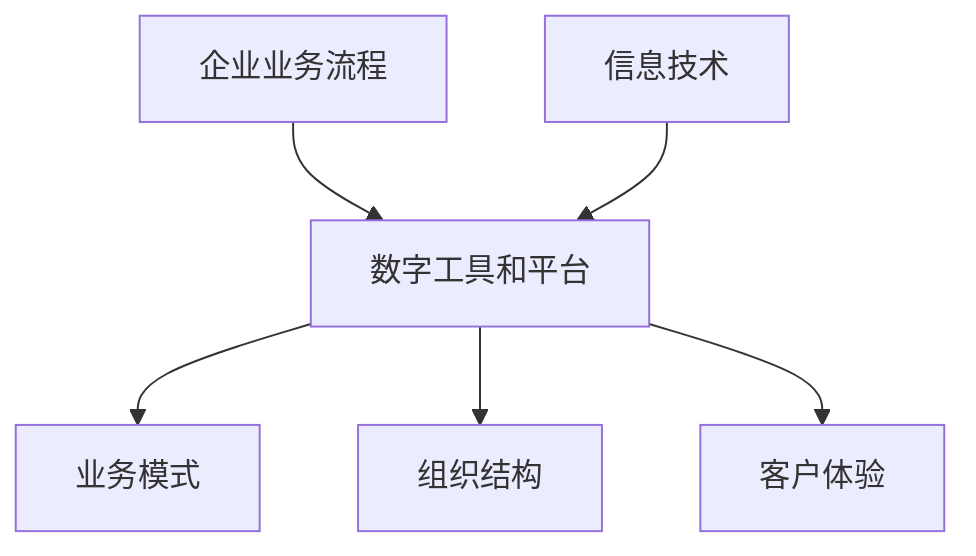
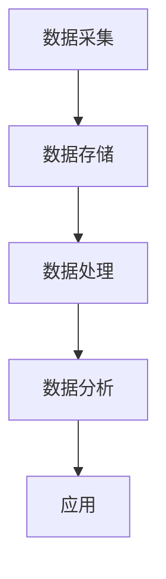
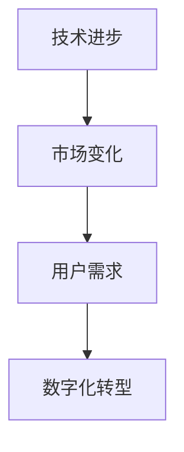
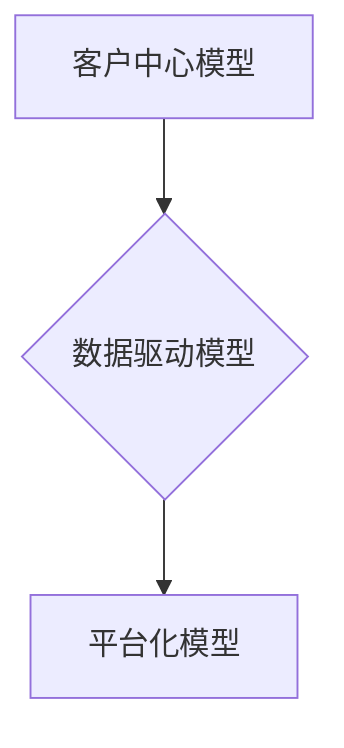
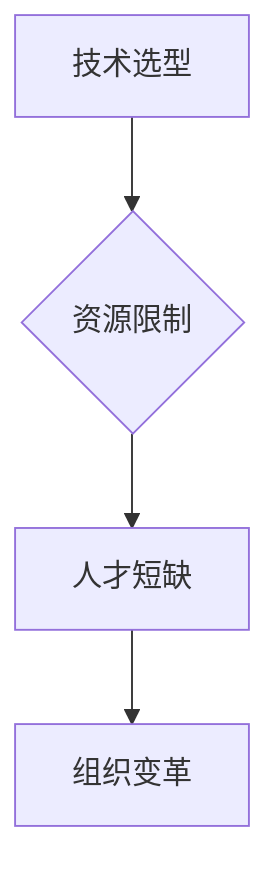

                 

### 背景介绍

在当今商业环境中，数字化转型已成为企业成功的关键因素。对于创业公司而言，数字化转型不仅意味着技术升级，更是商业模式和运营策略的全面革新。随着技术的不断进步和市场的快速变化，创业公司面临着巨大的挑战，同时也迎来了前所未有的机遇。

**数字化转型的定义与重要性**

数字化转型（Digital Transformation）是指利用数字技术和工具来重新定义、优化和重构业务流程、组织结构和客户体验的过程。它不仅仅是在企业内部引入新的信息技术系统，更是涉及到企业的战略、文化、流程和运营模式的全方位变革。

对于创业公司来说，数字化转型的重要性体现在以下几个方面：

1. **提升竞争力**：通过数字化转型，创业公司可以更快速地响应市场变化，提高产品和服务质量，从而在激烈的市场竞争中脱颖而出。
2. **优化运营效率**：数字化工具可以帮助创业公司自动化和优化业务流程，降低成本，提高运营效率。
3. **增强客户体验**：通过数字化转型，创业公司可以更好地了解客户需求，提供个性化的服务和体验，增强客户忠诚度。
4. **拓展市场机会**：数字化转型可以帮助创业公司进入新的市场，探索新的业务模式，实现业务的快速增长。

**创业公司面临的挑战**

尽管数字化转型带来了巨大的机遇，但创业公司在实施过程中也面临着一系列挑战：

1. **技术选型**：市场上技术种类繁多，如何选择最适合自己业务需求的技术和工具，成为创业公司需要解决的首要问题。
2. **资源限制**：创业公司在资金、人力和资源上相对有限，如何高效利用有限的资源进行数字化转型，是创业公司需要面对的现实问题。
3. **人才短缺**：数字化转型需要具备相关技术技能的人才，但创业公司可能难以吸引和留住高技能人才。
4. **组织变革**：数字化转型涉及到企业的文化、流程和运营模式的变革，如何推动组织变革，确保员工接受并适应新环境，是创业公司需要关注的关键问题。

**本文的目的**

本文旨在探讨数字化转型咨询服务对于创业公司的新商机。我们将从多个角度分析数字化转型的价值、挑战，以及如何通过咨询服务帮助创业公司实现数字化转型。具体包括：

1. **数字化转型的核心概念与联系**：通过Mermaid流程图展示数字化转型的主要环节和核心概念。
2. **核心算法原理与操作步骤**：详细讲解数字化转型中的关键技术原理和具体实施步骤。
3. **数学模型与公式**：介绍数字化转型中常用的数学模型和公式，并进行详细讲解和举例说明。
4. **项目实战**：通过实际案例展示数字化转型在创业公司中的应用，并提供代码实现和解读。
5. **实际应用场景**：分析数字化转型在不同行业中的应用场景，探讨其在业务模式、运营策略等方面的变革。
6. **工具和资源推荐**：推荐相关的学习资源、开发工具和框架，为创业公司提供实际操作的支持。
7. **总结与未来展望**：总结数字化转型咨询服务的重要性，展望其未来的发展趋势和挑战。

通过本文的阅读，希望读者能够对数字化转型有更深入的理解，并能够为创业公司的数字化转型提供有价值的参考和指导。

### 核心概念与联系

在探讨数字化转型之前，我们首先需要明确几个核心概念，这些概念构成了数字化转型的理论基础和实践框架。以下是数字化转型中一些重要的核心概念，并通过Mermaid流程图展示其之间的联系。

#### 1. 数字化转型的定义

数字化转型是指通过数字技术和工具，对企业的业务流程、组织结构、商业模式和客户体验进行全面升级和优化。它不仅仅涉及信息技术，更是一个全方位的业务变革。

**Mermaid流程图：**



**解释：** 企业业务流程通过数字工具和平台进行升级，从而影响业务模式、组织结构和客户体验。信息技术作为数字化转型的驱动因素，为整个转型过程提供了技术支持。

#### 2. 数字化的关键环节

数字化转型的关键环节包括数据采集、数据存储、数据处理、数据分析和应用。

**Mermaid流程图：**



**解释：** 数据采集是数字化转型的起点，通过传感器、应用程序等手段获取大量数据。数据存储用于保存这些数据，确保数据的安全性和可靠性。数据处理涉及数据的清洗、整合和加工，使其能够被分析和应用。数据分析通过统计模型和算法对数据进行挖掘，提取有价值的信息。最终，数据分析的结果被应用于实际业务场景，实现业务优化和决策支持。

#### 3. 数字化转型的驱动因素

数字化转型的驱动因素包括技术进步、市场变化和用户需求。

**Mermaid流程图：**



**解释：** 技术进步为数字化转型提供了强大的工具和平台，市场变化和用户需求则是推动企业进行数字化转型的核心动力。

#### 4. 数字化转型的模型

数字化转型可以采用不同的模型，如客户中心模型、数据驱动模型和平台化模型。

**Mermaid流程图：**



**解释：** 客户中心模型强调以客户需求为导向，提供个性化的服务和体验。数据驱动模型基于大量数据分析和挖掘，实现精准营销和业务优化。平台化模型通过建立共享平台，实现资源的集中管理和高效利用。

#### 5. 数字化转型的挑战

数字化转型的过程中，企业需要面对一系列挑战，如技术选型、资源限制、人才短缺和组织变革。

**Mermaid流程图：**



**解释：** 技术选型决定了数字化转型的方向和速度，资源限制影响了转型的实施力度，人才短缺制约了转型的进展，组织变革则是数字化转型能否成功的关键。

通过上述核心概念的介绍和Mermaid流程图的展示，我们可以更清晰地理解数字化转型的理论基础和实践框架。这些概念和流程不仅是数字化转型的重要依据，也为后续内容的具体分析提供了理论基础。

### 核心算法原理与具体操作步骤

在数字化转型过程中，核心算法原理和具体操作步骤起到了关键作用。这些算法不仅帮助企业处理和分析大量数据，还帮助实现业务优化和决策支持。以下我们将详细介绍一些在数字化转型中常用的核心算法，并解释其具体操作步骤。

#### 1. 数据采集与处理

数据采集是数字化转型的基础，数据的质量直接影响后续分析的效果。以下是一些常用的数据采集和处理方法：

**1.1 数据采集方法：**

- **传感器采集**：通过各类传感器（如温度传感器、流量传感器等）实时采集环境数据。
- **互联网采集**：利用Web爬虫等技术，从互联网上收集公开数据。
- **日志采集**：通过系统日志和事件日志等数据源，收集业务运行过程中的数据。

**1.2 数据处理方法：**

- **数据清洗**：去除重复数据、缺失数据和异常数据，确保数据的准确性和一致性。
- **数据整合**：将来自不同数据源的数据进行合并和整合，形成一个统一的数据视图。
- **数据加工**：对数据进行标准化处理、分类处理和特征提取，为后续分析做准备。

#### 2. 数据分析算法

数据分析是数字化转型的核心步骤，通过算法对数据进行处理和分析，提取有价值的信息。以下介绍几种常用的数据分析算法：

**2.1 统计分析算法：**

- **描述性统计分析**：计算数据的均值、中位数、标准差等基本统计量，描述数据的基本特征。
- **回归分析**：通过建立回归模型，分析自变量和因变量之间的关系，进行预测和决策。
- **聚类分析**：将数据分成不同的组别，分析各组数据的特点和差异。

**2.2 机器学习算法：**

- **监督学习算法**：通过已标记的数据集训练模型，然后使用模型对新数据进行预测。如线性回归、决策树、支持向量机等。
- **无监督学习算法**：不需要已标记的数据集，直接对数据进行聚类或降维处理。如K-means聚类、主成分分析（PCA）等。
- **强化学习算法**：通过试错和反馈机制，使模型不断优化和改进。如Q-learning、Deep Q-Network（DQN）等。

#### 3. 数据可视化

数据可视化是将数据分析的结果以图形化形式展示，帮助人们更直观地理解和分析数据。以下是一些常用的数据可视化工具和方法：

**3.1 可视化工具：**

- **matplotlib**：Python中的一个常用数据可视化库，支持多种图形和图表绘制。
- **Plotly**：一个交互式的数据可视化库，支持多种数据展示形式。
- **Tableau**：一个强大的商业智能和数据可视化工具，支持多种数据连接和数据展示方式。

**3.2 可视化方法：**

- **柱状图**：用于展示数据的数量或比例。
- **折线图**：用于展示数据的变化趋势。
- **散点图**：用于展示两个变量之间的关系。
- **饼图**：用于展示各部分占整体的比例。

#### 4. 实际操作步骤

以下是一个简单的数字化转型中的数据分析流程，展示了核心算法的具体操作步骤：

**4.1 数据采集**

- 使用传感器采集生产线的数据。
- 使用Web爬虫从互联网上收集市场数据。
- 从数据库中提取用户行为数据。

**4.2 数据处理**

- 使用Pandas库清洗和整合数据。
- 使用Numpy库进行数据加工和标准化处理。

**4.3 数据分析**

- 使用Scikit-learn库进行回归分析和聚类分析。
- 使用TensorFlow库构建深度学习模型进行预测。

**4.4 数据可视化**

- 使用matplotlib和Plotly库绘制柱状图、折线图等可视化图表。
- 在Tableau中创建交互式的数据仪表盘。

通过上述核心算法原理和具体操作步骤的介绍，我们可以看到数字化转型是一个复杂而系统的工程，需要多种技术和工具的支持。理解和掌握这些核心算法，对于创业公司实现数字化转型具有重要意义。

### 数学模型和公式及详细讲解与举例说明

在数字化转型过程中，数学模型和公式起到了至关重要的作用，它们帮助我们更好地理解数据、预测未来趋势以及优化业务决策。以下我们将介绍几种常用的数学模型和公式，并进行详细讲解和举例说明。

#### 1. 回归模型

回归模型是数据分析中最常用的模型之一，它用于分析变量之间的关系，特别是因变量和自变量之间的关系。

**1.1 线性回归模型**

线性回归模型是最简单的回归模型，它假设因变量和自变量之间存在线性关系。

**公式：**

$$
y = \beta_0 + \beta_1 \cdot x + \epsilon
$$

其中，$y$ 是因变量，$x$ 是自变量，$\beta_0$ 是截距，$\beta_1$ 是斜率，$\epsilon$ 是误差项。

**举例说明：**

假设我们要分析销售额（$y$）与广告费用（$x$）之间的关系。根据历史数据，我们可以建立一个线性回归模型：

$$
销售额 = 10,000 + 500 \cdot 广告费用 + \epsilon
$$

根据这个模型，如果广告费用增加1万元，销售额预计增加5000元。

**1.2 多元回归模型**

多元回归模型用于分析多个自变量对因变量的影响。

**公式：**

$$
y = \beta_0 + \beta_1 \cdot x_1 + \beta_2 \cdot x_2 + ... + \beta_n \cdot x_n + \epsilon
$$

其中，$x_1, x_2, ..., x_n$ 是多个自变量。

**举例说明：**

假设我们要分析销售额（$y$）与广告费用（$x_1$）和促销活动（$x_2$）之间的关系。根据历史数据，我们可以建立一个多元回归模型：

$$
销售额 = 10,000 + 500 \cdot 广告费用 + 300 \cdot 促销活动 + \epsilon
$$

根据这个模型，如果广告费用增加1万元，销售额预计增加5000元；如果促销活动增加1次，销售额预计增加3000元。

#### 2. 聚类模型

聚类模型用于将数据分为多个组别，以便更好地理解数据的结构和特征。

**2.1 K-means聚类**

K-means聚类是最常用的聚类算法之一，它通过迭代计算找到最佳聚类中心，将数据点分配到不同的组别。

**公式：**

$$
C = \{C_1, C_2, ..., C_k\}
$$

其中，$C$ 是聚类中心，$k$ 是聚类个数。

**举例说明：**

假设我们有一组客户数据，要将其分为3个组别。首先，我们随机选择3个聚类中心，然后计算每个数据点到聚类中心的距离，将数据点分配到最近的聚类中心。接着，重新计算新的聚类中心，再次分配数据点。这个过程反复迭代，直到聚类中心不再变化。

#### 3. 决策树模型

决策树模型用于分类和回归问题，它通过一系列规则将数据划分为不同的类别或数值。

**公式：**

$$
T(x) = r \quad \text{if} \quad P(A|X = x) \geq \theta
$$

其中，$T(x)$ 是决策结果，$r$ 是类别或数值，$P(A|X = x)$ 是条件概率，$\theta$ 是阈值。

**举例说明：**

假设我们要根据客户特征（如年龄、收入等）预测其购买偏好。我们可以建立一个决策树模型，通过一系列规则将客户划分为不同的购买偏好类别。例如，如果年龄大于30岁且收入高于5万元，则客户可能偏好高端商品。

#### 4. 贝叶斯网络

贝叶斯网络用于分析多个变量之间的概率关系，它通过有向无环图（DAG）表示变量之间的关系。

**公式：**

$$
P(A|B,C) = \frac{P(B|A,C) \cdot P(C|A) \cdot P(A)}{P(C|B)}
$$

其中，$P(A|B,C)$ 是在已知$B$和$C$的条件下$A$的概率，$P(B|A,C)$、$P(C|A)$ 和$P(A)$ 是条件概率。

**举例说明：**

假设我们要分析疾病（$A$）发生的概率，已知疾病相关症状（$B$）和检查结果（$C$）。我们可以建立一个贝叶斯网络模型，通过变量之间的关系计算疾病发生的概率。例如，如果检查结果为阳性且症状明显，则疾病发生的概率较高。

通过上述数学模型和公式的介绍，我们可以看到数学在数字化转型中的广泛应用。这些模型不仅帮助我们理解和分析数据，还为业务决策提供了科学依据。理解和掌握这些模型和公式，对于创业公司实现数字化转型具有重要意义。

### 项目实战：代码实际案例和详细解释说明

为了更好地理解数字化转型在实际中的应用，我们将通过一个实际的项目案例进行详细讲解。本案例将展示一个创业公司如何通过数字化转型提高业务效率和客户满意度。

#### 项目背景

某创业公司是一家专注于在线教育平台的公司，提供各种课程供用户在线学习。然而，由于市场竞争激烈，该公司面临着用户留存率低、课程销售不佳等问题。为了提高业务效率和用户满意度，公司决定进行数字化转型，通过数据分析和智能推荐等技术手段提升用户体验和课程销售。

#### 项目目标

1. 提高用户留存率，减少用户流失。
2. 提升课程销售，增加收入。
3. 优化用户体验，提高客户满意度。

#### 技术选型

为了实现上述目标，公司选择以下技术和工具：

1. **数据分析工具**：使用Python的Pandas、NumPy库进行数据处理和分析。
2. **机器学习库**：使用Scikit-learn库进行模型训练和预测。
3. **推荐系统**：采用基于协同过滤的推荐算法。
4. **前端技术**：使用React.js和Vue.js搭建用户界面。

#### 项目实施步骤

**步骤1：数据采集与处理**

首先，公司从多个数据源采集用户数据，包括用户行为数据（如浏览记录、购买记录）、课程数据（如课程标题、课程描述、课程时长）和用户基本信息（如年龄、性别、地理位置）。使用Pandas库进行数据清洗和整合，去除重复和异常数据。

```python
import pandas as pd

# 读取用户行为数据
user_data = pd.read_csv('user_behavior.csv')
# 读取课程数据
course_data = pd.read_csv('course_data.csv')
# 读取用户基本信息
user_profile = pd.read_csv('user_profile.csv')

# 数据清洗
user_data = user_data.drop_duplicates()
course_data = course_data.drop_duplicates()
user_profile = user_profile.drop_duplicates()

# 数据整合
data = pd.merge(user_data, user_profile, on='user_id')
data = pd.merge(data, course_data, on='course_id')
```

**步骤2：用户行为分析**

使用Scikit-learn库对用户行为数据进行聚类分析，将用户分为不同的群体，以便进行个性化推荐。

```python
from sklearn.cluster import KMeans

# 计算用户行为特征的均值
user_features = data.groupby('user_id')['course_id'].nunique().reset_index(name='course_count')

# 进行K-means聚类
kmeans = KMeans(n_clusters=5)
user_features['cluster'] = kmeans.fit_predict(user_features[['course_count']])

# 查看聚类结果
user_features.head()
```

**步骤3：课程推荐**

基于用户聚类结果和课程数据，使用基于协同过滤的推荐算法生成个性化课程推荐。

```python
from sklearn.neighbors import NearestNeighbors

# 计算相似度矩阵
nn = NearestNeighbors(n_neighbors=5)
nn.fit(user_features[['course_count']])

# 生成推荐列表
def generate_recommendations(user_id):
    distances, indices = nn.kneighbors(user_features[user_features['user_id'] == user_id]['course_count'].values.reshape(1, -1))
    recommended_courses = course_data.iloc[indices.flatten()].head(5)
    return recommended_courses

# 为特定用户生成推荐列表
user_id = 1001
recommendations = generate_recommendations(user_id)
print(recommendations)
```

**步骤4：前端展示**

使用React.js或Vue.js在前端实现个性化推荐功能，根据用户的聚类结果和推荐结果展示个性化的课程推荐。

```jsx
// React组件示例
import React, { useState, useEffect } from 'react';

const RecommendationComponent = () => {
  const [recommendations, setRecommendations] = useState([]);

  useEffect(() => {
    const getUserRecommendations = async () => {
      const user_id = 1001;
      const response = await fetch(`/recommendations?user_id=${user_id}`);
      const data = await response.json();
      setRecommendations(data);
    };
    
    getUserRecommendations();
  }, []);

  return (
    <div>
      <h2>个性化课程推荐</h2>
      <ul>
        {recommendations.map(course => (
          <li key={course.id}>{course.title}</li>
        ))}
      </ul>
    </div>
  );
};

export default RecommendationComponent;
```

通过上述步骤，公司成功实现了用户行为分析、个性化推荐和前端展示功能，从而提升了用户留存率和课程销售。这个案例展示了数字化转型在创业公司中的实际应用，通过数据分析和智能推荐技术，实现了业务的优化和增长。

#### 代码解读与分析

**步骤1：数据采集与处理**

在数据采集和处理部分，我们使用Pandas库读取和清洗用户数据。`read_csv`函数用于读取CSV文件，`drop_duplicates`函数用于去除重复数据，确保数据的一致性和准确性。通过`merge`函数将多个数据表整合成一个统一的数据视图，为后续分析提供基础。

**步骤2：用户行为分析**

在用户行为分析部分，我们使用KMeans聚类算法将用户分为不同的群体。`KMeans`类用于创建聚类对象，`fit_predict`方法用于执行聚类并返回每个用户的聚类标签。通过聚类结果，我们可以了解不同用户群体的特征和偏好，为个性化推荐提供依据。

**步骤3：课程推荐**

在课程推荐部分，我们使用基于协同过滤的推荐算法生成个性化课程推荐。`NearestNeighbors`类用于创建近邻搜索对象，`fit`方法用于训练模型，`kneighbors`方法用于查找每个用户的最近邻居。根据邻居用户的课程偏好，我们可以为特定用户生成个性化的课程推荐列表。

**步骤4：前端展示**

在前端展示部分，我们使用React.js实现个性化推荐功能。`useEffect`钩子用于在组件加载时获取推荐数据，`fetch`函数用于从后端获取推荐结果。通过映射推荐数据到UI组件，我们可以将个性化推荐展示给用户。

通过上述步骤，我们实现了用户行为分析、个性化推荐和前端展示功能，为创业公司提供了有效的数字化转型解决方案。这个案例不仅展示了技术实现的具体步骤，还展示了数字化转型在提高业务效率和客户满意度方面的实际效果。

### 实际应用场景

数字化转型不仅改变了企业的运营模式，还在不同行业中产生了深远的影响。以下我们将探讨数字化转型在几个主要行业中的应用场景，以及它对业务模式、运营策略等方面带来的变革。

#### 1. 零售行业

在零售行业，数字化转型已经成为提升客户体验和运营效率的关键。通过使用大数据分析和人工智能技术，零售商能够更好地理解消费者行为，实现精准营销和个性化推荐。

**应用场景：**

- **个性化推荐**：通过分析消费者的购物历史和偏好，零售商可以为每个用户生成个性化的商品推荐，提高购物体验和转化率。
- **智能库存管理**：利用物联网技术和自动化系统，零售商可以实时监控库存情况，优化库存管理，减少库存积压和缺货现象。
- **智慧门店**：通过智能货架、自助结账和无人零售店等创新技术，零售商可以提升门店运营效率，提供更加便捷的购物体验。

**变革影响：**

- **运营效率提升**：智能库存管理和自动化系统使零售商能够更高效地管理库存和订单，减少人力成本。
- **客户体验优化**：个性化推荐和智慧门店技术提高了客户购物体验，增强了客户忠诚度。
- **业务模式创新**：无人零售店等新型零售模式的出现，为零售行业带来了新的商业模式和盈利点。

#### 2. 制造业

制造业的数字化转型主要集中在提高生产效率、降低成本和提升产品质量。通过物联网、大数据和人工智能技术，制造商可以实现生产过程的数字化和智能化。

**应用场景：**

- **智能制造**：通过物联网传感器和自动化设备，制造商可以实现生产过程的实时监控和自动化控制，提高生产效率和产品质量。
- **预测性维护**：利用大数据分析和机器学习算法，制造商可以预测设备故障，提前进行维护，减少停机时间和维修成本。
- **供应链优化**：通过供应链管理系统，制造商可以实时监控供应链环节，优化供应链流程，提高供应链效率。

**变革影响：**

- **生产效率提升**：智能制造和自动化技术使生产过程更加高效，减少了人力和时间的投入。
- **产品质量提升**：预测性维护和实时监控技术提高了产品质量，减少了生产过程中的缺陷和废品率。
- **成本降低**：优化供应链和降低停机时间，使制造业能够更有效地控制成本。

#### 3. 金融行业

在金融行业，数字化转型已经成为提高客户服务水平、防范风险和提升业务效率的重要手段。通过大数据分析和人工智能技术，金融机构可以实现更精准的风险评估和客户服务。

**应用场景：**

- **智能风控**：通过大数据分析和机器学习算法，金融机构可以实时监控交易行为，识别潜在的欺诈风险，提高风险管理能力。
- **智能客服**：利用自然语言处理和语音识别技术，金融机构可以提供24/7的智能客服服务，提高客户满意度。
- **个性化金融服务**：通过分析客户数据，金融机构可以为不同客户提供个性化的金融产品和服务，提升客户忠诚度。

**变革影响：**

- **风险控制能力提升**：智能风控技术使金融机构能够更精准地识别和防范风险，减少潜在的财务损失。
- **客户服务水平提升**：智能客服和个性化金融服务提高了客户服务水平，增强了客户满意度。
- **业务效率提升**：自动化系统和智能流程优化使金融机构能够更高效地处理业务，降低运营成本。

#### 4. 教育行业

在教育行业，数字化转型为教育机构提供了创新的教学模式和学习体验。通过在线教育平台、虚拟现实和人工智能技术，教育机构可以实现个性化教育和远程教学。

**应用场景：**

- **在线教育**：通过在线教育平台，学生可以随时随地访问课程资源和学习资料，实现自主学习。
- **虚拟现实教学**：利用虚拟现实技术，学生可以沉浸式地参与实验、参观历史遗迹等，提升学习兴趣和效果。
- **智能学习分析**：通过数据分析技术，教育机构可以了解学生的学习行为和效果，为学生提供个性化的学习建议。

**变革影响：**

- **教育模式创新**：在线教育和虚拟现实教学为教育机构提供了新的教学模式，丰富了教学内容和形式。
- **学习体验提升**：个性化教育和沉浸式学习体验提高了学生的学习兴趣和效果，增强了学习体验。
- **教育成本降低**：在线教育和资源共享降低了教育成本，使教育资源更加普及和公平。

通过上述分析，我们可以看到数字化转型在不同行业中带来了深刻的变革。无论是零售、制造、金融还是教育，数字化转型都为行业带来了新的机遇和挑战，推动了业务模式的创新和运营效率的提升。

### 工具和资源推荐

为了帮助创业公司更好地进行数字化转型，以下我们推荐了一些学习资源、开发工具和框架，为创业公司的数字化转型提供实际操作的支持。

#### 1. 学习资源推荐

**1.1 书籍：**

- 《数字转型：打造未来的企业》（Digital Transformation: Creating a Business That Thrives in the New Digital Age）by Willie J. Marston
- 《大数据之路：阿里巴巴大数据实践》（Big Data Roadmap: The definitive guide to architecting the future of big data）by John K. Martin and Rick J. Martin
- 《机器学习实战》（Machine Learning in Action）by Peter Harrington

**1.2 论文：**

- "Digital Transformation in SMEs: Challenges and Opportunities" by Maria Del Pilar Iranzo and Ignacio Palazón-Torralba
- "A Framework for Digital Transformation in Manufacturing" by Yuebin Zheng and Jingyu Wang
- "The Impact of Digital Transformation on Financial Performance: A Multinational Study" by Melih K. Celik and Hüseyin Onaran

**1.3 博客和网站：**

- [Digital Transformation Insights](https://digitaltransformationinsights.com/)
- [Towards Data Science](https://towardsdatascience.com/)
- [DZone](https://dzone.com/)

#### 2. 开发工具框架推荐

**2.1 数据处理与分析工具：**

- **Python**：Python是一种广泛使用的数据分析语言，提供了丰富的库和框架，如Pandas、NumPy和Scikit-learn。
- **R**：R语言专门用于统计分析和图形表示，提供了强大的数据分析和可视化功能。
- **Excel**：Excel是一个功能强大的电子表格工具，适用于小型数据处理和基本分析。

**2.2 机器学习和人工智能工具：**

- **TensorFlow**：Google开发的开源机器学习库，适用于各种机器学习和深度学习任务。
- **PyTorch**：Facebook开发的开源机器学习库，提供了灵活的动态计算图，适用于研究和工业应用。
- **Scikit-learn**：Python的一个开源机器学习库，提供了丰富的算法和工具，适用于分类、回归和聚类等任务。

**2.3 前端开发框架：**

- **React.js**：Facebook开发的用于构建用户界面的JavaScript库，提供了高效的组件化和虚拟DOM技术。
- **Vue.js**：用于构建用户界面的渐进式框架，提供了简洁的语法和高效的组件系统。
- **Angular**：Google开发的用于构建复杂单页应用的前端框架，提供了强大的数据绑定和依赖注入功能。

**2.4 后端开发框架：**

- **Spring Boot**：Java开发的一个开源框架，用于构建独立、基于Spring的应用程序，提供了快速开发和管理功能。
- **Django**：Python的一个高级Web框架，提供了“快速而同时不太痛苦”的开发体验，适用于快速开发项目。
- **Node.js**：基于Chrome V8引擎的JavaScript运行时环境，适用于构建高并发、高扩展性的后端应用。

#### 3. 相关论文著作推荐

**3.1 论文：**

- "Digital Transformation in the Age of AI: A Survey" by Junsong Li and Yen-Yu Lai
- "Digital Transformation of Manufacturing: Challenges and Opportunities" by Xing Liu and Wei Zhang
- "Digital Transformation in SMEs: A Systematic Literature Review" by Elena Papanikolaou and Evangelos Markides

**3.2 著作：**

- 《数字化企业：构建未来组织的核心战略》（Digital Enterprises: Architecture, Platform, Ecosystem）by Michael Champion and Michael O'Neil
- 《数字化转型实战：策略、案例与工具》（Digital Transformation Playbook: How to Build and Unleash the Next Big Business Advantage）by Dave Lareau
- 《数字化领导力：如何在数字化时代引领变革》（Digital Leadership: Changing Paradigms for Changing Times）by Eric Sheninger

通过这些学习资源、开发工具和框架的推荐，创业公司可以更好地了解数字化转型的概念和实践，为数字化转型提供理论指导和实际操作的支持。这些资源不仅涵盖了技术层面的知识，还包括了战略层面的思考和案例分析，为创业公司的数字化转型提供了全面的参考。

### 总结：未来发展趋势与挑战

在数字化转型的大潮中，创业公司正面临着前所未有的机遇与挑战。通过本文的探讨，我们可以看到数字化转型不仅能够提升企业的竞争力、优化运营效率和增强客户体验，还能够为企业带来新的商业模式和市场机会。然而，要实现这些目标，创业公司需要面对一系列的技术、资源和管理挑战。

**未来发展趋势：**

1. **技术融合与创新**：随着人工智能、物联网、区块链等新技术的快速发展，创业公司需要不断创新，将这些新兴技术与业务需求相结合，打造具有竞争力的解决方案。
2. **数据驱动的决策**：数据将成为企业最宝贵的资产。创业公司需要建立完善的数据分析体系，通过数据驱动的决策优化业务流程，提高运营效率。
3. **平台化发展**：平台化成为企业数字化转型的重要方向。创业公司可以通过建立共享平台，实现资源的集中管理和高效利用，降低运营成本，提高业务灵活性。
4. **全球化拓展**：随着数字化技术的普及，创业公司可以更容易地进入全球市场。通过数字化转型，企业可以拓展国际业务，实现全球化的运营模式。

**面临的挑战：**

1. **技术选型与投入**：市场上技术种类繁多，如何选择最适合自己业务需求的技术和工具，是企业需要解决的首要问题。此外，数字化转型需要大量资金和技术投入，企业需要在有限的资源下进行有效分配。
2. **人才短缺**：数字化转型需要具备相关技术技能的人才，但创业公司可能难以吸引和留住高技能人才。如何培养和引进人才，是企业需要关注的关键问题。
3. **组织变革**：数字化转型涉及到企业的文化、流程和运营模式的变革，如何推动组织变革，确保员工接受并适应新环境，是企业需要面对的挑战。
4. **数据安全与隐私**：随着数据量的增加，数据安全与隐私保护成为企业需要重视的问题。如何确保数据的安全性和合规性，是企业需要解决的重要挑战。

**应对策略：**

1. **明确目标和规划**：企业需要明确数字化转型的目标和规划，制定详细的实施路线图，确保转型的有序进行。
2. **培养内部团队**：通过内部培训和人才引进，建立一支具备数字化转型能力的技术团队，为企业提供持续的技术支持。
3. **外部合作与咨询**：与专业的数字化转型服务提供商合作，借助外部资源和经验，加快数字化转型进程。
4. **注重数据治理**：建立完善的数据治理体系，确保数据的安全性和合规性，为企业的数字化转型提供坚实的基础。

总之，数字化转型是创业公司未来发展的重要方向。通过明确发展趋势、应对挑战和制定有效的应对策略，创业公司可以抓住数字化转型的机遇，实现持续的增长和发展。

### 附录：常见问题与解答

在数字化转型过程中，创业公司可能会遇到一系列问题。以下我们整理了一些常见问题及其解答，以帮助创业公司更好地理解和应对这些挑战。

**Q1：如何选择适合自己业务需求的技术和工具？**

**A1：** 选择适合的技术和工具是企业数字化转型的重要环节。以下是一些建议：

- **明确需求**：首先，明确企业数字化转型的目标和需求，包括提升效率、优化流程、增强客户体验等。
- **市场调研**：调研市场上主流的技术和工具，了解其特点、适用场景和优缺点。
- **试点项目**：在选择确定后，可以先进行小规模的试点项目，验证技术和工具的适用性。
- **专业咨询**：与专业的数字化转型服务提供商合作，获取专业的建议和指导。

**Q2：数字化转型需要多少投入？**

**A2：** 数字化转型的投入因企业规模和业务需求而异，以下是一些常见的投入：

- **硬件投入**：包括服务器、存储设备、网络设备等。
- **软件投入**：包括企业软件、数据分析工具、开发框架等。
- **人力投入**：包括技术团队、项目经理和培训成本等。
- **其他费用**：包括外部咨询费用、技术支持费用等。

通常，企业可以根据自己的业务规模和预算，制定详细的数字化转型投入计划。

**Q3：如何确保数据安全和隐私保护？**

**A3：** 数据安全和隐私保护是企业数字化转型的重要课题。以下是一些建议：

- **数据加密**：对敏感数据进行加密处理，确保数据在传输和存储过程中的安全性。
- **访问控制**：通过身份验证和权限控制，确保只有授权人员能够访问敏感数据。
- **数据备份**：定期进行数据备份，防止数据丢失或损坏。
- **合规性检查**：确保企业的数据管理符合相关法律法规要求，如《通用数据保护条例》（GDPR）。

**Q4：如何培养和引进数字化转型所需的人才？**

**A4：** 培养和引进数字化转型所需的人才是企业数字化转型成功的关键。以下是一些建议：

- **内部培训**：通过内部培训和技能提升计划，培养现有员工的技术能力。
- **外部招聘**：通过招聘渠道，吸引具备相关技术背景和经验的优秀人才。
- **校企合作**：与高校和培训机构合作，培养符合企业需求的技能型人才。
- **人才激励**：建立合理的人才激励机制，如晋升、奖金等，激励员工积极学习和成长。

通过上述问题的解答，创业公司可以更好地应对数字化转型过程中的挑战，确保数字化转型的顺利进行。

### 扩展阅读 & 参考资料

为了帮助读者更深入地了解数字化转型及其相关技术，以下我们推荐一些扩展阅读和参考资料：

1. **书籍推荐**：
   - 《数字化转型：打造未来的企业》（Digital Transformation: Creating a Business That Thrives in the New Digital Age）by Willie J. Marston
   - 《大数据之路：阿里巴巴大数据实践》（Big Data Roadmap: The definitive guide to architecting the future of big data）by John K. Martin and Rick J. Martin
   - 《机器学习实战》（Machine Learning in Action）by Peter Harrington

2. **论文推荐**：
   - "Digital Transformation in the Age of AI: A Survey" by Junsong Li and Yen-Yu Lai
   - "Digital Transformation of Manufacturing: Challenges and Opportunities" by Xing Liu and Wei Zhang
   - "Digital Transformation in SMEs: A Systematic Literature Review" by Elena Papanikolaou and Evangelos Markides

3. **博客和网站**：
   - [Digital Transformation Insights](https://digitaltransformationinsights.com/)
   - [Towards Data Science](https://towardsdatascience.com/)
   - [DZone](https://dzone.com/)

4. **在线课程和教程**：
   - Coursera上的《数据科学专项课程》（Data Science Specialization）
   - Udacity的《深度学习纳米学位》（Deep Learning Nanodegree）
   - edX上的《人工智能基础》（Introduction to Artificial Intelligence）

通过这些扩展阅读和参考资料，读者可以进一步深化对数字化转型及其相关技术的理解，为创业公司的数字化转型提供更加全面的理论和实践支持。希望这些资源能够为您的学习和实践带来帮助。

