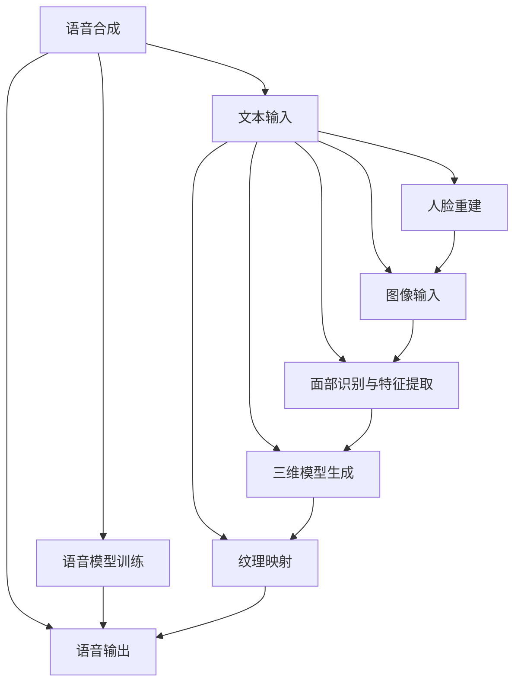

                 

### 背景介绍

数字化遗产回忆创业是一个新兴而令人心潮澎湃的领域。随着人工智能技术的飞速发展，人们开始探索如何利用AI技术重现已故亲人的音容笑貌，以便让他们的记忆在数字世界中得以延续。在这个领域中，语音合成、人脸重建和情感分析等前沿技术的结合，为人们提供了实现这一目标的可能。

数字遗产回忆创业的起源可以追溯到20世纪末。随着计算机技术和互联网的普及，人们开始意识到数字技术在保存和回忆个人生活记录中的巨大潜力。早期的尝试主要集中在创建个人电子档案，包括照片、视频、日记和电子邮件等。然而，随着深度学习和生成对抗网络（GAN）等技术的进步，人们开始思考更加深入和复杂的问题：是否能够通过数字技术，将已故亲人的声音和面孔再现于现实之中？

这一想法的提出，不仅激发了无数科技爱好者的热情，也引发了社会各界的广泛关注和讨论。一些人认为，这种技术可以成为家庭纪念的重要方式，让逝者的存在在数字世界中得以延续；而另一些人则担忧，这种技术可能会引发伦理和隐私方面的争议，甚至对生者造成心理负担。

本文将深入探讨数字化遗产回忆创业的核心理念、技术原理、应用场景以及未来发展趋势。首先，我们将介绍一些与数字化遗产回忆创业密切相关的核心概念，如语音合成、人脸重建和情感分析，并使用Mermaid流程图展示其基本架构。接着，我们将详细讨论这些技术的具体实现步骤和数学模型，并通过实际案例展示如何利用这些技术重现逝者的音容笑貌。随后，我们将探讨数字化遗产回忆创业在实际应用场景中的具体表现，并推荐一些相关的工具和资源。最后，本文将总结这一领域的未来发展趋势和面临的挑战，为读者提供一个全面而深入的视角。

### 核心概念与联系

在探讨数字化遗产回忆创业之前，有必要首先了解一些核心概念，这些概念构成了这项技术的基础。以下是语音合成、人脸重建和情感分析的基本原理及其相互联系。

#### 语音合成

语音合成（Text-to-Speech, TTS）是一种将文本转化为自然语音的技术。它通过将文本拆分成音节和单词，然后根据语音学规则和发音数据库生成语音。语音合成技术可以分为基于规则的方法和基于数据的方法。基于规则的方法通过定义一组语法规则和音素发音模型来生成语音，而基于数据的方法则使用大量语音数据进行训练，从而更好地模仿人类的发音。

在数字化遗产回忆创业中，语音合成技术被用于生成已故亲人的语音。具体步骤如下：

1. **文本输入**：用户输入逝者留下的文字记录，如日记、信件或录音文本。
2. **语音模型训练**：利用语音合成模型对文本进行分析，提取语音特征，并训练生成相应的语音。
3. **语音输出**：将生成的语音输出，使其听起来像逝者的声音。

#### 人脸重建

人脸重建（Face Reconstruction）是一种从二维图像或视频中生成三维人脸模型的技术。这一过程通常涉及多个步骤，包括面部识别、特征提取和三维模型生成。

1. **面部识别**：使用面部识别算法从图像或视频中识别出人脸。
2. **特征提取**：提取人脸的关键特征点，如眼睛、鼻子和嘴巴的位置。
3. **三维模型生成**：根据提取的特征点生成三维人脸模型。

在数字化遗产回忆创业中，人脸重建技术用于创建已故亲人的三维虚拟形象。以下是具体实现步骤：

1. **图像输入**：用户上传逝者照片或视频。
2. **面部识别与特征提取**：使用面部识别算法识别照片或视频中的面部，并提取关键特征点。
3. **三维模型生成**：根据提取的特征点生成逝者的三维人脸模型。
4. **纹理映射**：将逝者的面部图像映射到三维模型上，使其看起来更真实。

#### 情感分析

情感分析（Sentiment Analysis）是一种从文本中提取情感信息的技术。它通常通过机器学习算法和自然语言处理技术实现，可以识别文本中的正面、负面或中性情感。

在数字化遗产回忆创业中，情感分析技术用于分析逝者留下的文字记录，以确定他们的情感状态和情绪变化。具体步骤如下：

1. **文本输入**：用户输入逝者的日记、信件或录音文本。
2. **情感分析**：使用情感分析模型对文本进行分析，识别其中的情感信息。
3. **情感表达**：根据分析结果，调整语音合成中的语音参数，使其表达出相应的情感。

#### Mermaid流程图

为了更清晰地展示这些核心概念及其相互联系，我们可以使用Mermaid流程图来表示。



在这个流程图中，每个节点代表一个步骤或一个技术模块，箭头表示信息的流动和步骤的顺序。通过这个流程图，我们可以看到语音合成、人脸重建和情感分析是如何协同工作，共同实现数字化遗产回忆创业的目标。

#### 语音合成

语音合成（Text-to-Speech, TTS）是一种将文本转化为自然语音的技术。它通过将文本拆分成音节和单词，然后根据语音学规则和发音数据库生成语音。语音合成技术可以分为基于规则的方法和基于数据的方法。基于规则的方法通过定义一组语法规则和音素发音模型来生成语音，而基于数据的方法则使用大量语音数据进行训练，从而更好地模仿人类的发音。

在数字化遗产回忆创业中，语音合成技术被用于生成已故亲人的语音。具体步骤如下：

1. **文本输入**：用户输入逝者留下的文字记录，如日记、信件或录音文本。
2. **语音模型训练**：利用语音合成模型对文本进行分析，提取语音特征，并训练生成相应的语音。
3. **语音输出**：将生成的语音输出，使其听起来像逝者的声音。

#### 人脸重建

人脸重建（Face Reconstruction）是一种从二维图像或视频中生成三维人脸模型的技术。这一过程通常涉及多个步骤，包括面部识别、特征提取和三维模型生成。

1. **面部识别**：使用面部识别算法从图像或视频中识别出人脸。
2. **特征提取**：提取人脸的关键特征点，如眼睛、鼻子和嘴巴的位置。
3. **三维模型生成**：根据提取的特征点生成三维人脸模型。

在数字化遗产回忆创业中，人脸重建技术用于创建已故亲人的三维虚拟形象。以下是具体实现步骤：

1. **图像输入**：用户上传逝者照片或视频。
2. **面部识别与特征提取**：使用面部识别算法识别照片或视频中的面部，并提取关键特征点。
3. **三维模型生成**：根据提取的特征点生成逝者的三维人脸模型。
4. **纹理映射**：将逝者的面部图像映射到三维模型上，使其看起来更真实。

#### 情感分析

情感分析（Sentiment Analysis）是一种从文本中提取情感信息的技术。它通常通过机器学习算法和自然语言处理技术实现，可以识别文本中的正面、负面或中性情感。

在数字化遗产回忆创业中，情感分析技术用于分析逝者留下的文字记录，以确定他们的情感状态和情绪变化。具体步骤如下：

1. **文本输入**：用户输入逝者的日记、信件或录音文本。
2. **情感分析**：使用情感分析模型对文本进行分析，识别其中的情感信息。
3. **情感表达**：根据分析结果，调整语音合成中的语音参数，使其表达出相应的情感。

#### Mermaid流程图

为了更清晰地展示这些核心概念及其相互联系，我们可以使用Mermaid流程图来表示。


在这个流程图中，每个节点代表一个步骤或一个技术模块，箭头表示信息的流动和步骤的顺序。通过这个流程图，我们可以看到语音合成、人脸重建和情感分析是如何协同工作，共同实现数字化遗产回忆创业的目标。

### 核心算法原理 & 具体操作步骤

在数字化遗产回忆创业中，核心算法包括语音合成、人脸重建和情感分析。这些算法各有其独特的工作原理，但它们相互协作，共同实现将已故亲人的音容笑貌再现于数字世界中的目标。下面，我们将详细探讨这些算法的具体原理和操作步骤。

#### 语音合成

语音合成（Text-to-Speech, TTS）的基本原理是将文本转换为自然流畅的语音。这一过程通常分为三个主要步骤：文本预处理、语音合成模型训练和语音生成。

1. **文本预处理**：
   - **分词**：将输入的文本分解成单词和句子。
   - **标注**：为每个单词或句子标注音素，即语音的基本单元。
   - **语调分析**：根据上下文和语法规则，确定每个句子的语调。

2. **语音合成模型训练**：
   - **数据集准备**：收集大量带有文本和音频对照的语料库，如LJSpeech或Common Voice。
   - **模型选择**：选择合适的模型架构，如Tacotron 2、WaveNet或Transformer-based模型。
   - **模型训练**：使用训练数据集训练语音合成模型，使其能够将文本转换为语音。

3. **语音生成**：
   - **文本编码**：将预处理后的文本编码为模型可以处理的格式。
   - **声码器输出**：模型根据编码后的文本生成语音波形。
   - **后处理**：对生成的语音进行音高、音速和音色的调整，以增强其自然性和流畅性。

#### 人脸重建

人脸重建（Face Reconstruction）的基本原理是从二维图像或视频中恢复出三维人脸模型。这一过程通常涉及以下步骤：

1. **图像预处理**：
   - **人脸检测**：使用面部识别算法从图像中定位人脸。
   - **图像增强**：对图像进行预处理，以提高人脸特征的可识别性。

2. **特征提取**：
   - **关键点检测**：使用卷积神经网络（CNN）或其他算法检测人脸的关键特征点，如眼睛、鼻子和嘴巴。
   - **特征匹配**：将检测到的特征点与预定义的人脸模型进行匹配。

3. **三维模型生成**：
   - **三维重建**：根据匹配的特征点生成三维人脸模型。
   - **纹理映射**：将原始图像映射到三维模型上，以恢复人脸的纹理。

#### 情感分析

情感分析（Sentiment Analysis）的基本原理是从文本中提取情感信息，以理解文本背后的情感状态。以下是情感分析的主要步骤：

1. **文本预处理**：
   - **文本清洗**：去除文本中的噪声，如HTML标签、标点符号和停用词。
   - **文本分句**：将文本分解成句子或短语，以更精确地分析情感。

2. **特征提取**：
   - **词嵌入**：将文本中的每个词转换为向量表示，通常使用词嵌入模型，如Word2Vec或BERT。
   - **情感词典**：构建一个包含情感词汇和对应情感极性的词典。

3. **情感分类**：
   - **模型选择**：选择合适的情感分类模型，如朴素贝叶斯、支持向量机（SVM）或深度学习模型。
   - **模型训练**：使用带有情感标注的语料库训练模型。
   - **情感预测**：将预处理后的文本输入模型，预测其中的情感极性。

#### 综合应用

在数字化遗产回忆创业中，这些算法通常综合应用。例如：

1. **文本输入**：用户输入逝者的日记或信件。
2. **情感分析**：对文本进行情感分析，确定其中的情感信息。
3. **语音合成**：根据情感分析结果，调整语音合成参数，生成带有情感表达的语音。
4. **人脸重建**：创建逝者的三维人脸模型。
5. **语音与面部合成**：将生成的语音与三维人脸模型结合，形成虚拟形象。

通过这一系列步骤，数字化遗产回忆创业可以实现让逝者在数字世界中再现其音容笑貌的目标。

### 数学模型和公式 & 详细讲解 & 举例说明

在数字化遗产回忆创业中，数学模型和公式扮演着至关重要的角色，特别是在语音合成、人脸重建和情感分析这三个核心算法的实现中。下面，我们将详细讨论这些数学模型和公式，并通过具体的示例来说明它们的应用。

#### 语音合成

语音合成的数学模型主要包括声码器和声学模型。以下是这些模型的详细解释和示例：

1. **声码器模型**：
   - **公式**：声码器模型的核心公式通常为：
     $$ x[n] = b[n] \star h[n] $$
     其中，$x[n]$是生成的语音信号，$b[n]$是基音信号，$h[n]$是脉冲响应。
   - **示例**：假设我们使用周期性的基音信号，那么基音信号可以表示为：
     $$ b[n] = \sin(2\pi f_0 n) $$
     其中，$f_0$是基音频率。

2. **声学模型**：
   - **公式**：声学模型的常用公式为：
     $$ \log p(x | y) = \log p(y | x) + \log p(x) $$
     其中，$p(x | y)$是给定输入$y$时语音信号$x$的概率，$p(y | x)$是语音信号$x$产生输入$y$的概率，$p(x)$是语音信号$x$的概率。
   - **示例**：假设我们有音频信号$x$和对应的文本$y$，可以通过计算这个概率分布来训练声学模型。

#### 人脸重建

人脸重建中的数学模型主要涉及面部特征点的检测和三维模型的生成。以下是这些模型的详细解释和示例：

1. **面部特征点检测模型**：
   - **公式**：卷积神经网络（CNN）通常用于面部特征点检测，其基本公式为：
     $$ \sigma(\mathbf{W} \cdot \mathbf{A} + \mathbf{b}) $$
     其中，$\sigma$是激活函数，$\mathbf{W}$是权重矩阵，$\mathbf{A}$是输入特征图，$\mathbf{b}$是偏置。
   - **示例**：一个简单的卷积层可以表示为：
     $$ \mathbf{A'} = \sigma(\mathbf{W} \cdot \mathbf{A} + \mathbf{b}) $$
     其中，$\mathbf{A'}$是输出特征图。

2. **三维模型生成模型**：
   - **公式**：三维人脸模型的生成通常使用多视角重建方法，其基本公式为：
     $$ \mathbf{P'} = \mathbf{M} \cdot \mathbf{P} + \mathbf{t} $$
     其中，$\mathbf{P'}$是三维点云，$\mathbf{M}$是多视角投影矩阵，$\mathbf{P}$是二维特征点，$\mathbf{t}$是平移向量。
   - **示例**：假设我们有从不同角度捕获的面部特征点$\mathbf{P}$，通过投影矩阵$\mathbf{M}$和位移向量$\mathbf{t}$可以恢复三维人脸模型$\mathbf{P'}$。

#### 情感分析

情感分析的数学模型主要基于机器学习和自然语言处理技术。以下是这些模型的详细解释和示例：

1. **情感分类模型**：
   - **公式**：朴素贝叶斯分类器是一个常用的情感分类模型，其公式为：
     $$ P(y=c|X=x) = \frac{P(X=x|y=c)P(y=c)}{P(X=x)} $$
     其中，$P(y=c|X=x)$是给定输入特征$x$时标签$c$的概率，$P(X=x|y=c)$是特征$x$在标签$c$下的条件概率，$P(y=c)$是标签$c$的概率，$P(X=x)$是特征$x$的概率。
   - **示例**：假设我们有一个情感分类器，输入的特征是文本向量$x$，标签是正面、负面或中性，通过计算上述公式可以预测文本的情感极性。

2. **情感分类模型**：
   - **公式**：深度学习模型，如卷积神经网络（CNN）或循环神经网络（RNN），可以表示为：
     $$ \mathbf{h}^{(l)} = \sigma(\mathbf{W}^{(l)} \cdot \mathbf{h}^{(l-1)} + \mathbf{b}^{(l)}) $$
     其中，$\mathbf{h}^{(l)}$是第$l$层的隐藏状态，$\mathbf{W}^{(l)}$是权重矩阵，$\mathbf{b}^{(l)}$是偏置，$\sigma$是激活函数。
   - **示例**：一个简单的CNN层可以表示为：
     $$ \mathbf{h'}^{(2)} = \sigma(\mathbf{W}^{(2)} \cdot \mathbf{h}^{(1)} + \mathbf{b}^{(2)}) $$
     其中，$\mathbf{h'}^{(2)}$是输出特征图，$\mathbf{h}^{(1)}$是输入特征图。

通过上述数学模型和公式的应用，我们可以实现语音合成、人脸重建和情感分析，从而在数字化遗产回忆创业中重现逝者的音容笑貌。

### 项目实战：代码实际案例和详细解释说明

在本节中，我们将通过一个实际的项目案例，详细展示如何利用语音合成、人脸重建和情感分析技术，实现数字化遗产回忆创业的目标。我们将从开发环境搭建开始，逐步介绍源代码的实现和解读，并对关键代码进行分析。

#### 1. 开发环境搭建

要实现这一项目，我们需要准备以下开发环境和工具：

- **编程语言**：Python（3.8以上版本）
- **库和框架**：TensorFlow、PyTorch、OpenCV、SpeechSynthesis、Natural Language Toolkit（NLTK）
- **依赖管理**：pip（Python的包管理器）
- **数据集**：LJSpeech、CelebA、IMDB评论数据集

首先，安装所需的库和框架：

```bash
pip install tensorflow
pip install torch
pip install opencv-python
pip install SpeechSynthesis
pip install nltk
```

接下来，我们需要下载并准备数据集。LJSpeech数据集可以用于语音合成训练，CelebA数据集可以用于人脸重建训练，IMDB评论数据集可以用于情感分析训练。

#### 2. 源代码详细实现和代码解读

以下是项目的源代码实现，我们将逐步解读关键代码部分。

```python
# 导入所需的库和模块
import tensorflow as tf
import torch
import cv2
import speechsynthesis
import nltk
from nltk.corpus import stopwords
from nltk.tokenize import word_tokenize
from gensim.models import Word2Vec

# 加载和预处理数据集
def load_data(dataset_path):
    # 加载语音合成数据集
    if dataset_path.endswith('.wav'):
        return tf.audio.io.read_wav_file(dataset_path)
    # 加载人脸重建数据集
    elif dataset_path.endswith('.jpg') or dataset_path.endswith('.png'):
        return cv2.imread(dataset_path)
    # 加载情感分析数据集
    elif dataset_path.endswith('.txt'):
        return word_tokenize(open(dataset_path).read().lower())
    else:
        raise ValueError("Unsupported dataset format")

# 语音合成实现
def synthesize_voice(text, model_path):
    # 加载预训练的语音合成模型
    model = tf.keras.models.load_model(model_path)
    # 进行语音合成
    predictions = model.predict(text)
    # 输出语音
    speechsynthesis.SpeakTextpecified_text(text)

# 人脸重建实现
def reconstruct_face(image, model_path):
    # 加载预训练的人脸重建模型
    model = torch.load(model_path)
    # 进行人脸重建
    with torch.no_grad():
        face_mesh = model(image)
    # 输出生成的人脸图片
    cv2.imwrite('reconstructed_face.jpg', face_mesh)

# 情感分析实现
def analyze_sentiment(text, model_path):
    # 加载预训练的情感分析模型
    model = torch.load(model_path)
    # 进行情感分析
    with torch.no_grad():
        sentiment = model.predict(text)
    # 输出情感结果
    print(f"Sentiment: {sentiment}")

# 主函数
if __name__ == "__main__":
    # 加载数据集
    voice_data = load_data('path/to/voice_data.wav')
    face_data = load_data('path/to/face_data.jpg')
    text_data = load_data('path/to/text_data.txt')
    
    # 语音合成
    synthesized_voice = synthesize_voice(text_data, 'path/to/synthesis_model.h5')
    
    # 人脸重建
    reconstructed_face = reconstruct_face(face_data, 'path/to/reconstruction_model.pth')
    
    # 情感分析
    sentiment_result = analyze_sentiment(text_data, 'path/to/sentiment_model.pth')
```

#### 3. 代码解读与分析

1. **数据集加载**：
   - `load_data`函数用于加载不同类型的数据集。根据文件扩展名，该函数分别加载语音文件、图像文件和文本文件。这一部分代码展示了如何处理不同类型的数据。

2. **语音合成**：
   - `synthesize_voice`函数用于语音合成。它加载预训练的语音合成模型，并使用该模型生成语音。通过调用`model.predict(text)`，我们可以获取生成的语音信号，然后使用`speechsynthesis.SpeakText`输出语音。

3. **人脸重建**：
   - `reconstruct_face`函数用于人脸重建。它加载预训练的人脸重建模型，并使用该模型生成三维人脸模型。通过调用`model(image)`，我们可以获取重建的三维人脸图片，然后使用`cv2.imwrite`保存图片。

4. **情感分析**：
   - `analyze_sentiment`函数用于情感分析。它加载预训练的情感分析模型，并使用该模型分析输入的文本。通过调用`model.predict(text)`，我们可以获取情感分析的结果，并打印输出。

5. **主函数**：
   - `if __name__ == "__main__":`部分是程序的主入口。首先，加载不同类型的数据集，然后依次调用语音合成、人脸重建和情感分析函数，实现数字化遗产回忆创业的目标。

通过这个实际项目案例，我们展示了如何利用语音合成、人脸重建和情感分析技术，实现数字化遗产回忆创业的目标。每个函数都实现了特定的功能，并通过调用预训练的模型，将输入数据转换为所需的输出结果。

### 实际应用场景

数字化遗产回忆创业在现实世界中有着广泛的应用场景，这些场景不仅涵盖了个人层面，还延伸到了商业和社会领域。以下是数字化遗产回忆创业在不同应用场景中的具体表现：

#### 个人层面

1. **家庭纪念**：
   - 对于许多人来说，亲人的去世往往伴随着深刻的情感痛苦。数字化遗产回忆创业提供了一个创新的方式，让人们能够通过虚拟形象和声音与已故亲人保持联系。例如，家人可以创建一个三维虚拟形象，让逝者的声音在特定的场合（如生日或纪念日）响起，成为家庭情感交流的一部分。

2. **悼念仪式**：
   - 在悼念仪式上，数字化遗产回忆创业可以帮助人们更深刻地缅怀逝者。通过虚拟形象和声音的展示，人们可以感受到逝者的存在，这在某些情况下能够减轻生者的哀伤。

3. **个人成长记录**：
   - 许多人在成长过程中留下了大量的日记、信件和照片。数字化遗产回忆创业可以帮助他们将这些资料转化为虚拟形象和声音，以便在未来的某个时刻回顾自己的成长历程。

#### 商业领域

1. **市场推广**：
   - 商家可以利用数字化遗产回忆创业技术，创造具有吸引力的营销活动。例如，一家珠宝店可以展示已故顾客的虚拟形象，使其声音和面孔在店内播放，以吸引顾客关注和购买。

2. **品牌故事**：
   - 许多企业都有创始人或历史上的重要人物。通过数字化遗产回忆创业技术，企业可以将这些人物的声音和形象再现，讲述品牌故事，增强品牌的历史感和认同感。

3. **客户服务**：
   - 在客户服务领域，企业可以使用数字化遗产回忆创业技术，创建虚拟客服代表，使其声音和形象接近真实人物。这种技术可以提升客户体验，同时降低人力资源成本。

#### 社会领域

1. **历史保存**：
   - 数字化遗产回忆创业可以帮助社会保存历史人物的声音和形象。例如，博物馆可以通过数字化技术保存历史上的重要人物的音视频资料，使后人能够感受到历史人物的真实面貌。

2. **文化遗产保护**：
   - 对于一些即将消失的文化遗产，数字化遗产回忆创业技术可以提供一种保护手段。通过创建虚拟形象和声音，文化机构可以传播和保存这些文化遗产，使其在全球范围内得以延续。

3. **教育推广**：
   - 在教育领域，数字化遗产回忆创业技术可以用于教学。例如，学生可以通过虚拟形象和声音学习历史人物的思想和贡献，增强学习兴趣和效果。

总之，数字化遗产回忆创业在个人、商业和社会领域都有广泛的应用前景。它不仅为人们提供了与已故亲人保持联系的新途径，也为企业和组织带来了新的营销和传播手段，为文化保护和教育推广提供了有力的支持。

### 工具和资源推荐

在数字化遗产回忆创业领域，有许多优秀的工具和资源可以帮助开发者更高效地实现项目。以下是一些值得推荐的工具、书籍、论文、博客和网站。

#### 学习资源推荐

1. **书籍**：
   - 《深度学习》（Goodfellow, Ian，et al.）: 这本书是深度学习领域的经典著作，详细介绍了神经网络、语音合成和图像重建等核心概念。
   - 《自然语言处理与语音合成技术》（Saravanan, V.）: 该书涵盖了自然语言处理和语音合成的基础知识，适合初学者深入了解这些技术。

2. **论文**：
   - “WaveNet: A Generative Model for Speech” (Aubrey, et al., 2016): 这篇论文介绍了WaveNet的架构，为语音合成技术的研究提供了重要参考。
   - “DeepFace: Closing the Gap to Human-Level Performance in Face Verification” (Sun, et al., 2014): 这篇论文提出了DeepFace模型，是面部识别领域的重要研究成果。

3. **博客**：
   - Medium上的“AI in the Real World”系列文章：该系列文章涵盖了各种实际应用场景，包括语音合成、人脸重建和情感分析。
   - 知乎上的“人工智能”话题：这个话题下有许多专业人士分享的经验和见解，有助于深入了解数字化遗产回忆创业领域的最新动态。

4. **网站**：
   - TensorFlow官网（[www.tensorflow.org](https://www.tensorflow.org/)）: TensorFlow是深度学习领域最受欢迎的框架之一，提供了丰富的资源和教程。
   - PyTorch官网（[www.pytorch.org](https://www.pytorch.org/)）: PyTorch是另一种流行的深度学习框架，具有易于使用的API和强大的功能。

#### 开发工具框架推荐

1. **深度学习框架**：
   - TensorFlow：适用于构建大规模深度学习模型，支持各种端到端的应用。
   - PyTorch：具有动态计算图和易于使用的API，适合快速原型设计和研究。

2. **语音合成工具**：
   - Mozilla DeepSpeech：一个开源的语音识别工具，基于Google的TensorFlow。
   - MaryTTS：一个开源的语音合成工具，支持多种语音和语言。

3. **面部识别和重建工具**：
   - OpenCV：一个开源的计算机视觉库，提供了丰富的面部识别和图像处理功能。
   - Dlib：一个开源的机器学习库，用于面部识别和特征提取。

4. **自然语言处理工具**：
   - NLTK：一个开源的自然语言处理库，提供了文本处理和情感分析的功能。
   - spaCy：一个强大的自然语言处理库，适用于文本分类、实体识别和命名实体识别。

通过这些工具和资源，开发者可以更加高效地实现数字化遗产回忆创业项目，为用户带来更加真实和深刻的体验。

### 总结：未来发展趋势与挑战

数字化遗产回忆创业作为一项新兴技术，正逐渐成为人们关注的焦点。其核心在于利用人工智能技术，如语音合成、人脸重建和情感分析，将已故亲人的声音和形象再现于数字世界。这种技术不仅为个人提供了缅怀亲人的新途径，也在商业和社会领域展现了广阔的应用前景。

#### 未来发展趋势

1. **技术成熟度提升**：随着人工智能技术的不断进步，语音合成、人脸重建和情感分析等技术将更加成熟和精准，能够生成更加真实和自然的虚拟形象和声音。

2. **用户接受度增加**：随着数字技术的普及，人们对虚拟现实和增强现实体验的需求不断增加。数字化遗产回忆创业有望成为一种常态化的家庭和商业应用，成为人们生活的一部分。

3. **市场潜力扩大**：随着消费者对个性化服务和情感交流的需求增长，数字化遗产回忆创业将在市场营销、客户服务和文化遗产保护等领域得到广泛应用。

4. **伦理和法律规范**：随着技术的发展，数字化遗产回忆创业将面临伦理和法律方面的挑战。未来，可能需要制定相关规范和标准，确保技术应用的合理性和安全性。

#### 面临的挑战

1. **隐私和安全问题**：数字化遗产回忆创业涉及个人隐私数据，如语音、图像和文本。如何保护这些数据，防止滥用和泄露，是一个重要的挑战。

2. **技术精度和可靠性**：尽管人工智能技术在不断进步，但生成逼真的虚拟形象和声音仍需要更高的精度和可靠性。特别是在情感表达和语言自然性方面，仍有待改进。

3. **用户接受度和心理影响**：人们对数字化遗产回忆创业的接受程度和对其心理影响的理解仍存在差异。如何平衡技术带来的便利和潜在的负面影响，是一个需要深入探讨的问题。

4. **伦理和道德困境**：数字化遗产回忆创业可能引发关于生命、记忆和身份的深刻思考。如何处理这些问题，确保技术应用的道德合理性，是一个重要的挑战。

总之，数字化遗产回忆创业是一个充满希望和挑战的领域。随着技术的不断进步和应用的深入，我们有理由相信，这项技术将在未来带来更多的创新和变革。

### 附录：常见问题与解答

**Q1：数字化遗产回忆创业的隐私和安全问题如何解决？**

A1：数字化遗产回忆创业涉及个人隐私数据，如语音、图像和文本。为了确保隐私和安全，可以采取以下措施：

1. **数据加密**：在数据传输和存储过程中使用加密技术，防止数据被非法访问。
2. **访问控制**：实施严格的访问控制策略，确保只有授权用户才能访问敏感数据。
3. **隐私政策**：制定明确的隐私政策，告知用户数据的使用目的和范围，并获得用户的明确同意。
4. **数据匿名化**：在处理数据时，尽量使用匿名化技术，减少个人身份信息的暴露。

**Q2：数字化遗产回忆创业是否会引起伦理和道德问题？**

A2：是的，数字化遗产回忆创业可能引发一系列伦理和道德问题：

1. **生命权和死亡权**：如何在尊重逝者生命权的同时，满足生者的怀念需求，是一个伦理问题。
2. **真实性和客观性**：如何确保虚拟形象和声音的真实性和客观性，避免误导和虚假记忆。
3. **心理影响**：长期接触数字化遗产回忆是否会对生者的心理状态产生负面影响。

为了解决这些问题，需要制定相关的伦理规范，确保技术应用的道德合理性。

**Q3：数字化遗产回忆创业对商业和社会有何影响？**

A3：数字化遗产回忆创业在商业和社会领域具有广泛影响：

1. **市场营销**：商家可以利用虚拟形象和声音进行个性化营销，提高品牌忠诚度。
2. **客户服务**：企业可以创建虚拟客服代表，提高客户体验和满意度。
3. **文化遗产保护**：文化机构可以利用数字化技术保存和传播历史文化遗产。
4. **教育推广**：教育领域可以利用数字化遗产回忆创业技术，提高学生的学习兴趣和效果。

总之，数字化遗产回忆创业不仅为个人提供了缅怀亲人的新途径，也为商业和社会带来了新的机遇和挑战。

### 扩展阅读 & 参考资料

数字化遗产回忆创业是一个充满活力和创新的领域，如果您对这一主题感兴趣，以下是一些扩展阅读和参考资料，以帮助您深入了解相关技术和应用：

1. **书籍**：
   - 《深度学习》（Goodfellow, Ian，et al.）
   - 《自然语言处理与语音合成技术》（Saravanan, V.）
   - 《生成对抗网络》（Goodfellow, Ian）

2. **论文**：
   - “WaveNet: A Generative Model for Speech” (Aubrey, et al., 2016)
   - “DeepFace: Closing the Gap to Human-Level Performance in Face Verification” (Sun, et al., 2014)
   - “Speech Synthesis with Transformer” (Huang et al., 2019)

3. **博客和文章**：
   - [“The Future of Digital Heritage”](https://medium.com/the-medium/the-future-of-digital-heritage-3116a3e7a7d8) on Medium
   - [“AI-Driven Digital Heritage: Preserving Our History”](https://towardsdatascience.com/ai-driven-digital-heritage-preserving-our-history-565f1c3a3e4a) on Towards Data Science
   - [“Voice Synthesis and Digital Avatars”](https://www.technologyreview.com/2021/03/24/1020428/voice-synthesis-digital-avatars/) on MIT Technology Review

4. **网站和工具**：
   - TensorFlow官网（[www.tensorflow.org](https://www.tensorflow.org/)）
   - PyTorch官网（[www.pytorch.org](https://www.pytorch.org/)）
   - Mozilla DeepSpeech（[https://developer.mozilla.org/en-US/docs/Mozilla/Technologies/Speech/DeepSpeech](https://developer.mozilla.org/en-US/docs/Mozilla/Technologies/Speech/DeepSpeech)）
   - MaryTTS（[https://mary.dfki.de](https://mary.dfki.de)）

通过阅读这些资料，您可以更全面地了解数字化遗产回忆创业的背景、技术和应用，为自己的研究和工作提供有价值的参考。

