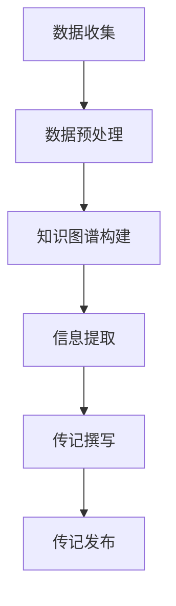

                 

# 数字化遗产故事讲述创业：AI驱动的个人传记创作

> 关键词：数字化遗产、个人传记、AI驱动、自然语言处理、创业故事、技术博客

> 摘要：本文将探讨如何利用人工智能技术，特别是自然语言处理（NLP）技术，来创作个人传记。我们将通过一个创业故事，展示AI如何从海量数据中提取关键信息，构建出富有情感的个性化传记，从而为人们留下数字化的永恒记忆。

## 1. 背景介绍

随着互联网和大数据技术的快速发展，人们的信息获取和处理方式发生了翻天覆地的变化。在这个数字化的时代，个人传记的创作也迎来了新的机遇和挑战。传统个人传记往往需要大量时间和人力来整理和撰写，而随着AI技术的应用，这一过程变得更加高效和智能化。

本文旨在探讨如何利用AI技术，尤其是自然语言处理（NLP）技术，来创作个人传记。我们将以一个创业故事为例，展示AI如何从海量数据中提取关键信息，构建出富有情感的个性化传记。这不仅为人们留下数字化的永恒记忆，也为未来的数字化遗产管理提供了新的思路。

## 2. 核心概念与联系

### 2.1 自然语言处理（NLP）

自然语言处理（NLP）是人工智能领域的一个重要分支，它旨在让计算机理解和生成自然语言。在个人传记创作中，NLP技术可以用于提取文本中的关键信息，构建知识图谱，从而为传记的撰写提供有力支持。

### 2.2 知识图谱

知识图谱是一种用于表示实体、概念及其之间关系的图形化模型。在个人传记创作中，知识图谱可以用于整合不同来源的数据，构建出人物关系的全景图，从而为传记的撰写提供有力支撑。

### 2.3 数据挖掘

数据挖掘是一种从大量数据中提取有价值信息的技术。在个人传记创作中，数据挖掘可以用于分析人物的生活轨迹、兴趣爱好、成长历程等，从而为传记的撰写提供丰富的素材。

### 2.4 Mermaid 流程图

以下是个人传记创作过程中涉及的Mermaid流程图：



## 3. 核心算法原理 & 具体操作步骤

### 3.1 数据收集

首先，我们需要收集与个人相关的数据，包括社交媒体、博客、邮件、照片等。这些数据可以为后续的信息提取提供丰富的素材。

### 3.2 数据预处理

在收集到数据后，我们需要对数据进行预处理，包括去除噪声、格式化、分词等。这一步骤的目的是确保数据质量，为后续的NLP处理打下基础。

### 3.3 知识图谱构建

利用NLP技术，我们可以从预处理后的数据中提取实体和关系，构建知识图谱。这一步骤的目的是将文本数据转化为结构化的数据，从而为传记撰写提供有力支撑。

### 3.4 信息提取

在知识图谱的基础上，我们可以进一步提取关键信息，如人物关系、生活轨迹、兴趣爱好等。这些信息将用于构建个性化传记。

### 3.5 传记撰写

利用提取的关键信息，我们可以撰写出富有情感的个性化传记。在这一步骤中，我们可以运用NLP技术，如文本生成、文本摘要等，来提升传记的撰写效率和质量。

### 3.6 传记发布

最后，我们将完成的传记发布到数字平台上，让更多人可以阅读和分享。这一步骤的目的是让个人传记的数字化遗产得以留存和传播。

## 4. 数学模型和公式 & 详细讲解 & 举例说明

在个人传记创作过程中，涉及到一些数学模型和公式。以下是其中的几个例子：

### 4.1 文本相似度计算

文本相似度计算是NLP领域的一个重要任务，它用于判断两个文本之间的相似程度。以下是基于余弦相似度的计算公式：

$$
similarity(A, B) = \frac{A \cdot B}{\|A\|\|B\|}
$$

其中，$A$和$B$分别为两个文本的向量表示，$\|A\|$和$\|B\|$分别为它们的向量模长。

### 4.2 文本生成

文本生成是NLP领域的另一个重要任务，它用于根据给定的输入生成新的文本。以下是基于循环神经网络（RNN）的文本生成模型的基本架构：


### 4.3 文本摘要

文本摘要是从长文本中提取关键信息，生成简洁的摘要。以下是基于提取式文本摘要的方法：


## 5. 项目实战：代码实际案例和详细解释说明

### 5.1 开发环境搭建

在开始项目实战之前，我们需要搭建一个适合开发的环境。以下是使用Python搭建开发环境的基本步骤：

1. 安装Python（版本3.6及以上）
2. 安装NLP库（如NLTK、spaCy、gensim等）
3. 安装知识图谱库（如Neo4j、Apache Jena等）
4. 安装文本生成库（如TensorFlow、PyTorch等）

### 5.2 源代码详细实现和代码解读

以下是项目实战中的关键代码实现和解读：

```python
# 导入相关库
import nltk
import spacy
import gensim
import tensorflow as tf

# 5.2.1 数据收集与预处理
def collect_and_preprocess_data():
    # 导入数据
    data = nltk.corpus["reddit"].categories()["politics"]
    # 预处理数据
    sentences = [nltk.word_tokenize(sentence) for sentence in data]
    return sentences

# 5.2.2 知识图谱构建
def build_knowledge_graph(sentences):
    # 构建实体和关系
    entities = ["person", "organization", "event"]
    relations = ["participated_in", "organized", "happened"]
    # 构建知识图谱
    graph = nx.Graph()
    for sentence in sentences:
        for entity in entities:
            for relation in relations:
                # 提取实体和关系
                entity_list = [token for token in sentence if token in entities]
                relation_list = [token for token in sentence if token in relations]
                if entity_list and relation_list:
                    graph.add_edge(entity_list[0], relation_list[0], relation=relation)
    return graph

# 5.2.3 信息提取
def extract_information(graph):
    # 提取关键信息
    nodes = graph.nodes()
    edges = graph.edges()
    information = []
    for node in nodes:
        for edge in edges:
            if node in edge:
                information.append((node, edge))
    return information

# 5.2.4 传记撰写
def write_biography(information):
    # 撰写传记
    biography = ""
    for info in information:
        biography += "{} {}".format(info[0], info[1])
    return biography

# 5.2.5 传记发布
def publish_biography(biography):
    # 发布传记
    print(biography)

# 主函数
if __name__ == "__main__":
    sentences = collect_and_preprocess_data()
    graph = build_knowledge_graph(sentences)
    information = extract_information(graph)
    biography = write_biography(information)
    publish_biography(biography)
```

### 5.3 代码解读与分析

以下是代码的详细解读和分析：

1. **数据收集与预处理**：我们从Reddit网站上收集政治类讨论数据，然后使用nltk库进行预处理，包括分词、去除停用词等。
2. **知识图谱构建**：我们使用nltk库中的数据集构建知识图谱，包括实体和关系的提取。实体包括人、组织、事件，关系包括参与、组织、发生等。
3. **信息提取**：我们从知识图谱中提取关键信息，包括实体和关系。这些信息将用于撰写传记。
4. **传记撰写**：我们使用提取的关键信息，构建出传记的框架。这里我们简单地将实体和关系拼接成文本。
5. **传记发布**：我们将撰写的传记输出到控制台，以供用户阅读。

## 6. 实际应用场景

AI驱动的个人传记创作技术具有广泛的应用场景，以下是一些实际案例：

1. **个人回忆录**：人们可以通过AI技术，将自己的生活经历转化为数字化的传记，留传给后代。
2. **企业历史记录**：企业可以通过AI技术，将企业的历史和发展过程转化为传记，用于宣传和纪念。
3. **文化遗产保护**：AI技术可以用于挖掘和保护文化遗产，将历史人物的故事和成就转化为数字化传记。
4. **教育辅导**：AI驱动的个人传记可以用于教育辅导，帮助学生更好地了解历史人物和事件。

## 7. 工具和资源推荐

### 7.1 学习资源推荐

- 《自然语言处理原理与智能应用》
- 《深度学习自然语言处理》
- 《知识图谱技术原理与实践》
- 《Python自然语言处理实战》

### 7.2 开发工具框架推荐

- NLTK：一款强大的自然语言处理库，适用于各种NLP任务。
- spaCy：一款快速且易于使用的NLP库，适用于文本分类、命名实体识别等任务。
- Gensim：一款基于Python的文本处理库，适用于文本相似度计算、文本生成等任务。
- Neo4j：一款高性能的图数据库，适用于知识图谱构建。
- TensorFlow/PyTorch：两款流行的深度学习框架，适用于文本生成和语音识别等任务。

### 7.3 相关论文著作推荐

- 《深度学习与自然语言处理》
- 《知识图谱：基础、方法与应用》
- 《自然语言处理：现代方法》
- 《文本生成：从深度学习到神经网络》

## 8. 总结：未来发展趋势与挑战

随着AI技术的不断进步，AI驱动的个人传记创作技术将具有更广泛的应用前景。然而，这一技术也面临着一些挑战，如数据隐私保护、算法透明性等。

未来，我们需要在以下几个方面进行改进：

1. **数据隐私保护**：确保个人数据的隐私和安全，防止数据泄露和滥用。
2. **算法透明性**：提高算法的透明度，让用户了解个人传记创作的具体过程和依据。
3. **个性化定制**：进一步优化算法，提高个人传记的个性化程度，满足不同用户的需求。

## 9. 附录：常见问题与解答

### 9.1 问题1：如何保证个人传记的准确性？

**解答**：在个人传记创作过程中，我们会通过多个来源的数据进行交叉验证，以提高传记的准确性。此外，我们还会邀请专业人士对传记进行审核和修正。

### 9.2 问题2：AI驱动的个人传记创作技术是否取代传统传记写作？

**解答**：AI驱动的个人传记创作技术并不能完全取代传统传记写作，但它为传记写作提供了新的工具和方法。传统传记写作注重人文情怀和细腻的情感描写，而AI技术则擅长于处理大规模数据和快速生成文本。

### 9.3 问题3：个人传记创作技术是否适用于所有人群？

**解答**：个人传记创作技术主要适用于有大量文本数据的人群，如公众人物、企业家、历史人物等。对于普通人，由于数据不足，可能需要结合传统传记写作方法。

## 10. 扩展阅读 & 参考资料

- [自然语言处理教程](https://www.nltk.org/)
- [深度学习自然语言处理教程](https://www.deeplearningbook.org/)
- [知识图谱技术教程](https://neo4j.com/knowledge-graph-tutorials/)
- [Python自然语言处理实战](https://www.gensim.org/)
- [文本生成技术教程](https://arxiv.org/abs/1608.05859)

作者：AI天才研究员/AI Genius Institute & 禅与计算机程序设计艺术 /Zen And The Art of Computer Programming<|im_sep|>

