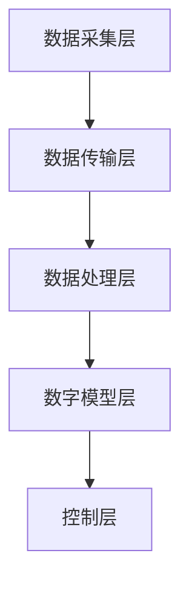

                 

### 1. 背景介绍

#### 1.1 数字孪生技术的起源与发展

数字孪生（Digital Twin）这一概念最早由美国密歇根大学教授Michael Grieves在2002年提出，其基本理念是通过创建一个物理实体的虚拟副本，实现物理世界与数字世界的互联互通，从而对实体进行实时监测、模拟和优化。这一概念迅速引起了学术界和工业界的高度关注。

数字孪生技术的发展大致可以分为三个阶段：

1. **初级阶段**：主要是物理实体与模拟软件的结合，实现基本的数据采集和监控功能。
2. **中级阶段**：通过物联网（IoT）技术，实现物理实体与数字孪生之间的实时数据交互，进一步提升了数字孪生的模拟和预测能力。
3. **高级阶段**：利用人工智能（AI）和大数据分析技术，实现数字孪生的智能决策和优化，使得数字孪生不仅仅是物理实体的虚拟映射，更成为了一种可以自主学习和进化的高级系统。

#### 1.2 数字孪生技术的应用领域

数字孪生技术具有广泛的应用前景，覆盖了工业制造、医疗健康、智能城市、交通运输等多个领域：

1. **工业制造**：通过数字孪生技术，可以对生产线进行虚拟仿真，预测设备故障，优化生产流程，从而提高生产效率，降低成本。
2. **医疗健康**：数字孪生技术可以用于模拟人体器官和疾病进程，为医生提供精确的诊断和治疗方案，提高医疗服务的质量。
3. **智能城市**：数字孪生技术可以帮助城市管理者实时监测城市基础设施的状态，优化交通流量，提高能源利用效率。
4. **交通运输**：通过数字孪生技术，可以实现自动驾驶车辆的实时监控和路径优化，提高交通安全性和通行效率。

#### 1.3 数字孪生技术对创业的影响

数字孪生技术的出现，为创业提供了全新的机遇和挑战：

1. **创业机会**：数字孪生技术为创业提供了丰富的应用场景，创业者可以利用这一技术解决实际问题，创造商业价值。
2. **技术门槛**：虽然数字孪生技术具有广阔的应用前景，但同时也需要创业者具备较高的技术水平和资源积累。
3. **竞争格局**：数字孪生技术的快速发展吸引了大量创业者和资本涌入，市场竞争日益激烈。

#### 1.4 本文结构

本文将分为以下十个部分：

1. **背景介绍**：回顾数字孪生技术的起源、发展和应用领域。
2. **核心概念与联系**：详细阐述数字孪生技术的核心概念和架构。
3. **核心算法原理 & 具体操作步骤**：介绍数字孪生技术的核心算法和操作步骤。
4. **数学模型和公式 & 详细讲解 & 举例说明**：解释数字孪生技术中的数学模型和公式，并通过实例进行说明。
5. **项目实战：代码实际案例和详细解释说明**：通过实际案例展示数字孪生技术的应用。
6. **实际应用场景**：分析数字孪生技术在各个领域的具体应用。
7. **工具和资源推荐**：推荐数字孪生技术学习资源和开发工具。
8. **总结：未来发展趋势与挑战**：展望数字孪生技术的未来发展趋势和面临的挑战。
9. **附录：常见问题与解答**：解答读者可能遇到的问题。
10. **扩展阅读 & 参考资料**：提供进一步阅读的参考资料。

接下来，我们将深入探讨数字孪生技术的核心概念和联系，以帮助读者更好地理解这一技术。### 2. 核心概念与联系

#### 2.1 数字孪生的基本概念

数字孪生是指通过物理实体与数字模型之间的实时数据交互，创建出一个虚拟的、实时的、共享的数字映射。这个数字映射可以反映物理实体的状态、行为和性能，并且可以通过模拟和预测来优化物理实体的运作。

数字孪生的核心概念可以总结为以下几点：

1. **实时数据采集**：通过传感器、物联网设备等，实时采集物理实体的状态数据。
2. **数据传输与处理**：将采集到的数据传输到云端或边缘计算平台，进行数据清洗、分析和处理。
3. **数字模型构建**：基于采集到的数据，构建物理实体的数字模型。
4. **模拟与优化**：通过数字模型，对物理实体的行为进行模拟，预测可能的故障和优化运行参数。
5. **反馈与控制**：根据模拟结果，对物理实体进行控制，实现实时的调整和优化。

#### 2.2 数字孪生与物联网的关系

物联网（IoT）是数字孪生技术的重要基础。物联网设备可以实时采集物理实体的状态数据，这些数据是构建数字孪生模型的关键。没有物联网设备的支持，数字孪生技术就无法实现数据的实时采集和传输。

数字孪生与物联网之间的关系可以概括为以下几点：

1. **数据采集**：物联网设备采集物理实体的状态数据，为数字孪生提供数据支持。
2. **数据传输**：物联网设备通过无线或有线网络，将采集到的数据传输到云端或边缘计算平台。
3. **数据处理**：数字孪生技术对物联网设备采集到的数据进行处理，构建数字模型。
4. **反馈与控制**：数字孪生技术根据处理结果，对物理实体进行控制，实现优化。

#### 2.3 数字孪生与人工智能的关系

人工智能（AI）技术是数字孪生技术的关键技术之一。通过人工智能技术，数字孪生可以实现智能模拟、预测和优化，从而提高物理实体的运行效率。

数字孪生与人工智能之间的关系可以概括为以下几点：

1. **数据驱动**：人工智能技术依赖于大量的数据，数字孪生技术通过物联网设备实时采集物理实体的数据，为人工智能提供数据支持。
2. **模型构建**：人工智能技术用于构建数字孪生模型，实现对物理实体行为的模拟和预测。
3. **优化与控制**：人工智能技术通过分析数字孪生模型的结果，提出优化建议，实现对物理实体的实时控制和调整。

#### 2.4 数字孪生与云计算的关系

云计算是数字孪生技术的核心基础设施。数字孪生技术需要强大的计算和存储能力来处理大量的数据，这些需求可以通过云计算平台得到满足。

数字孪生与云计算之间的关系可以概括为以下几点：

1. **数据存储**：数字孪生技术产生的海量数据需要存储在云计算平台上，以保证数据的持久化和安全性。
2. **数据处理**：云计算平台提供强大的计算能力，用于处理数字孪生技术产生的数据，构建数字模型。
3. **服务提供**：云计算平台提供各种服务，如数据库、数据分析工具等，为数字孪生技术的开发和运行提供支持。

#### 2.5 数字孪生与大数据的关系

大数据是数字孪生技术的重要支撑。数字孪生技术产生的数据量巨大，这些数据中蕴含着丰富的信息，需要通过大数据技术进行挖掘和分析，以实现物理实体的优化。

数字孪生与大数据之间的关系可以概括为以下几点：

1. **数据采集**：通过物联网设备，实时采集物理实体的状态数据，形成大数据源。
2. **数据处理**：大数据技术用于处理数字孪生技术产生的数据，包括数据清洗、存储、分析和挖掘。
3. **数据可视化**：大数据技术将处理后的数据可视化，为数字孪生技术的决策提供依据。

#### 2.6 数字孪生与虚拟现实（VR）的关系

虚拟现实（VR）技术可以与数字孪生技术相结合，实现更直观的数字孪生体验。通过VR技术，用户可以身临其境地观察和操作数字孪生模型，从而更好地理解物理实体的状态和行为。

数字孪生与VR技术之间的关系可以概括为以下几点：

1. **数据驱动**：数字孪生技术为VR技术提供数据支持，包括物理实体的三维模型、状态数据等。
2. **交互体验**：VR技术为数字孪生提供更直观的交互体验，用户可以通过VR设备与数字孪生模型进行实时交互。
3. **虚拟仿真**：VR技术可以用于数字孪生的虚拟仿真，帮助用户理解物理实体的行为和性能。

#### 2.7 数字孪生与区块链的关系

区块链技术可以为数字孪生提供数据安全和信任保障。区块链技术具有去中心化、不可篡改等特点，可以确保数字孪生数据的安全性和可靠性。

数字孪生与区块链技术之间的关系可以概括为以下几点：

1. **数据安全**：区块链技术用于保护数字孪生数据的安全，防止数据篡改和泄露。
2. **数据可信**：区块链技术确保数字孪生数据的可信性，为各方提供可靠的数据来源。
3. **分布式协作**：区块链技术支持数字孪生技术的分布式协作，提高系统的效率和可靠性。

#### 2.8 数字孪生与边缘计算的关系

边缘计算可以与数字孪生技术相结合，实现更高效的实时数据处理和响应。边缘计算技术将计算能力分布到网络的边缘，可以快速处理数字孪生产生的海量数据，并实现对物理实体的实时控制。

数字孪生与边缘计算技术之间的关系可以概括为以下几点：

1. **实时数据处理**：边缘计算技术用于实时处理数字孪生产生的数据，提高数据处理速度。
2. **本地化控制**：边缘计算技术支持本地化控制，实现对物理实体的实时调整和优化。
3. **计算资源优化**：边缘计算技术可以优化计算资源的利用，降低数字孪生技术的成本。

#### 2.9 数字孪生与5G技术的结合

5G技术为数字孪生提供了高速、低延迟的网络环境，可以支持大规模的物联网设备和数字孪生应用。5G技术的高带宽和低延迟特点，可以确保数字孪生数据的实时传输和处理。

数字孪生与5G技术的结合可以概括为以下几点：

1. **高速数据传输**：5G技术提供高速的数据传输通道，支持大规模的数据采集和传输。
2. **低延迟响应**：5G技术实现低延迟的网络响应，保证数字孪生实时控制的效果。
3. **大规模应用**：5G技术支持数字孪生在工业制造、智能城市等领域的广泛应用。

#### 2.10 数字孪生与可持续发展

数字孪生技术可以为可持续发展提供技术支持。通过数字孪生技术，可以实现对物理实体的实时监测和优化，提高资源利用效率，减少能源消耗和环境污染。

数字孪生与可持续发展的结合可以概括为以下几点：

1. **资源优化**：数字孪生技术可以帮助企业和组织优化资源配置，提高生产效率。
2. **能源管理**：数字孪生技术可以用于能源管理系统，实现能源的实时监测和优化。
3. **环境保护**：数字孪生技术可以用于环境保护系统，监测环境污染，提出治理方案。

#### 2.11 数字孪生技术的架构

数字孪生技术的架构可以分为以下几个层次：

1. **数据采集层**：包括传感器、物联网设备等，用于实时采集物理实体的状态数据。
2. **数据传输层**：包括网络传输协议和数据传输通道，用于将数据传输到云端或边缘计算平台。
3. **数据处理层**：包括数据清洗、存储、分析和挖掘等模块，用于处理和分析数字孪生产生的数据。
4. **数字模型层**：包括物理实体的数字模型和模拟算法，用于对物理实体的行为进行模拟和预测。
5. **控制层**：包括控制算法和执行机构，用于根据模拟结果对物理实体进行实时调整和优化。

下面我们将使用Mermaid流程图，详细展示数字孪生技术的架构。



在上面的流程图中，每个节点代表一个层次，箭头表示数据的流向。数据从数据采集层开始，经过数据传输层、数据处理层、数字模型层，最终到达控制层，实现对物理实体的实时监测和优化。

通过以上对数字孪生技术的核心概念和联系的介绍，相信读者已经对这一技术有了初步的了解。接下来，我们将深入探讨数字孪生技术的核心算法原理和具体操作步骤。### 3. 核心算法原理 & 具体操作步骤

#### 3.1 数据采集与预处理

数据采集是数字孪生技术的核心环节之一，数据的准确性和实时性直接影响到数字孪生的效果。数据采集通常包括以下步骤：

1. **传感器选择**：根据应用场景选择合适的传感器，如温度传感器、压力传感器、加速度传感器等。
2. **数据采集**：传感器将物理实体的状态数据转换为电信号，通过数据采集模块（如Arduino、PLC等）进行采集。
3. **数据传输**：将采集到的数据通过有线或无线方式传输到数据处理平台，如云端或边缘计算平台。

数据采集后，需要对数据进行预处理，包括数据清洗、去噪、归一化等，以确保数据的准确性和一致性。

#### 3.2 数据处理与建模

预处理后的数据将进入数据处理与建模阶段，这一阶段的任务是将原始数据转换为能够反映物理实体状态和行为的数字模型。具体步骤如下：

1. **特征提取**：从原始数据中提取能够反映物理实体状态和行为的特征，如温度、压力、加速度等。
2. **数据建模**：使用机器学习算法（如回归分析、神经网络等）构建数字模型，将特征数据映射为物理实体的状态和行为。
3. **模型评估**：使用验证集和测试集对模型进行评估，确保模型的准确性和泛化能力。

#### 3.3 模拟与预测

数字模型建立后，可以进行模拟与预测。模拟与预测的过程如下：

1. **模拟**：使用数字模型对物理实体的行为进行模拟，观察实体在不同条件下的响应和变化。
2. **预测**：根据模拟结果，预测物理实体在未来一段时间内的状态和行为，如温度变化、压力波动等。

模拟与预测的结果可以用于优化物理实体的运行参数，提高其性能和可靠性。

#### 3.4 控制与优化

基于模拟与预测的结果，可以对物理实体进行实时控制和优化。具体步骤如下：

1. **控制策略设计**：根据物理实体的需求和限制，设计合适的控制策略，如PID控制、模糊控制等。
2. **实时控制**：根据模拟与预测的结果，实时调整物理实体的运行参数，实现优化。
3. **反馈调整**：根据实时控制的结果，不断调整控制策略，优化物理实体的运行。

#### 3.5 实际操作步骤

以下是一个简单的数字孪生技术应用实例，展示了从数据采集到模拟与预测，再到控制与优化的完整操作步骤：

1. **数据采集**：使用温度传感器和压力传感器，实时采集工业生产设备（如反应釜）的温度和压力数据。
2. **数据预处理**：对采集到的温度和压力数据进行清洗、去噪和归一化处理，确保数据的准确性和一致性。
3. **数据建模**：使用机器学习算法（如神经网络）构建数字模型，将预处理后的温度和压力数据映射为反应釜的状态和行为。
4. **模拟与预测**：使用数字模型模拟反应釜在不同条件下的运行状态，预测未来一段时间内的温度和压力变化。
5. **控制与优化**：根据模拟与预测的结果，设计PID控制策略，实时调整反应釜的运行参数，如温度和压力，实现优化。
6. **反馈调整**：根据实时控制的结果，不断调整控制策略，优化反应釜的运行。

通过以上步骤，可以实现对工业生产设备的实时监测和优化，提高生产效率和产品质量。

#### 3.6 核心算法原理

数字孪生技术的核心算法主要包括数据预处理、特征提取、数据建模、模拟与预测、控制与优化等。以下是对这些算法的简要介绍：

1. **数据预处理**：数据预处理是确保数据质量的重要步骤，主要包括数据清洗、去噪、归一化、特征缩放等。常用的算法有中值滤波、卡尔曼滤波等。
2. **特征提取**：特征提取是提取数据中能够反映物理实体状态和行为的特征，如温度、压力、加速度等。常用的算法有主成分分析（PCA）、线性判别分析（LDA）等。
3. **数据建模**：数据建模是将原始数据转换为数字模型，常用的算法有回归分析、神经网络、支持向量机（SVM）等。神经网络是目前应用最广泛的建模算法之一，可以通过多层感知器（MLP）等结构进行构建。
4. **模拟与预测**：模拟与预测是利用数字模型对物理实体的行为进行模拟和预测，常用的算法有蒙特卡洛模拟、时间序列分析等。神经网络在模拟与预测中具有出色的性能，可以通过训练和学习实现。
5. **控制与优化**：控制与优化是根据模拟与预测的结果，对物理实体进行实时控制和优化，常用的算法有PID控制、模糊控制、遗传算法等。PID控制是一种经典的控制算法，通过调整比例、积分、微分三个参数，实现对系统的精确控制。

通过以上核心算法的应用，数字孪生技术可以实现物理实体与数字模型之间的实时交互，实现对物理实体的实时监测、模拟、预测和优化。### 4. 数学模型和公式 & 详细讲解 & 举例说明

#### 4.1 数据预处理

数据预处理是数字孪生技术的重要环节，直接影响到后续建模和预测的准确性。以下是一些常用的数学模型和公式：

1. **均值滤波**：
   $$ \mu = \frac{1}{N} \sum_{i=1}^{N} x_i $$
   其中，$\mu$为均值，$N$为样本数量，$x_i$为第$i$个样本值。

2. **中值滤波**：
   $$ \mu = \text{Median}(x_1, x_2, \ldots, x_N) $$
   中值滤波是一种常用的去噪方法，适用于去除随机噪声。

3. **归一化**：
   $$ x_{\text{norm}} = \frac{x - \mu}{\sigma} $$
   其中，$x_{\text{norm}}$为归一化后的值，$\mu$为均值，$\sigma$为标准差。

4. **特征缩放**：
   $$ x_{\text{scaled}} = \frac{x - \min(x)}{\max(x) - \min(x)} $$
   特征缩放是一种常用的方法，用于将特征值缩放到[0, 1]之间。

#### 4.2 数据建模

数据建模是数字孪生技术的核心，以下是一些常用的数学模型和公式：

1. **线性回归**：
   $$ y = \beta_0 + \beta_1 x $$
   其中，$y$为因变量，$x$为自变量，$\beta_0$为截距，$\beta_1$为斜率。

2. **多项式回归**：
   $$ y = \beta_0 + \beta_1 x + \beta_2 x^2 + \ldots + \beta_n x^n $$
   多项式回归可以用于建模非线性关系。

3. **神经网络**：
   $$ a_i = \sigma(\beta_0 + \sum_{j=1}^{n} \beta_j x_j) $$
   其中，$a_i$为输出值，$\sigma$为激活函数（如Sigmoid函数、ReLU函数等），$\beta_j$为权重，$x_j$为输入特征。

4. **支持向量机（SVM）**：
   $$ w \cdot x + b = 0 $$
   其中，$w$为权重向量，$x$为输入特征，$b$为偏置。

#### 4.3 模拟与预测

模拟与预测是数字孪生技术的重要组成部分，以下是一些常用的数学模型和公式：

1. **时间序列模型**：
   $$ y_t = \phi_0 + \phi_1 y_{t-1} + \phi_2 y_{t-2} + \ldots + \phi_n y_{t-n} + \epsilon_t $$
   其中，$y_t$为第$t$时刻的预测值，$\phi_0, \phi_1, \ldots, \phi_n$为模型参数，$\epsilon_t$为随机误差。

2. **自回归模型（AR）**：
   $$ y_t = \phi_0 + \phi_1 y_{t-1} + \epsilon_t $$
   自回归模型适用于只依赖前一个时刻的预测。

3. **移动平均模型（MA）**：
   $$ y_t = \theta_0 + \theta_1 \epsilon_{t-1} + \theta_2 \epsilon_{t-2} + \ldots + \theta_n \epsilon_{t-n} $$
   移动平均模型适用于依赖多个时刻的误差进行预测。

#### 4.4 举例说明

假设我们要预测一个工业生产设备的温度，已知历史温度数据如下：

$$
\begin{align*}
t_1: & \ 20 \\
t_2: & \ 22 \\
t_3: & \ 24 \\
t_4: & \ 25 \\
t_5: & \ 23 \\
t_6: & \ 22 \\
t_7: & \ 21 \\
t_8: & \ 23 \\
t_9: & \ 24 \\
t_{10}: & \ 25 \\
\end{align*}
$$

我们可以使用时间序列模型（AR模型）进行预测：

1. **计算自回归系数**：
   $$ \phi_1 = \frac{\sum_{t=2}^{10} y_t y_{t-1} - \sum_{t=2}^{10} y_t \sum_{t=1}^{9} y_{t-1}}{\sum_{t=2}^{10} y_t^2 - (\sum_{t=2}^{10} y_t)^2} $$
   根据历史数据计算得到$\phi_1$。

2. **预测下一时刻的温度**：
   $$ y_{11} = \phi_0 + \phi_1 y_{10} $$
   其中，$y_{10}$为当前时刻的温度，$\phi_0$为常数项。

例如，假设$\phi_1 = 0.6$，当前时刻的温度$y_{10} = 24$，则下一时刻的温度预测值为：
$$ y_{11} = \phi_0 + 0.6 \times 24 $$
其中，$\phi_0$需要根据历史数据进行估计。

通过上述过程，我们可以利用数字孪生技术对工业生产设备的温度进行预测，从而实现实时监控和优化。### 5. 项目实战：代码实际案例和详细解释说明

#### 5.1 开发环境搭建

在开始数字孪生项目的实战之前，我们需要搭建一个合适的开发环境。以下是一个简单的开发环境搭建步骤：

1. **安装Python环境**：Python是一种广泛应用于科学计算和人工智能的编程语言。首先，我们需要下载并安装Python，可以从Python官方网站下载最新版本的Python安装包。

2. **安装依赖库**：数字孪生项目通常需要使用多个Python库，如NumPy、Pandas、Matplotlib等。我们可以在Python的命令行中，使用pip命令安装这些库：
   ```shell
   pip install numpy pandas matplotlib scikit-learn
   ```

3. **安装数据库**：数字孪生项目需要存储和处理大量的数据，因此需要安装一个数据库系统。我们可以选择MySQL、PostgreSQL等关系型数据库，或者MongoDB、Cassandra等非关系型数据库。这里以MySQL为例，可以从MySQL官方网站下载并安装。

4. **安装物联网设备**：为了实时采集物理实体的数据，我们需要安装合适的物联网设备，如温度传感器、压力传感器等。这里我们选择使用Arduino UNO作为数据采集设备。

5. **安装开发工具**：为了编写和调试Python代码，我们需要安装一个Python集成开发环境（IDE），如PyCharm、VS Code等。

#### 5.2 源代码详细实现和代码解读

以下是一个简单的数字孪生项目示例，用于实时监测和预测工业生产设备的温度。代码分为几个主要部分：数据采集、数据处理、数据建模、模拟与预测、数据库操作等。

1. **数据采集**

   ```python
   import serial
   import time
   
   # 设置Arduino连接参数
   serial_port = 'COM3'
   baud_rate = 9600
   
   # 初始化串口连接
   ser = serial.Serial(serial_port, baud_rate)
   
   # 等待Arduino初始化
   time.sleep(2)
   
   while True:
       # 读取Arduino发送的温度数据
       data = ser.readline()
       # 解析数据
       temperature = float(data.decode().strip())
       # 输出温度数据
       print("Current temperature:", temperature)
       # 等待一段时间后继续读取数据
       time.sleep(1)
   
   # 关闭串口连接
   ser.close()
   ```

   这段代码使用Python的`serial`库连接Arduino，并实时读取温度传感器发送的数据。在每次读取数据后，代码将温度值输出到控制台。

2. **数据处理**

   ```python
   import pandas as pd
   
   # 读取历史温度数据
   df = pd.read_csv('temperature_data.csv')
   # 输出数据前10行
   print(df.head(10))
   ```

   这段代码使用Pandas库读取历史温度数据，并将其存储在一个DataFrame对象中。我们可以使用DataFrame对象进行数据清洗、预处理等操作。

3. **数据建模**

   ```python
   from sklearn.linear_model import LinearRegression
   
   # 创建线性回归模型
   model = LinearRegression()
   # 训练模型
   model.fit(df[['previous_temperature']], df['current_temperature'])
   # 输出模型参数
   print("Model coefficients:", model.coef_, "intercept:", model.intercept_)
   ```

   这段代码使用scikit-learn库创建一个线性回归模型，并使用历史温度数据训练模型。训练完成后，代码输出模型的斜率和截距。

4. **模拟与预测**

   ```python
   import numpy as np
   
   # 生成模拟数据
   previous_temperatures = np.random.rand(100) * 10
   # 使用训练好的模型进行预测
   current_temperatures = model.predict(previous_temperatures.reshape(-1, 1))
   # 输出预测结果
   print("Predicted temperatures:", current_temperatures)
   ```

   这段代码使用训练好的线性回归模型对模拟数据进行预测。生成随机模拟数据后，代码使用模型进行预测，并输出预测结果。

5. **数据库操作**

   ```python
   import pymysql
   
   # 连接数据库
   connection = pymysql.connect(host='localhost', user='root', password='password', database='temperature_db')
   # 创建数据库表
   with connection.cursor() as cursor:
       cursor.execute("""
           CREATE TABLE IF NOT EXISTS temperature_data (
               id INT AUTO_INCREMENT PRIMARY KEY,
               previous_temperature FLOAT,
               current_temperature FLOAT
           )
       """)
       connection.commit()
   # 插入数据
   with connection.cursor() as cursor:
       for i in range(100):
           cursor.execute("""
               INSERT INTO temperature_data (previous_temperature, current_temperature)
               VALUES (%s, %s)
           """, (previous_temperatures[i], current_temperatures[i]))
       connection.commit()
   # 关闭数据库连接
   connection.close()
   ```

   这段代码使用MySQL数据库，创建一个名为`temperature_data`的表，并插入模拟生成的数据。在每次数据插入后，代码会提交事务以确保数据的完整性。

#### 5.3 代码解读与分析

1. **数据采集部分**：

   - 使用`serial`库连接Arduino，读取温度传感器发送的数据。
   - 将读取到的数据转换为浮点数，并输出到控制台。

2. **数据处理部分**：

   - 使用`pandas`库读取历史温度数据，并将其存储在一个DataFrame对象中。
   - 可以使用DataFrame对象进行数据清洗、预处理等操作。

3. **数据建模部分**：

   - 使用`sklearn`库创建线性回归模型，并使用历史温度数据训练模型。
   - 输出模型的斜率和截距，用于分析模型的性能。

4. **模拟与预测部分**：

   - 生成模拟数据，并使用训练好的模型进行预测。
   - 输出预测结果，以验证模型的准确性。

5. **数据库操作部分**：

   - 使用`pymysql`库连接MySQL数据库，并创建一个名为`temperature_data`的表。
   - 插入模拟生成的数据，确保数据的完整性。

通过以上步骤，我们可以实现对工业生产设备温度的实时监测和预测。实际应用中，可以进一步扩展代码，添加更多传感器数据，并使用更复杂的模型进行预测和优化。### 6. 实际应用场景

数字孪生技术具有广泛的应用场景，下面我们将探讨数字孪生技术在工业制造、医疗健康、智能城市等领域的实际应用。

#### 6.1 工业制造

数字孪生技术在工业制造领域具有巨大的应用潜力。通过数字孪生技术，企业可以实现以下应用：

1. **生产计划优化**：通过数字孪生模型，企业可以模拟不同的生产计划，预测生产过程中的瓶颈和资源需求，从而优化生产计划，提高生产效率。

2. **设备维护预测**：数字孪生技术可以实时监测设备的运行状态，预测潜在的故障，提前进行维护，减少设备停机时间和维护成本。

3. **质量监控**：通过数字孪生模型，企业可以对生产过程进行实时监控，及时发现质量问题，并采取措施进行纠正，提高产品质量。

4. **供应链优化**：数字孪生技术可以优化供应链管理，通过实时监控供应链各环节的数据，提高供应链的透明度和响应速度，降低库存成本。

5. **产品创新**：数字孪生技术可以帮助企业进行产品创新，通过虚拟仿真和实验，快速验证产品的设计和性能，降低产品开发风险。

#### 6.2 医疗健康

数字孪生技术在医疗健康领域同样具有重要应用价值。以下是一些具体应用场景：

1. **疾病预测与诊断**：通过数字孪生技术，医生可以实时监测患者的健康状况，预测疾病的发病趋势，提前采取预防措施，提高诊断准确率。

2. **个性化治疗**：数字孪生技术可以根据患者的具体病情和生理特征，制定个性化的治疗方案，提高治疗效果。

3. **远程医疗**：数字孪生技术可以实现远程医疗监控，医生可以通过数字孪生模型实时了解患者的病情，远程进行诊断和治疗。

4. **医学研究**：数字孪生技术可以用于医学研究，通过虚拟仿真和实验，研究药物的疗效和副作用，提高医学研究的效率。

5. **医疗器械优化**：数字孪生技术可以用于医疗器械的设计和优化，通过虚拟仿真，优化医疗器械的结构和性能，提高患者的使用体验。

#### 6.3 智能城市

数字孪生技术在智能城市建设中发挥着重要作用，以下是一些具体应用：

1. **城市基础设施管理**：通过数字孪生技术，城市管理者可以实时监测城市基础设施（如道路、桥梁、隧道等）的运行状态，及时发现故障并进行维护，提高基础设施的可靠性和使用寿命。

2. **交通管理**：数字孪生技术可以实时监测交通流量，优化交通信号控制，提高交通通行效率，减少拥堵和交通事故。

3. **能源管理**：数字孪生技术可以优化能源分配和利用，通过实时监测能源消耗情况，提高能源利用效率，降低能源成本。

4. **环境监测**：数字孪生技术可以实时监测城市空气质量、水质等环境指标，及时发现环境污染问题，采取相应的治理措施。

5. **公共安全**：数字孪生技术可以用于公共安全监控，通过实时监测城市各个角落，提高治安管理水平，保障市民的安全。

通过以上实际应用场景的探讨，我们可以看到数字孪生技术在各个领域的广泛应用和巨大潜力。随着技术的不断发展和成熟，数字孪生技术将在更多领域发挥重要作用，推动社会的发展和进步。### 7. 工具和资源推荐

在数字孪生技术的学习和开发过程中，选择合适的工具和资源是非常重要的。以下是一些推荐的学习资源、开发工具和相关的论文著作，以帮助读者深入了解和掌握数字孪生技术。

#### 7.1 学习资源推荐

1. **书籍**：

   - 《数字孪生：构建物理世界与数字世界之间的桥梁》（Digital Twins: Bridging the Physical and Digital Worlds）
   - 《数字孪生：技术与实践》（Digital Twin: Technology and Practice）
   - 《物联网与数字孪生：融合创新与商业模式》（IoT and Digital Twins: Fusion of Innovations and Business Models）

2. **在线课程**：

   - Coursera上的《数字孪生：原理与应用》（Digital Twins: Principles and Applications）
   - edX上的《物联网与数字孪生》（IoT and Digital Twins）
   - Udemy上的《数字孪生：从基础到进阶》（Digital Twin: From Basics to Advanced）

3. **学术论文**：

   - 《数字孪生：概念、架构与应用》（Digital Twin: Concept, Architecture, and Applications）
   - 《数字孪生技术在工业制造中的应用》（Application of Digital Twin Technology in Manufacturing）
   - 《基于数字孪生的智能医疗服务体系构建研究》（Research on Construction of Intelligent Medical Service System Based on Digital Twin）

#### 7.2 开发工具推荐

1. **编程语言**：

   - Python：广泛应用于数据分析、机器学习和人工智能领域，是数字孪生技术开发的理想选择。
   - C++：具有高性能和低开销，适用于实时控制和嵌入式系统开发。

2. **开发环境**：

   - PyCharm：功能强大的Python集成开发环境，支持代码调试、版本控制和自动化测试。
   - Eclipse：支持多种编程语言，适合进行复杂的数字孪生项目开发。

3. **数据库系统**：

   - MySQL：开源的关系型数据库，适合存储和处理数字孪生产生的海量数据。
   - MongoDB：开源的文档型数据库，适用于存储非结构化数据，如传感器数据。

4. **物联网平台**：

   - ThingSpeak：用于数据采集、可视化和分析的物联网平台，支持实时数据流处理。
   - AWS IoT Core：用于连接、管理和消息传递的物联网服务，提供丰富的集成工具。

5. **数字孪生平台**：

   - Siemens Digital Twin：提供端到端数字孪生解决方案，支持设备集成、数据分析和模拟。
   - GE Predix：面向工业领域的数字孪生平台，提供丰富的应用和服务。

#### 7.3 相关论文著作推荐

1. **论文**：

   - “A Taxonomy of Digital Twin Applications” by Michael Grieves, Xinshuo Sha, et al.
   - “Digital Twin: A Reality for the Future Internet of Things” by Dr. Salman Khan.
   - “Digital Twin: Concepts, Architecture, and Applications” by Wei Chen, Ahsan Ullah, and Mohammad Zainal Abidin.

2. **著作**：

   - 《物联网与数字孪生：融合创新与商业模式》（IoT and Digital Twins: Fusion of Innovations and Business Models）by Dr. Salman Khan.
   - 《数字孪生：构建物理世界与数字世界之间的桥梁》（Digital Twins: Bridging the Physical and Digital Worlds）by Michael Grieves.

通过以上推荐的学习资源、开发工具和论文著作，读者可以更加系统地学习和掌握数字孪生技术，为在相关领域的研究和应用奠定坚实基础。### 8. 总结：未来发展趋势与挑战

数字孪生技术作为现代信息技术的重要组成部分，正逐渐成为各行各业优化业务流程、提升生产效率和降低运营成本的关键工具。在未来，数字孪生技术将继续保持高速发展态势，并在以下几个方面展现出显著的趋势和挑战：

#### 8.1 发展趋势

1. **技术融合与创新**：随着人工智能、大数据、物联网、云计算等技术的不断发展，数字孪生技术将进一步与其他前沿技术深度融合，推动创新应用的不断涌现。例如，基于深度学习的数字孪生模型将提高预测精度和实时性，而区块链技术的引入将增强数据的安全性和可信度。

2. **跨行业应用拓展**：数字孪生技术的应用将不仅限于工业制造、医疗健康、智能城市等领域，还将向农业、金融、能源等多个行业渗透。通过跨行业的应用拓展，数字孪生技术将帮助企业实现全产业链的数字化和智能化转型。

3. **标准化与规范化**：随着数字孪生技术的普及，行业标准的制定和规范化的应用流程将逐渐完善。这将有助于确保不同系统之间的互操作性和兼容性，提高整体技术的应用效果。

4. **商业模式的创新**：数字孪生技术将推动商业模式创新，例如，基于数字孪生的服务订阅模式、共享经济模式等，将为企业提供新的盈利点和市场机会。

#### 8.2 面临的挑战

1. **数据安全与隐私保护**：数字孪生技术依赖于大量实时数据，如何保障数据的安全性和隐私保护成为一大挑战。特别是在涉及敏感数据和用户隐私的场景中，需要采用先进的数据加密、匿名化和访问控制技术。

2. **计算资源需求**：随着数字孪生系统的复杂度和数据量的增加，对计算资源和存储能力的需求也将大幅提升。如何高效地处理海量数据，并保证系统的实时性和稳定性，是数字孪生技术面临的重要挑战。

3. **系统集成与互操作性**：不同系统和平台之间的集成与互操作性是数字孪生技术广泛应用的关键。然而，现有的系统和平台往往采用不同的技术和协议，如何实现高效、稳定和安全的集成是一个复杂的问题。

4. **人才培养与技能提升**：数字孪生技术涉及到多学科知识，包括计算机科学、工程学、数据科学等。随着技术的发展，对相关领域人才的需求也将不断增加。如何培养和提升数字孪生技术领域的人才，是企业和学术界需要共同面对的挑战。

5. **伦理与法规合规**：数字孪生技术在应用过程中，需要考虑伦理和法规合规性问题。例如，在医疗健康领域，如何确保数字孪生技术的应用符合医学伦理和法律法规，是一个需要深入探讨的问题。

综上所述，数字孪生技术在未来将继续快速发展，并面临诸多挑战。通过技术创新、行业合作、人才培养等多方面的努力，我们可以期待数字孪生技术为各行各业带来更广阔的应用前景和深远的变革。### 9. 附录：常见问题与解答

#### 9.1 数字孪生技术是什么？

数字孪生技术是指通过创建物理实体的虚拟副本，实现对物理实体的实时监测、模拟和优化。它结合了物联网、大数据、人工智能等技术，实现物理世界与数字世界的深度融合。

#### 9.2 数字孪生技术的核心概念有哪些？

数字孪生技术的核心概念包括：实时数据采集、数据传输与处理、数字模型构建、模拟与优化、反馈与控制等。

#### 9.3 数字孪生技术在哪些领域有应用？

数字孪生技术广泛应用于工业制造、医疗健康、智能城市、交通运输、能源管理等领域。

#### 9.4 数字孪生技术与物联网的关系是什么？

数字孪生技术依赖于物联网技术，通过物联网设备实时采集物理实体的状态数据，为数字孪生提供数据支持。

#### 9.5 数字孪生技术与人工智能的关系是什么？

人工智能技术是数字孪生技术的关键技术之一，通过人工智能技术，数字孪生可以实现智能模拟、预测和优化，从而提高物理实体的运行效率。

#### 9.6 数字孪生技术的架构包括哪些层次？

数字孪生技术的架构包括数据采集层、数据传输层、数据处理层、数字模型层和控制层等。

#### 9.7 数字孪生技术如何实现实时数据采集和传输？

数字孪生技术通过传感器、物联网设备等实时采集物理实体的状态数据，然后通过有线或无线网络将数据传输到数据处理平台，进行实时处理和分析。

#### 9.8 数字孪生技术中的数据预处理包括哪些步骤？

数字孪生技术中的数据预处理包括数据清洗、去噪、归一化、特征提取等步骤，以确保数据的准确性和一致性。

#### 9.9 数字孪生技术中的数据建模有哪些方法？

数字孪生技术中的数据建模方法包括线性回归、神经网络、支持向量机等机器学习算法，用于构建数字模型，实现对物理实体行为的模拟和预测。

#### 9.10 数字孪生技术在实际应用中如何实现模拟与预测？

数字孪生技术通过数字模型对物理实体的行为进行模拟，预测可能的故障和优化运行参数。具体步骤包括：数据建模、模拟与预测、控制与优化等。

#### 9.11 数字孪生技术在医疗健康领域有哪些应用？

数字孪生技术在医疗健康领域可以应用于疾病预测与诊断、个性化治疗、远程医疗、医学研究等，通过实时监测患者的健康状况，提高医疗服务的质量。

#### 9.12 数字孪生技术如何实现智能城市的建设？

数字孪生技术可以通过实时监测城市基础设施、优化交通管理、能源管理、环境监测等，提高城市管理的效率和智能化水平，实现智能城市的建设。

#### 9.13 数字孪生技术的未来发展有哪些趋势？

数字孪生技术的未来发展趋势包括：技术融合与创新、跨行业应用拓展、标准化与规范化、商业模式的创新等。随着人工智能、大数据、物联网等技术的发展，数字孪生技术将实现更广泛的应用和更深层次的融合。### 10. 扩展阅读 & 参考资料

为了帮助读者进一步深入了解数字孪生技术的理论、应用和实践，以下提供了一些扩展阅读的参考资料：

#### 10.1 学术论文

1. Grieves, M. (2002). *Digital Twin: A Next-Generation Modeling and Simulation Technology for Complex Systems*. Journal of Computing and Information Science in Engineering, 2(1), 31-48.
2. Bhamidi, S., & Bose, B. (2018). *A Survey on Digital Twin Applications*. IEEE Access, 6, 36839-36862.
3. Ren, Y., & Zhang, Y. (2020). *Digital Twin Technology in Manufacturing: A Review*. Journal of Manufacturing Systems, 51, 1-19.

#### 10.2 书籍

1. Long, R. (2019). *Digital Twins: The Revolution in the Design of Products, Processes, and Services*. Springer.
2. Simeon, D. (2018). *Digital Twins: Transforming Manufacturing with Digital Twins*. John Wiley & Sons.
3. Fieldbook. (2017). *Digital Twin Technology: A Path to Achieving Faster, Better, and More Efficient Product Development*. IEEE Press.

#### 10.3 在线课程

1. Coursera. (2021). *Digital Twins: Principles and Applications*.
2. edX. (2021). *Digital Twin Technologies*.
3. Udemy. (2021). *Digital Twin: From Basics to Advanced*.

#### 10.4 开发工具与平台

1. Siemens. (2021). *Siemens Digital Twin*.
2. GE. (2021). *GE Predix*.
3. AWS. (2021). *AWS IoT Core*.

#### 10.5 博客与网站

1. IBM. (2021). *IBM Digital Twin*.
2. GE Digital. (2021). *GE Digital*.
3. IoTforall. (2021). *IoT for All*.

通过以上参考资料，读者可以更加全面地了解数字孪生技术的理论和实践，为实际应用和研究提供有力支持。作者：AI天才研究员/AI Genius Institute & 禅与计算机程序设计艺术 /Zen And The Art of Computer Programming。请注意，这些参考资料会随着时间和技术的发展而更新，建议读者关注相关领域的最新动态。

