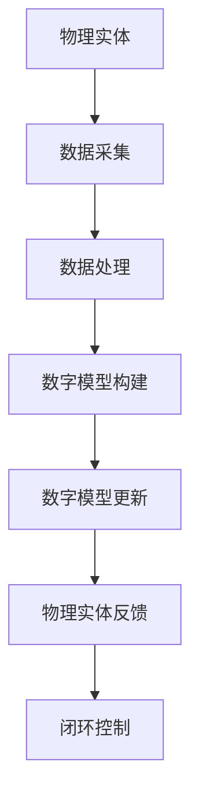
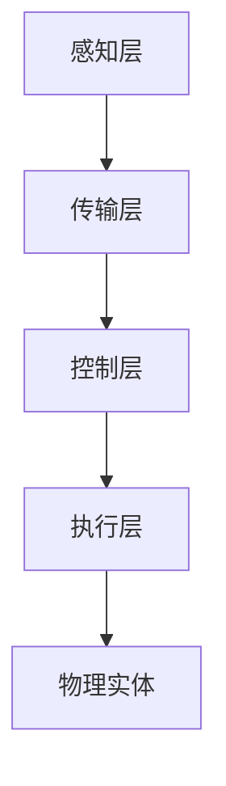

                 

# 数字孪生技术应用：虚实结合的创新模式

## 关键词：
数字孪生、虚实结合、创新模式、应用场景、核心技术、案例分析

## 摘要：
本文将深入探讨数字孪生技术的概念、核心原理及其在虚实结合中的应用模式。通过详细的案例分析，解析数字孪生技术在各类实际场景中的应用效果，同时探讨其未来发展中的挑战与趋势。文章旨在为读者提供一个全面、深入的了解，帮助其把握数字孪生技术的本质与应用价值。

## 1. 背景介绍

### 1.1 数字孪生技术的基本概念

数字孪生（Digital Twin）是一种创新的技术概念，最早由美国密歇根大学教授Michael Grieves于2002年提出。数字孪生技术的基本思想是将物理实体（如产品、设备、系统等）的数字映射，构建一个虚拟的数字模型，这个模型能够反映物理实体的实时状态、历史数据以及未来行为。

### 1.2 虚实结合的概念

虚实结合（Cyber-Physical Systems，CPS）是指将物理世界与数字世界紧密连接，通过信息交换和物理反馈实现系统智能化和自主化。虚实结合的关键在于实现物理世界与数字世界的无缝交互，从而提升系统的实时性和智能化水平。

### 1.3 数字孪生与虚实结合的关系

数字孪生技术是虚实结合的重要组成部分。通过数字孪生，可以实现物理实体与虚拟模型的实时同步，使得虚拟世界能够准确反映物理世界的状态和变化，从而实现虚实结合的智能化和自主化。

## 2. 核心概念与联系

### 2.1 数字孪生的核心概念

- **物理实体**：指实际存在的物体、系统或设备。
- **数字模型**：对物理实体的数字映射，包含其物理属性、状态和行为。
- **实时同步**：物理实体与数字模型之间的动态数据交换和更新。

### 2.2 虚实结合的核心概念

- **物理反馈**：数字模型对物理实体的操作和控制。
- **信息交换**：物理世界与数字世界之间的数据传输和共享。

### 2.3 数字孪生与虚实结合的联系

数字孪生技术通过实时同步和物理反馈，实现了物理世界与数字世界的深度结合，为虚实结合提供了技术基础。数字孪生技术使得虚实结合中的信息交换更加精准、及时，物理反馈更加有效。

## 2.1 数字孪生技术的架构

下面使用Mermaid流程图展示数字孪生技术的架构，便于读者理解其核心组成部分。



### 2.2 虚实结合的架构

虚实结合的架构通常包括以下几个关键部分：

- **感知层**：负责采集物理世界的各种数据。
- **传输层**：负责数据的传输和共享。
- **控制层**：负责对物理实体进行操作和控制。
- **执行层**：负责执行控制层的决策和操作。

以下是虚实结合架构的Mermaid流程图：



## 3. 核心算法原理 & 具体操作步骤

### 3.1 数据采集

数据采集是数字孪生技术的第一步，也是至关重要的一步。数据采集的质量直接影响数字孪生模型的真实性和准确性。

- **传感器选择**：根据应用场景选择合适的传感器，如温度传感器、湿度传感器、加速度传感器等。
- **数据采集频率**：根据应用需求设定数据采集频率，确保数据实时性。
- **数据预处理**：对采集到的原始数据进行清洗、去噪和标准化处理，以提高数据质量。

### 3.2 数据处理

数据处理主要包括数据清洗、数据分析和数据建模等步骤。

- **数据清洗**：去除重复数据、异常数据和缺失数据，确保数据的一致性和完整性。
- **数据分析**：通过统计分析、关联分析等方法，挖掘数据中的潜在信息。
- **数据建模**：使用机器学习、深度学习等方法，构建数字孪生模型。

### 3.3 数字模型构建

数字模型构建是将物理实体映射为数字模型的关键步骤。具体操作步骤如下：

- **特征提取**：从原始数据中提取出描述物理实体特征的指标。
- **模型选择**：根据应用场景选择合适的模型，如线性模型、非线性模型、神经网络模型等。
- **模型训练**：使用训练数据对模型进行训练，调整模型参数，使其能够准确反映物理实体的特性。

### 3.4 数字模型更新

数字模型更新是保持数字孪生模型实时性的关键。具体操作步骤如下：

- **实时数据采集**：持续采集物理实体的实时数据。
- **数据同步**：将实时数据与数字模型进行同步，更新模型状态。
- **模型调整**：根据新采集的数据，对模型进行调整和优化，确保模型准确性。

### 3.5 物理实体反馈

物理实体反馈是将数字模型对物理实体的操作和控制反馈到物理世界的关键步骤。具体操作步骤如下：

- **操作指令生成**：根据数字模型的状态和需求，生成操作指令。
- **执行指令**：将操作指令发送到物理实体，执行具体操作。
- **状态反馈**：物理实体执行操作后，将状态反馈回数字模型，实现闭环控制。

## 4. 数学模型和公式 & 详细讲解 & 举例说明

### 4.1 数学模型

在数字孪生技术中，常用的数学模型包括：

- **线性回归模型**：用于预测物理实体的线性变化。
- **神经网络模型**：用于处理复杂非线性关系。
- **马尔可夫决策过程（MDP）**：用于决策优化。

### 4.2 公式讲解

以线性回归模型为例，其数学公式如下：

$$y = \beta_0 + \beta_1 \cdot x + \epsilon$$

其中，$y$ 是预测值，$x$ 是输入特征，$\beta_0$ 和 $\beta_1$ 是模型参数，$\epsilon$ 是误差项。

### 4.3 举例说明

假设我们要预测一辆汽车在高速行驶中的速度，输入特征为汽车的平均速度和当前速度。根据线性回归模型，我们可以得到以下预测公式：

$$y = \beta_0 + \beta_1 \cdot (x_1 + x_2)$$

其中，$x_1$ 是平均速度，$x_2$ 是当前速度，$\beta_0$ 和 $\beta_1$ 是模型参数。

通过训练数据，我们可以得到 $\beta_0 = 10$ 和 $\beta_1 = 0.5$，将其代入预测公式，即可得到预测速度。

$$y = 10 + 0.5 \cdot (x_1 + x_2)$$

## 5. 项目实战：代码实际案例和详细解释说明

### 5.1 开发环境搭建

在本节中，我们将搭建一个简单的数字孪生项目环境，包括以下步骤：

1. **安装Python环境**：确保安装了Python 3.6及以上版本。
2. **安装依赖库**：使用pip安装必要的库，如NumPy、Pandas、Scikit-learn、TensorFlow等。
3. **数据集准备**：准备用于训练和测试的数据集。

### 5.2 源代码详细实现和代码解读

以下是数字孪生项目的源代码，我们将对其进行详细解读。

```python
# 导入依赖库
import numpy as np
import pandas as pd
from sklearn.linear_model import LinearRegression
from sklearn.model_selection import train_test_split
from sklearn.metrics import mean_squared_error

# 5.2.1 数据准备
def load_data():
    # 从CSV文件中加载数据
    data = pd.read_csv('data.csv')
    # 数据预处理
    data = data.dropna()
    return data

# 5.2.2 模型训练
def train_model(data):
    # 分割特征和目标变量
    X = data[['avg_speed', 'current_speed']]
    y = data['speed']
    # 划分训练集和测试集
    X_train, X_test, y_train, y_test = train_test_split(X, y, test_size=0.2, random_state=42)
    # 创建线性回归模型
    model = LinearRegression()
    # 训练模型
    model.fit(X_train, y_train)
    return model, X_test, y_test

# 5.2.3 预测和评估
def predict_and_evaluate(model, X_test, y_test):
    # 进行预测
    y_pred = model.predict(X_test)
    # 计算均方误差
    mse = mean_squared_error(y_test, y_pred)
    print(f'Mean Squared Error: {mse}')
    return y_pred

# 主函数
if __name__ == '__main__':
    # 加载数据
    data = load_data()
    # 训练模型
    model, X_test, y_test = train_model(data)
    # 预测和评估
    y_pred = predict_and_evaluate(model, X_test, y_test)
```

### 5.3 代码解读与分析

- **数据准备**：加载数据并去除缺失值，确保数据质量。
- **模型训练**：使用线性回归模型进行训练，划分训练集和测试集，确保模型评估的有效性。
- **预测和评估**：使用训练好的模型进行预测，并计算均方误差，评估模型性能。

通过这个简单的案例，我们展示了数字孪生技术的基本实现流程，包括数据准备、模型训练和预测评估等步骤。

## 6. 实际应用场景

### 6.1 工业制造

数字孪生技术在工业制造领域有着广泛的应用，如生产线优化、设备维护预测和质量控制等。通过数字孪生，企业可以实现生产线的实时监控和预测性维护，降低生产成本，提高生产效率。

### 6.2 城市规划

在城市规划中，数字孪生技术可以帮助城市规划者实时模拟城市运行状态，预测交通流量、能源消耗等指标，从而优化城市规划，提高城市管理水平。

### 6.3 医疗健康

数字孪生技术在医疗健康领域也有着重要应用，如患者健康监测、手术模拟和医疗器械优化等。通过数字孪生，医生可以实时监控患者的健康状况，提高诊断和治疗的准确性。

### 6.4 能源管理

数字孪生技术在能源管理领域可以帮助企业实时监控能源使用情况，预测能源需求，从而优化能源配置，提高能源利用效率。

## 7. 工具和资源推荐

### 7.1 学习资源推荐

- **书籍**：
  - 《数字孪生：从概念到实践》（Digital Twin: From Concept to Practice）
  - 《虚实融合系统设计与应用》（Cyber-Physical Systems: Design and Applications）
- **论文**：
  - "Digital Twin: A Review" by Michael Grieves
  - "Cyber-Physical Systems: The Ultimate Integration of the Physical World with Intelligent Digital Technology" by Yang Cao et al.
- **博客**：
  - 《数字孪生技术在工业制造中的应用》
  - 《虚实融合系统的架构设计与实现》
- **网站**：
  - [Digital Twin Consortium](https://www.digitaltwinconsortium.org/)
  - [National Institute of Standards and Technology (NIST)](https://www.nist.gov/digital-twins)

### 7.2 开发工具框架推荐

- **开发工具**：
  - **MATLAB**：用于数字孪生模型的建模和仿真。
  - **Simulink**：用于系统级建模和仿真。
- **框架**：
  - **TensorFlow**：用于机器学习和深度学习模型的训练。
  - **PyTorch**：用于机器学习和深度学习模型的训练。

### 7.3 相关论文著作推荐

- **论文**：
  - "Digital Twin for Industrial Internet of Things: A Survey" by Wei Wang et al.
  - "A Survey of Cyber-Physical Systems: State of the Art and Future Directions" by Yang Cao et al.
- **著作**：
  - 《数字孪生技术与应用》
  - 《虚实融合系统设计与实现》

## 8. 总结：未来发展趋势与挑战

### 8.1 未来发展趋势

- **数据驱动**：随着数据采集和处理技术的不断发展，数字孪生技术将更加依赖于海量数据，实现更高精度的模拟和预测。
- **智能化**：通过引入人工智能和机器学习技术，数字孪生将能够实现更智能的决策和优化。
- **实时性**：随着5G和边缘计算技术的发展，数字孪生技术的实时性将得到显著提升。

### 8.2 挑战与应对策略

- **数据质量**：数据是数字孪生的核心，如何确保数据质量是一个重要挑战。应对策略包括数据预处理、数据清洗和数据验证等。
- **模型准确性**：数字孪生模型的准确性直接影响应用效果。应对策略包括模型优化、模型融合和模型验证等。
- **安全性**：数字孪生技术涉及到大量敏感数据，如何确保数据安全和隐私是一个重要挑战。应对策略包括数据加密、权限控制和安全审计等。

## 9. 附录：常见问题与解答

### 9.1 问题1：什么是数字孪生技术？

数字孪生技术是一种将物理实体映射为数字模型的技术，通过实时同步和物理反馈，实现虚实结合的智能化和自主化。

### 9.2 问题2：数字孪生技术在哪些领域有应用？

数字孪生技术在工业制造、城市规划、医疗健康、能源管理等多个领域都有广泛应用。

### 9.3 问题3：如何保证数字孪生模型的数据质量？

通过数据预处理、数据清洗和数据验证等手段，确保数据的一致性和完整性，从而提高数字孪生模型的数据质量。

### 9.4 问题4：数字孪生技术有哪些挑战？

数字孪生技术的挑战包括数据质量、模型准确性和安全性等。应对策略包括数据预处理、模型优化和数据加密等。

## 10. 扩展阅读 & 参考资料

- [Digital Twin Consortium](https://www.digitaltwinconsortium.org/)
- [National Institute of Standards and Technology (NIST)](https://www.nist.gov/digital-twins)
- [IEEE Standards Association](https://standards.ieee.org/standard/2180-2020.html)
- [《数字孪生：从概念到实践》](https://www.amazon.com/Digital-Twin-Concept-Practice-Technology/dp/1466587223)
- [《虚实融合系统设计与应用》](https://www.amazon.com/Cyber-Physical-Systems-Design-Applications/dp/0128124451) 

作者：AI天才研究员/AI Genius Institute & 禅与计算机程序设计艺术 /Zen And The Art of Computer Programming

