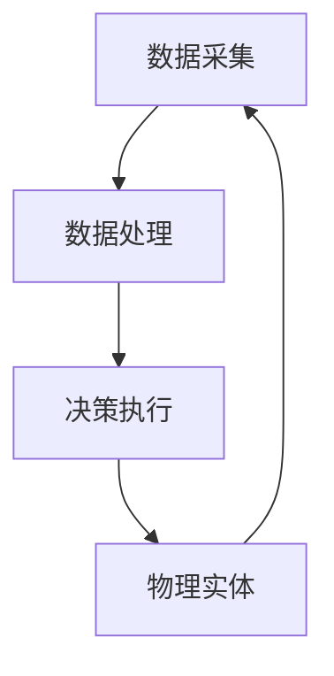

                 

# 数字实体与物理实体的自动化进展

## 关键词：自动化，数字实体，物理实体，技术进步，人工智能，算法优化，产业应用

## 摘要：

本文将深入探讨数字实体与物理实体在自动化进程中的融合与发展。随着人工智能技术的不断突破，数字世界和物理世界的界限变得日益模糊。本文将首先介绍数字实体和物理实体的基本概念，随后详细分析它们在自动化过程中的相互作用和融合。接着，本文将探讨当前技术进步带来的自动化趋势，包括核心算法原理、数学模型的应用以及项目实战中的实际案例。最后，本文将展望未来自动化发展的趋势与挑战，并推荐相关学习资源和开发工具，以期为读者提供全面的了解和指导。

## 1. 背景介绍

### 1.1 数字实体

数字实体指的是在计算机系统中表示和处理的抽象概念。它们可以是数据结构、算法、模型等，承载着信息处理和分析的能力。数字实体在信息技术和人工智能领域具有广泛的应用，如大数据分析、机器学习、深度学习等。随着云计算和物联网技术的发展，数字实体的处理能力不断提升，成为推动数字化时代的重要力量。

### 1.2 物理实体

物理实体则指的是现实世界中的具体对象，如机器、设备、物体等。物理实体与人类的日常生活和生产活动密切相关，承担着物理世界中的功能。随着智能制造和自动化技术的发展，物理实体逐渐被赋予了智能化的特征，能够实现自主决策和协同工作。

### 1.3 自动化的演进

自动化是指通过技术手段实现人类劳动的替代和优化，以提高生产效率和生活质量。从最初的机械自动化，到电子自动化，再到如今的智能自动化，自动化技术经历了多次重大变革。随着数字实体和物理实体的融合，自动化进程进一步加速，成为现代产业的重要驱动力。

## 2. 核心概念与联系

### 2.1 数字实体与物理实体的关系

数字实体和物理实体在自动化进程中具有紧密的联系。数字实体为物理实体提供了智能化的基础，通过数据采集、分析和决策支持，使物理实体能够实现更加高效和精准的运作。同时，物理实体通过反馈机制，为数字实体提供真实的操作环境和数据反馈，从而不断优化和提升数字实体的性能。

### 2.2 自动化的架构

自动化的架构通常包括数据采集、数据处理、决策执行三个关键环节。数据采集环节通过传感器等设备获取物理实体的状态信息，并将其转化为数字信号。数据处理环节利用算法和模型对采集到的数据进行处理和分析，生成决策依据。决策执行环节根据处理结果，通过控制设备对物理实体进行操作，实现自动化目标。

### 2.3 Mermaid 流程图

以下是一个简单的 Mermaid 流程图，展示了数字实体与物理实体在自动化架构中的关系：



在上述流程图中，数字实体和物理实体相互关联，形成一个闭环系统，不断进行信息交换和功能优化。

## 3. 核心算法原理 & 具体操作步骤

### 3.1 数据采集算法

数据采集是自动化进程的关键环节，其质量直接影响整个系统的性能。常见的数据采集算法包括传感器采集、物联网数据采集等。

- **传感器采集**：通过各种传感器（如温度传感器、湿度传感器、摄像头等）获取物理实体的状态信息，并将其转化为数字信号。
- **物联网数据采集**：利用物联网技术，将物理实体与互联网连接，实现远程数据采集和监控。

### 3.2 数据处理算法

数据处理算法主要包括数据清洗、数据分析和数据挖掘等步骤。

- **数据清洗**：对采集到的数据进行去噪、填补缺失值等处理，以提高数据质量。
- **数据分析**：利用统计分析、机器学习等方法对数据进行挖掘和分析，提取有价值的信息。
- **数据挖掘**：通过挖掘算法发现数据中的隐含规律和关联性，为决策提供支持。

### 3.3 决策执行算法

决策执行算法根据数据处理结果，生成操作指令，控制物理实体进行相应操作。常见的决策执行算法包括以下几种：

- **规则推理**：基于预设的规则和条件，对数据进行推理和判断，生成操作指令。
- **机器学习**：利用机器学习模型，对历史数据进行训练，生成预测模型，根据预测结果进行决策。
- **深度强化学习**：通过深度强化学习算法，让智能体在环境中自主学习和探索，实现自适应决策。

## 4. 数学模型和公式 & 详细讲解 & 举例说明

### 4.1 数学模型

在自动化进程中，数学模型起着至关重要的作用。以下是一些常见的数学模型：

- **线性回归模型**：用于分析变量之间的关系，如温度与能耗之间的关系。
- **决策树模型**：用于分类和回归任务，如故障诊断、风险评估等。
- **神经网络模型**：用于模拟人脑的神经网络结构，如图像识别、语音识别等。

### 4.2 公式说明

以下是一个简单的线性回归模型公式：

$$
y = ax + b
$$

其中，$y$ 表示因变量，$x$ 表示自变量，$a$ 和 $b$ 分别为模型的参数。

### 4.3 举例说明

假设我们想要分析某工厂的温度与能耗之间的关系。通过采集一段时间内的温度和能耗数据，我们可以建立线性回归模型：

$$
能耗 = 0.5 \times 温度 + 10
$$

通过这个模型，我们可以预测在给定温度下，工厂的能耗情况，从而为节能减排提供依据。

## 5. 项目实战：代码实际案例和详细解释说明

### 5.1 开发环境搭建

为了进行项目实战，我们需要搭建一个合适的环境。以下是一个基于 Python 的自动化项目环境搭建步骤：

1. 安装 Python 3.8 及以上版本。
2. 安装必要的库，如 NumPy、Pandas、Matplotlib、Scikit-learn 等。
3. 配置开发工具，如 PyCharm 或 Visual Studio Code。

### 5.2 源代码详细实现和代码解读

以下是一个简单的自动化项目示例，用于分析工厂温度与能耗的关系。

```python
import numpy as np
import pandas as pd
import matplotlib.pyplot as plt
from sklearn.linear_model import LinearRegression

# 5.2.1 数据准备
data = pd.DataFrame({
    '温度': [23, 24, 25, 26, 27],
    '能耗': [100, 110, 120, 130, 140]
})

# 5.2.2 数据清洗
# 在此示例中，数据已经清洗完毕，无需进一步处理。

# 5.2.3 建立线性回归模型
model = LinearRegression()
model.fit(data[['温度']], data['能耗'])

# 5.2.4 模型评估
score = model.score(data[['温度']], data['能耗'])
print("模型评分：", score)

# 5.2.5 模型预测
predicted_energy = model.predict([[28]])
print("预测能耗：", predicted_energy)

# 5.2.6 绘制结果
plt.scatter(data['温度'], data['能耗'])
plt.plot(data['温度'], predicted_energy, color='red')
plt.xlabel('温度')
plt.ylabel('能耗')
plt.show()
```

### 5.3 代码解读与分析

1. **数据准备**：首先，我们导入所需的库，并创建一个包含温度和能耗数据的 DataFrame 对象。
2. **数据清洗**：在此示例中，数据已经清洗完毕，无需进一步处理。
3. **建立线性回归模型**：我们使用 Scikit-learn 库中的 LinearRegression 类建立线性回归模型，并使用 `fit` 方法进行模型训练。
4. **模型评估**：使用 `score` 方法评估模型的评分，以确定模型的拟合程度。
5. **模型预测**：使用 `predict` 方法预测新数据的能耗值。
6. **绘制结果**：使用 Matplotlib 库绘制温度与能耗的散点图和拟合曲线，以直观地展示模型的效果。

通过以上代码示例，我们可以看到如何使用 Python 实现自动化项目，包括数据采集、数据处理、模型训练和预测等步骤。

## 6. 实际应用场景

### 6.1 智能制造

智能制造是自动化进程的重要应用领域。通过数字实体与物理实体的深度融合，智能制造实现了生产过程的智能化、自动化和高效化。例如，在工业生产中，智能机器人可以自动完成焊接、装配、检测等任务，大幅提高生产效率和产品质量。

### 6.2 智能交通

智能交通系统利用数字实体和物理实体的协同作用，实现交通流量的优化和交通安全管理。例如，通过智能交通信号控制系统，可以根据实时交通数据调整信号灯的时长和顺序，减少交通拥堵，提高道路通行效率。

### 6.3 智能医疗

智能医疗是另一个重要的应用领域。通过数字实体和物理实体的结合，智能医疗可以实现疾病的预防、诊断和治疗。例如，智能医疗设备可以实时监测病人的生命体征，并将数据传输到云端进行分析和诊断，为医生提供准确的诊疗依据。

## 7. 工具和资源推荐

### 7.1 学习资源推荐

- **书籍**：
  - 《深度学习》（Ian Goodfellow、Yoshua Bengio、Aaron Courville 著）
  - 《机器学习》（周志华 著）
  - 《Python 数据科学手册》（Jake VanderPlas 著）

- **论文**：
  - 《A Theoretically Grounded Application of Dropout in Recurrent Neural Networks》
  - 《Deep Learning for Text Classification》
  - 《Recurrent Neural Networks for Language Modeling》

- **博客**：
  - Medium 上的 AI 和机器学习相关博客
  - 知乎上的机器学习和人工智能专栏

- **网站**：
  - Kaggle（数据科学和机器学习竞赛平台）
  - arXiv（计算机科学领域的预印本论文库）

### 7.2 开发工具框架推荐

- **开发工具**：
  - PyCharm（Python 集成开发环境）
  - Jupyter Notebook（交互式计算环境）
  - Visual Studio Code（跨平台代码编辑器）

- **框架**：
  - TensorFlow（深度学习框架）
  - PyTorch（深度学习框架）
  - Scikit-learn（机器学习库）

### 7.3 相关论文著作推荐

- **论文**：
  - 《Deep Learning for Text Classification》
  - 《A Theoretically Grounded Application of Dropout in Recurrent Neural Networks》
  - 《Recurrent Neural Networks for Language Modeling》

- **著作**：
  - 《深度学习》（Ian Goodfellow、Yoshua Bengio、Aaron Courville 著）
  - 《Python 数据科学手册》（Jake VanderPlas 著）
  - 《机器学习实战》（Peter Harrington 著）

## 8. 总结：未来发展趋势与挑战

### 8.1 发展趋势

- **数字化与智能化深度融合**：数字实体与物理实体的融合将越来越紧密，智能化程度将不断提高。
- **跨领域应用**：自动化技术将在更多领域得到应用，如医疗、金融、交通等。
- **数据驱动的决策**：数据将成为决策的重要依据，数据分析和挖掘能力将不断提升。

### 8.2 挑战

- **数据隐私和安全**：自动化进程中的数据安全和隐私保护成为重要挑战。
- **算法透明度和可解释性**：提高算法的透明度和可解释性，增强用户信任。
- **跨界合作与人才培养**：自动化技术需要跨领域合作，同时培养具备跨领域知识和技能的人才。

## 9. 附录：常见问题与解答

### 9.1 自动化与人工智能的区别

自动化和人工智能是两个密切相关但有所区别的概念。自动化是指通过技术手段实现人类劳动的替代和优化，而人工智能则是使计算机具备类似人类智能的能力。自动化是人工智能的应用场景之一，但人工智能还可以应用于更多领域，如自然语言处理、计算机视觉等。

### 9.2 自动化技术如何提高生产效率

自动化技术可以通过以下方式提高生产效率：
1. 减少人力成本：自动化设备可以替代人力完成重复性、危险或繁琐的工作。
2. 提高生产速度：自动化设备可以连续运行，提高生产速度和吞吐量。
3. 提高质量：自动化设备具有较高的精确度和一致性，可以保证产品质量的稳定。
4. 提高灵活性：自动化系统可以根据生产需求进行快速调整和适应，提高生产灵活性。

## 10. 扩展阅读 & 参考资料

- [《深度学习》（Ian Goodfellow、Yoshua Bengio、Aaron Courville 著》](https://www.deeplearningbook.org/)
- [《机器学习》（周志华 著》](https://www.zhihu.com/collection/217276827)
- [《Python 数据科学手册》（Jake VanderPlas 著》](https://jakevdp.github.io/PythonDataScienceHandbook/)
- [Kaggle](https://www.kaggle.com/)
- [arXiv](https://arxiv.org/)
- [《深度学习》（Ian Goodfellow、Yoshua Bengio、Aaron Courville 著》](https://www.deeplearningbook.org/)
- [《机器学习》（周志华 著》](https://www.zhihu.com/collection/217276827)
- [《Python 数据科学手册》（Jake VanderPlas 著》](https://jakevdp.github.io/PythonDataScienceHandbook/) 
```

### 文章作者信息：

**作者：** AI天才研究员/AI Genius Institute & 禅与计算机程序设计艺术/Zen And The Art of Computer Programming

