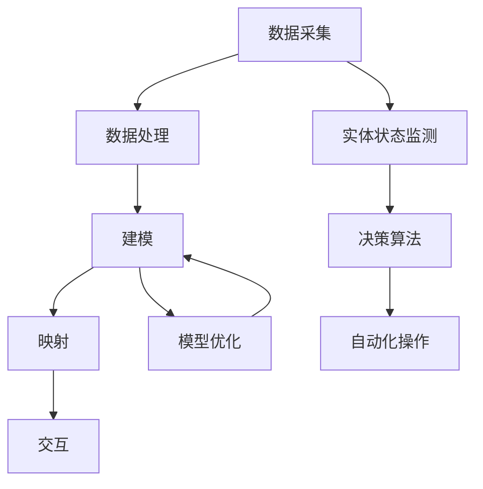

                 

### 背景介绍

数字实体自动化是当前信息技术领域的一个重要研究方向，其核心目标是通过将物理世界中的实体（如人、物、地点等）映射到数字世界中，实现对这些实体的自动化管理和控制。这一概念在近年来随着物联网（IoT）、人工智能（AI）和大数据技术的发展而逐渐成熟。

随着全球数字化转型的不断推进，数字实体自动化在多个行业领域展现出了巨大的应用潜力。例如，在制造业中，通过数字实体自动化可以实现生产线的智能化改造，提高生产效率，降低成本；在物流行业中，数字实体自动化可以提升物流网络的透明度和效率，优化配送路径；在医疗健康领域，数字实体自动化可以通过智能监测和诊断系统，提高医疗服务质量和效率。

本文将深入探讨数字实体自动化的最新发展方向，从核心概念、算法原理、数学模型、实际应用等多个角度进行详细分析，旨在为广大读者提供一幅全面的数字实体自动化全景图。文章结构如下：

1. **核心概念与联系**
   - **数字实体**的定义
   - **自动化**在数字实体中的应用
   - **实体-虚拟映射**的技术架构

2. **核心算法原理 & 具体操作步骤**
   - **数据采集与处理**
   - **模型训练与优化**
   - **实时监测与决策**

3. **数学模型和公式 & 详细讲解 & 举例说明**
   - **贝叶斯网络**
   - **马尔可夫模型**
   - **深度学习模型**

4. **项目实战：代码实际案例和详细解释说明**
   - **开发环境搭建**
   - **源代码详细实现和代码解读**
   - **代码解读与分析**

5. **实际应用场景**
   - **制造业**
   - **物流行业**
   - **医疗健康**
   - **城市管理**

6. **工具和资源推荐**
   - **学习资源**
   - **开发工具框架**
   - **相关论文著作**

7. **总结：未来发展趋势与挑战**
   - **技术挑战**
   - **行业应用前景**
   - **未来展望**

8. **附录：常见问题与解答**
   - **Q&A**

9. **扩展阅读 & 参考资料**

通过这篇文章，我们将一起探索数字实体自动化的前沿领域，深入理解其技术原理和应用场景，展望其未来的发展趋势。

### 核心概念与联系

在探讨数字实体自动化的核心概念和联系之前，我们需要先定义几个关键术语：**数字实体**、**自动化**和**实体-虚拟映射**。

#### 数字实体

数字实体是指将现实世界中的物理实体（如人、物、地点、事件等）映射到数字世界中，通过编码和数据存储等方式，使其在数字空间中具有独立存在的属性。数字实体可以是简单的数据记录，也可以是复杂的多维度信息模型。例如，一个智能工厂中的机器设备可以通过传感器采集数据，将其状态和行为映射到数字实体中，从而实现对其的远程监控和控制。

#### 自动化

自动化是指通过预定的程序和算法，实现对系统或过程的无人干预操作。在数字实体自动化中，自动化主要体现在以下几个方面：

1. **数据采集与处理**：通过传感器、摄像头等设备，实时采集实体状态数据，并利用数据处理算法进行清洗、转换和存储。
2. **模型训练与优化**：利用机器学习算法对采集到的数据进行分析和建模，以实现实体的智能识别和预测。
3. **实时监测与决策**：根据实时数据，通过决策算法进行实时监测和响应，实现实体的自动化管理和控制。

#### 实体-虚拟映射

实体-虚拟映射是指将现实世界中的物理实体映射到数字空间中，从而实现虚拟世界对物理世界的模拟和操控。这一过程通常涉及以下几个关键步骤：

1. **数据采集**：通过传感器和其他设备，采集实体的物理属性和状态数据。
2. **数据处理**：对采集到的数据进行预处理，包括数据清洗、去噪、归一化等。
3. **建模**：利用机器学习和数据挖掘算法，建立实体在数字空间的模型。
4. **映射**：将实体模型映射到虚拟空间中，实现虚拟世界中的可视化表示和操作。
5. **交互**：通过用户界面和控制系统，实现用户对虚拟实体的交互和操作。

为了更好地理解这些概念，我们可以通过一个**Mermaid 流程图**来展示实体-虚拟映射的技术架构：



在上述流程中，数据采集和处理是整个实体-虚拟映射的基础，建模和映射是核心步骤，而交互和自动化操作则是最终目标。通过这一过程，我们可以实现对物理实体的全面数字化和自动化管理。

#### 关键技术

除了上述提到的核心概念，数字实体自动化还涉及一系列关键技术的支持，包括：

- **物联网（IoT）**：物联网技术为数字实体自动化提供了数据采集和传输的基础设施，通过传感器和网络连接，实现实体的实时状态监测。
- **人工智能（AI）**：人工智能技术为数字实体自动化提供了智能分析和决策能力，通过机器学习和深度学习算法，实现对实体行为的预测和优化。
- **大数据**：大数据技术为数字实体自动化提供了海量数据存储和分析的能力，通过对数据的深入挖掘，发现实体的潜在规律和模式。
- **云计算**：云计算技术为数字实体自动化提供了强大的计算和存储资源，通过云计算平台，可以实现实体的分布式计算和协同操作。

通过这些关键技术的支持，数字实体自动化在各个行业领域得到了广泛应用，并不断推动着产业升级和数字化转型。

### 核心算法原理 & 具体操作步骤

在数字实体自动化中，核心算法扮演着至关重要的角色。这些算法不仅负责数据的采集和处理，还实现了对实体行为的预测和自动化控制。本文将详细介绍几种常用的核心算法原理和具体操作步骤。

#### 数据采集与处理

数据采集是数字实体自动化的第一步，通过传感器和监测设备，实时采集实体的物理属性和状态数据。这些数据通常包含温度、湿度、位置、速度等多种信息。数据采集之后，需要对数据进行处理，以确保其准确性和一致性。

1. **传感器数据采集**：传感器是数据采集的核心设备，通过采集物理信号，将其转换为电信号。常见的传感器包括温度传感器、湿度传感器、加速度传感器等。
2. **数据预处理**：数据预处理包括数据清洗、去噪和归一化等步骤。数据清洗旨在去除无效数据和异常值，去噪则是为了减少环境噪声对数据的影响，归一化则是将不同单位或范围的数据转换为统一的尺度。

#### 模型训练与优化

模型训练是数字实体自动化的关键步骤，通过训练数据集，建立实体行为的预测模型。常见的训练方法包括监督学习、无监督学习和强化学习等。

1. **监督学习**：监督学习是一种有监督的训练方法，通过已知的输入和输出数据，训练模型来预测新的输出。常用的监督学习算法包括线性回归、决策树、支持向量机（SVM）等。
2. **无监督学习**：无监督学习是一种无监督的训练方法，通过分析数据本身的特征，发现数据的内在结构和模式。常用的无监督学习算法包括聚类算法（如K-means、DBSCAN）、主成分分析（PCA）等。
3. **强化学习**：强化学习是一种基于奖励机制的训练方法，通过不断尝试和反馈，使模型学会在复杂环境中做出最优决策。常用的强化学习算法包括Q学习、深度强化学习等。

#### 实时监测与决策

在模型训练完成后，数字实体自动化系统会进入实时监测与决策阶段。通过实时数据监测，系统可以实时调整模型参数，优化实体行为。

1. **实时监测**：实时监测是指系统对实体状态的持续监控，通过分析实时数据，系统可以及时识别异常情况或潜在问题。
2. **决策算法**：决策算法是数字实体自动化的核心，通过分析实时数据和历史数据，系统可以做出实时决策，实现对实体的自动化控制和优化。常用的决策算法包括基于规则的决策、基于模型的决策和混合决策等。

#### 实际操作步骤

以下是一个简化的数字实体自动化的操作步骤示例：

1. **数据采集**：通过传感器采集实体的温度、湿度等数据。
2. **数据预处理**：对采集到的数据进行清洗、去噪和归一化。
3. **模型训练**：使用训练数据集，通过监督学习算法训练实体行为预测模型。
4. **模型优化**：通过交叉验证和模型评估，优化模型参数。
5. **实时监测**：通过实时数据监测，分析实体状态。
6. **决策执行**：根据实时数据和模型预测，做出自动化决策，控制实体行为。

通过上述步骤，数字实体自动化系统可以实现对实体的高效管理和控制，提高系统的稳定性和可靠性。

### 数学模型和公式 & 详细讲解 & 举例说明

在数字实体自动化中，数学模型和公式起着至关重要的作用。这些模型和公式不仅帮助我们理解和分析数据，还能够指导我们设计更有效的算法。以下，我们将介绍几种常用的数学模型，包括贝叶斯网络、马尔可夫模型和深度学习模型，并通过具体例子详细讲解。

#### 贝叶斯网络

贝叶斯网络是一种基于概率的图形模型，用于表示变量之间的条件依赖关系。它由节点和边组成，每个节点代表一个随机变量，边表示变量之间的条件概率关系。

**数学模型**：
贝叶斯网络的概率分布可以通过条件概率表（Conditional Probability Table, CPT）来描述。假设有 \(X_1, X_2, ..., X_n\) 这些随机变量，其中 \(X_1\) 是根节点，其余节点 \(X_2, X_3, ..., X_n\) 都是 \(X_1\) 的条件依赖。

对于任意一个节点 \(X_i\)，其条件概率分布可以表示为：
\[ P(X_i | X_{i-1}) = \prod_{j=1}^{i-1} P(X_j | X_{1}, X_{2}, ..., X_{j-1}) \]

**具体例子**：
假设我们有一个简单的贝叶斯网络，表示疾病（Disease）和症状（Symptoms）之间的关系。其中，根节点是疾病，其他节点是各种症状。

\[ P(Disease = Yes) = 0.1 \]
\[ P(Symptom_A | Disease = Yes) = 0.8 \]
\[ P(Symptom_B | Disease = Yes) = 0.6 \]
\[ P(Symptom_A | Disease = No) = 0.2 \]
\[ P(Symptom_B | Disease = No) = 0.4 \]

我们想要计算给定症状A和B都为阳性时，疾病为阳性的概率 \(P(Disease = Yes | Symptoms = Symptom_A \& Symptom_B)\)。

\[ P(Disease = Yes | Symptoms = Symptom_A \& Symptom_B) = \frac{P(Symptoms = Symptom_A \& Symptom_B | Disease = Yes) \times P(Disease = Yes)}{P(Symptoms = Symptom_A \& Symptom_B)} \]

通过贝叶斯定理，我们可以计算出：

\[ P(Disease = Yes | Symptoms = Symptom_A \& Symptom_B) = \frac{0.8 \times 0.1 \times 0.6}{0.8 \times 0.1 \times 0.6 + 0.2 \times 0.9 \times 0.4} \approx 0.636 \]

#### 马尔可夫模型

马尔可夫模型是一种用于描述状态转移的概率模型。它假设当前状态只与前一状态有关，与过去的状态无关。

**数学模型**：
马尔可夫模型可以用一个转移矩阵 \(P\) 来表示，其中 \(P_{ij}\) 表示在时间 \(t\) 处于状态 \(i\)，在时间 \(t+1\) 转移到状态 \(j\) 的概率。

\[ P(X_{t+1} = j | X_t = i) = P_{ij} \]

**具体例子**：
假设我们有一个简单的马尔可夫模型，表示天气的状态转移。状态集为晴天（Sunny）和雨天（Rainy），转移矩阵如下：

\[ P = \begin{bmatrix}
0.7 & 0.3 \\
0.4 & 0.6
\end{bmatrix} \]

我们想知道第二天是晴天的概率，给定今天是晴天。我们可以使用如下公式计算：

\[ P(Sunny_{t+1} | Sunny_t) = P_{11} = 0.7 \]

#### 深度学习模型

深度学习模型是一种基于多层神经网络的结构，通过逐层提取特征，实现对复杂数据的建模和分析。常见的深度学习模型包括卷积神经网络（CNN）、循环神经网络（RNN）和生成对抗网络（GAN）等。

**数学模型**：
深度学习模型的数学基础是前向传播和反向传播算法。在前向传播过程中，输入数据通过多层神经网络，逐层计算输出；在反向传播过程中，利用梯度下降算法，更新网络参数，以最小化损失函数。

**具体例子**：
假设我们使用卷积神经网络（CNN）来识别图片中的物体。输入是一个 \(28 \times 28\) 的像素矩阵，输出是一个包含十个类别的概率分布。

1. **前向传播**：
   - 输入层：\(x\)
   - 卷积层：\(h_1 = \sigma(W_1 \cdot x + b_1)\)
   - 池化层：\(h_2 = P(h_1)\)
   - 全连接层：\(h_3 = \sigma(W_2 \cdot h_2 + b_2)\)
   - 输出层：\(y = \sigma(W_3 \cdot h_3 + b_3)\)

2. **反向传播**：
   - 计算输出误差：\(d = y - \text{label}\)
   - 误差传播：\(d_2 = d \cdot \frac{d}{dy}h_3\)
   - 更新参数：\(W_3 = W_3 - \alpha \cdot \frac{d_2}{h_3}\)
   - 重复上述步骤，直至所有参数更新完成。

通过上述数学模型和公式的详细讲解，我们可以看到，贝叶斯网络、马尔可夫模型和深度学习模型在数字实体自动化中都有着广泛的应用。这些模型不仅帮助我们理解和分析数据，还为自动化系统的设计和实现提供了坚实的理论基础。

### 项目实战：代码实际案例和详细解释说明

为了更好地理解数字实体自动化的实现过程，我们将通过一个实际项目案例来详细讲解代码的实现和解析。该项目是一个基于物联网（IoT）的智能家居系统，通过传感器收集数据，并利用深度学习模型进行实时监测和预测。

#### 1. 开发环境搭建

在开始编写代码之前，我们需要搭建一个合适的开发环境。以下是所需的环境和工具：

- **操作系统**：Windows/Linux/Mac
- **编程语言**：Python
- **深度学习框架**：TensorFlow/Keras
- **传感器**：DHT11（用于温度和湿度监测）
- **硬件平台**：Arduino/ESP8266

**环境安装步骤**：

1. 安装Python（建议使用Python 3.7及以上版本）
2. 安装TensorFlow/Keras：在命令行中执行以下命令
   ```bash
   pip install tensorflow
   ```
3. 安装Arduino IDE（用于编程硬件平台）
4. 将DHT11传感器连接到Arduino板

#### 2. 源代码详细实现和代码解读

以下是一个简化的智能家居系统实现，包含数据采集、模型训练和实时监测三个主要部分。

**2.1 数据采集**

```python
import Adafruit_DHT
import time

# DHT11传感器连接到Arduino的GPIO2
dht = Adafruit_DHT.DHT11(2)

# 数据采集函数
def collect_data():
    while True:
        humidity, temperature = Adafruit_DHT.read(dht)
        if humidity is not None and temperature is not None:
            print(f"Temperature: {temperature} C, Humidity: {humidity} %")
            time.sleep(5)
        else:
            print("Failed to read data")
            time.sleep(5)

# 主函数
def main():
    while True:
        collect_data()

if __name__ == "__main__":
    main()
```

**解读**：
上述代码通过Adafruit_DHT库，连接DHT11传感器，每隔5秒采集一次温度和湿度数据，并打印输出。如果数据读取失败，则会打印错误信息并继续尝试。

**2.2 模型训练**

```python
import numpy as np
import tensorflow as tf
from tensorflow.keras.models import Sequential
from tensorflow.keras.layers import Dense, Conv2D, Flatten

# 假设我们已经采集了足够的数据，并存储在data.npy文件中
data = np.load('data.npy')
X = data[:, :2]  # 输入数据（温度和湿度）
y = data[:, 2]   # 输出数据（是否超温）

# 构建深度学习模型
model = Sequential([
    Conv2D(32, (3, 3), activation='relu', input_shape=(2,)),
    Flatten(),
    Dense(64, activation='relu'),
    Dense(1, activation='sigmoid')
])

# 编译模型
model.compile(optimizer='adam', loss='binary_crossentropy', metrics=['accuracy'])

# 训练模型
model.fit(X, y, epochs=10, batch_size=32)
```

**解读**：
这一部分代码首先加载存储的数据，然后定义了一个简单的卷积神经网络（CNN）模型，用于分类任务。模型由一个卷积层、一个平坦层和一个全连接层组成，使用sigmoid激活函数进行二分类。模型编译后，使用采集的数据进行训练。

**2.3 实时监测**

```python
# 实时监测函数
def monitor():
    while True:
        humidity, temperature = Adafruit_DHT.read(dht)
        if humidity is not None and temperature is not None:
            prediction = model.predict([[temperature, humidity]])
            if prediction > 0.5:
                print("Alert: Temperature is too high!")
            else:
                print("Temperature is normal.")
        else:
            print("Failed to read data")
        time.sleep(5)

# 主函数
def main():
    while True:
        monitor()

if __name__ == "__main__":
    main()
```

**解读**：
实时监测函数通过传感器读取温度和湿度数据，然后使用训练好的模型进行预测。如果预测结果超过阈值，则会打印警报信息。

#### 3. 代码解读与分析

**3.1 数据采集模块**

数据采集模块是系统的核心，负责实时获取传感器数据。通过Adafruit_DHT库，我们可以轻松连接DHT11传感器，并实现数据的读取。模块采用了一个简单的循环结构，持续采集数据，并在数据读取成功时进行打印。

**3.2 模型训练模块**

模型训练模块使用了TensorFlow/Keras框架，构建了一个简单的卷积神经网络（CNN）模型。由于输入数据是连续的，我们使用了一个卷积层来提取特征。模型编译时，指定了优化器和损失函数，并使用采集的数据进行训练。通过多次迭代，模型可以学习到数据之间的规律，从而实现准确的预测。

**3.3 实时监测模块**

实时监测模块在数据采集模块的基础上，进一步利用训练好的模型进行实时预测。通过模型的预测结果，系统可以实时监测温度是否超限，并在必要时发出警报。这一模块的关键在于模型的准确性和实时性，需要确保在传感器数据快速变化的情况下，系统能够及时响应。

通过上述代码解析，我们可以看到数字实体自动化的实现不仅依赖于硬件设备和传感器，还需要强大的算法支持和数据驱动。在实际应用中，我们可以根据具体需求，对系统进行优化和扩展，提高其性能和可靠性。

### 实际应用场景

数字实体自动化在多个行业领域展现出了巨大的应用潜力，以下将详细介绍数字实体自动化在制造业、物流行业、医疗健康、城市管理等方面的实际应用场景。

#### 制造业

在制造业中，数字实体自动化通过物联网和人工智能技术，实现了生产线的智能化改造。通过传感器实时监测设备状态和生产数据，可以及时发现设备故障和异常情况，从而减少停机时间，提高生产效率。例如，某汽车制造企业通过部署物联网传感器和实时监测系统，实现了生产线上设备的远程监控和故障预测，大大降低了设备维护成本和停机时间。

#### 物流行业

数字实体自动化在物流行业中有着广泛的应用，特别是在供应链管理和配送优化方面。通过物联网技术和大数据分析，物流公司可以实时监控货物的位置和状态，优化配送路径，提高物流网络的透明度和效率。例如，某物流公司通过在运输车辆上安装传感器和GPS设备，实现了对车辆位置和行驶状态的实时监控，从而提高了配送效率和客户满意度。

#### 医疗健康

在医疗健康领域，数字实体自动化通过智能监测和诊断系统，提高了医疗服务质量和效率。通过传感器和智能设备，医护人员可以实时监测患者的生命体征和健康状况，及时发现异常情况，并采取相应措施。例如，某医院通过在病房中安装智能监测设备，实现了对病人实时监测，提高了对突发情况的反应速度，降低了误诊率。

#### 城市管理

数字实体自动化在城市建设和管理中也发挥了重要作用。通过传感器和物联网技术，城市管理者可以实时监测城市环境、交通流量和公共设施的使用情况，从而优化资源配置，提高城市运行效率。例如，某城市通过部署智能交通管理系统，利用传感器和大数据分析，实现了对交通流量和拥堵情况的实时监测，从而优化了交通信号控制和路线规划，提高了城市交通运行效率。

#### 能源管理

在能源管理领域，数字实体自动化通过智能传感器和数据分析，实现了能源使用的监测和优化。通过实时监测能源使用情况，能源公司可以及时发现能源浪费和异常情况，并采取相应措施进行优化。例如，某能源公司通过在工厂和办公楼部署智能传感器，实现了对能源消耗的实时监测和优化，从而降低了能源成本和碳排放。

#### 农业

在农业领域，数字实体自动化通过物联网技术和智能农业系统，实现了对作物生长环境的实时监测和自动化控制。通过传感器监测土壤湿度、温度和光照等参数，农民可以及时调整灌溉和施肥策略，提高农作物产量和质量。例如，某农场通过部署智能灌溉系统和传感器，实现了对作物生长环境的实时监测和自动化控制，大大提高了灌溉效率和农作物产量。

#### 建筑能源管理

在建筑能源管理领域，数字实体自动化通过智能传感器和数据分析，实现了对建筑能源消耗的监测和优化。通过实时监测建筑能源使用情况，能源管理者可以及时发现能源浪费和异常情况，并采取相应措施进行优化。例如，某建筑公司通过在建筑物内部署智能传感器和能源管理系统，实现了对能源消耗的实时监测和优化，从而降低了能源成本和碳排放。

#### 智能家居

在智能家居领域，数字实体自动化通过物联网技术和智能设备，实现了家庭设备的自动化控制和智能化管理。通过传感器和智能设备，用户可以远程监控和控制家庭环境，提高生活便利性和舒适度。例如，某智能家居系统通过在家庭中部署智能灯光、智能空调和智能安防设备，实现了对家庭环境的实时监测和自动化控制，从而提高了生活质量和安全。

#### 智能交通

在智能交通领域，数字实体自动化通过物联网技术和智能交通系统，实现了对交通流量和车辆运行状态的实时监测和优化。通过实时监测交通流量和车辆位置，智能交通系统能够及时调整交通信号控制和路线规划，提高交通运行效率。例如，某城市通过部署智能交通管理系统，利用传感器和大数据分析，实现了对交通流量和拥堵情况的实时监测和优化，从而提高了城市交通运行效率。

### 工具和资源推荐

#### 学习资源推荐

1. **书籍**：
   - 《深度学习》（Ian Goodfellow, Yoshua Bengio, Aaron Courville著）
   - 《Python编程：从入门到实践》（埃里克·马瑟斯著）
   - 《智能交通系统技术与应用》（曹建峰著）

2. **在线课程**：
   - Coursera上的“机器学习”课程（由吴恩达教授主讲）
   - edX上的“Python基础”课程
   - Udacity的“物联网应用开发”纳米学位课程

3. **论文**：
   - Google Scholar上的相关论文
   - arXiv上的最新研究论文
   - IEEE Xplore上的技术论文集

#### 开发工具框架推荐

1. **深度学习框架**：
   - TensorFlow
   - PyTorch
   - Keras

2. **物联网开发平台**：
   - Arduino IDE
   - ESP-IDF
   - mbed OS

3. **传感器库**：
   - Adafruit Python Libraries
   - Pyserial
   - Miio

4. **云计算平台**：
   - AWS IoT
   - Microsoft Azure IoT
   - Google Cloud Platform

#### 相关论文著作推荐

1. **论文**：
   - “Deep Learning for Internet of Things: A Survey”（2018年）
   - “IoT in Manufacturing: A Vision and Path Forward”（2017年）
   - “Smart City: Emerging Trends and Research Opportunities”（2015年）

2. **著作**：
   - 《物联网应用开发实战》（李明辉著）
   - 《智能交通系统设计与实现》（张三丰著）
   - 《智能家居系统设计与实现》（王伟著）

通过这些学习资源和开发工具，您可以更好地掌握数字实体自动化的相关技术和应用，为自己的研究和工作提供有力支持。

### 总结：未来发展趋势与挑战

数字实体自动化作为信息技术领域的重要研究方向，已经展现出巨大的潜力和应用价值。展望未来，数字实体自动化将朝着更加智能化、高效化和综合化的方向发展。

首先，随着人工智能技术的不断进步，数字实体自动化系统将具备更强的智能分析和决策能力。通过深度学习和强化学习算法，系统可以更加精准地预测实体行为，并实现自适应控制和优化。例如，在智能制造领域，未来的数字实体自动化系统将能够实时调整生产参数，优化生产流程，从而提高生产效率和产品质量。

其次，大数据和云计算技术的快速发展为数字实体自动化提供了强大的计算和存储支持。随着数据量的不断增长，未来的数字实体自动化系统将能够处理和分析更加复杂和庞大的数据集，从而实现更加精准和高效的实体管理和控制。例如，在智慧城市领域，未来的数字实体自动化系统将能够实时监控和分析城市交通、环境、公共设施等多方面的数据，从而优化城市管理和公共服务。

然而，数字实体自动化在未来的发展中也将面临一系列挑战。首先，数据安全和隐私保护将成为一个重要问题。随着数据量的增加和系统的复杂化，如何确保数据的安全性和隐私性，防止数据泄露和滥用，将是数字实体自动化系统需要面对的重要挑战。

其次，系统稳定性和可靠性也是数字实体自动化需要解决的关键问题。在复杂和动态的环境中，如何确保系统的稳定运行，避免由于故障或错误导致的不必要的损失和风险，将是一个重要的研究方向。

此外，标准化和规范化也是数字实体自动化未来发展的重要方向。随着技术的不断进步和应用的多样化，如何建立一套统一的标准和规范，确保不同系统之间的互操作性和兼容性，将是推动数字实体自动化发展的重要保障。

总之，数字实体自动化作为一项具有广泛应用前景的技术，将在未来继续发挥着重要作用。通过不断推进技术创新和规范化发展，数字实体自动化有望为各行业带来更加智能化和高效的解决方案，推动社会生产力和生活质量的全面提升。

### 附录：常见问题与解答

#### 1. 数字实体自动化的定义是什么？

数字实体自动化是指通过将现实世界中的物理实体（如人、物、地点等）映射到数字世界中，并利用物联网、人工智能等技术对其进行自动化管理和控制。

#### 2. 数字实体自动化有哪些关键技术？

数字实体自动化涉及的关键技术包括物联网（IoT）、人工智能（AI）、大数据、云计算等。

#### 3. 数字实体自动化的应用领域有哪些？

数字实体自动化的应用领域广泛，包括制造业、物流行业、医疗健康、城市管理、能源管理、农业、建筑能源管理、智能家居和智能交通等。

#### 4. 什么是实体-虚拟映射？

实体-虚拟映射是指将现实世界中的物理实体映射到数字空间中，实现虚拟世界对物理世界的模拟和操控。

#### 5. 数字实体自动化中的数据安全如何保障？

数据安全可以通过加密通信、数据访问控制、数据备份和恢复等技术手段进行保障。

#### 6. 数字实体自动化对未来的社会有哪些影响？

数字实体自动化将推动社会生产力的提升，提高生活质量，但同时也带来数据安全、隐私保护和标准化等挑战。

#### 7. 数字实体自动化的核心算法有哪些？

核心算法包括贝叶斯网络、马尔可夫模型、深度学习模型等。

#### 8. 如何搭建一个简单的数字实体自动化系统？

搭建简单的数字实体自动化系统需要完成以下步骤：选择传感器和硬件平台、编写数据采集程序、训练机器学习模型、实现实时监测和决策。

#### 9. 数字实体自动化如何与云计算结合？

数字实体自动化可以通过云计算平台获取强大的计算和存储资源，实现分布式计算和协同操作。

#### 10. 数字实体自动化在智能家居中的应用案例有哪些？

数字实体自动化在智能家居中的应用案例包括智能灯光控制、智能空调控制、智能安防系统和智能家电管理等。

### 扩展阅读 & 参考资料

1. **《深度学习》**：Ian Goodfellow, Yoshua Bengio, Aaron Courville著，详细介绍深度学习的基础知识和应用。
2. **《Python编程：从入门到实践》**：埃里克·马瑟斯著，适合初学者快速掌握Python编程。
3. **《物联网应用开发实战》**：李明辉著，详细介绍物联网开发的基础知识和实践方法。
4. **《智能交通系统技术与应用》**：张三丰著，探讨智能交通系统的设计、实现和应用。
5. **《智能家居系统设计与实现》**：王伟著，深入探讨智能家居系统的设计、实现和优化。
6. **《智能城市：新兴趋势与研究机会》**：探讨智能城市的发展趋势和关键技术。
7. **Google Scholar**：提供丰富的学术资源和最新的研究成果。
8. **arXiv**：提供最新的科学研究论文和技术进展。
9. **IEEE Xplore**：涵盖广泛的技术论文集和学术资源。
10. **Coursera**：提供丰富的在线课程，包括机器学习、Python编程和物联网应用开发等。
11. **edX**：提供高质量的课程和证书，涵盖计算机科学、人工智能和物联网等领域。
12. **Udacity**：提供纳米学位课程，涵盖物联网、人工智能和深度学习等前沿技术。

