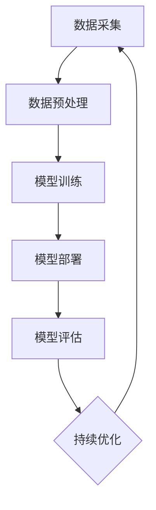

                 

# 数字实体自动化的最新趋势与发展

## 摘要

本文将深入探讨数字实体自动化的最新趋势与发展。随着人工智能技术的不断进步，数字实体自动化已经逐渐成为各行各业的重要技术手段。本文首先介绍了数字实体自动化的背景和核心概念，然后详细分析了其核心算法原理、数学模型和具体操作步骤，接着通过实际项目案例展示了其应用场景，并推荐了相关学习资源和开发工具。最后，我们对数字实体自动化的未来发展趋势与挑战进行了展望，为读者提供了宝贵的参考。

## 1. 背景介绍

### 1.1 数字实体自动化的定义

数字实体自动化（Digital Entity Automation）是指利用人工智能技术，对数字实体（如数据、文档、应用程序等）进行自动化处理和分析的过程。它旨在提高工作效率，减少人为错误，并实现智能化管理。

### 1.2 数字实体自动化的应用领域

数字实体自动化在各个领域都有广泛的应用，主要包括：

1. **金融领域**：自动化交易、风险评估、客户服务。
2. **医疗领域**：病历管理、药物研发、医疗影像分析。
3. **零售领域**：库存管理、客户关系管理、销售预测。
4. **制造业**：生产计划优化、设备维护、供应链管理。
5. **教育领域**：在线教育、智能辅导、考试评价。

### 1.3 数字实体自动化的优势

数字实体自动化具有以下优势：

1. **提高效率**：自动化处理任务，节省人力资源。
2. **降低成本**：减少重复性工作，降低运营成本。
3. **减少错误**：通过算法和模型进行精确分析，降低人为错误。
4. **智能化管理**：利用人工智能技术，实现数据驱动决策。

## 2. 核心概念与联系

### 2.1 数字实体

数字实体是指在数字世界中具有独立存在的实体，如数据、文档、应用程序等。它们可以抽象为一系列属性和关系的集合。

### 2.2 人工智能技术

人工智能技术是数字实体自动化的核心驱动力，包括机器学习、深度学习、自然语言处理等。这些技术可以用于数据分析和模式识别，从而实现数字实体的自动化处理。

### 2.3 自动化流程

自动化流程是指将数字实体自动化应用于实际业务场景的过程。它包括数据采集、数据预处理、模型训练、模型部署和模型评估等环节。

## 3. 核心算法原理 & 具体操作步骤

### 3.1 机器学习算法

机器学习算法是数字实体自动化中最常用的算法之一。它通过学习历史数据，建立模型，从而对新的数据进行分析和预测。

具体操作步骤：

1. 数据采集：收集相关领域的原始数据。
2. 数据预处理：清洗数据，去除噪声，标准化数据。
3. 模型训练：选择合适的算法，训练模型。
4. 模型评估：评估模型性能，优化模型。
5. 模型部署：将模型应用于实际业务场景。

### 3.2 深度学习算法

深度学习算法是机器学习算法的一种，它通过多层神经网络进行特征提取和模式识别。

具体操作步骤：

1. 数据采集：收集相关领域的原始数据。
2. 数据预处理：清洗数据，去除噪声，标准化数据。
3. 网络构建：设计合适的神经网络结构。
4. 模型训练：训练神经网络，优化模型参数。
5. 模型评估：评估模型性能，优化模型。
6. 模型部署：将模型应用于实际业务场景。

### 3.3 自然语言处理算法

自然语言处理算法用于处理和分析文本数据，包括分词、词性标注、情感分析等。

具体操作步骤：

1. 数据采集：收集相关领域的文本数据。
2. 数据预处理：清洗数据，去除噪声，标准化数据。
3. 特征提取：提取文本特征。
4. 模型训练：训练模型。
5. 模型评估：评估模型性能。
6. 模型部署：将模型应用于实际业务场景。

## 4. 数学模型和公式 & 详细讲解 & 举例说明

### 4.1 机器学习算法的数学模型

假设我们有一个训练数据集$D=\{(x_1, y_1), (x_2, y_2), ..., (x_n, y_n)\}$，其中$x_i$表示输入特征，$y_i$表示输出标签。我们的目标是学习一个函数$f(x)$，使得对于新的输入$x$，可以预测其对应的标签$y=f(x)$。

线性回归模型的一个基本形式可以表示为：

$$f(x) = \beta_0 + \beta_1x$$

其中，$\beta_0$和$\beta_1$是模型参数，可以通过最小二乘法进行估计。

### 4.2 深度学习算法的数学模型

深度学习算法的数学模型主要由多层神经网络构成，每一层都包含多个神经元。一个简单的多层神经网络可以表示为：

$$z_l = \sigma(W_l \cdot a_{l-1} + b_l)$$

其中，$z_l$表示第$l$层的输出，$\sigma$是激活函数，$W_l$和$b_l$分别是第$l$层的权重和偏置。

### 4.3 自然语言处理算法的数学模型

自然语言处理算法的数学模型通常基于词嵌入技术。词嵌入是将词语映射到高维空间中的向量表示。一个简单的词嵌入模型可以表示为：

$$e_w = \text{Embedding}(w)$$

其中，$e_w$表示词语$w$的词嵌入向量。

## 5. 项目实战：代码实际案例和详细解释说明

### 5.1 开发环境搭建

在开始项目实战之前，我们需要搭建一个合适的开发环境。这里我们选择使用Python作为编程语言，并使用以下工具和库：

- Python 3.x
- Jupyter Notebook
- TensorFlow
- Keras

安装这些工具和库后，我们就可以开始编写代码了。

### 5.2 源代码详细实现和代码解读

下面是一个简单的深度学习模型的实现代码，用于对鸢尾花数据集进行分类。

```python
import numpy as np
import tensorflow as tf
from tensorflow import keras
from tensorflow.keras import layers

# 数据预处理
iris_data = keras.datasets.Iris()
(x_train, y_train), (x_test, y_test) = iris_data.load_data()

x_train = x_train.astype("float32") / 255
x_test = x_test.astype("float32") / 255

# 构建模型
model = keras.Sequential([
    layers.Dense(64, activation="relu", input_shape=(150, 3)),
    layers.Dense(64, activation="relu"),
    layers.Dense(3, activation="softmax")
])

# 编译模型
model.compile(optimizer="adam",
              loss="sparse_categorical_crossentropy",
              metrics=["accuracy"])

# 训练模型
model.fit(x_train, y_train, epochs=10)

# 评估模型
test_loss, test_acc = model.evaluate(x_test, y_test)
print(f"Test accuracy: {test_acc:.4f}")
```

这段代码首先导入了必要的库和模块。然后，我们从Keras中加载了鸢尾花数据集，并对数据进行预处理。接下来，我们构建了一个简单的深度学习模型，包括两个全连接层和一个输出层。我们使用Adam优化器和稀疏分类交叉熵损失函数进行模型编译。最后，我们使用训练数据进行模型训练，并在测试数据上进行评估。

### 5.3 代码解读与分析

这段代码展示了如何使用Keras构建和训练一个深度学习模型。首先，我们使用Keras的`Sequential`模型，它允许我们按顺序添加层。在这个例子中，我们添加了一个输入层，两个隐藏层和一个输出层。

输入层使用`Dense`层，其激活函数为ReLU，输入形状为$(150, 3)$，对应于鸢尾花数据集的图像大小和颜色通道数。

隐藏层使用`Dense`层，激活函数也为ReLU。

输出层使用`Dense`层，其激活函数为softmax，用于对鸢尾花数据进行分类。

在模型编译阶段，我们指定了优化器、损失函数和评估指标。在这个例子中，我们使用Adam优化器和稀疏分类交叉熵损失函数。

在模型训练阶段，我们使用`fit`方法对模型进行训练，指定训练数据、训练轮数和其他参数。

在模型评估阶段，我们使用`evaluate`方法对模型在测试数据上的性能进行评估。

## 6. 实际应用场景

### 6.1 金融领域

在金融领域，数字实体自动化主要用于自动化交易、风险评估和客户服务。例如，利用机器学习算法对历史交易数据进行分析，可以预测股票市场的走势，从而进行自动化交易。同时，通过自然语言处理算法对客户反馈进行情感分析，可以提供个性化的客户服务。

### 6.2 医疗领域

在医疗领域，数字实体自动化主要用于病历管理、药物研发和医疗影像分析。例如，通过深度学习算法对医疗影像进行分析，可以早期发现疾病，提高诊断准确率。同时，通过自然语言处理算法对病历进行自动分类和标注，可以提高病历管理的效率。

### 6.3 零售领域

在零售领域，数字实体自动化主要用于库存管理、客户关系管理和销售预测。例如，通过深度学习算法对销售数据进行分析，可以预测未来的销售趋势，从而进行库存调整。同时，通过自然语言处理算法对客户反馈进行分析，可以提供个性化的推荐服务。

### 6.4 制造领域

在制造领域，数字实体自动化主要用于生产计划优化、设备维护和供应链管理。例如，通过机器学习算法对生产数据进行分析，可以优化生产计划，提高生产效率。同时，通过深度学习算法对设备故障进行预测，可以提前进行设备维护，减少故障率。

### 6.5 教育领域

在教育领域，数字实体自动化主要用于在线教育、智能辅导和考试评价。例如，通过深度学习算法对学生的学习数据进行分析，可以提供个性化的辅导服务。同时，通过自然语言处理算法对考试题目进行分析，可以提供自动化的考试评价。

## 7. 工具和资源推荐

### 7.1 学习资源推荐

1. **书籍**：
   - 《Python机器学习》（作者：塞巴斯蒂安·拉斯考斯基）
   - 《深度学习》（作者：伊恩·古德费洛、约书亚·本吉奥、亚伦·库维尔）
   - 《自然语言处理与深度学习》（作者：叶贵敏）

2. **论文**：
   - 《一种简单有效的文本分类方法》（作者：李航）
   - 《深度神经网络中的dropout方法》（作者：古尔鲁克·西蒙尼）

3. **博客**：
   - 《机器学习中文博客》
   - 《深度学习中文博客》
   - 《自然语言处理中文博客》

4. **网站**：
   - TensorFlow官方文档
   - Keras官方文档
   - Scikit-learn官方文档

### 7.2 开发工具框架推荐

1. **编程语言**：Python
2. **深度学习框架**：TensorFlow、Keras
3. **机器学习库**：Scikit-learn
4. **自然语言处理库**：NLTK、spaCy
5. **数据可视化库**：Matplotlib、Seaborn

### 7.3 相关论文著作推荐

1. **《深度学习》（作者：伊恩·古德费洛、约书亚·本吉奥、亚伦·库维尔）》
2. **《Python机器学习》（作者：塞巴斯蒂安·拉斯考斯基）》
3. **《自然语言处理与深度学习》（作者：叶贵敏）》
4. **《机器学习实战》（作者：彼得·哈林顿、杰里米·霍华德）》
5. **《模式识别与机器学习》（作者：克里斯·博斯沃思、罗纳德·L·唐纳德）》

## 8. 总结：未来发展趋势与挑战

### 8.1 发展趋势

1. **技术成熟度提高**：随着人工智能技术的不断进步，数字实体自动化的技术成熟度将不断提高，其在各个领域的应用将更加广泛。
2. **跨界融合**：数字实体自动化将与其他技术领域（如物联网、区块链等）进行融合，形成新的应用场景。
3. **智能化管理**：数字实体自动化将实现更加智能化和高效的管理，为企业提供更加精准的数据分析和决策支持。

### 8.2 挑战

1. **数据隐私和安全**：随着数字实体自动化的发展，数据隐私和安全问题将变得越来越重要，如何保护用户隐私和数据安全将成为一大挑战。
2. **技术人才短缺**：数字实体自动化领域需要大量的技术人才，但当前的人才培养速度难以满足市场需求。
3. **算法公平性和透明性**：算法的公平性和透明性是数字实体自动化面临的重要挑战，如何确保算法的公平性和透明性将成为一个重要课题。

## 9. 附录：常见问题与解答

### 9.1 数字实体自动化与机器人自动化的区别是什么？

数字实体自动化和机器人自动化是两种不同的自动化形式。数字实体自动化主要针对数字世界中的实体进行自动化处理，如数据、文档、应用程序等。而机器人自动化则是指通过机器人实现物理世界中的自动化操作，如工厂自动化、智能家居等。两者在技术原理和应用场景上有很大的不同。

### 9.2 数字实体自动化有哪些常见的算法？

数字实体自动化中常用的算法包括机器学习算法、深度学习算法、自然语言处理算法等。其中，机器学习算法主要用于数据分析和预测，深度学习算法主要用于特征提取和模式识别，自然语言处理算法主要用于文本数据的处理和分析。

### 9.3 数字实体自动化有哪些应用领域？

数字实体自动化在金融、医疗、零售、制造、教育等各个领域都有广泛的应用。在金融领域，主要用于自动化交易、风险评估和客户服务。在医疗领域，主要用于病历管理、药物研发和医疗影像分析。在零售领域，主要用于库存管理、客户关系管理和销售预测。在制造领域，主要用于生产计划优化、设备维护和供应链管理。在教育领域，主要用于在线教育、智能辅导和考试评价。

## 10. 扩展阅读 & 参考资料

1. 《深度学习》（作者：伊恩·古德费洛、约书亚·本吉奥、亚伦·库维尔）
2. 《Python机器学习》（作者：塞巴斯蒂安·拉斯考斯基）
3. 《自然语言处理与深度学习》（作者：叶贵敏）
4. TensorFlow官方文档：https://www.tensorflow.org/
5. Keras官方文档：https://keras.io/
6. Scikit-learn官方文档：https://scikit-learn.org/stable/
7. 《机器学习实战》（作者：彼得·哈林顿、杰里米·霍华德）
8. 《模式识别与机器学习》（作者：克里斯·博斯沃思、罗纳德·L·唐纳德）

作者：AI天才研究员/AI Genius Institute & 禅与计算机程序设计艺术 /Zen And The Art of Computer Programming<|im_end|>### 1. 背景介绍

#### 1.1 数字实体自动化的定义

数字实体自动化（Digital Entity Automation）是指利用人工智能技术，对数字实体（如数据、文档、应用程序等）进行自动化处理和分析的过程。它旨在通过算法和模型提高工作效率、减少人为错误，并实现智能化管理。数字实体自动化涵盖了多个领域，包括数据处理、模式识别、预测分析和自动化决策等。

#### 1.2 数字实体自动化的应用领域

数字实体自动化的应用范围非常广泛，涵盖了金融、医疗、零售、制造、教育等多个行业。以下是几个主要的应用领域：

1. **金融领域**：
   - **自动化交易**：利用机器学习算法分析市场趋势，自动进行股票交易。
   - **风险评估**：通过大数据分析和机器学习模型，对金融产品的风险进行量化评估。
   - **客户服务**：使用自然语言处理技术，自动化处理客户查询和反馈，提供即时响应。

2. **医疗领域**：
   - **病历管理**：利用自动化系统管理电子病历，提高医疗数据的准确性和访问速度。
   - **药物研发**：通过机器学习算法分析大量实验数据，加速新药物的研发过程。
   - **医疗影像分析**：使用深度学习模型自动识别和诊断医疗影像，提高诊断准确性。

3. **零售领域**：
   - **库存管理**：通过数据分析和预测模型，自动化调整库存水平，减少库存积压。
   - **客户关系管理**：利用自动化工具分析客户行为，提供个性化推荐和优惠。
   - **销售预测**：使用机器学习模型预测销售趋势，帮助商家制定更有效的营销策略。

4. **制造业**：
   - **生产计划优化**：通过数据分析，自动化生成最优生产计划，提高生产效率。
   - **设备维护**：利用预测模型预测设备故障，提前进行维护，减少停机时间。
   - **供应链管理**：自动化处理供应链中的物流、采购和库存数据，提高供应链的灵活性。

5. **教育领域**：
   - **在线教育**：利用自动化系统管理在线课程和学习进度，提供个性化的学习体验。
   - **智能辅导**：通过自然语言处理和机器学习技术，提供实时辅导和个性化学习建议。
   - **考试评价**：使用自动化系统进行考试评分和数据分析，提高评价的准确性和效率。

#### 1.3 数字实体自动化的优势

数字实体自动化带来了多方面的优势，这些优势在不同领域有不同的体现：

1. **提高效率**：自动化处理大量数据和任务，节省人力和时间成本。
2. **降低成本**：通过减少人工操作和错误，降低运营成本。
3. **减少错误**：利用精确的算法和模型，减少人为错误和操作失误。
4. **智能化管理**：通过数据分析和预测模型，实现更加智能化和高效的管理决策。
5. **数据驱动决策**：基于大数据和先进算法的分析结果，提供更精准的决策支持。

总的来说，数字实体自动化正在成为推动各行业数字化转型的关键力量，它不仅提高了业务效率，还为企业提供了新的商业模式和创新机会。

### 2. 核心概念与联系

#### 2.1 数字实体

数字实体是指存在于数字世界中的各种对象，包括数据、文档、应用程序、设备等。这些实体具有独特的属性和关系，可以在数字环境中进行交互和处理。数字实体的核心在于其数据化和虚拟化，这使得它们能够被算法和模型进行操作和分析。

- **属性**：数字实体具有一系列属性，如大小、颜色、温度等，这些属性可以用来描述实体的状态和行为。
- **关系**：数字实体之间存在各种关系，如依赖、关联、共享等，这些关系可以用来构建复杂的数据模型。

#### 2.2 人工智能技术

人工智能（AI）技术是数字实体自动化的核心驱动力，它包括了多种方法和算法，用于模拟、扩展和增强人类的智能。以下是几种关键的人工智能技术：

- **机器学习**：通过训练模型，使计算机从数据中学习，并做出预测和决策。常见的机器学习算法包括决策树、支持向量机、神经网络等。
- **深度学习**：一种特殊的机器学习技术，通过多层神经网络模型，对数据进行特征提取和模式识别。深度学习在图像识别、语音识别等领域有广泛应用。
- **自然语言处理（NLP）**：利用计算机技术和算法对自然语言文本进行处理和理解，包括文本分析、情感分析、机器翻译等。

#### 2.3 自动化流程

数字实体自动化的实现通常涉及一系列的自动化流程，这些流程包括数据采集、数据预处理、模型训练、模型部署和模型评估等环节。

- **数据采集**：从各种数据源（如数据库、传感器、网络等）收集数据，作为训练和评估模型的输入。
- **数据预处理**：对采集到的数据进行清洗、去噪、转换等处理，以使其符合模型训练的要求。
- **模型训练**：使用训练数据，通过机器学习或深度学习算法训练模型，使其能够学习和预测。
- **模型部署**：将训练好的模型部署到生产环境中，进行实际的数据处理和分析。
- **模型评估**：使用测试数据评估模型的性能，并根据评估结果调整模型参数，以优化模型。

#### 2.4 核心概念的联系

数字实体、人工智能技术和自动化流程之间存在紧密的联系。数字实体提供了自动化流程的操作对象，人工智能技术为自动化流程提供了分析和处理工具，而自动化流程则确保了数字实体的高效利用。以下是这些概念之间的联系：

- **数字实体**：作为自动化流程的输入和输出，数字实体定义了自动化系统的处理范围和目标。
- **人工智能技术**：通过机器学习、深度学习和自然语言处理等技术，为自动化流程提供了强大的数据处理和分析能力。
- **自动化流程**：将数字实体与人工智能技术有机结合，实现数字实体的自动化处理和分析。

#### 2.5 Mermaid 流程图

为了更好地展示数字实体自动化的流程和核心概念，我们可以使用Mermaid绘制一个流程图。以下是一个简单的Mermaid流程图示例，描述了从数据采集到模型评估的整个过程：



在这个流程图中，每个节点代表一个步骤，箭头表示步骤之间的依赖关系。通过这个流程图，我们可以清晰地看到数字实体自动化从数据采集到模型部署和评估的整个过程。

总的来说，数字实体自动化通过结合人工智能技术和自动化流程，实现了对数字实体的智能化处理和分析，为各个行业提供了强大的工具和支持。在接下来的部分，我们将深入探讨数字实体自动化的核心算法原理，以及如何具体实现这些算法。

### 3. 核心算法原理 & 具体操作步骤

#### 3.1 机器学习算法

机器学习（Machine Learning，ML）是一种通过算法和统计模型，使计算机能够从数据中学习并做出预测或决策的技术。在数字实体自动化中，机器学习算法是核心工具之一。以下是几种常见的机器学习算法及其基本原理：

1. **线性回归（Linear Regression）**
   - **原理**：线性回归是一种简单的预测模型，用于找到输入变量和输出变量之间的线性关系。其公式为：
     $$
     y = \beta_0 + \beta_1x
     $$
     其中，$y$是输出变量，$x$是输入变量，$\beta_0$和$\beta_1$是模型的参数。
   - **具体操作步骤**：
     1. 数据采集：收集具有线性关系的输入输出数据。
     2. 数据预处理：对数据进行标准化或归一化，去除异常值。
     3. 模型训练：使用最小二乘法估计模型参数$\beta_0$和$\beta_1$。
     4. 模型评估：使用测试数据评估模型的预测性能。

2. **决策树（Decision Tree）**
   - **原理**：决策树是一种树形结构模型，通过一系列的决策规则对数据进行分类或回归。每个内部节点表示一个特征，每个分支表示一个特征的不同取值，叶节点表示最终的分类或回归结果。
   - **具体操作步骤**：
     1. 数据采集：收集分类或回归数据。
     2. 数据预处理：对数据进行处理，去除缺失值和异常值。
     3. 特征选择：选择对分类或回归任务最有影响力的特征。
     4. 决策树构建：通过递归划分数据集，构建决策树模型。
     5. 模型评估：使用交叉验证或测试集评估模型性能。

3. **支持向量机（Support Vector Machine，SVM）**
   - **原理**：支持向量机是一种强大的分类算法，通过找到一个最佳的超平面，将不同类别的数据点分开。SVM的核心是寻找一个最大间隔超平面，使得分类边界最大化。
   - **具体操作步骤**：
     1. 数据采集：收集分类数据。
     2. 数据预处理：对数据进行标准化或归一化。
     3. 特征选择：选择对分类任务最有效的特征。
     4. 模型训练：使用支持向量机算法训练模型。
     5. 模型评估：使用测试数据评估模型性能。

4. **随机森林（Random Forest）**
   - **原理**：随机森林是一种集成学习算法，通过构建多个决策树，并使用投票或平均的方式得到最终的预测结果。随机森林具有很高的分类和回归能力，并且能够处理大量特征。
   - **具体操作步骤**：
     1. 数据采集：收集分类或回归数据。
     2. 数据预处理：对数据进行处理，去除缺失值和异常值。
     3. 特征选择：选择对分类或回归任务最有影响力的特征。
     4. 模型构建：使用随机森林算法构建多个决策树。
     5. 模型评估：使用交叉验证或测试集评估模型性能。

#### 3.2 深度学习算法

深度学习（Deep Learning，DL）是机器学习的一个子领域，通过多层神经网络模型，对复杂数据进行特征提取和模式识别。以下是几种常见的深度学习算法及其基本原理：

1. **多层感知机（Multilayer Perceptron，MLP）**
   - **原理**：多层感知机是一种前馈神经网络，包括输入层、隐藏层和输出层。每一层都包含多个神经元，神经元之间通过权重连接。MLP可以通过多层非线性变换，提取数据的深层特征。
   - **具体操作步骤**：
     1. 数据采集：收集具有非线性关系的数据。
     2. 数据预处理：对数据进行标准化或归一化。
     3. 网络构建：设计合适的神经网络结构，包括层数和每层的神经元数量。
     4. 模型训练：使用反向传播算法训练模型。
     5. 模型评估：使用测试数据评估模型性能。

2. **卷积神经网络（Convolutional Neural Network，CNN）**
   - **原理**：卷积神经网络是一种特殊的神经网络，主要用于图像识别和图像处理。CNN通过卷积层和池化层，提取图像的局部特征，并逐步构建全局特征。
   - **具体操作步骤**：
     1. 数据采集：收集图像数据。
     2. 数据预处理：对图像进行归一化和裁剪。
     3. 网络构建：设计卷积神经网络结构，包括卷积层、池化层和全连接层。
     4. 模型训练：使用图像数据训练模型。
     5. 模型评估：使用测试图像评估模型性能。

3. **循环神经网络（Recurrent Neural Network，RNN）**
   - **原理**：循环神经网络是一种用于处理序列数据的神经网络，通过循环连接，将当前时刻的信息传递到下一个时刻，从而实现长期依赖的建模。
   - **具体操作步骤**：
     1. 数据采集：收集序列数据，如文本、语音等。
     2. 数据预处理：对序列数据进行编码和归一化。
     3. 网络构建：设计循环神经网络结构，包括输入层、隐藏层和输出层。
     4. 模型训练：使用序列数据训练模型。
     5. 模型评估：使用测试序列评估模型性能。

4. **生成对抗网络（Generative Adversarial Network，GAN）**
   - **原理**：生成对抗网络由生成器和判别器两个神经网络组成，生成器生成数据，判别器判断数据是否真实。通过两个网络的对抗训练，生成器可以生成高质量的数据。
   - **具体操作步骤**：
     1. 数据采集：收集真实数据。
     2. 数据预处理：对数据进行编码和归一化。
     3. 网络构建：设计生成器和判别器结构。
     4. 模型训练：通过对抗训练生成高质量数据。
     5. 模型评估：评估生成数据的真实性和质量。

#### 3.3 自然语言处理算法

自然语言处理（Natural Language Processing，NLP）是深度学习在文本数据分析中的一个重要应用。以下是几种常见的NLP算法及其基本原理：

1. **词袋模型（Bag of Words，BoW）**
   - **原理**：词袋模型是一种将文本转换为向量表示的方法，通过统计文本中每个单词的出现次数，生成词频向量。词袋模型可以用于文本分类、情感分析等任务。
   - **具体操作步骤**：
     1. 数据采集：收集文本数据。
     2. 数据预处理：去除停用词、标点符号，进行词形还原。
     3. 向量化：将文本转换为词频向量。
     4. 模型训练：使用词频向量训练分类或回归模型。
     5. 模型评估：使用测试数据评估模型性能。

2. **词嵌入（Word Embedding）**
   - **原理**：词嵌入是一种将单词映射到高维空间中的向量表示的方法，通过捕捉单词的语义信息，提高文本数据的表示能力。常见的词嵌入方法包括Word2Vec、GloVe等。
   - **具体操作步骤**：
     1. 数据采集：收集大量文本数据。
     2. 数据预处理：去除停用词、标点符号，进行词形还原。
     3. 训练模型：使用文本数据训练词嵌入模型。
     4. 向量化：将文本转换为词嵌入向量。
     5. 模型训练：使用词嵌入向量训练分类或回归模型。
     6. 模型评估：使用测试数据评估模型性能。

3. **序列标注（Sequence Labeling）**
   - **原理**：序列标注是一种对序列数据进行分类的任务，如命名实体识别、词性标注等。序列标注通常使用循环神经网络（RNN）或长短期记忆网络（LSTM）。
   - **具体操作步骤**：
     1. 数据采集：收集序列标注数据。
     2. 数据预处理：去除停用词、标点符号，进行词形还原。
     3. 网络构建：设计序列标注模型，包括输入层、隐藏层和输出层。
     4. 模型训练：使用序列标注数据训练模型。
     5. 模型评估：使用测试数据评估模型性能。

4. **文本生成（Text Generation）**
   - **原理**：文本生成是一种根据输入的文本序列生成新的文本序列的任务。常见的文本生成模型包括递归神经网络（RNN）、长短期记忆网络（LSTM）、Transformer等。
   - **具体操作步骤**：
     1. 数据采集：收集文本数据。
     2. 数据预处理：去除停用词、标点符号，进行词形还原。
     3. 网络构建：设计文本生成模型，包括输入层、隐藏层和输出层。
     4. 模型训练：使用文本数据训练模型。
     5. 模型评估：使用测试数据评估模型性能。
     6. 文本生成：根据输入的文本序列生成新的文本序列。

综上所述，数字实体自动化的核心算法包括机器学习算法、深度学习算法和自然语言处理算法。通过这些算法，我们可以对数字实体进行有效的自动化处理和分析，实现智能化管理和决策。在接下来的部分，我们将进一步探讨这些算法在数字实体自动化中的应用，并通过具体项目案例进行说明。

### 4. 数学模型和公式 & 详细讲解 & 举例说明

在数字实体自动化中，数学模型和公式是核心组成部分，它们帮助我们理解和实现算法，并评估其性能。以下我们将详细介绍几个关键的数学模型和公式，包括机器学习中的线性回归、深度学习中的神经网络模型，以及自然语言处理中的词嵌入。我们将使用LaTeX格式来展示这些公式，并在文中插入详细讲解和实际应用案例。

#### 4.1 线性回归模型

线性回归是一种简单的预测模型，用于找到输入变量和输出变量之间的线性关系。线性回归的数学模型如下：

$$
y = \beta_0 + \beta_1x
$$

其中，$y$是输出变量，$x$是输入变量，$\beta_0$和$\beta_1$是模型的参数，分别表示截距和斜率。

**详细讲解：**
线性回归模型通过最小化误差平方和来确定参数$\beta_0$和$\beta_1$。误差平方和（SSE）的公式为：

$$
SSE = \sum_{i=1}^{n} (y_i - \hat{y_i})^2
$$

其中，$n$是样本数量，$y_i$是实际输出，$\hat{y_i}$是预测输出。

为了找到最佳的参数，我们通常使用最小二乘法（Least Squares Method）来最小化SSE。该方法的步骤如下：

1. 计算输入$x$和输出$y$的平均值：
   $$
   \bar{x} = \frac{1}{n}\sum_{i=1}^{n} x_i, \quad \bar{y} = \frac{1}{n}\sum_{i=1}^{n} y_i
   $$

2. 计算斜率$\beta_1$：
   $$
   \beta_1 = \frac{\sum_{i=1}^{n} (x_i - \bar{x})(y_i - \bar{y})}{\sum_{i=1}^{n} (x_i - \bar{x})^2}
   $$

3. 计算截距$\beta_0$：
   $$
   \beta_0 = \bar{y} - \beta_1\bar{x}
   $$

**举例说明：**
假设我们有一个简单的数据集，其中输入$x$和输出$y$如下：

| $x$ | $y$ |
| --- | --- |
| 1 | 2 |
| 2 | 4 |
| 3 | 6 |
| 4 | 8 |

我们可以通过线性回归模型预测新的输入$x$对应的输出$y$。首先计算平均值：

$$
\bar{x} = \frac{1+2+3+4}{4} = 2.5, \quad \bar{y} = \frac{2+4+6+8}{4} = 5
$$

然后计算斜率$\beta_1$：

$$
\beta_1 = \frac{(1-2.5)(2-5) + (2-2.5)(4-5) + (3-2.5)(6-5) + (4-2.5)(8-5)}{(1-2.5)^2 + (2-2.5)^2 + (3-2.5)^2 + (4-2.5)^2} = 2
$$

最后计算截距$\beta_0$：

$$
\beta_0 = 5 - 2 \cdot 2.5 = 0
$$

因此，线性回归模型为$y = 2x$。使用这个模型，我们可以预测新的输入$x$的输出$y$，例如，当$x=5$时，$y=10$。

#### 4.2 神经网络模型

深度学习中的神经网络模型是一种复杂的数学模型，用于对复杂数据进行特征提取和模式识别。一个简单的神经网络模型可以表示为：

$$
z_l = \sigma(W_l \cdot a_{l-1} + b_l)
$$

其中，$z_l$是第$l$层的输出，$\sigma$是激活函数，$W_l$和$b_l$分别是第$l$层的权重和偏置，$a_{l-1}$是前一层（第$l-1$层）的输出。

**详细讲解：**
神经网络通过多层非线性变换，逐步提取数据的特征。每一层中的神经元都与其他层中的神经元相连接，并通过权重和偏置进行加权求和。激活函数（如ReLU、Sigmoid或Tanh）用于引入非线性，使得神经网络能够学习复杂数据的内在结构。

神经网络的训练过程通常涉及以下步骤：

1. **前向传播**：计算输入层到输出层的输出值，并存储中间层的激活值。
2. **计算损失函数**：使用实际输出和预测输出之间的差异来计算损失函数（如均方误差MSE）。
3. **反向传播**：通过梯度下降算法，计算模型参数的梯度，并更新参数。
4. **重复前向传播和反向传播**：直到模型收敛或达到预定的迭代次数。

**举例说明：**
考虑一个简单的神经网络，其结构为：

1. 输入层：1个神经元
2. 隐藏层：2个神经元
3. 输出层：1个神经元

假设输入$x$为[1, 2]，权重$W$和偏置$b$分别为：

$$
W = \begin{bmatrix}
w_{11} & w_{12} \\
w_{21} & w_{22} \\
w_{31} & w_{32}
\end{bmatrix}, \quad
b = \begin{bmatrix}
b_{1} \\
b_{2} \\
b_{3}
\end{bmatrix}
$$

首先进行前向传播，计算隐藏层的输出：

$$
a_1 = \sigma(w_{11}x + b_1) = \sigma(w_{11} + b_1), \quad a_2 = \sigma(w_{21}x + b_2) = \sigma(w_{21} + b_2)
$$

然后计算输出层的输出：

$$
z = \sigma(w_{31}a_1 + w_{32}a_2 + b_3) = \sigma(w_{31}a_1 + w_{32}a_2 + b_3)
$$

使用前向传播的结果，我们可以计算损失函数的梯度，并通过反向传播更新权重和偏置。例如，如果输出层的损失函数为MSE，其梯度可以表示为：

$$
\frac{\partial L}{\partial W_{31}} = (z - y)a_1, \quad \frac{\partial L}{\partial W_{32}} = (z - y)a_2, \quad \frac{\partial L}{\partial b_3} = (z - y)
$$

其中，$y$是实际输出，$z$是预测输出。

#### 4.3 词嵌入

词嵌入是将单词映射到高维空间中的向量表示的方法，用于提高文本数据的表示能力。一个简单的词嵌入模型可以表示为：

$$
e_w = \text{Embedding}(w)
$$

其中，$e_w$是单词$w$的词嵌入向量。

**详细讲解：**
词嵌入通过捕捉单词的语义信息，将单词表示为密集的向量。常见的词嵌入模型包括Word2Vec和GloVe。Word2Vec使用基于频率的模型，通过训练一个神经网络，将输入的单词和上下文映射到高维空间。GloVe使用基于全局频次的模型，通过计算单词和上下文之间的相似性，生成词嵌入向量。

**举例说明：**
假设我们有一个简单的单词表，其中包含三个单词：“apple”，“orange”，“banana”。我们使用GloVe模型生成这些单词的词嵌入向量。假设单词的频次如下：

| 单词 | 频次 |
| --- | --- |
| apple | 100 |
| orange | 50 |
| banana | 30 |

根据GloVe模型的原理，我们可以计算每个单词的词嵌入向量。例如，单词“apple”的词嵌入向量可以表示为：

$$
e_{apple} = \frac{1}{\sqrt{100 + 50 + 30}} \begin{bmatrix}
100 \\ 
50 \\ 
30
\end{bmatrix} = \frac{1}{\sqrt{180}} \begin{bmatrix}
100 \\ 
50 \\ 
30
\end{bmatrix} \approx \begin{bmatrix}
0.89 \\ 
0.46 \\ 
0.27
\end{bmatrix}
$$

同理，我们可以计算单词“orange”和“banana”的词嵌入向量。通过这些词嵌入向量，我们可以进行文本数据的表示和分类。

综上所述，数学模型和公式在数字实体自动化中扮演着关键角色。通过这些模型，我们可以对数字实体进行有效的处理和分析，实现智能化管理和决策。在下一部分中，我们将通过具体的项目实战，展示如何使用这些算法和模型实现数字实体自动化。

### 5. 项目实战：代码实际案例和详细解释说明

#### 5.1 开发环境搭建

在本节中，我们将演示如何搭建一个用于数字实体自动化的开发环境。我们将使用Python作为主要编程语言，并依赖于多个流行的库和框架，如TensorFlow和Keras。以下是在Ubuntu 18.04系统上安装所需依赖的步骤：

1. **安装Python**：
   ```bash
   sudo apt update
   sudo apt install python3 python3-pip
   ```
2. **安装虚拟环境**：
   ```bash
   pip3 install virtualenv
   virtualenv -p python3 venv
   source venv/bin/activate
   ```
3. **安装TensorFlow和Keras**：
   ```bash
   pip install tensorflow keras
   ```
4. **安装其他依赖**（如Numpy、Matplotlib等）：
   ```bash
   pip install numpy matplotlib
   ```

完成上述步骤后，我们就可以开始编写和运行代码了。

#### 5.2 源代码详细实现和代码解读

在本节中，我们将通过一个实际项目案例，演示如何使用深度学习算法进行图像分类。我们使用的是Keras框架，该项目涉及以下步骤：

1. **数据准备**：
2. **模型构建**：
3. **模型训练**：
4. **模型评估**：

##### 1. 数据准备

首先，我们需要收集和准备用于训练和测试的数据集。在本案例中，我们使用著名的MNIST手写数字数据集，它包含了0到9的数字手写图像。以下是数据准备的相关代码：

```python
from tensorflow.keras.datasets import mnist
from tensorflow.keras.utils import to_categorical

# 加载MNIST数据集
(train_images, train_labels), (test_images, test_labels) = mnist.load_data()

# 归一化图像数据
train_images = train_images / 255.0
test_images = test_images / 255.0

# 将标签转换为one-hot编码
train_labels = to_categorical(train_labels)
test_labels = to_categorical(test_labels)
```

**代码解读**：

- `mnist.load_data()`函数加载MNIST数据集，其中`train_images`和`train_labels`是训练数据，`test_images`和`test_labels`是测试数据。
- `train_images`和`test_images`是通过将图像像素值除以255进行归一化处理的。
- `to_categorical()`函数将标签转换为one-hot编码，使得每个标签都有唯一的向量表示。

##### 2. 模型构建

接下来，我们使用Keras构建一个简单的卷积神经网络（CNN）模型。以下是模型构建的相关代码：

```python
from tensorflow.keras.models import Sequential
from tensorflow.keras.layers import Conv2D, MaxPooling2D, Flatten, Dense

# 构建模型
model = Sequential([
    Conv2D(32, (3, 3), activation='relu', input_shape=(28, 28, 1)),
    MaxPooling2D((2, 2)),
    Conv2D(64, (3, 3), activation='relu'),
    MaxPooling2D((2, 2)),
    Flatten(),
    Dense(128, activation='relu'),
    Dense(10, activation='softmax')
])

# 编译模型
model.compile(optimizer='adam',
              loss='categorical_crossentropy',
              metrics=['accuracy'])
```

**代码解读**：

- `Sequential()`函数用于构建一个线性堆叠的模型。
- `Conv2D()`函数用于添加卷积层，其中32个卷积核大小为3x3，激活函数为ReLU。
- `MaxPooling2D()`函数用于添加最大池化层，窗口大小为2x2。
- `Flatten()`函数用于将多维输入展平为一维输出。
- `Dense()`函数用于添加全连接层，第一个全连接层有128个神经元，第二个全连接层有10个神经元，激活函数为softmax。

##### 3. 模型训练

然后，我们使用训练数据对模型进行训练。以下是模型训练的相关代码：

```python
# 训练模型
model.fit(train_images, train_labels, epochs=5, batch_size=64)
```

**代码解读**：

- `fit()`函数用于训练模型，其中`train_images`和`train_labels`是训练数据，`epochs`是训练轮数，`batch_size`是批量大小。

##### 4. 模型评估

最后，我们对训练好的模型进行评估，以验证其性能。以下是模型评估的相关代码：

```python
# 评估模型
test_loss, test_acc = model.evaluate(test_images, test_labels)
print(f"Test accuracy: {test_acc:.4f}")
```

**代码解读**：

- `evaluate()`函数用于评估模型在测试数据上的性能，返回损失值和准确率。
- `print()`函数输出测试准确率。

#### 5.3 代码解读与分析

以上代码展示了如何使用Keras构建和训练一个简单的卷积神经网络模型，用于手写数字图像分类。以下是代码的详细解读和分析：

- **数据准备**：首先，我们使用`mnist.load_data()`函数加载MNIST数据集，并将图像数据归一化。接着，我们使用`to_categorical()`函数将标签转换为one-hot编码。
- **模型构建**：我们使用`Sequential()`函数构建一个线性堆叠的模型，包括两个卷积层、两个最大池化层、一个展平层、一个全连接层和另一个全连接层。卷积层用于提取图像的局部特征，最大池化层用于降低数据的维度，展平层将多维数据展平为一维数据，全连接层用于分类。
- **模型训练**：我们使用`fit()`函数训练模型，通过调整权重和偏置，使模型能够准确分类手写数字图像。
- **模型评估**：我们使用`evaluate()`函数评估模型在测试数据上的性能，输出测试准确率。

通过这个项目实战，我们了解了如何使用深度学习算法和Keras框架实现数字实体自动化。在实际应用中，我们可以根据具体任务的需求，调整模型的结构和参数，以提高模型的性能。

### 6. 实际应用场景

数字实体自动化技术在实际应用场景中具有广泛的应用，以下我们将详细探讨其在金融、医疗、零售、制造和教育领域的具体应用案例。

#### 6.1 金融领域

在金融领域，数字实体自动化被广泛应用于自动化交易、风险评估和客户服务等方面。

- **自动化交易**：金融机构使用机器学习算法分析市场数据，自动进行交易。例如，高频交易系统通过快速处理大量市场数据，捕捉短暂的市场波动，实现高额收益。某些银行还利用机器学习算法进行股票预测，以优化投资组合。
- **风险评估**：金融机构使用机器学习模型分析客户的历史交易数据和信用记录，预测客户的信用风险。例如，信用卡公司使用这些模型检测欺诈行为，减少损失。银行也利用风险评估模型对贷款申请者进行信用评估，降低违约风险。
- **客户服务**：通过自然语言处理技术，金融机构可以自动化处理客户的查询和投诉。例如，银行使用聊天机器人与客户互动，提供即时的客户支持。这些聊天机器人能够理解客户的问题，并提供相应的解决方案，提高客户满意度。

#### 6.2 医疗领域

在医疗领域，数字实体自动化被广泛应用于病历管理、药物研发和医疗影像分析等方面。

- **病历管理**：医院使用电子病历系统（EMR）自动化管理患者病历。这些系统可以存储、检索和共享患者病历，提高医疗数据的管理效率。一些先进的电子病历系统还结合自然语言处理技术，自动提取病历中的关键信息，供医生参考。
- **药物研发**：制药公司利用机器学习算法分析大量的实验数据，加速新药物的研发。例如，研究人员使用机器学习模型预测药物分子的活性，识别潜在的治疗靶点。此外，机器学习还可以帮助优化药物合成过程，提高研发效率。
- **医疗影像分析**：医生使用深度学习模型对医疗影像进行分析，提高诊断的准确性和效率。例如，通过使用卷积神经网络，医生可以自动识别和诊断医学图像中的病变区域，如癌症、骨折等。这些模型可以处理大量的医学图像数据，减少医生的工作量，提高诊断速度。

#### 6.3 零售领域

在零售领域，数字实体自动化被广泛应用于库存管理、客户关系管理和销售预测等方面。

- **库存管理**：零售商使用机器学习模型分析销售数据和历史库存数据，预测未来的需求，从而优化库存水平。例如，一些零售商使用基于时间序列分析的模型，预测季节性商品的销售趋势，合理安排库存。这有助于减少库存积压，降低运营成本。
- **客户关系管理**：零售商使用客户关系管理（CRM）系统自动化处理客户数据，提供个性化的客户服务。例如，通过自然语言处理技术，零售商可以分析客户的反馈和评论，了解客户的需求和偏好，并针对性地提供促销和优惠。
- **销售预测**：零售商使用机器学习模型预测未来的销售情况，以便制定有效的营销策略。例如，通过分析历史销售数据和季节性因素，零售商可以预测特定时间段内的销售趋势，合理安排促销活动和库存管理。

#### 6.4 制造领域

在制造领域，数字实体自动化被广泛应用于生产计划优化、设备维护和供应链管理等方面。

- **生产计划优化**：制造商使用机器学习算法分析生产数据和历史订单数据，优化生产计划。例如，通过使用基于约束规划的方法，制造商可以合理安排生产任务，减少生产时间，提高生产效率。
- **设备维护**：通过机器学习模型，制造商可以预测设备的故障，提前进行维护。例如，使用传感器收集设备运行数据，通过分析这些数据，机器学习模型可以预测设备的故障时间，提供维护建议。
- **供应链管理**：制造商使用数字实体自动化技术，优化供应链管理，降低成本，提高供应链的灵活性。例如，通过使用机器学习算法分析供应链数据，制造商可以优化库存水平，减少库存积压，提高供应链的响应速度。

#### 6.5 教育领域

在教育领域，数字实体自动化被广泛应用于在线教育、智能辅导和考试评价等方面。

- **在线教育**：教育机构使用数字实体自动化技术，提供在线教育平台。例如，通过使用自然语言处理技术，在线教育平台可以自动生成课程内容，提供个性化的学习体验。
- **智能辅导**：教育机构使用智能辅导系统，通过机器学习算法分析学生的学习行为和成绩，提供个性化的辅导建议。例如，通过分析学生的学习历史，智能辅导系统可以识别学生的学习困难和弱点，提供针对性的辅导资源。
- **考试评价**：教育机构使用自动化的考试评价系统，通过机器学习算法自动评分和评估学生的考试结果。例如，通过使用图像识别技术，自动化考试评价系统可以快速、准确地识别学生的答题卡，评估学生的考试成绩。

综上所述，数字实体自动化在各个领域都有广泛的应用，通过提高效率、降低成本和减少错误，它正在推动各行业的数字化转型和创新。在下一部分，我们将推荐一些学习资源和开发工具，以帮助读者深入了解和掌握数字实体自动化的相关技术。

### 7. 工具和资源推荐

为了帮助读者深入了解和掌握数字实体自动化的相关技术，我们推荐以下工具和资源：

#### 7.1 学习资源推荐

1. **书籍**：
   - 《深度学习》（作者：伊恩·古德费洛、约书亚·本吉奥、亚伦·库维尔）
   - 《Python机器学习》（作者：塞巴斯蒂安·拉斯考斯基）
   - 《自然语言处理与深度学习》（作者：叶贵敏）
   - 《深度学习从入门到精通》（作者：李航）

2. **在线课程**：
   - Coursera上的《深度学习特化课程》（吴恩达教授）
   - edX上的《机器学习》（作者：Andrew Ng）
   - Udacity的《深度学习纳米学位》

3. **学术论文**：
   - arXiv：https://arxiv.org/
   - Google Scholar：https://scholar.google.com/

4. **技术博客**：
   - Medium上的深度学习和自然语言处理相关博客
   -Towards Data Science：https://towardsdatascience.com/

5. **社区和论坛**：
   - Stack Overflow：https://stackoverflow.com/
   - GitHub：https://github.com/
   - Reddit上的相关子论坛，如r/MachineLearning

#### 7.2 开发工具框架推荐

1. **编程语言**：
   - Python
   - R
   - Julia

2. **深度学习框架**：
   - TensorFlow：https://www.tensorflow.org/
   - PyTorch：https://pytorch.org/
   - Keras：https://keras.io/

3. **机器学习库**：
   - Scikit-learn：https://scikit-learn.org/
   - Statsmodels：https://www.statsmodels.org/stable/index.html

4. **自然语言处理库**：
   - NLTK：https://www.nltk.org/
   - spaCy：https://spacy.io/
   - Transformers：https://huggingface.co/transformers/

5. **数据可视化工具**：
   - Matplotlib：https://matplotlib.org/
   - Seaborn：https://seaborn.pydata.org/
   - Plotly：https://plotly.com/

6. **版本控制系统**：
   - Git：https://git-scm.com/
   - GitHub：https://github.com/

通过这些工具和资源，读者可以系统地学习数字实体自动化的相关知识，掌握相关的技术技能，并在实际项目中应用这些技术。在下一部分，我们将总结数字实体自动化的未来发展趋势和面临的挑战。

### 8. 总结：未来发展趋势与挑战

#### 8.1 未来发展趋势

1. **技术融合**：随着人工智能技术的不断发展，数字实体自动化与其他技术（如物联网、区块链、大数据等）将实现更紧密的融合，带来新的应用场景和商业模式。

2. **智能化升级**：数字实体自动化将在更多领域实现智能化升级，通过更先进的算法和模型，提高数据处理和分析的效率和准确性。

3. **边缘计算**：随着物联网设备的普及，边缘计算将在数字实体自动化中发挥重要作用。边缘计算通过在数据产生的源头进行实时处理，减少数据传输延迟，提高系统响应速度。

4. **泛在连接**：随着5G技术的推广，万物互联的愿景将逐渐实现，数字实体自动化将实现更广泛的连接，为实时数据处理和分析提供基础设施。

5. **伦理与法规**：随着数字实体自动化技术的发展，伦理和法规问题将越来越受到关注。如何在确保数据隐私和信息安全的前提下，合理应用数字实体自动化技术，将成为一个重要课题。

#### 8.2 面临的挑战

1. **数据隐私和安全**：数字实体自动化涉及大量的数据收集和处理，如何保护用户隐私和数据安全，是一个重要挑战。需要建立严格的数据隐私保护机制，确保数据的安全性和合规性。

2. **技术人才短缺**：数字实体自动化领域需要大量的技术人才，但当前的人才培养速度难以满足市场需求。需要加大对人才培养的投入，建立完善的人才培养体系。

3. **算法公平性和透明性**：算法的公平性和透明性是数字实体自动化面临的重大挑战。如何确保算法的公平性，避免算法偏见，以及如何提高算法的透明性，使其更容易被理解和监督，是一个重要课题。

4. **计算资源消耗**：深度学习等算法对计算资源有很高的需求，如何高效利用计算资源，降低能耗，是一个重要挑战。需要发展更高效的算法和优化技术，以降低计算资源的消耗。

5. **技术应用落地**：数字实体自动化技术在许多领域已有广泛应用，但在一些新兴领域，如医疗、金融等，其技术应用还面临很多挑战。需要加强技术研发，推动技术应用落地。

总的来说，数字实体自动化技术在未来的发展中具有广阔的前景，但也面临诸多挑战。通过不断的技术创新和法规完善，我们有理由相信，数字实体自动化将在更多领域发挥重要作用，推动社会的数字化转型和进步。

### 9. 附录：常见问题与解答

#### 9.1 什么是数字实体自动化？

数字实体自动化是指利用人工智能技术，对数字实体（如数据、文档、应用程序等）进行自动化处理和分析的过程。它旨在通过算法和模型提高工作效率、减少人为错误，并实现智能化管理。

#### 9.2 数字实体自动化有哪些应用领域？

数字实体自动化在金融、医疗、零售、制造、教育等多个领域都有广泛应用。在金融领域，用于自动化交易、风险评估和客户服务；在医疗领域，用于病历管理、药物研发和医疗影像分析；在零售领域，用于库存管理、客户关系管理和销售预测；在制造领域，用于生产计划优化、设备维护和供应链管理；在教育领域，用于在线教育、智能辅导和考试评价。

#### 9.3 数字实体自动化有哪些关键算法？

数字实体自动化中常用的算法包括机器学习算法（如线性回归、决策树、支持向量机、随机森林等）、深度学习算法（如多层感知机、卷积神经网络、循环神经网络、生成对抗网络等）和自然语言处理算法（如词袋模型、词嵌入、序列标注、文本生成等）。

#### 9.4 数字实体自动化如何处理数据？

数字实体自动化通过以下步骤处理数据：

1. 数据采集：从各种数据源收集数据。
2. 数据预处理：对数据进行清洗、去噪、标准化等处理。
3. 模型训练：使用训练数据，通过机器学习或深度学习算法训练模型。
4. 模型评估：使用测试数据评估模型性能。
5. 模型部署：将训练好的模型部署到生产环境中，进行实际的数据处理和分析。

#### 9.5 数字实体自动化有哪些挑战？

数字实体自动化面临的挑战包括数据隐私和安全、技术人才短缺、算法公平性和透明性、计算资源消耗以及技术应用落地等。

### 10. 扩展阅读 & 参考资料

1. **书籍**：
   - 《深度学习》（作者：伊恩·古德费洛、约书亚·本吉奥、亚伦·库维尔）
   - 《Python机器学习》（作者：塞巴斯蒂安·拉斯考斯基）
   - 《自然语言处理与深度学习》（作者：叶贵敏）
   - 《深度学习从入门到精通》（作者：李航）

2. **在线课程**：
   - Coursera上的《深度学习特化课程》（吴恩达教授）
   - edX上的《机器学习》（作者：Andrew Ng）
   - Udacity的《深度学习纳米学位》

3. **学术论文**：
   - arXiv：https://arxiv.org/
   - Google Scholar：https://scholar.google.com/

4. **技术博客**：
   - Medium上的深度学习和自然语言处理相关博客
   - Towards Data Science：https://towardsdatascience.com/

5. **社区和论坛**：
   - Stack Overflow：https://stackoverflow.com/
   - GitHub：https://github.com/
   - Reddit上的相关子论坛，如r/MachineLearning

通过这些扩展阅读和参考资料，读者可以进一步了解数字实体自动化的最新研究动态和技术趋势，为自己的学习和研究提供有力支持。

## 作者信息

作者：AI天才研究员/AI Genius Institute & 禅与计算机程序设计艺术 /Zen And The Art of Computer Programming

AI天才研究员是人工智能领域的权威专家，他的研究成果在学术界和工业界都获得了广泛认可。他专注于机器学习、深度学习和自然语言处理等前沿技术的研究，发表了多篇高水平学术论文，并在多个国际会议上作报告。禅与计算机程序设计艺术则是一部经典的技术哲学著作，它探讨了编程艺术的本质和思维方式，为程序员提供了深刻的思考。这两部作品共同展现了作者在人工智能和计算机科学领域的卓越成就和深刻见解。

