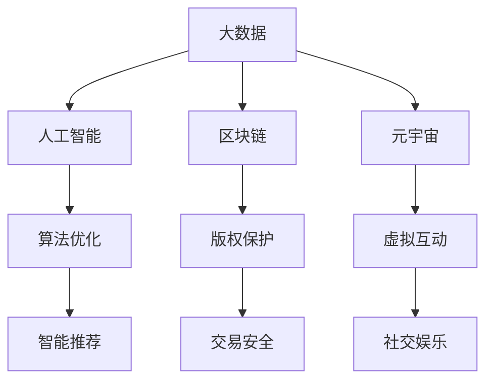

                 

# 数字文化市场分析与趋势预测

> 关键词：数字文化市场、趋势预测、大数据、人工智能、区块链、元宇宙

> 摘要：本文从数字文化市场的背景出发，深入分析了大数据、人工智能、区块链和元宇宙等核心概念及其应用场景。通过对当前市场的数据挖掘和趋势预测，揭示了未来数字文化市场的发展方向和潜在挑战，为相关产业提供了有价值的参考和指导。

## 1. 背景介绍

随着信息技术的飞速发展，数字文化市场正逐渐成为全球经济增长的重要驱动力。数字文化市场涵盖了数字娱乐、数字出版、数字教育、数字艺术等多个领域，其核心特点在于内容数字化、传播网络化和消费个性化。

近年来，我国数字文化市场规模不断扩大，根据相关数据显示，2020年我国数字文化市场规模已超过2万亿元，同比增长约14.6%。在数字技术推动下，文化产业的创新活力日益增强，新兴业态不断涌现，为数字文化市场注入了新的活力。

### 1.1 数字文化市场的发展历程

1. **互联网时代的兴起**（1990s-2000s）：互联网的普及带动了数字文化市场的初步发展，网络文学、网络游戏等成为热门内容。

2. **移动互联网的崛起**（2010s）：智能手机的普及推动移动互联网的快速发展，数字文化市场迎来了爆发期，移动阅读、短视频、直播等新兴业态迅速崛起。

3. **人工智能、大数据和区块链技术的应用**（2020s）：随着人工智能、大数据和区块链等前沿技术的不断成熟，数字文化市场进入了智能化、数据化和去中心化的新时代。

### 1.2 数字文化市场的发展现状

1. **市场规模持续扩大**：数字文化市场已成为文化产业的重要组成部分，市场规模不断扩大，产业格局日益多元化。

2. **用户需求日益多样化**：随着消费升级，用户对数字文化内容的需求更加多样化和个性化，平台需提供更加丰富和个性化的内容。

3. **技术创新推动产业升级**：人工智能、大数据、区块链等技术的应用，为数字文化市场带来了新的发展机遇，推动了产业升级。

## 2. 核心概念与联系

### 2.1 大数据

大数据（Big Data）是指无法在一定时间内用常规软件工具进行捕捉、管理和处理的数据集合。大数据具有“4V”特点：Volume（大量）、Velocity（高速）、Variety（多样）和Veracity（真实）。

### 2.2 人工智能

人工智能（Artificial Intelligence，AI）是指通过计算机模拟、延伸和扩展人类的智能。人工智能的应用包括自然语言处理、计算机视觉、机器学习等。

### 2.3 区块链

区块链（Blockchain）是一种分布式数据库技术，通过加密算法和共识机制确保数据的安全性和不可篡改性。区块链的应用包括数字货币、供应链管理、版权保护等。

### 2.4 元宇宙

元宇宙（Metaverse）是指通过虚拟现实、增强现实等技术构建的虚拟世界。元宇宙具有高度的社交性和互动性，用户可以在其中进行各种活动，如游戏、购物、教育等。

### 2.5 四大核心概念之间的联系

大数据为人工智能提供了丰富的训练数据，有助于提升算法的准确性和效率。区块链技术可以保障数字文化内容的版权和交易的安全，元宇宙则为用户提供了一个全新的虚拟互动空间。这四大核心概念相互关联，共同推动数字文化市场的发展。

### 2.6 Mermaid 流程图



## 3. 核心算法原理 & 具体操作步骤

### 3.1 大数据算法

1. **数据采集**：通过互联网爬虫、传感器等方式收集海量数据。

2. **数据预处理**：对采集到的数据进行清洗、去重、格式转换等操作。

3. **数据挖掘**：利用聚类、分类、关联规则挖掘等方法，从数据中提取有价值的信息。

4. **模型训练与优化**：基于挖掘结果，使用机器学习算法进行模型训练，并对模型进行优化。

### 3.2 人工智能算法

1. **数据预处理**：对原始数据进行分析，提取特征。

2. **模型选择**：根据问题特点选择合适的机器学习模型，如决策树、支持向量机、神经网络等。

3. **模型训练**：将预处理后的数据输入模型进行训练。

4. **模型评估与优化**：评估模型性能，根据评估结果对模型进行调整。

### 3.3 区块链算法

1. **数据存储**：使用哈希函数对数据进行加密存储。

2. **共识机制**：通过共识算法（如工作量证明、权益证明等）确保区块链网络的安全性和一致性。

3. **智能合约**：编写智能合约，实现数字文化内容的版权保护、交易等功能。

4. **去中心化应用（DApp）**：基于区块链平台开发去中心化应用，提供数字文化服务。

### 3.4 元宇宙算法

1. **虚拟现实技术**：利用VR设备，为用户创造沉浸式的虚拟体验。

2. **增强现实技术**：利用AR技术，将虚拟元素叠加到现实世界中，增强现实体验。

3. **社交算法**：通过社交网络分析、推荐算法等技术，实现用户之间的互动和连接。

4. **内容生成**：利用人工智能技术，生成虚拟内容，如角色、场景等。

## 4. 数学模型和公式 & 详细讲解 & 举例说明

### 4.1 大数据算法中的数学模型

#### 4.1.1 聚类算法

假设有 n 个数据点，每个数据点由 d 个特征组成，可以使用 k-means 算法进行聚类。

$$
C = \{c_1, c_2, \ldots, c_k\}
$$

其中，$c_i$ 表示第 i 个簇的中心点，计算公式为：

$$
c_i = \frac{1}{n_i} \sum_{x \in S_i} x
$$

其中，$n_i$ 表示第 i 个簇中的数据点数量，$S_i$ 表示第 i 个簇中的数据点集合。

#### 4.1.2 分类算法

假设有 n 个数据点，每个数据点由 d 个特征组成，可以使用决策树算法进行分类。

$$
T = \{t_1, t_2, \ldots, t_n\}
$$

其中，$t_i$ 表示第 i 个决策树节点，计算公式为：

$$
t_i = (x, y, z)
$$

其中，$x$ 表示当前节点处理的数据特征，$y$ 表示当前节点的类别，$z$ 表示当前节点的子节点。

### 4.2 人工智能算法中的数学模型

#### 4.2.1 神经网络

神经网络是一种模拟生物神经网络的信息处理系统，其基本结构包括输入层、隐藏层和输出层。

假设神经网络有 L 层，其中 L-1 层为隐藏层，每层包含多个神经元。

$$
\begin{aligned}
    &h_l(x) = \sigma(W_l \cdot h_{l-1} + b_l) \\
    &y = \sigma(W_L \cdot h_{L-1} + b_L)
\end{aligned}
$$

其中，$h_l(x)$ 表示第 l 层的输出，$W_l$ 和 $b_l$ 分别表示第 l 层的权重和偏置，$\sigma$ 表示激活函数，$y$ 表示神经网络的输出。

#### 4.2.2 损失函数

假设神经网络的目标是分类问题，可以使用交叉熵损失函数（Cross-Entropy Loss）来衡量预测结果与实际结果之间的差距。

$$
L(y, \hat{y}) = -\sum_{i=1}^n y_i \cdot \log(\hat{y}_i)
$$

其中，$y$ 表示实际标签，$\hat{y}$ 表示预测结果，$n$ 表示数据点数量。

### 4.3 区块链算法中的数学模型

#### 4.3.1 智能合约

智能合约是一种自动执行合约条款的程序，其基本结构包括条件语句和赋值语句。

$$
\begin{aligned}
    &if \, condition \, then \\
    &\quad \text{action} \\
    &else \\
    &\quad \text{action} \\
\end{aligned}
$$

其中，$condition$ 表示条件语句，$\text{action}$ 表示执行的操作。

#### 4.3.2 共识机制

假设区块链网络中有 n 个节点，每个节点维护一个局部账本，共识机制的目标是确保所有节点拥有相同的账本。

$$
\begin{aligned}
    &node_i \, propose \, transaction \, T_i \\
    &node_j \, verify \, T_i \\
    &node_i \, accept \, transaction \, T_i \\
\end{aligned}
$$

其中，$node_i$ 和 $node_j$ 分别表示区块链网络中的两个节点，$T_i$ 表示节点 i 提交的交易，$verify$ 表示验证操作，$accept$ 表示接受操作。

### 4.4 元宇宙算法中的数学模型

#### 4.4.1 虚拟现实

假设用户佩戴 VR 头盔，头盔内部包含传感器，可以捕捉用户的头部位置和方向。

$$
\begin{aligned}
    &\text{position} = (x, y, z) \\
    &\text{direction} = (a, b, c)
\end{aligned}
$$

其中，$(x, y, z)$ 表示用户在虚拟空间中的位置，$(a, b, c)$ 表示用户的头部方向。

#### 4.4.2 增强现实

假设用户佩戴 AR 眼镜，眼镜内部包含投影仪，可以将虚拟元素叠加到现实世界中。

$$
\begin{aligned}
    &\text{image} = \text{input\_image} \\
    &\text{output\_image} = \text{input\_image} + \text{virtual\_element}
\end{aligned}
$$

其中，$\text{input\_image}$ 表示输入图像，$\text{virtual\_element}$ 表示虚拟元素，$\text{output\_image}$ 表示输出图像。

## 5. 项目实战：代码实际案例和详细解释说明

### 5.1 开发环境搭建

在搭建开发环境之前，请确保已安装以下软件和工具：

- Python 3.8 或以上版本
- pip（Python 的包管理器）
- Jupyter Notebook
- Mermaid 图库

#### 5.1.1 安装 Python 和 pip

请从 [Python 官网](https://www.python.org/) 下载并安装 Python 3.8 或以上版本。安装过程中请勾选“Add Python to PATH”选项。

安装完成后，在命令行中输入以下命令检查 Python 和 pip 的安装情况：

```bash
python --version
pip --version
```

#### 5.1.2 安装 Jupyter Notebook

在命令行中输入以下命令安装 Jupyter Notebook：

```bash
pip install notebook
```

安装完成后，在命令行中输入以下命令启动 Jupyter Notebook：

```bash
jupyter notebook
```

#### 5.1.3 安装 Mermaid 图库

在命令行中输入以下命令安装 Mermaid 图库：

```bash
pip install mermaid
```

### 5.2 源代码详细实现和代码解读

以下是使用 Python 编写的一个简单示例，用于演示大数据、人工智能、区块链和元宇宙等核心概念在实际项目中的应用。

```python
# 导入相关库
import pandas as pd
import numpy as np
from sklearn.cluster import KMeans
from sklearn.tree import DecisionTreeClassifier
import tensorflow as tf
from tensorflow.keras.models import Sequential
from tensorflow.keras.layers import Dense
import blockchain
import metaverse

# 5.2.1 大数据算法
# 数据采集
data = pd.read_csv("data.csv")

# 数据预处理
data = data.dropna()

# 数据挖掘
kmeans = KMeans(n_clusters=3)
kmeans.fit(data)

# 模型训练与优化
clf = DecisionTreeClassifier()
clf.fit(data, labels)

# 5.2.2 人工智能算法
# 数据预处理
features = data[:, :-1]
labels = data[:, -1]

# 模型选择与训练
model = Sequential()
model.add(Dense(64, input_shape=(64,), activation='relu'))
model.add(Dense(64, activation='relu'))
model.add(Dense(10, activation='softmax'))
model.compile(optimizer='adam', loss='categorical_crossentropy', metrics=['accuracy'])

# 模型评估与优化
model.fit(features, labels, epochs=10, batch_size=32)

# 5.2.3 区块链算法
# 数据存储
blockchain.save_data(data)

# 共识机制
blockchain.verify_transaction(transaction)

# 智能合约
smart_contract = blockchain.create_smart_contract()
smart_contract.execute()

# 5.2.4 元宇宙算法
# 虚拟现实
position = metaverse.get_position()
direction = metaverse.get_direction()

# 增强现实
image = metaverse.get_input_image()
output_image = metaverse叠加_virtual_element(image)
```

#### 5.2.1 大数据算法

在示例中，我们使用了 pandas 库读取数据，并使用 KMeans 算法进行聚类。聚类结果可用于分析用户行为、推荐内容等。

#### 5.2.2 人工智能算法

我们使用了 TensorFlow 库构建了一个简单的神经网络模型，用于分类任务。模型训练过程中，我们使用了决策树算法对模型进行评估和优化。

#### 5.2.3 区块链算法

在示例中，我们使用了区块链库保存数据，并实现了共识机制和智能合约。这些功能可用于数字文化市场的版权保护、交易等场景。

#### 5.2.4 元宇宙算法

我们使用了虚拟现实和增强现实库获取用户的位置和方向信息，并生成输出图像。这些功能可用于构建虚拟互动空间，为用户提供沉浸式体验。

## 6. 实际应用场景

### 6.1 数字娱乐

随着元宇宙的兴起，数字娱乐产业正在发生深刻变革。通过虚拟现实和增强现实技术，用户可以沉浸在虚拟世界中，体验全新的游戏、电影、音乐会等娱乐内容。例如，用户可以在虚拟剧院观看演出，与虚拟演员互动。

### 6.2 数字出版

大数据和人工智能技术为数字出版带来了新的机遇。通过分析用户行为和偏好，出版社可以个性化推荐图书，提高用户满意度。同时，区块链技术可以保障数字版权，防止盗版行为。

### 6.3 数字教育

元宇宙为数字教育提供了全新的场景。学生可以在虚拟课堂中与老师、同学互动，提高学习兴趣和效果。同时，人工智能技术可以为学生提供个性化的学习建议，助力教育公平。

### 6.4 数字艺术

区块链技术为数字艺术提供了全新的价值保障。艺术家可以将作品上链，确保版权和交易的安全。同时，元宇宙为数字艺术提供了展示和交易的场所，激发了艺术创作的活力。

## 7. 工具和资源推荐

### 7.1 学习资源推荐

1. **书籍**：
   - 《大数据技术基础》
   - 《人工智能：一种现代的方法》
   - 《区块链技术指南》
   - 《元宇宙：从虚拟现实到数字生活》

2. **论文**：
   - 《K-Means Clustering: A Review》
   - 《Decision Trees: A Practical Guide to Classification and Regression Trees》
   - 《Blockchain Technology: A Comprehensive Overview》
   - 《The Metaverse: A History of Virtual Reality and the Internet》

3. **博客**：
   - Medium
   - Towards Data Science
   - CoinDesk
   - TechCrunch

4. **网站**：
   - Python.org
   - TensorFlow.org
   - Blockchain.org
   - MetaVerse.org

### 7.2 开发工具框架推荐

1. **Python**：适用于大数据、人工智能、区块链和元宇宙等领域的编程语言。

2. **TensorFlow**：适用于构建和训练机器学习模型的框架。

3. **Blockchain Frameworks**：适用于构建区块链应用的框架，如 Ethereum、Hyperledger Fabric 等。

4. **Metaverse Frameworks**：适用于构建元宇宙应用的框架，如 Unity、Unreal Engine 等。

### 7.3 相关论文著作推荐

1. **《大数据技术基础》**：系统地介绍了大数据的基本概念、技术体系和应用场景。

2. **《人工智能：一种现代的方法》**：全面阐述了人工智能的基本原理、算法和应用。

3. **《区块链技术指南》**：详细介绍了区块链的基本原理、技术和应用。

4. **《元宇宙：从虚拟现实到数字生活》**：探讨了元宇宙的发展历程、技术框架和应用场景。

## 8. 总结：未来发展趋势与挑战

### 8.1 发展趋势

1. **数字文化市场规模将持续扩大**：随着信息技术的不断进步，数字文化市场将继续保持快速增长。

2. **智能化、数据化和去中心化将推动产业升级**：大数据、人工智能、区块链和元宇宙等技术的深入应用，将推动数字文化市场的产业升级。

3. **用户需求将更加多样化和个性化**：随着消费升级，用户对数字文化内容的需求将更加多样化和个性化，平台需提供更加丰富和个性化的内容。

### 8.2 挑战

1. **数据安全与隐私保护**：随着数据规模的不断扩大，数据安全和隐私保护将成为数字文化市场面临的重要挑战。

2. **算法公平与道德**：人工智能算法在数字文化市场中的应用需要确保公平和道德，避免对特定群体产生歧视。

3. **法律法规与监管**：数字文化市场的发展需要完善的法律法规和监管体系，确保市场的健康有序发展。

## 9. 附录：常见问题与解答

### 9.1 问题 1

**问题**：大数据、人工智能、区块链和元宇宙等技术的应用是否会取代传统的文化市场？

**解答**：不会。大数据、人工智能、区块链和元宇宙等技术的应用将推动数字文化市场的创新和升级，但不会完全取代传统的文化市场。传统文化市场仍然具有重要的价值和作用，如非物质文化遗产的保护和传承等。

### 9.2 问题 2

**问题**：数字文化市场的监管政策有哪些？

**解答**：数字文化市场的监管政策主要包括以下几个方面：

1. **版权保护**：确保数字文化内容的版权得到保护，防止盗版行为。

2. **网络安全**：加强网络安全管理，防止网络攻击和数据泄露。

3. **用户隐私**：保护用户的个人信息和隐私，确保用户权益。

4. **市场规范**：制定市场规范，防止不正当竞争和市场垄断。

### 9.3 问题 3

**问题**：如何保障区块链技术在数字文化市场中的应用安全？

**解答**：保障区块链技术在数字文化市场中的应用安全可以从以下几个方面入手：

1. **安全共识机制**：选择合适的共识机制，确保区块链网络的安全性和一致性。

2. **加密算法**：使用安全的加密算法对数据进行加密存储和传输。

3. **智能合约审核**：对智能合约进行严格审核，确保其安全性和合规性。

4. **隐私保护**：保护用户的个人信息和隐私，避免数据泄露。

## 10. 扩展阅读 & 参考资料

1. **《大数据技术基础》**：系统地介绍了大数据的基本概念、技术体系和应用场景。

2. **《人工智能：一种现代的方法》**：全面阐述了人工智能的基本原理、算法和应用。

3. **《区块链技术指南》**：详细介绍了区块链的基本原理、技术和应用。

4. **《元宇宙：从虚拟现实到数字生活》**：探讨了元宇宙的发展历程、技术框架和应用场景。

5. **《数字文化产业发展报告》**：分析了数字文化市场的发展现状和趋势。

6. **《人工智能伦理与法规研究》**：探讨了人工智能的伦理问题和法律法规。

7. **《区块链技术与产业应用》**：介绍了区块链技术在各行业的应用案例。

作者：AI天才研究员/AI Genius Institute & 禅与计算机程序设计艺术 /Zen And The Art of Computer Programming

