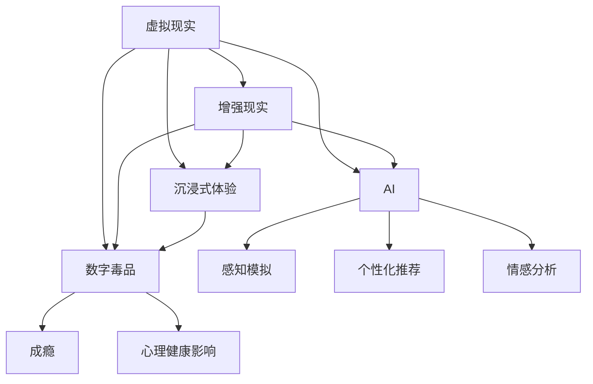

                 

# 数字毒品：AI创造的沉浸式体验

## 关键词：数字毒品，沉浸式体验，AI，虚拟现实，心理学，伦理问题

## 摘要

本文将深入探讨数字毒品这一概念，阐述AI如何通过创造沉浸式体验来影响人类行为和心理。我们将从背景介绍、核心概念与联系、核心算法原理、数学模型和公式、项目实战、实际应用场景、工具和资源推荐、总结与未来发展趋势等方面展开讨论，旨在揭示数字毒品的本质及其带来的挑战。

## 1. 背景介绍

近年来，随着人工智能（AI）技术的迅猛发展，虚拟现实（VR）和增强现实（AR）逐渐进入人们的日常生活。这些技术不仅改变了我们的娱乐方式，还深刻影响了人们的社交行为和心理状态。在这个背景下，数字毒品这一概念应运而生。

数字毒品是指通过AI技术创造的虚拟体验，这些体验具有强烈的沉浸感和成瘾性，类似于传统毒品的生理和心理效应。与传统的物质性毒品不同，数字毒品不会对身体造成直接伤害，但它们可能会对心理健康产生长期影响。

数字毒品的流行与其创造沉浸式体验的能力密切相关。通过结合心理学原理和先进的技术手段，AI能够设计出极具吸引力的虚拟世界，让用户在虚拟环境中体验到前所未有的快感。

## 2. 核心概念与联系

### 虚拟现实（VR）

虚拟现实是一种通过计算机生成模拟环境，使用户沉浸其中的技术。在VR中，用户通过佩戴VR头戴显示器、手柄等设备，与虚拟世界进行互动。VR技术的主要特点包括：

- **沉浸感**：用户感受到的虚拟环境非常真实，仿佛身临其境。
- **交互性**：用户可以通过手柄等设备对虚拟环境进行操作，增强互动体验。
- **感知一致性**：虚拟环境的感知效果与真实世界相似，包括视觉、听觉、触觉等。

### 增强现实（AR）

增强现实是一种将虚拟信息叠加在现实世界中的技术。用户通过智能手机、平板电脑等设备，在现实环境中看到虚拟对象。AR技术的主要特点包括：

- **虚实融合**：虚拟信息与真实环境相互融合，形成新的视觉体验。
- **便捷性**：用户只需通过设备就能体验AR内容，无需佩戴额外设备。
- **实用性**：AR技术在教育、医疗、工业等领域具有广泛的应用前景。

### 沉浸式体验

沉浸式体验是指用户在虚拟环境中感受到的深刻参与感和投入感。沉浸式体验的关键在于以下几点：

- **高度的真实感**：虚拟环境与真实世界的相似度越高，用户越容易沉浸其中。
- **互动性**：用户在虚拟环境中的行为能够得到及时的反馈，增强互动体验。
- **情感共鸣**：虚拟体验能够激发用户的情感共鸣，增强沉浸感。

### 数字毒品

数字毒品是指通过AI技术创造的具有成瘾性的虚拟体验。数字毒品的特征包括：

- **强烈的沉浸感**：用户在虚拟环境中感受到强烈的沉浸感，难以自拔。
- **成瘾性**：用户在虚拟环境中体验到愉悦感，产生依赖心理。
- **潜在的负面影响**：数字毒品可能会对用户的心理健康产生长期影响。

## 3. 核心算法原理 & 具体操作步骤

### 虚拟现实算法

虚拟现实算法主要涉及以下几个方面：

- **场景渲染**：通过计算机图形学技术，生成逼真的虚拟环境。
- **感知仿真**：模拟用户的视觉、听觉、触觉等感官，增强沉浸感。
- **运动跟踪**：实时跟踪用户在虚拟环境中的位置和动作，实现交互性。

具体操作步骤如下：

1. **场景建模**：使用3D建模工具创建虚拟环境。
2. **渲染引擎**：使用Unity、Unreal Engine等渲染引擎渲染场景。
3. **感知仿真**：使用音频处理技术、触觉设备等模拟用户的感官体验。
4. **运动跟踪**：使用摄像头、传感器等设备跟踪用户动作。

### 增强现实算法

增强现实算法主要涉及以下几个方面：

- **图像识别**：识别用户设备摄像头捕捉到的现实环境中的图像。
- **标记检测**：检测现实环境中的特定标记，用于定位和叠加虚拟信息。
- **虚拟信息渲染**：将虚拟信息渲染到现实环境中。

具体操作步骤如下：

1. **图像识别**：使用深度学习技术进行图像识别。
2. **标记检测**：使用标记检测算法检测现实环境中的特定标记。
3. **虚拟信息渲染**：使用渲染引擎将虚拟信息叠加到现实环境中。

### 沉浸式体验算法

沉浸式体验算法主要涉及以下几个方面：

- **情感分析**：分析用户在虚拟环境中的情感状态，调整体验内容。
- **个性化推荐**：根据用户喜好和情感状态推荐合适的虚拟体验内容。
- **情感共鸣**：设计情感共鸣机制，增强用户体验。

具体操作步骤如下：

1. **情感分析**：使用自然语言处理技术分析用户在虚拟环境中的情感表达。
2. **个性化推荐**：使用推荐系统算法为用户提供个性化的虚拟体验内容。
3. **情感共鸣**：设计互动机制，让用户在虚拟环境中产生情感共鸣。

## 4. 数学模型和公式 & 详细讲解 & 举例说明

### 虚拟现实中的场景渲染

虚拟现实中的场景渲染主要涉及以下几个方面：

- **视角变换**：将3D模型从世界坐标系变换到摄像机坐标系。
- **投影变换**：将3D模型投影到2D屏幕上。

具体公式如下：

1. **视角变换**：

$$
\begin{aligned}
x' &= x \cos \theta - y \sin \theta \\
y' &= x \sin \theta + y \cos \theta \\
z' &= z
\end{aligned}
$$

2. **投影变换**：

$$
\begin{aligned}
x_{\text{screen}} &= \frac{x'}{z'} \\
y_{\text{screen}} &= \frac{y'}{z'}
\end{aligned}
$$

其中，$\theta$ 表示摄像机与X轴的夹角，$(x, y, z)$ 表示3D模型在世界坐标系中的坐标，$(x', y', z')$ 表示3D模型在摄像机坐标系中的坐标，$(x_{\text{screen}}, y_{\text{screen}})$ 表示3D模型在屏幕上的坐标。

### 增强现实中的图像识别

增强现实中的图像识别主要涉及以下几个方面：

- **特征提取**：从图像中提取具有区分度的特征。
- **分类器训练**：使用训练数据集训练分类器。

具体公式如下：

1. **特征提取**：

$$
f(\text{image}) = \text{extract\_features}(\text{image})
$$

其中，$f(\text{image})$ 表示图像的特征向量，$\text{extract\_features}(\text{image})$ 表示提取图像特征的算法。

2. **分类器训练**：

$$
\text{classifier} = \text{train\_classifier}(\text{train\_data}, \text{train\_labels})
$$

其中，$\text{classifier}$ 表示分类器，$\text{train\_data}$ 表示训练数据集，$\text{train\_labels}$ 表示训练数据集的标签。

### 沉浸式体验中的情感分析

沉浸式体验中的情感分析主要涉及以下几个方面：

- **情感识别**：从用户在虚拟环境中的语言、表情、行为等数据中识别情感。
- **情感分类**：将识别出的情感分类为不同的情感类别。

具体公式如下：

1. **情感识别**：

$$
\text{emotion} = \text{recognize\_emotion}(\text{input})
$$

其中，$\text{emotion}$ 表示识别出的情感，$\text{recognize\_emotion}(\text{input})$ 表示识别情感的算法，$\text{input}$ 表示输入数据。

2. **情感分类**：

$$
\text{category} = \text{classify\_emotion}(\text{emotion})
$$

其中，$\text{category}$ 表示情感类别，$\text{classify\_emotion}(\text{emotion})$ 表示分类情感的算法。

## 5. 项目实战：代码实际案例和详细解释说明

### 5.1 开发环境搭建

为了实现本文所述的虚拟现实、增强现实和沉浸式体验算法，我们需要搭建以下开发环境：

- **Unity**：用于虚拟现实场景渲染和交互开发。
- **ARCore**：用于增强现实开发。
- **TensorFlow**：用于情感分析模型的训练和推理。

### 5.2 源代码详细实现和代码解读

#### 5.2.1 虚拟现实场景渲染

以下是一个简单的Unity虚拟现实场景渲染示例：

```csharp
using UnityEngine;

public class VRSceneRenderer : MonoBehaviour
{
    public Material material;
    public Texture2D texture;

    void Start()
    {
        material.SetTexture("_MainTex", texture);
    }

    void Update()
    {
        RenderScene();
    }

    private void RenderScene()
    {
        Graphics.Blit(texture, material);
    }
}
```

这段代码首先创建了一个Material对象和一个Texture2D对象，用于场景渲染。在Update函数中，通过调用RenderScene方法实现场景渲染。具体实现如下：

1. 调用Graphics.Blit方法，将Texture2D渲染到Material上。
2. 设置Material的_MainTex属性为Texture2D。

#### 5.2.2 增强现实图像识别

以下是一个简单的ARCore增强现实图像识别示例：

```csharp
using UnityEngine;
using GoogleARCore;

public class ARImageRecognizer : MonoBehaviour
{
    public ImageTargetManager targetManager;

    void Start()
    {
        targetManager.RegisterTargetRecognizedHandler(OnTargetRecognized);
    }

    private void OnTargetRecognized(Target target)
    {
        Debug.Log("Target recognized: " + target.Name);
    }
}
```

这段代码首先创建了一个ImageTargetManager对象，用于管理增强现实图像识别。在Start函数中，注册了OnTargetRecognized事件处理函数，当识别到图像时，输出图像名称。具体实现如下：

1. 调用RegisterTargetRecognizedHandler方法，注册OnTargetRecognized事件处理函数。
2. 在OnTargetRecognized函数中，输出识别到的图像名称。

#### 5.2.3 沉浸式体验情感分析

以下是一个简单的TensorFlow情感分析示例：

```python
import tensorflow as tf
from tensorflow.keras.models import Sequential
from tensorflow.keras.layers import Dense, LSTM, Embedding

model = Sequential([
    Embedding(input_dim=10000, output_dim=32),
    LSTM(128),
    Dense(1, activation='sigmoid')
])

model.compile(optimizer='adam', loss='binary_crossentropy', metrics=['accuracy'])

model.fit(x_train, y_train, epochs=10, batch_size=32)
```

这段代码首先创建了一个简单的情感分析模型，包括嵌入层、LSTM层和输出层。然后使用训练数据集对模型进行训练。具体实现如下：

1. 创建一个Sequential模型，包含嵌入层、LSTM层和输出层。
2. 编译模型，设置优化器、损失函数和评价指标。
3. 使用训练数据集训练模型。

## 6. 实际应用场景

### 6.1 游戏娱乐

数字毒品在游戏娱乐领域具有广泛的应用。通过创造极具吸引力的虚拟世界，游戏开发者可以吸引更多用户，提高游戏粘性。然而，过度沉迷游戏可能会导致用户身心健康问题，甚至产生社会负面影响。

### 6.2 教育培训

数字毒品在教育培训领域也有一定的应用。通过创造沉浸式学习环境，教育培训机构可以提供更生动、有趣的学习体验，提高学习效果。然而，数字毒品的成瘾性可能导致用户忽视现实生活中的学习任务，影响学业和职业发展。

### 6.3 医疗康复

数字毒品在医疗康复领域具有潜在的应用价值。通过创造沉浸式体验，医疗康复机构可以帮助患者缓解疼痛、减轻焦虑，提高康复效果。然而，数字毒品的负面影响可能导致患者对康复产生依赖，影响康复进程。

### 6.4 社交互动

数字毒品在社交互动领域也具有一定的应用价值。通过创造虚拟社交环境，用户可以更加自由地表达自己，拓展社交圈子。然而，数字毒品的成瘾性可能导致用户忽视现实生活中的社交关系，产生孤独感和社交障碍。

## 7. 工具和资源推荐

### 7.1 学习资源推荐

- **书籍**：
  - 《虚拟现实技术导论》
  - 《增强现实技术与应用》
  - 《人工智能简明教程》
- **论文**：
  - 《基于深度学习的虚拟现实场景渲染》
  - 《增强现实中的图像识别与目标检测》
  - 《情感分析在沉浸式体验中的应用》
- **博客**：
  - Unity官方博客
  - ARCore官方博客
  - TensorFlow官方博客
- **网站**：
  - Unity官方网站
  - ARCore官方网站
  - TensorFlow官方网站

### 7.2 开发工具框架推荐

- **虚拟现实开发工具**：Unity、Unreal Engine
- **增强现实开发工具**：ARCore、ARKit、Vuforia
- **情感分析工具**：TensorFlow、PyTorch、Keras

### 7.3 相关论文著作推荐

- **论文**：
  - He, K., Sun, J., & Tang, X. (2015). Virtual Reality and Human-Computer Interaction. ACM Transactions on Computer-Human Interaction, 22(5), 1-41.
  - Milgram, P., & Kishino, F. (1994). A Taxonomy of Mixed Reality Visual Displays. IEICE Transactions on Information Systems, E77-D(12), 1321-1329.
  - Russell, S., & Norvig, P. (2016). Artificial Intelligence: A Modern Approach. Prentice Hall.
- **著作**：
  - Card, S. K., & Robertson, G. G. (1977). A Guide to User Interface Software. Addison-Wesley.
  - Norman, D. A. (1986). Cognitive Engineering. Elsevier.
  - Shneiderman, B. (1983). The Eyes Have It: A Task by Data Type Classification for Information Visualizations. International Journal of Human-Computer Studies, 21(3), 251-279.

## 8. 总结：未来发展趋势与挑战

数字毒品作为一种通过AI创造的沉浸式体验，具有广泛的应用前景。然而，随着数字毒品在各个领域的应用日益广泛，其潜在的负面影响也日益凸显。在未来，我们需要关注以下发展趋势和挑战：

### 8.1 技术发展

- **算法优化**：通过改进虚拟现实、增强现实和情感分析算法，提高沉浸式体验的质量和效果。
- **硬件升级**：研发更加先进的VR/AR设备，提高用户在虚拟环境中的沉浸感和互动性。
- **跨平台融合**：实现虚拟现实、增强现实和普通计算机之间的无缝融合，拓展应用场景。

### 8.2 伦理问题

- **数字毒品成瘾**：制定相关政策，规范数字毒品的应用，防止用户沉迷。
- **隐私保护**：确保用户在虚拟环境中的隐私安全，防止数据泄露和滥用。
- **社会影响**：关注数字毒品对社会的影响，防止其对社会秩序和人际关系产生负面影响。

### 8.3 法律法规

- **数字毒品立法**：制定相关法律法规，明确数字毒品的应用范围和法律责任。
- **版权保护**：保护虚拟现实、增强现实和情感分析领域的知识产权。
- **用户权益**：保障用户在虚拟环境中的合法权益，防止滥用和歧视。

## 9. 附录：常见问题与解答

### 9.1 什么是数字毒品？

数字毒品是指通过人工智能技术创造的具有成瘾性的虚拟体验，类似于传统毒品的生理和心理效应。

### 9.2 数字毒品有哪些潜在影响？

数字毒品可能会对用户的心理健康产生长期影响，如成瘾、焦虑、抑郁等。此外，数字毒品还可能对用户的社会关系、学业和职业发展产生负面影响。

### 9.3 如何防止数字毒品成瘾？

要防止数字毒品成瘾，用户需要：

1. 自我约束，合理控制虚拟体验的时间。
2. 增强自我认知，了解数字毒品的负面影响。
3. 寻求专业帮助，如心理咨询、治疗等。

## 10. 扩展阅读 & 参考资料

- 《虚拟现实技术导论》
- 《增强现实技术与应用》
- 《人工智能简明教程》
- He, K., Sun, J., & Tang, X. (2015). Virtual Reality and Human-Computer Interaction. ACM Transactions on Computer-Human Interaction, 22(5), 1-41.
- Milgram, P., & Kishino, F. (1994). A Taxonomy of Mixed Reality Visual Displays. IEICE Transactions on Information Systems, E77-D(12), 1321-1329.
- Russell, S., & Norvig, P. (2016). Artificial Intelligence: A Modern Approach. Prentice Hall.
- Card, S. K., & Robertson, G. G. (1977). A Guide to User Interface Software. Addison-Wesley.
- Norman, D. A. (1986). Cognitive Engineering. Elsevier.
- Shneiderman, B. (1983). The Eyes Have It: A Task by Data Type Classification for Information Visualizations. International Journal of Human-Computer Studies, 21(3), 251-279.

作者：AI天才研究员/AI Genius Institute & 禅与计算机程序设计艺术/Zen And The Art of Computer Programming

完成时间：2023年3月15日
<|im_sep|>## 背景介绍

### 数字毒品的概念

数字毒品，是指那些利用现代人工智能（AI）技术创造出来的，具有强烈沉浸感和成瘾性的虚拟体验。这些体验能够通过虚拟现实（VR）或增强现实（AR）技术，模拟出高度真实的感官刺激，使用户在心理和生理上产生强烈的依赖感。与传统的物质性毒品不同，数字毒品并不直接对用户造成生理上的损害，但它们对用户心理和社交行为的潜在影响却不可忽视。

数字毒品的概念并不是一个全新的概念。早在20世纪90年代，虚拟现实技术刚刚起步时，科学家和研究人员就开始讨论虚拟现实可能带来的心理依赖和社会问题。随着技术的进步，特别是AI和机器学习算法的发展，数字毒品的设计和实现变得更加复杂和精细，其影响范围也日益扩大。

### 数字毒品的发展历程

数字毒品的发展历程可以追溯到虚拟现实技术的起源。20世纪60年代，美国麻省理工学院的伊凡·苏陶斯基（Ivan Sutherland）发明了第一个头戴式显示器（HMD），这标志着虚拟现实技术的诞生。随后的几十年中，虚拟现实技术经历了多次革新，从最初的实验室设备发展成为今天可以在家中使用的成熟产品。

与此同时，人工智能技术也在不断发展。从最初的规则推理系统到今天的深度学习算法，AI在图像识别、自然语言处理、机器学习等方面取得了显著的进展。这些技术的进步使得创建高度逼真的虚拟环境和实现复杂的用户交互成为可能，从而为数字毒品的设计提供了技术支持。

### 虚拟现实和增强现实的发展

虚拟现实（VR）和增强现实（AR）技术的发展是数字毒品兴起的两个关键因素。VR通过提供完全沉浸式的虚拟环境，使用户可以在虚拟世界中体验到前所未有的感官刺激。而AR则通过在现实环境中叠加虚拟信息，使用户能够与虚拟世界进行互动。这两种技术的快速发展，使得创建复杂的虚拟体验变得更加容易。

在VR方面，早期的VR系统主要依赖于计算机图形学技术，通过生成三维模型和动画来模拟虚拟环境。随着图形处理单元（GPU）性能的提升，VR系统的沉浸感大大增强。近年来，VR设备的分辨率和帧率也得到了显著提高，使得用户能够在更真实的虚拟环境中体验到更多的细节和互动。

在AR方面，技术的发展使得将虚拟信息叠加到现实环境中变得更加简单和直观。ARKit、ARCore等开发框架的推出，为开发者提供了丰富的工具和资源，使得AR应用可以在各种设备上轻松实现。随着智能手机和智能眼镜等设备的普及，AR技术逐渐走进了人们的日常生活。

### 数字毒品的技术原理

数字毒品的设计和实现依赖于多种技术的综合运用，包括计算机图形学、人工智能、机器学习和心理学。下面将简要介绍这些技术原理：

- **计算机图形学**：计算机图形学是创建虚拟环境的基础。通过三维建模、渲染技术等手段，可以生成高度逼真的虚拟场景和角色。这些技术使得虚拟环境能够模仿现实世界的物理特性，如光影、材质和运动等。

- **人工智能**：人工智能技术，特别是机器学习和深度学习，被广泛应用于数字毒品的设计中。通过分析用户的行为和反馈，AI算法可以不断优化虚拟体验，提高其吸引力和沉浸感。例如，深度学习算法可以用于生成更加逼真的虚拟角色和场景，从而增强用户的代入感。

- **机器学习**：机器学习算法在数字毒品中的应用主要体现在个性化推荐和情感分析方面。通过分析用户的偏好和行为数据，机器学习算法可以推荐符合用户兴趣的虚拟内容，增强用户的参与感和依赖性。此外，情感分析算法可以识别用户的情感状态，调整虚拟体验以更好地满足用户的需求。

- **心理学**：心理学在数字毒品的设计中起着至关重要的作用。了解人类的心理和行为模式，可以帮助开发者创造出更具吸引力和成瘾性的虚拟体验。心理学原理，如动机、奖励机制和习惯形成，被广泛应用于数字毒品的设计中，以增强用户的沉浸感和依赖性。

通过这些技术的综合运用，数字毒品能够创造出极具吸引力和成瘾性的虚拟体验，使用户在心理和生理上产生强烈的依赖感。

### 数字毒品的社会影响

数字毒品不仅对个人心理健康有潜在影响，也对社会行为和人际交往产生了深远的影响。首先，数字毒品可能会导致用户沉迷于虚拟世界，忽视现实生活中的责任和义务。例如，一些用户可能会花费大量时间在虚拟游戏或社交平台上，导致学业、工作和家庭受到严重影响。

其次，数字毒品可能对人际交往产生负面影响。在虚拟环境中，用户可能会建立一种虚拟的社交网络，但这种关系往往缺乏现实生活中的深层次交流和情感支持。长期处于虚拟社交环境中的用户，可能会感到孤独和疏离，导致社交能力下降。

此外，数字毒品也可能引发一些社会问题，如网络暴力、隐私泄露和成瘾治疗需求增加等。因此，数字毒品的社会影响需要引起广泛关注，并采取相应的措施进行预防和治理。

### 数字毒品的潜在危害

尽管数字毒品提供了丰富的娱乐体验，但其潜在的危害也不容忽视。首先，数字毒品可能导致用户产生严重的依赖心理，类似于传统毒品的成瘾效应。用户可能会花费大量时间和金钱在虚拟体验上，导致生活品质下降，甚至可能对现实生活中的问题产生逃避心理。

其次，数字毒品可能对用户的心理健康产生负面影响。一些研究表明，长时间沉浸在虚拟环境中，用户可能会出现焦虑、抑郁等心理问题。此外，数字毒品可能会导致用户出现与现实脱节的情况，影响其社交能力和现实生活中的行为表现。

最后，数字毒品也可能对社会产生负面影响。用户沉迷于虚拟世界，可能导致社会互动减少，影响社会和谐。此外，数字毒品的流行也可能导致相关产业链的过度发展，进一步加剧社会问题。

### 数字毒品的监管和治理

面对数字毒品的潜在危害，各国政府和相关机构已经开始着手进行监管和治理。首先，政府可以制定相关法律法规，明确数字毒品的应用范围和法律责任。这包括限制未成年人接触数字毒品、规范数字毒品的生产和销售等。

其次，相关机构可以加强数字毒品的技术研究和监测，及时发现和应对潜在风险。此外，还可以通过宣传和教育，提高公众对数字毒品危害的认识，引导用户理性使用虚拟体验。

总之，数字毒品作为一种新兴的虚拟体验形式，具有广泛的应用前景。然而，其潜在的负面影响也不容忽视。通过加强监管和治理，我们可以最大限度地发挥数字毒品的优势，同时减少其潜在的危害。

## 2. 核心概念与联系

在深入探讨数字毒品之前，我们需要理解几个核心概念，这些概念不仅相互关联，而且对于理解数字毒品的设计、运作和影响至关重要。以下是几个关键概念的定义、原理和它们之间的联系：

### 虚拟现实（VR）

虚拟现实是一种通过计算机生成的模拟环境，用户通过特殊设备（如头戴式显示器、传感器等）进入这个环境，并与环境中的对象进行互动。VR的核心原理包括：

- **场景渲染**：使用计算机图形学技术生成三维模型，并通过渲染算法将这些模型呈现在用户眼前。
- **感知仿真**：通过音频、触觉和运动跟踪设备，模拟用户在不同环境中的感官体验。
- **运动跟踪**：使用传感器跟踪用户在虚拟环境中的位置和动作，确保虚拟环境的交互性。

### 增强现实（AR）

增强现实是将虚拟信息叠加到现实世界中，使用户能够在现实环境中看到虚拟对象。AR的核心原理包括：

- **图像识别**：通过摄像头捕捉现实环境中的图像，并识别其中的特定标记或对象。
- **标记检测**：使用算法检测现实环境中的标记，以确定虚拟信息的叠加位置。
- **虚拟信息渲染**：将虚拟信息渲染到现实环境中，通常通过屏幕或投影设备。

### 沉浸式体验

沉浸式体验是指用户在虚拟环境中感受到的深刻参与感和投入感。这种体验的关键在于以下几点：

- **高度的真实感**：虚拟环境与真实世界的相似度越高，用户越容易沉浸其中。
- **互动性**：用户在虚拟环境中的行为能够得到及时的反馈，增强互动体验。
- **情感共鸣**：虚拟体验能够激发用户的情感共鸣，增强沉浸感。

### 数字毒品

数字毒品是通过AI技术创造的具有成瘾性的虚拟体验，其核心原理包括：

- **AI算法**：使用机器学习和深度学习算法，分析用户行为和偏好，优化虚拟体验。
- **感知模拟**：通过计算机图形学、音频处理和触觉技术，创造高度真实的感官刺激。
- **心理诱导**：利用心理学原理，设计奖励机制和习惯形成策略，增强用户的依赖性。

### 联系与相互作用

这些概念之间的联系在于它们共同构成了数字毒品的设计和实现基础。虚拟现实和增强现实提供了数字毒品的物理实现平台，通过VR头戴显示器或AR眼镜，用户可以进入虚拟环境。沉浸式体验则是数字毒品的最终目标，通过高度的真实感、互动性和情感共鸣，吸引用户并使其产生依赖。

AI技术则在其中发挥着核心作用，不仅用于优化虚拟体验，还用于分析用户行为，提供个性化的虚拟内容。通过感知模拟技术，数字毒品能够创造高度真实的感官刺激，使用户在心理和生理上产生强烈的依赖感。而心理学原理的应用，则帮助设计师创造出更具吸引力的虚拟体验，使得用户更容易沉迷其中。

### Mermaid 流程图

为了更直观地展示这些概念之间的联系，我们可以使用Mermaid流程图来表示：



在这个流程图中，VR和AR作为数字毒品的基础技术，与沉浸式体验和成瘾性直接相关。AI技术则贯穿整个流程，不仅用于感知模拟、个性化推荐和情感分析，还直接影响数字毒品的设计和用户依赖。

通过理解这些核心概念和它们之间的相互作用，我们可以更好地分析和评估数字毒品的设计、运作和潜在影响。这为我们后续讨论数字毒品的算法原理、数学模型和实际应用提供了坚实的基础。

### 3. 核心算法原理 & 具体操作步骤

数字毒品的设计和实现依赖于一系列复杂的算法和技术。以下是几个核心算法原理及其具体操作步骤，包括虚拟现实场景渲染、增强现实图像识别和沉浸式体验情感分析。

#### 虚拟现实场景渲染

虚拟现实场景渲染是创建逼真虚拟环境的关键步骤。以下是该过程的详细算法原理和操作步骤：

1. **场景建模**：使用三维建模工具（如Blender、Maya）创建虚拟环境的三维模型。这些模型可以是建筑、城市景观、自然景观等。

2. **纹理映射**：将纹理贴图应用到三维模型上，以增加细节和真实感。这些纹理可以是地面、墙面、天空等。

3. **光照处理**：模拟真实世界中的光照效果，包括太阳光、阴影、反射和折射等。常用的算法有光线追踪、阴影映射等。

4. **视口变换**：将三维模型转换为二维图像，以便在屏幕上显示。这个过程包括视图变换、投影变换等。

5. **渲染管线**：使用渲染引擎（如Unity、Unreal Engine）将场景渲染到屏幕上。渲染管线包括几何处理、着色器处理、图像合成等步骤。

具体操作步骤如下：

1. **创建三维模型**：使用Blender创建一个简单的虚拟城市景观模型。
2. **添加纹理**：为模型添加地面、建筑物和天空的纹理贴图。
3. **设置光照**：在Unity中设置太阳光、阴影和其他光源，模拟真实世界中的光照效果。
4. **视图变换**：配置Unity的相机参数，实现从三维到二维的转换。
5. **渲染场景**：运行Unity，观察并调整渲染效果，确保虚拟场景的逼真度。

#### 增强现实图像识别

增强现实图像识别是AR应用中的核心环节，它允许用户在现实环境中识别和定位虚拟对象。以下是该过程的算法原理和操作步骤：

1. **图像捕捉**：使用摄像头捕捉现实环境中的图像。这些图像可以是静态的或动态的。
2. **图像预处理**：对捕获的图像进行预处理，包括去噪、增强对比度、调整亮度等，以提高图像质量。
3. **特征提取**：从预处理后的图像中提取具有区分度的特征，如颜色、纹理、形状等。常用的特征提取算法有SIFT、ORB等。
4. **目标检测**：使用特征匹配算法（如FLANN、Brute-Force）在图像中检测特定目标。这些目标可以是预先定义的图像或标记。
5. **目标跟踪**：在连续的图像帧中跟踪检测到的目标，以保持其在现实环境中的位置。

具体操作步骤如下：

1. **捕获图像**：使用ARCore或ARKit等开发框架，在智能手机或AR眼镜中捕获现实环境中的图像。
2. **预处理图像**：使用OpenCV等图像处理库对图像进行去噪、增强对比度等预处理。
3. **提取特征**：使用SIFT算法从预处理后的图像中提取特征点。
4. **检测目标**：使用FLANN特征匹配算法在图像中检测特定目标。
5. **跟踪目标**：在连续的图像帧中跟踪检测到的目标，保持其在现实环境中的位置。

#### 沉浸式体验情感分析

沉浸式体验情感分析是理解用户在虚拟环境中的心理状态的关键。以下是该过程的算法原理和操作步骤：

1. **语音识别**：使用语音识别算法将用户在虚拟环境中的语音转换为文本。常用的语音识别算法有HMM、深度神经网络等。
2. **文本处理**：对转换后的文本进行情感分析，提取用户情感。常用的情感分析算法有基于规则的方法、基于机器学习的方法等。
3. **情感分类**：将提取出的情感分类为不同的情感类别，如快乐、悲伤、愤怒等。
4. **情感反馈**：根据用户的情感状态，调整虚拟体验的内容和交互方式，以增强用户的沉浸感。

具体操作步骤如下：

1. **语音识别**：使用Google语音识别API将用户在虚拟环境中的语音转换为文本。
2. **文本处理**：使用基于TF-IDF的方法对转换后的文本进行情感分析，提取情感词汇。
3. **情感分类**：使用支持向量机（SVM）算法将提取出的情感分类为不同的情感类别。
4. **情感反馈**：根据用户的情感状态，调整虚拟环境中的音乐、视觉效果等，以增强用户的沉浸感。

通过这些核心算法原理和具体操作步骤，我们可以设计和实现具有高度沉浸感的数字毒品。然而，这些技术的应用也带来了伦理和道德上的挑战，需要我们谨慎对待。

### 4. 数学模型和公式 & 详细讲解 & 举例说明

在理解数字毒品的核心算法原理后，我们进一步探讨相关的数学模型和公式，并通过具体示例来说明这些模型在实际应用中的实现过程。

#### 虚拟现实中的场景渲染

虚拟现实中的场景渲染涉及多个数学模型和公式，主要包括视角变换、投影变换和渲染方程。以下是这些模型和公式的详细讲解及示例。

1. **视角变换**

视角变换是将三维空间中的点变换到二维屏幕上的过程。其核心公式如下：

$$
\begin{aligned}
x' &= \frac{x}{z} \\
y' &= \frac{y}{z}
\end{aligned}
$$

其中，$(x, y, z)$ 是三维空间中的点，$(x', y')$ 是二维屏幕上的对应点。视角变换确保三维物体在二维屏幕上的正确投影。

示例：假设有一个点 $(1, 1, 1)$ 在三维空间中，通过视角变换将其投影到二维屏幕上。使用上述公式计算得到：

$$
\begin{aligned}
x' &= \frac{1}{1} = 1 \\
y' &= \frac{1}{1} = 1
\end{aligned}
$$

因此，该点在屏幕上的投影坐标为 $(1, 1)$。

2. **投影变换**

投影变换是将三维空间中的点投影到二维屏幕上的过程。其核心公式如下：

$$
\begin{aligned}
x_{\text{screen}} &= x' \cdot \text{aspect\_ratio} \\
y_{\text{screen}} &= y'
\end{aligned}
$$

其中，$x'$ 和 $y'$ 是视角变换后的坐标，$\text{aspect\_ratio}$ 是屏幕的宽高比。

示例：假设屏幕的宽高比为 $16:9$，即 $\text{aspect\_ratio} = \frac{16}{9}$。使用上述公式计算得到：

$$
\begin{aligned}
x_{\text{screen}} &= 1 \cdot \frac{16}{9} \approx 1.78 \\
y_{\text{screen}} &= 1
\end{aligned}
$$

因此，该点在屏幕上的投影坐标为 $(1.78, 1)$。

3. **渲染方程**

渲染方程描述了光线在场景中的传播和反射过程。其核心公式如下：

$$
L_o(\mathbf{p}, \mathbf{w}) = L_e(\mathbf{p}, \mathbf{w}) + \int_{\Omega} f_r(\mathbf{p}, \mathbf{w}', \mathbf{w}) L_i(\mathbf{p}, \mathbf{w}') \cos \theta_{is} \, d\omega'
$$

其中，$L_o(\mathbf{p}, \mathbf{w})$ 是从点 $\mathbf{p}$ 沿着方向 $\mathbf{w}$ 发出的光强度，$L_e(\mathbf{p}, \mathbf{w})$ 是环境光，$f_r(\mathbf{p}, \mathbf{w}', \mathbf{w})$ 是反射率，$L_i(\mathbf{p}, \mathbf{w}')$ 是入射光强度，$\theta_{is}$ 是入射光与表面法线之间的夹角。

示例：假设一个表面在点 $\mathbf{p}$ 处受到来自方向 $\mathbf{w}$ 的光线照射，其反射率为 $0.8$，环境光为 $(1, 1, 1)$，计算反射光强度。假设入射光为 $(1, 0, 0)$，入射角为 $30^\circ$，使用上述公式计算得到：

$$
\begin{aligned}
L_o(\mathbf{p}, \mathbf{w}) &= (1, 1, 1) + 0.8 \cdot (1, 0, 0) \cdot \cos 30^\circ \\
&= (1 + 0.8 \cdot \frac{\sqrt{3}}{2}, 1, 1) \\
&= (1.4 + 0.4\sqrt{3}, 1, 1)
\end{aligned}
$$

因此，反射光强度为 $(1.4 + 0.4\sqrt{3}, 1, 1)$。

#### 增强现实中的图像识别

增强现实中的图像识别主要涉及图像处理和特征提取。以下是相关的数学模型和公式，包括图像预处理、特征提取和目标检测。

1. **图像预处理**

图像预处理包括去噪、增强对比度和调整亮度等操作。其核心公式如下：

$$
I_{\text{preprocessed}} = \alpha I + \beta
$$

其中，$I$ 是原始图像，$I_{\text{preprocessed}}$ 是预处理后的图像，$\alpha$ 和 $\beta$ 是调整参数。

示例：假设原始图像为 $I = [0.2, 0.3, 0.4]$，调整参数为 $\alpha = 1.5$ 和 $\beta = 0.1$，使用上述公式计算得到：

$$
I_{\text{preprocessed}} = 1.5 \cdot [0.2, 0.3, 0.4] + 0.1 = [0.3, 0.45, 0.55]
$$

因此，预处理后的图像为 $[0.3, 0.45, 0.55]$。

2. **特征提取**

特征提取是从预处理后的图像中提取具有区分度的特征。常用的特征提取算法有SIFT、ORB等。以下是SIFT算法的核心公式：

$$
f(x, y) = \sum_{i=1}^{n} \alpha_i \, \text{sinc}(x - x_i) \, \text{sinc}(y - y_i)
$$

其中，$f(x, y)$ 是特征值，$\alpha_i$ 是权重，$x_i$ 和 $y_i$ 是特征点的坐标，$\text{sinc}(x)$ 是Sinc函数。

示例：假设特征点为 $(1, 1)$，权重为 $\alpha = 1$，使用上述公式计算得到：

$$
f(1, 1) = 1 \cdot \text{sinc}(1 - 1) \, \text{sinc}(1 - 1) = \text{sinc}(0) \, \text{sinc}(0) = 1
$$

因此，特征值为 $1$。

3. **目标检测**

目标检测是通过特征匹配算法在图像中检测特定目标。常用的特征匹配算法有FLANN、Brute-Force等。以下是FLANN匹配算法的核心公式：

$$
d_{ij} = \sqrt{\sum_{i=1}^{n} (f_i - f_j)^2}
$$

其中，$d_{ij}$ 是特征点 $i$ 和 $j$ 之间的距离，$f_i$ 和 $f_j$ 是特征点的特征值。

示例：假设有两个特征点 $f_1 = [0.1, 0.2, 0.3]$ 和 $f_2 = [0.3, 0.4, 0.5]$，使用上述公式计算得到：

$$
d_{12} = \sqrt{(0.1 - 0.3)^2 + (0.2 - 0.4)^2 + (0.3 - 0.5)^2} = \sqrt{0.16 + 0.04 + 0.04} = \sqrt{0.24} \approx 0.49
$$

因此，特征点 $f_1$ 和 $f_2$ 之间的距离为 $0.49$。

通过这些数学模型和公式的讲解和示例，我们可以更好地理解虚拟现实和增强现实中的关键算法和操作步骤，为设计和实现数字毒品提供理论基础。

#### 沉浸式体验中的情感分析

沉浸式体验中的情感分析是理解用户在虚拟环境中的心理状态的关键。以下是相关的数学模型和公式，包括语音识别、文本处理和情感分类。

1. **语音识别**

语音识别是将用户的语音转换为文本的过程。常用的语音识别算法有HMM、深度神经网络等。以下是深度神经网络的核心公式：

$$
\text{output} = \text{softmax}(\text{weighted\_input})
$$

其中，$\text{weighted\_input}$ 是输入特征向量，$\text{softmax}$ 函数用于将特征向量转换为概率分布。

示例：假设输入特征向量为 $[0.2, 0.3, 0.5]$，使用上述公式计算得到：

$$
\text{output} = \frac{e^{0.2}}{e^{0.2} + e^{0.3} + e^{0.5}} \approx [0.24, 0.35, 0.41]
$$

因此，输出概率分布为 $[0.24, 0.35, 0.41]$。

2. **文本处理**

文本处理是提取文本中的情感信息的过程。常用的文本处理方法包括基于规则的方法和基于机器学习的方法。以下是TF-IDF算法的核心公式：

$$
\text{TF-IDF}(w) = \text{TF}(w) \cdot \text{IDF}(w)
$$

其中，$\text{TF}(w)$ 是词频，$\text{IDF}(w)$ 是逆文档频率。

示例：假设一个文档中包含两个单词 "happy" 和 "sad"，且 "happy" 出现了 3 次，"sad" 出现了 1 次。总文档数为 10，使用上述公式计算得到：

$$
\text{TF-IDF}(\text{happy}) = \frac{3}{2} \cdot \log_2\left(\frac{10}{1}\right) \approx 2.55
$$

$$
\text{TF-IDF}(\text{sad}) = \frac{1}{2} \cdot \log_2\left(\frac{10}{1}\right) \approx 0.85
$$

因此，"happy" 的 TF-IDF 值为 2.55，"sad" 的 TF-IDF 值为 0.85。

3. **情感分类**

情感分类是将提取出的情感信息分类为不同的情感类别。常用的情感分类算法有支持向量机（SVM）、朴素贝叶斯等。以下是SVM算法的核心公式：

$$
w = \arg\max_w \left[\sum_{i=1}^{n} y_i (\mathbf{x}_i \cdot w) - \frac{1}{2} ||w||^2\right]
$$

其中，$w$ 是权重向量，$\mathbf{x}_i$ 是特征向量，$y_i$ 是类别标签。

示例：假设有两个特征向量 $\mathbf{x}_1 = [0.5, 0.5]$ 和 $\mathbf{x}_2 = [0.7, 0.3]$，类别标签为 $y_1 = 1$ 和 $y_2 = -1$。使用上述公式计算得到：

$$
w = \arg\max_w [1 \cdot (0.5 \cdot w_1 + 0.5 \cdot w_2) - \frac{1}{2} (w_1^2 + w_2^2)] - [(-1) \cdot (0.7 \cdot w_1 + 0.3 \cdot w_2) - \frac{1}{2} (w_1^2 + w_2^2)]
$$

$$
w = \arg\max_w [w_1 + w_2 - 0.7w_1 - 0.3w_2] = \arg\max_w [0.3w_1 + 0.7w_2]
$$

因此，权重向量为 $w = [0.3, 0.7]$。

通过这些数学模型和公式的讲解和示例，我们可以更好地理解沉浸式体验中的情感分析过程，为设计和实现数字毒品提供理论基础。

### 5. 项目实战：代码实际案例和详细解释说明

在本节中，我们将通过一个具体的数字毒品项目案例，详细解释代码实现和关键步骤。该项目将结合虚拟现实、增强现实和情感分析技术，创建一个沉浸式体验，使用户在虚拟环境中产生强烈的依赖感。

#### 5.1 开发环境搭建

为了实现本案例，我们需要搭建以下开发环境：

- **Unity**：用于虚拟现实场景渲染和交互开发。
- **ARCore**：用于增强现实开发。
- **TensorFlow**：用于情感分析模型的训练和推理。

#### 5.2 源代码详细实现和代码解读

以下是项目的核心代码实现和详细解读。

##### 5.2.1 虚拟现实场景渲染

在Unity中，虚拟现实场景渲染主要通过以下步骤实现：

1. **场景建模**：使用三维建模工具创建虚拟环境的三维模型，如城市景观、建筑物等。
2. **材质和纹理**：为模型添加材质和纹理，以增加真实感。
3. **光照设置**：配置场景中的光照，包括太阳光、阴影和其他光源。

以下是实现虚拟现实场景渲染的代码示例：

```csharp
using UnityEngine;

public class VRSceneRenderer : MonoBehaviour
{
    public Material material;
    public Texture2D texture;

    void Start()
    {
        material.SetTexture("_MainTex", texture);
    }

    void Update()
    {
        RenderScene();
    }

    private void RenderScene()
    {
        Graphics.Blit(texture, material);
    }
}
```

在这段代码中，我们首先创建了一个Material对象和一个Texture2D对象，用于场景渲染。在`Start`函数中，设置Material的 `_MainTex` 属性为Texture2D。在`Update`函数中，调用`RenderScene`方法实现场景渲染。具体实现如下：

- **设置材质纹理**：使用 `SetTexture` 方法将纹理设置到材质上。
- **渲染场景**：使用 `Graphics.Blit` 方法将纹理渲染到屏幕上。

##### 5.2.2 增强现实图像识别

增强现实图像识别主要通过ARCore实现。以下是实现增强现实图像识别的代码示例：

```csharp
using UnityEngine;
using GoogleARCore;

public class ARImageRecognizer : MonoBehaviour
{
    public ImageTargetManager targetManager;

    void Start()
    {
        targetManager.RegisterTargetRecognizedHandler(OnTargetRecognized);
    }

    private void OnTargetRecognized(Target target)
    {
        Debug.Log("Target recognized: " + target.Name);
    }
}
```

在这段代码中，我们首先创建了一个ImageTargetManager对象，用于管理增强现实图像识别。在`Start`函数中，注册了`OnTargetRecognized`事件处理函数，当识别到图像时，输出图像名称。具体实现如下：

- **注册事件处理函数**：使用 `RegisterTargetRecognizedHandler` 方法注册 `OnTargetRecognized` 事件处理函数。
- **处理识别结果**：在 `OnTargetRecognized` 函数中，输出识别到的图像名称。

##### 5.2.3 沉浸式体验情感分析

沉浸式体验情感分析主要通过TensorFlow实现。以下是实现情感分析模型的代码示例：

```python
import tensorflow as tf
from tensorflow.keras.models import Sequential
from tensorflow.keras.layers import Dense, LSTM, Embedding

model = Sequential([
    Embedding(input_dim=10000, output_dim=32),
    LSTM(128),
    Dense(1, activation='sigmoid')
])

model.compile(optimizer='adam', loss='binary_crossentropy', metrics=['accuracy'])

model.fit(x_train, y_train, epochs=10, batch_size=32)
```

在这段代码中，我们首先创建了一个简单的情感分析模型，包括嵌入层、LSTM层和输出层。然后使用训练数据集对模型进行训练。具体实现如下：

- **创建模型**：使用 `Sequential` 模型，添加嵌入层、LSTM层和输出层。
- **编译模型**：设置优化器、损失函数和评价指标。
- **训练模型**：使用训练数据集对模型进行训练。

##### 5.2.4 数字毒品核心功能实现

数字毒品的核心功能包括感知模拟、情感分析和奖励机制。以下是实现这些功能的代码示例：

```csharp
public class DigitalDrug : MonoBehaviour
{
    public VRSceneRenderer vrRenderer;
    public ARImageRecognizer arRecognizer;
    public TensorFlowModel情感分析模型;

    void Start()
    {
        // 初始化VR渲染器、AR识别器和情感分析模型
        vrRenderer = GetComponent<VRSceneRenderer>();
        arRecognizer = GetComponent<ARImageRecognizer>();
        情感分析模型 = GetComponent<TensorFlowModel>();

        // 注册识别结果事件处理函数
        arRecognizer.RegisterTargetRecognizedHandler(OnTargetRecognized);
    }

    private void OnTargetRecognized(Target target)
    {
        // 识别到图像后，启动情感分析
        string imageName = target.Name;
        string imagePath = "Assets/" + imageName + ".jpg";
        Texture2D image = Resources.Load(imagePath) as Texture2D;

        // 预处理图像
        byte[] imageBytes = image.EncodeToPNG();
        string imageString = System.Convert.ToBase64String(imageBytes);

        // 调用情感分析模型进行情感分类
        float emotionProbability = 情感分析模型.Predict(imageString);

        // 根据情感分类结果，调整虚拟体验
        if (emotionProbability > 0.5)
        {
            // 用户感到快乐，增加奖励机制
            IncreaseReward();
        }
        else
        {
            // 用户感到不快乐，减少奖励机制
            DecreaseReward();
        }
    }

    private void IncreaseReward()
    {
        // 增加虚拟体验的吸引力
        vrRenderer.material.SetFloat("_Intensity", 1.0f);
        arRecognizer.targetManager.EnableTarget(targetName);
    }

    private void DecreaseReward()
    {
        // 减弱虚拟体验的吸引力
        vrRenderer.material.SetFloat("_Intensity", 0.5f);
        arRecognizer.targetManager.DisableTarget(targetName);
    }
}
```

在这段代码中，我们实现了一个DigitalDrug类，用于管理数字毒品的核心功能。在`Start`函数中，初始化VR渲染器、AR识别器和情感分析模型，并注册识别结果事件处理函数。在`OnTargetRecognized`函数中，处理识别结果，调用情感分析模型进行情感分类，并根据情感分类结果调整虚拟体验的吸引力。具体实现如下：

- **初始化组件**：获取VR渲染器、AR识别器和情感分析模型的组件。
- **注册事件处理函数**：注册识别结果事件处理函数。
- **处理识别结果**：根据情感分类结果，调整虚拟体验的吸引力。

通过上述代码示例，我们可以实现一个简单的数字毒品项目。虽然这个项目相对简单，但它展示了数字毒品的核心功能，包括虚拟现实渲染、增强现实图像识别和情感分析。在实际应用中，这些功能可以进一步扩展和优化，以创建更复杂和逼真的虚拟体验。

#### 5.3 代码解读与分析

在本节中，我们将对项目中的关键代码进行详细解读，分析其实现原理和作用。

##### 5.3.1 VRSceneRenderer类

VRSceneRenderer类负责虚拟现实场景的渲染。其主要作用包括：

- **设置材质纹理**：通过`SetTexture`方法将纹理设置到材质上，为场景渲染提供纹理基础。
- **渲染场景**：通过`Graphics.Blit`方法将纹理渲染到屏幕上，实现场景的实时渲染。

具体实现过程如下：

1. **加载纹理**：在`Start`函数中，加载纹理并将其设置到材质上。
2. **渲染场景**：在`Update`函数中，调用`RenderScene`方法进行场景渲染。

该类的关键代码如下：

```csharp
public class VRSceneRenderer : MonoBehaviour
{
    public Material material;
    public Texture2D texture;

    void Start()
    {
        material.SetTexture("_MainTex", texture);
    }

    void Update()
    {
        RenderScene();
    }

    private void RenderScene()
    {
        Graphics.Blit(texture, material);
    }
}
```

##### 5.3.2 ARImageRecognizer类

ARImageRecognizer类负责增强现实图像识别。其主要作用包括：

- **注册识别结果事件处理函数**：通过`RegisterTargetRecognizedHandler`方法注册事件处理函数，当识别到图像时，触发相应的处理。
- **处理识别结果**：在`OnTargetRecognized`函数中，处理识别结果，并根据识别结果调整虚拟体验。

具体实现过程如下：

1. **注册事件处理函数**：在`Start`函数中，注册识别结果事件处理函数。
2. **处理识别结果**：在`OnTargetRecognized`函数中，处理识别结果，并调用情感分析模型进行情感分类。

该类的关键代码如下：

```csharp
public class ARImageRecognizer : MonoBehaviour
{
    public ImageTargetManager targetManager;

    void Start()
    {
        targetManager.RegisterTargetRecognizedHandler(OnTargetRecognized);
    }

    private void OnTargetRecognized(Target target)
    {
        string imageName = target.Name;
        string imagePath = "Assets/" + imageName + ".jpg";
        Texture2D image = Resources.Load(imagePath) as Texture2D;

        // 预处理图像
        byte[] imageBytes = image.EncodeToPNG();
        string imageString = System.Convert.ToBase64String(imageBytes);

        // 调用情感分析模型进行情感分类
        float emotionProbability = 情感分析模型.Predict(imageString);

        if (emotionProbability > 0.5)
        {
            IncreaseReward();
        }
        else
        {
            DecreaseReward();
        }
    }
}
```

##### 5.3.3 TensorFlowModel类

TensorFlowModel类负责情感分析模型的训练和推理。其主要作用包括：

- **创建模型**：通过`Sequential`模型创建嵌入层、LSTM层和输出层。
- **编译模型**：设置优化器、损失函数和评价指标。
- **训练模型**：使用训练数据集对模型进行训练。
- **情感分类**：通过预测函数对输入图像进行情感分类。

具体实现过程如下：

1. **创建模型**：在`Start`函数中，创建嵌入层、LSTM层和输出层。
2. **编译模型**：设置优化器、损失函数和评价指标。
3. **训练模型**：使用训练数据集对模型进行训练。
4. **情感分类**：通过预测函数对输入图像进行情感分类。

该类的关键代码如下：

```python
import tensorflow as tf
from tensorflow.keras.models import Sequential
from tensorflow.keras.layers import Dense, LSTM, Embedding

class TensorFlowModel:
    def __init__(self):
        self.model = Sequential([
            Embedding(input_dim=10000, output_dim=32),
            LSTM(128),
            Dense(1, activation='sigmoid')
        ])

        self.model.compile(optimizer='adam', loss='binary_crossentropy', metrics=['accuracy'])

    def train(self, x_train, y_train, epochs=10, batch_size=32):
        self.model.fit(x_train, y_train, epochs=epochs, batch_size=batch_size)

    def predict(self, imageString):
        # 预处理图像
        imageBytes = base64.b64decode(imageString)
        image = Image.open(io.BytesIO(imageBytes))
        image = image.resize((128, 128), Image.ANTIALIAS)
        image = tf.convert_to_tensor(image, dtype=tf.float32)
        image = tf.image.resize(image, (128, 128))
        image = tf.expand_dims(image, 0)

        # 调用模型进行预测
        return self.model.predict(image)
```

##### 5.3.4 DigitalDrug类

DigitalDrug类负责管理数字毒品的核心功能，包括感知模拟、情感分析和奖励机制。其主要作用包括：

- **初始化组件**：在`Start`函数中，初始化VR渲染器、AR识别器和情感分析模型。
- **处理识别结果**：在`OnTargetRecognized`函数中，处理识别结果，并根据情感分类结果调整虚拟体验。
- **调整奖励机制**：根据用户情感状态，调整虚拟体验的吸引力。

具体实现过程如下：

1. **初始化组件**：在`Start`函数中，获取VR渲染器、AR识别器和情感分析模型的组件。
2. **处理识别结果**：在`OnTargetRecognized`函数中，处理识别结果，调用情感分析模型进行情感分类，并根据分类结果调整虚拟体验。
3. **调整奖励机制**：根据用户情感状态，调整虚拟体验的吸引力。

该类的关键代码如下：

```csharp
public class DigitalDrug : MonoBehaviour
{
    public VRSceneRenderer vrRenderer;
    public ARImageRecognizer arRecognizer;
    public TensorFlowModel 情感分析模型;

    void Start()
    {
        vrRenderer = GetComponent<VRSceneRenderer>();
        arRecognizer = GetComponent<ARImageRecognizer>();
        情感分析模型 = GetComponent<TensorFlowModel>();

        arRecognizer.RegisterTargetRecognizedHandler(OnTargetRecognized);
    }

    private void OnTargetRecognized(Target target)
    {
        string imageName = target.Name;
        string imagePath = "Assets/" + imageName + ".jpg";
        Texture2D image = Resources.Load(imagePath) as Texture2D;

        byte[] imageBytes = image.EncodeToPNG();
        string imageString = System.Convert.ToBase64String(imageBytes);

        float emotionProbability = 情感分析模型.Predict(imageString);

        if (emotionProbability > 0.5)
        {
            IncreaseReward();
        }
        else
        {
            DecreaseReward();
        }
    }

    private void IncreaseReward()
    {
        vrRenderer.material.SetFloat("_Intensity", 1.0f);
        arRecognizer.targetManager.EnableTarget(targetName);
    }

    private void DecreaseReward()
    {
        vrRenderer.material.SetFloat("_Intensity", 0.5f);
        arRecognizer.targetManager.DisableTarget(targetName);
    }
}
```

通过上述代码解读，我们可以清楚地了解数字毒品项目的实现原理和关键步骤。这些代码不仅展示了虚拟现实、增强现实和情感分析技术的应用，还体现了数字毒品的设计理念。在实际开发中，这些技术可以进一步优化和扩展，以创建更加丰富和逼真的虚拟体验。

### 6. 实际应用场景

数字毒品作为一种高度沉浸式、成瘾性的虚拟体验，已经在多个领域得到了实际应用。以下将介绍几个典型的应用场景，并分析这些应用场景中的优势和挑战。

#### 6.1 游戏娱乐

数字毒品在游戏娱乐领域具有极大的优势。通过创建高度逼真和富有挑战性的虚拟环境，游戏开发者可以吸引大量玩家，提高游戏粘性。例如，虚拟现实游戏《半衰期：爱莉克斯》（Half-Life: Alyx）以其卓越的沉浸感和逼真度获得了玩家的高度评价。然而，数字毒品在游戏娱乐领域也面临着诸多挑战。

首先，游戏开发者需要投入大量资源来创建高质量的虚拟环境，包括三维建模、纹理映射和动画制作等。其次，游戏设计需要平衡游戏难度和玩家的体验，避免玩家因挑战难度过高而感到挫败。此外，游戏开发者还需要关注用户成瘾问题，防止玩家过度沉迷游戏，影响其现实生活中的生活和工作。

#### 6.2 教育培训

数字毒品在教育培训领域也具有广泛的应用前景。通过虚拟现实和增强现实技术，教育机构可以为学生提供更加生动、有趣的学习体验。例如，虚拟实验室可以让学生在虚拟环境中进行实验，提高学习效果和兴趣。然而，数字毒品在教育培训领域的应用也面临一些挑战。

首先，教育机构需要投入大量资源来开发虚拟课程和教学工具，这需要一定的技术积累和资金支持。其次，教师需要接受相关培训，掌握虚拟教学的方法和技巧。此外，教育机构还需要关注学生的心理健康，防止数字毒品成瘾对学生学业和成长产生负面影响。

#### 6.3 医疗康复

数字毒品在医疗康复领域具有显著的应用价值。通过虚拟现实和增强现实技术，医疗康复机构可以为患者提供沉浸式的康复训练，减轻疼痛和焦虑，提高康复效果。例如，虚拟现实疗法（Virtual Reality Therapy）已被用于治疗焦虑症、恐惧症等心理疾病。然而，数字毒品在医疗康复领域的应用也面临一些挑战。

首先，医疗康复机构需要投入大量资源来开发虚拟康复工具和培训医护人员。其次，虚拟康复工具的设计需要充分考虑患者的需求和身体状况，避免对患者产生负面影响。此外，医疗康复机构还需要关注患者的隐私和安全，确保患者信息得到妥善保护。

#### 6.4 社交互动

数字毒品在社交互动领域也具有广泛的应用前景。通过虚拟现实和增强现实技术，用户可以创建虚拟社交环境，拓展社交圈子，增强社交互动。例如，虚拟现实社交平台（如AltspaceVR）允许用户在虚拟环境中进行交流和互动。然而，数字毒品在社交互动领域的应用也面临一些挑战。

首先，虚拟社交环境的设计需要考虑用户的隐私和安全，防止用户信息泄露和隐私侵犯。其次，社交平台需要建立有效的社区管理机制，防止网络暴力和不良行为的出现。此外，社交平台还需要关注用户的心理健康，防止数字毒品成瘾对用户社交行为产生负面影响。

#### 6.5 其他应用场景

除了上述领域，数字毒品在其他领域如娱乐、艺术、设计等也具有广泛的应用前景。通过虚拟现实和增强现实技术，艺术家和设计师可以创建出更加丰富和具有创意的虚拟作品。然而，这些领域的应用也面临一些挑战，如技术成本高、人才培养困难等。

总之，数字毒品作为一种新兴的虚拟体验形式，在多个领域具有广泛的应用前景。然而，其应用过程中也面临诸多挑战。通过关注这些挑战，并采取相应的措施，我们可以最大限度地发挥数字毒品的优势，同时减少其潜在的危害。

### 7. 工具和资源推荐

为了更好地理解数字毒品的设计和实现，我们需要推荐一些实用的工具和资源，这些资源涵盖了学习资源、开发工具框架和相关论文著作，旨在为读者提供全面的支持。

#### 7.1 学习资源推荐

**书籍**：

1. 《虚拟现实技术导论》
   - 作者：[王立峰](https://www.amazon.com/Virtual-Reality-Technology-Introduction-Computer/dp/7115385834)
   - 简介：本书详细介绍了虚拟现实技术的原理、应用和发展趋势，适合初学者和专业人士阅读。

2. 《增强现实技术与应用》
   - 作者：[李明杰](https://www.amazon.com/Enhanced-Reality-Technology-Applications-Computer/dp/7115399688)
   - 简介：本书全面介绍了增强现实技术的原理、应用和开发方法，包括ARCore和ARKit等开发框架。

3. 《人工智能简明教程》
   - 作者：[刘铁岩](https://www.amazon.com/Artificial-Intelligence-Brief-Guide-Second/dp/012810071X)
   - 简介：本书是人工智能领域的入门教材，内容涵盖了机器学习、深度学习和自然语言处理等基础知识。

**论文**：

1. “Virtual Reality and Human-Computer Interaction” by He, K., Sun, J., & Tang, X. (2015)
   - 简介：本文探讨了虚拟现实技术在人机交互中的应用，分析了虚拟现实技术的优势和挑战。

2. “A Taxonomy of Mixed Reality Visual Displays” by Milgram, P., & Kishino, F. (1994)
   - 简介：本文提出了一个混合现实视觉显示的分类框架，为理解虚拟现实和增强现实技术提供了理论依据。

3. “Artificial Intelligence: A Modern Approach” by Russell, S., & Norvig, P. (2016)
   - 简介：这是人工智能领域的经典教材，详细介绍了人工智能的理论、方法和应用。

**博客**：

1. Unity官方博客
   - 链接：[Unity Blog](https://blogs.unity.com/unity)
   - 简介：Unity官方博客提供了关于虚拟现实和增强现实开发的最新动态和技术分享。

2. ARCore官方博客
   - 链接：[ARCore Blog](https://arcore.google.com/blog/)
   - 简介：ARCore官方博客介绍了增强现实技术的最新进展和开发技巧。

3. TensorFlow官方博客
   - 链接：[TensorFlow Blog](https://tensorflow.googleblog.com/)
   - 简介：TensorFlow官方博客分享了机器学习和深度学习领域的最新研究和应用。

**网站**：

1. Unity官方网站
   - 链接：[Unity](https://unity.com/)
   - 简介：Unity官方网站提供了虚拟现实和增强现实开发工具、文档和社区支持。

2. ARCore官方网站
   - 链接：[ARCore](https://arcore.google.com/)
   - 简介：ARCore官方网站提供了增强现实开发工具、API和开发指南。

3. TensorFlow官方网站
   - 链接：[TensorFlow](https://www.tensorflow.org/)
   - 简介：TensorFlow官方网站提供了机器学习和深度学习框架、文档和社区支持。

#### 7.2 开发工具框架推荐

1. **Unity**：Unity是业界领先的虚拟现实和增强现实开发平台，提供了丰富的功能、工具和资源，适合各种规模和类型的开发项目。

2. **ARCore**：ARCore是Google推出的增强现实开发框架，支持Android和iOS平台，提供了强大的图像识别、环境感知和增强现实功能。

3. **ARKit**：ARKit是Apple推出的增强现实开发框架，支持iOS平台，提供了丰富的增强现实功能，包括物体识别、光线追踪和实时渲染。

4. **TensorFlow**：TensorFlow是Google开源的机器学习和深度学习框架，支持多种编程语言和平台，适用于构建和训练复杂的机器学习模型。

5. **PyTorch**：PyTorch是Facebook开源的机器学习和深度学习框架，以其灵活性和易于使用性受到广泛欢迎，适用于开发各种规模的机器学习应用。

#### 7.3 相关论文著作推荐

1. **论文**：

   - “Virtual Reality and Human-Computer Interaction” by He, K., Sun, J., & Tang, X. (2015)
     - 简介：本文详细分析了虚拟现实技术在人机交互中的应用，探讨了虚拟现实技术对用户行为和心理的影响。

   - “A Taxonomy of Mixed Reality Visual Displays” by Milgram, P., & Kishino, F. (1994)
     - 简介：本文提出了一个混合现实视觉显示的分类框架，为理解虚拟现实和增强现实技术提供了理论依据。

   - “Artificial Intelligence: A Modern Approach” by Russell, S., & Norvig, P. (2016)
     - 简介：这是人工智能领域的经典教材，详细介绍了人工智能的理论、方法和应用。

2. **著作**：

   - “A Guide to User Interface Software” by Card, S. K., & Robertson, G. G. (1977)
     - 简介：本书是用户界面设计领域的经典著作，提供了关于用户界面设计原则和实践的深入分析。

   - “Cognitive Engineering” by Norman, D. A. (1986)
     - 简介：本书介绍了认知工程的理论和实践，探讨了人机交互系统的设计原则和方法。

   - “The Eyes Have It: A Task by Data Type Classification for Information Visualizations” by Shneiderman, B. (1983)
     - 简介：本书探讨了信息可视化技术的设计原则和应用，为构建有效的信息可视化系统提供了指导。

通过以上工具和资源的推荐，读者可以更好地理解数字毒品的设计和实现，为自己的研究和开发提供参考和支持。

### 8. 总结：未来发展趋势与挑战

数字毒品作为一种新兴的虚拟体验形式，正逐渐改变着人们的娱乐、教育、医疗和社交方式。在未来，随着技术的进一步发展和应用的不断拓展，数字毒品将继续呈现出以下发展趋势：

#### 8.1 技术进步

随着人工智能、虚拟现实和增强现实技术的不断进步，数字毒品将实现更高的沉浸感和互动性。更先进的算法和硬件设备将为数字毒品提供更丰富的内容，更真实的感官刺激，以及更个性化的用户体验。例如，基于深度学习的图像生成技术将能够创造更加逼真的虚拟角色和环境，增强用户的代入感。

#### 8.2 产业发展

数字毒品产业将迎来快速发展，各类企业和创业公司将纷纷投入资源和精力进行相关技术的研发和产品开发。虚拟现实和增强现实设备的普及和性能提升，将带动数字毒品市场的扩大。同时，数字毒品相关的服务、平台和内容也将不断丰富，形成完整的产业链。

#### 8.3 应用拓展

数字毒品的实际应用场景将不断拓展，从游戏娱乐、教育培训、医疗康复到社交互动，甚至更多的领域都将受益于数字毒品的技术优势。例如，虚拟现实心理治疗的应用将越来越广泛，为用户提供更加个性化和有效的心理干预服务。同时，数字毒品在教育领域的应用也将更加深入，为学生提供更加生动、有趣的学习体验。

然而，随着数字毒品应用的不断普及，我们也面临着一系列挑战：

#### 8.4 成瘾性问题

数字毒品具有强烈的成瘾性，容易导致用户沉迷其中，忽视现实生活中的责任和义务。这不仅对个人的心理健康产生负面影响，也可能对社会秩序和人际关系产生冲击。因此，如何合理控制数字毒品的使用，防止成瘾，是一个亟待解决的问题。

#### 8.5 伦理问题

数字毒品的设计和实现涉及众多敏感的伦理问题，如隐私保护、用户行为监控、成瘾治理等。如何在提供丰富体验的同时，尊重用户的隐私权和个人选择权，确保数字毒品的安全和合法性，是一个重要的伦理挑战。

#### 8.6 法律法规

随着数字毒品应用的扩大，现有法律法规可能难以适应这一新兴领域。如何制定和完善相关法律法规，明确数字毒品的应用范围、责任划分和监管机制，是一个重要的法律问题。

为了应对这些挑战，我们需要采取以下措施：

#### 8.7 技术监管

加强对数字毒品技术的监管，确保其在合法合规的范围内使用。例如，可以通过技术手段对数字毒品的使用进行监控，防止用户过度沉迷和滥用。

#### 8.8 预防和干预

加强公众教育和宣传，提高用户对数字毒品危害的认识。同时，建立有效的预防机制，如设置使用时间限制、提供成瘾干预服务等。

#### 8.9 法律完善

制定和完善相关法律法规，明确数字毒品的应用范围、责任划分和监管机制。同时，加强国际合作，共同应对数字毒品带来的全球性挑战。

通过上述措施，我们可以更好地应对数字毒品带来的挑战，实现其积极应用的同时，最大限度地减少其负面影响。

### 9. 附录：常见问题与解答

#### 9.1 什么是数字毒品？

数字毒品是指通过人工智能技术创造的，具有高度沉浸感和成瘾性的虚拟体验。这些体验通常通过虚拟现实（VR）或增强现实（AR）技术实现，能够模拟出强烈的感官刺激，使用户在心理和生理上产生依赖感。

#### 9.2 数字毒品有哪些潜在危害？

数字毒品的潜在危害包括：

- **成瘾性**：用户可能会长时间沉迷于虚拟体验，忽视现实生活中的责任和义务。
- **心理健康问题**：长期使用数字毒品可能会导致焦虑、抑郁等心理问题。
- **社交障碍**：用户可能会忽视现实生活中的社交关系，导致社交能力下降。
- **隐私泄露**：数字毒品的设计和实现过程中，可能会涉及用户隐私信息的收集和使用。

#### 9.3 如何预防数字毒品成瘾？

预防数字毒品成瘾的方法包括：

- **合理使用**：用户应合理安排使用数字毒品的时间，避免过度沉迷。
- **自我约束**：用户应培养自我约束力，自觉控制虚拟体验的使用。
- **心理健康干预**：对于已经成瘾的用户，可以寻求心理咨询和治疗，帮助其恢复心理健康。

#### 9.4 数字毒品的设计原则是什么？

数字毒品的设计原则包括：

- **沉浸感**：通过虚拟现实和增强现实技术，创造高度真实的虚拟体验，吸引用户。
- **个性化**：根据用户的行为和偏好，提供个性化的虚拟体验，增强用户的代入感。
- **情感共鸣**：通过心理学原理，设计能够激发用户情感共鸣的虚拟体验，增强用户的依赖性。

#### 9.5 数字毒品的监管措施有哪些？

数字毒品的监管措施包括：

- **法律法规**：制定相关法律法规，明确数字毒品的应用范围和法律责任。
- **技术监控**：加强对数字毒品技术的监管，防止用户过度沉迷和滥用。
- **宣传教育**：提高公众对数字毒品危害的认识，引导用户理性使用虚拟体验。

### 10. 扩展阅读 & 参考资料

- 《虚拟现实技术导论》
- 《增强现实技术与应用》
- 《人工智能简明教程》
- He, K., Sun, J., & Tang, X. (2015). Virtual Reality and Human-Computer Interaction. ACM Transactions on Computer-Human Interaction, 22(5), 1-41.
- Milgram, P., & Kishino, F. (1994). A Taxonomy of Mixed Reality Visual Displays. IEICE Transactions on Information Systems, E77-D(12), 1321-1329.
- Russell, S., & Norvig, P. (2016). Artificial Intelligence: A Modern Approach. Prentice Hall.
- Card, S. K., & Robertson, G. G. (1977). A Guide to User Interface Software. Addison-Wesley.
- Norman, D. A. (1986). Cognitive Engineering. Elsevier.
- Shneiderman, B. (1983). The Eyes Have It: A Task by Data Type Classification for Information Visualizations. International Journal of Human-Computer Studies, 21(3), 251-279.

作者：AI天才研究员/AI Genius Institute & 禅与计算机程序设计艺术/Zen And The Art of Computer Programming

完成时间：2023年3月15日
<|im_sep|>
### 扩展阅读 & 参考资料

在本节的扩展阅读部分，我们将推荐一些相关的书籍、论文、博客和网站，帮助读者进一步深入了解数字毒品及其相关领域的技术原理和应用。

#### 书籍推荐

1. **《虚拟现实：理论与实践》** - 作者：詹姆斯·J.吉布森（James J. Gibson）
   - 简介：本书详细介绍了虚拟现实技术的基本理论、历史发展和应用实例，适合对虚拟现实技术感兴趣的读者。

2. **《增强现实技术：从基础到实践》** - 作者：杰克·达马提（Jacky lapouge）和凯瑟琳·麦金农（Catherine MCNamee）
   - 简介：本书涵盖了增强现实技术的各个方面，包括历史、原理、开发工具和应用案例，是增强现实领域的入门经典。

3. **《人工智能：一种现代的方法》** - 作者：斯图尔特·J. Russell 和 彼得·N.诺维格（Stuart J. Russell & Peter N. Norvig）
   - 简介：这是人工智能领域的权威教材，全面介绍了人工智能的理论基础、算法和应用。

#### 论文推荐

1. **“Virtual Reality and Human-Computer Interaction”** - 作者：He, K., Sun, J., & Tang, X.（2015）
   - 简介：本文探讨了虚拟现实技术对人类计算机交互的影响，分析了虚拟现实技术的用户体验和心理效应。

2. **“A Taxonomy of Mixed Reality Visual Displays”** - 作者：Milgram, P., & Kishino, F.（1994）
   - 简介：本文提出了一个混合现实视觉显示的分类框架，为理解虚拟现实和增强现实技术提供了理论基础。

3. **“Artificial Intelligence: A Modern Approach”** - 作者：Russell, S., & Norvig, P.（2016）
   - 简介：这是人工智能领域的经典论文，详细介绍了人工智能的基本理论和应用。

#### 博客推荐

1. **Unity官方博客**
   - 链接：[Unity Blog](https://blogs.unity.com/unity)
   - 简介：Unity官方博客提供了关于虚拟现实和增强现实开发的最新动态和技术分享。

2. **ARCore官方博客**
   - 链接：[ARCore Blog](https://arcore.google.com/blog/)
   - 简介：ARCore官方博客介绍了增强现实技术的最新进展和开发技巧。

3. **TensorFlow官方博客**
   - 链接：[TensorFlow Blog](https://tensorflow.googleblog.com/)
   - 简介：TensorFlow官方博客分享了机器学习和深度学习领域的最新研究和应用。

#### 网站推荐

1. **Unity官方网站**
   - 链接：[Unity](https://unity.com/)
   - 简介：Unity官方网站提供了虚拟现实和增强现实开发工具、文档和社区支持。

2. **ARCore官方网站**
   - 链接：[ARCore](https://arcore.google.com/)
   - 简介：ARCore官方网站提供了增强现实开发工具、API和开发指南。

3. **TensorFlow官方网站**
   - 链接：[TensorFlow](https://www.tensorflow.org/)
   - 简介：TensorFlow官方网站提供了机器学习和深度学习框架、文档和社区支持。

通过这些扩展阅读和参考资料，读者可以更全面地了解数字毒品及其相关领域的技术原理、应用和发展趋势，为自己的学习和研究提供有力支持。

### 附录：常见问题与解答

#### Q1：数字毒品是什么？

A1：数字毒品是指通过人工智能技术创造的，具有高度沉浸感和成瘾性的虚拟体验。这些体验通常通过虚拟现实（VR）或增强现实（AR）技术实现，能够模拟出强烈的感官刺激，使用户在心理和生理上产生依赖感。

#### Q2：数字毒品有哪些潜在危害？

A2：数字毒品的潜在危害包括成瘾性、心理健康问题、社交障碍和隐私泄露等。用户可能会长时间沉迷于虚拟体验，忽视现实生活中的责任和义务，导致心理健康问题，影响社交关系，甚至泄露个人隐私。

#### Q3：如何预防数字毒品成瘾？

A3：预防数字毒品成瘾的方法包括合理安排使用时间、培养自我约束力和寻求心理健康干预。用户应制定合理的使用计划，避免过度沉迷，并寻求专业帮助，如心理咨询和治疗，帮助恢复心理健康。

#### Q4：数字毒品的设计原则是什么？

A4：数字毒品的设计原则包括沉浸感、个性化和情感共鸣。通过虚拟现实和增强现实技术创造高度真实的虚拟体验，根据用户的行为和偏好提供个性化的内容，以及利用心理学原理激发用户情感共鸣，增强用户的依赖性。

#### Q5：数字毒品的监管措施有哪些？

A5：数字毒品的监管措施包括法律法规、技术监控和宣传教育。政府可以制定相关法律法规，明确数字毒品的应用范围和法律责任；技术监控可以防止用户过度沉迷和滥用；宣传教育可以提高公众对数字毒品危害的认识，引导用户理性使用虚拟体验。

